# yutinghaofinance_R15MWKzLJpE — 關鍵畫面索引

- 來源逐字稿：[yutinghaofinance_R15MWKzLJpE_GT.srt](yutinghaofinance_R15MWKzLJpE_GT.srt)
- 影片：https://www.youtube.com/watch?v=R15MWKzLJpE
- 截圖數：31

## 00:00:24

**逐字稿片段：** 現在是臺北時間2026年9月3號 禮拜四早上8:31 大家早 我是游庭皓 每天早上開盤前半小時 我們在這邊陪伴著各位 一起解讀國際財經新聞 時事變化 還是來宣傳一下 禮拜六就是我們財經 皓角第四季的聽友會了 歡迎大家如果有空的話 可以一同來參加 每個季度我們都會針對 當前行情來做一些推演 也會針對過去一個季度的資產 行情和操作來做一些判斷了 直播我們大多數都是 分享一些市場動態 大家汲取所需要 那個人實際觀點呢 或者一些具體上 我們對於未來行情的想像 都會在我們的訂閱系統或者 在聽友會當中來做一些分享 如果大家有興趣的話 歡迎可以來到我們的網站來下取訂單 或者有更多的興趣也 可以加入我們的訂閱系統 裡頭除了有未來 一整年的聽友會的收聽權 也會有一些資產部位周誌 一些專題影片和宏觀專業報告 我們常常講三人行 必有我師焉 有時候也很感謝大家的指正 才能夠讓我們的解讀 數據的能力越來越好 那以前常常問 說到底什麼樣的人才算是一個好老師 那標準答案就韓愈說的嘛 傳道授業解惑就是好老師了 但後來想一想哦 我們人生當中 你真的覺得好老師的人 真的是傳道授業解惑的那些人嗎 不一定 但是真正讓我們產生巨大改變的人 通常哦 跟真的傳統的老師教導我們 知識和道理的人不太一樣 是什麼人呢 其實更偏向於那些癡迷 於正在幹自己事的人 比如我舉個例子 比如說我上大學的時候 他現在已經退休了 遇到一個老先生 是蔡攀龍教授 他講課的時候 我其實現在也沒留下什麼印象了 可是我每一次都記得哦 他經常講課的方式就是 那個麥克風放在肚子上 那清大麥克風都很短 超小一根 然後放在肚子上 因為他都放在肚子上講話 收音就收的很遠 大家都聽得很吃力 可是他在講解個體經濟學的時候 他每一次講解都有那種 癡迷的神韻 我記憶猶新呢 常常那個麥克風放在肚子上面 講來講去 經濟學就是事與願違的科學 還講一些機會成本概念 哦好像蠻有道理的 可是聽不清楚 聽不清楚大家都往前湊 你知道嗎 哎他在講什麼 後來回想哦 不是那些知識 是那個神態才是真正帶我們入門 所以你看 任何一個領域都是一大堆的技能 有的工具組成 有的歷史組成 有的人脈組成的 只有一個活生生的人才能夠把 這麼多細碎的零件拼接出一種 生活方式 一種精神享受 一種魅力 那誰能夠把這種魅力 展現給別人看 我認為就是我的好老師 所以從這樣的一個角度來做觀察 我覺得不管呢 你是做咖啡的 賣房子的 做工程的 做裝修的 即便那個產業平均 薪資沒有到特別高 你只要願意把這種 魅力展現給別人看的人 就是好老師 一個好最好的老師就是他的神韻 讓你覺得他在癡迷於自己做的事情 金庸老師帶我們瞭解武俠的世界 武俠已經沒落了 但我們知道 武俠的精神沒有沒落 倪匡老師帶我們瞭解科幻的世界 科幻不存在了 但是想像力依舊存在 李敖讓我們瞭解了論戰的世界 紙本論戰沒落了 挑戰權威的精神沒有落寞 瓊瑤讓我們瞭解言情的世界 言情劇的時代已經過了 但人對於愛情的渴望沒有過去 所以老師到處都有 有什麼三上老師 桃木老師 筱田優老師 河北老師 有些老師教你的是知識 有些老師教你的是姿勢 好所以大家可以理解哦 其實很多人對我們的指正 對我來講 你也是我們的老師 為什麼講這個 所以如果大家有興趣 歡迎讓我們一同來做探討 那如果有任何覺得講得不太好的地方 覺得可以多尋思的地方 大家留言 正常的公允的評價 我們都會稍微吸收一下 好那回過頭看 這一次美債殖利率 好不容易在昨天從高點回落 加上原油價格的漲勢趨緩 緩解了市場對於通膨 和聯准會升息的擔憂 道瓊是反彈了295點 標普五百和娜斯達克指數是全面收紅 那其實我們更為關注 的還是來自於當前的 財報末半段所公佈的財報 對於價格的提振效果有多少 以及雖然短期內我們 知道局勢有點僵持化可是 總體混亂的局勢並沒有因此而收縮 先看一下四大指數表現 道瓊指數上漲295點 0.56% 收在53,061點 標普上漲35點 0.46% 收在7,666點 都很明顯在高位做盤旋 納指上漲118點 0.45% 收在26,217點 費半上漲50點 0.45% 收在11,339點 費半是四大指數當中 目前表現來的最為疲憊的 而且它是回測到半年線了 上一次它沒有跌破 不過現在位階跟上一次7月份 的修正其實已經相差無幾了 好所以四大指數當中 位階最低的就是費半了 那對於左側投資人來說 最有投資機會的當然也就是費半了 那當然了 主要還是來自於今年3月4月5月 6月那一波漲得實在太誇張 所以今年呢 很多做記憶體的 很多做被動的 那就都覺得 唉今年四大指數也很難虧到哪裡去

**話題推測：** 顯示當前日期與時間

---

## 00:05:51

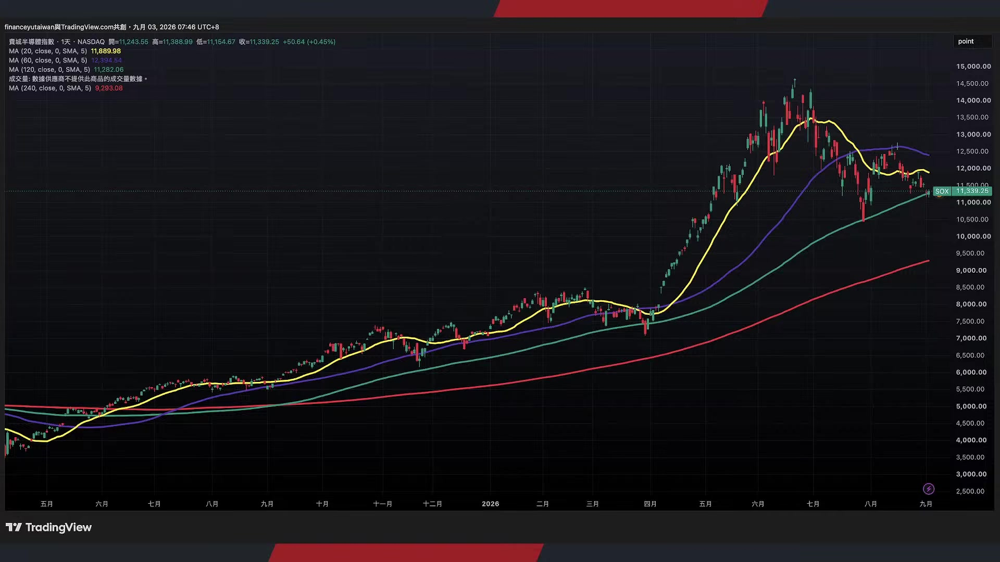

**逐字稿片段：** 昨天我才看了 統計了一下數據哇 台股今年已經上漲58%了 居然超越韓國股市 成為全球排行第一名的 市市值 唉不能講市值 成為排行第一績效的市場了 然後這很神奇 台場什麼時候莫名其妙在8月 份9月份開始領漲全球了 好所以從這件事情都說明著 其實今年總體績效還是很漂亮 可是你問很多散戶 怎麼今年還在賠錢呢 大家都買在5月6月嘛 要麼呢就是特殊族群 要不然呢 哦按照從指數角度而言 今年也痛不到哪裡去 乖離修正幅度也沒有特別大 從整個市場上財報表現來做觀察 戴爾在前天公佈財報之後 昨天正式 因為是盤後公佈財報 昨天股價狂飆了15% 每股來到492塊 表現還不錯 因為它已經成為標普500在 昨天表現最佳的成分股了 看一下是否能夠有外溢效果 這一波二季度年增幅是高達58% 營收來到470億美元 高於市場預估的448億 每股盈餘7.04塊 年增203% 好這也比市場預期的4.9塊還要來得高 非常多 所以現在伺服器就是整個大爆發了 戴爾其實也點名了 說我無法大量擴產 現在最大的瓶頸就是記憶體 dram nand 好其中當然CPU或者硬碟 電源還是有一些緊張 可是都沒有像記憶體供貨這麼緊張 好所以如果記憶體不到位 即便其他材料都到位 也無法出貨 好所以量能有上限呢 好目前就是處於一個高度稀缺的情況

**話題推測：** 顯示台股今年表現及全球排名圖表

---

## 00:07:27

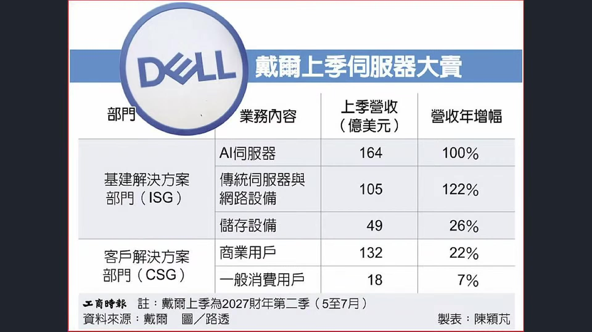

**逐字稿片段：** 那博通在昨天所公佈的 財報也優於市場預期 營收295.9億 高於市場預估的293.6億 年增幅有86% 也是幾乎翻了一整倍 每股盈餘3.3個塊 也比去年同期接近翻了一整倍 也比預期的3:20塊都還要來得亮麗 所以我們知道現一方面 伺服器的缺貨是一方面現在呢 在傳統的晶片供應商轉往ASIC客制化的 晶片的軍火商一樣在擴大市場 就是即便 它可能會壓縮輝達的空間 輝達的市占雖然可能會因此而收縮 可是輝達的營收 獲利也在創高 這就是一個增量的世界 不過我們要回過頭說 這個少數零星的財報是否 能夠成功地拖動美股

**話題推測：** 公布博通（Broadcom）最新財報數據

---

## 00:08:11

**逐字稿片段：** 這要繼續觀察 因為本波美股的下修 它有幾個原因 一方面是整個中東局勢的持續僵持 所以導致通膨的僵固性延伸 影響到聯準會的利率決策 二方面是美債市場的拋售情況 使得流動性依舊相對比較緊缺 所以即便股市彈 不管漲或跌哦 現在幾乎都沒什麼量 雖然現在好像相對於 前一年還是很多量不過呢 相對於今年上半年呢 量的確是縮的 我們必須承認的是 這個美國市場 現在所處於的僵局 尤其對於其中選舉相當不利

**話題推測：** 轉向討論美股下修的宏觀原因及中東局勢

---

## 00:08:42

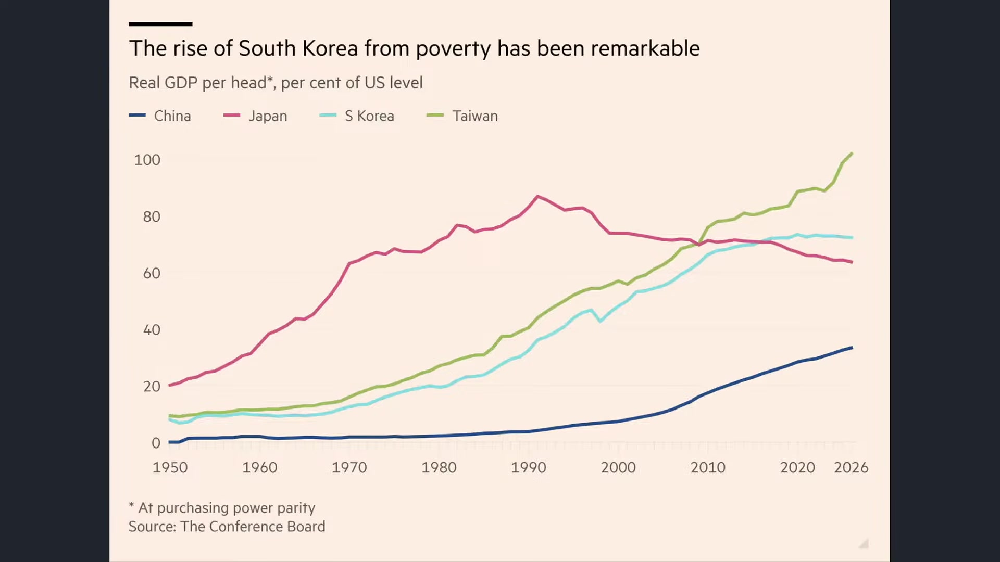

**逐字稿片段：** 短短兩個星期 川普是接連做了幾件毫不相關 但是都指向同一個方向的事情 從他8月16號 一開始是大幅縮減漢南韓的聯合軍演 8月19號對於伊朗啟動 那個經濟d day放逐行動 8月21號美加貿易談判全面破滅 到8月28號 現在又高調宣佈 委內瑞拉跟美國已經 達成了石油協定 會成立新公司 掌握55%的產量的權益 那這些事情放在一塊 好這個就是美國對於世界 的新一輪的基本態度 就是用同盟制度和經貿 關係把其他國家綁在一起 即便美國仍然擁有壓倒性的軍事力量 但是 以前呢是用這樣的一個同盟方式 現在是把直權力直接擺到桌面上 所以在這樣的一個角度下 國際關係就變成了強弱關係 那就充滿著不確定性 而這種不確定性呢 就會讓市場要求更高的風險貼水 這是它背後的一個根本原因呢 尤其我們知道 韓國的部分呢 就不用特別去做細追 因為川普後續沒有採取 進一步的一個攻擊行動 頂多就是聯合軍演天數縮短了

**話題推測：** 列出川普近期對外政策行動時間軸

---

## 00:09:50

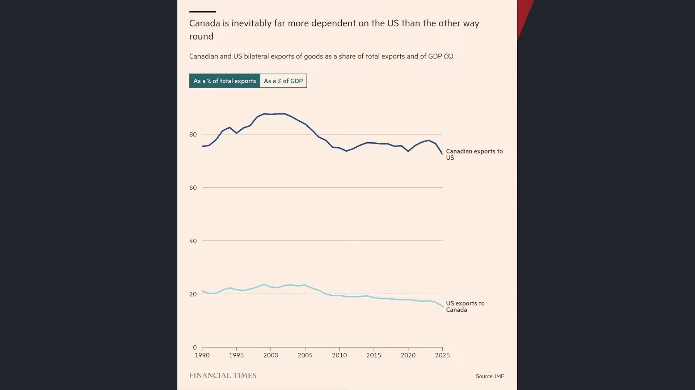

**逐字稿片段：** 加拿大的部分呢 對於美國的通膨壓力 是市場上最為關注的 因為雙方幾乎已經完全停止談判了 整個26年上半年 加拿大對於美國出口 的商品是2,148億美元 大概占了總商品出口68% 英國是9.2 所以中間已經差很遠了 加拿大對於美國的出口規模幾乎 是無法由其他市場來完全替代 不過我們知道 受到民意的影響 卡尼現在已經向川普宣佈 你不再不收回美音圖 我們完全不願意跟你做二次談判 他是 直接這樣子發表哦 叫川普不要再嘲諷了 那按照蒙特人銀行的預估 這批關稅哦 預估大概會拖累 加拿大的GDP0.5個百分點哦 所以雙方彼此依賴 加拿大經濟會受到毀滅性的打擊 而美國的通膨僵固性呢 會有更進一步的關稅傳導 那當然二戰以後 我們也很清楚知道 已經有常年的降低關稅 建立共同規則 那過去一年 特的關稅好像也沒有形成通脹失控 其實還是要講 那是因為川普在部分政策上予以讓步 所以呢 導致很多該課的關稅最後沒有課到 包括現在的IEEPA也已經正式取消 所以川普在9月底以前會有 新一輪232關稅條款的細節出爐 我們看到時候的真實影響變化 不過呢這也就說明著 如果你把 全球的主要的 領導者在環太平洋當中 來做一系列的梳理 誒你會發現比較有趣的現象 好最有趣的當然並不是 誰的支持率最高了 你把臺灣日本韓國美國 四位領導者的領袖 放在一起看 從民調趨勢來做觀察 因為川普第二任任期是 大概25年1月份上臺嘛 所以大概是一年半 好那麼這個高 南韓的部分 李在明是去年6月上任 大概是一年三個月 好那麼賴總統的部分是24年的5月上任 現在大概已經兩年是最長的 然後高市的部分是去年10月份上臺 執政大概10個月 那我們細看幾個數據如果呢

**話題推測：** 分析美加貿易談判破裂對美國通膨的影響

---

## 00:11:51

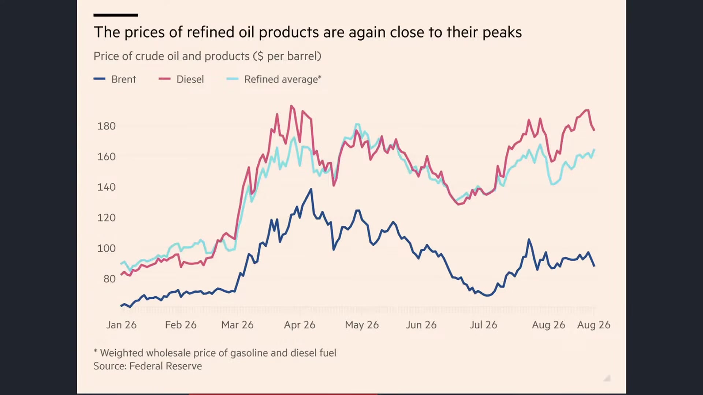

**逐字稿片段：** 先看川普總體民調的部分 如果是用平均民調加總 就把所有民調加起來 支持率 從上任初起從五成就一路的下滑 到9月2號只剩下38.2 他並不是去特別統計哪個民調 而是統計平均民調 所以如果以下行程度來看 川普的民調就從來沒有真正的反彈過 我們再看一下李在明的民調 李在明的部分呢 根據內部民調 從去年接近五成 一路降到38.9 尤其在股災之後 整個8月份下行幅度開始嚴重加大 好所以我們知道李在明在最近呢 進行高強度的內閣改組哦

**話題推測：** 詳細展示川普的民調趨勢圖

---

## 00:12:29

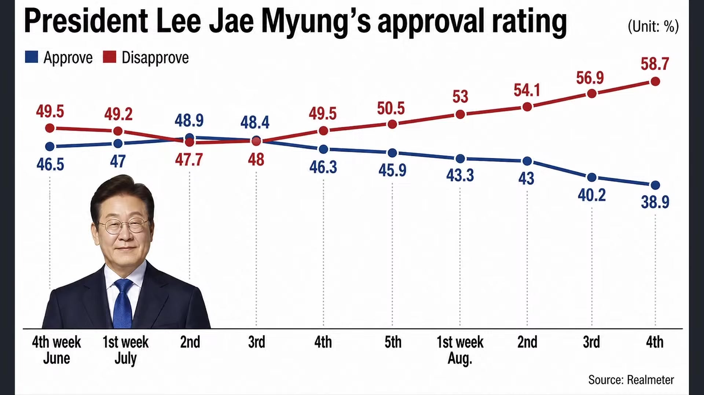

**逐字稿片段：** 再來看一下高市 高市的部分是從去年10月份上臺 支持率我 他是比較穩固的 基本就是6成到7成左右 完全動不了 這個是日本經濟新聞的 民調好

**話題推測：** 詳細展示日本高市的民調趨勢圖

---

## 00:12:40

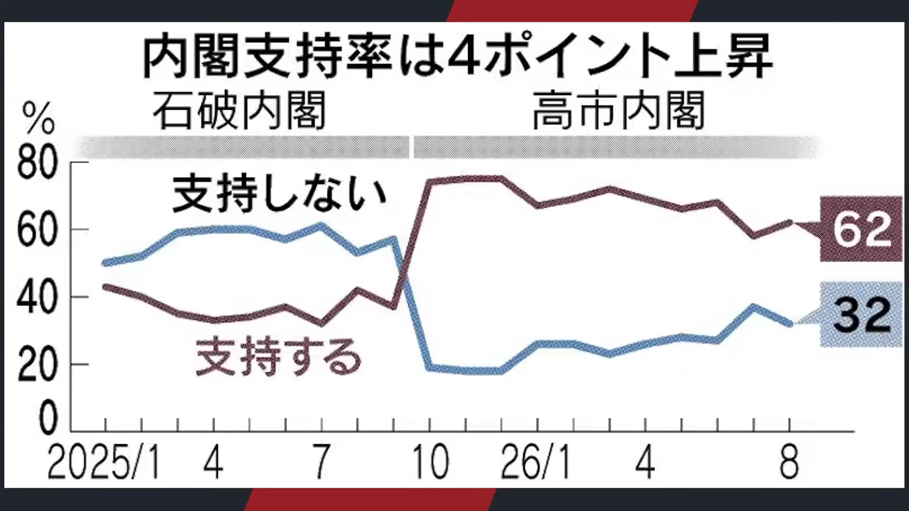

**逐字稿片段：** 那最後就當然是看臺灣 臺灣是美麗島民調 我們如果看趨勢性的 整體而言 唉還有49.9的信任度 尤其是去年下滑之後 今年開始大幅的反彈 好那是不是跟財富幻覺或者跟普發 現金也有比較高的一個密切聯繫 這是觀察 可重點我們當然不能夠 說用高氏的民調來比 川普的民調 我們要比的事情是 從趨勢性來做觀察的話 川普跟其他三位領導人呢 相對互有波動的情況來看呢 它是平均式的下滑 它從來沒有好轉過 我們要呈現的是這件事情呢 對台日韓美領袖的民調 現在的分化 四條民意曲線的走向也完全不同

**話題推測：** 詳細展示臺灣總統的民調趨勢圖

---

## 00:13:18

**逐字稿片段：** 川普川普肯定是有壓力的哦 我們當然知道川普當時所 發動關稅戰的根本原因呢 是進行新一輪的製造業的回流 那的確現在美國製造業 也出現了適度的回檔 工廠活動已經連續6個月擴張了 7月到8月來到4年來的最強 今年製造業增加了 3萬左右的工作人口 可是我們必須承認 就這一波的成長並不是 傳統紡織傢俱或者因為關稅 客增而回流的產業 撐住的都是哪一些 都是AI都是晶片和伺服器 航太國防 所以在這樣的一個效果底下 關稅所帶動的製造業回流 基本上 其實並不是製造業回流 是關稅讓很多AI公司到 美國市場做更進一步投資 而擴張了AI工作的基礎人口

**話題推測：** 討論川普關稅戰與美國製造業回流的關係

---

## 00:14:06

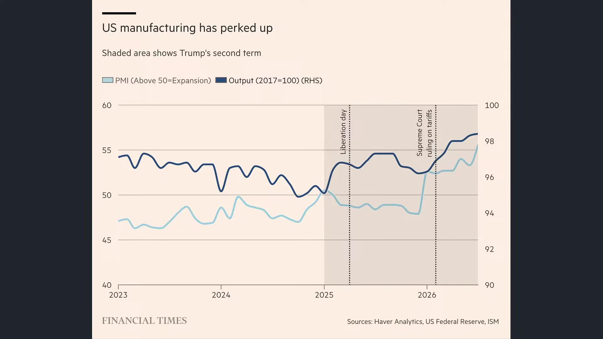

**逐字稿片段：** 我舉例來說 你像最近臺灣企業赴美 投資已經很明顯加速了 經濟部在最新的盤點 過程當中已經確認 現在在今年下半年正在規劃 或者已經前往美國投資的財廠 在今年以來總金額是550億美元 大概是新臺幣1.74兆 這個數據 是特別剔除掉台積電之後的結果 好相對於今年5月份本來預估350億 短短三個月又增加200億了 這兩個月也沒做什麼事情 川普也沒有比較高強度的動作 可是所有臺灣的廠商 都在加速赴美投資 事實上不只是科技業啦 你像生技能源現在也是 提高赴美投資佈局的意願呢 一方面美資是同步的加碼臺灣 你也知道 最近Google又擴大在臺灣的廠區 已經算是美國以外的第二大的 廠區了那另外一方面我們看到美光的 部分也是加碼了接近75億左右 輝達投資聯發科35億嘛 那現在並不是單純的臺灣資金外移 是台美之間的資本和 產業鏈互相的綁定 那你說有沒有川普的呼籲或者誘因呢

**話題推測：** 臺灣企業赴美投資加速數據圖表

---

## 00:15:08

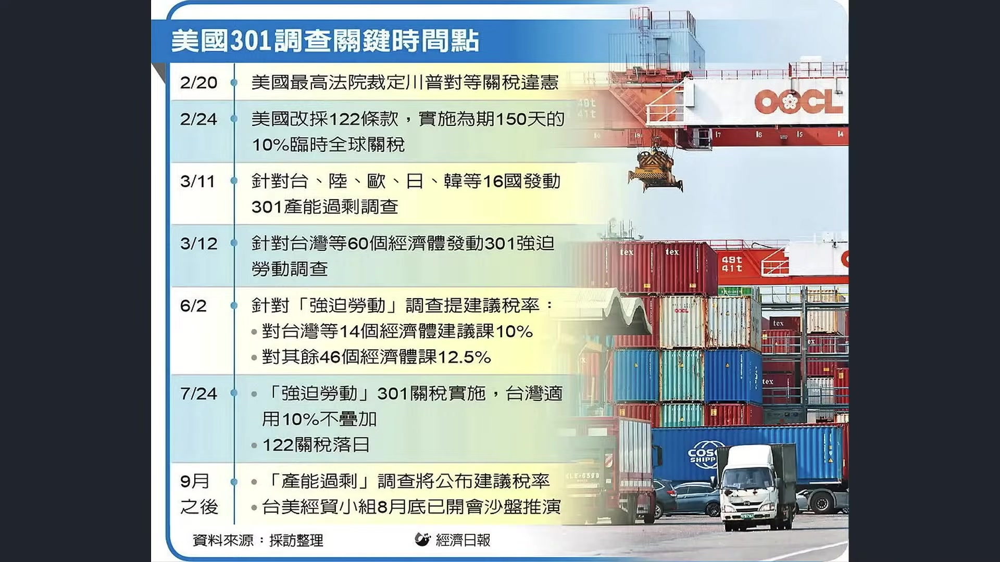

**逐字稿片段：** 他的敦促當然有關係嘛 因為美國301關稅 本月月底就要先排了 那你說關稅戰不是結束了嗎 誒那是IEEPA已經結束了 因為已經被最高法院正式判定失效了 所以關稅正在退回了 可是針對產能過剩的301調查 現在預估9月底 尤其是川習會前後 隨時會出爐 那臺灣大概是三種的沙盤推演嘛 基本上來看的話 因為臺灣今年前7月對美國 的出超規模已經很大了 被美國點名的可能性是蠻高的了 必須承認 因為實在賺太多錢了但考量 因為之前已經簽訂對等貿易協定 而且臺灣都是履行承諾 像韓國 這個有時候會有點僵持 所以回到15%應該差不多 那另外兩種劇本是一好一壞 較差的就是高於15% 甚至高於日韓的競爭對手 那就必須要做更進一步的投資 那比較樂觀的就是 因為我們之前臺積電已經加持了嘛 所以搞不好比臺灣 15%更優惠的條件 可是 從目前來看 政府主要追求的是15% 然後不疊加 保持原樣就好了 只要不要比日韓高 我們都可以接受 這個是目前執政端的一個態度 可是我們也知道 美國製造業看起來是復興了 但增加的 其實是產量產能 但是並不是大量的工廠工作 這是要當中的區別 我們要解釋為什麼關稅戰 明明達到了一定的效果 可是民意的反應卻相對比較疲憊呢

**話題推測：** 分析美國301關稅對臺灣的潛在影響

---

## 00:16:30

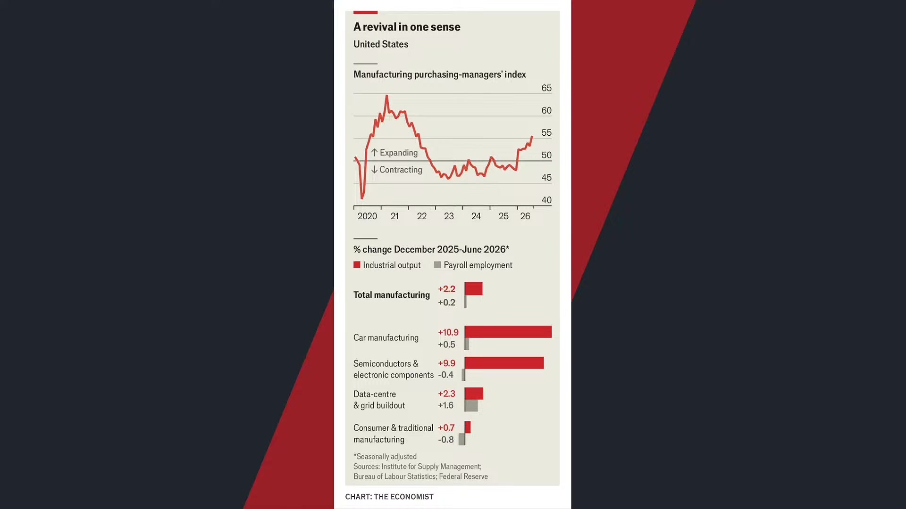

**逐字稿片段：** 我們舉一個最直觀的速度 整體去年12月份到今年8月份 美國的汽車產量大概就增加 9%左右而已 占製造業增幅大概1/4 那川普當然可以把 部分的功勞推給關稅 因為福特通用 正在把加拿大的廠或者 墨西哥的廠移回美國 可是真正推動這一波成長的 其實更類似於之前22年23年 供應鏈中斷之後的正常化 那更為重要的事情是 真正大幅成長的都是電子零元件 還有要蓋電子零元件 資料中心的水泥廠 資料中心的冷卻設備 這些都是以20% 30%的速度高速上行的 哦所以美國整體 其實基礎工作並沒有快速上升 它一樣需要有一定程度的學歷就 美國藍領 可能很高估了自己在 川普政策當中的位置 以為製造業回流 工廠的工作就一定會回來 那自己就重新成為美國經濟的主角 那川普喊關稅 製造業復興嘛 工人優先嘛 很多勞工當然會把自己帶入這項劇本 但現實是什麼 其實大多數的傳統勞工 就業機會並沒有因此而暴增 而這也可以反映出來為什麼 那麼多美國民眾有點反智教中心呢 因為都是AI 都是晶片 都是資料中心 那企業最需要的是什麼 自動化人才 工程師高技能人才 找不到就從臺灣引進 就從臺灣直接做引進 並沒有大量大批的裝配線上的工人 所以製造業的產量是增加了 可是就業我們知道這幾個月 算是還蠻溫吞的 甚至有點疲憊 所以我們才必須承認 那很多藍領真的覺得 自己是復甦的主角 到現在還這樣認為哦 可是從就業數據看起來完全 沒有跟AI有任何的聯動 有時候人總是會高估 自己在別人心中的位置 那很多藍領真的覺得 自己是本場復甦的主角 可是從實際數據來看就是 你就沒有受惠 那之前呢 網路看到一個故事 講一個男的喝醉了 半夜敲門 他老婆就問誰呀 老公說 是你最喜歡的老公 他老婆很生氣嘛不開門 你每次都喝醉才回來 那男的說 可是我今天帶了一束花給 世界上最漂亮的女人呢 他老婆一聽就心軟了嘛 趕快開門 結果一看 手上根本沒有花 他老婆問那花呢 那男的看了她幾秒 那世界上最漂亮的女人呢 所以人總是高估自己 在別人心中的位置 藍領呢在美國市場當中 他的確還是川普政策的鐵票 可這一次的期中選舉就是要去驗證 那你到底覺不覺得你的 就業機會因此而增長了 從數據上來看 很明顯是脫鉤的 搞不好從心態層面來看 他們還是願意投票呢 這是我們值得觀察的其他方向

**話題推測：** 美國汽車產量增幅數據圖表

---

## 00:19:08

**逐字稿片段：** 那回過頭來看第二個 觀察重點來自於 正由於這些因數 美國經濟看起來宏觀 數據表現還不錯 那通膨又有僵固性所以 華許現在被市場解讀 為放鷹就可以理解 可是更重要的事情是 日本央行目前所採取的新動作 我們看日本央行昨天審議委員會 高田創事 事出了非常顯著的 更強烈的升息訊號 好這一次他已經表示 未來的升息幅度 不一定會固定在0.25個百分點 就不止升一碼 甚至不排除連續升息 顯示日本的貨幣政策現在已經 很明顯進入到更積極的正常化階段 好這很明顯是黑田 敦促之後的結果 消息公佈之後日元呢 升到1美元兌接近160日元 市場也越來越明顯預期哦 9月18號的會議 一定會升 哎搞不好會不會意外的升兩碼呢 還是升一碼半呢 好因為升息壓力 是來自於通膨和日元的疲憊同時存在 日本央行兩%的目標大致要達成了 所以基本上已經徹底擺脫通縮了 但是中東局勢又在往上推 所以日本現在10年 期公債殖利率正式突破3% 來到30年新高以後 我們都很清楚知道 央行的緊縮政策已經成為趨勢 所以日本央行已經領先美國 開始進入到高強度的升息 可是另外一方面

**話題推測：** 轉向討論各國央行貨幣政策

---

## 00:20:27

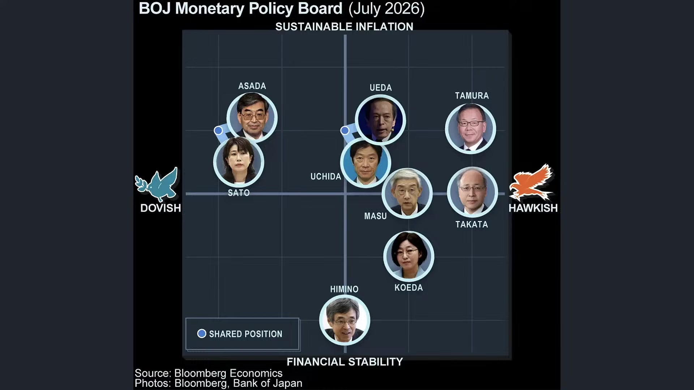

**逐字稿片段：** 韓國央行這一次也 採取了預防性升息 我們知道韓國這一次 雖然沒有什麼太大意外 可大家關注的是下一次 因為這次關鍵性 它是預防性 而韓國央行的態度不是說 現在通脹失控我才要出手 而是他相信按照這種 經濟成長的速度 遲早通脹會失控 所以韓國央行提前進行 貨幣的緊縮 避免外部成本進一步傳導到 國內的物價和通脹預期

**話題推測：** 韓國央行預防性升息的決策

---

## 00:20:52

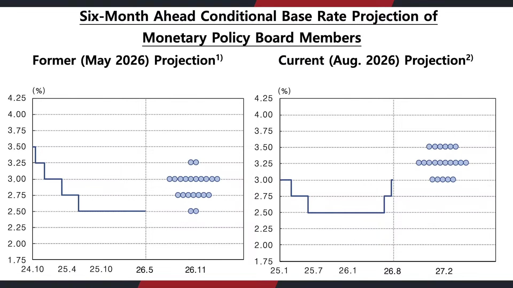

**逐字稿片段：** 的確南韓出口這段時間也是大爆發 8月份的出口年增幅是68.7% 來到982.6億美元 這比預估 值高非常多 你看從去年年底到現在 那韓國是從衰退邊緣一路 到現在是史詩級大暴增 那當然從這樣的效果來看 等同於日本央行的升息 南韓央行的升息

**話題推測：** 韓國八月份出口年增幅數據圖表

---

## 00:21:14

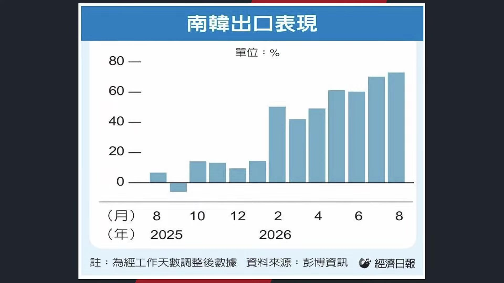

**逐字稿片段：** 接下來過兩周就變臺灣了 臺灣現在就處於比較尷尬的窘境嘛 我們過去提過

**話題推測：** 探討臺灣央行面臨的升息窘境

---

## 00:21:20

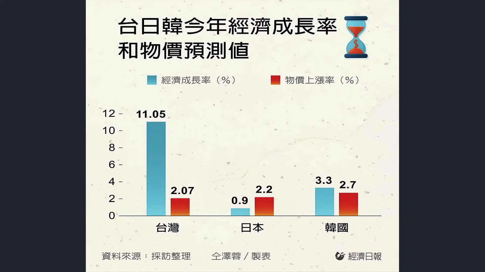

**逐字稿片段：** 你看臺灣的 物價在最新8月份已經來到2.5了嘛 日本是2.2 韓國是2.7 所以我們的物價其實都差不多 那他們都已經升息了那第二 日本經濟成長也不過0.9 韓國是3.3臺灣呢 11.05從數字上來看 臺灣早就已經該高強度升息了 還升你的三倍 因為我們經濟成長比別人實在強太多 那 央行有沒有可能有其他顧忌 有些人說央行可能顧忌 不是 現在升息對於台積電 對於聯發科又沒影響 這兩趴 那上升到2.5% 對不對這個質押利率 2%上升到3% 我一年要賺兩成的 只加了一那才上一漲一%算什麼 所以升息很多人會覺得 傷不到科技業 無法達成景氣抑制效果 但是民間消費已經很疲憊了 你到時候傳產借很多錢的 中小企業借很多錢的 如果升息是傷害到他們呢 那是不是對於低毛利又靠銀行 融資的企業產生第一波的侵蝕獲利 有些人的看法是這樣子 為央行目前的動作緩頰 因為我們總有一股感覺就 好像央行不太可能像 日本或者韓國那樣升 明明我們的經濟成長 是人家的4倍到5倍哦 不過呢從市場投票來看呢

**話題推測：** 臺灣、日本、韓國物價指數對比圖表

---

## 00:22:30

**逐字稿片段：** 先看原理 NCD利率 也就是目前長期起的 定存單利率已經上升到1.6%了 相對於3-4月份的1.3 有非常顯著的拉升 什麼意思 很明顯 市場開始投票了 投央行9月份會馬上升息 這個是市場的看法 那到底是升半碼還是升一碼呢 你看日韓 那經濟成長才一%兩%三% 那都升一碼了 那照理這個照理來講 臺灣央行要升三碼了不過呢 升個一碼能夠意思一下也不錯了 我們真正要關注的重點來自於 因為臺灣的景氣情況 的確是前所未見 一方面我們從失業率來看

**話題推測：** 臺灣NCD利率上升圖表，反映市場升息預期

---

## 00:23:07

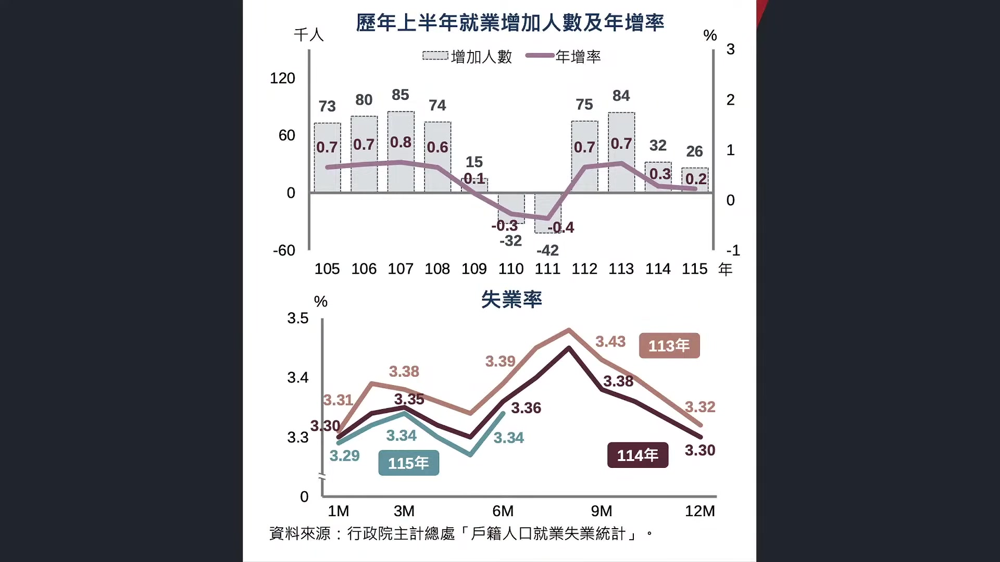

**逐字稿片段：** 目前來到3.3% 創下本世紀以來的最低 臺灣薪資的部分呢 實質薪資大概是6年來的最佳 所以本身不會有那種一升高利息 然後就受到全面性的失業暴增 或者實質薪資的大幅衰退 加上哦 現在市場上真正會遲疑的關鍵點呢 其實來自於房地產市場 就是認為房地產市場哦 過去兩年呢 其實都是越來越寬鬆的 就是陸續鬆綁 或者加長你的購物時間換屋時間 那現在六都的 房市的買氣大概跌到 了10年來的低點 今年整個上半年 6都買賣移轉棟數只有9.7萬棟 所以以706萬戶來做計算 以臺灣整體市場來看 家戶購物比大概只有1.4%哦 那100戶哦 只有一戶到2戶準備要換房或者買房 好這個是 誒這個可能是本世紀最低哦 我從來沒有看到這麼少人要換房過 正常來講景氣這麼好 應該很多人急著要換房了 我們講的不是新買盤我們講 唉你賺那麼多錢 你是想換更大間呢 因為想生小孩換更大間呢 目前看來也沒有 我覺得這就很極端 那股市漲成這樣 房地產這麼疲憊 所以很多人的說法是 可是房地產政策的寬鬆 是過去一年來的主流 它的確是越來越松 那大家都在等第二戶的房貸 成數什麼時候回到7成嘛 那要如何在房地產市場的放鬆跟 央行應該要緊縮當中取得平衡呢 哦從原理來看哦 應該要是升息 還要升兩碼三碼 蓋過日日本央行 蓋過南韓央行 然後房地產繼續緊縮 看起來這是原理哦 但是為了折中 我們也知道在選前 央行肯定也不想得罪行政部門嘛 最好的做法是什麼 折中升半碼 放鬆信用管制 這是我的大膽預判 這只是公允而論 那不涉及什麼公平正義的問題 我們講的是 你要去糾結說 那央行最後會採取什麼樣的措施呢 折中方式就是升半碼就好 然後解除信用管制 大家都開心 房地產市場終於得到舒緩 那另外一方面 整個利率環境 至少往緊的方向走 可是這件事情也就說明著 整個市場上更進一步 關注的是整個遊資的動態 如何做有效的抑制呢 因為臺灣現在最大的問題 就是以防熱錢過多 重新流回到房地產 或者持續把股票市場給推高 你說流到股市也沒有什麼不好 可是你要知道 臺灣的檔數就這麼少 如果錢全部流到股市 本益比就會失真 那對於未來AI的修正過程當中 就會形成極大壓力 那流到房市 好那央行肯定更不願意了 頂多讓你喘口氣 但是絕對不能讓房價又 產生新一波的大漲 所以現在最大問題就來自於 錢就是這麼多

**話題推測：** 臺灣失業率創本世紀新低圖表

---

## 00:25:50

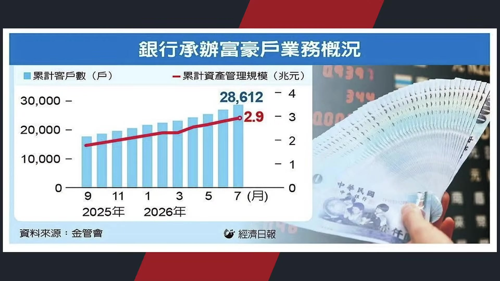

**逐字稿片段：** 錢要流到哪裡去 我們過去提過 現在是錢淹天靈蓋嘛 臺灣這幾年出現大量的new rich 少年股神或者科技新貴 按照金管會的統計 國營23家的高資產管理 規模已經來到了2.9兆 距離3兆大概就一步之遙 客戶數 在短短幾年內已經來到 2.8萬戶朝3萬戶的里程來做前進 過去我們提過 因為這一次臺灣內部的轉型 有不管是高雄亞資中心 已經成立了接近一年了 大量不管是海外客人還是高資產 客戶的理財需求就越來越強勁

**話題推測：** 討論臺灣「新富階級」及熱錢流向

---

## 00:26:25

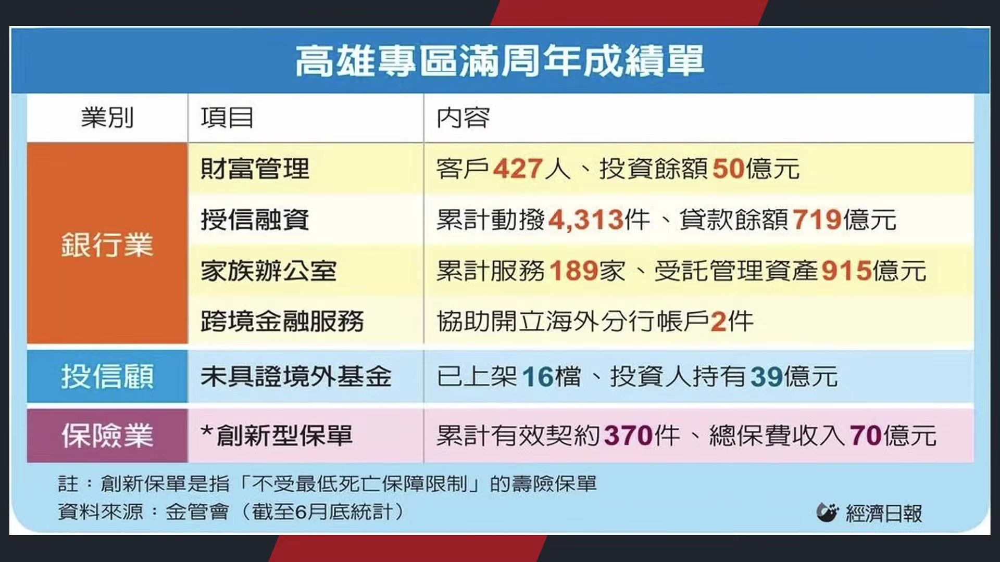

**逐字稿片段：** 超額儲蓄也是如此 今年超額儲蓄大概會突破9兆了 好這個就是1950年有統計以來的新高 那重點是過去我們提過

**話題推測：** 臺灣超額儲蓄突破9兆數據圖表

---

## 00:26:33

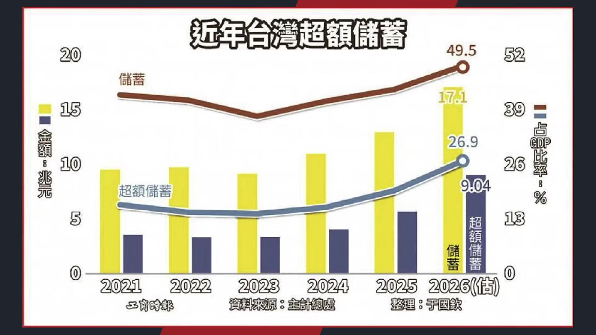

**逐字稿片段：** 超額儲蓄率也創高了 26.9 這比去年的19.8高非常多 這筆錢就是還沒有用於投資的錢 當然有一部分是企業的超額儲蓄 但至少可以承認呢 市場上全國所創造的所得遠遠 高於當前消費和投資的支出 就是你該消費也消費掉了 該投資也投資掉了 那留在金融體系的錢 以非常驚人的速度上行呢 那你要麼就一直往上走 要麼就是一定會有更大的 誘因往投資市場來做投放嘛 所以這批人呢 錢到底會流到股市 推高股市及其 還是流到房市呢 還是流到海外資產呢 我們過去提過

**話題推測：** 臺灣超額儲蓄率創新高圖表

---

## 00:27:10

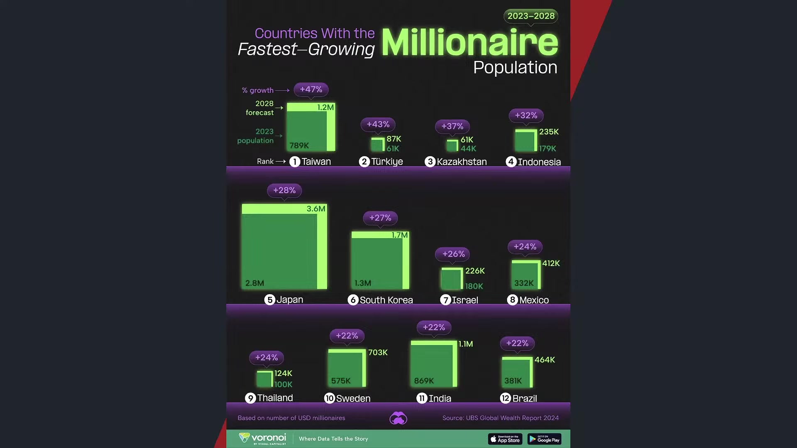

**逐字稿片段：** 過去5年 全球的百萬美元富翁 我們講的是淨資產呢 也簡稱科技新貴或者new rich 臺灣目前的增速是排行第一名 在23年是78萬人 我們預估在明年會達到120萬人 臺灣正在創造一整代的科技新貴 這個速度 是全球排行第一名的 那當然了 這就說明有部分人呢 他是用資產來賺錢 但是臺灣呢 有更大一部分人現在用薪資 他就足以晉升到資產階級了 我舉兩個角度了

**話題推測：** 臺灣百萬美元富翁增速全球排名圖表

---

## 00:27:40

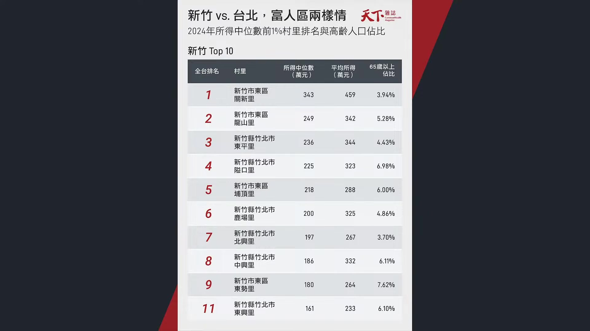

**逐字稿片段：** 一個是所得中位數 前一%的村裡排名 來做觀察你看 新竹top one了 所得中位數 從年薪來看的話 東區的關心里是343萬 然後龍山里249萬 竹北的話有236萬 225萬 然後東區的埔頂裡218萬 因為我在新竹念書嘛這些裡 走進去那就是一個新的世界 必須承認在新竹裡頭 那臺北市就不一樣了 臺北市你看 剛才我們看到的new rich 這些新竹的裡 65歲以上占比 3% 4% 100個只有3-4個是老人家了 我們看一下臺北的老錢 臺北現在最有錢的是內湖的寶湖里 整體而言 所得中位數 118萬 其實比新竹已經低蠻多了 可是中正區 你看建國里 大安區龍門裡 100多萬100多萬算偏高了 因為人口多嘛 可是65歲以上的占比 誒都是16趴到20趴左右 哦這說明一個是老錢在臺北 一個是new rich在新竹 形成進一步市場上廣泛性的遊資氾濫 所以如果都是老錢呢 那他可能有自己的資產配置 他那個ETF的買盤呢不夠大 可現在就是很多new money嘛 遊資過剩 那這個也是央行必須要注意到的 流到任何一個資產 央行都必須要有所顧忌 錢多到什麼地步 錢就是多出來了 可是房地產市場不好 這說明錢雖然多出來 可是現在主要的焦點 都還是集中在股市 所以房地產市場還是被冷卻了一下 那要不要稍微 這邊開一下水龍頭 那邊關一下水龍頭 誒這是可以值得觀察的重點了

**話題推測：** 新竹地區高所得里別排名圖表

---

## 00:29:13

**逐字稿片段：** 我們再舉一個更直觀的例子 因為市場通常都知道 現在最好賭的地方 都不是其他市場了 就是股市 導致了一個結果誒

**話題推測：** 轉向討論臺灣詐騙案件數據

---

## 00:29:21

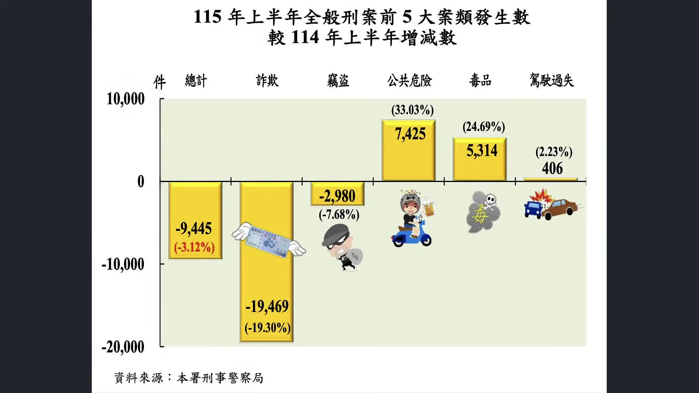

**逐字稿片段：** 詐騙案大幅減少 我們看在過去一年當中 整體而言 按照打詐儀錶板的數據 我們的受理數已經減少了43% 財損數減少71% 按照臺灣的經濟成長 照理來講應該 詐騙金額要創高才對 但是沒有人被詐騙了為什麼 因為都被股票騙嘛 那更直接 所以你可以觀察到很有趣的效果 那就是整個連詐騙總體 財損金額其實都在快速收縮 當然了一大部分我相信是那個ATM 現在不能夠蒙面了吧 不能夠戴口罩領錢了 所以可能達到非常好這個 洗人頭降低的一個效果 要不然從人均現在淨詐騙財富來看 還是排行前幾名的 我們舉例來說 這是日經的報導 過去一年臺灣的詐騙 損失大概是28億美元 大概是886億 亞太地區排行第三呢 僅次於中國大陸和南韓 那還比日本高 比澳洲高 所以從人口角度來看 平均詐騙金額應該是最高的 那過去 有很多人是從事詐騙相關產業嘛

**話題推測：** 打詐儀錶板顯示的詐騙受理數與財損數下降圖表

---

## 00:30:23

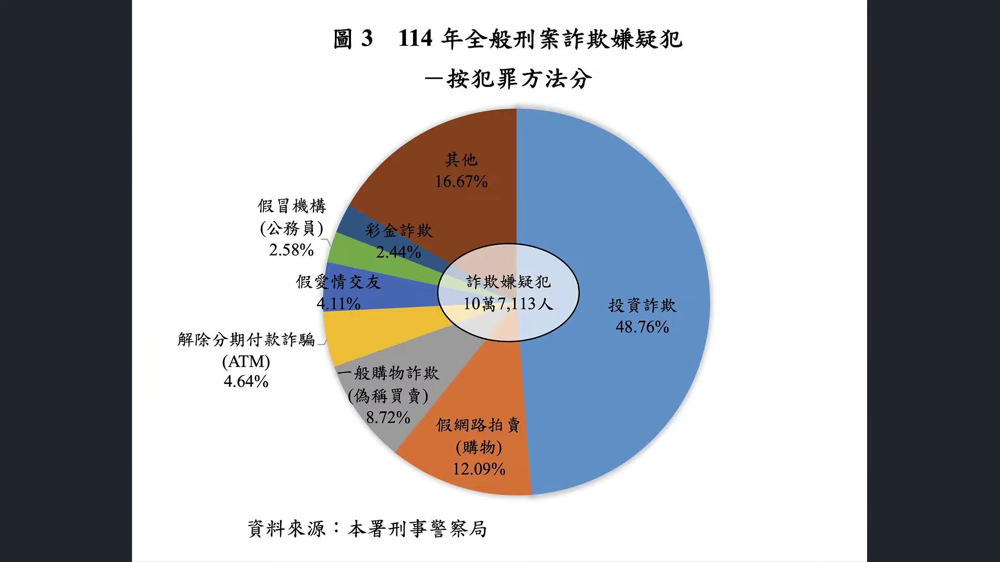

**逐字稿片段：** 我們看去年抓到的詐騙嫌疑犯 在臺灣大概是接近有10萬人 今年預估會減少哦 那為什麼減少 去股市詐騙那更好嘛 那誰要去做傳統詐騙 去股市操作賺更多錢 另外一方面 我們看青少年的部分 12-17歲的詐欺嫌疑犯大概是2,900人 那現在18-23歲是1.4萬人 其人數都不小 其實很多都是車手了 本身可能也沒有太大的犯意 就是想要做 零用錢的賺取而已 全臺灣的金融幾十帳戶 兩年前也不過3萬到4萬戶 從去年開始就是15萬來起跳的 那詐騙當然買房要買台積房嘛 買股要買台積電那詐騙 要找工程師嘛

**話題推測：** 臺灣詐騙嫌疑犯被捕人數圖表

---

## 00:31:04

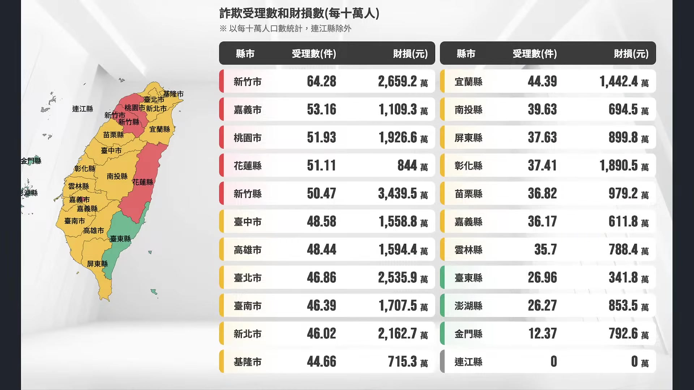

**逐字稿片段：** 我們看從打詐儀標板的數據 詐騙集中度 其實都是集中在 竹北地區或者新竹市 新竹市是最高的 每10萬人受理是64件 那竹北市金額最高 財損金額是每10萬人3,439萬 排行第一 好那 哦那馬主人的好像都沒被騙呢是0呢 受受理數是0呢OK 好那不管怎麼說 我們想就是那股市更好賭嘛 那當然了 某種程度而言 吸走了部分的資金回到股票市場 連詐騙金額都開始變少了 我看了一下8月份的詐騙排行榜 誒很有趣的一個數據哦 色情應召詐財的詐騙數量 第一次起到排行榜當中 8月份有889件了 從件數來看呢 這代表著色情應召的詐騙 在8月份是明顯的升溫 快速成為高頻詐騙的手法 因為你要騙錢呢 你已經騙不到我了因為 我更容易被股市騙走 不如去炒股票 不過你要騙色誒 就開始擠入到名單當中 而且8月份對不對 那個天氣炎熱 那很多客戶凍未條 對精蟲沖腦 受害者大增

**話題推測：** 詐騙集中度地區分佈圖（新竹區）

---

## 00:32:09

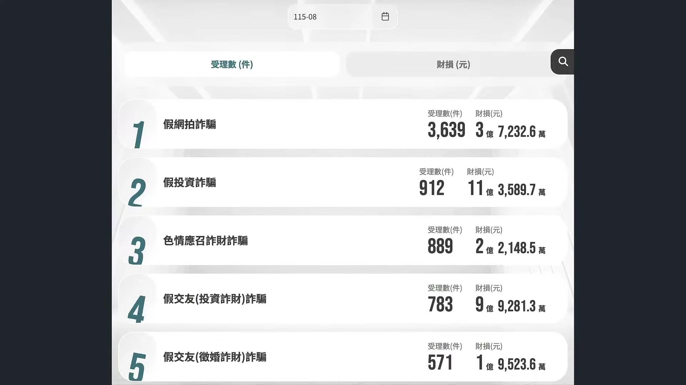

**逐字稿片段：** 昨天我看到一條新聞了 是ET today的報導 是臺北地檢署偵辦了 一起大型AI愛情詐騙案 檢方指控黃建豪夫妻 從22年起籌組詐團 透過交友軟體尋找男性被害人 先以低價保健品測試是否上鉤 然後再用美女照片 AI模擬女生 真人公關小姐營造戀愛關係 進一步買手機空氣淨淨機珠寶 這個都沒什麼問題 這個就是傳統的伎倆 重點是該詐團用變態手法控制成員 業績未達標的男女成員被罰互相 精液漱口 前後2萬人被炸9億元 哎 2萬人 這人這麼多的嗎 臺北地檢署昨天已經依照 加重詐欺等罪起訴57名被告 那黃健豪被要求求刑25年以上 很少詐騙也判那麼高的哦 好像這件事情非常嚴重 不知道的還以為是什麼AV新企劃 拍電影呢 霸王別雞 對難怪業績都不達標 那感覺好像是懲罰 其實是一種福利真是 肅然起敬 那更嚴重的事情就是用 這種極端方式的管理業績 肯定有有這做電極嘛 那被被強瘦 有一些性侮辱嘛 這些 除了詐騙等相關的一個資訊以外 其他也會有相對的附加代價了 是這樣漱口 那是要幾個人的量才 可以到漱口的地步 我要講的概念就是哦 連詐騙行業都無法興盛了 錢都跑去股票了 你知道嗎 OK所以我們講了很多 這些游資的動態 都足以說明著央行 在本次9月份 升息它是一個很正常 必然必須要發生的跡象 可是我們從體感溫度來看 那大多數人都不太相信央行會升 哦那背後當然有一些政治的考量 因為的確 這年底地方選舉已經很接近了 那是否有必要的進入 到高強度的升息 來引得市場上有進一步的資金收縮 因為升息的預期 其實升不是重點 利率才關一直都不是特別高 額度才是哦 你申了之後 很多券商就會自己停止額度了 沒額度這件事情呢 對於股民 對於房貸市場而言 是否會保持著進一步的緊縮效應 好這個是大家可以觀察的其他方向

**話題推測：** ETtoday新聞報導一起大型AI愛情詐騙案

---

## 00:34:26

**逐字稿片段：** 聊的範圍很廣 今天台股上漲340點 在收在46,508點 我們聊的範圍一開始是從整個 美國股市的概況來往外延伸的 我們知道現在川普所面臨的挑戰 還有製造業的回流 它達成了一定程度的回饋 可是本身而言 我們很清楚知道製造業 和美國經濟的大爆發 跟就業人口的增長是 有非常明顯的落差的 從民調趨勢也看得出來 在整個環太平洋當中 那民調最低的就美國總統了 好這第一個觀察重點 那第二個呢 是目前日本央行的 升息動作已經全面展開 嘗試著進行日元的護盤 韓國央行採取了預防性的動作 某種程度也都奠定著 本月份是一定會釋放緊縮臺灣 就算他不升哦 他都必須要告訴你 我即將要升 這是很明顯的差別只在於他 要不要現在立即就做出代價呢 還是等到下一次李堅士會議 12月份以後再說呢 好這個就是市場上不同的解讀了 但至少可以看得出來 似乎所有的外在條件 都在告訴臺灣央行 你差不多該升了哦 給投資朋友做些思考 如果像我們節目 記得幫我們訂閱 按讚加分享 我們就明天早上8點半 早晨財速解讀再相見 祝各位投資朋友看盤順利 操盤愉快

**話題推測：** 總結今日台股收盤點位

---
