# yutinghaofinance_U4RH_CPe3GQ — 關鍵畫面索引

- 來源逐字稿：[yutinghaofinance_U4RH_CPe3GQ_FIN.srt](yutinghaofinance_U4RH_CPe3GQ_FIN.srt)
- 影片：https://www.youtube.com/watch?v=U4RH_CPe3GQ
- 截圖數：30

## 00:00:35

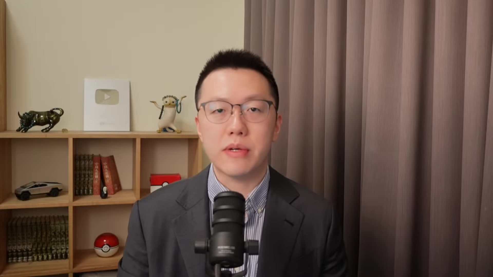

**逐字稿片段：** 困霸數錢啦,沒有股市這一次週一的上漲,納斯達克指數已經創下收盤的新高了。 那你要知道,最近原油價格雖然從高檔開始回落,美國公債殖利率也是稍微回落, 不過總體而言 其實整個高利率的環境 還有中東的地緣政治緊張局勢 並沒有因此而降溫 好那美國股市沒有在害怕的 昨天費城半導體指數甚至大漲了4% Intel大漲了12% AND漲幅有10% 市值也來到1兆美元了 Meta更是飆漲了11.4% 大家都在發力 其實美國現在原油 即便昨天是重疊了4.5% 每桶現在都還是有95塊 比過去幾個月都還是來得高 布蘭特原油昨天下跌3.4% 每桶到現在都還有一百塊 美國股市沒有在怕高利率的 其實美國股市現在最大的矛盾 就是指數的確表現還是相對不錯 但底下有很多股票沒有這麼好做

**話題推測：** 納斯達克指數創收盤新高

---

## 00:01:30

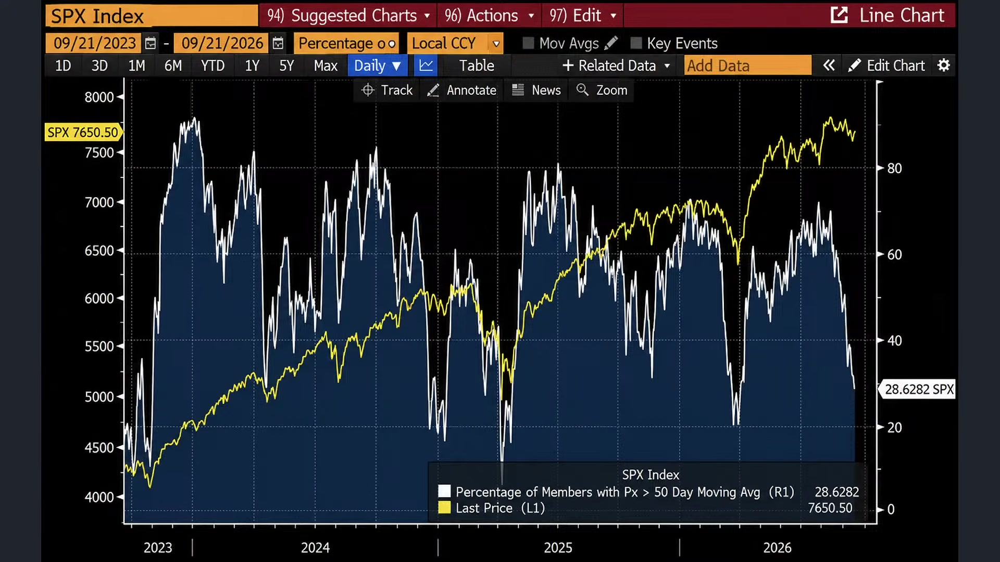

**逐字稿片段：** 目前不到30%的標普白指數 是站在50日均線之上 這說明著市場的廣度 還是比較明顯惡化的 就是從均衡來看 它主要由少數的個股來帶動來向上攻 那的確如果是從投資人的心理情緒來看 沒有股市的情緒位階 也沒有想象中來得高 這一波的創高跟前幾個月的創高 很明顯感受到心理情緒不太一樣 前幾個月是追高 這幾周或者說這兩天 是莫名其妙又創下歷史新高了 那支撐指數的關鍵還是企業的獲利 因為標普500指數第二季的美股盈餘 年征服大概是51% 過去四季累積征服是26% 同時預估本益比也大概從前一波的23倍 現在大概已經下滑到19倍了 這大概是10年的平均值了 如果你只看後疫情時代 就是2020年以後 那其實現在本益比就不是特別高了 相對之下

**話題推測：** 標普500指數站上50日均線的股票比例

---

## 00:02:29

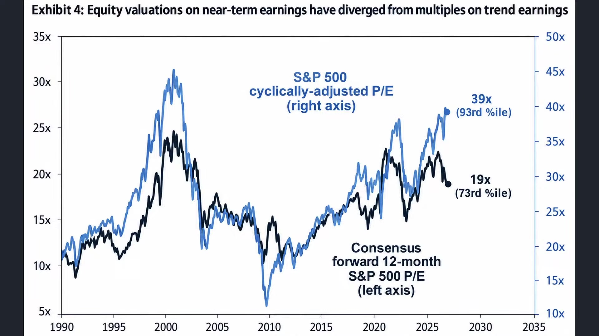

**逐字稿片段：** 我們看到美國股市在這種高強度的獲利拉伸以後 整體而言跟2000年的本益比周期來做比較 就沒有這麼離譜高了 何況正常來講 在2000年和08年的經驗以後 通常市場願意給予泡沫更高的本益比 就以前可能覺得20倍就很高了 現在一檔股票25倍30倍 勉強都可以接受 這就是對於未來市場有樂觀預期 所以給予你更高的評價 所以不管是從水平比較來看 還是從垂直比較來看 雖然指數是創新高了 但是就如同我們過去的利潤 即便現在納指創新高 它都還是低極期 就是這麼離譜 因為獲利上升的速度實在太快了

**話題推測：** 美股本益比與2000年泡沫比較

---

## 00:03:09

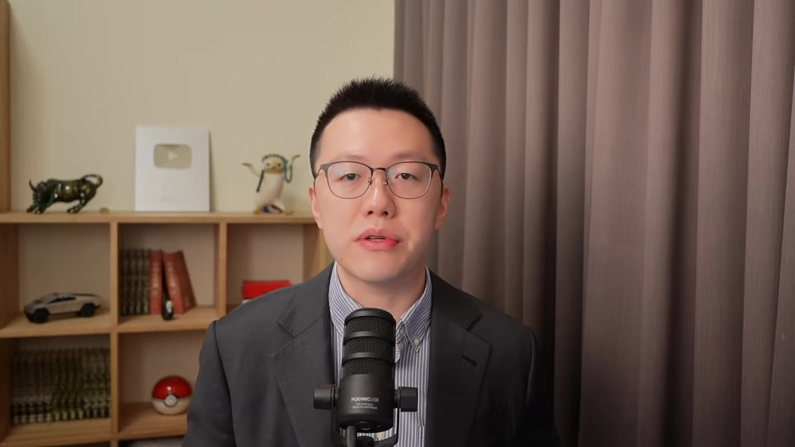

**逐字稿片段：** 我們以前在聽友會 也曾經跟投資朋友針對不同指數 來看待他們的前瞻本益比 基本上要估前瞻很好估 以前要估未來一年 你就害怕會估錯了 為什麼 因為景氣變動太大 現在資本支出訂單都已經幾乎全滿了 你基本上已經開始摸透 比如說臺積電 明年的EPS要怎麼估 就是假設產能利用率 全部到100%可以有多少 因為訂單已經滿了 當然原油價格一跌 美國股市就開始上漲

**話題推測：** 預估前瞻本益比與臺積電獲利預估

---

## 00:03:39

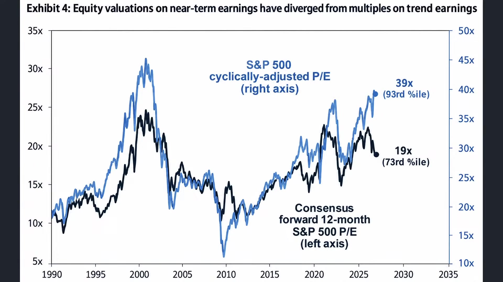

**逐字稿片段：** 川習會前 是否代表著市場正在重新壓住風險降溫呢 油價這一次已經連續5000下跌了

**話題推測：** 川習會前的市場預期

---

## 00:03:47

**逐字稿片段：** 那美中談判現在又釋出了一點訊號 似乎雙方在AI的共同談判當中已經取得框架 那這一次能源價格的降溫 當然是美國股市第一波噴出的重要關鍵 但另外一方面 像美伊的外交接觸是否有可能出現可能性傳出力度 川普也表示可能在聯合國大會期間 和伊朗總統 裴澤斯基來會面 另外一方面 美軍也表示 荷姆治海峽目前的石油 和液化天然氣的運量 已經來到六個月的高點 那美中官員在川習會前 針對AI又針對貿易投資談判 給出正面評價以後 當然就可以進一步 改善市場的風險情緒 這感謝誰能陪我到3000的888 中秋節快樂 我們是直播 你不要覺得我們是錄播 我們每天都是直播 所以每天跟投資朋友分享 就是從這些時事當中去尋找出 我們是否能夠從這些波動當中 看到每一個點數如何組合到現在的

**話題推測：** 美中AI談判進展

---

## 00:04:45

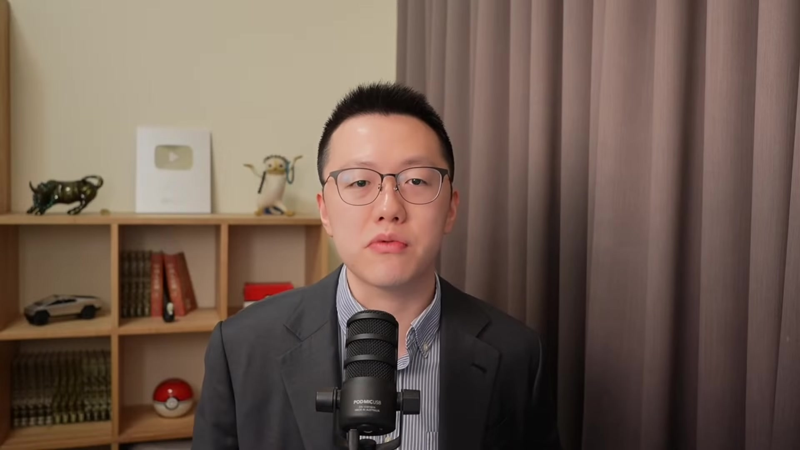

**逐字稿片段：** 那現在市場上最重要的傳導鏈很清楚 油價影響到通膨 通膨又影響到殖利率 殖利率再來決定科技股的估值 你說不對啊 那整個油價和通膨情緒沒有緩解 怎麼會現在估值還在衝高呢 因為估值沒有衝高 為什麼 因為獲利在往上升 獲利往上升 股價被迫就一定要往上走 但是本益比並不會因此而飆高 就這麼簡單 所以現在的行情就是靠基本面的買盤 跌深了或者本益比往下掉了 那價值型投資者買盤就會因此而出現 緩步的推高 這叫做行情總在半信半疑中成長

**話題推測：** 市場傳導鏈：油價、通膨、殖利率與科技股估值

---

## 00:05:22

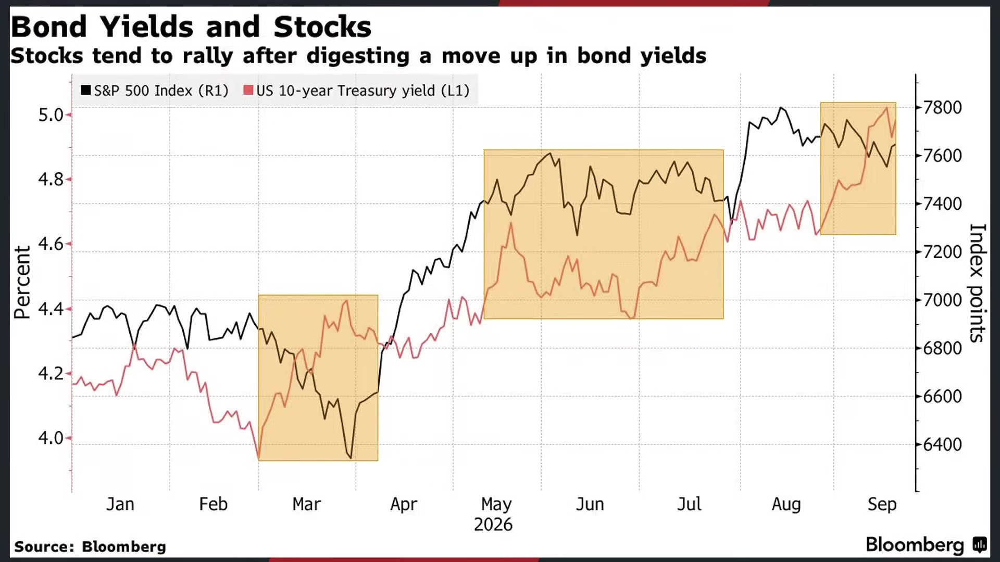

**逐字稿片段：** 好我們看一下沒有股市四大指數表現 道瓊上漲366.0.7% 所以52048點 其實道瓊還在半年線左右主體 他算是四大指數當中 現在表現最弱的 那之前下跌的時候他也是最強的嘛 所以這很好理解 防禦性資產

**話題推測：** 美股四大指數表現

---

## 00:05:38

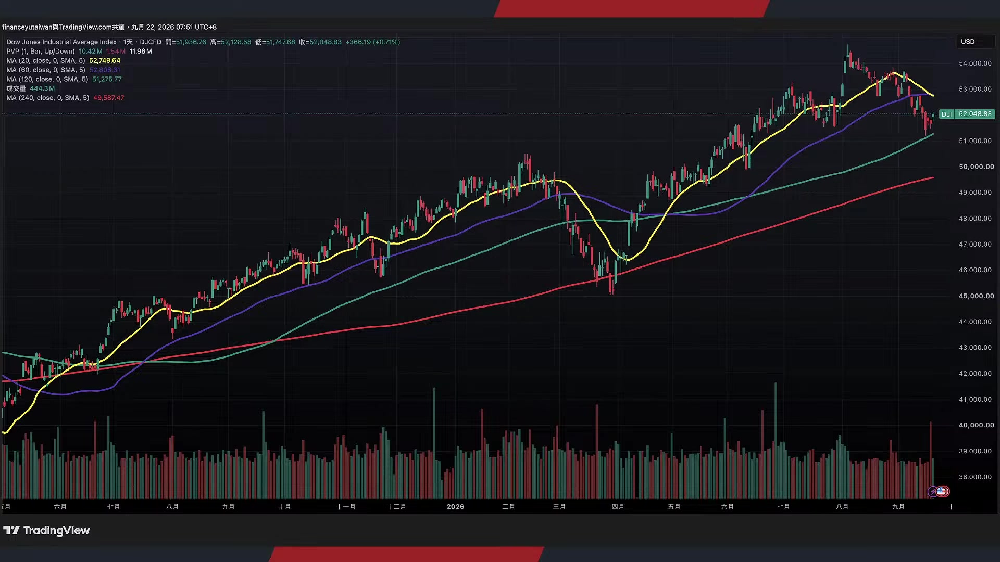

**逐字稿片段：** 標普Y指數上漲114.1.49% 收在7764點 那已經占上所有均線了 那斯達克指數昨天創下歷史新高了 上漲599點 2.26% 收在27122點 那整個主體已經逐步完成 幾乎所有均線開始重新上彎 回到多頭格局

**話題推測：** 標普500指數上漲

---

## 00:05:59

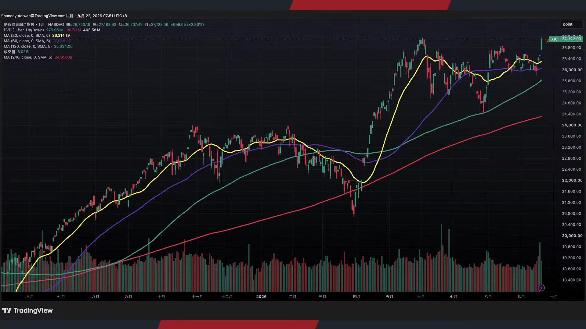

**逐字稿片段：** 費辦的部分上漲511點 4.29% 收在12433點 從位階來看最低的應該是費半 但費半從低點彈幅也不小 那下方有一點W底的感覺陸續出現 雖然前幾天那樣算不算第三隻腳 那很多人都以第三隻腳自豪 但是這個行情來看 很明顯下方買盤之爭 是比上方突破率來的更強 看起來大家越越預示 三大指數四大指數能夠買的指數 好像也不是特別多了 所以從費半而言 還是對於部分人是有比較大的吸引力的

**話題推測：** 費城半導體指數上漲

---

## 00:06:34

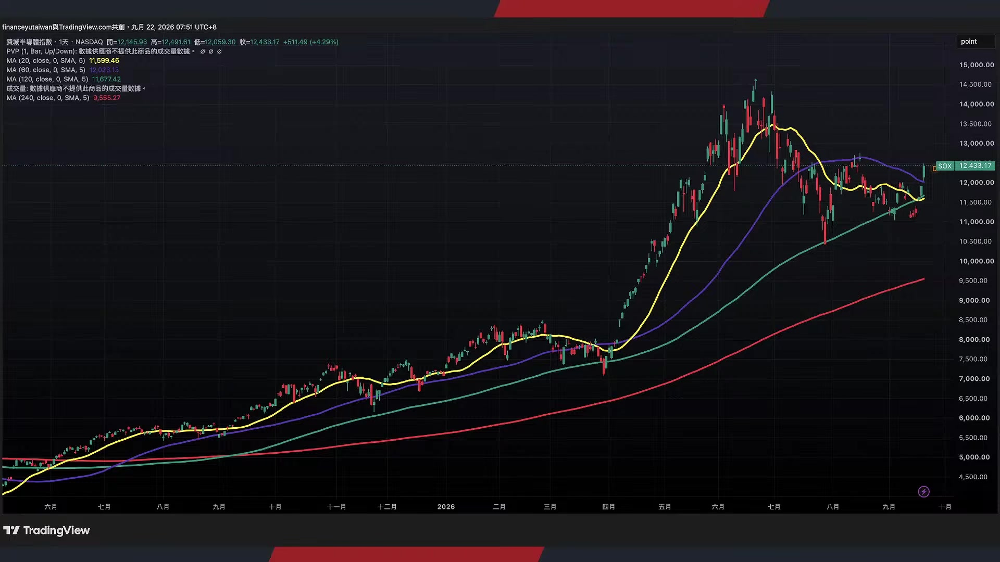

**逐字稿片段：** 那我們必須承認 在整個2026年到現在為止 其實漲幅最亮麗的還是大宗資產 美國股市反而是進入到第二梯隊 26年以來

**話題推測：** 2026年以來各類資產漲幅比較

---

## 00:06:43

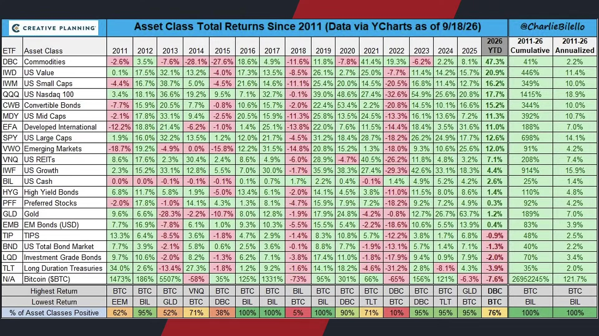

**逐字稿片段：** 整體漲幅最為亮麗的是DBC 大宗資產是以47.3%的報酬 遙遙領先 再至美國的價值股20.9% 美國小型股是16.2% 納斯達克指數是17% 科團債15.2% 大型股12% 成熟市場和新市場分別是11和12% 那其實如果從債券資產和避險資產來看 它有兩個極端 現金仍然今年有2.6%的報酬 但美國總體債券是平均下跌1.3% 投資等級在下跌2% 長天期債券下跌3.9% TIPS也下跌0.9% 所以今年債券市場還是不好 但也沒有到2022年這麼慘 因為23 24 25債券已經算是連續三年上漲了 然後在26年又重新回到下行軌道 回到2022年當時的下行數據 不過22年 那個時候的總體跌幅 都是跌三層四層起跳 今年你要說債券跌到哪裡去 勉強跟配息互相打消 如果持有直債的 更是沒有太大沖擊 當然跌最重的還是你比特幣 不過比特幣其實今年跌幅 已經算收斂很多了 為什麼 最近只跌了7.6% 比特幣在昨天跟美國股市一樣 大幅跳高 突破8.5萬美元了 這是1月底以來的水準最高 你要知道 利率都已經高成這樣了 比特幣還可以往上走 這說明要麼就高利率的情緒 已經提前price in 完全反應完了 要麼就是市場上的風險情緒 就是在不知不覺當中重新歸來 因為大家過去都騙比較保守 那現在反而有進一步的現金能夠湧入 從上週低點 這樣子彈幅已經彈了接近有16%了

**話題推測：** 大宗商品DBC報酬率領先

---

## 00:08:23

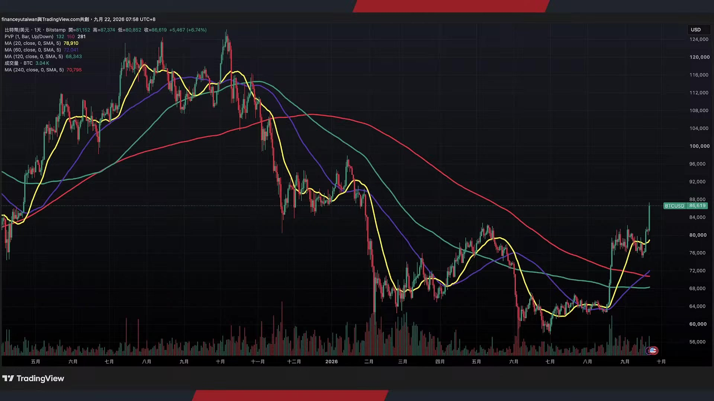

**逐字稿片段：** 以太幣也一度逼近到2750美元 那其他加密貨幣也同步走高 這一波反彈和全球風險資產的回溫是同步發生的 油價回落沒在支利率下降 但是呢下降所帶來的利多 是大於當時上升所帶來的利空 所以股價反而做突破了 那現在更進一步觀察的是 因為比特幣距離今年1月當時超過9.7萬的高點 還是有一段距離啊 那8.5萬美元附近 剛剛好是接近美國現貨比特幣ETF投資人的平均成本 就是在過去三年的平均成本 大家就卡在8萬5 所以這是一個很重要的多空的分界 就是很多人被套了兩年 被套了一年多 你要停損就趁現在了 看起來邏輯是這樣子 平均成本 那會不會造成一系列的停損賣壓呢 我倒認為不至於 有些人已經都忘記自己持有比特幣了 已經消失很久了 但可以從這樣的一個角度來看 如果連風險資產領頭像比特幣 都開始大幅的往上走 好那是否代表的情緒正在歸來呢 其實我們必須承認 現在說的行情還是跟AI聯動在一塊 只是它會尋找不同的硬體股 軟體股 資安股題材相互進行輪動

**話題推測：** 以太幣逼近2750美元

---

## 00:09:37

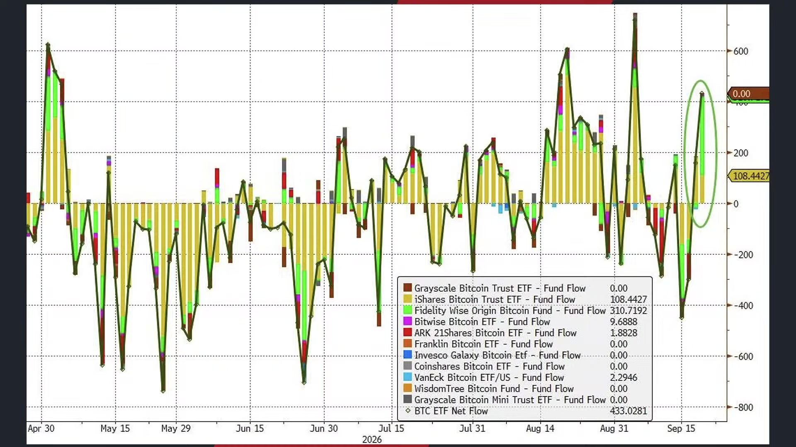

**逐字稿片段：** 我們看在過去一週 美國散戶是一邊賣科技基金和多數各國 但是一邊買進大概16億美元的科技氣熊 所以有可能是由於科技巨頭在最近的發揮 就跟臺股一樣 臺股你只要拉臺積電聯發客 一不小心就會創下一點新高 這很容易的 可是你說臺股假設今年年底上五萬點 我還是很樂觀的 你覺得大多數今年五月份六月份高點見到的股票 你覺得年底會創新高嗎 你覺得臺積電創新高的時候 國巨能不能收復九成的跌幅 那都很大的挑戰對不對 所以我們才講說 現在其實如果行情重新迴流到上半年被遺忘的科技七雄身上 那就代表的指數過高衝高速度就會很快 但是體感上就不一定是這樣子

**話題推測：** 美國散戶賣科技基金但買科技期貨

---

## 00:10:28

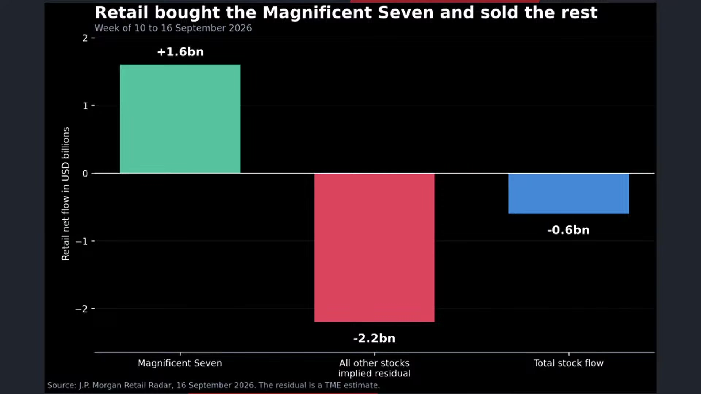

**逐字稿片段：** 現在換算下來 現在機構投資人 把資金集中到亞馬遜 Alphabet Meta 微軟 這些股票當中的速度 在過去兩週是非常明顯的 所以我們必須從行前來做進一步推敲 因為整個上半年我們很清楚 資金幾乎就圍繞在AI基礎建設周邊 都認為花錢的人不值得投資 但是賣產值的人值得投資 所以當時都是AI基礎周邊 像是AI基礎建設 AI資料中心 甚至國防原物料 那反而是科技七雄 在上半年是大幅的跑速給大盤 那能否藉由這一次的輪動 剛才漲的都是一些大型全資股 有的是費辦 有的是納指 藉由這些全資股的衝高 來帶動新一輪的行情

**話題推測：** 機構投資人資金集中到大型科技股

---

## 00:11:13

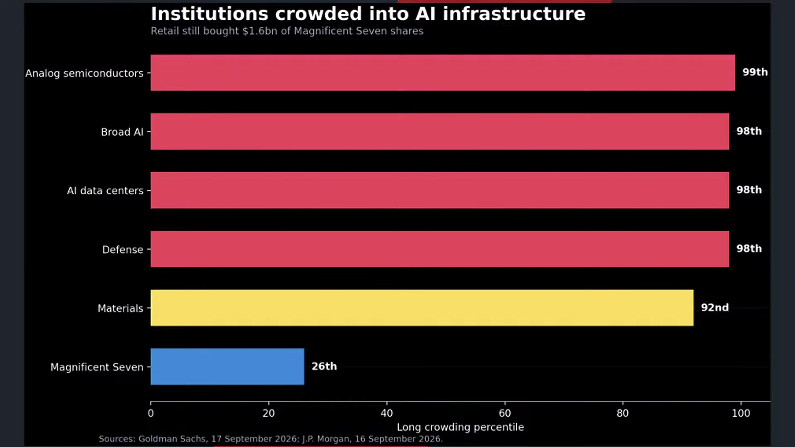

**逐字稿片段：** 值得留意 因為美歐股市這一波漲勢 我們過去提過 一直都不是很平均

**話題推測：** 美歐股市漲勢不平均現象

---

## 00:11:17

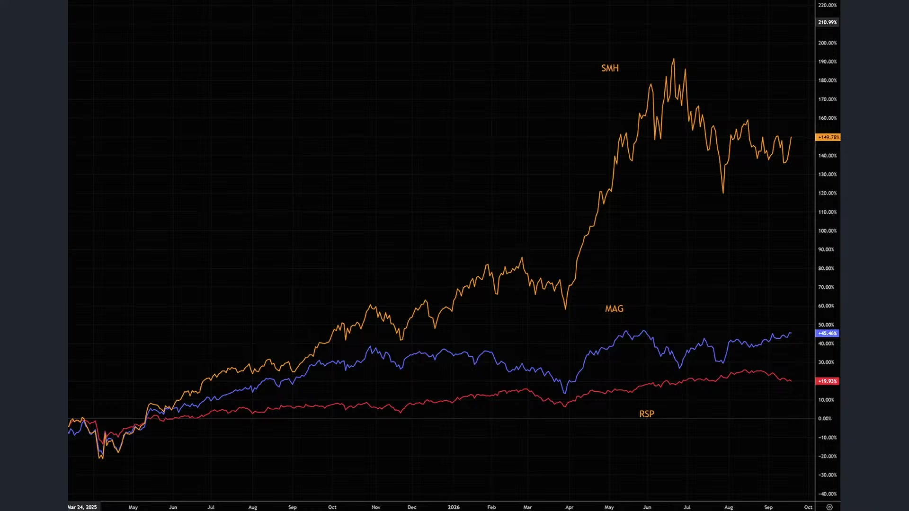

**逐字稿片段：** 我們把半導體的ETF SMH 今年累積到現在為止 應該說從三月份 當時每一站是到現在 大概漲了150% 科技七雄才漲多少 45% 那你說 那七雄是不是真的很落後 其實標普等權表現 RSP也漲幅只有20% 這就說明 雖然七雄是比半導體還要弱一點 可是如果你連AI都沾不上邊 AI跟半導體 非相關股票報酬 更是遠遠在落後 所以這就可以瞭解說市場的顯著分化 那如果我們細看 今年的七巨頭 如果我們以Fang來看好了 真正亮麗的 基本上也是半導體和大型股 美光今年漲了265% 輝達漲了21% 蘋果漲了24% Alphabet上漲13% Meta12% 接下來就落後大盤了 Amazon漲11% 微軟今年 即便這兩天彈幅很明顯 今年也不過漲3.7 因為今年年初是在跌太多 Panel Tier上漲3% 博通漲4.7% 所以我可以瞭解說 在金牙股當中 並不是大部分的科技股都在創下新高 主要就是來自於上半年是由硬體股來推 但是現在短期內 硬體股行情沒有非常明顯的板塊輪動以後 靠少數個股來往上拉 這個時候就達到順勢突破的效果了 不過至少可以承認 行情永遠都圍繞在AI題材裡頭 你不管買到軟體股硬體股 只要跟AI 你還是有很高的幾率能夠跑贏大盤

**話題推測：** 半導體ETF(SMH)與科技七雄漲幅比較

---

## 00:12:48

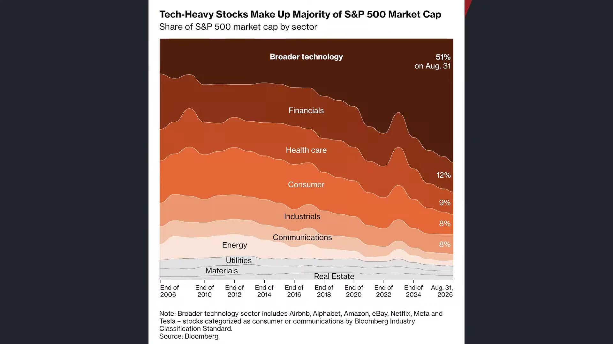

**逐字稿片段：** 人工智慧現在最大投資風險 已經不是AI股票太多了 因為所有資產都已經變成了 AI交易的一部分 我們根據彭博的數據 AI基礎建設相關公司 現在佔標普500的總市值 大概已經來到40% 三家晶片公司就佔新興市場指數 超過四分之一 今年AI相關企業發行的投資等級在 已經接近全球的一半 創投資金有87%都是AI創新企業 所以你只要做非AI相關的 你幾乎也拿不到錢了 這也是為什麼大型退休基金 現在很難去重新計算 自己到底壓了多少AI 如果我們把這些所有的 比如說阿發貝 Amazon Meta Netflix 甚至連特斯拉 都把它納入到廣義的科技股 現在佔整個標普白指數 大概已經51%了 不管你怎麼投 你幾乎都會投到AI 所以AI泡沫破滅 你也很難能夠成功的規避 這個就是主導全球的 新一輪的資金走向 那現在什麼也都要AI AI手機 AI電腦 AI助理 AI投資 AI金融 彷彿整個市場上 你產品名字如果沒有一個AI 你就已經輸在起跑點了 所以從這樣的一個角度來做思考 你會發現信用市場表面比較平靜 但底下其實藏著非常龐大的AI鉅債 這個就是後續要留意的

**話題推測：** AI最大投資風險：AI已滲透所有資產

---

## 00:14:06

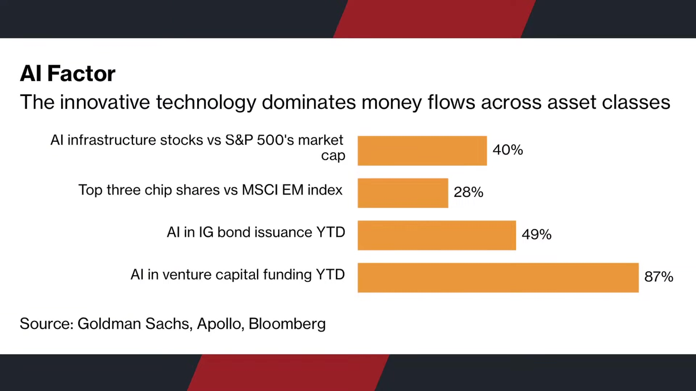

**逐字稿片段：** 你看OpenAI現在已經宣佈 打算明年再來進行IPO了

**話題推測：** OpenAI宣佈明年IPO

---

## 00:14:11

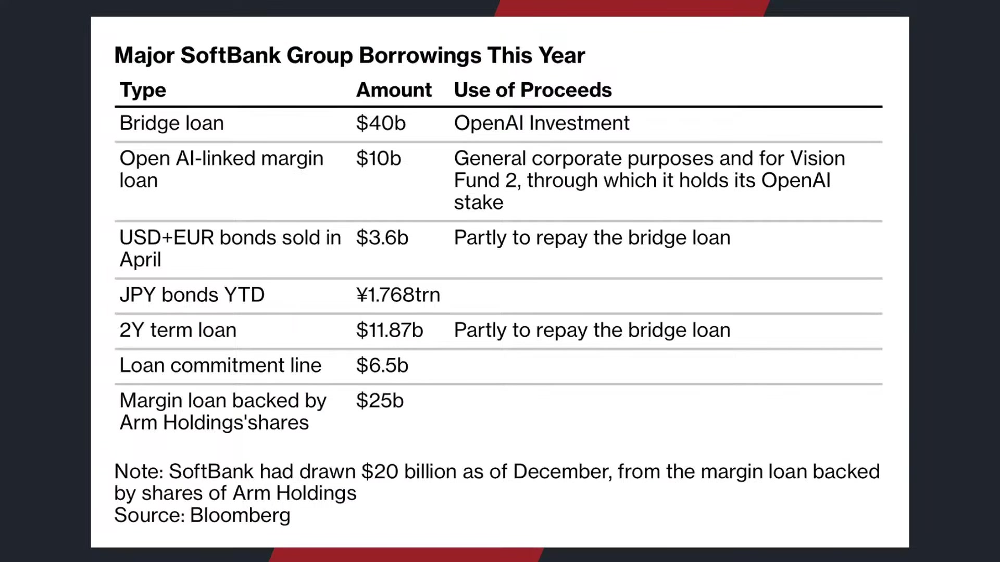

**逐字稿片段：** 那軟銀的壓力就越來越大了 軟銀最近孫正義為了要 持續能夠有新一輪的資金能夠湧入 大幅提高取債規模 最新一輪的已經承諾 或者正在洽談的新增債務 大概是209億美元 其中過去以ARM的股票擔保貸款額多 再增加50億美元 目的是什麼 如果今年IPO 它就可以順勢的出脫一點股票 那到時候資本就能夠有效的回饋 那現在OpenAI今年沒有要上市 所以整個資金就相對來的更為緊湊 那我們要知道 現在其實軟銀所發行的債券 已經接近垃圾債等級 這說明軟銀的擴張速度 其實是非常非常快的 很多人 就我們講說背後很多 不管是避險基金 還是投資公司 他可能就是單押在某一檔AI成分股上 然後對賭他能夠成功 所以本身大家都冒著極大的風險 甲骨文他就是另外一個例子 甲骨文最近在新墨西哥州 總投資規模1650億美元的木星計劃 最新宣佈可能要延後 主要是去年 有180億美元的貸款啟動建設 結果現在近期的相關貸款 每億美元的面額 只跌到0.89到0.91塊 明顯低於正常優質債券 接近面額的水準 這一座資亞中心很大 1400英畝 它之前是跟甲骨文跟OpenAI 高達3000億美元 算力合約的重要基地 結果現在取債速度太快 信用體質快速的轉落 結果延後了 那你如果說只是由於短期內蓋不出來 最後把它蓋出來那還好 重點是算力生不出來 那你錢要怎麼收回來呢

**話題推測：** 軟銀因OpenAI未上市導致資金壓力增大

---

## 00:15:50

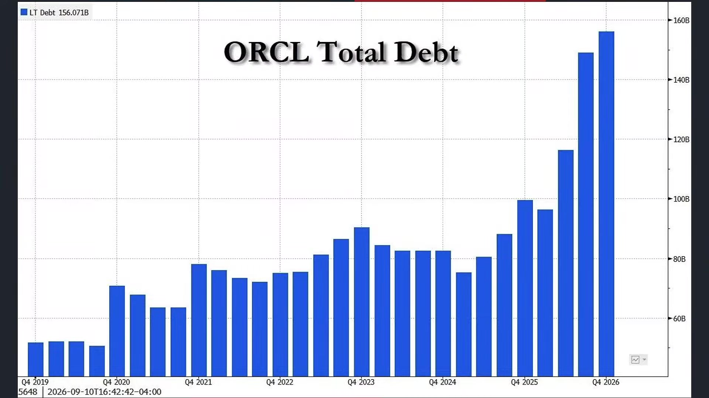

**逐字稿片段：** 我們看甲骨文的負債 24年底大概就800億 後來總負債到現在 今年年底已經來到1560億 短短兩年就已經翻倍了 再看它的KPX 資本支出也是進入到爆發式成長 以前單季的資本支出大概就是20多億美元 現在AI資料中心大舉擴建 25年突破50億 100億 到今年8月份 單季就280億了 所以它的速度也沒有任何減緩的跡象 那麼一旦引起反彈

**話題推測：** 甲骨文負債與資本支出快速增長

---

## 00:16:19

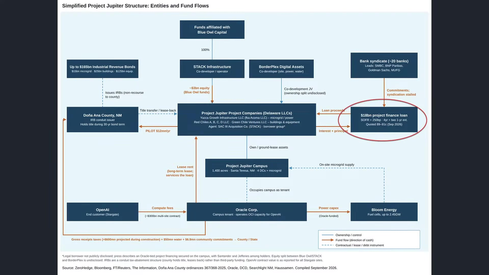

**逐字稿片段：** 壓力就來了 所以現在資料中心也面臨地方的反彈和工程延誤 這個木星計劃 就甲骨文的主要的AI建設計劃 天然氣款正在遭受到顯著的阻擋 那麼有部分銀行團已經開始陸續退出 當地民調 有65%居民是反對大型資料中心開發 這是阿布奎基日報 就是當地的報紙 就是那個絕命毒師住的地方 那與此同時 我們也知道說 這背後的融資結構越來越大 整個資料中心 現在就靠著180億美元的專案融資貸款支撐 其他還包含著165億美元的工業收益債券 那如果有人先撤資 那這個資料中心到底蓋不蓋得完呢 還是會有人接手 這就是非常非常大的挑戰 那我們講說 現在美國的AI企業 就是面臨這樣的一個風險 就是我們都清楚知道 這一輪AI最需要檢視的 AI股票其實已經沒有想象中這麼貴了 因為估值已經變低了 因為獲利追上來了 但是AI正在滲透整個資本市場 那大量的人獲得資金以後 就去大舉發債 然後包括私募創投資金 就大量的去壓住AI 連原本拿來風險 分散風險這些基礎建設 或者信用市場 你買債券其實也是對賭AI 你買股票也是對賭AI 你買指數也是對賭AI 你把資金拿去給退收基金 他也是買AI 大家都一樣 那有時候順風的時候 大家看結果 你只要給出好的產品 你只要給出更好的模型 大家就叫好 那現在你已經推出一陣子了 那AGI時代還沒有全面到來 那大家就開始要求 你這算力的回本速度 到底有能夠多快 所以反正順風的時候 大家看的是結果 但到逆風的時候 就開始產生利益衝突了 那有銀行團就先跑了 那有資料中心這麼大 那180億的資料中心突然就停擺了 遊戲規則就突然不同了 過去沒有人在意的那個記錄 就重新被拿出來檢視 沒有啊 你那個時候跟我承諾 幾月幾號要蓋好 現在你沒蓋好 所以我也不用負擔相對應的責任 這個就是一系列的衝擊 順風的時候 大家看的是結果 逆風的時候就開始挑刺 有這樣的感覺

**話題推測：** 資料中心面臨地方反彈與工程延誤

---

## 00:18:25

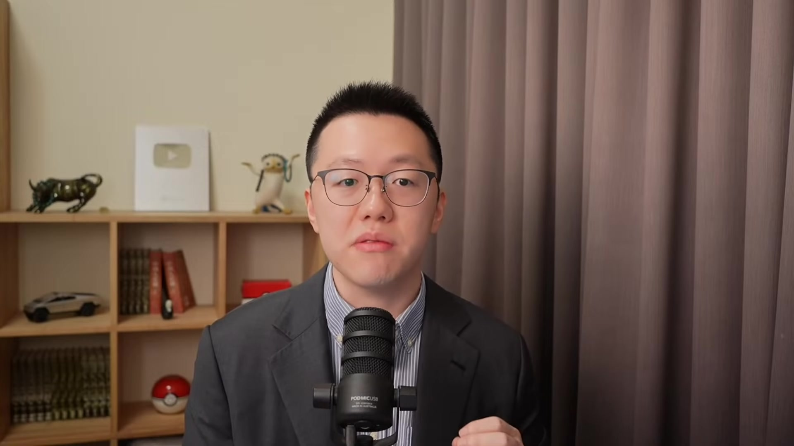

**逐字稿片段：** 我最近才看到一條新聞 昨天網友傳給我的 他們現在都很喜歡標註訊息給我 他講的是最近核庫金的訊息 我們知道最近財政部 要推動核庫第一兆豐華南 四家公股投信診病 預估到今年年底完成 結果現在核庫投信 爆出內控的爭議 這個是靖州刊的獨家 根據吹哨者的說法 今年6月 人資主管在處理 診病所需的員工薪資 和獎金資料的時候 疑似把機密檔案上傳到雲端 並且運用AI來運算 然後因為觸發了治安系統 後來母公司就調查並離職 那最後又意外發現 這才是主軸 發現這個王投資長 合庫的王投資長 中長期使用公司電腦瀏覽 日本的拍賣網站 搜尋成人影片的女優 寫真以及女優的相關商品 累積瀏覽記錄超過萬筆 上述內容主要來自於 吹哨者的指控 還跟正式調查結果要有所區分 然後相關的瀏覽行為 大部分是集中在中午12點到下午4點 那吹哨者就明顯指控 說他的辦公桌上放有多張 帶有簽名 唇印 裸露的女優卡片 那這個事件就變成從上班摸魚 變成到公司治理 資訊安全 然後現在已經檢舉到金管會了 那目前的指控是這樣 就是因為主要是中午12點和4點 大量密集的去看A片 所以剛好是臺股殺尾盤 還有歐洲股市開盤 準備迎接美國股市盤前交易的關鍵時刻 王身為投資長 沒有帶領好下屬好好看盤 操盤已經踩到公司紅線 你不覺得看完這個新聞很扯嗎 因為這個新聞 我是找了一個沒有露臉的 他網路上每一張圖片都露臉 殺人都會打碼 看A片卻沒打碼 難道是因為他喜歡看無碼的嗎 所以這肯定得罪人 我講的就是順風的時候 還沒有鬥爭之前 這精精病還沒有出現之前 大家就得過且過 那開始要病之後 你看看雙方的鬥爭就開始了 這你幾家公股行庫 你感覺稍微要做一點什麼大事 就開始瘋狂連環出發 這不是又有人在整他嗎 我是不太那個欣賞 把人家照片拿出來 又不是什麼滔天大醉 把人家弄涉死 不過我們還是要做社會研究 你說他本來是要查AI 查錯變查AV 對啊有什麼問題嗎 而且聖人模式才不容易追高 這時候大腦才冷靜 我們講實在的 你如果是績效好 那看AV又怎麼樣 他又不是正大光明 他把聲音放出來 然後到處大家 他可能就私底下 偶爾不小心點到這樣子 這有人要你的位置 所以我們才講說 這個AI行情好的時候 你查AV我都拿你當AI 能賺錢都行 當AI行情不好 要清算 有人要鬥爭你的時候 你看AV都天理不容 連照片都不幫你 所以我們才講說 這個衝擊越來越大 當然 當然你說這一次因為我們叫公股投信要四合一整並 那又有爆料人 然後在這個時間點 然後年底又快到了 所以我們才講說順豐的時候績效 它可以掩蓋出很多的雜音 那金控業你說有多震驚嗎 逆風或者權力重整的時候 反而馬上就變成內控問題 變成紀律問題 變成職場爭議 已經上升到金管會了 什麼年代了 這種東西當然是用手機偷偷看 正常也不會到電腦看 我以前不理解 為什麼每次公司早上9點鐘 廁所就擠滿人 我想說股市交易很興盛 看起來我錯估了 好噁心 社會死亡 對於你這個大膽的想法 臺灣有一套完整的刑法 法官有一套客觀的看法 刑警有一手精準的槍法 木匠有一套高超的技法 棺材有花裡胡哨的造法 焚屍有一百多種的辦法 賓館有一套隆重的藏法 所納有一套熟練的吹法 墓地有一個良好的埋法 非洲有一套歡樂的跳法 黑人有一套專業的抬法 墳草有各式各樣的長法 盜墓賊有一套完整的盜法 音書有一首實用的盜法 地獄有十分專業的判法 我們重新組織一下語法 說起那份十分大膽的想法 好惡心好惡心 好不管怎麼說 我個人的看法是 但是有時候我們在順風的時候 市場上就不會去懷疑 現在稍微遇到一點逆風 斤斤計較 現在甲骨的確面臨相當大的挑戰 8點55分 我們今天重點是要往下聊 來看一下在其中選舉的衝擊 其實我們都很清楚知道 現在川普唯一能夠拿得出良好政績的 可能就是股票市場了 因為正常來講 我們過去提過在其中選舉之前 股票市場有適度賣壓是很正常的 因為政策充滿著極大的不確定性 白宮我們都清楚知道 現在的民調應該是很有高的幾率 你來嘲笑也大 共和黨現在要同時掌握白宮參眾議院的可能性幾乎是零 那現在就看起來能不能守住眾議院 那真正能夠同時在兩院不退反進的案例也非常少了 98年的克林頓 911事件的小布希勉強還撐過去 川普以前也吃過這個虧 18年他當時第一次任期的期中選舉 共和黨就一次丟掉了41個眾議院席次 直接失去了眾議院的控制權 雖然當時參議院還反而增加兩席 但這一次的確挑戰更大

**話題推測：** 合庫投信內控爭議新聞

---

## 00:24:06

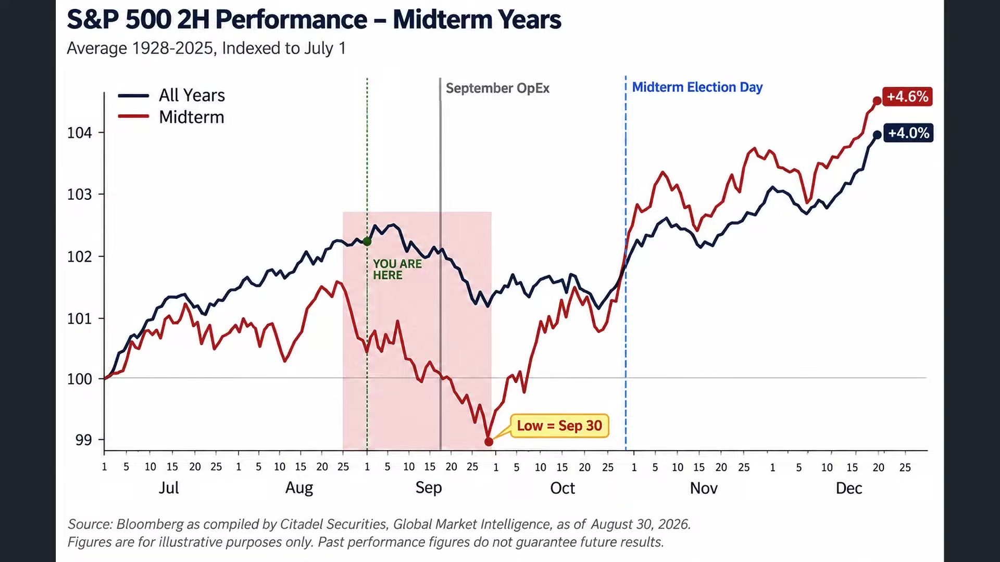

**逐字稿片段：** 我們看知道Polling Market目前的賭盤 參眾議院兩院看起來翻盤的可能性都很高 交易者目前給予民主黨拿下參議院 大概是61%的隱含幾率 眾議院是92% 其中民主黨同時控制參眾兩院的交易幾率是61% 相對之下 共和黨首座參議院 民主黨拿下眾議院的31% 還是有比較明顯的弱差

**話題推測：** Polling Market賭盤顯示參眾議院翻盤可能性高

---

## 00:24:30

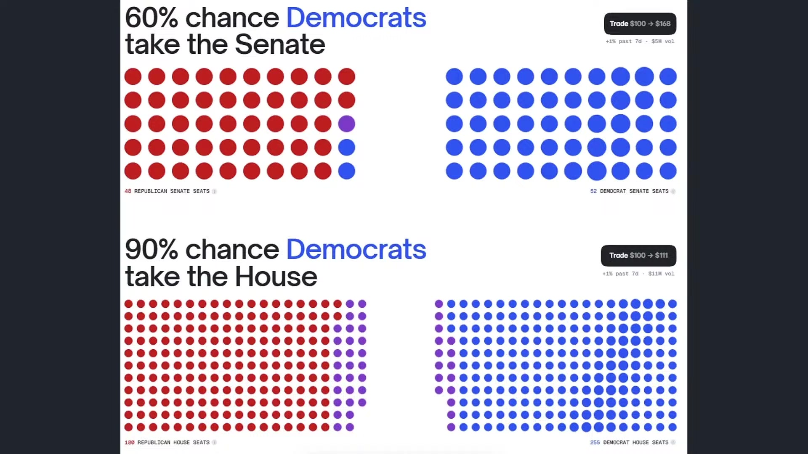

**逐字稿片段：** 那另外一方面 在最新的川普民調當中 從多家民調來進行總體彙整 川普總體支持率大概是38% 不支持率 上個禮拜又創高了 來到59% 如果我們看各家民調 其實不管是偏左媒偏右媒 還是單純看路特 EPSO相關的民調 大概整體淨負支持率 就是支持減掉負支持的 或者說支持減掉不支持的比例 剩下來的負值 大概都是-18到-25之間 這個比例落差 其實還是相對來的比較大 這也使得一個跡象 照理來講 市場上的不確定性應該會因此而加大 所以美國股市本輪的創高 就沒有那種太多的政治上的擔憂 利空形成在其中 當然由於三大指數四大指數 它也算是盤整了一段時間 雖然大家股價都沒創高 其實沒創高本身已經算利空了 因為獲利還在持續往上走 又不是獲利表現平平 股價沒有波動 獲利正在以金人的速度往上走 沒有大幅創高 其實就已經算跌了 這是我們過去的立場 只要獲利還在往上走 股價不漲 本益比就會快速的下滑

**話題推測：** 川普最新民調支持率及不支持率

---

## 00:25:40

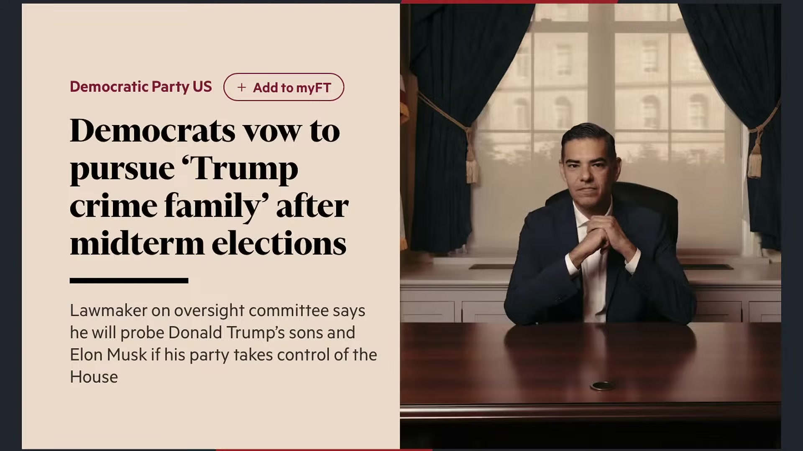

**逐字稿片段：** 所以這一次我們要更進一步觀察 也許在政治領域 能夠進一步在估值回調的空間 今年大概已經回調兩次了 一次是三四月 另外一次就是七八月 現在美國期中選舉還沒有投 不過在選後的政策邊緣還是很大 還是有機會 我認為如果要等回調 我覺得還是有機會的 今年7月才等到一次 通常是三到四個月 會迎來一次比較大的一個回調 那如果你是以週期佈局來看的話 也不會說錯過了一次機會 就再也買不到了 你可以現在少量佈局 等到下一次再做一次 比較大的一個回調 來做佈局也是OK的 我們根據民主黨 現在在11月的期中選舉國會佈局 反而呈現了很有趣的局面 這期中選舉都還沒有投 眾議院的監督委員會 民主黨首席議員 就已經開始決定 委員會在眾議院取得多數以後 從今年下半年開始 要大幅針對川普本人 家族成員 商業夥伴 和富豪盟友的調查 什麼意思 準備要清算 其中其中都還沒投 民主黨已經假設 眾議院能夠大勝 相關的委員會的籌備計劃 正在細節探索當中 包括川普的長子小唐納 過去他的確取得了很多政府合約 看起來現在是合規的 不過眾議院就是把你調來停診 你不調來藐視國會 所以我們看到一系列的文件調閱 和傳票權利 可能會大幅的影響到 在整個27年28年 川普的執政效果

**話題推測：** 估值回調空間與市場調整預期

---

## 00:27:07

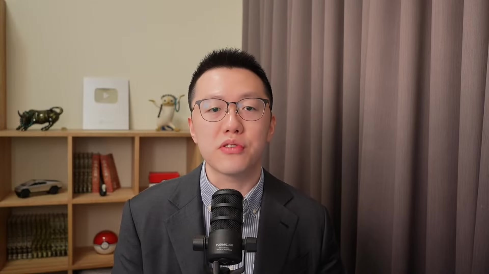

**逐字稿片段：** 另外一方面我們也知道 川普過去曾經想要限制郵寄投票 但是最高法院這次踩剎車了 不代表說完全是合法的 但是這一次期中選舉 是很明顯規定 不能夠遭受到司法的阻擋 原因就來自於 因為再過兩個月就要投票了 那現在其實已經有人開始投票了 那如果現在才規定說要踩剎車 那今年的選舉一定會大亂 所以最高法院目前是決定 期中選舉的規則暫時不改動 所以未來一段時間 我們知道川普想要限制郵寄投票的做法 在期中選舉是無法發揮他的一個效力的 這是另外一層我們看到的實質跡象

**話題推測：** 最高法院對郵寄投票的態度

---

## 00:27:49

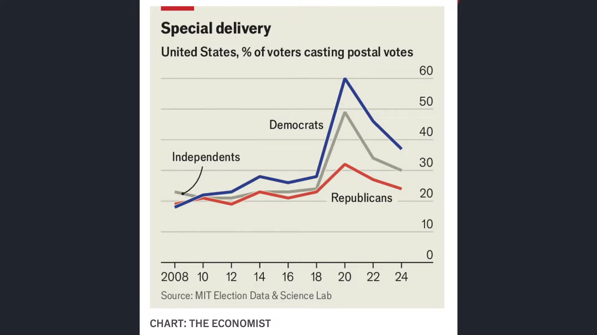

**逐字稿片段：** 那你說共和黨難道沒有任何的優勢嗎 共和黨其中一個最大優勢 就是錢很多 現在共和黨所擁有的政治現金 是民主黨的好幾倍 我們看到各大的科技巨頭 陸續表態了 從整個25年到26年的選舉週期 整體來說 其中選舉大部分 有三分之一都是集中在 前20名的超級金組 其中20人當中 有16人都把主要資金 押向共和黨陣營 科技巨頭大幅的親共 親共和黨 目的就是相信 共和黨在科技議題 尤其是AI一體當中 相對於民主黨更為友善 所以大量資金開始湧入以後 至少我們知道 AI派 科技派 加密貨幣派 似乎已經默默站隊了 民主黨其實也獲得部分資金 不過從總體資金量而言 共和黨是有背負著相當大的 AI監管放鬆的壓力 來向選民 來向市場 來進行傳送市場的概況 當然我們都會很清楚知道 這些問題是否能夠足以扭轉 當前的眾議院選情 其實難度是很高的 原因很簡單 因為根本還是物價的上漲問題

**話題推測：** 共和黨政治獻金優勢及科技巨頭支持

---

## 00:28:57

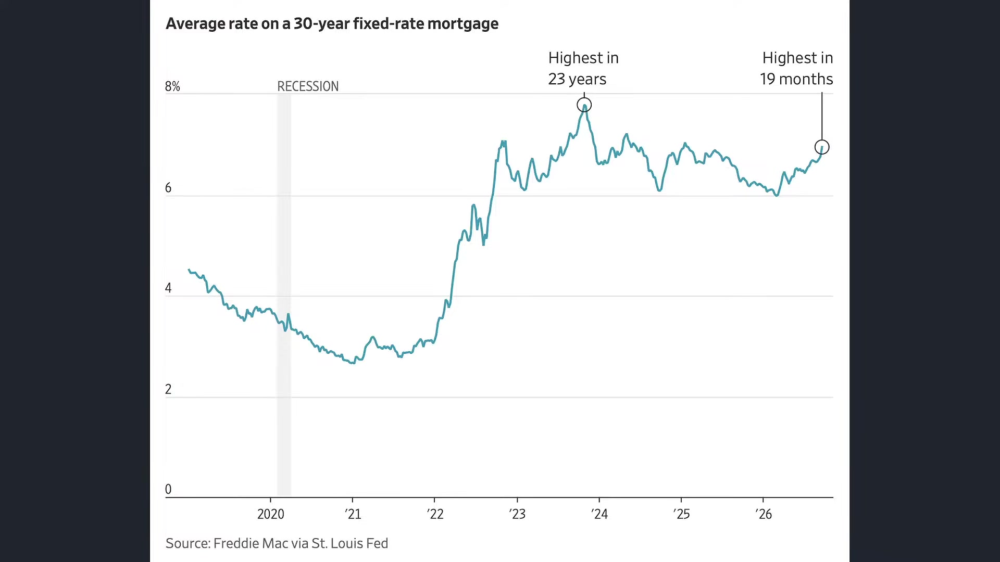

**逐字稿片段：** 美國經濟現在出現最大的矛盾 就是失業率4.1% 消費還是很強勁 但是家庭的淨資產 第二季已經達到186兆美元 一般家庭的生活壓力 就在持續上升當中 所以整個8月份的消費者物價指數 如果是從這樣的一個速度上行的話 基本上是不會有太大的一個改變的 加上我們也清楚知道 現在美國的AI基礎建設 雖然各大巨頭花了這麼多錢 希望你能夠幫助我們能夠通過 可是各地都出現了 比較明顯的地方反彈 地方政府和居民不想讓他蓋 那民主黨又處處卡關 而且民主黨州 我們看到的蘭州 又大量的延後 資料中心的新建計劃 採取更多的監管措施 最後AI到頭來 你說真的會由於 給予川普或者共和黨足夠的資金 中央政府就能夠幫你處理這件事情嗎 也許到年底以後 這個AI派就要跟民主黨重新和解了 這個是目前看起來 至少能夠看到的立場 資料中心的延後 一個是像甲骨文 錢的問題 一個就是選民的反制 一下選民喊不要 一下民主黨又喊停 不要停不要停 怎麼搞 所以這個就是現在整個全美市場當中 對於AI在下半年比較大的變數 大家反而不是很擔心川普政治受到約束 那個反而OK 重點是怕民主黨控制國會 兩院以後 那會不會未來的AI資料中心 會一個接著一個停擺呢 這個就是更大的估值回調理由 也給投資朋友做一些觀察

**話題推測：** 美國失業率、消費與家庭淨資產數據

---

## 00:30:28

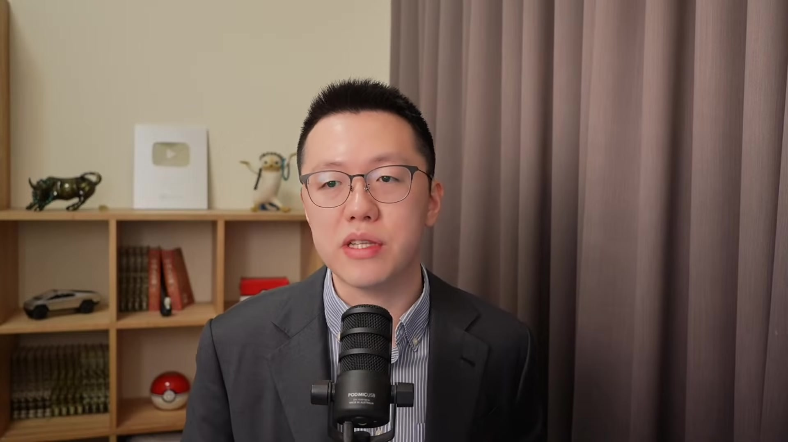

**逐字稿片段：** 所以雖然現在美股股市在創高 我們的結論第一個 少數個股正在衝高 拉全職股 就跟臺股現在一樣 上漲800點 收在48,520點 林發哥直接跳高這樣上去 從全職股的拉動 它就足以帶動指數往上衝了 可是到年底5萬點了 你覺得你在五六月份 套高的股票解得了套嗎 這就是一個挑戰 那第二個觀察重點 還是來自於 現在AI行情走到現在 我們都很清楚知道 在資料中心的興建 或者在融資的過程當中 它已經形成了部分的制約 這些都是讓未來 估值仍然有回調的理由 不要覺得股票市場 上漲一次就會永遠上漲 我們在這麼多年的河流途當中 就算是AI行情 它都會有情緒低迷的時候 最後我們也看得出來 川普現在已經算是 所有招數都已經使出了 儘可能在期中選舉之前 來收攏戰線 包括關稅戰 包括川習會 各項議題 也許在本週釋出以後 會是對於市場的一大利多 那三層力量互相角力 形成今年年底的跡象 給投資朋友做些參考 如果喜歡我們節目 記得幫我們訂閱按贊加分享 我們就明天早上半半 早晨財經四點多再相見 祝各位投資朋友開盤順利 超盤愉快

**話題推測：** 美股創新高但僅少數個股拉抬指數

---
