# yutinghaofinance_XY31kO-V0Q4 — 關鍵畫面索引

- 來源逐字稿：[yutinghaofinance_XY31kO-V0Q4_GT.srt](yutinghaofinance_XY31kO-V0Q4_GT.srt)
- 影片：https://www.youtube.com/watch?v=XY31kO-V0Q4
- 截圖數：25

## 00:00:24

**逐字稿片段：** 現在是臺北時間2026年9月1號 禮拜二早上8:31 大家早上好 我是游庭皓 每天早上開盤前半小時 我們在這邊陪伴著各位一起 解讀國際財經新聞時事變化 一早再來跟投資朋友宣傳 禮拜六晚上8點鐘就是我們 財經皓角第四季的聽友會了 每一季 我們都會針對當前行情做一些推演 也會針對過去一個季度的 資產操作和行情判斷來做檢討 我們直播分享一些市場動態 但大多數個人的一些操作或者實際 觀點會在我們的訂閱系統當中來做 分享那聽友會就是規律性的 去尋找市場上的慣性 以及每個季度的資產表現 如果大家常聽我們直播 對於我們的內容有興趣的話 歡迎可以來到我們的網站來下取訂單 好那禮拜六就可以線上上直接收聽 那當然如果更有興趣 也可以加入我們的訂閱系統 裡頭除了有一整年的聽友會的收聽權 也會有一些個人資產部位周志 一些專題影片 宏觀報告 好那沒關係 大家的投資思維可能不太一樣 每個人吸取的資訊角度也不盡相同 也不一定要完全的按照 我們的一個操作方式 我們就提供不同的角度 如果誒覺得不太需要 也可以幫我們訂閱一下 按贊加分享 好的很多人 你看我們直播人數這麼多 很少人按贊 要幫忙按個贊 順便幫忙訂閱一下 現在的訂閱人數是剛剛好69.69萬 那還是不要訂太多好了 我待會要截圖 那先不要訂 明天記得要訂閱 我記得有一種說法 因為我們一直在尋求這種規律嘛 人一生當中哦 大概會遇到13-15個循環吧 還有5-6個大循環 那這個大循環是什麼 你想想看 我們的父輩 我們的爺爺輩 1960年的藍籌股泡沫 1970年兩次石油危機 1980年沃克爾升息 90年波斯灣戰爭 2,000年網路泡沫 08年金融海嘯 2020年新冠疫情呢 其實每10年你差不多就是很有 機會遇到這種系統性風險 那你年輕時沒有本錢做投入 20歲以前不算 那你70歲以後都要享清福了 你大概就是50年的時間 所以我們才講說人一生 當中會遇到5-6次的大循環 至少有5次大轉折 那其中呢 如果你掌握一次循環 那你的人生可能就從社畜變成中產了 兩次你就買到房了 三次你就晉升資產階級 四次你就成為巴菲特了 第五次你就變成美國總統了 所以我們最多幫助各位成為巴菲特 今年績效要超越波克夏不難了 波克夏漲幅今年不到2 %了 但是這是大循環 那小循環是什麼呢 25年的關稅戰 22年的烏俄戰事庫存循環 18年美中貿易戰 15年上證股災 11年歐債危機 這是3-4年的庫存循環 你也可以把它理解成 比較大的乖離回檔 因為它不算是系統性風險嘛 誒有時候你光靠小循環和大循環 你就逐變的 漸漸的形成自己的投資哲學了 好所以這些時間點買入之後 然後呢 那當然就等嘛 但是我們最大的前提是什麼 就是你要有時間 你等得到逐步的收復 股價持續的創高 所以時間到底是朋友還是敵人呢 對於巴菲特來說 再過幾年 總有一天他要見上帝的嘛 那 時間還是朋友嗎 對郭台銘來說 再不打小白球 以後怕沒有體力了 對川普來說 這一屆總統是他最後 能夠重振家族的機會 反而對我們來講 對他們來講 時間不一定是完全是朋友哦 因為時間正在快速的流逝 但是對於 我們收聽的朋友都是要長命百歲的 時間就不是我們的敵人 變成我們的朋友了 那些富豪來說 時間是他們的敵人 再過幾年他們都要見上帝 那我們現在最多的是什麼 就是時間 買好了每一次的乖離回檔 每一次的系統性的修正呢 為什麼我們開頭節目叫做 我想和你一起慢慢變富 不是和你一起暴富 今年好像算暴富了 因為時間站在我們這一邊呢 時間是可以等的 好所以最後還是要去挖掘 你自己的投資尺度 你發現我們用三 年的這種小循環 搭配10年的大循環 你會發現呢 這個時候你的投資尺度和 投資哲學就會一一的浮現了 那當然也很多人會問呢 說到底多短算是短 多長算是長 5分鐘就真的很短了 50分鐘就很長了 會破皮 不是 每個人的投資尺度又不一樣 給大家多做一些參考 所以大家有興趣 歡迎可以讓我們一起去鑽研 我們看到的循環 好回過頭說 美股股市 好這一次美股股市是否能夠 成功地擺脫9月魔咒 成為市場上的一大提問呢一方面 9月魔咒的慣性的確存在 另外一方面 9月的第一天 美伊又開始交火了 所以才會讓人家戒慎恐懼

**話題推測：** 節目開場，顯示日期和時間

---

## 00:05:21

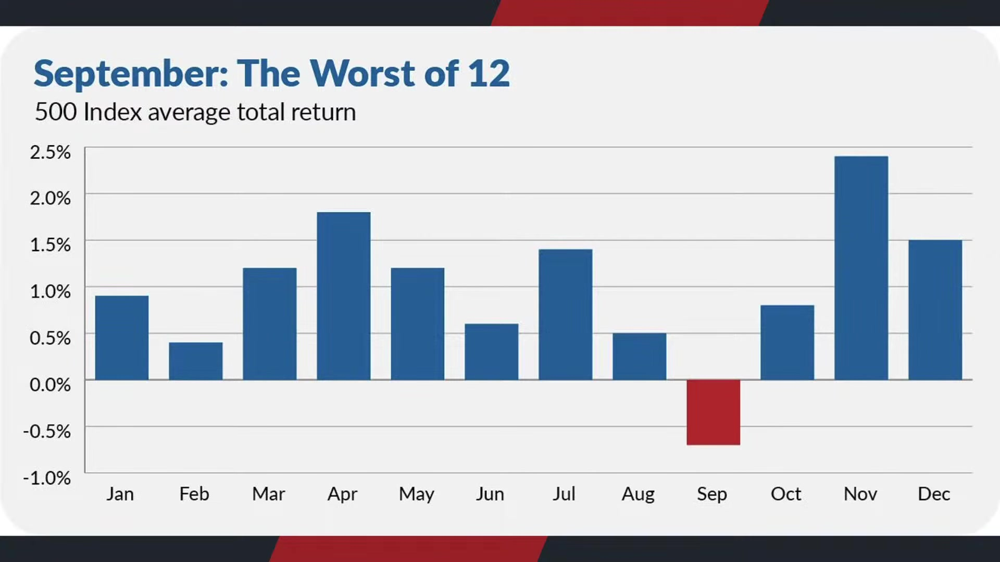

**逐字稿片段：** 我們講的9月魔咒是 從1928年以來的觀察 標普在9月的平均 報酬大概是-1%左右 這是12個月的月份當中 表現最差的一個月 雖然過去有五窮六絕 不過呢美股股市如果從實際報出來看 9月是真的最差的 那當然了 9月如果搭配著其中選舉年呢 通常跌幅又會稍微重一點為什麼 因為在選前通常會有 比較大的不確定性 我們現在沒辦法保證一定是 川普落敗或者民主黨大勝 可是可以確定的事情是 現在充滿著極大的不確定性 因為我們不確定 所以避險情緒增高 使得市場跌幅 會比以往跌一個%還要來得更重 這是過往在其中選舉年的慣性 那事實上影響到9月份行情第一天 當然是美伊戰火的 問題好 這一次美軍已經採取 了具體的軍事行動 開始針對阿哈格島 部分設施採取顯著空襲那當然 好這一次對於哈格島所採取的空襲 美國算是相當節制 是屬於有限而且精准的攻擊 那伊朗隨後呢 又改采飛彈和無人機報復 攻擊約旦境內的美軍基地 好大概軍方宣稱有成功攔截8枚飛彈 阿聯也來下了伊朗方向的無人機 所以在這樣效果底下 原油價格又開始蠢蠢欲動 雖然其實距離歷史高點我們講過嘛 這一次看起來從7月到8月的經驗 要突破新高應該是有很 長一段路要走了 不太可能了 可是它始終造成通膨的粘性

**話題推測：** 解釋「9月魔咒」的歷史數據，提及標普平均報酬

---

## 00:06:51

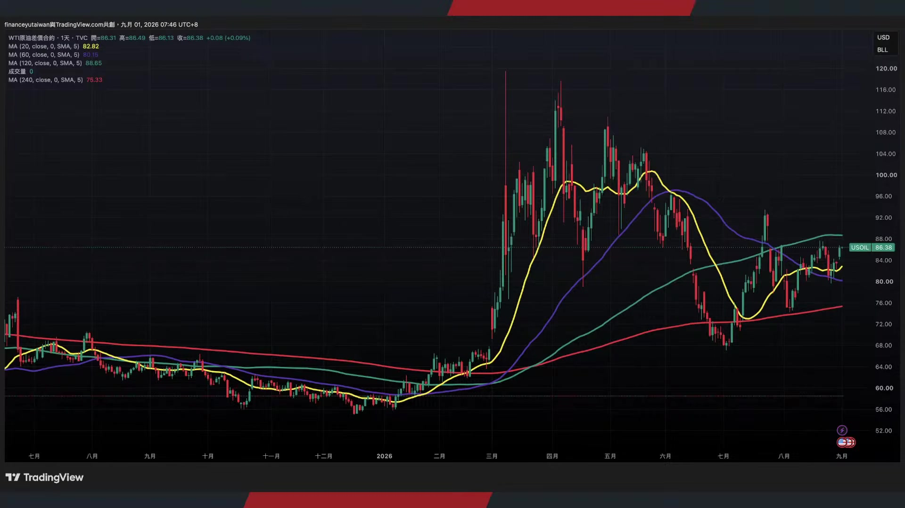

**逐字稿片段：** 我們舉例來說 西德克薩斯原油這一次在 昨天晚上上漲了2.83% 每桶大概收在85塊左右 布蘭特期貨原油價格大概在2.7% 90塊左右 所以 其實它也沒有說漲多高了 市場有點鈍化的反應呢 不過還是比今年年初當時50-60 美元每桶的價格高上不少 所以儘管禮拜一收低哦 整個8月份美國股市還是 繳出比較亮麗的成績單 道瓊月漲幅有一% 那標普升幅有兩% 納指有3.9% 費半就更多了不過呢 這其實主要還是來自於在整個7月 份的暴跌低基期所造成的 可是美伊戰事這件事情呢 的確已經大幅影響到 市場的通膨僵固性預期 甚至是川普本身的期中選舉

**話題推測：** 提及西德州和布蘭特原油的具體價格與漲幅

---

## 00:07:37

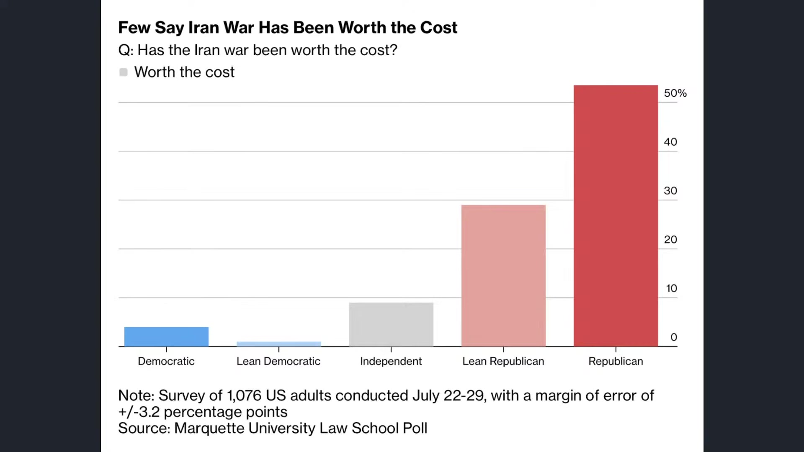

**逐字稿片段：** 我們根據 馬凱特大學法學院最新所公佈 的民調數據 共和黨支持者大概 還有53%認為戰爭值得 但是偏共和黨的大概只剩下29 所以除非是始終支持者 要不然大多數美國人其實 不太理解目前持續發動戰爭 的根本原因來自於哪裡哦 尤其獨立選民大概只有9 %支持 民主黨 但偏民民主黨甚至 只有4 %到1 %左右 所以即便共和黨黨內大概只有 半數認為戰爭的代價值得承擔 其實大家瞭解初衷了 那就是要避免核設施的新建嘛可是 時間拖長以後 大家就開始感受到副作用 這當然你要你不要講 說對於美國民眾來說 如果對川普來說呢 在川普228空襲的那一周 如果有先知告訴川普 你這場戰爭會打超過6個月哦 他還會採取空襲行動嗎 唉這是一個觀察重點對不對 這跟普京一樣 如果在2022年 在普京採取軍事行動的那一刻 我告訴普丁 這場戰爭你要打4年以上都打不完 那他還會採取軍事行動嗎 所以武裝自己是有其必要 對臺灣也是如此哦 要一種震懾效果 但更重要的事情是哦 很多戰爭剛開始的發酵 都以為是一個特別軍事行動 都以為短短幾周幾天就能夠結束 結果時間一拖長 就變成當屆政府極大的災難 如果八年抗戰 你告訴日本人 你一打就打八年 打不完哦 他還一定會發動行動嗎 可能還是會 可是不管怎麼說 他一定會更加的斟酌去審視 好所以現在

**話題推測：** 引用馬凱特大學法學院民調數據，關於戰爭支持度

---

## 00:09:14

**逐字稿片段：** 伊朗就是凡是殺不死我的 必使我更強大 伊朗革命衛隊已經發表聲明瞭 美軍這一次的擴大攻勢 會把報復範圍從中東延伸到歐洲 軍方已經開始研究攻擊 保加利亞等東南歐國家的美軍設施 賽普勒斯也可能成為報復目標 那伊朗的邏輯很直接 你只要在中東有一個 美軍的海外基地 被用來攻擊伊朗 就可以被視為合法的軍事目標 伊朗其實嘗試的過去攻擊 到4,000公里以外的這個 不管是希臘還是義大利的基地 那後來都被攔截了 的確沒有造成實質衝擊哦 可是總有一個飛彈 或者無人機飛來飛去哦 對於整個中東局勢的 影響的確還是依舊緊張

**話題推測：** 報導伊朗革命衛隊擴大報復範圍的聲明

---

## 00:09:55

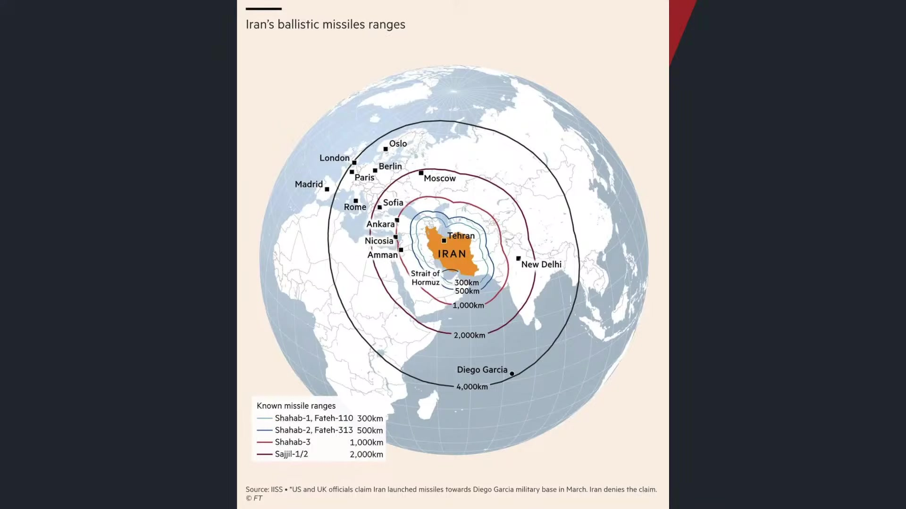

**逐字稿片段：** 我們從蓋洛普民調來做觀察 現在如果是情 是從總體選民來看 大概只有31%的受訪者是 支持美國對伊朗採取軍事行動 低於3月份的37% 更關鍵的事情是 有83%的美國人認為這場戰爭 還會持續很長一段時間 哦 83% 幾乎認為這場戰爭無法結束了 民眾覺得川普已經 深陷海外的長期衝突 現在被政治給反噬那 這些壓力也直接反映 在川普的支持度上

**話題推測：** 引用蓋洛普民調數據，關於對美軍事行動的支持度

---

## 00:10:25

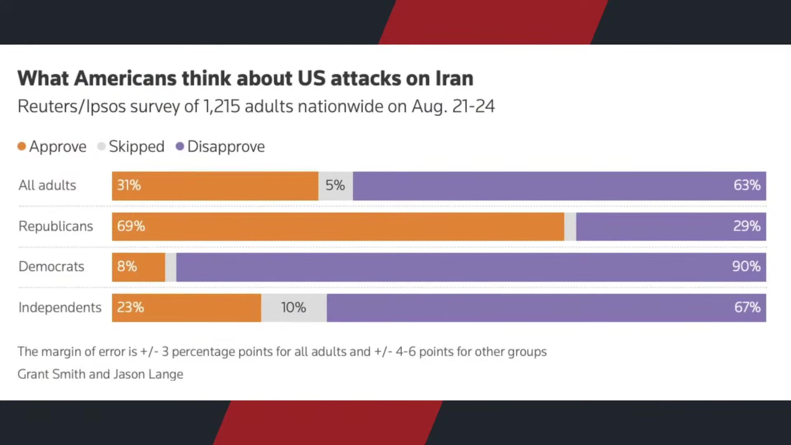

**逐字稿片段：** 現在只有33%的 受訪者認同他的執政表現 已經連續兩次維持在 路透和蓋洛普調查的歷史低點了 所以現在 打仗已經打了半年了 美國汽油價格每加 侖比戰前高出一美元 接近歷史高檔 其實我覺得換個角度了 因為也沒有美軍正式登陸嘛 假設現在汽油價格比228來的低呢 但是美伊戰爭還在持續 也許大家就不會這樣想了 大家都願意接受採取 一定程度的軍事威嚇 可是不能讓我的油價上漲 這是一般人的態度 好這個是川普目前 即便在其中選舉之前 民調壓力極大 仍然勇敢地採取了軍事行動

**話題推測：** 引用路透和蓋洛普民調，提及川普支持度跌至歷史低點

---

## 00:11:01

**逐字稿片段：** 那第二是什麼 就是川普很勇敢的力挺AI資料中心 我們前陣子才跟投資朋友分享各類型 像蓋洛普民調針對AI資料中心的調查 都發現民眾對於AI資料中心的 反對力量已經大於支持力量 原因在於資料中心不只是有噪音 污染用水用電 而且創造的就業機會非常非常之少 使得美國內部有極大的反對聲浪 但是呢川普在昨天正式公開替 全美的治療中心來背書 直言任何反對資料中心的社區 就是想要讓自己落後又貧窮 也許他講的是實話 但是在選前這樣講 好那看起來是不想要選票了 他也認為 如果你想要更多的工作 較低的稅負和更高的收入 你就應該讓數據主宰 那這番話直接撞上美國 地方政治最敏感的神經了

**話題推測：** 轉向討論川普力挺AI資料中心的立場

---

## 00:11:50

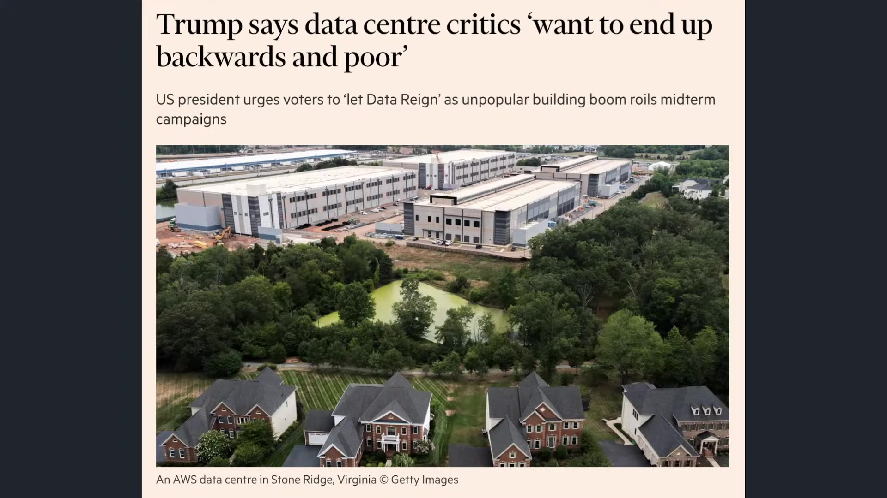

**逐字稿片段：** 我們知道 現在已經有數十個高達1,500 億美元的資料中心 已經因為地方政府的反對而延宕了 紐約州所有新建的新 資料中心全部延後 德州在本月份也踩了一些刹車 在有數百個專案在提案的過程當中 直接進行審查 時間拉長 那共和黨民調也顯示 資料中心已經變成政治負資產了 任何主張建立大量資料中心 反而會使得民眾擔心電價的上漲 還有科技權力過大 以及AI對於地方生活的 就業產生的結構衝擊哦 好所以在這樣效果底下 川普很猛哦 在期中選舉之前呢 繼續轟炸 繼續支持AI 好那 接下來問題要該如何處理呢 好至少看起來現在他 好像也不太管民調了 是不是因為救不起來 尤其我們知道現在更大的

**話題推測：** 提及因地方政府反對而延宕的資料中心專案規模和州別

---

## 00:12:38

**逐字稿片段：** 壓力來自於債券市場 目前市場最大的問題 當然不是企業獲利 企業獲利還表現非常不錯 而是債券市場對於 AI資本支出和美國財政風險的拉升

**話題推測：** 轉向討論債券市場帶來的壓力

---

## 00:12:50

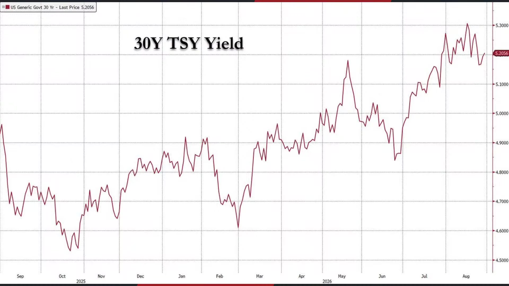

**逐字稿片段：** 好這一次10年期公債殖利率 創下今年新高了 哦這個是現在最緊張的指標 10年期美債殖利率上升4個基點 來到4.76% 這是今年1月份以來的新高 那當然 你說那過去幾個月它也是在走高 對於股市的壓制好像很有限 是這樣子沒錯了 哎但你要想想看 4.7你覺得不吸引你 4.8呢 5%呢 5.1呢 5.5呢 6%就你總不能夠毫無節制的認為 實際利率一直往上升 對對於股市沒有任何影響吧 好這個是現在市場上 很明顯針對美國政府的信用評級 評級的這種資產價格的拋售 另外一方面也隱含著 對於債務系統的不確定性 以及投資等級債大幅搶奪 美國公債所形成的後果 好所以現在支撐美國股市的共識 基本就是經濟不衰退 聯準會不升息 AI資本支出不縮水 民主黨不會橫掃中期選舉 這四個條件同時成立但是呢 是造成美國股市現在還保持在 偏向多頭的根本原因 不過呢這4個隨時都有可能會反轉 經濟應該是不會容易衰退了 可是聯準會不升息

**話題推測：** 提及10年期公債殖利率創今年新高及具體數字

---

## 00:13:58

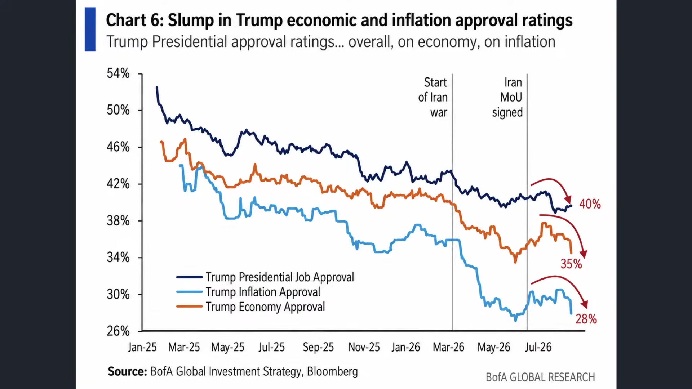

**逐字稿片段：** 哦現在利率預期開始改變了 AI資本支出不縮水很難說 民主黨不橫掃期中選舉 原因來自於大家會擔心 民主黨如果產生一定的杯葛 資料中心的建品質可能會大幅延後 不過現在看起來這件 事情也在提前拉升 川普不管是總統的就業支持率 通膨支持率 還是經濟支持率 我們從美銀統計的數據 基本上都在顯著的下滑 那貝森特呢 在最近呢 一方面進行日元的護盤 可是目前幾乎是全面失敗為什麼 因為日元貶回去了 好日元在短短 幾周內當時採取了一定程度 的美日聯合聲明 結果呢 現在日本二年期 公債殖利率已經上升到1.72% 1995年5月份以來的新高 10年期殖利率碰到2.95% 這是96年以來的新高 所以Jackson hole之後 美日利率的預期是同步的升溫 但是更重要的事情是 日本上升更快 最後導致了 現在我們都很清楚知道 第一次的美日聯合聲明以後 日元最終還是貶 到160塊左右附近了 說明第一階段的護盤 看起來並沒有產生極大的效果 那你是否要緊急採取第二波 可是連美國政府自己進行 債券回購的這種訊息事出 都沒有阻止10年期公債殖利率的創高 就是 我我的我我的做法是 為讓日元停止貶值 以防你拋售我美債嘛 所以我跟你做一些日元上的護盤 結果呢我現在自己遇到升息的壓力 我10年期公債殖利率已經開始飆了 雖然你也跟著開始飆 可是一方面我沒有把 日元的問題給處理好 另外一方面這個美債殖利率的問題 目前看起來也沒有好轉的現象 這個是更大的 在財政市場大家產生的困難

**話題推測：** 討論聯準會升息預期的改變

---

## 00:15:40

**逐字稿片段：** 事實上如果我們仔細觀察 今年全球債券市場 殖利率都在快速飆升 日本10年期公債殖利率飆升到2.89% 今年已經漲了81個基點了 英國10年期公債殖利率5.03% 澳洲5.07 今年分別上漲55和31個基點 美國10年期公債殖利率已經來到4.7了 也就是代表著已經上升到54個基點了 相對之下 全球基本上只剩下中國 10年期公債殖利率還 到1.69% 今年反而下滑了15.33呢 所以全球的國債都在瘋狂被拋售 只有中國國債在漲 哦這真的也很神奇 好但至少可以觀察到 現在全球的債務體系在 AI的大爆發過程當中 形成一系列的 債務市場的壓力 那川普的其中選舉 能源市場壓力同步交錯底下 其實共和黨在年底的選舉 目前看起來是非常非常不樂觀 尤其今年上半年又沒怎麼跌 如果硬要講的話 那等同於 讓市場上有更進一步 不確定性壓力的釋放

**話題推測：** 全球債券市場殖利率飆升的比較，特別提到中國

---

## 00:16:41

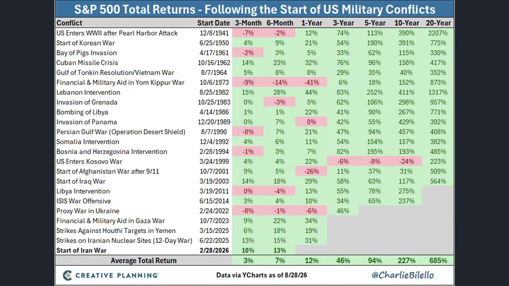

**逐字稿片段：** 其實我們按照過往標普五百 指數在面對戰事的過程 前三個月如果有下跌都是正常的 可是在今年的伊朗戰事 我們看前三個月還漲了10% 後面 應該講說 後3個月漲了10% 後6個月又漲了13% 好從這件事情都看得出來 市場上還是靠AI撐住了 整個股票市場的氛圍 當然我們從美國股市各大 資產的績效表現來做觀察 會發現今年其實跌的 資產也不是很多了 所以即便我們聊了這麼多利空哦 它仍然沒有大幅影響到 大家對於AI的實質信心

**話題推測：** 分析標普500指數在面對戰事時的表現

---

## 00:17:12

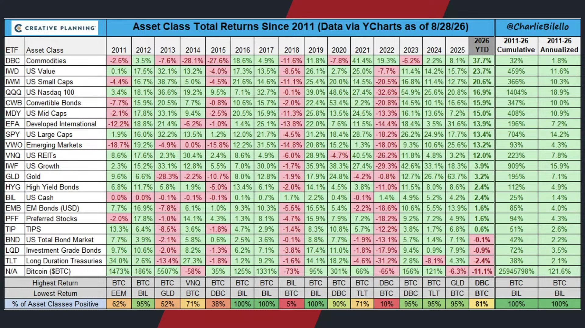

**逐字稿片段：** 今天漲最多的還是原物料 主要是能源資產帶上去的 漲幅37.7% 高居第一 價值股上漲23.7 小型股IWM20.6 納指10016.9 可轉債15.9 中型股15 已開發國際市場13.9 美國大型股13.4 新興市場13.2 Reits有12% 債券市場是比較落後的 不過其實也是有上漲哦 高收益在2.4% 新興市場1.6 優先股1.6 Tips大概小跌0.6 整體債市跌0.1 投資等級債跌0.9 長天期跌比較重跌2.4哦 那當然真正跌比較重的 以前是黃金和比特幣嘛 現在黃金已經轉到正報酬了漲了3.2 比特幣呢 跌了11% 可是相對於今年最大跌幅跌到3成5 比特幣其實已經開始有顯著好轉了 過去一周是上漲23%嘛 不過我個人的看法是 它不代表比特幣真正進入到大多頭 為什麼因為 過去 在市場的趨勢可能是美元信用的下滑 所以買資金買比特幣避險呢 邏輯不難理解嘛 那美國一直借錢 那政府又積極介入金融市場 所以投資人擔心美元長期被稀釋 那就尋找黃金或者找比特幣 這種供給有限的替代資產了 不過問題是 比特幣作為美元避險工具的 記錄一直都不是很穩定 看去年10月 當時川普對中國發出關稅的威脅之後 比特幣24個小時還跌了12% 然後黃金創高 所以兩者雖然都是那種 貨幣貶值的避險資產 理論上也不會出現這麼大的差距 所以比特幣現在的突然暴漲 我覺得也不代表真正 長期資金重新進場 我們過去講過 你被套牢的比特幣也沒什麼必要 去做停損了 都已經跌這麼多了 按照過往它的市場慣性 貨幣供給量受限呢 長期資產還是有拉升的可能性 可是現在的利率環境其實不太於 有利於比特幣或者 黃金立即的顯著上漲 因為目前看起來 滑雪是越來越偏向緊縮的嘛 很大一部分漲幅哦 我覺得對於比特幣來講 看起來比較像是軋空了 就空單回補 然後原本押注比特幣繼續跌的交易者 沒有預期行情會這樣 然後突然反轉 被迫快速買回部位 所以進一步的把價格往上推 那這兩種上漲差很多 如果是養老 基金或者資產管理公司哦 長期投資人基於基本面 重新的去配置比特幣 行情就具有延續性 那現在看起來這種急漲 那很明顯就是空單被嘎了一輪嘛 那股價後續也沒有做進一步拉抬 短線漲幅很漂亮 但是你不能夠 單純解讀成市場重新相信比特幣 現在市場上流動性不足 連公債都快要沒有人買了 哪有錢來買比特幣呢 所以黃金資產也是 受到同樣的市場壓力

**話題推測：** 詳細列出各資產類別的漲跌幅

---

## 00:19:51

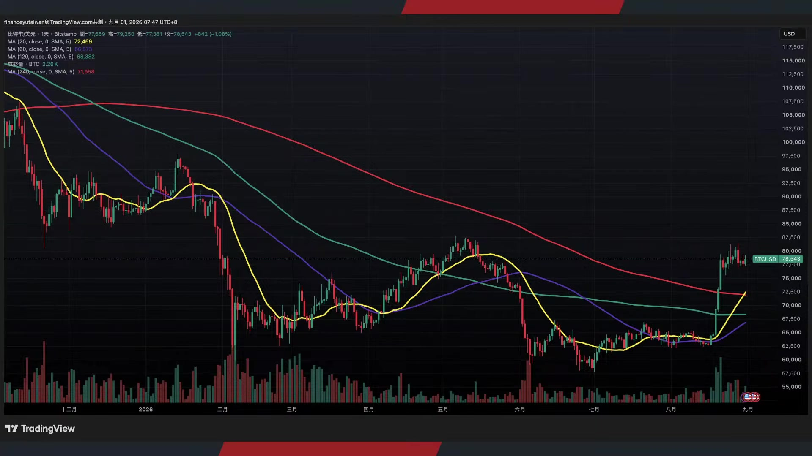

**逐字稿片段：** 黃金雖然在8月份跟比特幣一樣 也是大漲 漲了9.7% 但是升息預期還是最大的壓力哦 因為這一次我們知道 雖然通膨的問題仍然在出現 對於黃金價格中長線有 支撐的可能性 可是利率預期哦 過往實際利率跟黃金價格是高度聯動 所以目前即便看漲買 權需求還是比較強勁的 不過呢 市場看起來 追高意願並不是特別高 看起來更像是在資產做避險型 或者防禦性資產的配置過程當中 當股市不漲了 就會做一些防禦性的配置 這不叫符合 真正大宗資產目前正在

**話題推測：** 提及黃金在8月份的大漲

---

## 00:20:28

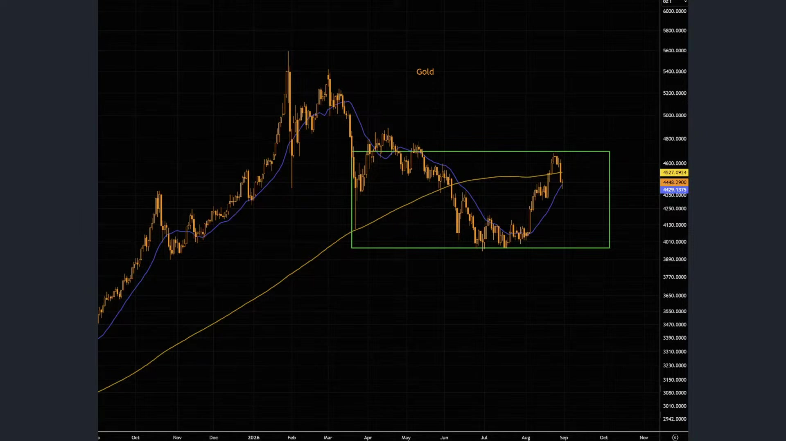

**逐字稿片段：** 快速創高的其實是銅價了 好銅價上禮拜創下歷史新高了 倫敦交易所每噸來到1.43萬美元 好今年它是上漲15%了 好過去一年已經漲了四成五了 好那當然全球電網電動車再生能源 AI製藥中心都在吃銅

**話題推測：** 轉向討論銅價創歷史新高

---

## 00:20:44

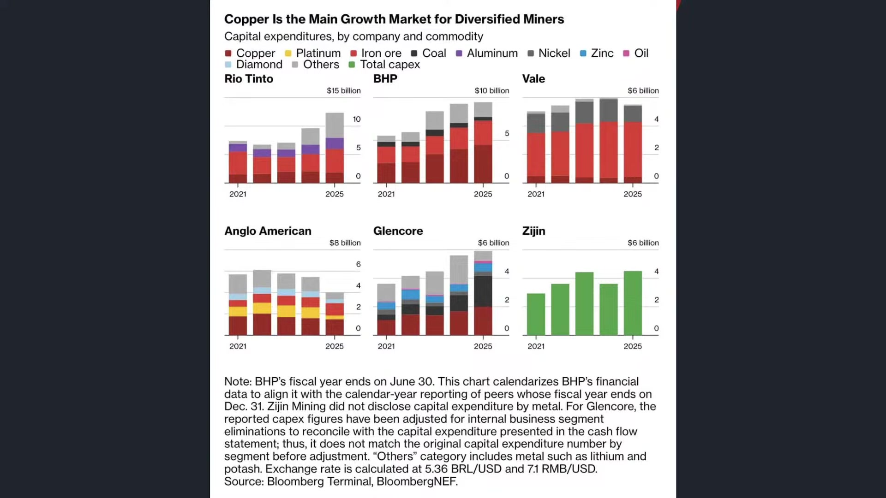

**逐字稿片段：** 所以全球銅需求從去年2,800萬噸的總 需求已經增加到2040年每年4,200萬噸 增幅大概是50% 那現在全球的供給又受限 所以大概每年會出現200-1,000 萬桶可能出現的供 供給缺口 所以在這樣效果底下 要麼就技術上突破 要麼銅價就要被迫一直上漲了 所以我覺得真正投資也 不一定是銅只漲不跌了那銅 舉例來說 汽油價格每加侖100塊 那不會有人開車了嗎 那就不不會一直上漲嗎 所以銅價不能夠也因此一路的上漲 是市場真正的需求是什麼是 電網的升級 資料中心的電網升級鏈 比如電力設備 冷卻 或者輸電 配置基礎建設公司 這個才是真正主流 那不代表是銅一定只漲不跌 這是我的一個區別 大眾資產一路的上漲 AI總有一天玩不下去的 那記憶體 對不對那一直漲漲100% 200% 漲500% 那以後漲 1萬%呢 那記憶體 績效中心 那不是成本就占了90%了嘛 那也沒有人玩得下去嘛 哦所以我個人認為 這是最實質的跡象 給投資朋友作為一些參考 當然我們回過頭說

**話題推測：** 提及全球銅需求預測的具體數字

---

## 00:21:54

**逐字稿片段：** 現在美股是四大指數變化 道瓊指數 下跌370四點 0.7% 收在53,185點 標普下跌25點 0.33% 收在7,686點 納指下跌31點 0.12% 收在26,370點 費半上漲65點 0.57%收在11,535點 好可以看得出來哦 現在幾大指數其實都還在高位做盤旋 好大家似乎在等待下一輪的做夢行情 照理來講 現在也是財報空窗期 應該最適合特別做夢 而且又是第三季 不過看起來 現在就量都在縮 真正我們看到的效果是 股票市場還保持在高位

**話題推測：** 播報美股四大指數當日收盤點數和漲跌幅

---

## 00:22:34

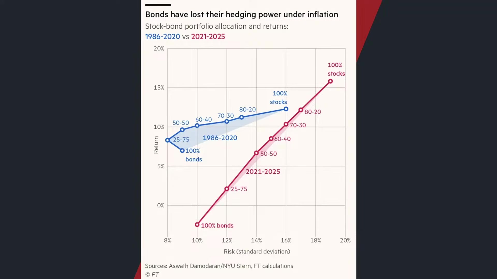

**逐字稿片段：** 可是這幾年過往經常 使用的64股債比 其實已經慢慢開始失效 它也不是完全失效了但就是 這個債券市場的總體報酬 已經沉寂好幾年了 過去總會覺得股票下跌時 美國公債會因此而上漲 形成天然避險 可是高通脹之後 我們細看回測數據 2021年之後 股債的相關性就已經明顯轉為正值 22年到 23年股票和債券市場還同步重挫了 所以22年當時的相關係數 股市跟債市是0.58 然後最近美國不是在22年23年 最後衝破到9.1%之後 最後整個相關性 居然又高度的翻正 然後隔一年又高度的翻負 所以64股債比哦 也不是不能用 是你不能夠再把所有美債 都當成一種避險工具 尤其是長天期美債 又受到景氣影響 然後又有通膨 又有財政赤字 用大量政府發債的壓力 還有期限溢價的壓力 所以所以形成現在在 股債投資比例的過程當中 大家的壓力就越來越大了 這以前都會覺得 其實你們必須要這樣講 現在利率很高誒 正常以前大家的直覺都是利率這麼高 股票就該跌 10年期公債殖利率到4.7 -4.8310年期突破5% 按照傳統估值模型 美股股市還在歷史高檔 那就不不合理嘛唉 利率這麼高 應該大家去買債券 怎麼會有人想買股市呢 所以市場就是如此 因為AI爆發了嘛 同樣一個數字在不同的環境裡頭 它的意義就可能完全不同 如果是高利率來自於失控的通膨 和貨幣緊縮 那當然對於股票不不利嘛 但是如果背後有AI資本支出 有生產力提升 有企業的獲利拉升 高利率搞不好可以跟 高股價同時共存嘛 所以這是蠻有趣的一種思維 真正值得思考的就是同一個數位哦 你放在不同年份 它的意義可能完全不同哦 那以前不是人家常開玩笑 為什麼80歲的男人跟60歲的女人談戀愛 大家都會覺得很正常 那40歲的男人 跟20歲的女孩子談戀愛 他的反應就不太一樣了 明明都是差20歲 就有時候我們判斷一件事情 看的不是數字本身 看的是這個數字背後的情境 禽獸不如 那投資也是一樣 那很多人認為那利率保持在高位 股市一定得跌 也不說一定得跌了 因為現在AI生產力提升嘛 可是你也不能夠想像 那所以實際利率無限的往上 股市就一路的往上吧 好像也不合理 但至少我們可以觀察到 在整個2026年 部分過往的這種指標正在陸續的失效 好那我們要回過頭來看

**話題推測：** 討論傳統「64股債比」策略失效的現象

---

## 00:25:06

**逐字稿片段：** 現在在幾大巨頭的績效表現 其實今年科技巨頭 績效的確不算是特別好 但是呢 至少在下半年記憶體狂潮褪去之後 買盤相對 晶片股不要有所支撐 納指差一點就創下歷史新高了嘛 那今年下半年創新高的兩大 指數也是集中在道瓊和標普 我們看幾檔股票好了

**話題推測：** 轉向討論幾大科技巨頭的績效表現

---

## 00:25:26

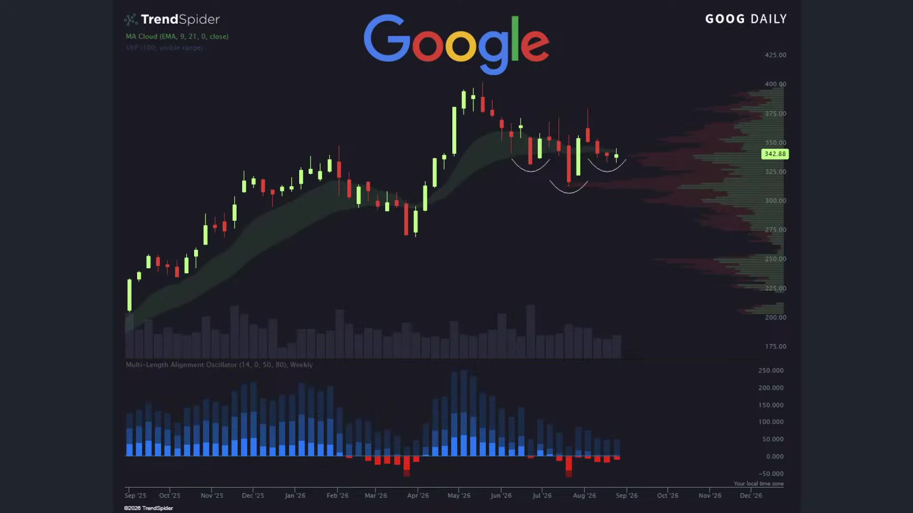

**逐字稿片段：** 你像Google的部分 阿法貝奧其實在5月13號 股價創下歷史新高 之前12個月累計漲幅有150% 可是最近呢 不管是人才的流失 還是最近Gemini 你不覺得好像又比chatgpt 稍微難用了一點嗎 還有龐大的資本支出 股價從高點這樣回落也跌了15%哦 好處是什麼 好處是至少他現在有 一點底部的打底形成過程 那Meta的部分呢 雖然我們知道他好像投 拉馬也沒有太好的結果 投元宇宙也是哦 投他的雷朋眼鏡 到底有沒有一個好生意出來呢 很難說不過其實Meta23年到26年呢 靠著在廣告業務的營收 社交媒體的壟斷 基本上它在25年第四季到26年二季度 分別還是有23% 33% 還有28%的顯著增長哦 哦那股價它從高點這樣 回落下來也不少了 它導致的結果就是它的獲利還在暴升 但是它的股價卻逐步的盤整 最後就是本益比的快速滑落 目前PE ratio 前三本益比只剩下20倍嘍 那差不多回到2022年烏俄戰事的水準嘍 好所以這值得觀察一下

**話題推測：** 分析Google (Alphabet) 的股價表現和面臨的挑戰

---

## 00:26:34

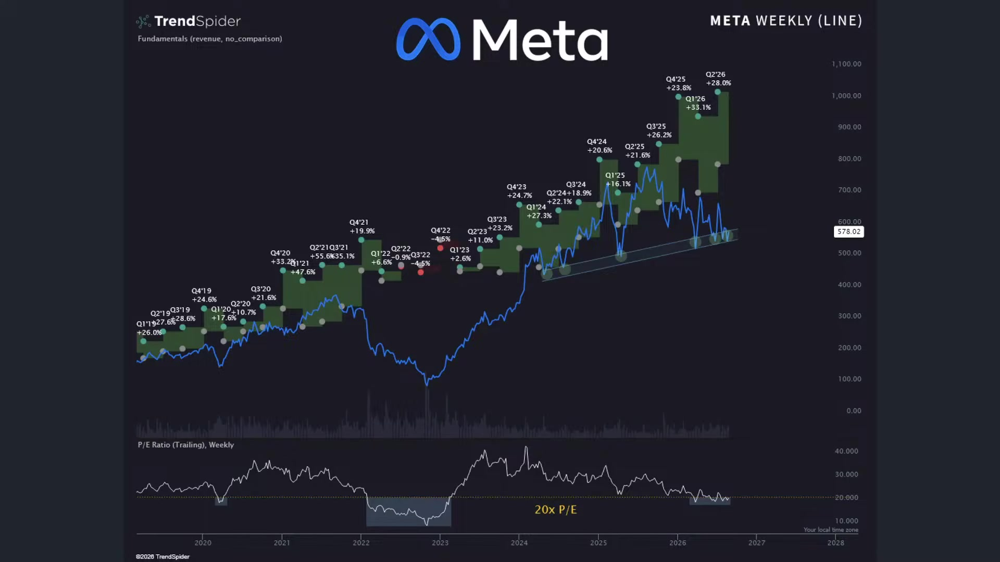

**逐字稿片段：** 微軟的部分呢 這幾周是比較明顯的v型反彈了 從4月份的360低點一路的回升 現在在500多塊 重新回到前坡的高檔區哦 微軟是好不容易 你看當時25年打了一個超級大M頭 那現在倒了 打了一個超級WD 好所以現在就是一個警戒線 然後看一下能否突破過往的高點呢 微軟也是撐了很久 從微軟撐到現在巨硬

**話題推測：** 分析微軟的股價近期反彈走勢

---

## 00:26:58

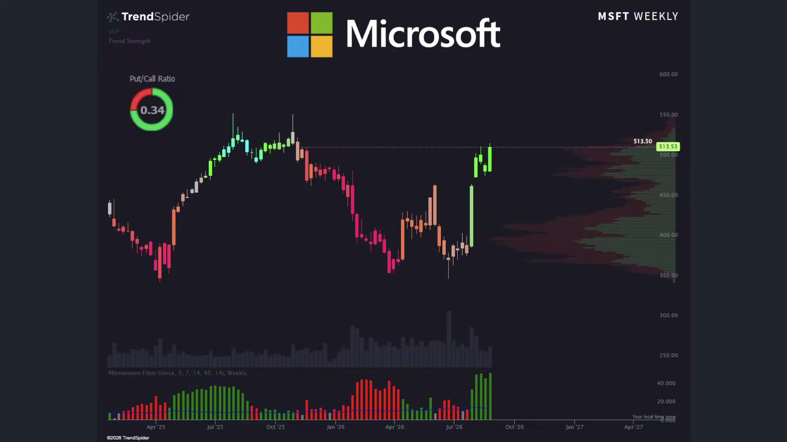

**逐字稿片段：** 亞馬遜大概就在280塊高點回檔 持續進行震盪 但是可以看得出來 巨頭現在的買盤刺激都不是特別強 為什麼呢 就是因為市值太大了 現在以前呢 都是一個記憶體行情板塊 然後被動元件板塊 然後一路成 更早之前是7巨頭大家一起漲 台股也是也是如此 以前也是龍頭股 高價股一起往上漲 現在看起來大家沒錢了 有點拉不太動了 好所以不管怎麼說了 好這些企業目前看起來賣產值哦仍然 是受造市場上比較顯著的獲利拉動 可是這些企業之所以可以繼續投 它的根本原因來自於它的 獲利基本面還是不錯 大概整體獲利還是 保持20%到50%左右的成長 而且美國股市目前在全球的 資金吸收當中 晶片股當然是獲利爆發的關鍵 可是真正賺大錢的 就總量來看 還是這些AI巨頭 只是他們已經賺太多年大錢了 所以年增幅看起來就沒有這麼亮麗 所以最好的結果是什麼 如果你相信AI能夠成功 那有一天你會發現 你所使用的巨頭 你所使用的AI的訂閱系統 那一定是這七家當中其中一家嘛 不會是第八家 不會是第九家 就算是第八家第九家 100% 他們一定要是跟這些 巨頭來租用AI伺服器所以 最後的原理是不會變的 基本上就是由蓋資料中心的這些人 最後獨斷了未來的生殺大權 所以你不確定到底哪一支能夠獲勝 分散風險也許還是最好的做法嘛 投資人也是一樣 你買進一檔股票之後 常常會為自己 這持股找理由 因為上漲代表我眼光很正確 下跌那股市錯殺嘛 財報不好是短期因素 利空解讀成利空出盡 最後你不是根據證據來修正觀點 你是不斷的修正故事 來保護原本的答案 那就不一樣了 所以有時候我們投資 第一個反應呢 可能股價波動的時候 你不是懷疑 你是把所有的證據 硬要塞到原本自己 相信的那個故事裡頭 唉這個壓力就很大 之前看哪一部影集 講那個一個男人坐在 自己最好的兄弟的墓前 講話 兄弟 你走之後 我真的很想你 我老婆快生了 如果真的有投胎 你就回來當我兒子吧 幾年之後 那男的看自己兒子 越長越大 鼻子也很像他 眼睛也很像那兄弟 連笑起來都跟死掉的朋友一模一樣 哇那男的感動的抬頭看向天空 兄弟你真的回來了！ 就很多人看股票就這樣子哦 他的第一反應呢 從來都不懷疑 他把所有證據都塞到 自己原本相信的故事裡頭 像AI雲端巨頭 就是有時候我們在 行情波動的過程當中 你可能相信單一股票都認為 所有的事情對他來講都是利多 那有利空對我來講就變利多了 就是我加碼買進的好時機 但對於單一個股有過高的投射 你知道 還是會傷到你的心的 這幾隻股價今年來看還算不錯的 但如果是特斯拉 如果是甲骨文呢 所以我們才跟投資者分享 這分散風險還是非常重要的 所以 最後我們還是宣傳一下 禮拜六晚上8點鐘 就是我們聽友會了 我們如何在分散風險的前提底下 績效能夠順勢的追上大盤 甚至超越大盤 而且呢在投資的過程當中 做好足夠的資產配置 一方AI出現 不同的中期回檔 那當然你必須要有一個原則 你相信AI能夠成功 可是在每一輪的回檔當中 你要瞭解它的理由 距離泡沫破滅 當中的區隔在哪裡 那有些利空是中期回檔 用電不夠用電不夠 那怎麼會是一個大利空呢 用電不夠 所以電價要漲嘛 所以供給會有缺口嘛 所以會有股價繼續上漲嘛 資料中心蓋不完 那怎麼會是一個大 大利空呢 真正利空很明顯都是 供給過剩的問題了 建太多根本沒人用 那才是最大利空嘛 現在連蓋都蓋不完了

**話題推測：** 提及亞馬遜的股價表現

---

## 00:30:53

**逐字稿片段：** 好就零一分 台股上漲258點 收在46,379點了 對了 星星我們明天再講了 我們主要跟投資朋友稍微 梳理一下這個美國股市 當前市場的概況 大家比較關注的幾則訊息 從一開始我們看到在 川普所採取的新動作 對於AI資料中心的表態 都看得出來 他看起來沒有想要理期中選舉了 看起來就是要 堅持地執行自己的行政命令 堅持地執行自己的政策 那這樣的一個輪廓會導致我們 原本對於通膨僵固性的預期 還有對於在選後世界 產生的不確定性呢 抱著一個極大的問號 那第二個階段是美國 股市在這個時間點呢 雖然大家很明顯7月份的 重挫之後開始做反彈 可是量能明顯不足哦 說明大家買的有點意興闌珊 所有人都在等 等一個造夢行情的出現 等一個推手的出現 可是很明顯有點推不太動大股票了 只好挑一些比特幣來漲了 挑一下黃金 以前都漲那個大板塊了 後來只好挑那個個股來漲 誒有這樣的一個感覺哦 那流動性的預期 誰能夠解決呢 當然要從美債市場來做延伸嘛 現在就是因為美債已經 把那個資金都給吸走了 錢快不夠了 那只有一種方式了嘛 要麼就聯準會主動慢慢的打開水龍頭 要麼呢監管環境做進一步的鬆綁 讓我們更敢去冒風險 只能讓這場遊戲擊鼓傳花的玩下去 才是讓AI股市能夠持續創高的理由 要不然呢 就要立即在下個季度 看到生產力提升了 所以不管怎麼看

**話題推測：** 播報台股當日收盤點數和漲幅

---
