# yutinghaofinance_Xlj2cBFC7_s — 關鍵畫面索引

- 來源逐字稿：[yutinghaofinance_Xlj2cBFC7_s_FIN.srt](yutinghaofinance_Xlj2cBFC7_s_FIN.srt)
- 影片：https://www.youtube.com/watch?v=Xlj2cBFC7_s
- 截圖數：24

## 00:00:35

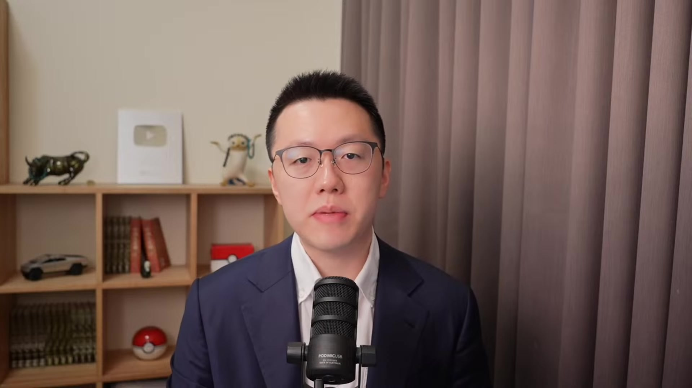

**逐字稿片段：** 我們看到原油價格已經連續五天下滑了, 肺瓣也連續六天上漲了, 昨天納斯達克指數又再度創下歷史新高, 已經連續兩天了。 市場一方面去消化川普對於美伊談判這一次的最新說法 一方面也在等待川普跟習近平即將要開始會面了 那雙方針對AI針對伊朗戰事 針對關稅稀土供應 我們都很清楚知道美方現在是有所求的 如果中方能夠配合釋出一點利多新聞 那對於其中選舉肯定有拉抬作用 重點是股票市場 FOMO情緒似乎有一點再度復燃的味道 所以納斯達克指數週圍是上漲0.8% 收盤和盤中其實都是創下了歷史高點 正式突破了6月初的前高 科技股在夏季的賣壓當中其實是比較大的 這一波除了原油價格回落 沒在價格反彈以外

**話題推測：** 原油價格連續五天下滑，顯示原油價格走勢圖。

---

## 00:01:28

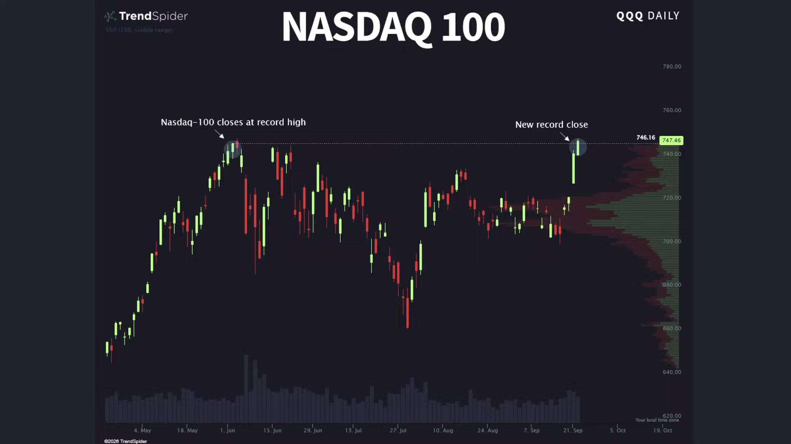

**逐字稿片段：** 主要就是Meta所推出的MUSE AI 模型迅速登上了蘋果應用程式免費下載的榜首 不過臺灣還沒把下載 所以稍晚我再來使用一下 來看一下到底很多人說 使用起來其實跟豆包差不多 那到底是否能夠順應著本輪趨勢 來帶動美國的AI巨頭 科技股向上攻呢 值得留意 至少昨天費辦漲幅也不錯

**話題推測：** 提及Meta所推出的MUSE AI模型，可能顯示Meta公司Logo或MUSE AI產品畫面。

---

## 00:01:52

**逐字稿片段：** Cendex漲了6.8% 希傑漲了4.8% 威騰漲了3.7% 所以其實是兩邊指數都在往上漲 那納斯達克指數由於 因為今年上半年盤整算久了 現在是率先破高 那這一波的創高啊 既有總體環境的改善 也有在個體當中在AI持續模型的推出 可是這就形成了進一步的formal心態 為什麼 因為我們都清楚知道 這一波的創高根本就沒什麼人在追 心理情緒相對於今年五六月份 比較起來是比較明顯的 現在很多人反而是在科技股創高的過程當中 開始要重新回過頭去尋找相對低基期的

**話題推測：** 提及Cendex（SanDisk）漲幅，可能顯示Cendex等個股漲幅數據或圖表。

---

## 00:02:33

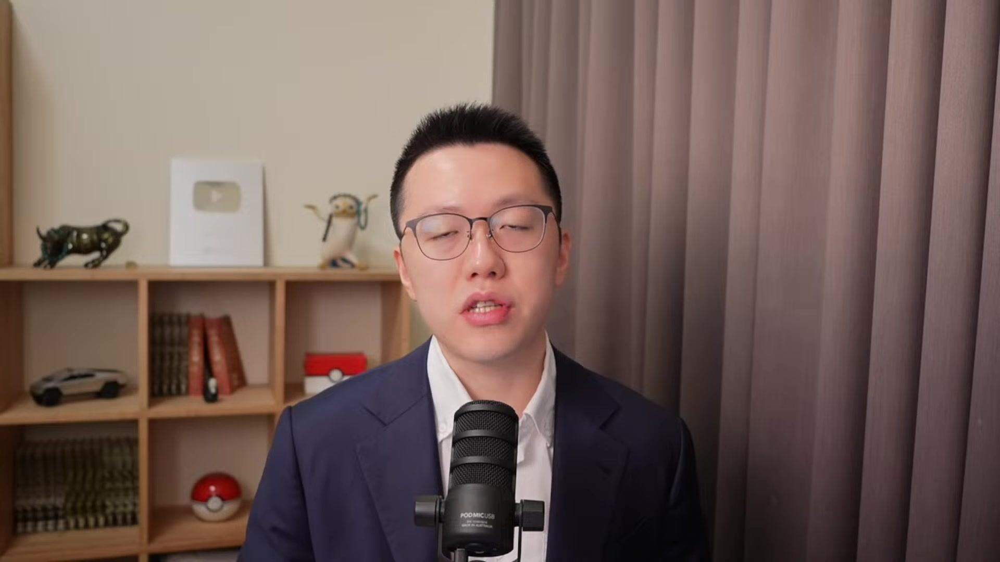

**逐字稿片段：** 可是如果從四大指數來看的話 本來相對高基期的現在也不夠低 本來相對低基期的 現在其實也不是特別便宜 這就是尷尬的進步 所以我們才講說 乖離如果真的出現了回調 基期真的已經偏低了 本益比快速下滑 也許就到達買點了 那現在從技術角度來看 也許價位就沒那麼吸引人了 不過從本益比角度來看 其實也沒有變高多少 這是我們一貫的立場 所以取決於你是用本益比投資法 還是你要針對 做乖離從情緒角度來做投資 有時候是所有指標剛好同時到位 像今年三四月份 今年七月份都是如此 那有些只有部分指標到位

**話題推測：** 從四大指數角度分析市場，可能顯示四大指數比較圖表。

---

## 00:03:13

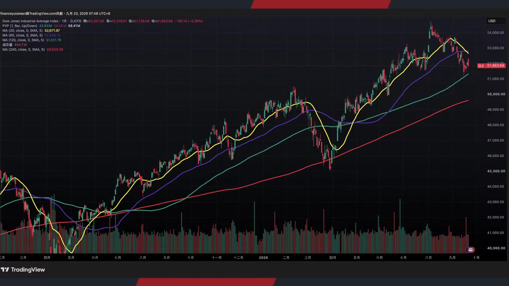

**逐字稿片段：** 我們以道瓊指數來看 昨天下跌185.0.36% 收在1863點 費半已經是本輪下壓摔得最重的 但它打到半年線也開始往上 尤其今年在七月份以後的股價下殺 它也不是殺得特別猛 所以其實位階也不算特別低 標普小跌0.06點 幾乎是持平 昨天報在7764點 那基本上納指的走高 也讓標普隨時可能創下歷史新高 納指就是昨天上漲122點 來到27244點 直接創高了 費半的部分 你不要看它位積 好像這一波跌得比較重 可是下方買盤底部 已經完全出現了 這一波也即將要挑戰 在8月份的前高 看看能否順勢突破 昨天上漲256點 2.06% 收在12689點 其實四大線型 現在看起來都還蠻漂亮的

**話題推測：** 提及道瓊指數的具體數據，可能顯示道瓊指數走勢圖及數據。

---

## 00:04:05

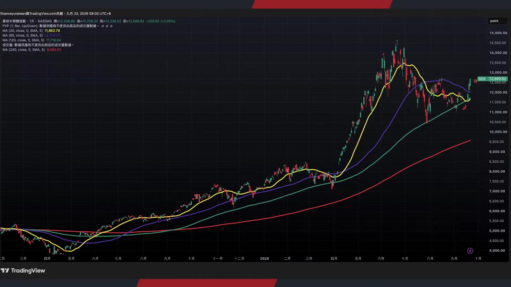

**逐字稿片段：** 從部分指標股 就是上一輪受傷過重的幾隻記憶體股來做追蹤

**話題推測：** 話語轉向追蹤部分指標股（記憶體股），可能顯示記憶體類股概況或選股列表。

---

## 00:04:11

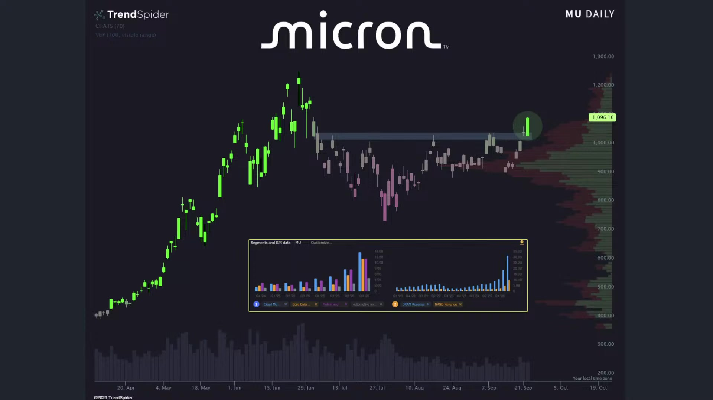

**逐字稿片段：** 美光的部分最近股價來到1096塊 明顯突破了之前1000到1030塊的盤整壓力區 這一波是當時的重要套牢區下方的買盤開始做支撐 所以現在成功站穩以後就代表著 它至少已經把整個8月份以來的跌幅 陸續的開始進行收復了 所以從6月底高一點當時回檔來看的話 現在要突破前高 其實也沒有想象中難 因為量價圖主要就是集中在 今年的7到8月份 雖然距離歷史新高有一小段距離 可是當時也沒什麼人被套牢 所以其實要順勢拉高 也沒那麼困難 這跟臺灣的部分 像被動元件或者記憶體股 那種量價組就不太一樣 美光是已經站穩了 就是上方其實是沒有什麼太大賣壓的 再看一下SANDEX 閃迪的部分 股價來到1873塊 這也突破了過去一個多月 1,750到1,800美元的壓力區 所以從數據上來做觀察 現在已經剛剛好正式突破前波的密集套牢區了 上方其實也沒有什麼太大的壓力 這跟臺灣的很多全職股非常像 就是其實臺積電零發科上方都沒有任何壓力 那就看要不要拉的問題 只是由於全職過大 也許要做它 所需要的資金必須是國際股市外資流動性的全面回升 才能夠有效推成 不過從美國部分的指標股來看 即便當時摔很重的記憶提國 現在看起來都已經站穩了

**話題推測：** 談及美光股價突破壓力區，可能顯示美光股價走勢圖。

---

## 00:05:39

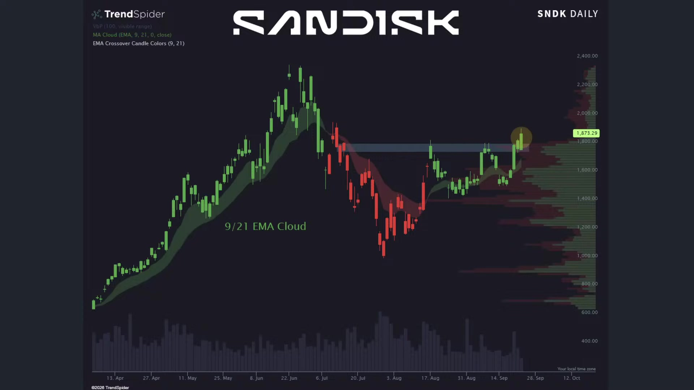

**逐字稿片段：** 再看一下Meta Meta是推波助瀾 讓納斯達克指數創高的重要關鍵 昨天是小跌0.6% 不過過去一週它已經漲了11% 這是25年4月份以來的 最佳的單週表現 你看本來今年還是一個 很標準的下行通道 從2026年以來 你有沒有發現 Meta幾乎就是頭頭低 每一次的頭都比上一次還要來得低 然後就從去年10月份AI湧動機之後 它就一路進入到下行通道 這就完蛋了 結果兩週的行情瞬間就站回去了 今年又回到正報酬了 所以我們從這樣的一個角度來做思考 會發現市場仍然在尋找 不管是轉機轉型 或者說原本落後 股價未接低的股票來進行輪動

**話題推測：** 再次談及Meta，強調其對納指創高的關鍵作用，可能顯示Meta股價走勢圖。

---

## 00:06:26

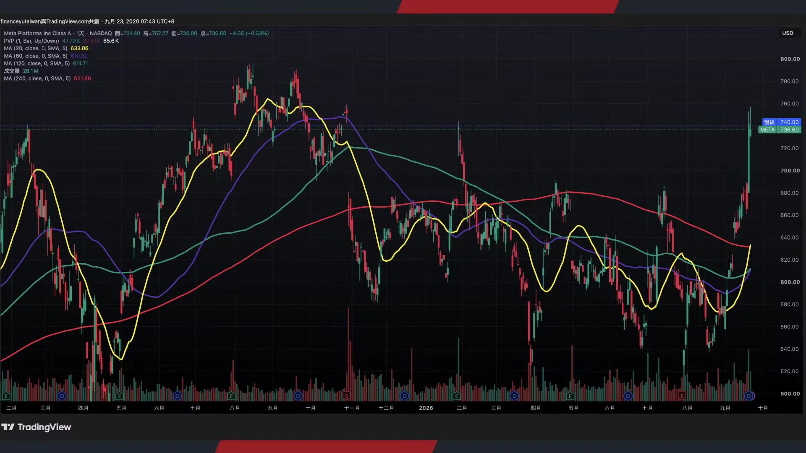

**逐字稿片段：** Meta這一次在2030年之前 也宣佈要投入6000億美元來建設AI建設 那祖克伯現在面對的問題 除了模型能不能進一步的進化 因為MUSE AI 它算是過去在Lama模型之後 很長一段時間沒有推出好模型之後的一步 一大步 那這麼龐大的資料中心 晶片和電力要到哪裡去找錢 還要說服地方居民接受

**話題推測：** 提及Meta在2030年之前投入6000億美元建設AI，可能顯示Meta的AI投資計劃新聞或圖表。

---

## 00:06:53

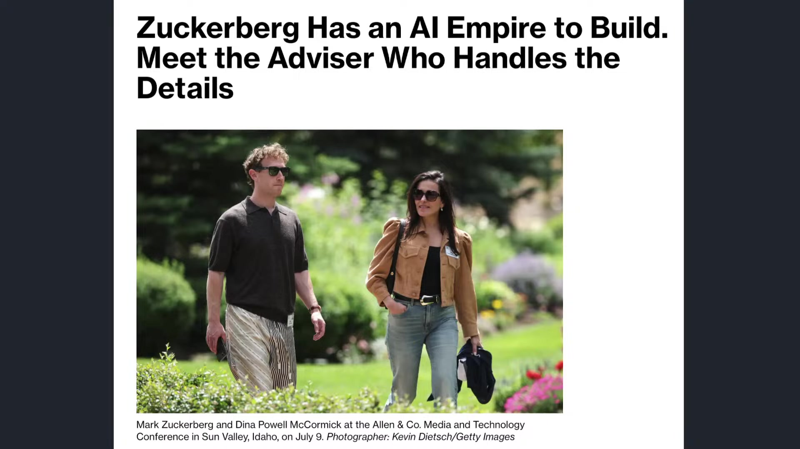

**逐字稿片段：** 現在他找來新的新總裁 叫做麥考密夫 他是副董事長 接下來會共同領導Meta 而他也曾經作為高盛的合夥人 也是以前川普政府的副國安顧問 某種程度而言 祖克普把更多的時間留給工程師 和AI模型來做研發 讓他專門去處理資金 政府法律和公共的對外關係 因為他很清楚知道 AI能不能建的城 跟地方跟中央級都有密切的相關 現在AI已經從單純的模型戰 擴張到生態戰 擴張到政治戰 這就是Meta目前所採取的態勢 看看有沒有機會能夠扳回一城 事實上這一波力度應該是衝擊蠻大的 要不然亞馬遜就沒有必要封鎖MetaMuse 我們看這一次亞馬遜 把Meta的AI購物代理Muse直接給禁了 表面上他說當然是因為安全和授權問題 亞馬遜的看法是 Muse在沒有事先取得同意的情況底下 就進入到亞馬遜的網站 幫助使用者來瀏覽商品 操作賬號甚至協助賬號 而且沒有充分表示自己是AI代理人 那對於亞馬遜來說 有一個第三方的AI可以每天來我的網站來做操作 賬號安全 資料存取 交易責任都會變得非常複雜 雖然把你給禁了 那Meta當然很不爽 強調MUSE不會因為看到使用者的密碼或者付款資料 相關的憑證就會因此而被盜用走 而且這些都是有安全機制保存的 所以雙方的爭議並不是說AI到底安不安全 沒有人會說自己的AI是不安全的 是說第三方的AI到底有沒有權利 像真人一樣去使用其他公司的網站 比如說以後我AI化之後 基本上有時候我在影片上講話 可能大家也分不出來 到底是不是本人了 那我就可以交代 AI今天要講的幾個主軸 那你要記得自己開直播 自己開OBS 然後自己不能打開相機 也不需要打開了 你就這樣子直接來做露出 那有時候他幫助我 到YouTube後臺來做直播 是一個代理性AI YouTube本身可以接受嗎 這的確是一個好的問題 但是我相信更深一層 當然是商業利益的問題 如果消費者未來只要告訴MUSE 幫我找一臺最適合我的掃地機器人 MUSE他就自己做比價了 挑選商品甚至完成購物 那消費者根本就不需要 親自逛亞馬遜 就好像我們使用LINE 使用WhatsApp 使用一些通訊軟體 那有時候我們想要知道 去年我跟一個女孩子的聊天記錄 我們當時聊了什麼 好像有點曖昧 對不對 那正常來講我們要打開 開上一個字一個字去看 懷念當時的美好 現在我只要告訴我的代理型AI 幫我到我的通訊錄裡頭去挑選 我可能有曖昧 可能有示好的言論 幫我整理我當時講了什麼 心態大概是怎麼樣 我就完全不需要使用它了 那少使用這個軟體 本身都會讓軟體業形成重大衝擊 這個是今年年初 當時SaaS末日 軟體末日的巨大衝擊

**話題推測：** 提及Meta找來新總裁麥考密夫，可能顯示新總裁照片或簡介。

---

## 00:09:51

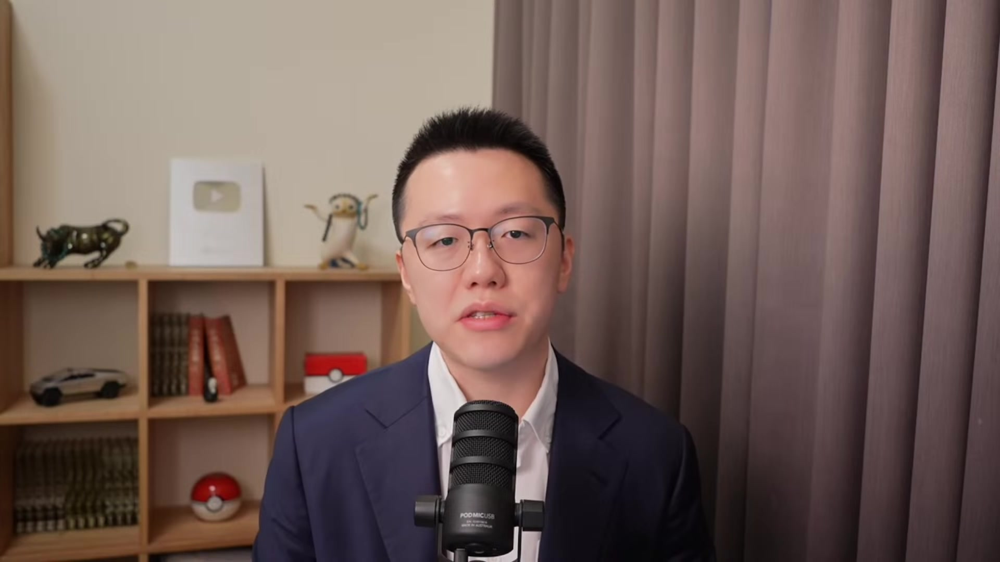

**逐字稿片段：** 所以這場衝突比較值得觀察的是 下一代網路的入口 到底掌握在誰的手上 過去消費者想要買東西 你一定要打開亞馬遜 淘寶 Google 蝦皮 未來可能直接對AI說幫我買 他自己幫你比價 自己幫你交易 掌握的消費者 真正掌握他的人 可能就不是電商平臺了 因為最值錢的就是資料 最值錢的就是背後的後臺數據 如果最後變成AI助理的公司 掌握了這項數據 壓力就很大了 所以商方的交戰已經開始了 但也說明著 AI的潛力其實還是非常大 至少從存量競爭角度來看 它會把一筆人的生意給明顯的搶走 當然這次我們觀察到 現在市場上在FOMO情緒底下 持續推升的效果 可是從悲觀論者來看 你有沒有發現這一波的上漲 其實就是沒這麼樂觀 甚至有點悲觀 這的確是真的 因為目前所出入的報告 也並不是贊同股價就一路的向上 認為反而有繼續回調的空間 我們再抓看看有沒有機會 為什麼這樣講呢 就是因為市場現在就是FOMO 我們以摩根士坦利的首席分析師 麥克威爾森 這不是那個麥克威爾森 應該是那個麥克威爾森 對應該是 他以前是在摩根士坦利 好像也是 重點是威爾森 因為過去他一直以來都看空 我記得他有一次變看多 現在他又認為美國股市 要開始跌一層了 美股表面上距離歷史高點2% 他的態度是 美股內部是明顯分化的

**話題推測：** 探討下一代網路入口的掌握權，可能顯示網路入口或平台競爭概念圖。

---

## 00:11:17

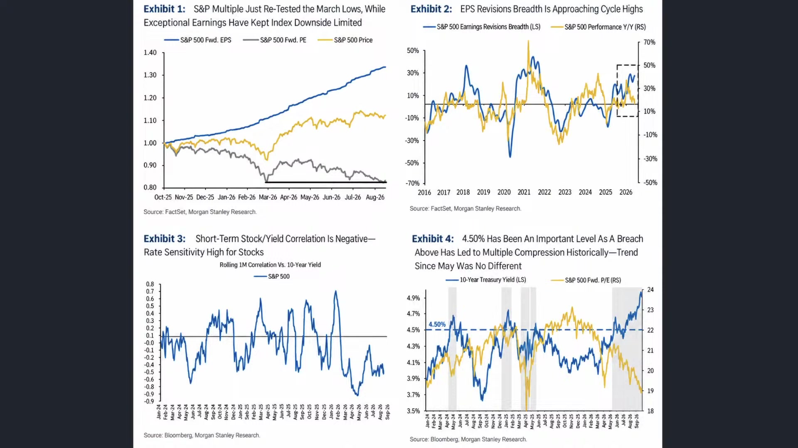

**逐字稿片段：** 羅素3000指數成分股當中 有超過40% 自6月以來已經下跌超過兩成 那標普500預估本盈比也降到19倍 所以硬要講整個大盤的確沒有這麼貴 可是威爾森認為 現在在部分個股當中 如果你去投資 它可能保持在一個標準的下行通道 所以其實股市是虛胖的 這是他目前的態度 這是FOMO心態的一環 那第二個角度 是市場上認為 目前散戶資金的買盤 並沒有想象中還要來得劇烈 如果沒有揮達的話 美股的個股資金甚至已經轉為淨賣處 它的概念就是 就是主要就是靠這些大型股票 目前在成 過去一個月 個股和整體上市證券的散戶 淨買入動能都在下滑 過去也從什麼都買的追漲模式 指向少數有題材的股票來做集中 我們舉一個比較直觀的變化

**話題推測：** 提及羅素3000指數成分股的下跌情況，可能顯示羅素3000指數相關數據圖表。

---

## 00:12:07

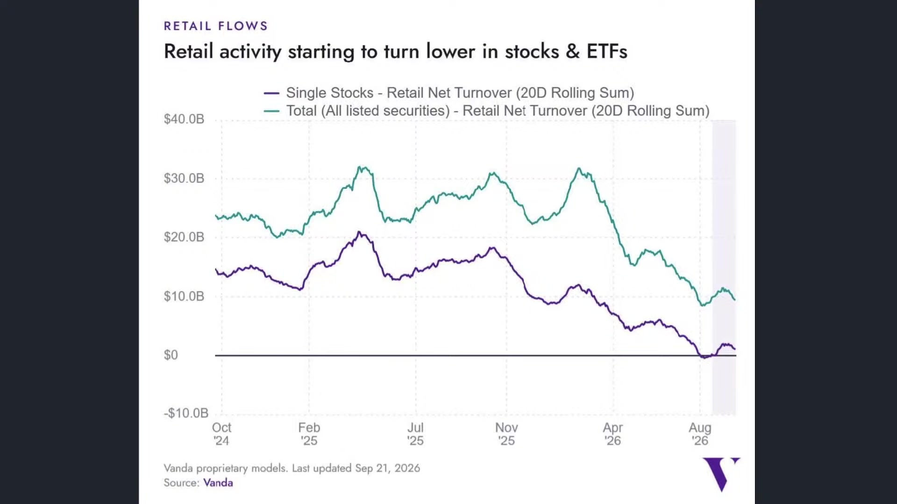

**逐字稿片段：** 這個是半導體市場SOXX 成分股散戶的現金買盤 之前曾經一度大幅飆升 可是最近流入量開始快速的遞減 所以就算要上漲 你也不用擔心像五六月份上漲這麼快了 這是目前比較悲觀者所給予的論調 那更值得觀察的事情是 現在整個輝達的資金 如果把它扣除的話 那整體美國股市的淨資金 已經算是淨流出了 說明如果沒有幾支大型全資股的買盤 其實美國股市的總體買超幅度 並不是如同想象中的強烈 所以你只要沒有買到部分全資股 就開始有落後大盤的可能性 這是另外一層的壓力 那這些我個人認為 那都算是FOMO心態的加成 就是因為你覺得漲了 感覺沒買到 不行 早一點利空 等它下來我再結 我覺得大家的心態反而是這樣子 所以這些訊息真的是一個大利空 我們過去講過 只要沒有迎來泡沫破滅的前兆 也就是供給過剩 AI算力過剩 什麼殖利率的問題 油價的問題 美中貿易戰的問題 市場估值建制延後的問題 那個都是估值回調 那個都是中期回調 那個都不是泡沫破滅 這是我給予市場的態度 給投資朋友做一些思考

**話題推測：** 舉例半導體市場SOXX成分股散戶現金買盤，可能顯示SOXX基金散戶資金流向圖。

---

## 00:13:22

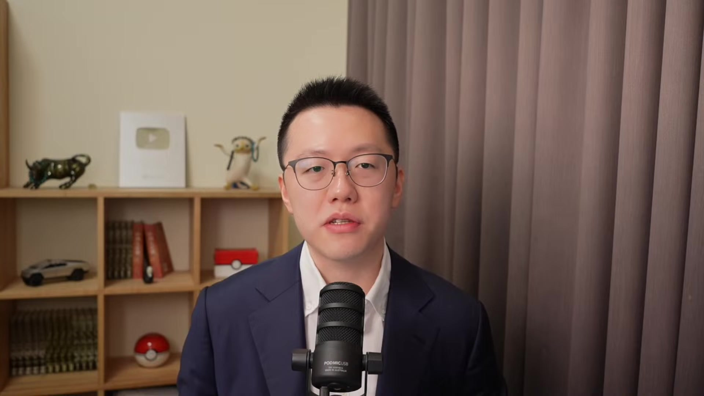

**逐字稿片段：** 好那輝達逼近了 關鍵壓力缺口之後 杯柄形態目前 大概也逐步接近完成了 所以雖然我們觀察到 輝達股價也算盤整了一陣子 從今年3月4月5月 就這樣在高位盤旋 不過杯柄形態 其實看起來還不錯 因為它也算是 突破了大部分的量價區 那如果能夠順勢站上 那輝達能夠創高 對於整個大盤的動力 肯定影響來得更大 事實上我們知道 到輝達在過去幾個月 正在逐步變成 AI產業的中央銀行

**話題推測：** 談及輝達股價逼近關鍵壓力區和杯柄形態，可能顯示輝達股價走勢圖及技術形態。

---

## 00:13:54

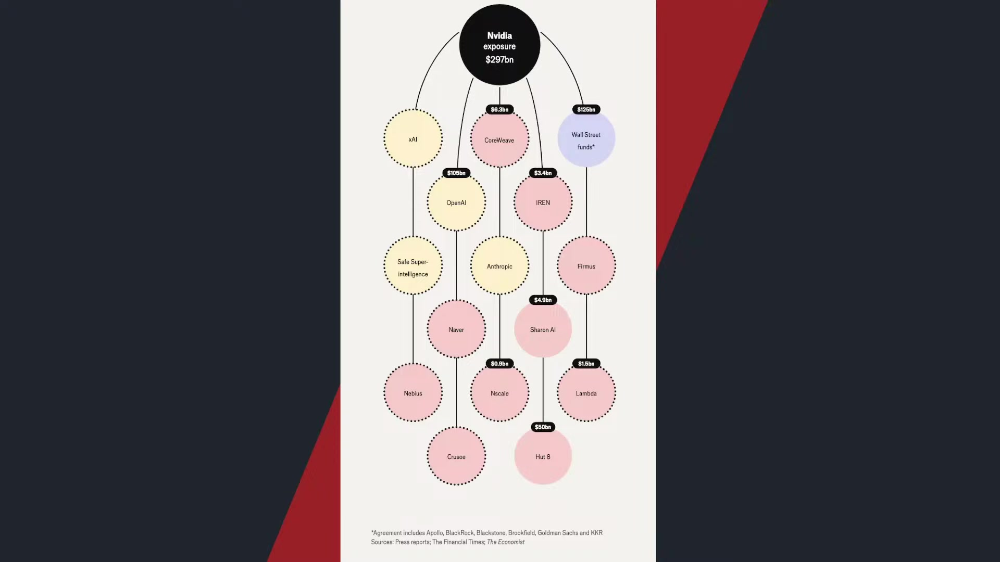

**逐字稿片段：** 公司市值現在5.4兆 甚至市場預估 2029年的營收 可以達到1兆美元 那更值得注意的事情就是 現在三年過去 輝達已經投入 超過700億美元 來投資這些新創 也對客戶提供 大概有3000億美元的 各類的融資支持 所以你要把它 慢慢的當成一家控股公司 科技業的不客項 尤其是針對那些新創企業 這一套模式 在AI需求高速成長的時候非常有效 它的背後代價就是風險會快速累堆 回答目前的潛在客戶的擔保 和採購的承諾大概是3000億美元 另外有250億美元 是用於未來的股權融資 以及330億美元的直接債務 那摩根士戰利的預估是 如果擔保陸續生效 回答的廣義債務 明年初從530億到後年 應該是到2000億 那這有兩個前提 一個就是AI算力需求還會成長 它還是會繼續買你的貨 而且舊晶片要仍然維持高產值 目前H100的長約租金 每個小時大概是2.8美元 只比2023年剛推出時低一層 說明就算現在是舊機款 其實也是價格很緊的 價格也是很貴的 如果未來資料中心大量完工 市場會擔心 那算力價格晶片產值開始下跌 會不會影響到輝達的銷售量 這是市場最擔心的 但是輝達已經提前做了 如果銷售量下跌 AI最後還是爆發了 第一個就結文字悖論 需求最後還是會成長 過去我們講過 那個銀行員悖論 1970年第一臺ATM誕生 所有人都覺得完了死了 銀行也要正式搜索 大財源開始了 想不到銀行分點更多了 為什麼 可以解放能力 一個銀行不需要 再這麼多貴人收取款了 你可以大量的分散到全美各地 所以這叫做 有時候一個新技術的突破 它不代表需求消失 而是需求更多的爆發 那揮達在做什麼呢 第一對賭需求會繼續爆發 第二那假設我當時也不是硬體當中 唯一百分之百龍頭市佔還能夠擴張 那我也可以藉由我的投資版圖 來扶植這些企業持續擴張 那這些企業我現在只投20億 30億像CoreWeb 像Seeking Machine Lab 我投20 30億 未來他們有可能成為下一個揮達 也許我就靠揮達控股公司的方式 成為科技業的博客項 這個就是揮達 目前所給予的態度 當然它背後最大的挑戰是什麼 就是雖然輝達本身財報 還有現在的CDS價格 沒有什麼太大變化 畢竟它是賣產值的 可是它的客戶 一個接著一個壓力越來越大 我們舉幾個角度來做思考

**話題推測：** 提及輝達公司市值和預估營收數據，可能顯示輝達財務數據或預測圖表。

---

## 00:16:29

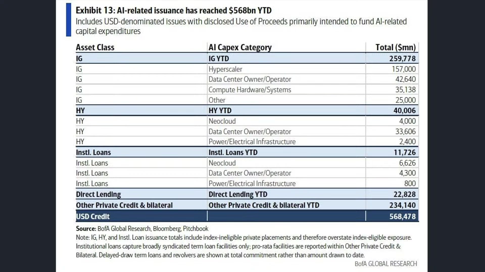

**逐字稿片段：** 一個是昨天我們提到的軟銀 軟銀現在因為好賭OpenAI 最近又發行了 110億美元的垃圾債 那就代表著 接下來有進一步的 還債壓力出現 如果OpenAI不上市 它壓力只會越來越大 其中100億美元分成三種期限的美元債 還有10億歐元分成兩種期限的歐元債 主要就是因應下一輪OpenAI投資 和一般企業的用途 軟銀整體對OpenAI承諾的投資 已經650億了 是最大的投資者 現在已經逐漸變成用自己的資產負債表 在替AI擴張融資 就是我們都以為是OpenAI要拼命借錢 沒有 是軟銀已經成為OpenAI最大的支柱 所以軟銀就想辦法去借更多的錢給OpenAI 已經綁成這樣了 它造成的直接效果是什麼呢 就是目前軟銀的CDS價格 五年期又再度創下 今年以來新高了 基本上又開始挑戰 當時2024年中旬左右的水準 所以從這樣的一個角度來看

**話題推測：** 提及軟銀因好賭OpenAI發行110億美元垃圾債，可能顯示軟銀、OpenAI Logo及債務新聞。

---

## 00:17:27

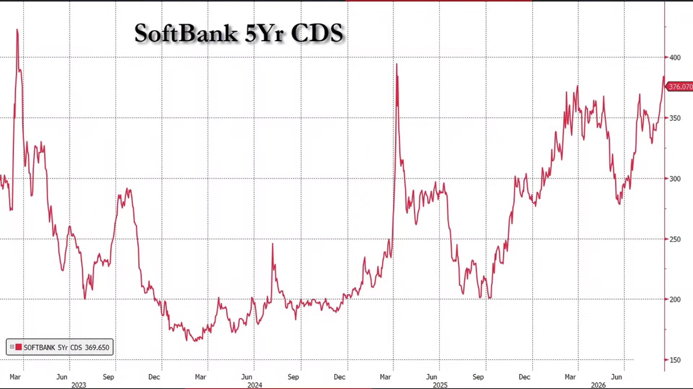

**逐字稿片段：** 軟銀到2031年的到期美元債 五年期 它一月份大概是6.7%左右發行 五年 然後直立率給你6.7 9月這個禮拜開多少 它新發行的100億美元債券 開8.2 軟銀開8.2%的殖利率 信用違約交換成本CDS 也來到三年來的高點 說明它開得很高 但是所有人都覺得 它違約的幾率肯定是最高的 這就形成很有趣的跡象 這是軟銀史上 應該是本世紀以來 開出最漂亮的殖利率 它為了要籌錢給OpenAI 它願意發8.6%的殖利率 五年期 這個就說明著 要麼它非常看好OpenAI 要麼它真的借不到錢了 所以只好開出非常亮麗的殖利率表現 當然背後跟OpenAI有關的甲骨 我們昨天也提過了

**話題推測：** 提及軟銀新發行債券殖利率開8.2%，可能顯示軟銀債券殖利率數據。

---

## 00:18:18

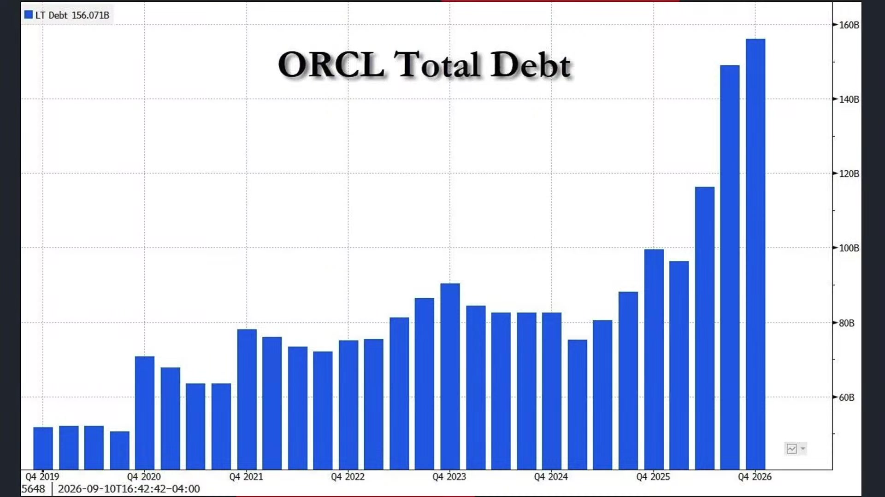

**逐字稿片段：** 包括總體債務的成長 24年大概800億 後來總負債一路的攀升 到26年第四季 已經拿到1560億了 持續規模的上升 這件事情都讓大家意識到 有時候我們覺得AI時代最危險的 可能是企業太安逸 你只是想要守住自己的護城河 你要靠既有的本業賺錢 你又不願意砸錢追逐新技術 然後最後就跟以前那些 錯過科技浪潮的公司一樣被淘汰 但現在科技業反而出現另外一種焦慮 那怕的不是花太多 又怕花的不夠 又不是擴張太快 但是又覺得別人比你更快 資料中心要蓋 GPU要搶 你只要慢一步 好像整個AI時代又跟你沒有關係 所以你放到AI時代 企業當然可能會因為不努力被淘汰 但你說太努力投資過頭 市場也會給你評價的 你殖利率8.6還借不到錢 那可能死得更快 這就是我們觀察到的十字跡象 那句話怎麼講的 花天酒地 平凡性交 並不會短命 但是你上班加班 熬夜應酬 更容易短命 可以理解嗎 就你每天享樂的花天酒地的 那不一定會早死 每天熬夜加班的通常都很早死 所以現在就是你要取決於 那你到底是瘋狂的支出 瘋狂的擴張自己的AI投資 還是你就好好做自己的本業 沒有兩種極端 你都在中間找平衡 你投資過頭 市場也會教訓你 軟銀就是很明顯的 這個財務狀況弄成這樣 那幾乎跟熱市 再也沒什麼區別了 但是你說 如果現在就好好做自己的本業 那你績效就跟波克夏一樣 漲幅不會太多 過去我們講過

**話題推測：** 討論總體債務成長（從800億到1560億），可能顯示相關公司的債務成長圖表。

---

## 00:19:53

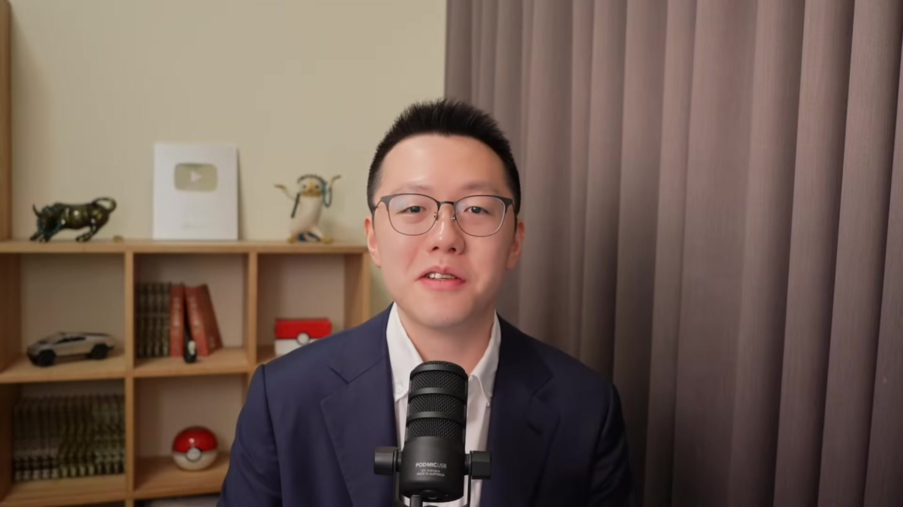

**逐字稿片段：** 格雷厄姆 這個矽谷的大佬 格雷厄姆曾經說過 金錢被揮霍光 往往不是因為消費 都是因為投資 我們基因裡頭 你過度消費 過度玩樂 本來就有警報器 你想要多打一天遊戲 你覺得有點愧疚感之類的 但是投資和工作不一樣 就是它沒有天然的警報器 就是你投資過頭 你可能沒感覺 你還在說服自己是對的 但其實你已經上癮了 投錢投得太誇張了 所以市場上現在是有 自我的校正迴歸機制 好那這是第一部分 也就是FOMO心態和市場的擔憂 它到底卡的點在哪裡 我們看到股市創高 然後你沒追到才會FOMO 那FOMO的理由是什麼呢 一個是市場的量體過於集中 有部分個股 漲幅並沒有想象中來得多 沒有買到重要機制 很容易現在跑出給大盤 第二種角度 其實就來自於 市場雖然知道AI資本支出 還會繼續擴張 AI行情還在持續 可是部分個股已經透露出 它這個遊戲不成功變成人 快要玩不下去的感覺 會讓市場上有一點擔憂 除非基期低一點 所以如果股價還在創高 我就不追了 股價摔回來 我考慮一下 但正用於這種風火心態 股價我們講說 總在半信半疑中持續成長 現在就是半信半疑 就是這些看壞的人 他也不敢保證AI一定不能成 但覺得如果他要能成 那我機器要買低一點 這個是大家的想法 好那第二部分就來自於 那川習會能否釋放出一些好消息 讓市場上能夠緩解一下市場的心理情緒

**話題推測：** 引用矽谷大佬格雷厄姆的說法，可能顯示格雷厄姆照片或語錄。

---

## 00:21:24

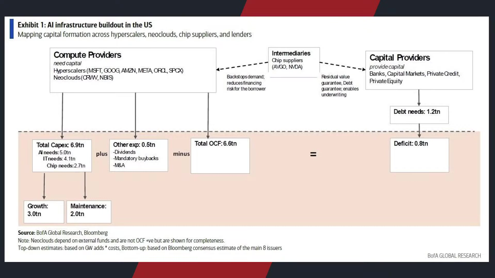

**逐字稿片段：** 那大概分為兩個部分 第一個是美伊戰事的部分 中方是否有介入的空間 因為這次美國和伊朗 又直接打開對話大門了 川普在禮拜二紐約聯合國大會 場邊跟伊朗代表 已經開始進行三個小時的會談 那當然他形容這場會談 非常好 非常的有效 而且促使其他一系列的特使 都有相關參與 雙方近期的互動 頻率開始顯著拉昇 但是呢 他在講話的同時 談判的同時 川普又馬上在聯合國大會 警告說 如果無法達成和平協議 美國會進一步對於伊朗 採取行動 就一邊做壓制 一邊來和談 那到底最後反應如何呢 至少從原油價格來看 市場是有點信心的 那有信心有兩個原因 第一個是美伊最近又看起來正在談了 談判期間沒出什麼亂子 至少可以讓原油價格做一些獲利了結

**話題推測：** 話題轉向美伊戰事，可能顯示美伊關係新聞或地圖。

---

## 00:22:15

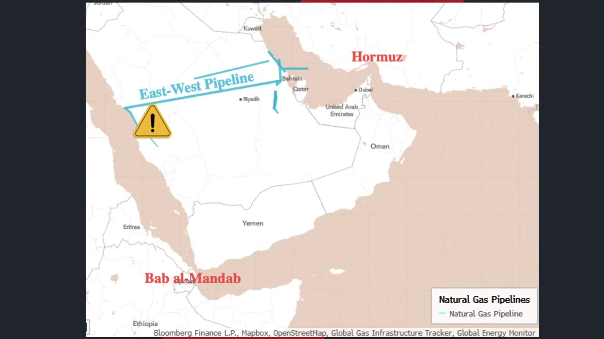

**逐字稿片段：** 那第二部分就是沙烏地的紅海輸油管線 最近準備要重啟了 之前被無人機空襲 有一半的產能被傷害到了 那現在其實這種東西 一顆飛彈打過去又要開始停擺兩個月了 不過至少最近是重啟了 這條管線每天運送400萬桶的原油 是沙烏地阿拉伯避開赫姆茲海峽的重要出口路線 現在就往鴻海的鹽埠港來做運送 那中東的原油供給的損失 大概每天佔錢是1200萬到1300萬桶 現在每天就470萬桶 所以其實原油衝擊仍然在持續當中 現在唯一的好處是什麼呢 是全球其他地區的產能已經慢慢的開出來 那另外一個比較大的壓力就是 原油現在產能陸續開出以後 可是全球的煉油廠 成品油的供給仍然補不上缺口 根據國際能源總署的估計 整個8月份全球成品油的產量 比前一年少了400萬桶 所以即便全球的其他原油產出更快 但是成品油並沒有因此而跟上 所以柴油尤其重要 柴油是三分之一的石油需求 從卡車運輸到農業 工業到冬季的供暖都離不開它 所以川普雖然他也沒有打包票 其中選舉前就可以結束 但是他在盡他的可能 打通赫姆茨海峽的航線 目前按照市場數據 的確有越來越多的遊輪 開始從赫姆茨海峽來運出來 不過仍然會遭受到伊朗的控制 雙方仍然有互相零星交火 這是我們觀察到的市值方向 下面有股市 大概就是四根手指頭 整理得很工整 四大利空 油價 殖利率 AI資本支出 然後再來就資金退潮 量不夠大 油價就是能源價格重新走高 現在回跌 但是9字頭也是一樣貴 第二個就殖利率 接近5% 大家開的投資等級 在殖利率也越來越高 現金成本就越來越貴 第三AI資本支出 你也不確定明年是不是又要擴張 你要從哪裡借來這些錢 最後就資金退潮 現在就少數科技股 扣掉匯達以後 的確散戶對於個股 已經屬於淨賣出 油價 殖利率 AI資本支出 還有資金退潮 所以它有點像 昨天不是看一個網友分享給我 講說那個手指頭切菜 不小心四根手指頭都切掉了 醫生還問他你感覺怎麼樣 他比個讚這樣子 有時候我們講說 你只要獲利沒有一起斷掉 這個市場就還有理由撐著 就是四根手指頭都切到了 可是你問他基本面怎麼樣 基本面就很不錯 基本面很不錯 那本益比不就下滑了嗎 所以這些都是利空 但基本面很不錯 而這就是唯一的大拇指 所以這給投資朋友做一些參考 這我的看法 當然川習會現在比較要聚焦的 就是川普和習近平在白宮會面 AI已經成為了美中競爭最為核心的一體 現在雙方基本上應該會面的可能性是很高 因為前幾天我們才看到有一些新聞 那個新聞講的就是說雙方 因為習近平當時好像是在 是前幾天吧 上禮拜還是上上禮拜 忘記了 就是出現一些身體的不適 所以有幾天是沒露面 後來是在跟穆迪會面的時候 當時好像是稍微暈倒 還是怎麼樣 不太舒服 目前沒有可靠證據 好像身體不適 我那時候看了一下畫面 穆迪還問他說 你還好嗎 後來我看好像應該還好 我在想可能是心悸 因為要調時差 那現在要到美國 可能喝咖啡會心悸 心臟痛一下 所以我覺得應該 今天晚上應該就會會面了 突然想到史迪奇 為什麼不能喝咖啡 因為它是心機寶貝 好沒事 那雙方現在要討論的焦點

**話題推測：** 提及沙烏地紅海輸油管線準備重啟，可能顯示輸油管線地圖或相關新聞。

---

## 00:26:03

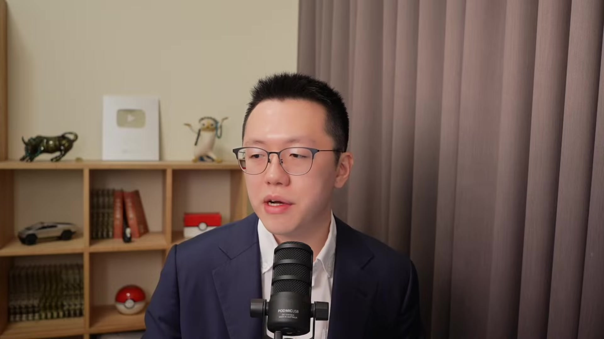

**逐字稿片段：** 就來自於現在的稀土磁鐵霸權 因為全球現在仍然有94%的產能 在中國手上 美國扎欽還是很難追上 所以這一次的首要談判目標 是確保上一次的談判成果 在稀土層面有更多的管制鬆綁 其實中方對美方已經幾乎是全面鬆綁了 只是差別在於還是採取許可制 那美方當然希望 你可以把許可制給取消 並且在中東問題上予以配合 瓦解這條問題 那中方是不是有必要 一定要讓伊朗戰事持續僵持呢 可能在國策上是有利的 可是在目前的能源供給上 大家綁在的是同一條路線上 當然不希望能源價格水漲船高 所以雙方到底有沒有合作條件 我們後續再來做一些觀察

**話題推測：** 討論稀土磁鐵霸權，可能顯示全球稀土產量分佈圖或相關數據。

---

## 00:26:46

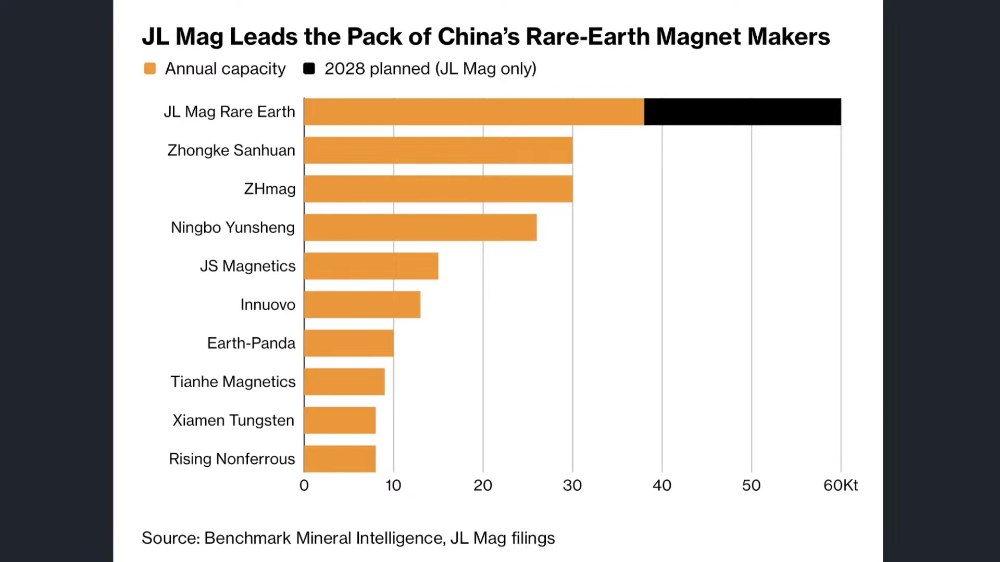

**逐字稿片段：** 那另外一個就是 美中之間的AI公司談判 之所以我們講說 這是最好能夠洽談的議題 我們明明都知道 美中雙方還在競爭 怎麼可能AI會有共同的自理規範 我反倒認為這是最有機會的 原因在於雙方都對於恐怖主義 都對於分離勢力 或者一些這種恐怖主義可能形成的傷害 知道AI可能會推波助瀾 所以雙方如果在一定的共同準則底下 阻止那種AI產生的外溢性效果 可能會有恐怖攻擊 或者會對於青少年所造成的傷害 建立一套共同準則 現在目前反而看出來 是雙方最有可能傳出好消息的地方

**話題推測：** 討論美中之間的AI公司談判，可能顯示美中AI技術或政策相關圖表。

---

## 00:27:27

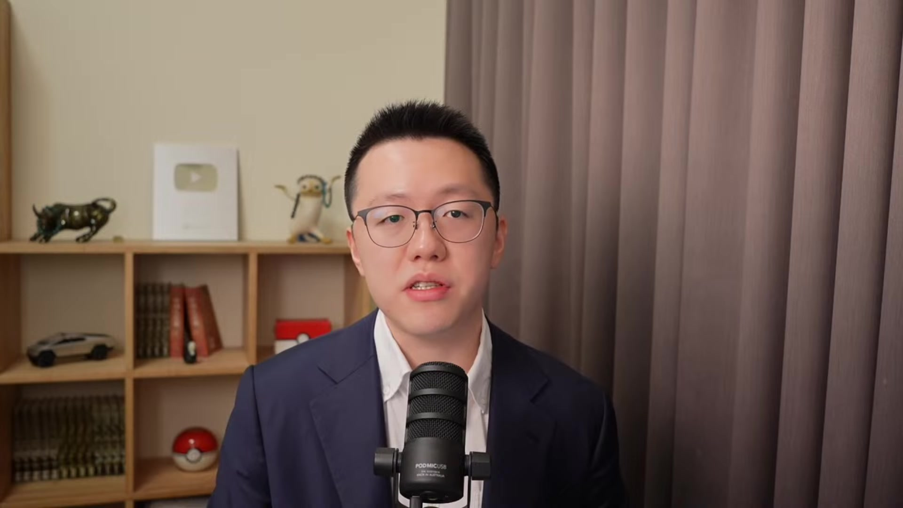

**逐字稿片段：** 我們之前就有看到 那個葉門的青年運動 他就用那個Anthropic 每天都在查說要如何做炸彈 然後一步一步的去研究 最後被Anthropic給發現了 直接通報五角大廈 五角大廈馬上就採取行動了 所以我們都清楚知道 這有兩個啟示 第一個就是 AI的威力和他的知識體系 是足以造成一些市場上的重大副作用的 尤其被危險的人給使用 第二個就是 就是沒事不要使用AI問一些很奇怪的問題 問為什麼分叉 那entropy就知道你分叉了 所以這壓力很大 很隱私的問題就不要看了 這本來就是使用AI 我們以前都會覺得說 你有什麼問題就照問 沒什麼問題 可是當你問的問題越來越細以後 你要了解你問的所有問題 照理講美國政府應該都知道 所以差別在於你問什麼樣的一個問題 你有時候就要用別人的名字問 誰誰誰問的 不要當成自己 昨天我才講說 因為現在其實使用任何的AI 它都會留下使用記錄 即便你把最後的對話框給刪掉 人家也知道 所以任何我們講的 之前中方也有傳出一些訊息 用Anthropy來詢問一些具體的間諜行動 一樣被Anthropy給看到了 所以我才覺得特別有趣 任何的網絡其實都會留下使用記錄 你在查之前一定要三思 那昨天我才看到有一段對話 人家問說 為什麼人類的情侶 可以互看生殖器 但是卻不能夠互看手機 後來想通了 如果生殖器會留下使用記錄

**話題推測：** 提及葉門青年運動使用Anthropic AI製造炸彈的案例，可能顯示AI安全或濫用警示新聞。

---
