# yutinghaofinance__dfkO0oKRvg — 關鍵畫面索引

- 來源逐字稿：[yutinghaofinance__dfkO0oKRvg_GT.srt](yutinghaofinance__dfkO0oKRvg_GT.srt)
- 影片：https://www.youtube.com/watch?v=_dfkO0oKRvg
- 截圖數：33

## 00:00:40

**逐字稿片段：** 我們今天要回過頭看 美國政府歐洲政府還有日本政府 在過去一段時間所受到衝擊之後 我們要如何來看待在這個新的 高利率環境對於通膨的影響 以及對於內部所得 購買力的衝擊來跟 投資朋友做些敘述 昨天雖然美國股市收低 長天期公債殖利率 現在看起來好像又碰到5.3%了 不過呢因為前天美國股市才剛創高 好所以現在稍微回檔 其實也勉強可以接受 我們更需要觀察的事情是 目前最大的異常就是 債劵跟股票市場的 至少在過去幾個月的方向還是 扮扮演著不同的總體經濟劇本的 因為債券市場從這種走勢 很明顯就是在定價更高的通膨 更大的財政風險 還有更緊的貨幣政策 全球殖利率現在也在高點嘛

**話題推測：** 說明將分析美國、歐洲、日本政府的經濟策略。

---

## 00:01:31

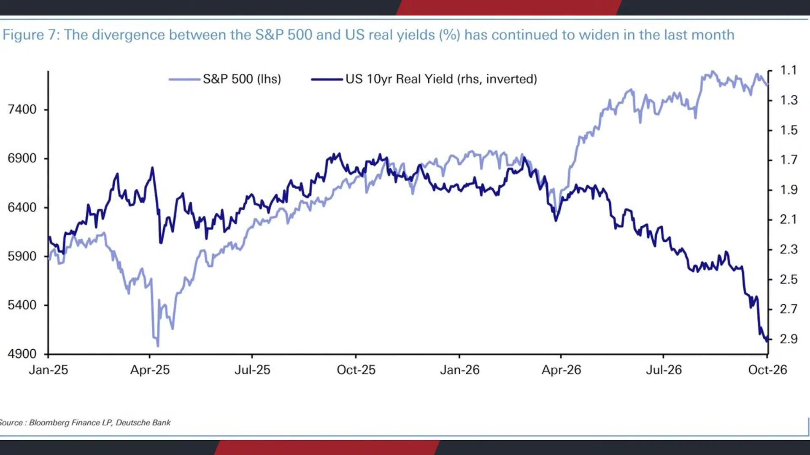

**逐字稿片段：** 像歐洲的部分 上禮拜法國10年 期公債殖利率到現在相對於德債 利差已經單周暴增了32個基點了 這是1990年德國統一 以來最大的單周升幅 義大利相對於德債的 利差也擴大到23個基點 但股票市場是完全沒有任何反應的哦 因為前天 其實美國股市標普創高 納指創高 就連歐洲股市 雖然法國股市現在賣壓很沉重 可是歐洲stock600指數距離歷史 高位大概也只剩下4%左右 上禮拜總體跌幅到 現在也不過是2到3% 美國標普五百指數更是 直接創下歷史性高了 所以在這樣的效果 下其實就說明著 市場上對於油價和通膨 是沒有傳導到股市的 但是對於債市而言是相對有壓力的 那市場上一方面呢 正在把這個利率壓在這樣的區間 讓大家開始習慣新的利率定價 那第二大方面就來自於 股票市場 難免還是要受到市場的估值削減 這個估值削減不一定 是借由股價的回檔 可能是借由本益比的回檔 也就是只要獲利上升幅度過快 那股價也不用跌多重了 從昨天來看 股價也沒有說跌到多大壓力 道瓊跌341點 納斯達克下跌61點 標普跌17點 費半稍微跌幅比較重一點 跌了151點 1.15% 收在13,066點 好現在真正讓美國股市廣度哦 突然出現比較惡化的轉折 我們回過頭看哦

**話題推測：** 轉向討論歐洲債券市場，法國10年期公債利差暴增32個基點。

---

## 00:03:01

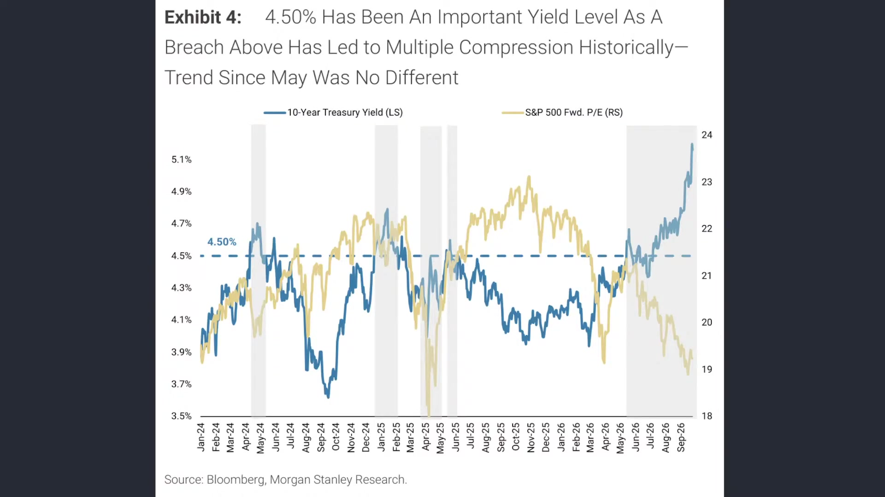

**逐字稿片段：** 哦可能最早已經推到Jackson hole左右了 其實從整個26年上半年 當時柴油價格上漲 10年期美債此利率不斷的走高 標普500從Jackson hole以後 當時站上200日均線的成分股的比例 大概就從55%擴大到75% 那9月份因為當時聯準會是轉鷹嘛 所以彭博 的情緒指標現在 持續往上做緊縮以後 就讓整體廣度惡化的速度開始加快 所以其實早從8月底到9月初 其實這種惡化的趨向就已經開始了 那我們今天就要回過頭說了 因為全球政府現在都在 為經濟開始傷腦筋嘛

**話題推測：** 討論美國股市廣度惡化，可能從Jackson Hole會議開始。

---

## 00:03:40

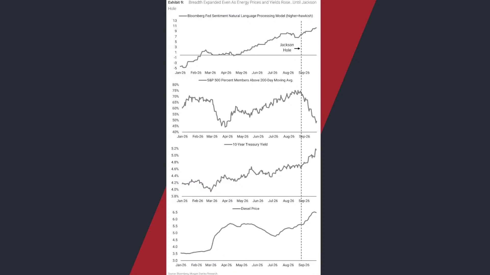

**逐字稿片段：** 美國日本歐洲現在 走上了三條不同的道路

**話題推測：** 重新聚焦全球政府為經濟傷腦筋，美國、日本、歐洲走上不同道路。

---

## 00:03:44

**逐字稿片段：** 川普很明顯 他嘗試的要淡化這種 不管是關稅戰的色彩 美中之間的協調 或者我們看到進行 柴油價格的直接介入 來壓低通膨預期 那日本是想要擴大財政支出 來刺激經濟 那歐洲的部分是強化關稅的保護 來挽救產業 看起來不同政策了 那有一個在淡化關稅戰 一個似乎中歐關稅戰又重新開啟了 但它背後其實都是相同的困境 那就是政府想要解決的問題越來越多 但是 能動用的資金越來越昂貴了 而且即便搞到了新的資金 這筆新資金也是過去 20年來最為昂貴的資金 那全球公債殖利率不斷的飆升 真正的挑戰呢 就是你還有多少本錢 還有多少借錢的能力來 為自己的經濟政策買單 好今天就來跟投資朋友做些敘述 因為現在長天期公債殖利率 遭受到的情況賣壓其實比 想像中還要來的惡劣 我們主要是因為股市沒怎麼跌 所以感覺還好 但其實在運市場幾乎是一片哀嚎

**話題推測：** 美國（川普政府）嘗試淡化關稅戰色彩，直接介入油價。

---

## 00:04:44

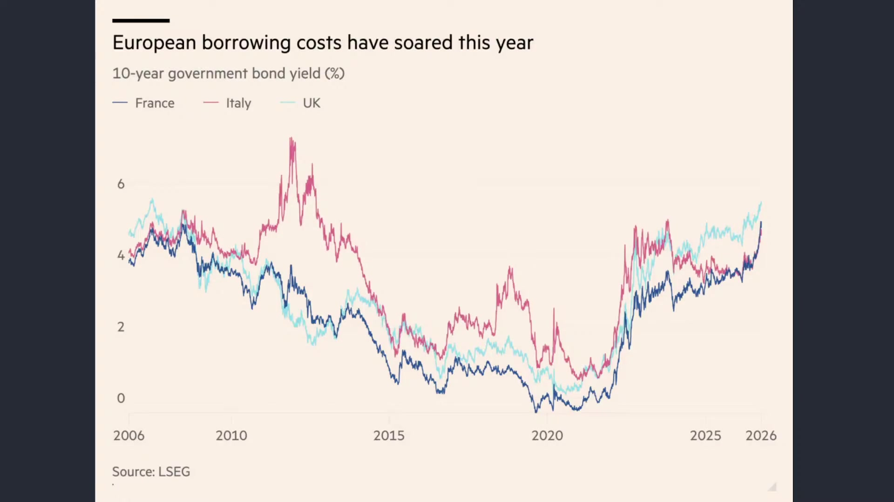

**逐字稿片段：** 美國30年期公債殖利率 現在已經衝高到5.74了 這是2002年以來的最高 英國30年期公債殖利率 已經衝高到6.04% 這是28年來的新高 10年期殖利率也來到5.5% 歐洲同樣遭受遭受到承壓 法國和義大利 好在昨天公債殖利率也在不斷的跳升 一天大概就跳了15個基點左右 法債是衝最高的 已經來到4.93 那這一次債券的大跌 當然也不是單一因素 它有法國內部的內政問題 它有伊朗戰事推高能源價格 有財政赤字的擴大還有 前陣子美國經濟數據表現還不錯嘛 尤其是PMI數據 所以直接把實際利率預期給往上拉了 如果我們細節觀察 在今年以來 年初以來 美國10年期國債大概上升了106個BP那 德國是71個日本102 英國是98 澳洲是64左右 這也導致 其實利率保持在高位一陣子以後 就開始往下游 開始來陸續進行傳導 全球債券殖利率現在就 開始傳導到了美國家庭 謝謝投資朋友 謝謝投資朋友的贊助 我們現在是直播 你看所以就說臺灣受到影響不是這 沒有這麼大嘛 這個即便美國股市哦 波動極大 債券極大 但是我們股市 我們投資朋友 這個是重倉科技股 長期的科技樂觀論者 就完全不受通膨影響 那待會我們可以討論這件事情呢 好就是有買股票的人呢 他覺得現在通膨真的有 極大的購買侵蝕力嗎 這就是雙層的世界 k型經濟哦 好我們剛才講到說

**話題推測：** 美國30年期公債殖利率衝高到5.74%，創2002年以來新高。

---

## 00:06:24

**逐字稿片段：** 因為美國現在房貸利率哦 慢慢被傳導下來 30年起固定房貸利率 最新一周已經跳升19個基點 來到7.49% 好這個就是2023年以來的最高了 短短9個月哦 本來是3年最低哦 現在變成3年最高了 背後就是10年期公債殖利率和 30年期公債殖利率的快速跳升了 好這也使得房地產市場 現在在短期 過去半年呢 是高利率快速啟動 原本以前是慢慢慢慢 的房貸量申請回來了

**話題推測：** 美國30年期固定房貸利率跳升至7.49%，創2023年以來最高。

---

## 00:06:56

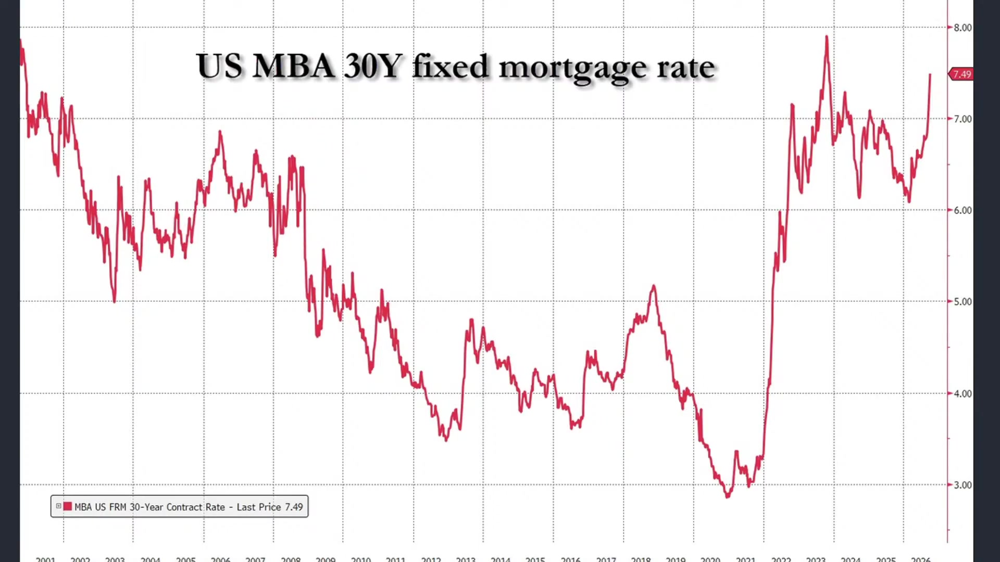

**逐字稿片段：** 上禮拜房貸申請量 一周就暴跌了4.2% 好在這樣的一個情況底下 市場上其實已經很明顯 感受到往下游的傳導壓力 整體申請量已經創下 去年2月份以來的最低哦 比今年1月份崩掉了50% 如果你是貸款40萬美元的話 期限30年 7.49%的利率

**話題推測：** 上週房貸申請量暴跌4.2%。

---

## 00:07:19

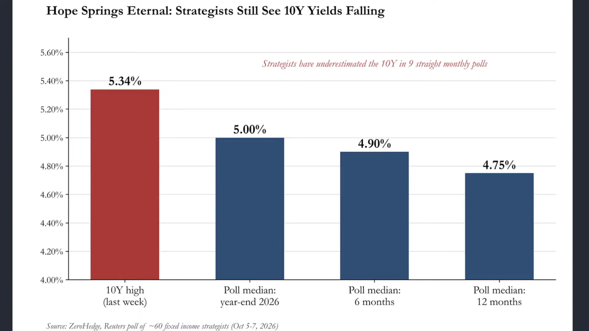

**逐字稿片段：** 每個月本息大概是2,794塊 戰前6.1%時 大概只要2,424塊 所以一個月就多增加 了370塊美元的房貸 增長15%了而且 2021年當時鎖定3%房貸的屋主 現在肯定不願意賣房 所以買家就嫌7.5%太貴 那賣家又捨不得3%的舊房貸 最後就是 買不起那也沒有人想要賣的僵局 美國現在最大的挑戰 就是流動性急縮了 臺灣不一樣 臺灣現在因為信用管制放鬆了 我們預估在9月份以後 那個量能搞不好也回歸了 那美國是現在突然 進入到顯著的啟動 那唯一的好消息是什麼 唯一的好消息是10年期公債殖利率 最近又開始做標售

**話題推測：** 貸款40萬美元，30年期，7.49%利率，每月本息約2,794美元。

---

## 00:08:05

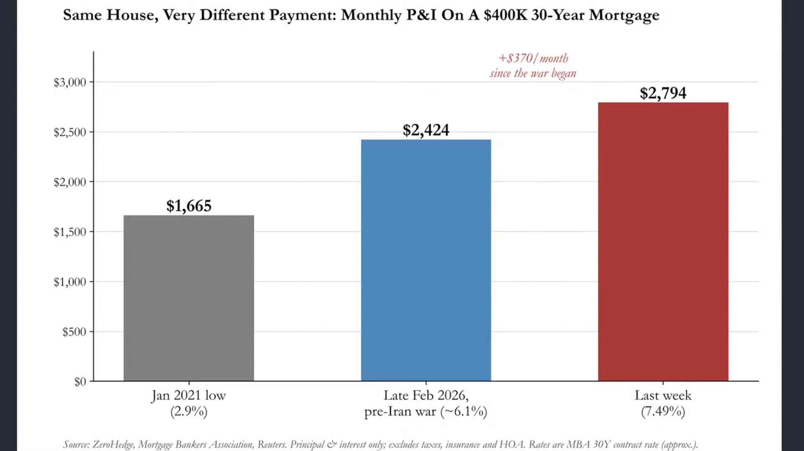

**逐字稿片段：** 標售直利率衝高到5.3% 但是創下了2,000年以來最高 外國買家 顯著的資金買盤 這說明其實 是 5.3是有一點吸引人的哦 以前我們都覺得唉 5.3有時候賠掉價差 我們講的並不是債券ETF 如果你是持有國債 這5.3%就是你能夠 穩穩的握到手中 我們幾乎可以把它當成 除非美國政府倒閉了 要不然它就是一個 標準的無風險利率哦 唉以前的3%也不吸引你 4%也不吸引 5.3都不吸引你嗎 其實是有部分吸引人的哦 在這樣的一個效果底下 得標殖利率雖然蠻高的 不過市場買盤呢 其實還是有的 代表的是外國央行 海外機構 現在間接投資人大概拿下了80.3% 這是歷史上的第四高 所以不能說美債完全危機解除了 但是至少看得出來 利率越高 其實總會有人想要接的啦 你說3沒有 4％沒有 5.3看起來就已經引發 新一輪市場的買盤進駐了 那當然它會被壓抑到一些 股票市場的一個買盤空間 好這個值得大家來多做一些留意 但至少現在投資等級在開得更高 剛才是美國10年期公債是開5.3嘛 好那標售情況還算是可以接受

**話題推測：** 美國10年期公債標售殖利率衝高至5.3%，創2000年以來最高。

---

## 00:09:23

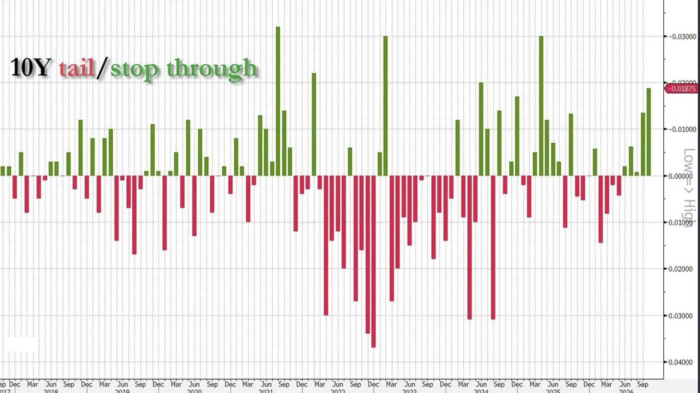

**逐字稿片段：** 美國投資等級債呢 平均值利率 已經衝高到6.5 是2004年以來最高水準 但是信用利差卻比歷史92%的 時間都還來得更為便宜 這要怎麼做理解呢 就是債券投資人呢 由於美債殖利率的飆升 他已經承受了非常巨大的損失 卻幾乎沒有額外要求企業 支付更多的違約的風險溢價好在 但是壓力已經在最弱的企業開始浮現 我們看過去一個月的投資級 利差大概擴大了兩個基點 Triple b大概3個基點

**話題推測：** 美國投資等級債平均殖利率衝高到6.5%，創2004年以來最高。

---

## 00:09:57

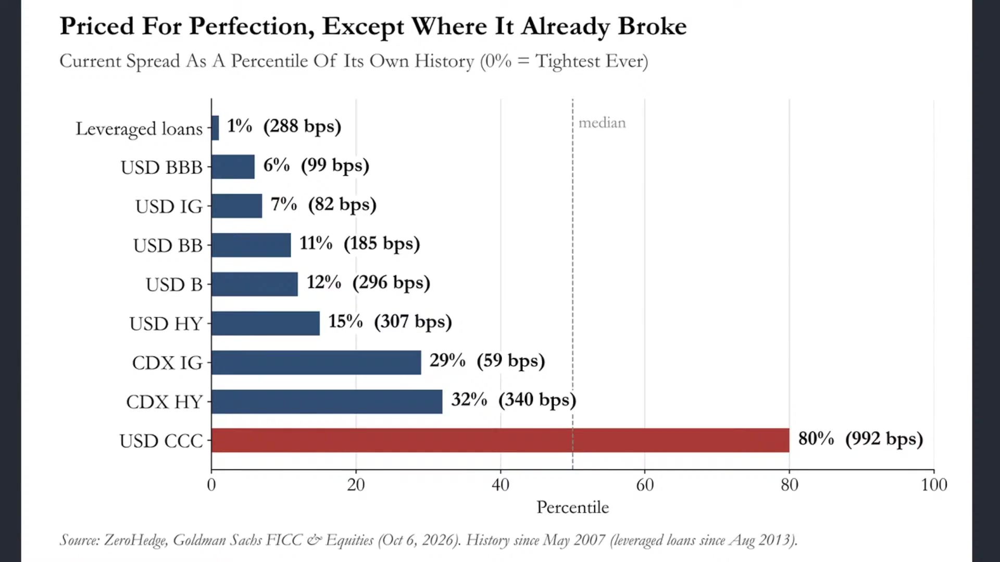

**逐字稿片段：** 那你看一下Triple c Triple c的債券利差暴增了117個基點 什麼意思就是 衣如果是屬於那種大型科技巨頭 它其實就多負擔一點點的實質利率 其實還是賣得掉的 但是那種垃圾級哦 它現在實質利率 給你大幅跳升到雙位元數字 都沒有人要 這個就是市場上在 債券市場的市場壓力 美國債券的暴跌 它就是由中小型企業 尤其是垃圾級的公司 借貸成本來做飆升的 現在信用評級最低的企業 就垃圾債 本月份的平均值利率 發行值利率是多少

**話題推測：** Triple C級債券利差暴增117個基點。

---

## 00:10:33

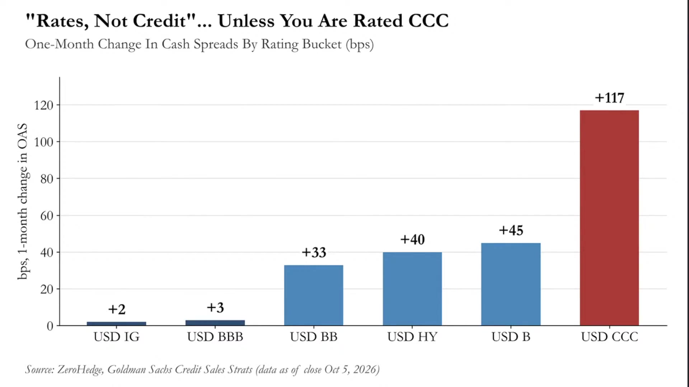

**逐字稿片段：** 17%就是 現在有非常多的美國 信用評級比較低的企業 它發17%的直利率也沒有人要接 這是2020年5月份以來最高直利率哦 而且評級在Triple c以下的企業 信用風險溢價已經擴張到12個百分點 這也是2022年以來的最高 所以這就說明著 再融資牆被打破了就 以前低利率時代 有一長段時間 就是一些僵屍企業 它就靠這些低利率活著 它就靠那些超低利率借一些錢然後 也許未來利率還更低了 然後再借更多的錢來還之前的舊債 但是現在利率一下從當時兩% 3% 4%到現在5% 一路快速的提高 現在來到12% 這場遊戲玩不下去了 所以最後就變成大者恒大的趨向 那當然了 某種程度而言

**話題推測：** 信用評級最低的企業（垃圾債）本月平均發行殖利率高達17%。

---

## 00:11:25

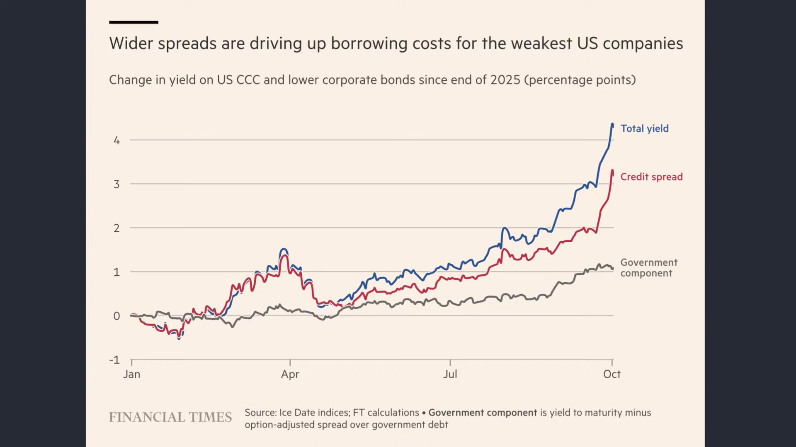

**逐字稿片段：** 還是由於AI行情的爆發 把資金全部給吸走了 所以資金就大量的往AI 巨頭來發行投資等級債 那現在AI軍備競賽最有大壓力的 地方就是AI已經把不管是中小型企業 傳產的錢給吸走了 我們現在臺灣市場也是 在放款當中 如果是企業放款 那你不是搞AI的 為什麼要借你呢 我我還寧願你借你拿去買房 為什麼要借一家中小型企業 開個咖啡廳 做個裝修什麼的 那我為什麼不借給 那些大型企業做AI呢 所以現在最大的壓力就是資金 開始往中小型企業來做排擠 而且把美國公債的 買盤也做了適度排擠 那這場軍備競賽比較有意思的地方 就是每一家公司的決策單獨來看 其實都是對的 Google不能不投 微軟不能不投 亞馬遜也更不能不投 因為你少蓋一座資料中心 少買一批GPU 你都可能擔心自己在下 一輪的AI競賽當中落後 所以大家就選擇擴大資本支出 甚至原本靠現金流投資 現在就變成大家一起發債 一起增資 一起做表外融資嘛 好那問題在這邊了 當所有人都造作的時候 結果就非常恐怖了 個人個體而言 那是非常合理的選擇 所有人都造作的時候 就代表著 幾乎整個金融性風險 都集中在AI巨頭當中 大家一起變成借錢的人 那加上美國政府龐大的 財政赤字也需要融資 那資本市場就開始搶錢 那資金的價格就越來越貴 那所有人都玩同一套遊戲的時候 搶錢的時候 那個資金利就越開越誇張 越開越恐怖 這是我們觀察到的現象 所以當所有人集體做一個行為的時候 也許那個意外 那個結果就比想像中恐怖 力度還要來的大了 對那人家講說 之前去看催眠秀嘛 催眠師一次就催眠了7個男人 效果非常成功 他說坐下 所有人就坐下 他說舉手 所有人就舉手 結果表演到一半 催眠師不小心把麥克風掉地上砸到腳 好痛大叫 fuck 接下來的事情 觀眾一輩子都不會忘記 所以所有人都照著做的時候 其實結果算是很恐怖的 就個體而言 大家可以理解 這是我們最合理化的選擇 但所有人都照著做的時候 其實結果會比想像中衝擊還要來的大 整個系統性的風險就瞬間放大了 那更可怕的事情是 沒有人可以率先停下來 假設有一天Google覺得 自己發的利率太高了 AI的投資報酬不確定 所以決定要少開資料中心 但是微軟亞馬遜他繼續投 那他承擔的風險就是掉隊的風險嘛 所以即使每家公司都知道 這場競賽是越來越昂貴 好最理性的選擇是繼續投了 但是所有人都照做的時候 最後吊詭的局面就是 大家就一起借更多錢嘛 嗯你說借7%好像好 還可以接受 以後AI報酬更高 那開8%值利率開9% 越開越高 越來越恐怖了 OK這給投資朋友做一些思考 什麼最後有臨檢 不要亂講哈 不要亂講 那當然了 從本次我們看到的通膨問題哦 往外擴以後

**話題推測：** 討論AI行情爆發對資金排擠的影響。

---

## 00:14:33

**逐字稿片段：** 運費現在不斷的飆升 它其實是第二輪我們看到 美國政府所感受到的壓力 這個資金的排擠它是一回事哦 但是更總要 這事情是 霍爾木茲海峽現在的 能源運輸才剛剛開始恢復 伊朗又開始針對商船的 攻擊力度開始有所加大了 因為原油價格現在就下不來 就卡在100美元左右 也沒有到失控的地步 但是就不是下不來 對於下游端的傳導速度越來越快

**話題推測：** 討論通膨問題外溢至運費飆升。

---

## 00:14:59

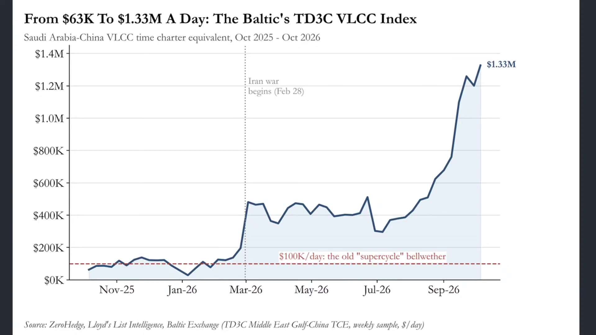

**逐字稿片段：** 我們看超級油輪現在一天133美元 百三十三萬美元的運費哦 單周過去一周又漲了10%了 如如果我們從數據來看呢 這個數據大概是一年前的21倍 所以我們現在講的不是 油的問題 我們的油輪根本不夠用 我們從現在VOC的總體指標運價 每天133萬 一年前呢 才10萬左右 所以另外一個是從 美國到歐洲的運價 每天本來是57萬美元 應該講說每天以前是5.7萬美元 現在是57.8萬美元 單周暴漲150% 這一系列價格的顯著攀升呢 其都意味著 哦這個通膨問題 看起來已經不是單純在原油端了 它已經外溢到外面的運輸 成本糧食價格食品成本 其實從德國柴油價格來看呢 我最近才觀察了一下 瞭解一下 美國現在柴油價格 大概是6.3美元每加侖嘛 那其實已經算蠻高的哦 我最近看了一下德國 德國柴油價格每加侖是10.4美元 好這應該是g團體當中最高的 其次是法國 法國是10.03美元 義大利9.96 英國是9.8 美國雖然現在6.32 也算是創下新高了 不過大概也只有德國的6成左右 而且美國各州的差異也很大 加州大概是8.4比較高 德州是5.7 其他主要經濟體當中 這個澳洲是6.8 中國4.6 日本3.8 印度是3.8 俄羅斯只有3.67 所以雖然美國看起來很嚴重 但整個歐洲市場看起來 傳導的壓力來得更大 但是畢竟是從增量轉移

**話題推測：** 超級油輪運費一天達133萬美元。

---

## 00:16:42

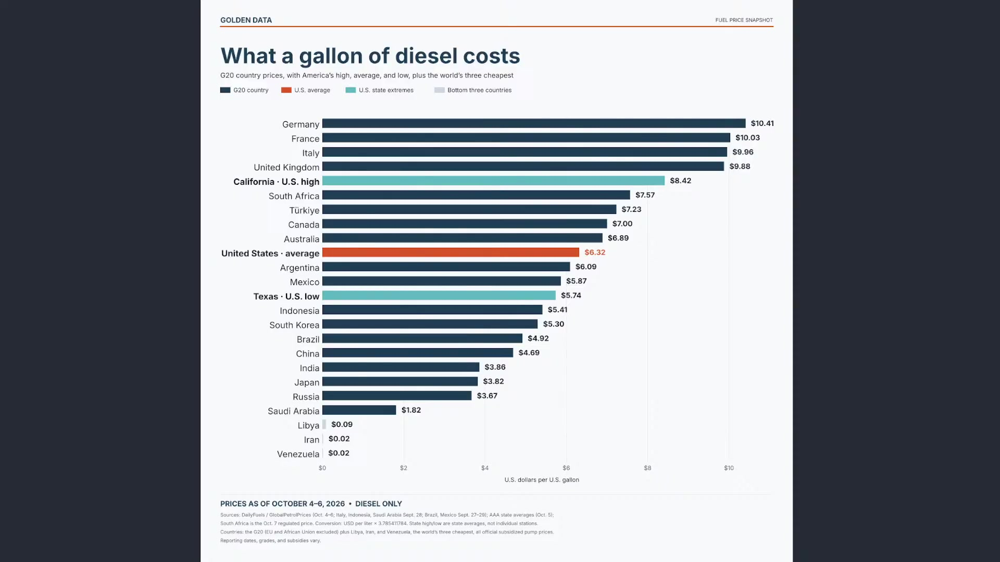

**逐字稿片段：** 美國汽油價格一年已經暴增了 39 %呢

**話題推測：** 美國汽油價格一年內暴增39%。

---

## 00:16:46

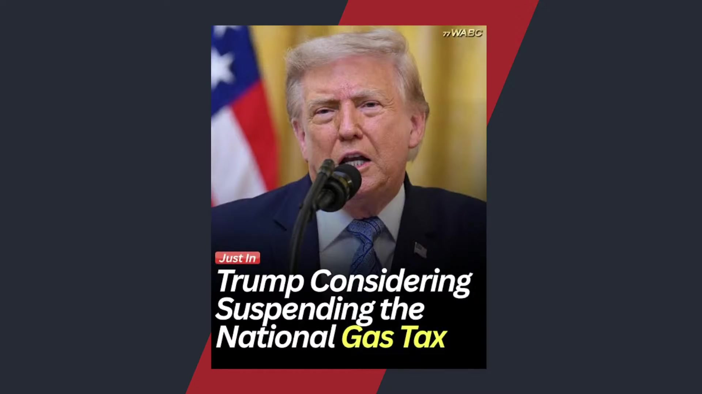

**逐字稿片段：** 而川普在昨天呢 正式發表聲明 正在考慮暫停徵收聯邦汽油稅 目前稅率每加侖是18.4美分 那全美普通無鉛汽油的 平均價格現在是4.36塊 相對於一年前大概漲了四成左右 不過現在就算把聯邦 汽油稅在選前全部取消 理論上最大的降幅大概也只有4% 所以 的確能夠降低民眾的痛感 但是能不能解決高油價 那完全無法解決嘛 因為那是美伊戰事所引發的問題 但至少 川普出招了 主要就是美國內部的通膨預期 正在快速的飆升 現在根據最新

**話題推測：** 川普考慮暫停徵收聯邦汽油稅，稅率每加侖18.4美分。

---

## 00:17:24

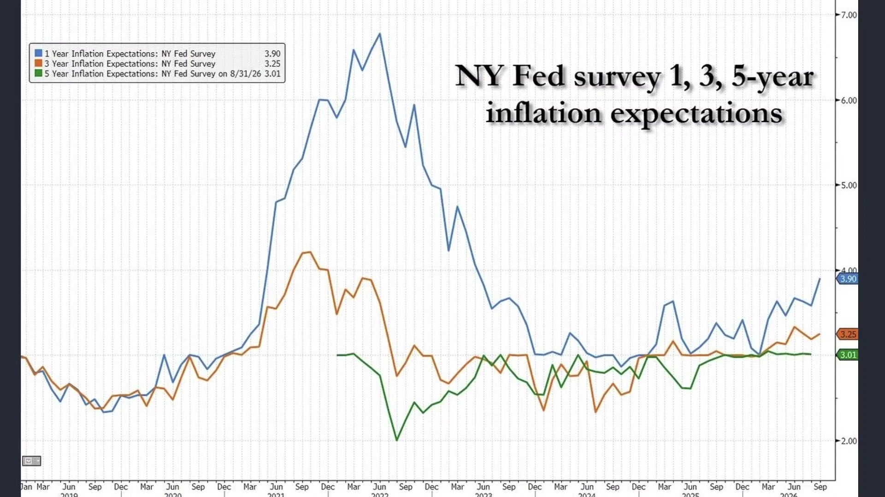

**逐字稿片段：** 紐約聯準會銀行的公佈數據 9月份的一年通膨預期中位數 是從3.6 %跳升到3.9 % 這是23年5月份以來的最高 三年期預期也升高到3.3 % 5年期是維持在3 %左右 所以總體拆開來看 民眾預期未來一年 汽油價格上漲4.8 % 食品漲不就比較多 5.5 房租是6.8 大學費用7.5 醫療費用9.2 從這個數據你大概就看得出來 好其實不只是我們觀察到 的能源通膨問題而已 服務成本其實是最大的壓力

**話題推測：** 紐約聯準會銀行公布9月份一年通膨預期中位數從3.6%跳升到3.9%。

---

## 00:18:02

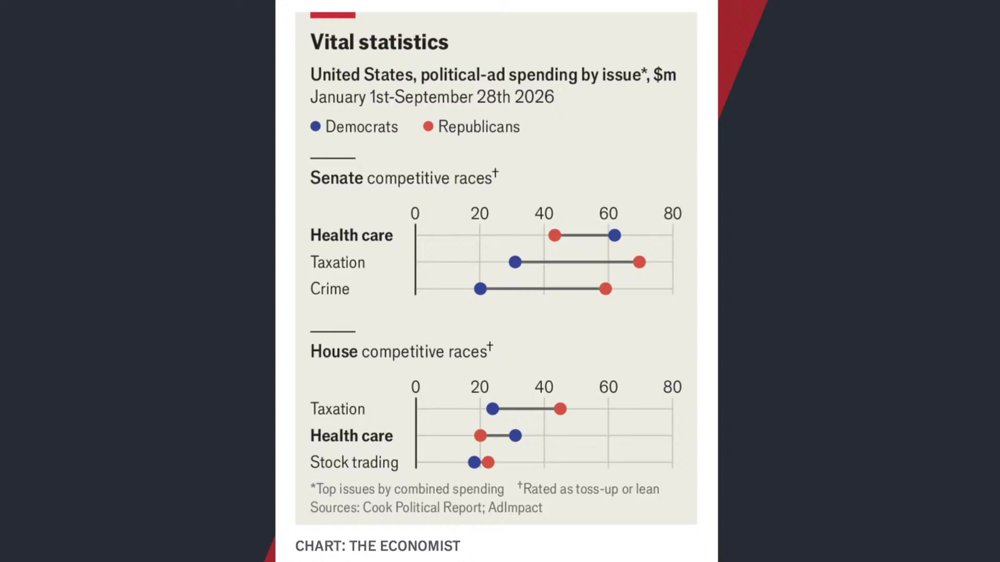

**逐字稿片段：** 根據KFF的研究 美國對於付不付得起醫療費的焦慮 現在甚至比汽油還來得高 住房的壓力甚至比汽油來的高 食品通膨壓力甚至比我們 看到汽油能源通膨都來的高 蓋洛普在3月份的民調也顯示 61%的受訪者非常擔心醫療服務 的可取得性和負擔能力 好這說明它其實是一個 僵固性通膨的集體性問題 不能夠完全跟能源掛鉤 那換句話說 即便能源問題川普有能力解決 那看起來 60%以上的選民呢 都認為目前的經濟狀況 是全面性的購買力侵蝕 也不能夠單純推給美伊戰事 早從美伊戰事之前 其實經濟政策購買力 情況就已經不是特別好了 我們從川普目前的在 工作就業的支持率 25年初是52% 現在呢是37% 不支持率從48%上行到61% 在純經濟感受層面 目前大概只有33%的受訪者認為 美國的經濟狀況是良好的 65%是給予相當負面的評價 這是真實的情況了 那是深圳還是上海 不是有一句話嘛 講說跟你無關的繁華 非但不是自豪的理由 反而有可能是你貧困的苦難和根源 好就是 你像AI不斷的行情做推升 美股創新高 但從實值購買力的侵蝕 對於通膨 對於醫療 對於食品的擔憂 這個就是根本我們看到不 斷向下衝擊的原因 所以川普一方面呢 準備要開始在期中選舉之前 看是否有機會進行 我們看到能源稅的一個下滑 那另外一方面 這一次的美中其實最大的重點是什麼 其實就是關稅上的和解嘛 我們知道在過去一段時間 其實美中雙方大概互降了 接近有600億美元的商品關稅 其中像是玩具呀農產品 是優先進行鬆綁的 好像美國降低的關稅品項 在本次會面之後 包括中國的玩具降稅 廚房用品降稅 節慶裝飾 那中國的部分呢 包括美國的肉類海鮮鹵製品 或者像是穀物煤炭 加大採購 那雙方呢 90%的相關商品呢 會以最惠國的待遇來做課稅 換句話說 這美中雙方其實 降稅規模 雖然你說比例來看 很多那種科技產品是 沒有任何的鬆綁 可是只要是非國安問題的 幾乎能鬆綁都已經鬆綁了 目的是什麼 就是降低這種關稅通膨預期的傳導 這是第一層 我們看到美國政府正在做的事情呢 盡可能壓低通膨的痛感 第二層我們看到的是日本政府 日本首相高市早苗最近表示 如果日本的公債出現 超出預期的劇烈上升呢 政府會重新檢討支出和收入計畫 甚至調整既有的政策 原因就來自於我們知道高市政府 一方面是希望能夠刺激內需 從明年4月份開始 日本的食品和非酒精飲料的消費稅

**話題推測：** KFF研究顯示美國民眾對醫療費、住房和食品的焦慮比汽油更高。

---

## 00:21:11

**逐字稿片段：** 會從8%大幅下滑到1%哦 這是為期兩年的時間 不過大家都知道可能 就這樣子執行一輩子了好 代表是大規模減稅即將發生了 可是日本現在又必須 向債券市場來證明 日本財政不會因為減稅就失控了 可是大家都很緊張嘛 高市現在是沒有設定一個日元 或者公債值利率的具體的警戒線 但是呢 他很明確表示 如果未來市場出現了重大變化 政府是隨時會進行我們 講到稅收收入的適度調整 那從這樣的一個角度來看 等同於意味著 好現在他就要在 投資人認為政府的財政缺口太大 然後呢又希望能夠減稅的 過程當中取得適度平衡 那其實最大矛盾就是日本不止想減稅 它的國防支出也在增長 所以它整體的財政刺激 其實比想像中還來得更為劇烈 那現在最大問題是什麼 就是前陣子 當時我們知道日本升息嘛

**話題推測：** 日本食品和非酒精飲料消費稅將從8%降至1%。

---

## 00:22:06

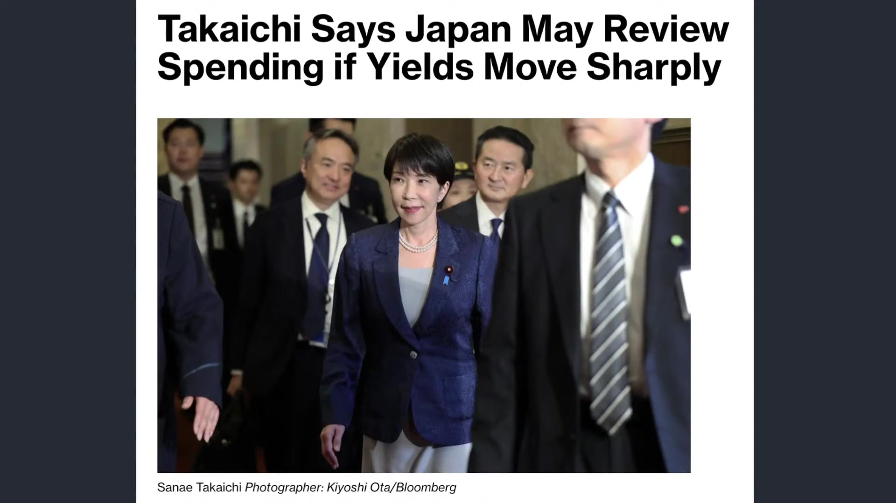

**逐字稿片段：** 升到1.25% 但是日元最近又貶回來了 問題並不是沒有升息 是很明顯市場認為升息 升的幅度並不夠快 這一次不但升到了95年以來的最高 也是之前黑田東彥上任 之後的第六次升息了 距離上次升息也只有3個月 這是1990年以來最短的升息隔間 可是日幣當時一路升到152以後

**話題推測：** 日本升息至1.25%，為1995年以來最高，也是黑田東彥上任後第六次升息。

---

## 00:22:29

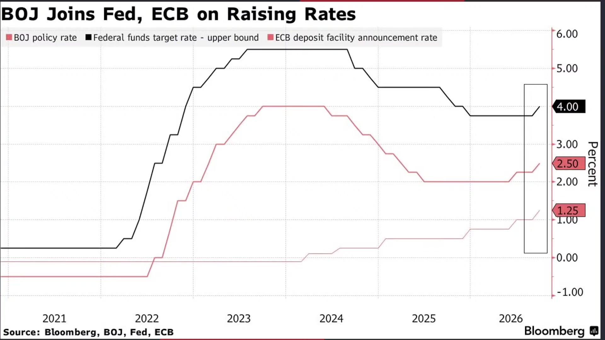

**逐字稿片段：** 唉最近又回貶貶到157了 不是升息了嗎 怎麼升息日元繼續貶 好那很明顯嘛 因為美國也升息了 所以我們講說利率是協力車 但是匯率是蹺蹺板 那美國人也升息了 那當然日本如果升息幅度不夠大 很有可能一下子又貶回來了 所以從這樣的一個角度來看呢 大家等同於要求 日本進一步進行貨幣政策的收縮 好那這個時候就要回過頭說 那日本有沒有能力進行進一步收縮呢 我們要清楚知道 現在呢日本如果想要拿外匯存底當做 無減稅的缺口 它就會同時踩到美債 日元還有財政的三層地雷 一層就是日本到底 能不能經得起高強度升息 當然是沒有能力的為什麼 臺灣今年經濟成長率是保10 今年GDP在日本有沒有 增長一%都是一個挑戰 我們根據目前日經的預估 今年日本的實質GDP

**話題推測：** 日元貶值至157。

---

## 00:23:24

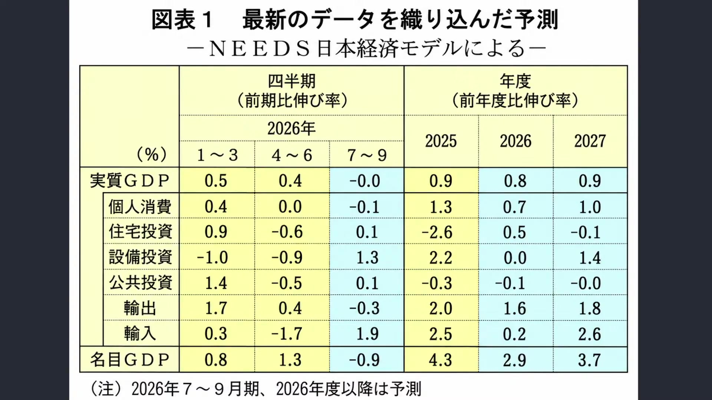

**逐字稿片段：** 成長大概是0.8% 2027年預估也只有0.9% 那根本原因就是來自於 日本經濟 是靠企業獲利和AI投資來做支撐 可是內部內需消費是 非常非常之疲憊的 尤其在出口動能的部分呢 進入到高速收縮 我們舉例來說 張圖表是日本的貿易逆差情況 日本雖然 我們知道它有非常多 精密機械的出口哦 可是日本呢 在過去一段時間

**話題推測：** 日經預估今年日本實質GDP成長約0.8%。

---

## 00:23:53

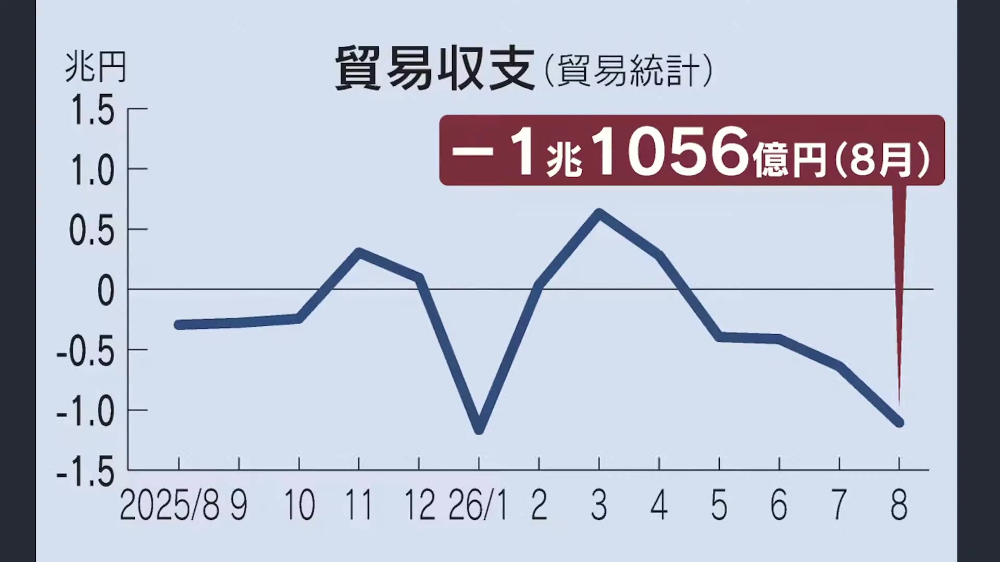

**逐字稿片段：** 由於石油進口暴增了59%呢 能源成本越來越貴 日本大概已經連續 四個月處於貿易逆差了 就是 賺到的錢比進口的錢還要來得少 好那尤其是中國對於 電子零元件的需求增加 的確帶動了日本的一些電子出口 可是問題是進口和 成長幅度實在太快了 連續4個月 到現在可能已經要接近半年 日本已經處於接近一整年了 除了今年3月4月當時跳高以外 大部分時間今年日本 都是屬於貿易逆差的哦 那這種經濟上的壓力 就等同於它其實 並沒有高強度升息的空間 那你說可是它有沒有必要升息呢 它其實當然有必要升息 原因就來自於日本內部的通膨壓力 是購買力侵蝕的重要關鍵 我們看東京電力10月份的壓力 預估又要進行做調升 大概會從9月份到現在增長1000日元

**話題推測：** 日本石油進口暴增59%。

---

## 00:24:49

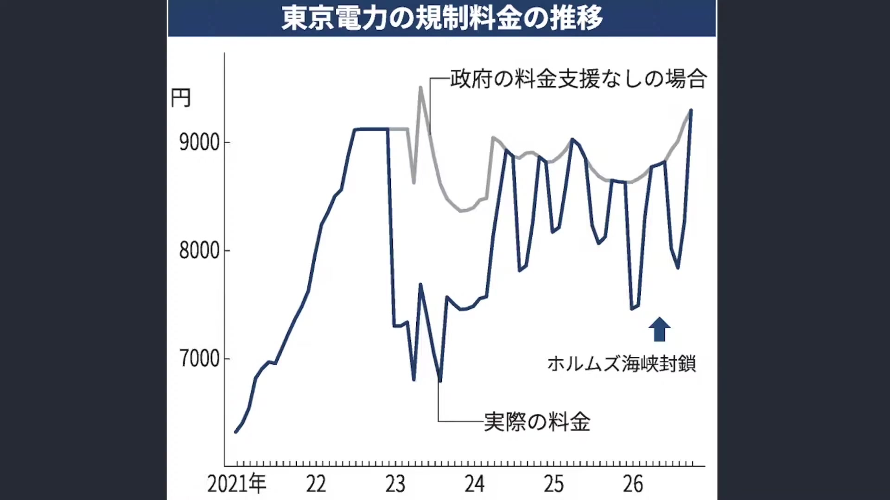

**逐字稿片段：** 升到每個月9300日元 這就突破2022年當時 烏俄戰事的紀錄高點了 一方面政府是夏季的電費補貼 10月份退場了 那光9月份當時還補貼910塊嘛 現在補貼沒了所以 壓力就更大 那第二大層面呢 唉現在原油價格還是處於高位 燃料成本又被迫讓 東京電力公司被迫進行價格調高 所以相對而言 現在原油價格大概漲了1.5倍 煤炭漲了1.3倍 LNG漲了2.4倍 日本現在又高度依賴進口能源 好受不了了 準備進行轉嫁 唉你說不會 我覺得好像 電價油價沒那麼貴 唉那臺灣政府還在補貼嗎 好你要知道哦 都已經打仗打超過半年了目前呢 臺灣你還是感受不到那種 很明顯的油價的劇烈衝擊 電價也是如此 現在10月份的電價 審議委員宣佈動漲嘛 油價也是動漲嘛 所以 到時候如果一次性轉價以後 其實各國政府 尤其是做補貼的行政團隊 可能都遠遠低估了目前 真實的通膨傳導性 所以日本是有必要升息 但是又不能夠升太多 那日元就是這樣子 又不硬又不軟 處於這樣的一個區間 所以你看到全球經濟都 有一個很有趣的現象 就是數據看起來都不錯 好但是大家就是沒感覺 美國企業獲利還在成長 AI投資還在持續擴張 股市甚至還在歷史高位 那日本也一樣 景氣擴張可能已經創下 戰後以來的最長紀錄了哦 股市從疫情低點它已經漲3倍了

**話題推測：** 東京電力預估10月份電費將增長1000日元至每月9300日元。

---

## 00:26:22

**逐字稿片段：** 春鬥唉已經第三年加薪超過5%了 照這些數字來看 那美國有AI 日本也有AI 兩邊應該都在經歷一段不錯的景氣 可是你一問一般人 你有沒有感覺經濟變好了 我覺得大多數人的感看法可能都一樣 那 真實數據來看 購買力也在衰退 你因為GDP創高沒感覺 股市創高沒感覺 企業獲利創高沒感覺 那這些東西如果沒有進到你的口袋 你的購買力 你的薪資跑贏通膨 那終究只是新聞上的數字而已 好所以這個時候壓力就很大 大家沒感覺 之前不是講說一個醫療會議上 那一個男醫生跟一個 女醫生互相瞧著對方 那男醫生後來邀請女醫生共進晚餐 那她也答應了 好當他們在餐廳的時候 那女醫生就藉故去洗手嘛 那晚餐之後就事情一發不可收拾 最後來到他的酒店房間呢哎 正當事情變得火熱的時候 女醫生又打斷他說她得去洗手 回來之後 他們又接著繼續進行 完事之後 她起身說要去洗手 後來當她回來的時候 男醫生說 我覺得妳應該是一位外科醫生 女醫生說 對你怎麼知道 很簡單 我發現妳總是在洗手 那女醫生說 我敢打賭 你一定是一位麻醉科醫生 男醫生說 哎你怎麼知道 那女醫生說 因為我什麼都沒有感覺 所以真正讓人有感的其實購買力 那日本實質薪資你到現在為止 其實大概也接近4年負成長了 個人消費甚至還沒有 回到疫情前的高點 他沒感覺嗎 股市創高跟我有什麼關係 那美國其實也出現類似的矛盾 家庭預估未來一年薪資成長是2.6 哎現在通膨是3% 所以一個經濟體 它可以同時出現AI大繁榮 企業賺大錢 股市創新高 可是大家沒感覺 而這就真實的跡象 好給投資朋友做些參考了 好最後幾分鐘了 再稍微回過頭來聊一下歐洲市場了 法國債市現在的危機 已經燒向銀行股了 我們都清楚知道 因為這一次法德10年期 的利差已經重回到一

**話題推測：** 日本「春鬥」已連續三年加薪超過5%。

---

## 00:28:29

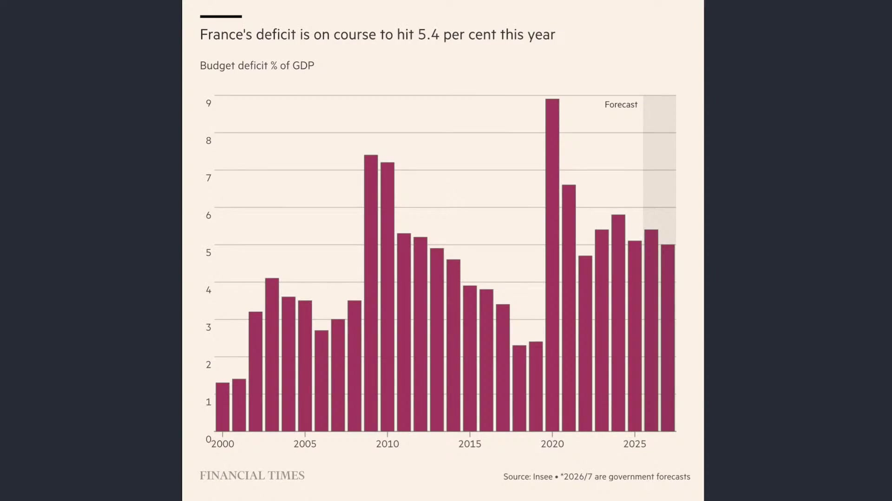

**逐字稿片段：** 百四十個基點了 好像叫死亡循環嘛 尤其法國公債前一天才因為 勒龐陣營提出了2032年削減超過

**話題推測：** 法國與德國10年期公債利差重回到140個基點。

---

## 00:28:38

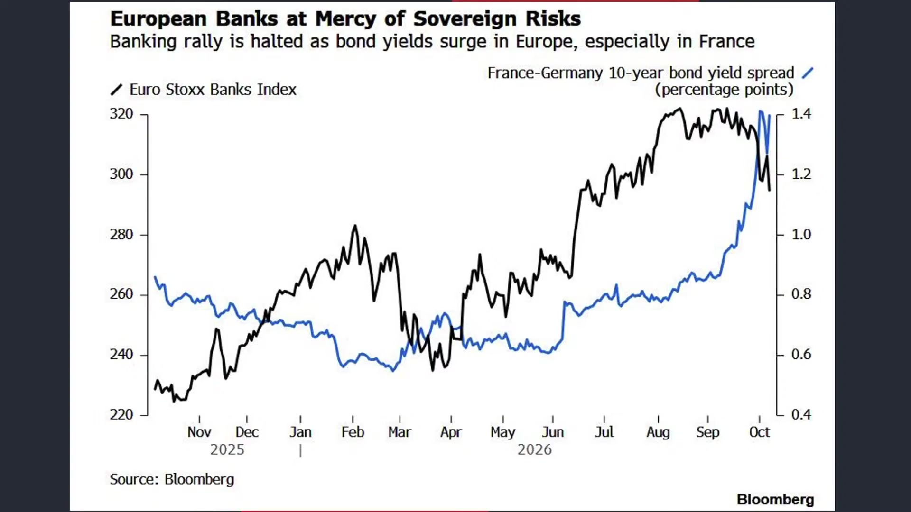

**逐字稿片段：** 1,400億歐元支出的影子預算 現在遭受到反彈 10年期的法國和德國 公債利差一度縮小了 但好景只有一天 大家聽那個法國右派講講話 他也是講講而已 他有能力進行預算的削減嗎 到時候 所以我們看到 現在是歐洲央行暫時不準備出手了 可是法國債市的情況 其實是蠻嚴重的 有必要借由成員國的干預 來進行穩匯 還有穩定債務信評 其實法國債券跌本身還不可怕 可怕的事情是法國 政府要付更高的利息 如果導致法國的銀行資產也跟著跌 哦那就是資產價格的流動性問題了 EDB又因為通膨不能夠立即救市 哦所以這就是歐洲最大的挑戰就是 各國都有各國的財政情況危機 可是只有一家央行 那各國都會有各自的一個顧忌嘛 所以法國的歐債危機 這一次哦 我們叫做frogs FROGS 叫做French oversize government and social security 就是法國過度膨脹的 政府和社會保障體系 把整個歐洲都給拉下水了 不同於2一零年 10年是葡萄牙愛爾蘭義大利希臘 當時是pigs嘛 就歐洲五國 這一次的火力就是在法國 法國的財政赤字已經

**話題推測：** 勒龐陣營提出2032年削減超過1,400億歐元支出的影子預算。

---

## 00:29:55

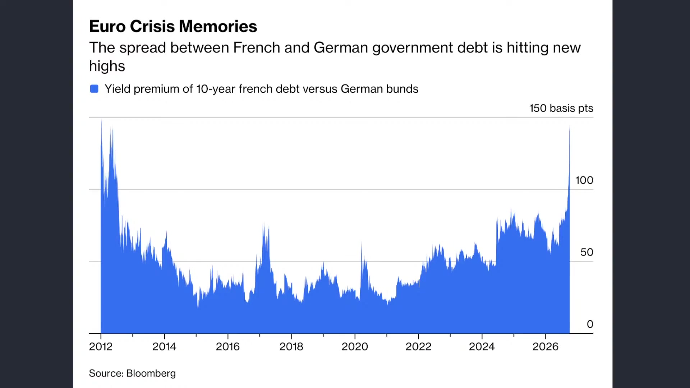

**逐字稿片段：** 超過國內生產毛額的5% 政府債務是120% 那現在內部又有學運的爆發 好所以這樣的一個衝擊 導致市場針對整個歐洲市場的信心 持續滑落 你看東亞股市最近都在創高嘛 美國股市其實也創高了

**話題推測：** 法國財政赤字超過GDP的5%，政府債務為120%。

---

## 00:30:10

**逐字稿片段：** 那唯一沒創高的就剩下歐洲股市了嘛 法國股市甚至已經跌回到 美伊戰事左右的水準了 那再繼續往下看 等同於市場上 針對整個歐洲的經濟體制 會有一輪新的預估 那就是 能否借由新一輪的關稅 保護來拉動歐洲經濟 我們看在本周 法國和德國正式宣佈即將推動歐盟 對中國採取更強硬的貿易政策 某種程度是新一輪的中歐關稅戰 就是德法目前向執委會提出 一個新的貿易防衛機制 一旦認定外國企業透過政府 補貼等不公平的方式來做競爭 最嚴重可以直接限制相關 的企業來進入歐盟規模 8兆美元的商品和服務市場 那中國現在大概占了

**話題推測：** 歐洲股市是唯一未創新高的主要市場，法國股市跌回美伊戰事水準。

---

## 00:30:56

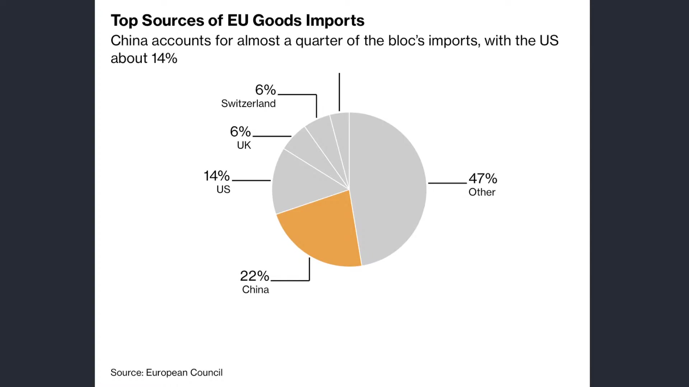

**逐字稿片段：** 歐盟商品進口的1/4 美國大概也才14% 所以某種程度 它其實最大的一個推手 目的就是德國希望能夠 考慮對於中國的商品轉強以防 歐洲市場被中國給供給或者傷害 這當然以前是中國市場好 就設點嘛 現在不一樣 現在要開始保護了 那主要其實從24年開始 歐盟就已經針對中國 電動車來加征關稅了 法國也支持了 德國當時是因為擔心 中國報復德國的車廠 所以反對 不過現在因為已經失去市場了那那就 採取措施吧 現在看法看起來是這樣子 因為德國產業界都已經 開始擔心中國競爭力 以前是怕他拿不下中國市場 現在幾乎丟掉了 那怕你來歐洲奪走市場 那要進行關稅保護 好這是目前歐洲的態度 歐洲希望當然先透過 談判來降低衝突 但是中方已經警告了 只要歐洲採取不利中國企業的措施 中方隨時會反制 那就變成了 美中關稅戰好不容易有了個譜 大家好不容易能夠順下來談 為了其中選舉 中歐關稅戰會不會馬上又要爆發了呢 尤其歐盟現在已經準備要針對 中國的油電混合車進口 採取一定程度的 管制 中國車廠因為在過去一段時間 純電動車已經面臨 非常高額的關稅了嘛 那中國車廠過去一年做什麼事情呢 不賣純電動車 賣混合動力車 混合動力車的關稅跟 純電動車關稅是完全不同的 今年8月份 比亞迪在內的中國品牌大概已經 拿下歐洲12%的新車銷售了 在混合動力車的部分已經占了1/4 如果只看插電式混合動力車 中國品牌在歐洲已經 拿下快要1/3的市場了 哦速度很快哦 五年前 2020年中國車在歐洲的市占率是多少 0現在是多少 現在是12-25% 看不同的車款 就看是混合動力還是純電動車 純電動車就更高了 現在是接近到25%左右 這件事情就足以說明著歐洲市場 是不是即將爆發一場新的中國關稅戰 所以我們今天講的 範圍比較廣一點嘛 從美國日本到歐洲三大經濟體 大家其實都面對同一層共同的困難 就是政府想要花的錢越來越多 可是借錢的成本卻越來越高 那各國開始採取不同的政策來做應對 美國面對油價的上漲通膨反彈和 長天期公債殖利率上升的壓力 政策方向就是壓低通膨 淡化關稅的衝突嘛 那另外一方面 日本央行現在正在推動利率的正常化 可是日元還是很疲憊呀 然後進口的能源負擔壓力還是很沉 很沉重包括匯率的壓力 包括通膨的壓力 唉所以從這樣的一個角度來看 等於高強度升息也不太可能 但是不升息就不行 歐洲走的就是另外一條路 面對現在汽車鋼鐵 傳統產業競爭力的下滑 包括現在歐債的危機遠遠比 美債危機還來得更為嚴重 最後呢反而是歐洲 重新強調關稅和貿易的防衛措施 即將新措施推出以後 中國的反制計畫也會陸續的推出哦 所以三方看起來走在不同的道路 但是很明顯 全球政府都需要更多的資金 債券市場也要求更高的報酬 最後的問題 就是誰能夠在高通膨又 不壓垮財政的情況底下 能夠讓經濟持續緩步的增長 好這就是我們觀察到的實質跡象 也給投資朋友做一些參考

**話題推測：** 中國佔歐盟商品進口約1/4，美國佔14%。

---

## 00:34:28

**逐字稿片段：** 臺北股市下跌421點 收在49,384點 其實因為前兩天才創高了 我覺得現在也不用過度解讀利空了 拉回嘛休息一下 那也祝各位投資朋友 國慶愉快 我們一方面先來追蹤 各國市場 到時候再 國慶年假前後的市場變動 下禮拜我們也要來做 一些更仔細的觀察 那就是全球的數據 現在已經陸續進入到第四季水準了 今年前三季和第四季 你已經可以把今年EPS和產業獲利 的情況做一個全範圍的預估了 時間往下推演 我們就要開始預判整個 2027年的整體經濟概況了 它到底是k型分化的極致 但是利多可以把利空稍微給沖銷 還是說呢 利空也就是利率因子的部分呢 它始終要回過頭來 影響美國股市的估值 或者說已經影響了 但是不會反而傷害到 資產價格的報酬呢 因為獲利在走升嘛 給投資朋友做一些參考 如果喜歡我們節目 記得幫我們訂閱 按讚加分享 我們就下禮拜一早上8點半 早晨財經速解讀再相見 祝各位投資朋友 看盤順利 操盤愉快

**話題推測：** 臺北股市下跌421點，收在49,384點。

---
