# yutinghaofinance_b2MbRUsIaU8 — 關鍵畫面索引

- 來源逐字稿：[yutinghaofinance_b2MbRUsIaU8_GT.srt](yutinghaofinance_b2MbRUsIaU8_GT.srt)
- 影片：https://www.youtube.com/watch?v=b2MbRUsIaU8
- 截圖數：29

## 00:00:25

**逐字稿片段：** 現在是臺北時間2026年9月9號 禮拜三早上8:32 大家早安 我是游庭皓 每天早上開盤前半小時 我們在這邊陪伴著各位 一起解讀國際財經新聞 時事變化 美股市禮拜二在勞動節假期之後 本周第一次開市 那當然主要指數還是延續著跌勢 畢竟這一次中東衝突的 升溫又開始持續推高油價 哦最近布蘭特原油準備 要挑戰每桶100美元了 那當然市場上針對接下來 禮拜四禮拜五的通膨數據 還有接下來兩個禮拜FOMC利率 決策會議的動作開始保持謹 道瓊是跌了600點 這是三周來的最大單日跌幅 不過呢半導體股費城的部分 反而上漲了1.3% 而說明是否資金又開始產生輪動了呢 我們知道在7月份的股價下殺之後 費城的估值一直以來本身不管是從 本益比還是回檔幅度都是比較大好 雖然它漲幅還是第一名 但是跌最重的 當時道瓊和納指都曾經創下歷史新高 那應該講道瓊和標普創下歷史新高 納指是差一咪咪 所以從費半的角度而言 似乎有一點市場又開始 流到低基期股價衰 比較重的這些股票當中 那這樣的效果是否 意味著市場資金仍然有信心 重點來自於規避 當前的利率預期風險 值得大家來多做些觀察 這一次主要還是來自 於美軍的報復行動 因為美軍不斷受到 伊朗革命衛隊的侵擾 川普呢在昨天晚上已經針對 各地區採取一系列的報復性行動 大概摧毀了5艘伊朗的油輪那當然 麻煩的事情就是這一波的油價上漲 會把通膨和利率問題綁在一塊

**話題推測：** 節目開場，顯示日期與時間。

---

## 00:02:08

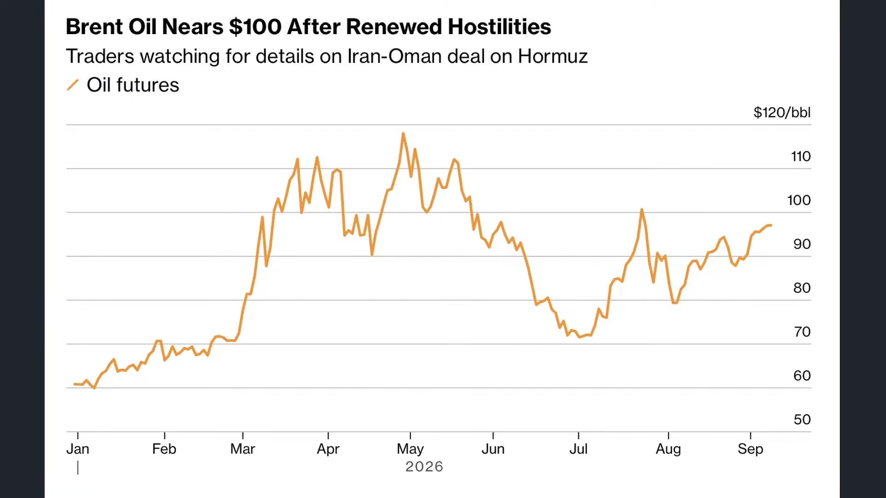

**逐字稿片段：** 因為現在30年期公債殖利率的創高 它不是完全來自於通膨 它其實很大部分來自於 目前投資等級債的發行 所以長天期利率 基本上通膨因素都還沒有發酵 那現在通膨又上去了 所以會形成進一步的干擾 原油價格按照高盛的預估 本次的衝突雖然不至於一次 突破4月份到5月份的高點可是 能否突破7月到8月 當時的高點100美元是一個第一波關卡 那當然川普也表示說目前呢 持續摧毀伊朗革命衛隊的一系列油輪 或者呢正在裝載的油輪呢 在攻擊前 他也要求船員先行撤離 目的是要摧毀你的資產 並不是引發進一步的衝突哦 算是有限度的暴富了 主要是針對你的資產來進行衝擊 那當然川普也發文了 暗示要把伊朗打造成川普的樣子 唉這個地圖應該是反過來看的吧 反正就把伊朗 打造成川普的樣子 物理上的打造 好但不管怎麼說

**話題推測：** 討論30年期公債殖利率創高。

---

## 00:03:08

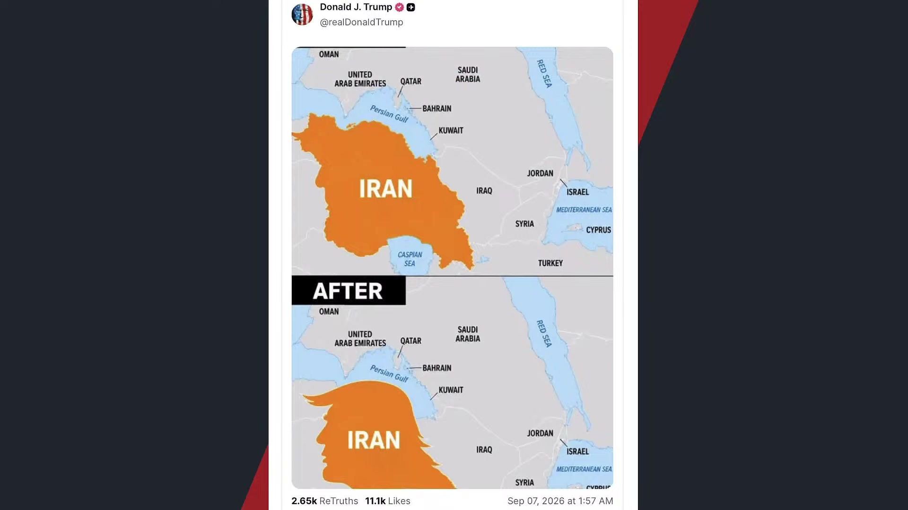

**逐字稿片段：** 現在美債在本周就迎來雙重的考驗 一方面是整個通脹的侵擾 讓原油價格又開始逐步走升那 消費者物價指數還是反映上個月嘛 所以大家就要對下個月的 數據產生新一波預期 那第二就是債券市場是同時 面對短端和長端的大幅波動 關鍵就是財政部宣 先前之所以要宣稱說進行回購 其實就是在9月 9號這一周正式要進行回購 之前都只是前瞻指引而已 本周真的要回購了 那預估在今天晚上 財政部就會正式公告 目前公債的回購細節 現在應該規模至少是 20億美元上限的兩倍起跳 大概是40億以上 那它可能會直接推動 長天期美債的反彈 不過呢市場也可能已經提前反應了 但不管怎麼說 貝森特在本周是會確切出招 那另外一邊

**話題推測：** 本周美債面臨的雙重考驗。

---

## 00:04:02

**逐字稿片段：** 聯準會更在意的通膨 因為上禮拜五那個 非農就業數據很強嘛 強到有點離譜 9月份的升息預期 回到6成就是非農害的 好那9月11號 現在公佈的8月份消費指數 就成為真正的決勝點 如果非農也是強到有點離譜 通膨在8月份也在上升 市場預估年增幅大概3.4了 那美債就會被兩股力量給拉扯 一個就財政部 他希望壓低 長端的殖利率嘛 那聯準會呢 卻因為通膨和就業偏強 所以可能被迫要推升短端利率 那如果回購規模超於預期 然後通膨也低於預期 那實際利率曲線就有機會下移了 那9月份的升息機會 可能就瞬間消失了 那當然了 如果第一 回購金額有限 有買跟沒買一樣 第二呢通膨還是偏熱 哦那短端和長端都有 可能會再次有上行風險 這是本周我們觀察美債的主要方向 所以這就代表著 禮拜五的通膨數據 其實非常重要 它幾乎就決定了 下禮拜下下禮拜 各國央行是否要保持 在相對的緊縮環節

**話題推測：** 聯準會對通膨與就業數據的關注。

---

## 00:05:07

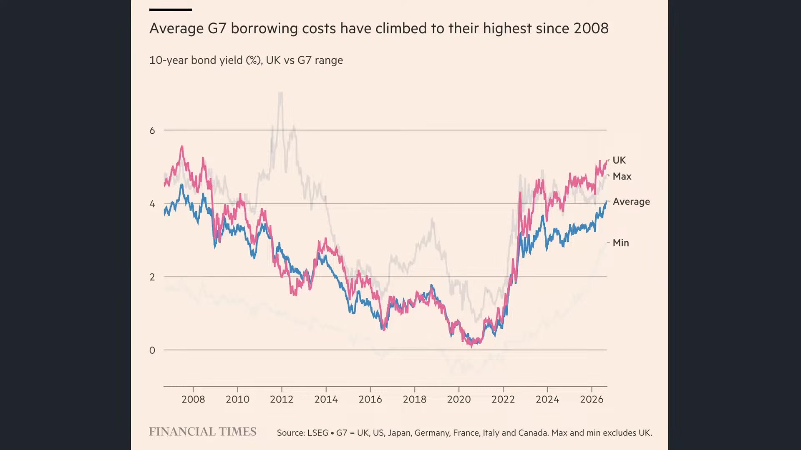

**逐字稿片段：** 其實其他央行幾乎已經確認了 你像歐洲央行和日本央行 9月份的升息預期已經 大致被市場反映了 應該就一定會升 現在反而變數是臺灣央行和美國央行 聯準會是否會升 日元一度升破153對一美元 這是說明著 大家已經預示到日本央行不管怎麼樣 是一定放鷹的 只是要放多鷹的問題 那對於股市而言 最大的壓力也不是企業 的獲利會突然的惡化 它是估值的折現率會再次上升 所以呢就變成 大家找抗跌的股票 好那現在最抗跌的就是 那個股價沒什麼漲的 在7月份衰退中的晶片股嘛 誒這就是我們觀察到的事實方向 當然了 原油價格的上漲它只是一個角度 我們看到另外一個大宗資產銅價的 部分在最近也突破了每噸14,500美元 創下歷史新高了哦 所以以前我們經常用銅 油比銅油比來做觀察 這油哦它可以把它視為停滯性 通脹的重要資產之一 就是如果油價大漲 它的確會讓整體生產成本大幅拉升 最後生產力下滑 但是銅的上漲 往往它背後隱含的是市場對於AI 對於電動車的實質需求 所以我們叫做銅博士嘛 我們不會說叫油博士 因為油上漲大家會痛 可是每一次銅上漲 通常景氣就是趨強 所以這個邏輯不太一樣 可是呢我們要仔細觀察 到底本波的銅價上漲 真的是由於全面性的景氣帶動嗎 短期哦 主要推力當然是來自於美國 關稅當時預期所造成的庫存錯配 因為市場會擔心美國對銅加徵關稅嘛 就提前先把很多銅運到美國 以前就是這樣子 就是在關稅戰正式時效開啟之前 就很多人會在囤貨嘛 所以有時候會造成一些數據失真

**話題推測：** 其他主要央行（歐、日）的升息預期。

---

## 00:06:52

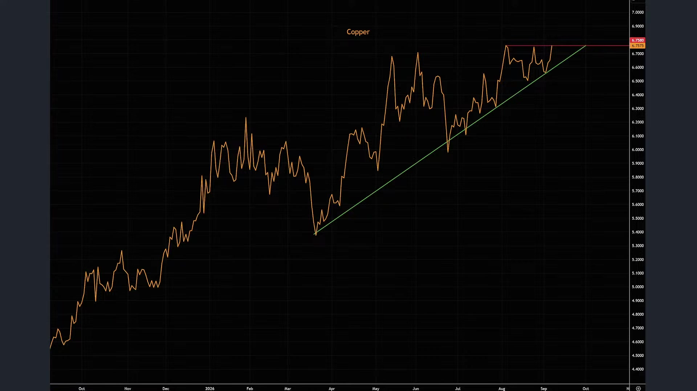

**逐字稿片段：** 那光是整個7月到8月 大概就有22.5萬噸的銅 流入到美國的倉庫 造成美國的庫存創高 那其他地區的庫存就快速下滑 所以全球未必是真的沒有銅哦 是全球的銅 跑到單一市場以後 把其他市場的銅價大幅的推高了 所以表面上來看 現在是有很強烈的美國關稅 的預期所造成的囤貨效果 最後使得海外市場現在有點供給稀缺 可是我們也要細節來看 銅它的確是AI資料中心 電網擴建 電氣化現在最重要 不可或缺的材料 所以現在這種情況 我們只能講說 銅價是不同因素交錯而成 你也不能說它完全是景氣好 因為AI資料中心蓋得再多 如果房地產市場依舊疲憊 哦那其實只是互相沖銷而已 我們真正要觀察的 其實並不是銅價的創高 而是市場對於AI的需求 導致的銅價有適度拉高

**話題推測：** 7-8月銅流入美國倉庫的具體數據。

---

## 00:07:48

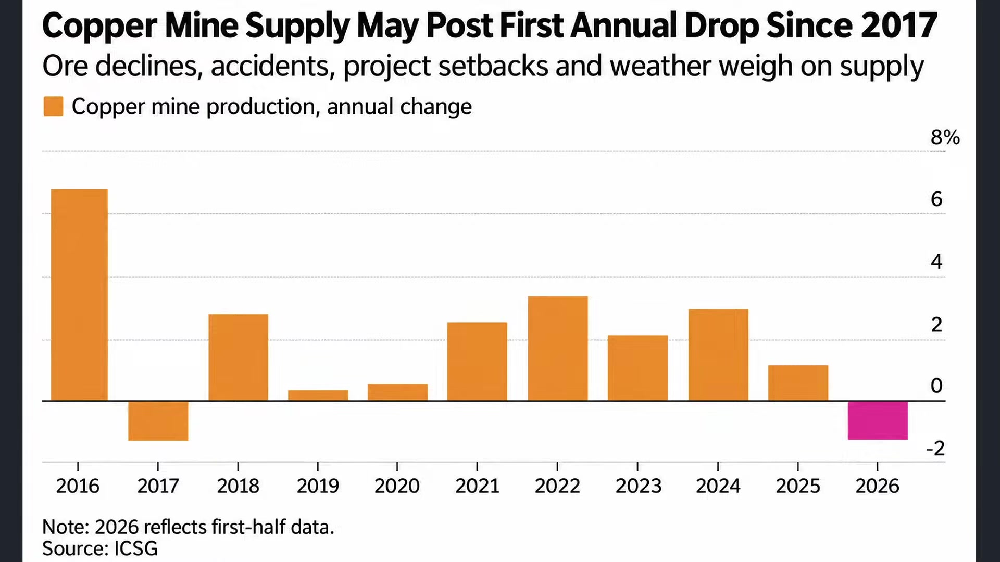

**逐字稿片段：** 所以與其買銅 其實不如買GPU 買HBN買伺服器 買電從哪裡來 買重電設備 誒這些其實需要大量的銅 而且能夠有高附加價值的產出 那對於銅而言呢 它本身還是會受到整體循環的影響 所以我只能說 現在我們看到的全球市場概況 如果銅價也在上漲 油價也在上漲 大眾資產價格下不來 我們當然就沒有太多降息的空間 那不一定會升息 因為 升息解決供給性問題 升息無法解決美債暫時 你也知道美債暫時一解決 通膨的問題可能瞬間 短期內就解決了 所以從這樣的一個角度來做思考 等同於 如果聯準會稍微有點sense 知道升息對於供給性 問題沒有太大影響 那如果現在市場消費 需求他認為是疲憊的 其實就沒有任何升息的必要 所以我個人還是保持 保持在當前的利率沒有太大改變的

**話題推測：** 投資建議：與其買銅，不如買GPU等AI相關產品。

---

## 00:08:41

**逐字稿片段：** 事實上我們要知道 由於現在全球供應鏈在這 幾年出現了極大的變革 包括非紅供應鏈等等 都導致市場上大宗資產 價格普遍都是長高的 我們舉例來說

**話題推測：** 全球供應鏈變革導致大宗資產價格上漲。

---

## 00:08:52

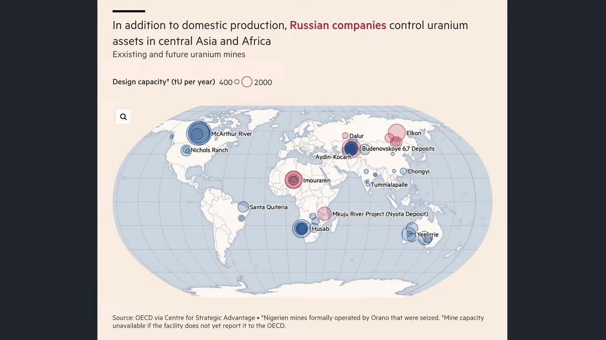

**逐字稿片段：** 你像最近的核電複星在美國市場 當中已經取得了全民的共識可是 全球的核電即便在升溫 鈾礦的供給也形成了 新的能源安全問題哦 目前全球的鈾礦 目前整體價格 仍然以每年10-15%的速度上行 尤其俄羅斯本土在24年 大概也只生產全球5%的鈾礦 可是呢如果你現在把俄羅斯企業 控制的海外礦產一起計算 這幾年它反而已經控制了25% 好那西方當然非常擔心 現在俄羅斯鈾礦的依賴尤其 22年以前 當時歐洲也是高度 依賴俄羅斯的天然氣嘛 那現在呢 西方想增加供給也沒這麼快 因為福島核災之後 鈾價長期低迷 全球的鈾礦大量關閉 探勘投資萎縮 只有俄羅斯繼續在做 還有中國在做 而這使得鈾價前一年 每磅也不過80美元 哦現在已經來到94美元了 所以現在即便 價格漲了這麼多 其實在各地的產能 上升幅度也沒有這麼快 只有加拿大或少數國家正在持續擴產 所以美國即便在核電 復興的過程當中 仍然會面對相對大的挑戰 我們舉例來說 那如果遇到這種鈾礦的挑戰 那最好的方式就不是 馬上要新建新的核電廠了 因為在供給上會有問題嘛趕快把 核電延役 所以從美國加拿大英國 法國日本到中國印度 在最近呢 都是進行高強度的核電延役 30年延到40年 40年延到50年 所以你像英國最近已經 推動了勞斯萊斯的SMR 美國空軍也開始規劃了 微型的核反應爐基地 可它背後的效果是什麼 背後效果就是就是 鈾礦價格 鈾價還在持續上漲嗎 所以這是很吊詭的跡象

**話題推測：** 討論美國核電復興與鈾礦議題。

---

## 00:10:40

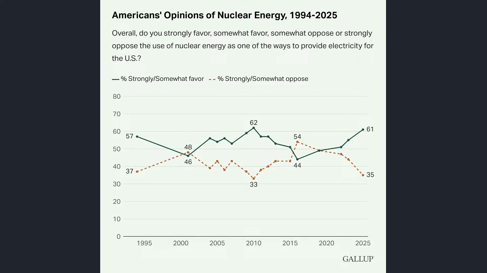

**逐字稿片段：** 你要知道 因為本周最大的新聞呢 就是美國已經不分朝野 罕見跨黨派全面支持核能政策了 6項的核法案全數零反對闖關了 這很神奇 我們知道美國還是有能源 路線的一個衝突 可是這一次眾議院能源 委員會六項核能法案當中 沒有任何人投反對票 包括共和黨民主黨兩黨 都傾向立即擴大核能 主要是要保護本國的電力設施 或者進一步的電力充裕 以因未來AI的到來 其中像是核燃料利用法以44:0通過 美國濃縮鈾部署法以43:0通過 這些都是在反映民意的同步轉變 我們根據蓋洛普的民調 現在61%的美國人是全面支持核能 好這個是30年調查史上記錄次高 僅僅比歷史新高低一個百分點 那核能的六種能源當中 也是唯一從2021年以來應該 增加重視 支持度上升的 再生能源支持度都沒這麼高了 某運有川普的色彩在裡頭嘛 好反而核能變成了統一共識 它其實背後反映的是什麼 好就是 全球這種供應鏈的脫節 對於能源的需求 在調節底下 長期以來平均是上漲的 所以我們也不能夠期待說未來會 迎來一個立即的大通縮時時代 因為轉折期轉型期 它是需要非常多的供應鏈重組 那一定要 會使得大眾資產價格走高 但是呢 如果沒有美伊戰事 這種走高 它對於通脹沒有立即性的衝擊 所以還是一樣 誰解決了美伊戰事 通脹就結束了

**話題推測：** 美國兩黨對核能政策的罕見共識。

---

## 00:12:17

**逐字稿片段：** 我們過去跟大家分享 美國曾經是全球的核電霸主 1970年新建最多的就是美國 但後來因為三裡島嘛 然後歐洲的切爾諾貝利 然後核福島的核災 一次次就改變了社會 對於核能的風險認知 安全標準 然後到時候的環評執照 審查監管要求就不斷的往上堆嘛 那核電本來就是資本密集 回收其極長的產業 審查時間越久 你設計變更就越多 融資成本就越高 最後就越難蓋 然後就越貴 然後就越沒有人蓋 所以以前我們講說那個核能哦 發生事故 爭議或者安全疑慮哦 社會就會在那個桌上墊一張紙 就怕你那鍋子燙到桌子吧 當下看每一張都有充分的理由 每一次大家都不希望 同樣的事情再發生 那幾十年下來 紙一張一張疊 最後發現唉 桌子終於保護得越來越好了但刀 也切不到東西了 或者說鍋子放下去 你已經放到天花板了 所以這就壓力很大 一層一層的限制 造成現在結果 最近我才看了一次赤壁 我看電影 就是吳宇森導演那部 林志玲 大家還記得 萌萌站起來 那裡面有一個角色我很好奇 就是那個日本演員中村獅童 就他是扮演周瑜的副手 我一一時想不起來他叫什麼名字 後來想起來叫甘寧 他媽媽就甘寧娘不是 他的有一個弟弟 就是在三國演義裡頭有講嘛 他有個弟弟 他叫甘寧嘛 他弟弟叫做甘興 然後後來我就看到一個故事 他講說 甘興其實也是吳國的一個將軍 因為有一次割東西嘛 不小心割壞了吳國之 主孫權心愛的桌子 那孫權就很生氣嘛 要把他斬首 那這個時候吳國的軍師周瑜 他老大就想要想個辦法去救他 他就讓全國的人呢 在割東西之前呢 都在桌上先墊一張紙 那孫權也就因為這個方法原諒了甘興 所以這個後來就是 全國墊紙救甘興的由來 我聽說是這樣子 那我講就是 每一次的核能發生事故 爭議或者安全疑慮 社會就會在桌上多墊一張紙 那每一張紙看起來都有充分理由 大家都不希望同樣的事情再發生 最後發現誒 制度最大的難題 往往不是規定沒有道理 是規定一直增加 很少淘汰 那所有的合理的安全 措施累積在一起之後 一個國家可能原本最擅長做的事情呢 它已經失去了執行能力 美國的製造業 美國的核能都是如此 好那不管怎麼說 我們剛才講的是原物料價格 的上行所形成的市場壓力

**話題推測：** 美國作為曾經核電霸主的歷史。

---

## 00:14:54

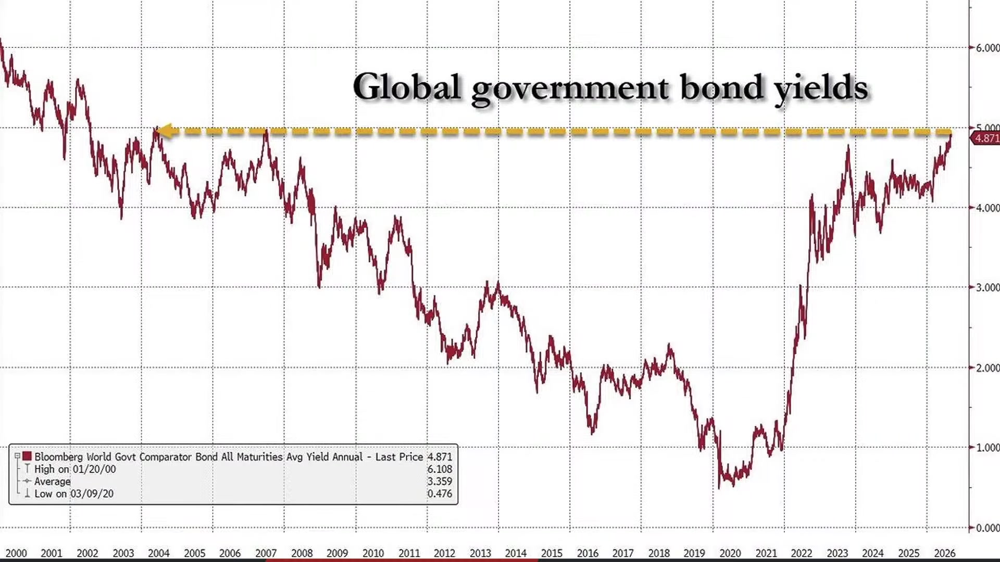

**逐字稿片段：** 可是回過頭來看 以哈內特的角度 現在市場最大的風險 仍然不是AI的獲利能力哦 還是長天期殖利率的反壓 因為10年期公債殖利率 現在來到4.8310年期來到5.3 日本10年期來到3% 德國10年期來到3.38% 全球債券殖利率都已經 來到了07年以來的高點了 那真正的關鍵就變成11月了 因為現在就是高利率的承壓 對於股市有一點估值的壓力 其實是ok的 可以理解的 但重點是在11月份的期中選舉之後 如果政策有極大轉變 大家會有點擔心

**話題推測：** 回到市場討論，Hartnett（哈內特）對市場風險的看法。

---

## 00:15:29

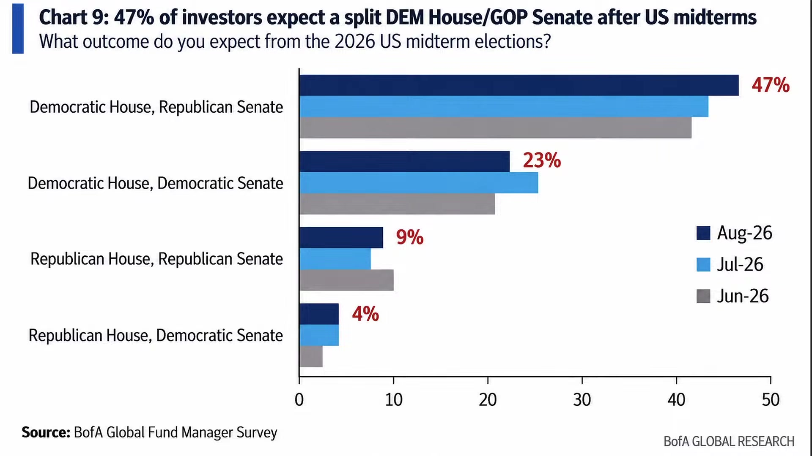

**逐字稿片段：** 我們根據美銀目前的調查 大多數的基金經理人是預估 共和黨是能夠保住參議院 然後民主黨拿下眾議院 這個大概占47% 認為民主黨全面拿下的只有23% 可是在短短兩周之內原因 由於原油價格現在已經逼近100美元了 市場現在預估民主黨 很有可能會橫掃國會 那市場上會擔憂民主黨可能會轉向 在其中選舉之後 更高稅率 更加強監管 壓低生活成本的政策 對於企業的每股盈餘 因為財富就一套嘛 你要多給人民一點 企業就要多付一點嘛 好所以從這樣的一個效果也讓企業在 任何的投資決策當中就被迫要予以 保守好 所以嗯市場會擔心 民主黨上任以後 所有的資料中心的建制 數可能會因此而延後 那就算沒有延後 在其中選舉之後 川普也很有可能會迎來比較大的 這種國會上的制衡 在疾控中心的法規放鬆層面 一樣會受到顯著衝擊 因為現在距離期中選舉就兩個月嘍

**話題推測：** 美銀對期中選舉結果的預估。

---

## 00:16:28

**逐字稿片段：** 川普目前支持率平均是35-40% 好這明顯低於歷屆總統同期在 期中選舉53%的支持率 好甚至有可能跌破 1994年克林頓的39% 好這就是 40年來的新低了

**話題推測：** 川普總統的支持率數據。

---

## 00:16:44

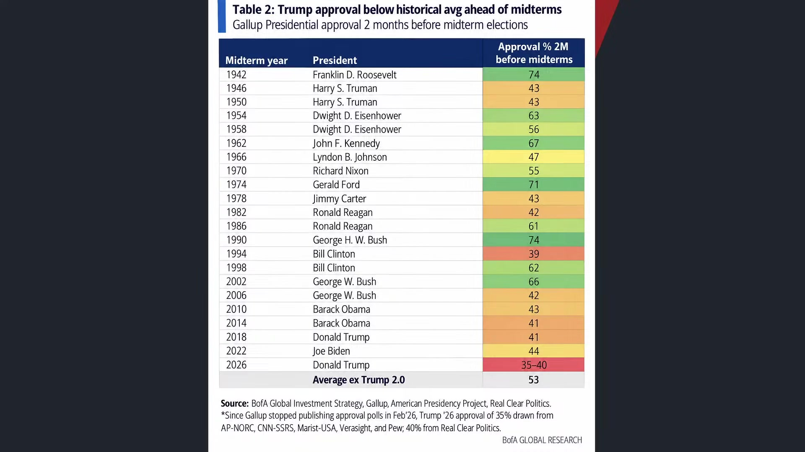

**逐字稿片段：** 那從歷史角度來看 其中選舉前兩個月的總統 支持率差距其實還是很大了 你看老布希1990年 和羅斯福1942年 唉已經有高達74% 都已經執政兩年了 執政這個支持率還可以這麼高 比高氏早苗還高 那克林頓在94年只有39% 雷根在1982年只有42% 但是也不阻止或者說不會對他 未來的執政形成重大衝擊 所以還是很難說 但是市場 很明顯是充滿變數的 而且民主黨的勝率正在緩步的提升 那這樣的一個效果會讓大家對於AI 的建制中心形成極大的疑問呢 這就是最後我們觀察到的實質跡象 當然了如果是從短期角度來看 如何進行償債殖利率的有效壓制 如果壓不住通脹 能不能靠資產價格的上漲 救一些選票回來呢 我覺得這可能是川普目前的做法 他大概也理解 你要讓8月9月通脹數據大幅往下掉 不可能的嘛 只有一種方式了 那讓你的股票漲吧 股票漲了就有財富效果了 就勇敢去花費了

**話題推測：** 歷史上總統在期中選舉前支持率的比較。

---

## 00:17:51

**逐字稿片段：** 臺灣通膨壓力大不大 其實看起來是越來越大的 但是只要臺灣股市一直上漲 你去吃稻寶 你永遠都訂不到位置 那財富效應就出去了嘛 你也沒賣股票 但是你就有信心 你可能連明年的機票都訂好了 到時候股價下跌 你就不敢消費了 可是這都是 這是我們看到的財富效應 只要你的帳面價值不斷的提升 大家就有信心了 也許川普現在就想要搶這些票了 好所以我們看到最重要的重點就是要 要把殖利率的捆綁嘗試的拿掉 讓資產價格有進一步的膨脹

**話題推測：** 討論台灣通膨壓力與股市財富效應。

---

## 00:18:22

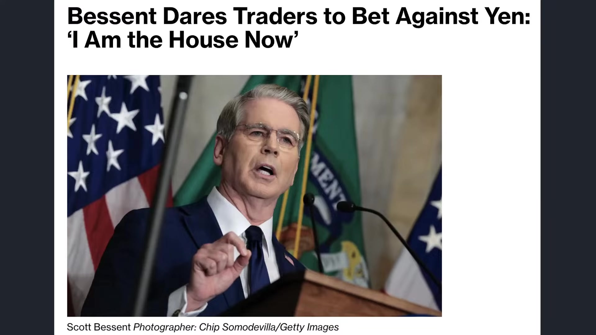

**逐字稿片段：** 好所以貝森特在昨天召開記者會談話 直接向全球外匯交易員說 挑戰市場 繼續押注日元的貶值 他表示自己現在掌握的政策 資訊和一般投資人並不對稱 身為財長 他非常瞭解日本政府 接下來可能採取行動 所以他形容我現在就是莊家 你想跟我對賭也可以 我知道很多人在押注日元會貶值 但是我現在是莊家 不要被我擺了一道 態度很明顯 如果有任何日元貶值的跡象 貝森特會直接進行干預 為什麼要防止日元貶值 因為日元貶值 日央就要護盤 要護盤就要賣美債 賣美債賣美元來救日元嘛好 那貝森特現在不允許任何人賣美債了 當然這只是一種市場上 的氛圍和前瞻指引呢 目的就是要讓美債殖利率停止創高 好這是他目前所試出的論調 那當然了 對於聯準會而言呢 他也要開始思考另外一個問題 你說聯準會 沒有 聯準會就只看就業和通膨當中的平衡 不一定哦 聯準會可能現在 還要考量一下目前國債利息的問題 如果它升息 財政部未來一定會繼續發債的 那你要給它升 付多少的利息呢 好這個是比較大的一個壓力

**話題推測：** 日本財政副大臣貝森特（Kanda Masato）對日元貶值的談話。

---

## 00:19:35

**逐字稿片段：** 因為美國政府現在是同時 面對高債務高利息的罕見壓力

**話題推測：** 美國政府同時面對高債務和高利息壓力。

---

## 00:19:39

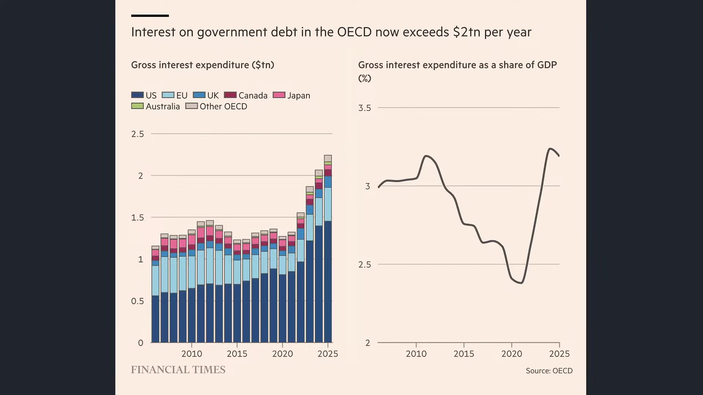

**逐字稿片段：** 光是整個25年OECD成員國的政府 利息支出就已經來到2兆美元 那美國現在是付出最多的 所以今年我們看到OECD 成員國還要再借18兆美元 創下歷史新高 那美國政府上個月已經突破40兆了嘛 如果是細節來看 這就變債務死亡螺旋了 你都已經利息這麼高了 你的財政赤字就越大 那你的利率這麼高了 你還要再發更多債 那投資人就要求更高的殖利率 你的利息支出又再度的上升好所以 按照美國國會辦公室的預估 未來10年美國債務利息 可能會再翻一倍 英國目前一年利息 支出已經1,100億英鎊了 那美國的部分呢 目前看起來 整體而言 已經全面超過了國防支出 逼近社會福利支出 這麼龐大的一個利息壓力 就跟我們過去所講的一樣 它會讓美國的經濟動能呢 被迫每年賺的錢都要拿去還利息 它甚至連本金都還不起 它就是每年的經濟產出 相對於公共建設 它優先拿去還利息 全球政府債務 如果我們把美國世界各國來做比例 差不多都已經回到了二戰水準了 那現在也沒什麼市場大戰 結果呢我們的 債券的一個融資情況 差不多就是1940年的高點了 好所以現在就是尺度不同 價值不同了 全球政府正在面對一個 很典型的尺度問題 對一般家庭來說 利率多一個百分點 每年呢我們頂多就付幾千嘛 幾萬元的利息嘛 但是當政府背負的是 數十兆美元的債務 對於台積電而言 升一%都沒問題 對於美國而言升一% 放大的就是數千億美元的財政負擔 好所以我們看今年OECD光是利息 支出就已經突破兩兆美元 相當於國內生產毛額的3% 英國法國美國全部都出現 一年的利息支出比一整年 的國防支出還要多的情況 所以利率沒有變 真正改變的是背後乘上的債務規模 個體而言 你還勉強撐得過去 總體而言呢 哦這是一個非常非常棘手的問題 所以我們講說 從個體看總體的來說 尺度不同 你的價值就不同 聯準會就要注意這件事情

**話題推測：** OECD成員國政府利息支出數據。

---

## 00:21:44

**逐字稿片段：** 他之前看到一個故事 講一個人問上帝 上帝 一百萬年對你來說有多久 上帝說大概一秒吧 那男的說 那100萬美元大概是 多少錢 那上帝說 那大概也就一塊錢吧 我男的聽完就很興奮了 那可以給我100萬美元嗎 上帝說當然可以 那男的說真的嗎 上帝說等我一秒 所以很多數字哦 其實不能夠完全脫離尺度來看 你欠100萬的人 利率一% 那頂多就付1萬 你覺得還ok 40兆誒 多一%就是4,000億 它就足以改變整個政府的預算配置 所以我們才講說你看 上帝1秒是人類的100萬年嘛 同樣叫做1秒 放在不同尺度下 意義就完全不同了 這是現在市場上最大最大的壓力 當然了 我們回過頭來說 現在市場上進一步去思考的 就是川普必須要在各種政策 當中取得適度的平衡 好第一個平衡就是在其中選舉之前呢 應該要盡可能的把已經獲得的利益 能夠立即實現 或者包裝成目前的選舉承諾 選舉上的成果 好第一個就是當然是 美加的關稅戰呢 已經正式課徵了 哦那兩個月以內必須要談好哦 因為美加關稅戰現在幾乎是完全爆發 雙方基本已經停止談判 我們過去提到 整個上半年加拿大 對於美國出口商品呢

**話題推測：** 講者分享一個關於「尺度」與「時間」的寓言故事。

---

## 00:23:11

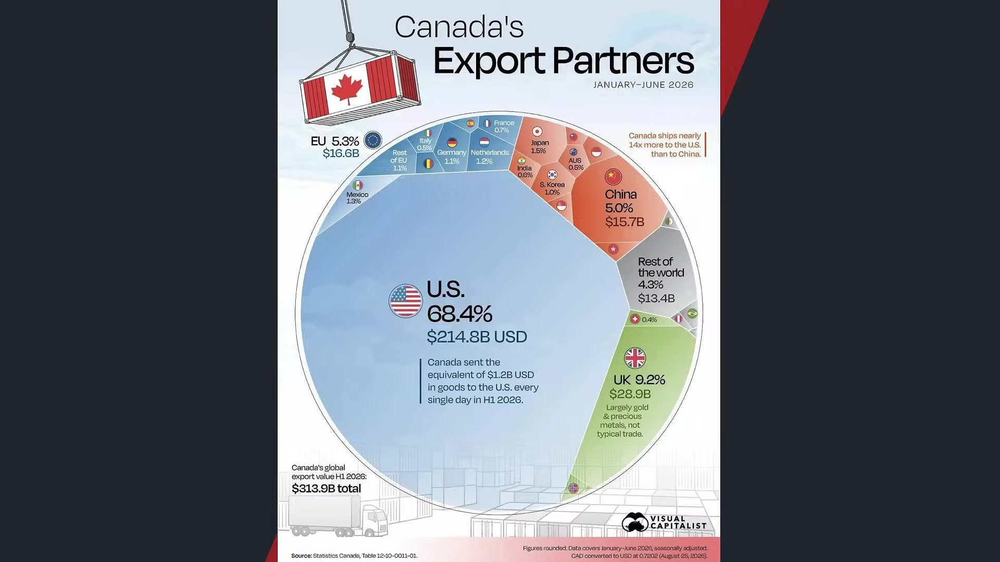

**逐字稿片段：** 是來到2,148億美元 占了全部商品的68% 遠遠高於其他市場 英國是9.2% 去居次哦所以 當中的那個落差就已經很明顯了 那美加現在貿易戰在 昨天又繼續升級

**話題推測：** 美加貿易商品出口額數據。

---

## 00:23:24

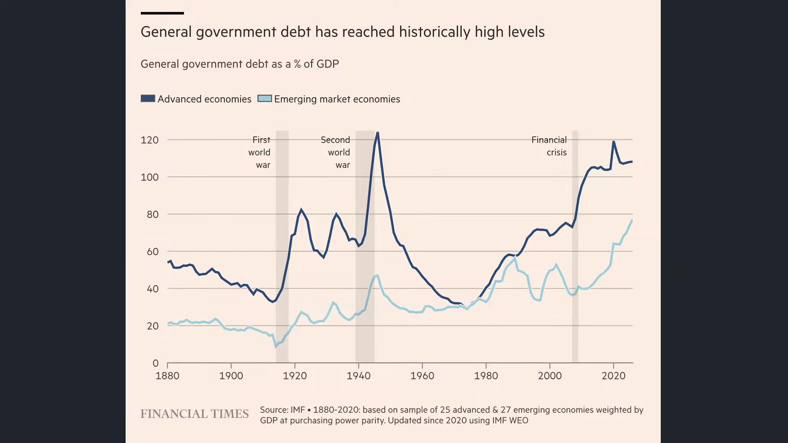

**逐字稿片段：** 川普直接點名了要封殺龐巴迪 那我們也知道 50%的直接性關稅 對於加拿大的商務客機大廠 這麼高的關稅來說 那幾乎是毀滅性的打擊 所以雙方應該是有再度談判的機會 但這場衝突最麻煩的事情是 原本美加供應鏈已經高度整合 大家一起說好要 對於中國產品呢 產生一定的前置效果 想不到加拿大企業對於 美國企業互相的衝擊 會使得市場上有 進一步的緊張局勢升溫 你要知道龐巴迪 昨天大家觀察的新聞是 他好不容易才跟那個漢翔 好不容易才簽到他的合約 他一簽完 龐巴迪就完了 現在美加關稅戰正式開打 那從川普角度而言 應該要在這兩個月談定一個好的協議 在其中選舉當中獲得利益成果

**話題推測：** 川普點名封殺加拿大龐巴迪公司。

---

## 00:24:11

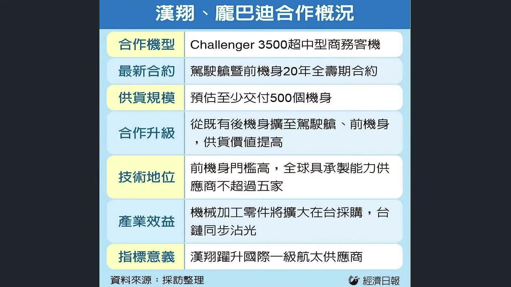

**逐字稿片段：** 另外一個就是AI資料中心呢 因為現在逐漸成為共和黨的選舉包袱 那川普又力挺 反而撞上了 地方民意的一些影響

**話題推測：** AI資料中心成為共和黨選舉包袱。

---

## 00:24:20

**逐字稿片段：** 因為近期民調顯示 大約70%的美國人都不希望治療 中心蓋在自己家裡附近 安娜伯格斯公共政策中心的全國 調查現在顯示大概反對治療中心的 民意相對於今年3月份 尤其是美伊戰事爆發之後 大概上升了12個百分點 它形成一種很有趣的跡象 就是共和黨的候選人呢 現在普遍開始跟川普保持距離了 你像德州州長 亞伯特他對於資料中心 已經祭出了暫時性的限制 德州的共和黨參選人帕克斯頓呢 他也提出了管制方案 就是現在好像提越多管制票越多 這些州都是2024年川普直接拿下的哦 都是被評為勝負難料的關鍵戰場 好所以民主黨現在也變成選舉武器 完全就反資料中心 針對AI資料中心的電視 廣告已經播了大概1.5萬次 支出760萬美元 所以從這些角度來看 都變成在支持AI和反AI的過程當中 雙方開始形成地方拉扯 我們知道AI資料中心跟 美國地方引爆的反彈 其實很大程度我覺得 還是來自於溝通不良 哦這是國家政策的方向 那對於細節當然要予以調整嘛 可是科技公司和聯邦政府 現在就是不斷強調AI是國家競爭力 該資料中心可以帶來投資 然後就業生產力 那更關係到美國能不能 在AI競賽當中擊敗中國可是 地方居民現在在意的就不是這些嘛 他們問的是 為什麼製造中心要蓋在我家旁邊 為什麼我要承受噪音 有高壓電塔 唉那個噪音其實很大 因為現在製造中心旁邊要蓋電廠嘛 水資源的消耗怎麼辦 所以為什麼科技巨頭賺錢 但是電網升級和電費的 上漲的成本會落在我身上呢 雙方雖然都在講AI 也看好AI 但是實際 像從頭到尾哦 它是兩件不同的事情 所以很大程度 雙方就是溝通不良

**話題推測：** 民調顯示美國民眾不希望資料中心蓋在住家附近。

---

## 00:26:12

**逐字稿片段：** 愚公移山的故事大家聽過吧 一定有人很好奇 為什麼愚公死後 他兒子沒有繼續移山呢 聽說是這樣的 愚公他死前嘛 召集自己的兒子到床邊呢 很虛弱的說 移山 移山 那兒子聽不清楚 頭往前 亮晶晶？ 愚公就死了 溝通不良嘛 溝通不良 所以我們這樣說 有時候科技公司一直講 說AI會讓美國更強 其實居民要問的是 那為什麼代價由我承擔 就是他從頭到尾就是 一個補貼性的問題 就是你當時承諾我說 蓋AI資料中心可以讓我們 這個小鎮過得更好的承諾沒有實現 我當然會有壓力嘛 好所以如何讓AI智造中心可以 對於當地的經濟有貢獻 當地的環評達到良好的溝通 這是川普目前面對到 比較大的一個挑戰 好八點五十八分 我們看一下美國股市四大指數的變化

**話題推測：** 講者分享「愚公移山」的典故，比喻科技公司與地方民意的溝通不良。

---

## 00:27:09

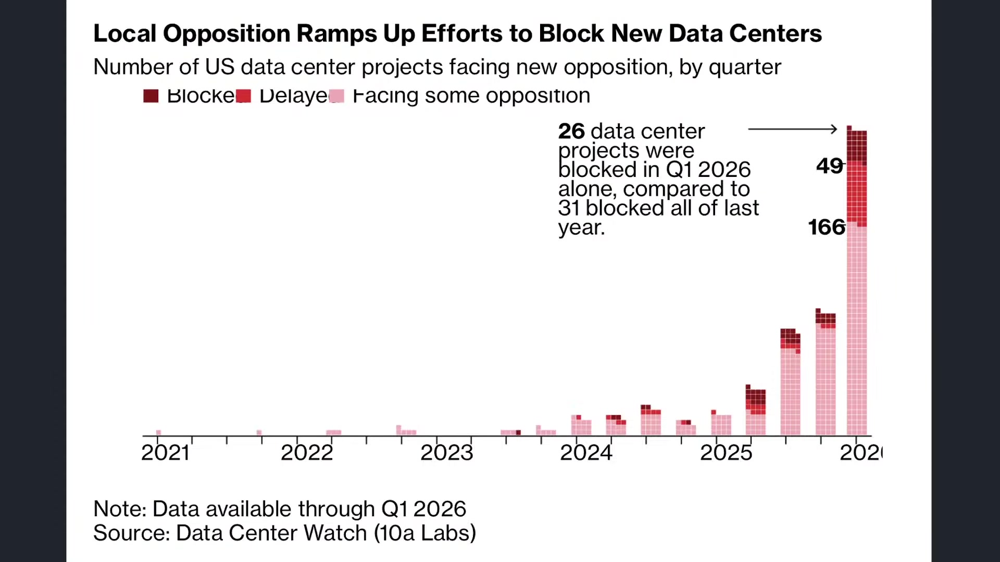

**逐字稿片段：** 道瓊指數下跌620八點 1.18% 收在52,786點

**話題推測：** 道瓊指數即時點數與跌幅。

---

## 00:27:16

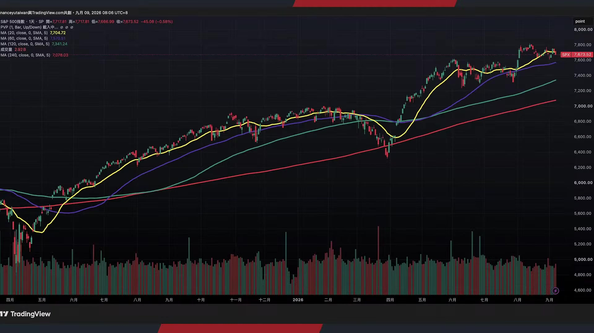

**逐字稿片段：** 標普下跌45點 0.58%收在7,673點 納指下跌85點 0.38% 收在26,421點 其實三大指數都還在高位震盪 資金現在流到費半了

**話題推測：** 標普500指數即時點數與跌幅。

---

## 00:27:30

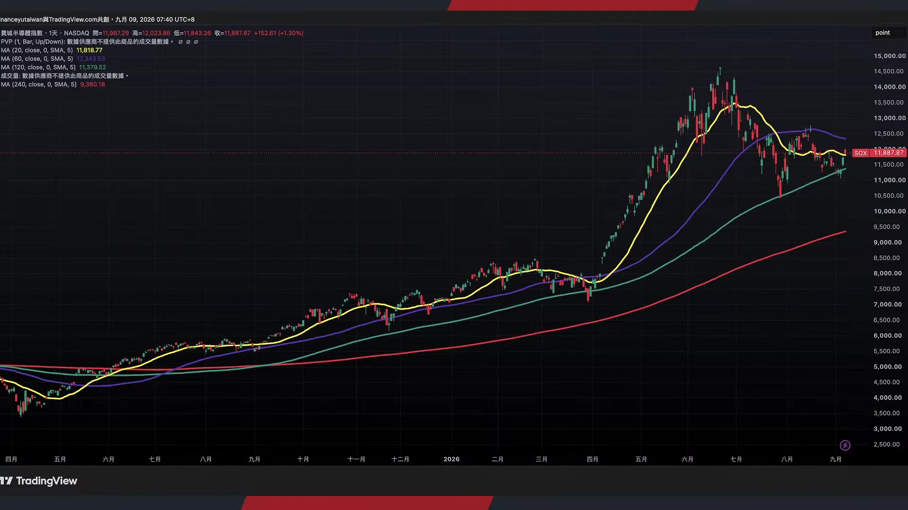

**逐字稿片段：** 費半上漲152點 1點三% 收到11,887點 誒其實費半這樣子來看 就有一點頭肩底的味道嘍 感覺第二隻腳好像要出現了 當然這只是從形態學上來看了 好當然有很多男生宣稱 自己有第三只腳嘛 量能能不能起來 你如果量能起不來 你打10只腳都有機會 好所以拭目以待 好但至少我們從左側邏輯來看 四大指數只有一大指數 目前還在左側佈局空間 好那回過頭說 這是美國現在面對的 極大挑戰和問題 我們改天再聊德國極右派的大突破吧 時間不太夠 我們今天主要跟投資 朋友稍微梳理一下 我們看到美國在當前 殖利率預期的創高 它其實是有背後很多因數的交錯而成 由美伊戰事所引領的石油價格 通膨的增溫 有另外一方面 我們知道在投資 等級債大規模發行底下 對於美國公債的實質排擠哦 另外一方面 我們也知道全球的 通膨僵固性的外溢效果 形成大家針對鎳價 針對銅價的提前備貨 最後預期反而把通膨撐得更高 實質上可能沒這麼缺 可是你預估會缺 就有了囤貨心態 這是對於通膨堅固性極大的衝擊 那這個階段是關於期中選舉的部分 我們知道在期中選舉 現在川普的總體民調平均是39 好到40左右 那這樣的一個壓力哦 本身而言 幾乎就確保了參眾議院 至少有一院一定會失去 那麼如果最後連參議院也失去哦 那川普就會正式迎來朝小野大 也就代表著民主黨在AI資料中心的 立場會大幅的影響到27年28年29年 到時候資料中心的建制速度 已建的甚至現在來看 都有可能立即取消哦那 還未見的 會不會直接延後到2030年以後 這是市場上極大的變數 當然它不是泡沫破滅的理由了 它可能更類似於中期回檔的理由 可是至少讓整條AI的布建時間線 稍微瞬間緩了下來一點點那當然 獲利的拉升 算力的到位 也可能會適度的延後 那最後川普能夠做的事情 當然一方面呢 取得AI製造中心和地方名義上的平衡 另外一方面呢 在關稅戰層面 必須要立即達到有效的政治成果 包括美加協議是一定要 在集中選舉之前談定的 包括232關稅 9月底之前應該就會具體公佈 如何銜接IEEPA國際經濟 緊急權力法的失效 這是後續我們可以觀察的幾大方向 但至少可以承認 現在美股股市 都在高位盤旋 道瓊標普納指 其實仍然有隨時創高的可能性 因為上方幾乎沒有任何的賣壓 那對於費半而言呢 反而形成了在 高利率底下 估值相對比較低 資金買盤比較充裕的一大指數 也給投資朋友做些觀察

**話題推測：** 費城半導體指數即時點數與漲幅。

---

## 00:30:21

**逐字稿片段：** 台股上漲195點 收在47,301點 其距歷史新高 也沒有幾點嘛 不到1,000點的距離 那現在像台積電聯發科上方 已經沒有任何賣壓了 所以最後臺股如果能夠 成功在下半年創新高 有很高的機率 可能就是拉台積電 拉聯發科 直接把權值股給拉上去 因為其他板塊有些股票是套牢重重 拉權值股是最快的 不過呢 這對於多數人的體感 就不一定特別明顯了 因為不是大家只持有權值股 現在是個股投資盛行 所以會形成體感上的落差 就會跟韓國市場一樣 明明韓國市場今年還是僅次於臺灣 在全球股市表現第二名的市場 居然有80%的散戶都是賠錢的 好所以買的點位很重要 買的時效很重要 還有你在什麼樣的一個市場 氛圍當中來做進倉也是很重要的 給投資朋友做些思考 如果喜歡我們節目 記得幫我們訂閱按讚加分享 我們就明天早上八點半 早晨財經速解讀再相見 祝各位投資朋友看盤順利 操盤愉快

**話題推測：** 台股指數即時點數與漲幅。

---
