# yutinghaofinance_c4IT1Mwb_Pg — 關鍵畫面索引

- 來源逐字稿：[yutinghaofinance_c4IT1Mwb_Pg_GT.srt](yutinghaofinance_c4IT1Mwb_Pg_GT.srt)
- 影片：https://www.youtube.com/watch?v=c4IT1Mwb_Pg
- 截圖數：35

## 00:00:35

**逐字稿片段：** 這一次8月份的非農就業 數據是非常非常漂亮 漂亮到我覺得會不會校正回歸 好這一次也提高了市場上 針對9月份的升息押注 不過美國股市雖然三大指數收黑 費半反而有比較有效的資金來做拉升 看一下今天臺北股市是否 能夠受到強而有力的外資買盤 外資其實從今年7月8月以來 整體賣超幅度雖然稍微減少 相對於6月7月不過呢 至少今年總計賣超仍然高達1.3兆台幣 那過去7年 外資已經賣習慣了但是 高於一兆以上的賣超 還是不是特別多的 好這也顯示著我們知道好 全球在新興市場大漲的過程當中 外資似乎已經有 長年期調節的意味存在 與此同時 如果利率預期又開始逐步的升高 那我們要怎麼來觀察 全球資金流的走向畢竟

**話題推測：** 介紹8月份非農就業數據

---

## 00:01:31

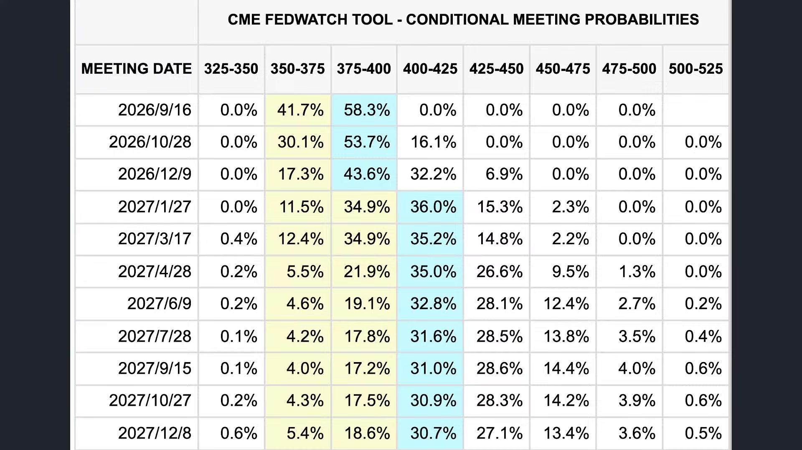

**逐字稿片段：** 雖然現在美債稍微有一點失守 10年期公債殖利率在4.78%左右 可是最近fang尖牙五股 慢慢的創下歷史新高了 我們先看federal watch哦 整體而言 預估在9月份升息一碼的機率 本來當時是回到5成 現在回到 58%左右 也不是特別高 好但至少還是有一點偏緊的預期 那重點來自於納斯達克 因為從5月份以來就大致維持整理 目前又 回測到長期趨勢和100日 均線附近之後開始反彈 好那現在呢 市場上明顯動能降溫以後 出現了一個比較顯著的變化 我們先看AIQ 我講的就是全球人工智慧科技的ETF 它大概也出現了 一段時間以來最大單日的上漲 那價格也逐漸的接近到下降 趨勢線和多月整理趨勢線的上緣 好所以就看一下第一輪 突破是否能夠產生 那至於它的上游端

**話題推測：** 提及10年期公債殖利率達到4.78%

---

## 00:02:29

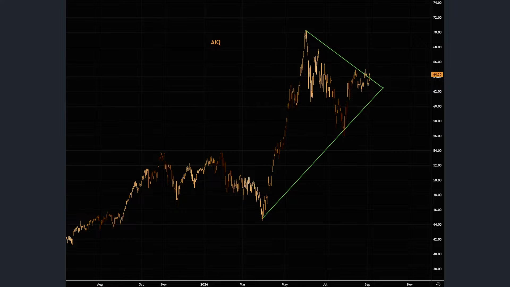

**逐字稿片段：** 就是我們看到的Fangle 禮拜五已經創下歷史新高了 等同於過去幾年最強的科技權值股 又重新回到領漲地位了 QQQ是稍微落後一點點了 但覺距離歷史新高也沒有多遠 我們知道在今年在7月 份的修正之後 其實道瓊和標普後續都創下歷史新高 那納指則是在高位做盤旋 現在借由尖牙5股先帶動創新高 也許QQQ跟上的機會就存在了 這種現象其實市場上看到很多次 只要領先股開始創高 後面的科技股就容易被帶動 尤其上方 其實我們也看得出來 除了費半 大多數納指的成分股上方的 套牢賣壓沒有想像中來的重 至少比季一體好得多 那如果細節觀察 上禮拜是第一輪突破 我們就看是不是假突破 那如果本周可以順勢站上的話 那就代表著有人先衝上去了 AI股已經開始轉多了 尤其市場上現在又有比較多 新一輪的造夢者的催化劑 畢竟現在是慢慢進入到財報空窗期哦 可以針對第三季的 電子旺季有一輪的期待 然後Openai又推出了Ausrta模型 讓大家覺得有超越其他模型 新一代技術上的突破 Anthropic在未來兩個月也即將要上市 所以這是AI多頭論目前最重要的核心 就是前沿模型 還在變得越來越強 那股價雖然在創高 可是很慢的創高哦 那只要獲利成長的速度 超過股價上漲的速度 本益比就會下滑哦 那到時候所有股票都變得很便宜了 即便股價沒有跌多少 那輝達的動作同樣值得注意 因為我們知道上禮拜 大家最為關注的就是 英偉達以129億美元收購了huggingface 那這視為非常重要的一步 這不是單純買下一家公司嘛 它是進一步控制開放權重模型的 分發管道和開放開發者的生態 讓英偉達從現在傳統賣鏟子的GPU 現在往整個AI軟體模型開發平臺 往更深的位置來做移動 那輝達雖然沒有創下歷史新高 不過也創下了本波段以來的新高了 我們就看是否能夠有 進一步的買盤來做推升 當然市場上真正爭論的 還是AI的需求存不存在 估值能不能持續的往上推 其實按照這種角度 它獲利一直上來 它只要股價不漲 它估值也越來越低了啦 你像阿斯摩爾就是 一個很典型的例子 當時我們講說從他前瞻的EVIT DA倍數 從27年來過 大概已經從28倍一路下滑到20倍左右了 所以現在市場唯一的問題 就是因為沒有出現一個比較 大的回檔或者恐慌的加診所以 大多數散戶投資意願 也沒有想像中來得高 而過去通常是要非常 顯著的市場量能暴增追高 那如果量能起不來 你好歹得大跌嘛才讓 股市撿便宜的人有機會可以撿到 可是現在股市也沒跌多少 也不漲多少 所以才會真正量縮 要不然大跌一場 搞不好量能就從此歸來了

**話題推測：** 再次提及FANG類股創歷史新高

---

## 00:05:37

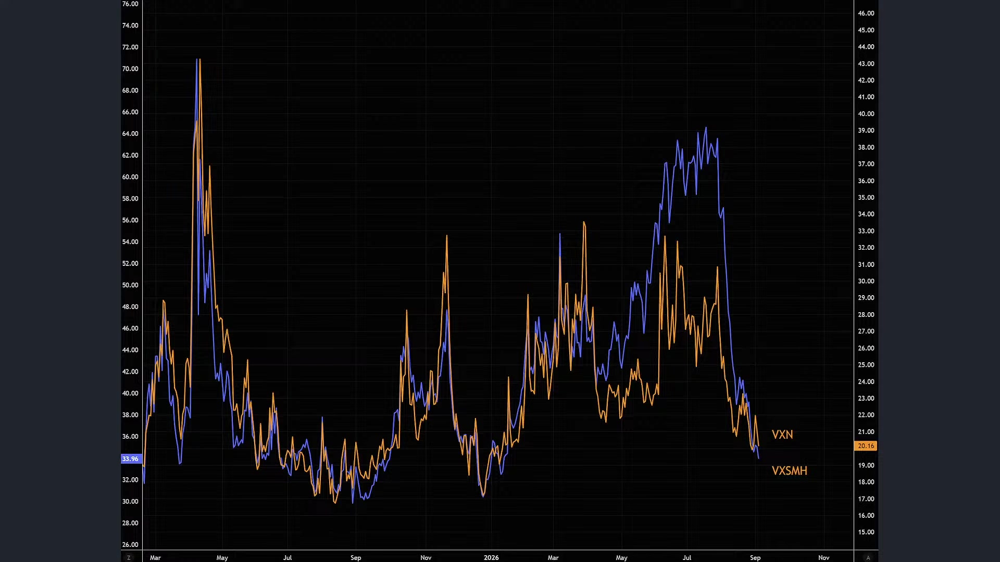

**逐字稿片段：** 我們看從VIX指數 從市場避險情緒來看 其實都在緩步的下滑 整體隱含波動率 波動率都在明顯的下降 那另外一個我們看是硬體了 剛才我們看是從納指來做推敲 如果是從費半來看呢 因為你要知道

**話題推測：** 觀察VIX指數顯示的市場避險情緒

---

## 00:05:52

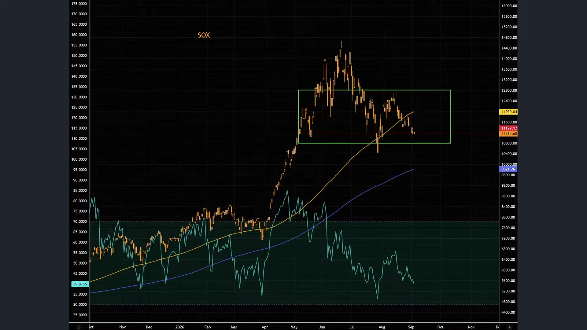

**逐字稿片段：** 從6月底以來 軟體股其實是上漲25%哦 但是費半卻反而下跌了20% 那這種背離哦 已經很明顯 已經很難維持到長期 脫鉤的角度了 因為費半雖然它的確是領漲 在過去5月6月 可是呢從整體過去一個季度走勢來看 雙方也開始嚴重分歧 總有一者 它是走出了明顯方向 作為領先地位 有些人說費半已經明顯走弱 是要帶領著全球股市跟著走弱 那有些人認為 那如果三大指數都在 創高或者創高邊緣 變革甚至創下歷史新高了 那費半也是回檔的差不多了吧其實哦 主要還是來自於費半的確在4月5月6月 這一波乖離實在拉得太高了 那所以呢 下方的盤底時間呢 可能就要稍微久一點了 你把台股拿來做對照 剛才看的是費半嘛 誒費半是有一點頭肩頂的感覺哈 那你看臺股 唉明明台股跟費半應該是聯動的 台股卻是頭肩底的感覺了 好所以雖然我們每隔 一陣子就要回去睡公園了 有沒有發現公園越睡越豪華 越睡越大間 好台股的確 即便我們是硬體股 我們是晶片股 我們跟費半走起來都不是特別一樣 跟韓國股市也差非常多

**話題推測：** 比較軟體股與費半指數的漲跌幅背離現象

---

## 00:07:07

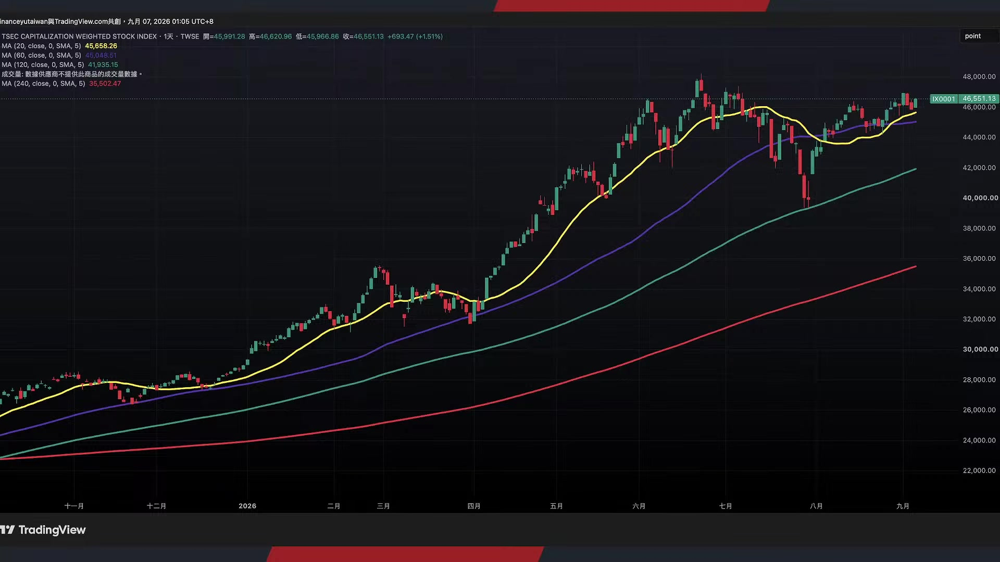

**逐字稿片段：** 8 台股是8月份當時 在級跌收斂之後 把月線季線陸續收斂呢 而且低點是比一度 前一度還要來得高 那就代表著整個頭肩底逐步成型 那這種線形呢 是很有機會挑戰歷史新高的 那費半的部分 我是新高 感覺至少要花一個季度以上的時間呢 好所以現在呢 大家比較觀察的幾大方向

**話題推測：** 台股8月份修正後形成的頭肩底形態

---

## 00:07:31

**逐字稿片段：** 就是AI需求雖然還在爆發 但是單位經濟可能正在惡化 因為TOKEN使用量快速增加 可是價格下降太快了 所以照理來講 應該是要費半上漲 賣產值的繼續漲 因為用量在增加嘛 但是價格沒變 即便推出新模型 它也沒有多收你錢 所以應該是科技巨頭要跌 可是現在是費半漲不動了 但是科技巨頭開始陸續創下新高了 唉這就非常有趣的一個跡象 說明股價的短期走勢變化都不能夠用 短期市場的模型或者新聞來做解釋的 他一基本上 就是要反映中長期的怪力回檔 但是最終而言呢 我們還是比著自己的 本意比吸不吸引人 自己的EPS 看自己的估值能夠投射多遠呢 好所以從現在這個角度而言呢 大概就就可以理解了 現在你硬要講從左側交易者而言 那個 7巨頭有沒有什麼太多投資空間 誒就慢慢快要沒有了 因為慢慢的這都收復回來了 反而是費半是不是有空間呢 這就值得觀察

**話題推測：** 討論AI需求爆發但單位經濟惡化的現象

---

## 00:08:34

**逐字稿片段：** 韓國股市也差不多 韓國股市最大的變化就是 上半年散戶的積極買進了 現在變成反彈就解套 反或者說反彈就停損 台股不一樣哦 台股是真的蠻多人在等解套了 就是漲了一層漲了兩層算了 那不停損了 乾脆等解套好了 韓國股市是真的就 直接停損了 我們看整個8月份的散戶淨買資金 大概只剩下5.4兆韓元 6月是多少 54兆現在是5兆 也太低了吧 差了90%

**話題推測：** 分析韓國股市散戶交易狀況的變化

---

## 00:09:08

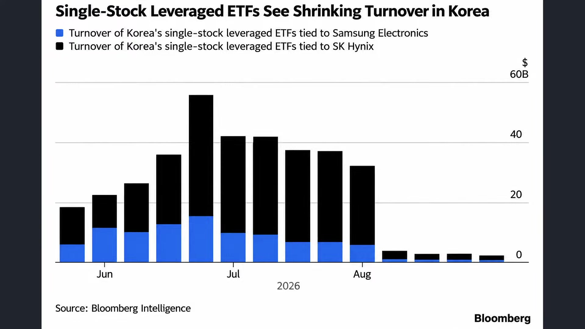

**逐字稿片段：** 券商投資人的存款也跌破了100兆韓元 他不是是說我現在先不買股票等到 落底之後等反彈 等到右側我再追 它不是哦 它是連券商投資人的 存款都跌破了100兆韓元大減 沒有人要玩股票了 沒有人把錢存到證券戶 相反的我們看到韓國前五大 商業銀行的定存超過了1千兆韓元 哎就韓國人現在都開始存定存了 七八月份合計55兆 資金是很明顯轉向更為保守的 那更關鍵的事情是哦 8月份包括外資和 本地機構都成為賣方 我們知道外資作為賣方 已經很長一段時間了可是呢 對於韓國股市散戶當中 也是難得在今年看到 單月份處於顯著賣方 也也算是買方了買50 買本來買50兆 變買5兆了 那真正撐住市場的很明顯

**話題推測：** 韓國券商投資人存款跌破100兆韓元

---

## 00:10:01

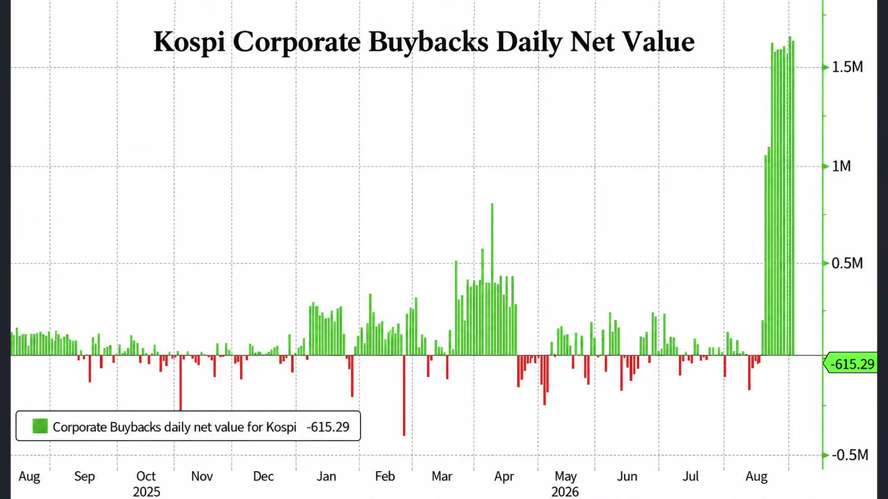

**逐字稿片段：** 在8月份是三星電子和SK 海力士的大規模庫存回購 它們是目前KOSPI的主要買盤 也就是現在韓國股市 之所以還沒有繼續下跌 不是散戶的信心已經全面歸來 是現在這些巨頭們正在 瘋狂的用庫藏股來勉強 減少在外流通股數來撐住股價 那高盛的估計是9月底到10月中旬左右 回購幅度就會正式結束 那我們就要看市場能不能繼續撐得住 因為韓國股市的確還是 有一點領頭羊的味道 我們細看 8月份Kospi的每日回購金額 哇你拿來跟過往來做對比 也沒有買過這麼多過 每天大概就買100萬到160萬股區間 規模明顯創下 這一段時間的新高 那這也代表企業回購現在 是韓國股市的增量買盤 讓你崩盤的主因 這個就是全球市場比較吊詭的現象 多空的互相交錯 好所以第一個是資金內部的輪動 仍然在做推敲 但是沒有迎來一個比較大的回檔 也很難有新的散戶進場 好那第二個階段看的是

**話題推測：** 三星電子和SK海力士大規模庫存回購

---

## 00:11:05

**逐字稿片段：** 可是現在是債券流動性的問題 至少還是壓抑住了股市 讓你股市漲得不太誇張 那這個問題何時能夠緩解呢 第一個從通脹角度來看

**話題推測：** 討論債券流動性問題

---

## 00:11:15

**逐字稿片段：** 當然要從中東事件來做推敲 因為美伊在霍爾木茲海峽的衝突 這一次又進一步升級了

**話題推測：** 探討中東美伊衝突升級

---

## 00:11:21

**逐字稿片段：** 伊朗革命衛隊在週末針對 兩艘美國的海軍軍艦發射飛彈 那美方表示航空母艦和飛彈 驅逐艦是成功的閃避攻擊 沒有任何的美軍傷亡 隨後呢美軍就展開立即的報復了 攻擊了3艘的伊朗油輪 其中兩艘是載有原油的油輪 分別在哈格島附近 另外一艘在阿曼灣 3艘船已經全面遭到癱瘓 那美軍現在也伊朗 也向伊朗來做警告 美方進一步摧毀伊朗的規模有限 所以呢如果呢 未來再有採取任何報復行動 美軍會採取更為強烈 的直接性的攻擊 那當然這就意味著整個美伊 雙方的衝突又再度 拉升我們過去跟投資朋友分享過 這美伊衝突 川普嘗試著有淡化的角度 至少從通膨層面呢 沒有意願引起進一步 大規模的軍事行動 基本上就是伊朗如果採取了行動 那我就有必要採取報復 那你不採取 那我們就僵持在這邊吧 現在就是 你不打我我就算了 因為我現在要顧中期選舉 忍無可忍就無需再忍了 對那句話怎麼講 忍一時心肌梗塞 退一步乳腺增生 所以現在呢

**話題推測：** 伊朗革命衛隊向美國軍艦發射飛彈

---

## 00:12:34

**逐字稿片段：** 美伊衝突再度升級之後 避險基金也開始重新加碼油價多頭 油價是這樣子哦 它從今年3月到6月當時的高點以後 基本上 後續即便美伊衝突仍然持續哦 它都破不了前高 那現在95塊左右就是一個新一輪前高 如果無法有效突破 那我們就看有沒有可能進入到 第二階段的平臺區來做盤整 那怎麼解決呢 等到明年如果還在90多塊 那原油年增幅也變0了 那就這樣算了 那這是唯一能夠解決的方式 要不然美伊 現在的供給缺口短期內也很難 無法有效的做沖銷 所以最好的方式 就是用時間換取一切 油價在過去一周漲幅 是有接近10%的

**話題推測：** 美伊衝突升級後油價多頭加碼

---

## 00:13:17

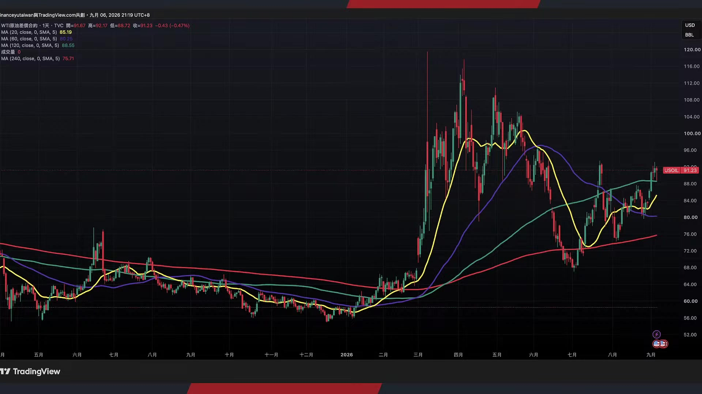

**逐字稿片段：** 真正比較麻煩的其實是柴油價格了 因為美國柴油平均零售價格 現在每加侖已經衝高到5 5.85美元了 好這不只是2022年烏俄戰爭後的高點了 也比前一年的3.7億美元暴增了58% 好所以雖然期貨價格 看起來是沒有創高了 可柴油價格還在以 非常驚人的速度拉升 那你要知道柴油支撐了 卡車工程機械農械發電機 還有接下來即將到來的冬季取暖 如果價格一路上升 它就會往下傳導到物流 建築農業和商品價格 川普當然在本季度已經正式 要求美國煉油廠立即提高產量 不過目前有許多的 煉油廠已經接近或者超過 原本設定的處理能力 所以額外的供給空間是有限的 所以現在最大風險當然不是沒有油了 現在就算有油哦 你都煉不出足夠的柴油 如果北半球收穫季 沒有得到足夠的柴油 然後冬季取暖旺季又逐步到來 哦那這波能源通膨可能 就會持續傳導下去 一樣它不會失控 可是會讓川普的中期 選舉過得相當困難 年增幅卻卡在這樣的一個區間 另外一個導致現在

**話題推測：** 美國柴油平均零售價格創2022年後新高

---

## 00:14:31

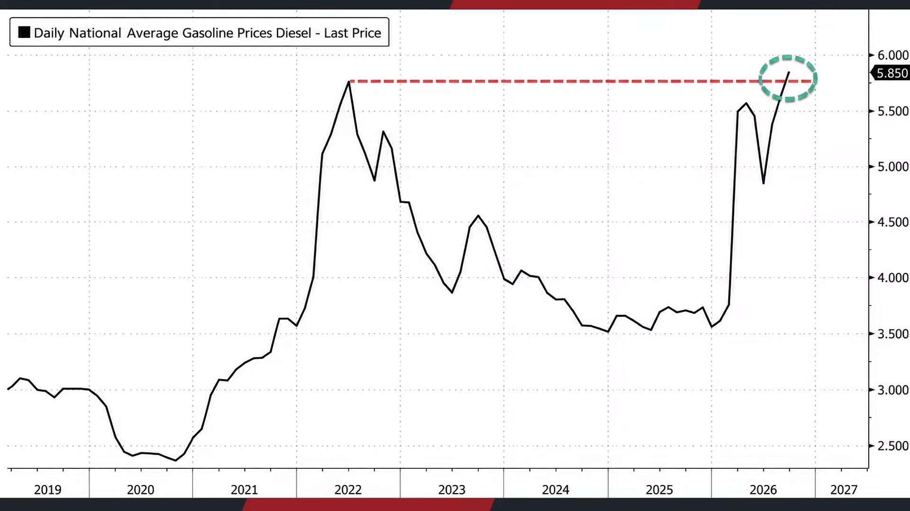

**逐字稿片段：** 利率預期升溫的新聞是 非農就業數據哦 這一波就真的有點意外了 因為8月份非農居然高達16.2萬人 原本市場預計估只有5.3萬人呢 這也強太多 難難道是畢業生一個月 全部都找到工作了嗎 也是今年3月份以來最強的單月增幅

**話題推測：** 最新8月份非農就業數據公布

---

## 00:14:50

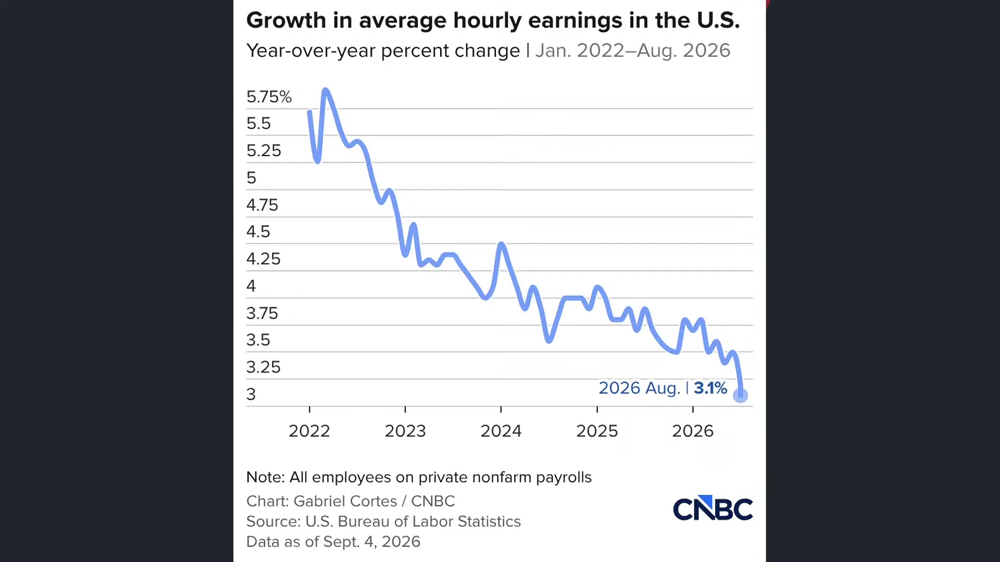

**逐字稿片段：** 失業率維持在4.1% 這符合市場預期 還比前一年低了0.2個百分點呢 勞動參與率甚至上升了0.2個百分點

**話題推測：** 美國失業率維持在4.1%

---

## 00:14:58

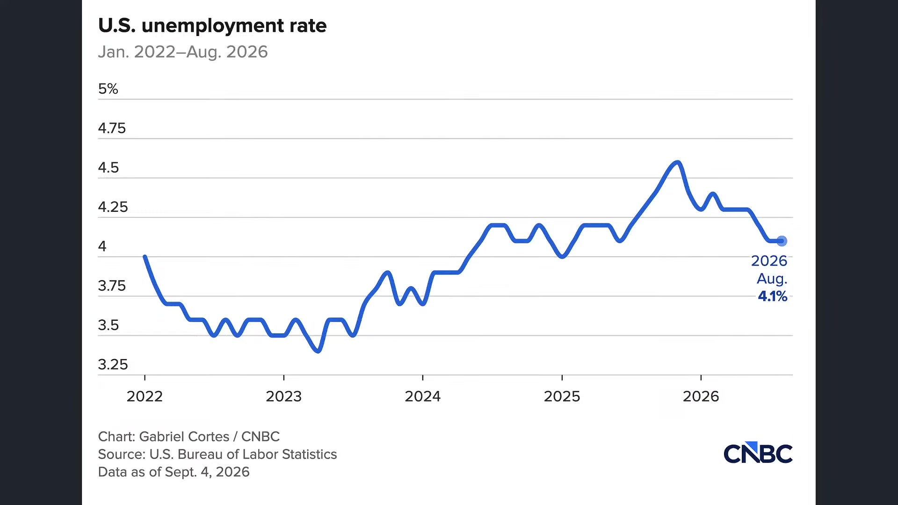

**逐字稿片段：** 家庭調查顯示的就業人口是56.9萬人 勞動力增加68萬人 哦這就說明了 這個現在的失業率或者非農 它不是由於高強度的 供給稀缺而造成的 那有時候市場大缺工嘛 少子化之類的 所以這些數據有時候會呈現得很漂亮 可是我們現在就是 明明有更多人參與 而且還真的有更多人找到工作哦

**話題推測：** 家庭調查顯示就業人口增加56.9萬人

---

## 00:15:22

**逐字稿片段：** 尤其你像是餐廳酒吧增長了5.9萬人 政府教育增長了4.2萬人 製造業增長了1.6萬人 所以總體來說 誒這個數據真的非常非常好 好到我有點不太相信 我真的有點擔心 過兩個月又要做校正回歸了 不過市場至少在高強度的通膨粘性 石油問題 再加上就業數據的高強度拉升以後 那最後只能反映在升息預期身上 其實美國就業我覺得 如果撇開這個月不看 其實還是屬於低招聘低離職的階段 所以他也沒有很慘 但就整個凍住了 因為雖然現在非農 就業數據增長了16萬人

**話題推測：** 各行業就業人口增長細項

---

## 00:16:03

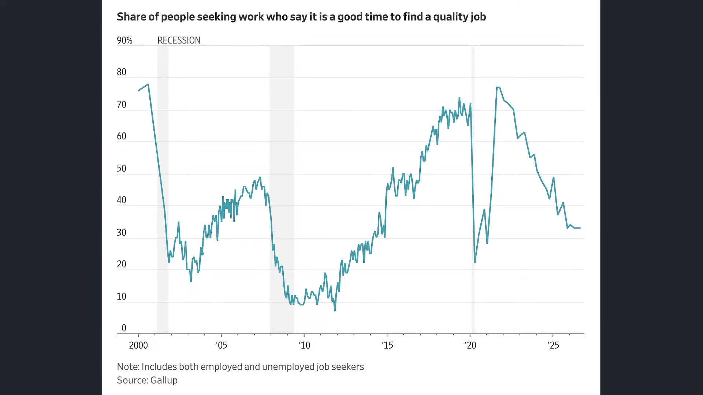

**逐字稿片段：** 可是如果我們細看 目前的招聘率和離職率 仍然處於相對低位 那這種工作抱緊緊的跡象 就說明著失業者和年輕人呢 現在是相對不利的 因為沒有人離開 那也沒有新位置要釋出 那如果真的有裁員 尤其在高科技業者 他裁員他當然還可以找到其他工作了 可是他也沒有明顯要 做更多招募的現象 那有很多的實習在本年度陸續取消了

**話題推測：** 美國招聘率和離職率處於低位

---

## 00:16:29

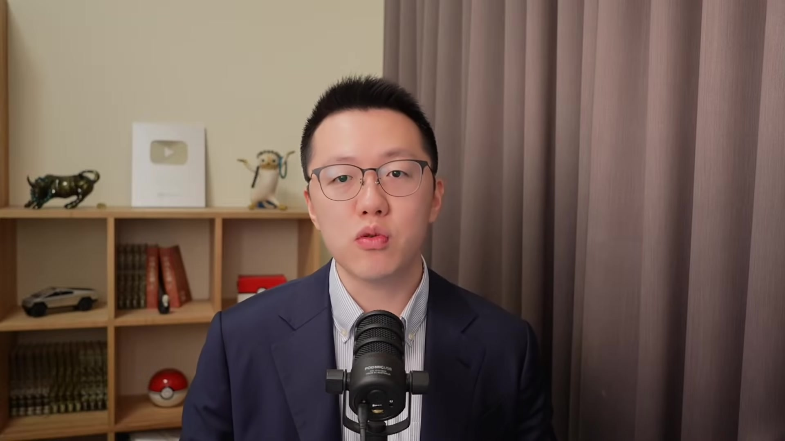

**逐字稿片段：** 這蓋洛普民調 現在呢 針對AI工具擴大職權 建立跨部門的關係 導致很多初級工作 不傾向招實習生 而更傾向讓AI能不能讓這些老員工 能夠順勢的取代一些粗糙的行政工作 所以這就使得畢業生的實習工作 或者說暑假的實習 工作遭遇極大的挑戰 我是前陣子才看到是 一一人力銀行的預估 這個z世代哦 不是z世代 對z世代 好像97年以後生的 在現在進入工作以後 大概兩年內也換了接近有3次工作哦 哦這這也不能完全說是 什麼爛草莓的問題 這很明顯就是這一代工作的習慣 一方面受到AI的衝擊影響 第二大方面呢 其實有非常明顯的支配自由時間 或者支配自己喜歡的工作的感覺 你只要不喜歡的就馬上閃了 而這就導致市場的這種部分 工作產生了一個新的角度 但至少可以看得出來 好現在就是 很多人不是看不見真相 他是自己對於真相的解讀 有時候自我感動 非農16萬你信嗎 我第一次對於數據有 抱持這麼不大的信任呢 今年以來最好 這 對於看多者來看 多頭就看到哇 經濟完全沒衰退呀 那AI還在爆發 我那數據非常非常好 那空頭呢 那就會看到的是利率預期上升 然後通膨也有粘稠度 所以每個人都從真相當中挑選 一個最符合自己部位的解讀 所以這種極端的數據 就變成你要做很利多的解讀 經濟大好 就業大增也ok 你要說利率上升幅度 會比想像中快非常多 因為就業實在好太多 也好像是對的投資 最危險的未必是判斷錯誤了 是有時候我們硬要找一個立場 那這種明顯超乎市場預期的數據 有時候我們就稍微停看聽一下 因為很多人呢 他不是看不見真相 他只是被自己對真相的解讀感動了 然後覺得自己永遠是對的 之前有一部戲劇 他講那男朋友陪女朋友去人工流產 那女朋友躺在床上 用虛弱的聲音說 親愛的 不是你的孩子 我絕對不要 男的在那邊講 該死 我又被她感動了 不知道在感動什麼 就很多人他不是看不見真相 他只是被自己對於真相的解讀給感動 那同一份數據 多頭看到的是經濟不會衰退 所以我們市場上一片大好 空頭看到的是利率要回升了 我看你怎麼玩下去哦 每個人都從真相當中 挑出最符合自己部位的部分 那投資最危險的 那就並不是判斷對還錯了 你有時候硬要找立場 那就不對了 那這份數據我覺得是 要稍微有點遲疑的 當然呢公債殖利率的上升那就是真的 非農數據會校正回歸 公債殖利率從來不用校正回歸 這一次最高曾經衝高到4.8 R2% 它會導致的效果和副作用那是真的 因為這是2023年以來的最高 背後又有通膨僵固 又有政府大量舉債和AI 企業資本支出擴張的影響

**話題推測：** 蓋洛普民調顯示AI對初級工作的影響

---

## 00:19:37

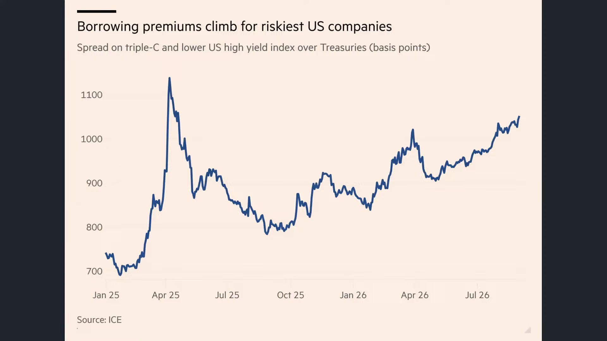

**逐字稿片段：** 現在信用評級 Triple c以下的企業相對於 美債必須支付的額外利差 好就是更高的風險溢酬 哇已經從一年前是8.08個百分點 現在擴大到10.53個百分點了 就是垃圾債了 平均是比美國公債還要 多付出10%的殖利率 好那實際這些企業的 融資成本可能高達15% 你要想想看哦 有美國有這麼多企業 它的融資成本一年要還15%的利息 好當然跟高利貸還有一段差距了 但是15%的利息耶 那他要怎麼還得起呢 零利率時代 疫情前呢 那個時候 包括20年到21年呢 利率很低嘛 所以真的有很多大量舉債的公司 原本都快喘不過氣了 那好不容易靠當時能夠混過去 因為利率又變便宜了嘛 借新債還舊債 那現在你要用低成本借新還 舊這套邏輯已經玩不下去 美國政府自己都玩不下去了

**話題推測：** 信用評級Triple C以下企業額外利差擴大

---

## 00:20:33

**逐字稿片段：** 所以今年的違約和困境 債務的重組金額會高達401億 比去年再度增加9% 那不代表說系統一定會出問題 因為他們的市場金額占比很大 應該講說市場占比 很小 金額是不小沒錯 可是由於科技股的估值更大了 所以就顯得他們的體量沒這麼大 可是他們還是包含著大量的這些企業 所以我們才講說 他未必會引爆系統性風險 但是高利率維持的越久 很多那些靠零利率年代 所建立的商業模式 都必須要重新接受到壓力測試 慢慢的倒光 好那當然 這是從企業端來看 那從個體端來看 這就代表著壓力會一路的傳導到房貸 到車貸到股市 到AI投資

**話題推測：** 今年違約和困境債務重組金額達401億

---

## 00:21:20

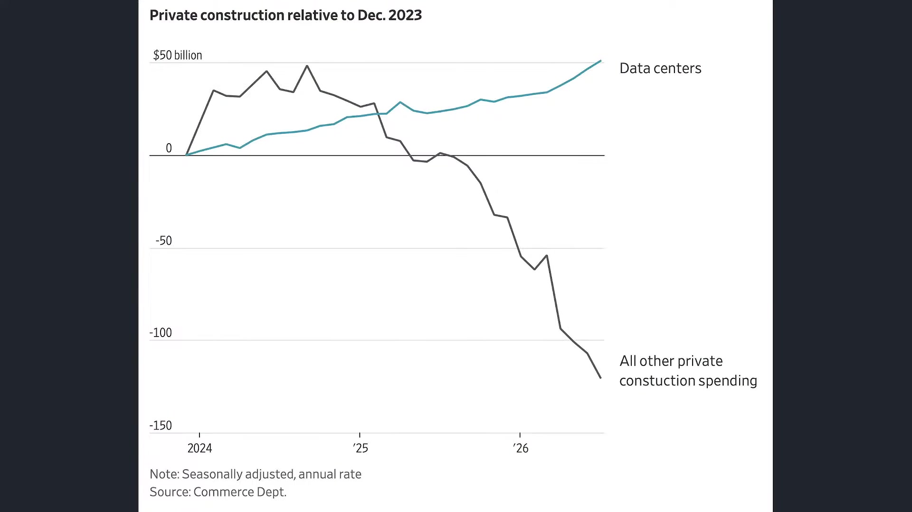

**逐字稿片段：** 因為這一次美國公債 遭受到拋售之後 我們看30年期的房貸利率 大概已經維持在6.66% 那如果10年期公債殖利率 你就這樣一路來到4.84.9 房貸利率可能就要重新重返7%了 那這對於美國內部的首購族 它的打擊壓力就很大了 高利率也會讓建商融資成本增加 租金更有上漲壓力 那汽車市場也是如此 尤其現在車貸也變變得更貴 那車貸市場已經表現差很久了 所以這件事情就導致了 基本上 市場上其實在對於實業者而言呢 臺灣不一樣 臺灣是中小型企業 因為利率很低還敢借嘛 美國現在就是只有做data center這些公司敢去借錢 那其他的呢 沒人想要借錢了 哦這就是現在比較吊詭跡象 那如果AI不繼續投了 那唯一的客戶就消失了 所以這是比較大的一個市場壓力 那當然了 過去一年市場上也會關注 那有沒有可能借由一些 財政部的一些扭轉發債來 嘗試著淡化現在公債的賣壓呢 至少先讓公債殖利率停止創高 可是我們過去也提過 現在美國政府干預債市哦 它的確引爆了比較大的反彈 之前是貝森特 擴大了長天期的美債回購 希望能夠支撐市場的流動性 支撐債券價格 進一步緩解 長天期殖利率上升帶來的融資壓力 但問題在於 美債殖利率走高 它並非單純的流動性問題 它背後還有政府的赤字過大 發債的供給增加 通脹的堅固性 還有市場要求更高的風險溢酬 那這些數據交錯在一起 三四十億那算什麼東西呢 才一點點 好所以它呈現的效果也 沒有想像中還要來的好哦 那最終呢 我們看到只能靠川普喊話了 好川普呢 在這一次就業數據公佈之後 他就開始呼籲連總會 做你該做的事情呢 這一次呢 他是要求說川普 這個花許 強調主席和理事 尤其是滑雪 你應該要愛國 那你不愛國 那我也只好用我的方式來説明你愛國 川普當然他的施壓 未必能夠讓在市放心 可是現在他的態度很明顯 如果在期中選舉之前 聯準會在就業偏強 能源價格又偏高的情況環境底下 如果你升息 就是把我的 政治生命達到為止了 那你至少要保持相對寬鬆格局 我也不求你真的要立即降息了 但是你千萬不要做我 不想看到的事情 不要升息 那這當然 華許真正要守的可能 不是川普想要的低利率 最後就變成那聯準會的可信度要如何 如果我不升息 如何說服市場 現在不升息是對的呢 唉這個就變成市場上關注的問題 其實我看那個華許大概 這個川普大概也冷華許冷很久了 還有剛才講到忍無可忍就無需再忍了 他已經冷一陣子了 那我自己欽點上來的人 搞搞的這樣子 唉我已都已經 特地把你捧到這個位置 然後你從頭到尾 從上任到現在 一次降息都沒過 你還釋放升息論調 所以川普現在大概也很火大好

**話題推測：** 30年期房貸利率維持在6.66%

---

## 00:24:29

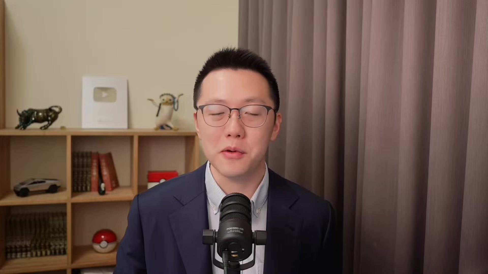

**逐字稿片段：** 我們看一下美國股市四大指數的表現 剛才講的就是抑制住 目前美國股市的理由 亮出的理由那也許 最好的解方並不是真 的借由科技股的創高 順勢把它往上拉 最好的方式也許是一場大跌 借由市場的量能激增 重新的引領下一次的多頭 要不然這種量縮格局 似乎短期內也解不開 道瓊指數是下跌271點 0.51% 收在53,414點 標普下跌29點 0.38% 收在7,718點 納斯達克指數下跌0.29% 77點 收在26,506點 不過我們提到費半反而上漲了383點 3.38%收在11,735點 那晶片股的大漲 看一下臺股是否能夠有效的來做拉升

**話題推測：** 美國股市四大指數的盤中表現

---

## 00:25:15

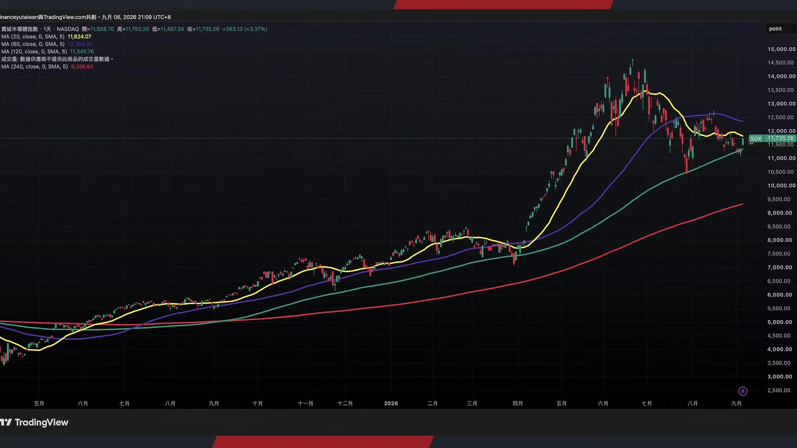

**逐字稿片段：** 因為我們都知道在上禮 在市場關注的幾隻財報影響變化 一個是我們看到博通 另外一個是Marvell 整體而言 其實SEMC雙雄的財報都非常漂亮 不過市場反而是更多擔憂估值和競爭 那看一下市場情緒稍微回暖之後 能否做有效的拉升

**話題推測：** 博通與Marvell的財報影響

---

## 00:25:34

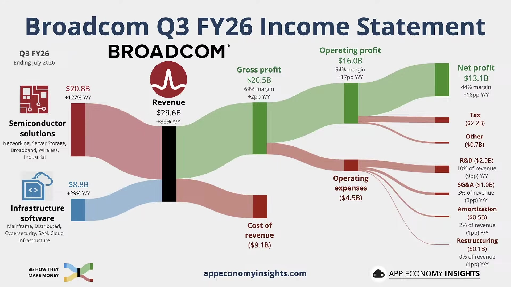

**逐字稿片段：** 另外一個就蘋果 蘋果我們知道在上周正式進入到 克納斯時代 那AI的新執行長 他是否能夠帶領著蘋果重新的做改革 因為蘋果真正的壓力哦 我們都很清楚 這幾年主要是AI的落後 人才流失 還有產品轉型的部分

**話題推測：** 蘋果進入新執行長時代與AI戰略

---

## 00:25:53

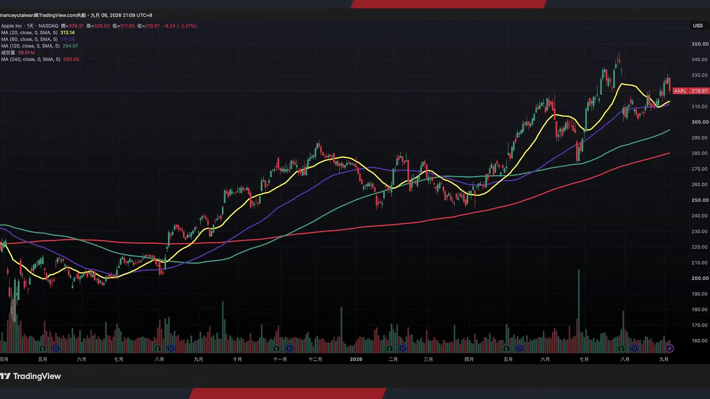

**逐字稿片段：** 好最後蘋果自研AI其實 進展不是很順利嘛 它是該採用Google的Gemini 作為新一代的Siri基礎 那雖然後續有跟Openai合作 但是我們也知道Openai又不斷的挖角他 所以雙方的關係也不是特別好 那好在是他的股價至少 還維持在相對高檔左右 真正值得大家關注的是現在 AI搶走了全球記憶體產能 所以第一波接下來

**話題推測：** 蘋果自研AI進展不順，採用Google Gemini

---

## 00:26:17

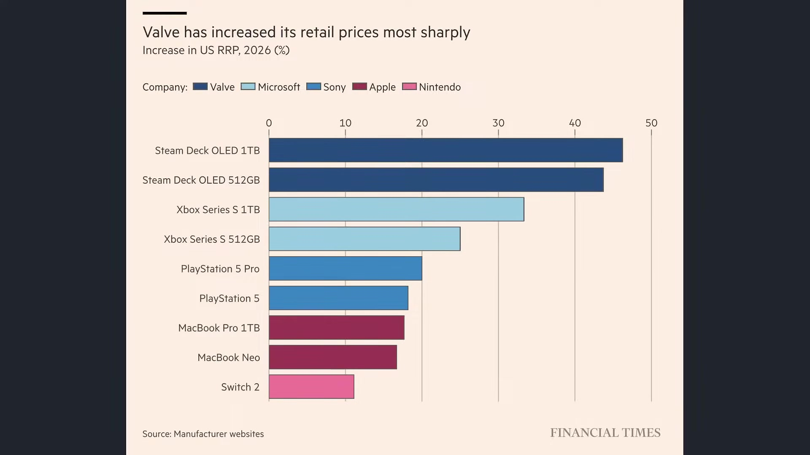

**逐字稿片段：** 兩天蘋果的發佈會就要開始了 蘋果到底最新所發佈的 手機會不會大漲價呢 我們如果細看 好現在美國消費性電子產品呢 基本上已經迎來新一輪的漲價潮 我們不管是看到相關的OLED 微軟的Xbox哦 我們整體漲幅都是三十帕四十帕的 那蘋果Macbook之前也漲了十七到十八帕 我很好奇這一次到底I18會 上漲上漲幅度會有多少 至少我們可以承認了 蘋果現在所面臨的都是短期問題哦 長期它已經有達到 一定程度的生態系了

**話題推測：** 蘋果發布會與新手機漲價預期

---

## 00:26:52

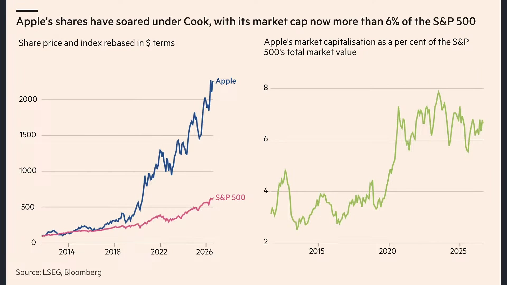

**逐字稿片段：** 當時庫克接掌蘋果的時候 市場上最大的質疑就是 真的有人可以取代賈伯斯嗎 的確沒有 可是至少從股東自己人的角度來看 是有機會能夠取代的 庫克任內蘋果股價是上漲超過2,000% 市值高達4兆美元 在標普500指數 最高權重曾經來到7%左右 好所以他是在股東的績效表現 是很明顯的繳出亮麗報酬 那可惜的事情是

**話題推測：** 庫克接掌蘋果後的股價表現

---

## 00:27:17

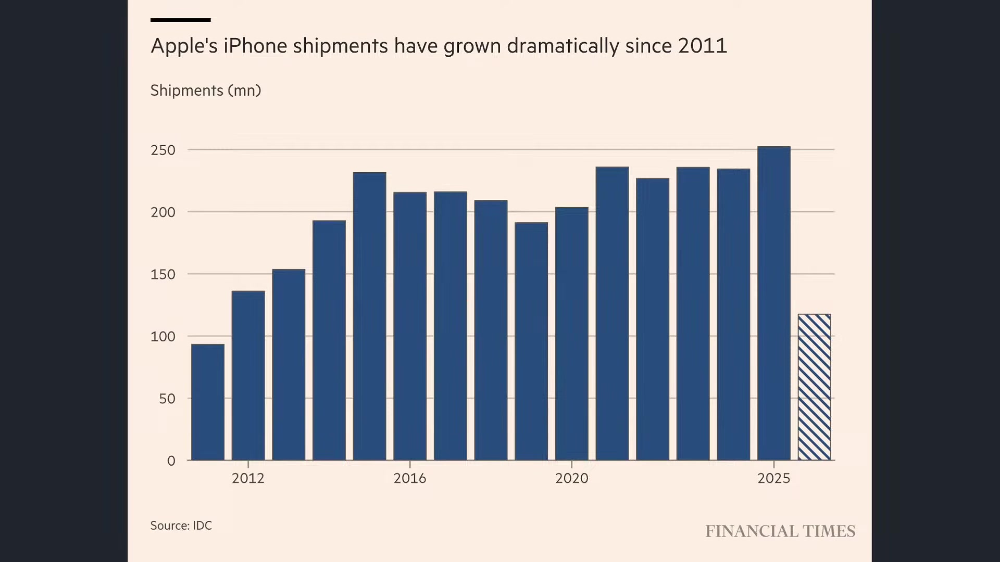

**逐字稿片段：** 蘋果大概是從20 1415年之後 整體蘋果的手機銷量 大概就維持沒有太大的一個變動 所以整體而言 現在唯一能夠做的就是 守住原本的付費用戶 高達15億左右的人口 那庫克另外一個被 低估的成績是毛利率了 因為蘋果這幾年壓榨 全球廠商是出了名的 之前2011年它的毛利率也不過40% 好現在已經接近到50% 代表每創造100美元的營收 就有50美元能夠留下來成為毛利 他也開拓了很多的新的硬體類別

**話題推測：** 蘋果手機銷量在2014-2015年後趨於穩定

---

## 00:27:51

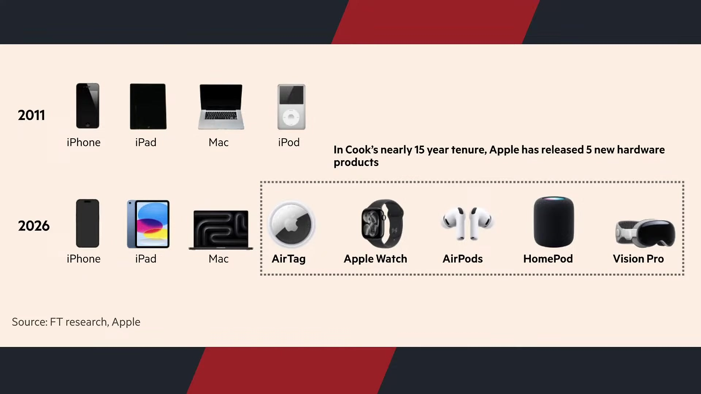

**逐字稿片段：** 從過去我們看到Airtag apple watch Airpods 還有Homepod vision Pro 這些一系列的推出以後誒 有的退場了 像Homepod就退場了 但是至少可以看得出來 他也儘量的打造 整輪的AI的生態系 那我們就看 這些產品能不能在接下來的 蘋果發佈會能夠有效的拉升 另外一個上禮拜值得 觀察的權值股是特斯拉 特斯拉是重跌了5.9%

**話題推測：** 蘋果開拓的Airtag、Apple Watch、AirPods、Vision Pro等硬體類別

---

## 00:28:18

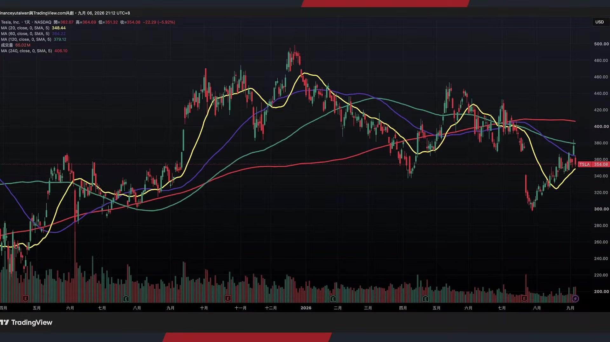

**逐字稿片段：** 好那特斯拉上禮拜是舉辦 那個Cyber truck的活動嘛 沒直播也沒有公佈任何的詳細資訊 所以股價我們也知道它 盤整很長一段時間了 最近它在奧斯丁再刻 但是監管和規模化 還是比較大的挑戰 原因來自於我們都很清楚知道

**話題推測：** 特斯拉舉辦CyberTruck活動但未公佈詳情

---

## 00:28:36

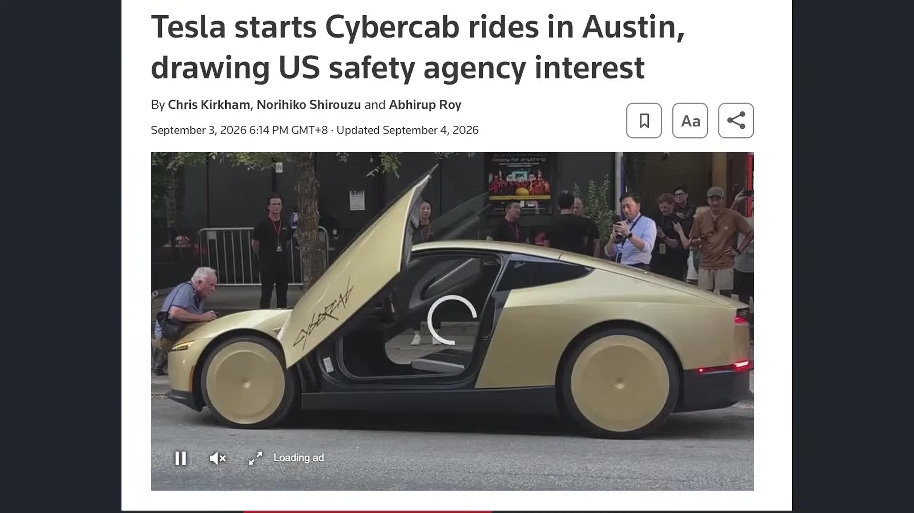

**逐字稿片段：** 威摩現在推廣的速度其實也不慢哦 威馬現現在已經把付費無人計程車的 服務已經擴展到丹佛聖地牙哥和坦帕 那在美國運營的城市就14座了 那特斯拉才一座 所以我們當然知道市場對於 特斯拉的期待度還是很高 可是問題是拓展速度比想像中慢太多 所以這就代表著Waymo其實已經示範了 自駕車是已經可以進入到 規模化的商業運營階段 至少在都市內 那特斯拉要做的事 能不能成功的顛覆一切 可是市場對它的評價很明顯 稍微是比較謹慎的 尤其它每一次這財報過後 那市場上的壓力通常比較大 不管怎麼說了 我們現在觀察的效果就是 市場上迎來一個新的 契機好 投資呢不只是追求數字 它是在考驗能否和 市場長久的共處下來

**話題推測：** Waymo無人計程車服務擴展至多個城市

---

## 00:29:29

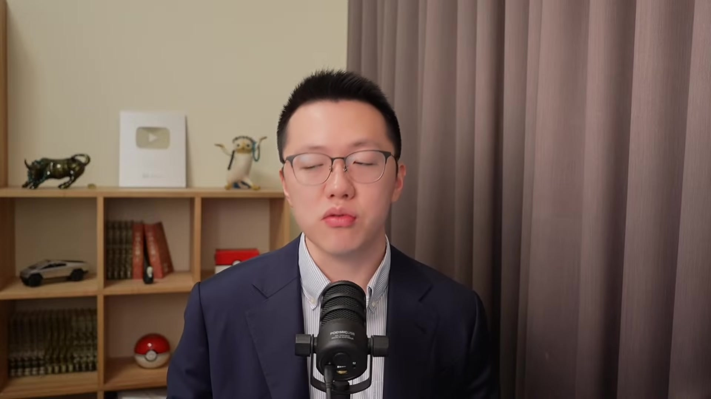

**逐字稿片段：** 誒台股上漲643點了 我們主要跟投資朋友分享是 你看到殖利率的壓制 你看到通膨的粘固性 你也看到市場上似乎fang有試圖 的想要帶領著費半來上攻 但是你要回顧初心 那你當時 投資的根本原因是什麼 如果是基本面 你最好就死死盯著它的基本面 直到做到突破 如果你是左側投資 那就記得現在只看有哪些 股票還在修正範圍之內 市場的轉折其實很難完全預測 但是你只要配置得宜其 即便行情突然轉彎 你也不至於被迫離場嘛 能夠留下來的人才是有 機會真正帶走報酬的 每一次我們都是睡完 公園以後就回套房了 就回希爾頓了 每次都是這樣子 沒有睡過怎麼回飯店呢 我前陣子我才看到一本書 是哪一本忘記了 它裡面就講一些投資的概念 那個return return裡面就藏著一個turn 你以為你在追逐報酬 但是行情反而隨時都會反轉 profit獲利裡面 profit裡面藏著一個fit 真正能夠長期獲利的投資 未必是漲最多的標的 是適合自己的 部位適合自己的 波動適合自己的 market裡面藏著一個mark 市場每天都會替你的範判斷來打分數 所以你要不要每天 緊跟著市場就很重要 believe相信 中間裡面藏著一個lie 藏著一個lie 就是信任 believe當中帶著一些謊言

**話題推測：** 台股盤中上漲643點的即時情況

---
