# yutinghaofinance_cOTLqoaHBxE — 關鍵畫面索引

- 來源逐字稿：[yutinghaofinance_cOTLqoaHBxE_GT.srt](yutinghaofinance_cOTLqoaHBxE_GT.srt)
- 影片：https://www.youtube.com/watch?v=cOTLqoaHBxE
- 截圖數：35

## 00:00:34

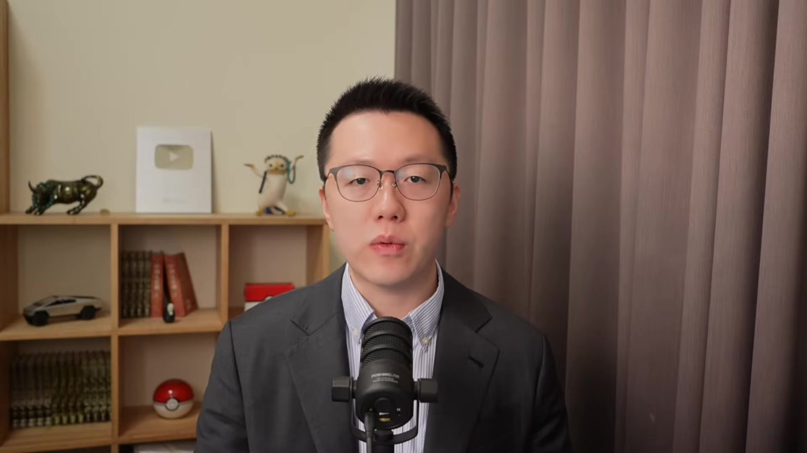

**逐字稿片段：** 時事變化 雖然美股股市三大指數在昨天是收黑 美國財政部公佈的長天期 公債回購規模不及市場預期 最後推升了美債殖利率那 那我們再過一天再來做仔細的推導 其實這一次本來就是扭轉操作 它也不能說是直接性的寬鬆 但是呢本身在回購的規模當中 其實意味著 財政部對於當前 公債殖利率的擔憂程度 如果回購規模的幅度不夠大 這說明著財政部還勉強 可以接受當前的利率水準 那我們後續再來做進一步觀察 因為財政部禮拜三是宣佈 下一次長天期公債規模會增加到60億 也就是目前規模的3倍 也是繼上個月宣佈至少 回購規模提高一倍之後 再度的擴大操作 那後續再來看一下實質財政部的效果 但是在短期內 大家看的肯定是對於臺灣市場而言 到底本輪的3C消費電子性產品是否 能夠在下半年能夠推出新一波的旺季 也就是2026年蘋果的秋季發佈會 這是大家最為關注的 當然就是 這次的折疊機iphone duo 全場主角

**話題推測：** 美股三大指數表現

---

## 00:01:41

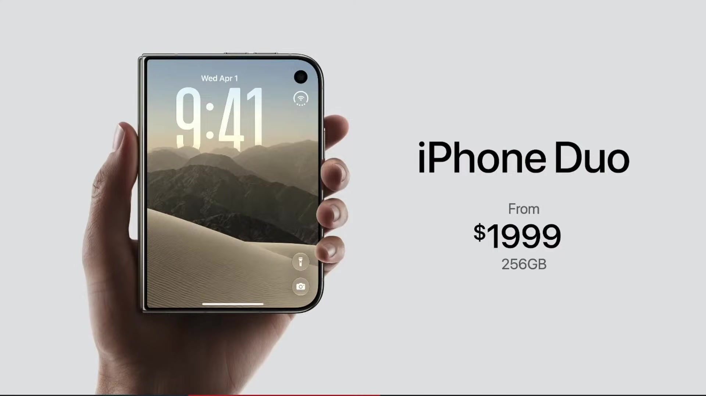

**逐字稿片段：** 那當然最大的變化是8Pro Pro Max哦 還是有一些更新 但是大家很關注的就是第一款 的折疊手機已經正式出來了 那是蘋果的折疊手機蘋果手 折疊手機已經很多年了其實 那是蘋果第一台 展開是7.6寸 外螢幕是5.4寸 搭載A20Pro雙電池 鈦金屬的機身 而且也針對折疊機的 螢幕重新設計ios17 臺灣售價其實蠻貴的哦 這個比單純匯率 你看它只是設定1999 這代表 如果它是換算臺灣匯率 它是用3637哦 好所以臺灣是賣的特別貴 兩tb要11萬8 哦所以值得注意的事情是 這一波80分鐘的發表會 光是duo大概就占掉了30分鐘 代表著蘋果是非常 重視這一次的折疊機 不是把單純把它當成 一個實驗性的產品那當然 這個手機最大的特色 10月份要上市 就是折起來 看起來像小手機 但打開來就像是大螢幕 完全展開之後的厚度大概是5.2毫米 比上一代的iphone air 5.64毫米來的更薄 其實air其實已經很薄了 air其實在美國市場 我記得是非常受歡迎的 相於亞洲市場 為什麼呢 因為亞洲人 有時候是因為我們通勤嘛 可能要搭公車 搭捷運 那手機帶一整天 那個特別薄就代表電量沒有那麼長 那有時候要帶個行動電源很麻煩 可是很多美國人呢他上班 尤其在各州 很多是郊區上班 那就是你上車你就 插上你的插頭 那你下班你也插上你的插頭 那你到公司你也是插上插頭 所以它沒有那麼立即 需要長電量的一個保持 所以iphone air是非常歡迎的 尤其它又非常的薄 那這一次的iphone duo 它的薄度是比iphone air還要來得更薄哦

**話題推測：** iPhone 8 Pro/Pro Max更新

---

## 00:03:27

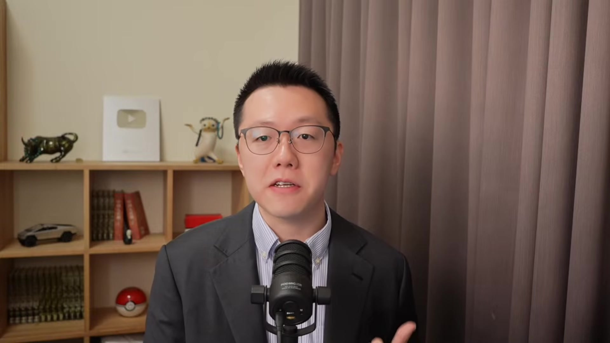

**逐字稿片段：** 折起來的厚度大概是11.3毫米 這是17年來 我們看到折起來是最厚的 可是打開來是最薄的一個iphone 那規格當然主要集中在生物 辨識相機系統的一個改革 像duo是取消了face ID 改用其他的解鎖方式 當然蘋果保留的功能比 外界原本預期的還要來的多 包括Magsafe 相機的控制鍵 或者apple pencil 這一系列的把它整合到折疊機當中 那我們要主要觀察的幾大方向 就是來自於到底這 一輪有沒有科技通膨 好答案是有的 可是整體漲幅並沒有像之 前什麼Macbook這麼誇張

**話題推測：** 折疊後厚度資訊

---

## 00:04:03

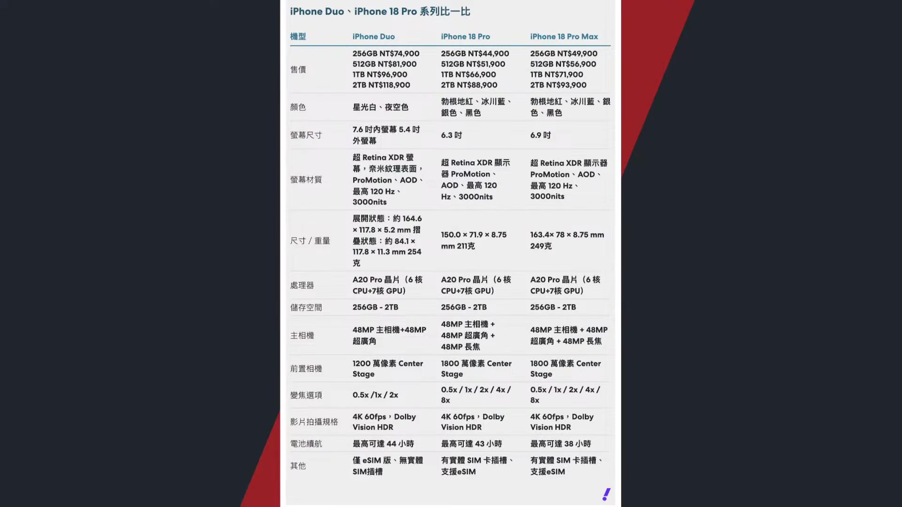

**逐字稿片段：** 這一次是8Pro是44,900塊起 Pro Max是49,900塊起 兩款最高都有兩tb 再往上直接到就74,900的iphone do 那換句話說 蘋果這一次的秋季旗艦產品呢 大概是切成三級 一個叫Pro 一個是Pro Max再來就duo 那已經沒有基本款了 那高階市場的價格天花板 大概也推到了10萬塊以上 那顏色的部分也新增了 有黑色有銀色有冰川藍 還有阿罵羽絨外套紅 這個叫勃根地 勃根地紅色 那增加了顏色以後 有沒有吸引適度的買盤呢 至少對於台廠而言呢 有了新的商機就有新的市場預期 因為18 Pro和Pro Max 搭載的是A20 Pro

**話題推測：** iPhone 8 Pro價格

---

## 00:04:49

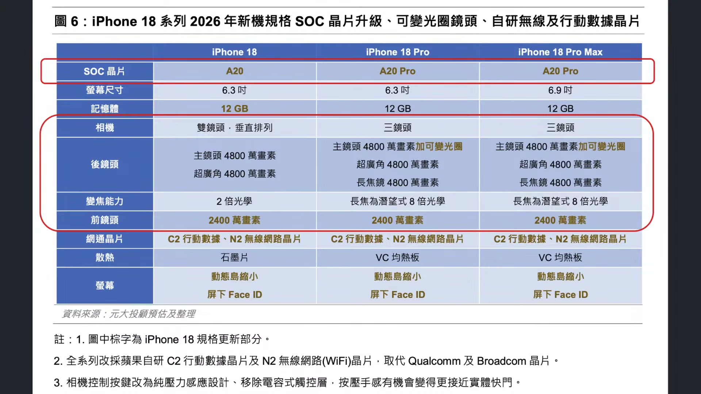

**逐字稿片段：** 它是採用台積電兩納米制程 強化AI運算和長時間的效能 那相機也是第一次導入可變光圈 4,800萬畫素 主鏡頭可以依賴環 境來改變它的光亮 那軟體是導入新一代的apple intelligence 新版的Siri 還有空間的重新構圖 反正我覺得這一次 主要是產品硬體的推出 並不是單純集中在 我們看到在Siri或者apple intelligence的進化 那如果是從價格來看 當然是有漲價 兩款的Pro售價大概都比前

**話題推測：** 台積電2奈米製程與供應鏈

---

## 00:05:21

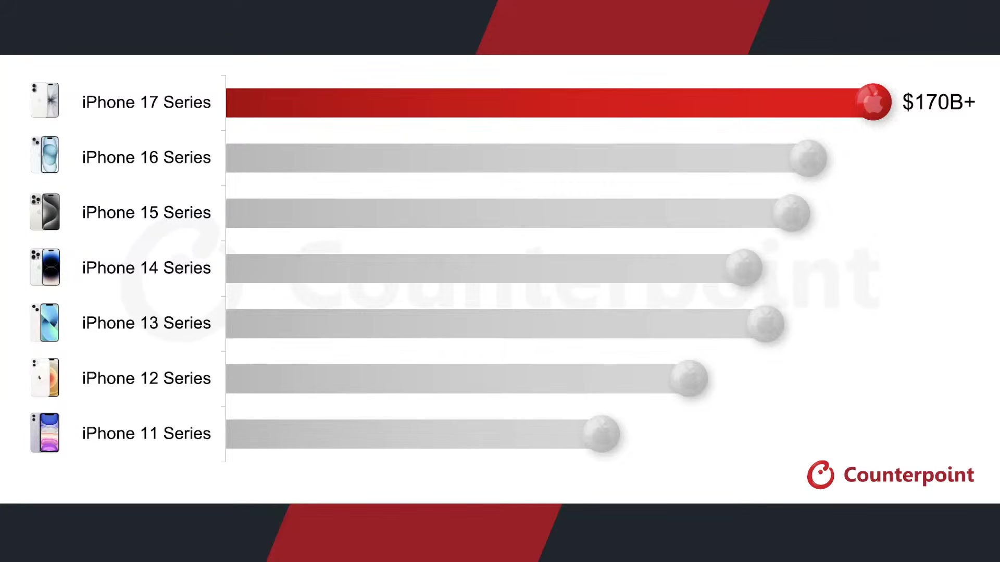

**逐字稿片段：** 一代上漲了接近有100美元 但是這個上漲幅度 跟臺灣比較起來已經算低了 臺灣是很神奇 那個匯率幾乎是以3637來做計算 那另外一方面 即便上漲了100塊 相對於其他像是小米等陸系品牌 上漲幅度比較起來不算特別離譜哦 為什麼因為小米在記憶體的衝擊底下 它的成本已經壓得很低了 在過往利潤已經壓得很小了 那記憶體價格的上漲 被迫要轉價

**話題推測：** Pro系列價格上漲幅度

---

## 00:05:49

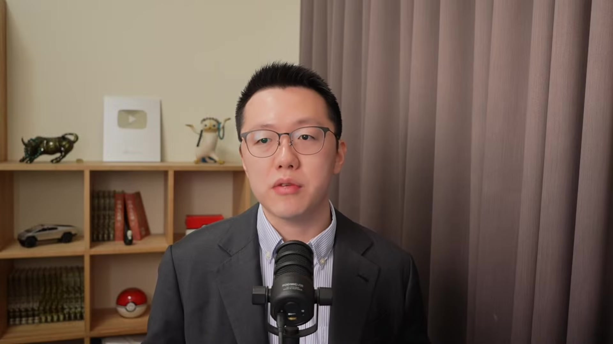

**逐字稿片段：** 蘋果哎毛利率也是有五十％左右 它當然可以犧牲一點點毛利率 來換取在價格上的競爭力 我們先稍微看一下到底用起來如何了 iphone x用起來是不好像 任何iphone你曾經體驗過的 它是完全新的 而在同時 它是非常熟悉的 手指頭不夠長的 好像握不住 絲滑感很不錯 我感覺很適合放在公園 涼亭一邊乘涼一邊看書對不對 我自己是比較擔心 擔心什麼 不是說那個價格問題 那本來新款的螢幕那麼大 稍微賣貴一點也ok 我本身因為手指頭比較短 展開之後那個機身就更寬更重了嘛 我怕那個單手的握持的難度 應該會比傳統的iphone高 以前那個基本款換大台的Pro Max 我都覺得手指頭有點難碰到了 尤其因為我平時喜歡 那個邊走邊滑手機的 這不好的習慣 一般手機至少可以靠手機 殼去增加一些摩擦力嘛 摔下去也有一層保證了 好像折疊機哎 你看那個轉軸和雙螢幕結構 我很好奇那個手機殼要怎麼套 乾脆要裸機使用了 哦那一台2,000塊美金 那飛出去那怎麼辦 對人家這樣講 蘋果壞掉會變成什麼 鳳梨嘛 因為pineapple 沒事 這這你才瞭解 這個iphone duo我覺得最 麻煩的地方是什麼 其價格一定有人可以接受 果粉都這樣子 每天都在嫌 那有新產品肯定是要用看看的 如果它是內外都有螢幕的折疊設計哦 傳統手機你就很難像 一般那個iphone一樣 你正面背面你就全部包起來嘛 那外側螢幕本身就是操作介面的話 轉軸你又必須保持活動 所以我不確定 現在有沒有推出相關的周邊產品呢 嘗試著把它套起來 好所以蠻好奇的 這東西一次摔壞要多少錢 要怎麼修 對pineapple 那一一個人什麼時候最壞 少年pi 頭殼壞掉變什麼 頭殼pi 小叮噹 壞掉會變什麼 美叮噹 沒事 所以我覺得這一次哦 在蘋果創造一個新的 換機潮的過程當中 我們大概會從四個 重點的角度來做細分 第一個就蘋果正在用 高階化來對抗成本通膨 就是我當然知道機體價格上漲 那一定會犧牲到我的毛利率 那如果我開創一個新產品呢 價格定到非常高 如果又能夠成功的引起換機潮 我就可以保持住我目前的毛利率哦 iPhone do的售價天花板 是從74,900塊到118,900塊台幣 那Pro系列也是勉強漲價那 重點未必是每年要賣更多手機了 因為手機 其實已經這幾年進入到存量市場了 靠更高的單價來維持營收和毛利 這也意味著iphone的出貨的 重要性真的很重要嗎 產品組合和平均售價 的重要性正在上升呢 以前靠的是賣幾台iphone基本款 現在看的是 iphone的Max iPhone Pro Max 是不是賣得更好 你在買iphone的過程 是不是順便買了一個Airpods 這才是更重要的 那第二大方面是 機體的漲價的確已經從半導體 股市變成了消費性電子通膨 如果連蘋果都開始提高新機甚 之前的舊機價格都開始上漲 那後續 往下游端來陸續做傳導 肯定是遲早的事情了 最重要的是對於台積電而言 兩納米已經正式進入到 大規模的旗艦產品了 那臺灣的供應鏈更是最為直接的訊號 所以AI到底能不能創造新的換機潮 我個人 保持的是一個比較保守的態度了 原因很簡單 因為iphone賣太好了 在17的時候

**話題推測：** 蘋果毛利率數據

---

## 00:09:46

**逐字稿片段：** iphone17賣得這麼好 其實就某種程度 意味著大家已經意識到 I18的漲價幅度會比想像中來的貴 所以上半年其實I17銷售不錯哦 你要知道今年預估 手機市場是銷售很差的結果I17 算是繳出了歷代最強的首年成績 我們按照Counterpoint的預估 上市第一年的全球批發 營收來到1,700億美元 比I16大概成長了11% 好這是在全球市場 手機市場收縮的過程當中 算是另類呀 蘋果居然還可以賣得這麼好 如果從純銷量來看 2026年上半年全球最暢銷的智慧型手機 前三名都是由蘋果來包辦 分別是iphone17 iphone17Pro和iphone17Pro Max哦 在區域市場當中 中國也是最大的成長來源 iphone17的營收相對於 前一代成長了35% 好所以中國人也非常喜歡使用iphone 所以的確我們知道 蘋果在後疫情時代對於AI的 投入稍微有一點延後 尤其它的資本支出比例也不是特別高 如果我們是從R&D費用來做觀察 在過去兩年之間 你看亞馬遜 好大概R&D費用就拿去做研發的 占總毛利大概有30%都去做研發了 Google是25% Meta之前投元宇宙投特別多 34% 博通27% 愛思摩爾30% 特斯拉26% 蘋果呢 蘋果其實差不多就17%左右 比例並沒有想像中還要來的多 那更重要的事情是 科技通膨 這一次已經侵擾到蘋果 那能不能借由高單價 來成功的銷售出去 是值得大家觀察的重點 因為其實下半年

**話題推測：** iPhone 17銷售數據

---

## 00:11:20

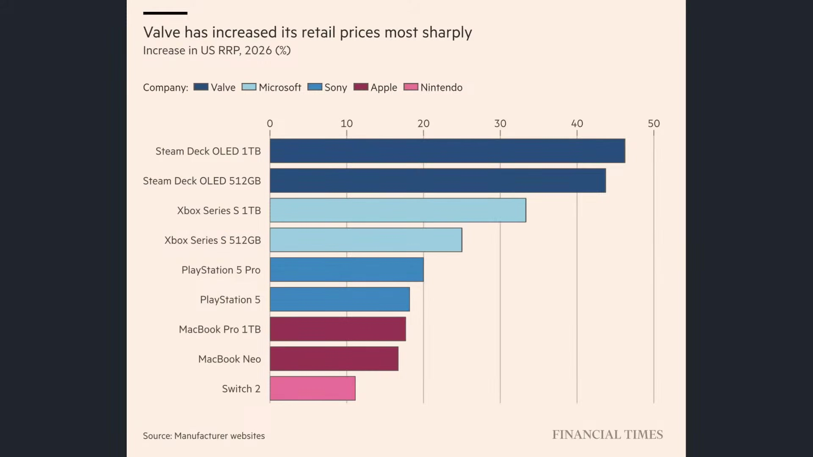

**逐字稿片段：** 漲幅高於蘋果的一堆了 我們看幾個 你像Steam 那個deck L O L E D 1TB哦 大概漲幅是45%哦 微軟的Xbox 1TB也大概漲 了32%在下半年 其他像是PlayStation 5 Pro大概漲了20%哦 那我最喜歡的動物森友會switch two 它也漲了11% 所以今年我們知道MacBook Pro MacBook air 大概漲幅都是15-18%哦 那iphone這一次也有漲價 但漲價幅度相對於多數 電子產品並沒有想像中這麼驚人 它主要是靠創造一個新的賽道 一個新的產品 直接把新的 單位售價給顯著調高 好但這也說明著 iphone都起了這個頭 應該沒有廠商在今年是不調漲價格的

**話題推測：** 其他電子產品漲幅比較

---

## 00:12:05

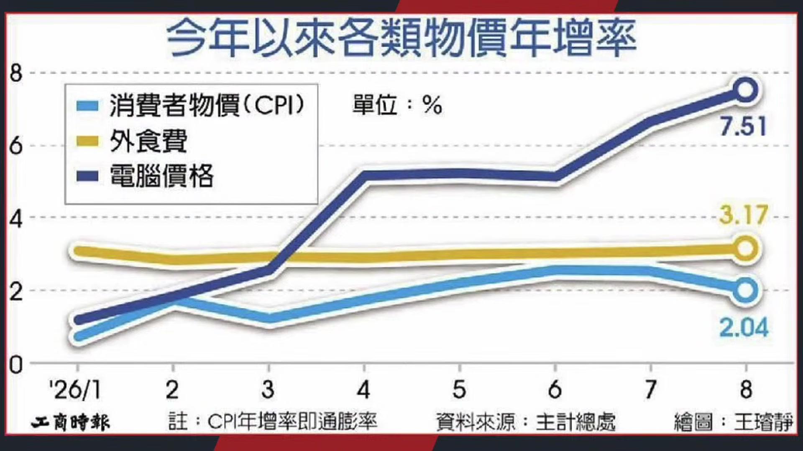

**逐字稿片段：** 今年以來各類的物價年增幅 在臺灣市場當中 外食費是3.17% 在8月份 消費者物價指數是2.04% 好那你看一下電腦價格是漲多少 7.5% 這什麼概念呢 因為我們知道通膨會有體感問題嘛 你覺得外食費怎麼可能只漲3% 漲3成吧 那我告訴你 那電腦就是漲7成 如果是從比例來做觀察是這樣 你覺得物價是漲兩成 那麼電腦價格就是漲了75% 如果你覺得電腦價格你買的沒有上漲 那很明顯 就是你的規格一定會因此而下滑 因為按照目前的電腦零元件PPI 生產者物價指數

**話題推測：** 台灣物價年增幅數據

---

## 00:12:44

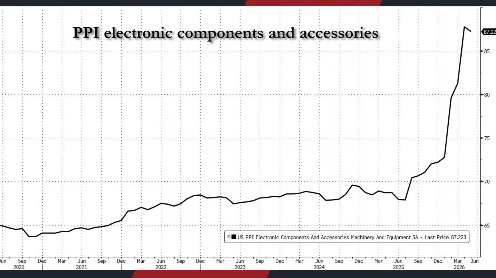

**逐字稿片段：** 在今年7月份已經來到年增幅87%了 也就是目前生產者所面臨的 物價成本是遠遠高於消費者的 持續往下傳導當中 所以從這樣的一個角度來看 折疊機如果能夠進入一個爆發期 就可以幫助蘋果能夠 沖銷本輪的記憶體通膨

**話題推測：** 電腦零元件PPI年增幅

---

## 00:13:02

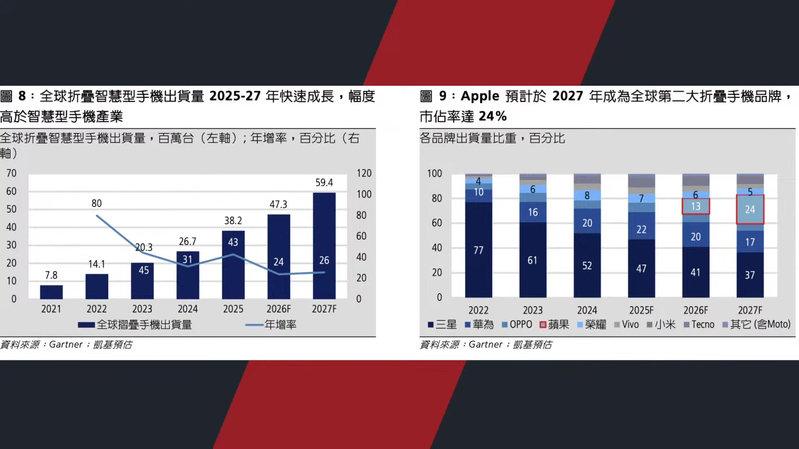

**逐字稿片段：** 全球出貨量目前在折疊機市場 從24年大概是2,670萬隻 25年是3,800萬隻 今年大概是4,700萬隻 明年大概5,900萬 換算整個25年來看 今年大概成長了43% 那蘋果是因為它算是市場上的定錨 所以它一推出以後 當然會引得市場上 加快的去使用折疊機 對於折疊機市場的接受 意願程度也越來越高 那當然從這樣的一個角度來說 今年我們如果細看 折疊機其實蠻多的哦

**話題推測：** 全球折疊機出貨量預估

---

## 00:13:33

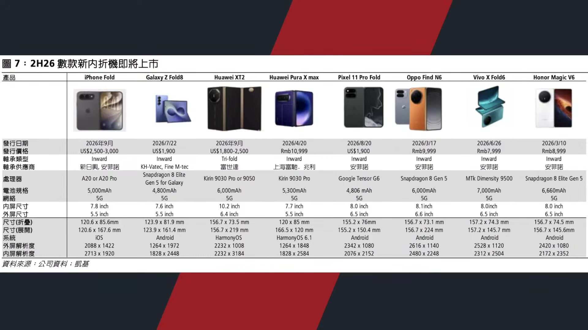

**逐字稿片段：** 三星華為Google OPPO vivo 榮耀都有新機發佈 最大變數 這一次因為iphone 9月份推出以後 售價現在是2,000塊美元左右嘛 比市場預估的2,500-3,000還要來得低哦 那會不會對於其他的 這個折疊機市場產生重大衝擊 這個值得特別留意 這代表著蘋果的折疊機 並沒有想像中貴的離譜 它是在臺灣賣的特別離譜 這個後續我們再來做仔細觀察 但是對於其他手機而言 肯定會引起進一波的衝擊 那這也說明著未來毛利率是否會 因為記憶體價格上漲一定下滑 我認為就不一定了 我們看從整個2023年 這個蘋果服務 因為營收不斷的擴大 其實毛利率和獲利 比重就在持續的往上推 那這一波如果能夠借 由新產品來做推出 毛利率不一定會因此而大幅往下掉 好這是我個人的看法 當然 這就代表著折疊機市場正式打開以後

**話題推測：** 其他品牌折疊新機發佈

---

## 00:14:30

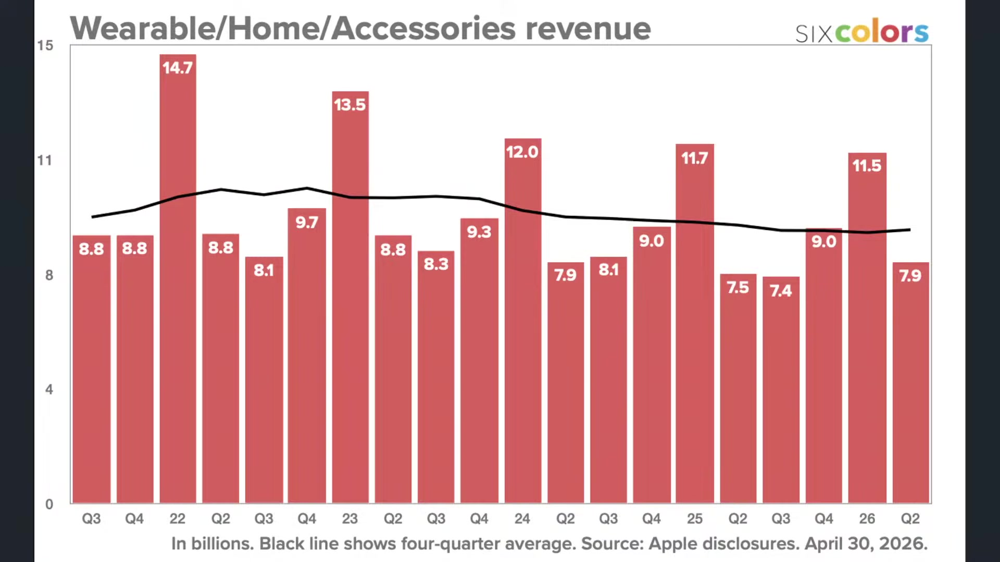

**逐字稿片段：** 三星華為 也開始陸續去搶攻高階市場 好三星預估了會推出新一代的galaxy z Flip at那售價是1,199美元 那搭載的是高通的第五代的處理器哦 其他華為的部分

**話題推測：** 三星推出新一代Galaxy Z Flip

---

## 00:14:47

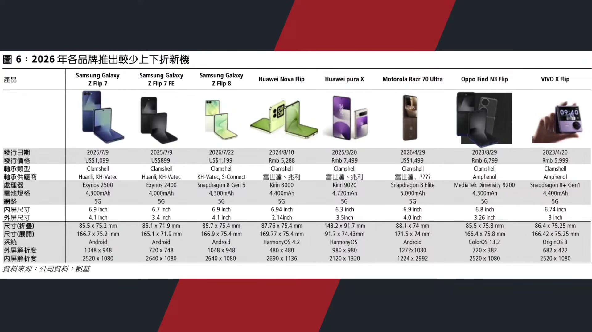

**逐字稿片段：** 我記得是最近才剛推出新機吧 它也是折疊機 也是左右都可以折疊 而且重點是華為的折疊機 它的厚度也壓到了大概是3.5毫米左右 而且還找劉德華來代言 電池拉到6,000毫安培時 好那這一次XT two最大的看點就是 因為之前那個華為那個皺褶嘛 那三折機感覺就很厚太重嘛 他就盡可能的往前推 完全展開之後 螢幕大概是10.2寸 單側機身的厚度壓到3.5毫米 那改變了它的一個轉軸的結構 使用高強度的微晶鋼 不過這個 背面哦那感覺就真的很像作者 我們看一下他們的解說 螢幕太大了不防窺 左右的人會偷看 我們可以這樣 左邊有人這樣 右邊也有人 我們可以這樣 防窺屏加物理物理擋板防窺 左右都從容 左右開合是吧 我我們當然還可以更誇張的這樣 還可以這樣是吧 這樣左右都看不見 只有自己能看 哎呦我的媽哈哈哈 螢幕太大了不妨 這個解說感覺跟蘋果 的風格不太一樣 好但至少可以看到 華為在中國手機市場 曾經一度被迫退出 不過現在

**話題推測：** 華為新機發佈與折疊機特色

---

## 00:16:04

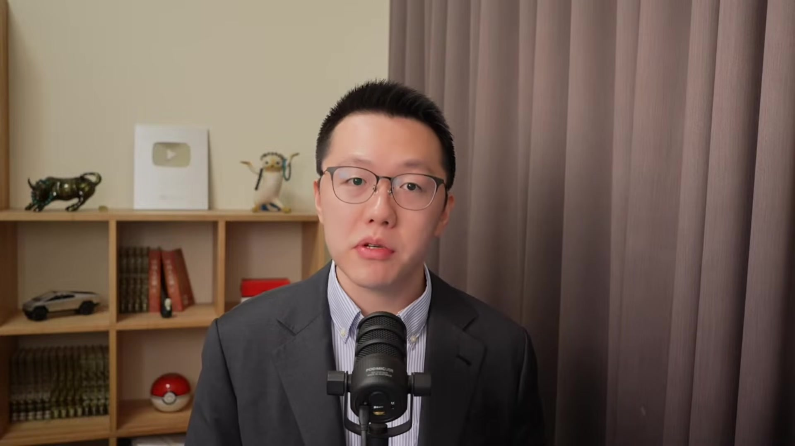

**逐字稿片段：** 已經重返第一了哦 整個26年第二季的中國 智慧型手機市場 年減幅大概是一% 表現並不是特別好 那很多廠商品牌商為了 要應應記憶體的漲價 它提高了庫存 按照Counterpoint的預估哦 華為的市占率25年大概是18% 現在已經重新回到23%了 重新回到中國市場第一 你要知道 它之前是被制裁的多慘 曾經一度退出 中國的手機市場 因為沒有新機發表 現在又重新歸來 那其他手機我們看到

**話題推測：** 華為重返中國手機市場第一

---

## 00:16:36

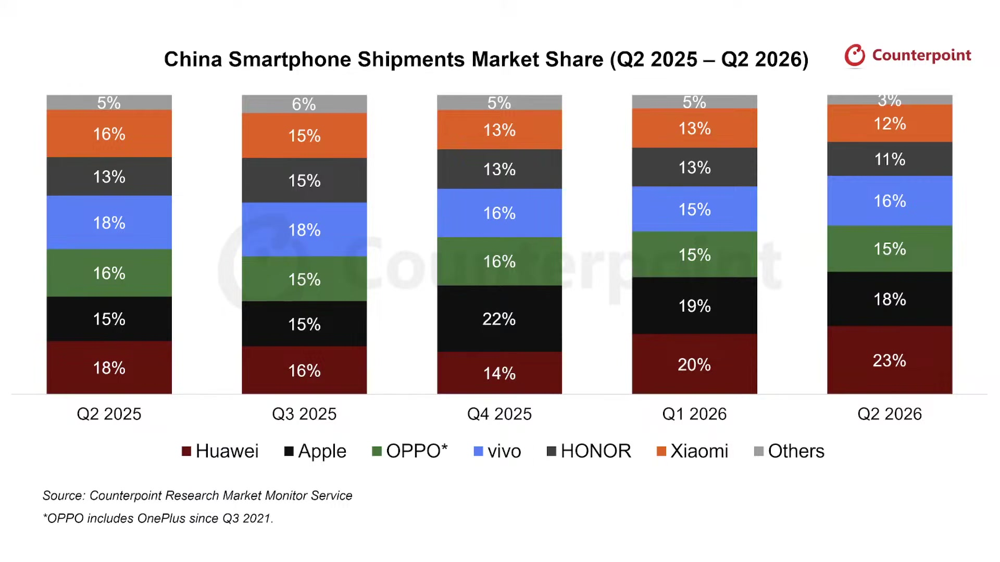

**逐字稿片段：** 蘋果還是以18%在中國市場占第二 出貨年增幅有23% 它是成長最快的哦 相對之下 OPPO大概15 vivo16榮耀11小米12 其中小米出貨量 年減是21% 跌幅最大為什麼 因為小米 本身它的利潤率 相對而言是壓得特別低的 所以第一提漲價 它沒辦法 它必須全面性的往下轉 那價格優勢就瞬間消失了 好當然這也說明著 折疊手機至少在今年 已經正式迎來拐點了 並不是因為技術多成熟了 因為蘋果進場了 蘋果進場那它就算是一個市場了 對於果粉來說是如此 因為2026年全球折疊性手機

**話題推測：** 蘋果在中國市場市佔率與成長

---

## 00:17:14

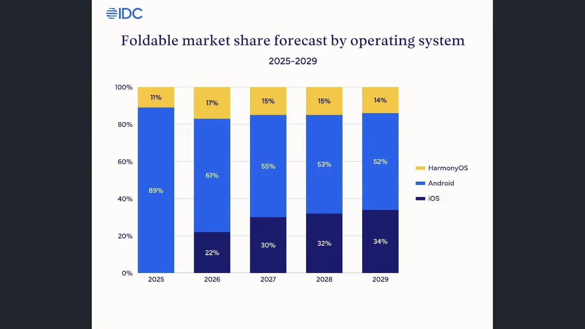

**逐字稿片段：** 預估年增幅大概30% 相對於其他市場 它真的就是鮮明比較 我們預估今年手機市場是要衰退的哦 那折疊機市場成長 那就說明的非折疊機正在衰退嘛 其實今年我們看到全球 手機最大的壞消息 就是整體消費需求正在快速收縮 如果細看實體總銷售量

**話題推測：** 2026年全球折疊手機年增幅預估

---

## 00:17:34

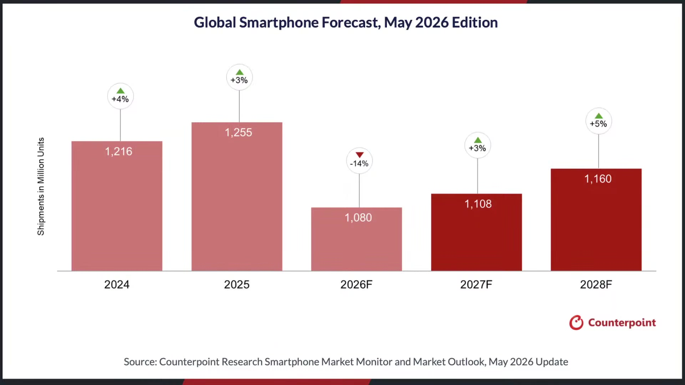

**逐字稿片段：** 大概在2025年預估是12.5億隻 24年是12.1億隻今年呢 今年最樂觀 按照Counterpoint的預估哦 大概就10.8億隻 重度衰退14% 好所以從這樣的一個數據來做觀察 今年手機一定是賣不好的 所以大家搶的是什麼 搶的是存量市場 那iphone其實表現不錯 我們講I17其實賣的特別好 那再加上今年出貨量 可能減幅大概就1到2% 那只要它衰退的幅度比其他 市場衰退幅度還要來得小 總體而言 大家是衰退一成2嘛平均 那蘋果只衰退一成 衰退一成 或者只衰退一% 2% 其實都算是比市場預期還要來得好

**話題推測：** 全球手機總銷售量預估

---

## 00:18:14

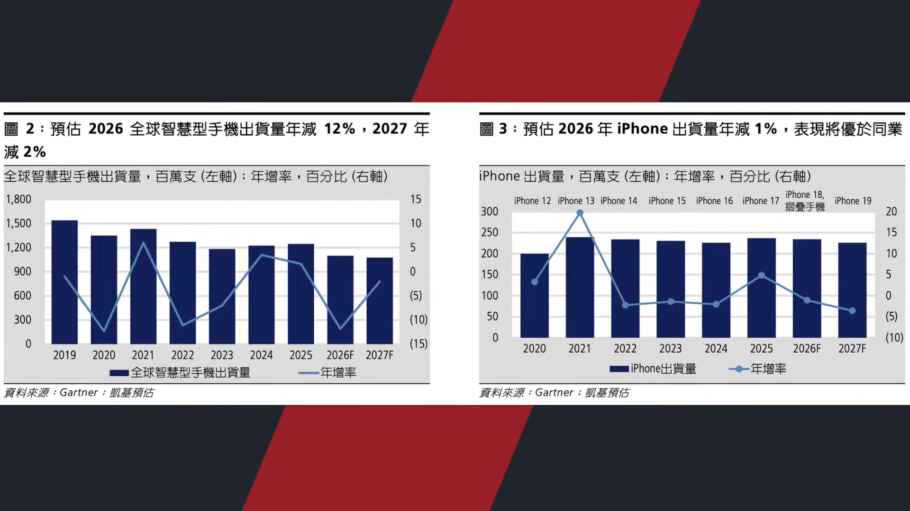

**逐字稿片段：** 按照凱基的預估 今年iphone出貨量大概是2.34億支 年減幅大概1% 27年大概降到2.26億支哦 當然 iphone沒有明顯的成長 但是至少跟全球市場 衰退12%比較起來 抗跌力已經算是很不錯了 所以這叫做壞消息也藏著好消息了 全球手機今年最大的壞消息就是 整體需求真的降溫了 我們永遠再也回不到2021年的高點了 因為除非疫情再來一次 我們被關在家裡 必須大量的使用3C電子產品 要不然高點呢 在未來十年大概都看不到 人口受限 那受到機體價格的大漲 零組件成本的上升 消費者換機週期也在拉長 所以全球智慧型手機的疲憊 可能不止今年 明年後年 如果機體價格再漲上去 大家要麼就犧牲毛利 要麼總體銷量一定會因此而下滑 所以它是一整個產業 起倒楣的衰退 那真正殘酷的地方是景氣差不 一定是平均傷害每一家公司 蘋果算是維持的不錯了 那個小米都已經重度衰退兩成了 蘋果只衰退一% 所以壞消息當中也 勉強藏著一個好消息 之前網友在分享一個故事 他講那醫生跟病人的經典故事嘛 醫生說我有一個壞消息跟一個好消息 那病人說先說壞消息吧 醫生說我們不得不把 你兩條腿都截肢了 那病人沉默了很久 那好消息呢 恭喜你 你以後真的可以說 你的垂到地上了 所以壞消息可能也藏著好消息 對於蘋果 對於三星 大型品牌來上 我覺得對他們來講不一定是全壞哦 因為他們有品牌溢價嘛 他們有採購的規模 他們有供應鏈的溢價能力 就算衰退一%兩%有什麼關係 總體銷量 我單價調高就好了 我出折疊機嘛 我把高階手機的價格接受度硬是拉高 小米OPPO vivo這些中低價品牌商 它怎麼可能承受得了這些成本壓力呢 反而市占率會持續的流失 到時候留下來的人不只是撐過了寒冬 還把市占率 全部都給拿走了 唉這是很值得大家觀察的重點 好當然我們回過頭說 第一個我們要說下的結論呢 其實就是市場上已經很明顯意識到 手機市場已經完全進入到存量市場了 大家其實只是在每個人有一台 手機的過程當中去搶奪市占 當然有些人是兩台3 有些要養小三嘛 那一個人最多就3台嘛對不對 因為兩邊口袋了 那西裝再放一個嘛 最多就三台 不可能有4台嘛 所以手機的存量市場是有限的 它也造就了一個現象 好那就是在一個存量市場當中 咬緊牙去拼命 其實沒有什麼太大的意義 蘋果雖然成功的推出了新機型 但是最重要的是AI是否能夠跟上 要不然呢 蘋果股價其實也算是沉寂了一段時間 我們過去跟投資朋友提過 蘋果長期以來 從2015年以後 是位居全美市值第一名的 這個企業 那當然了 這幾年英偉達默默地就超越了蘋果 而且拉開時間距離也超過一整年了

**話題推測：** 凱基證券iPhone出貨量預估

---

## 00:21:16

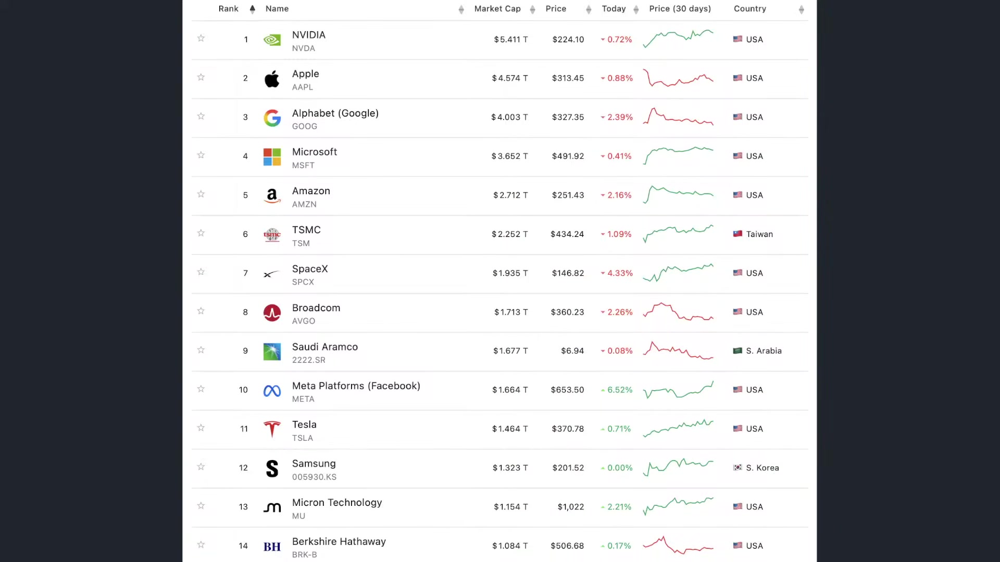

**逐字稿片段：** 英偉達市值大概是5.4兆左右 蘋果大概是4.5兆 好那你要捫心自問嘛 如果未來AI的大爆發 到底是英偉達 翻倍的可能性比較高 到底是阿發貝 到底是微軟Amazon台積電 市值在翻倍的機率比較高 還是蘋果在翻倍的機率比較高呢 它是一個存量和增量市場的問題 手機做得再好 也許跟巴菲特所提到的一樣 仍然可以有良好的護城河可是 消費性電子它的增長幅度肯定 跟不上整個AI基礎建設鏈嘛 好所以蘋果以前呢 一直以來都是穩居第一 就是萬年老大 那微軟呢 其實當了很長一段時間的萬年老二 好不容易等到蘋果隕落了 微軟才剛坐上老大 寶座寶座沒有多久哎 結果老三輝達好在25年 26年就一舉成為了新老大 那句話怎麼講的 當老二試圖控制你的時候 你就已經不是老大了 他才是真正的老大嘛 所以微軟 市場的波動 輝達股價成為全球第一家 市值突破5兆美元的公司 這個時候你會發現 市場上的週期輪替 就是如想像中來得快 也許在五年前十年前 你還相信一輩子都要買蘋果 但是你現在會擔心 蘋果會不會有一天跑出你的0050 跑出你的SPY呢 誒這是值得大家觀察的重點 一個新的時代展開了 好那我們要講這個概念呢 往下延伸的意思就是 其實任何在2026年的投資哦 都必須要瞭解你所投資的市場 是否是一個標準的增量市場 如果只是在存量市場當中來做打轉 那你會發現呢 中國市場 中國競爭者始終有能力參與咖 而且對價格具有破壞力 那重點是 就算你在整場競賽當中能夠獲勝 你還是留在存量市場當中 只能去跟這些日系品牌來做競爭

**話題推測：** Nvidia市值與蘋果比較

---

## 00:23:07

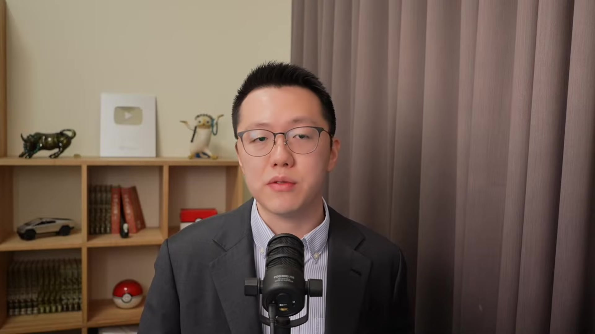

**逐字稿片段：** 我們舉一個比較直觀的就是電動車 好在歐洲車市大戰正式爆發之後 中國電動車的攻勢才剛剛開始哦 自從比亞迪站穩海外市場之後

**話題推測：** 話題轉向電動車市場

---

## 00:23:17

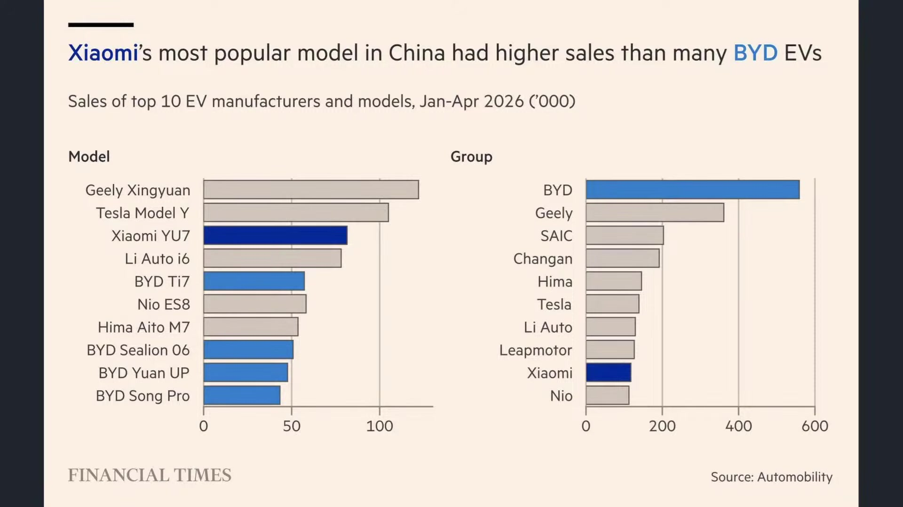

**逐字稿片段：** 現在小米小鵬理想華為的問界都 在加速去進軍歐洲的高階市場 小米是預估在今年年底 到明年年初會進軍德國 目標是在2030年前躋身 歐洲前五大高端汽車品牌從 BMW保時捷特斯拉當中 研擬相關的策略 而且也招攬相對的工程人才 理想汽車已經推出了6款修旅車 進軍歐洲市場 整個26年上半年呢 2020年中國品牌市占是0呢 今年大概已經來到9%的市占率 英國有15%的車已經是中國品牌那 5月更出現 歐洲每10輛新車就有一輛來自於中國 而且中國品牌就在 整個歐洲大幅的席捲 那歐洲的消費者喜不喜歡 當然很舒適 價格便宜嘛 但重點是哦 整場大戰就直接開始了 尤其現在在美伊戰事之後 電動車席捲全球嘛 燃油車市占率又掉了 那如果是從前幾名來看 從純銷量

**話題推測：** 小米等中國電動車品牌進軍歐洲

---

## 00:24:14

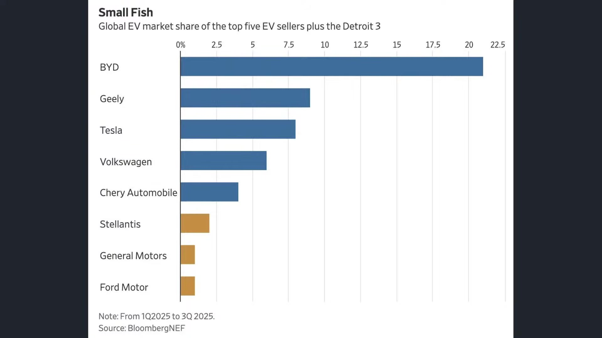

**逐字稿片段：** 第一名就比亞迪了好 占比大概21% 吉利汽車大概8% 特斯拉大概是7.5% 所以特斯拉的優勢也並不是總體銷量 特斯拉的優勢還是 來自於自駕車落地以後 對於市占率形成的破壞幅度會有多大 它形成了一系列衝擊 就是德國的車廠 目前是大規模的裁減管理職 中國競爭呢 也逼出了汽車業被迫大瘦身 舉一個最直觀的 好現在你像福斯 預估在2030年之前呢 要削減5萬個行政開發 以及銷售等間接部門 整體市場預估最終裁員 規模可能來到10萬人 那其他像是BMW

**話題推測：** 電動車純銷量品牌排名：比亞迪第一

---

## 00:24:51

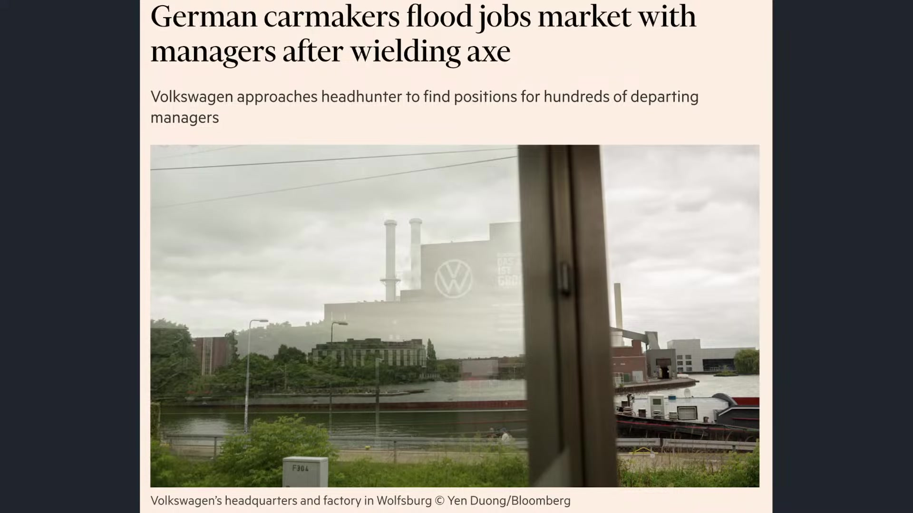

**逐字稿片段：** 出推出了自願性的離職方案 2027年會裁8,000人 保時捷的部分宣佈今年會裁5,000人呢 那裁員你說哎 那會影響到士氣 當然可是裁員是對於股東 最為直觀的交代 讓整體利潤率大幅的調高哦 事實上我們看捷豹 這個叫捷豹路虎了

**話題推測：** BMW自願離職方案與裁員人數

---

## 00:25:11

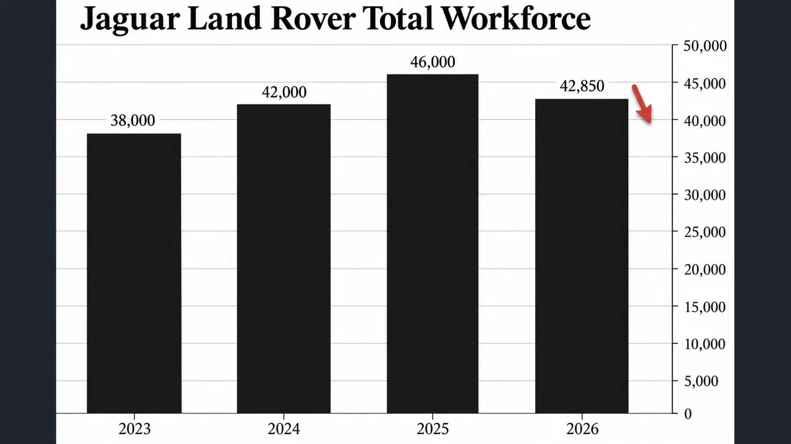

**逐字稿片段：** 計畫未來兩年哦 大概是要裁4,000人 從原本46,000人的員工 會下滑到42,000人 而且透過23億美元的成本削減計畫 本身目的是什麼 就是因為第一季

**話題推測：** 捷豹路虎裁員計畫

---

## 00:25:25

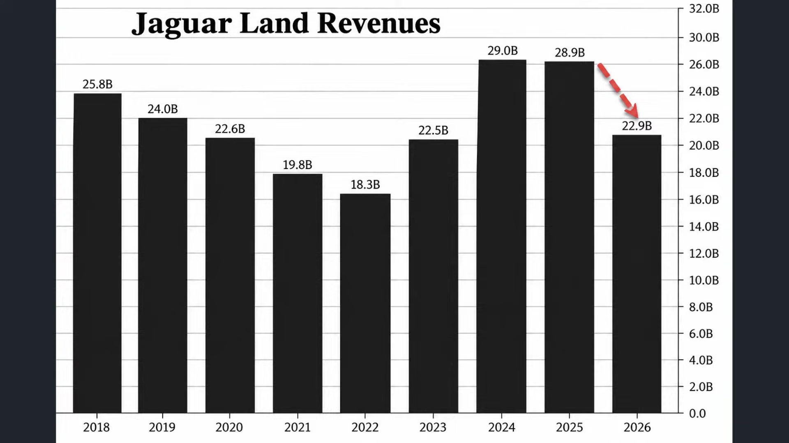

**逐字稿片段：** 我們看到它的營收年減幅是10% 稅前獲利暴跌了69% 只剩下1.09億英鎊 好那當然除了比亞迪等 中國車的競爭以外 美國關稅供應鏈的影響 中東衝擊的影響都是一樣 但是至少整個2026年呢 進入到大幅度的衰退 瑪莎拉蒂 現在開始使用了中國技術 歐洲豪車護城河也正在崩塌 我們如果細節觀察 瑪莎拉蒂目前的總體銷量 它不是說什麼創下疫情以來的新低 它創下有史以來的新低 那你要知道對於 瑪莎拉蒂而言呢 中國技術當然可以解決部分 電動車產品競爭力的問題 但是對於一個誒義大利 的賽車文化工藝精神呢 核心技術供應鏈外移 那它的下滑 如果搭配著中國技術那到底 能否在中國市場的 銷售量拼回來總營收 還是說市場上只是會 產生進一步的下壓呢 壓力很大 前陣子我們也提到嘛

**話題推測：** 捷豹路虎營收與獲利數據

---

## 00:26:20

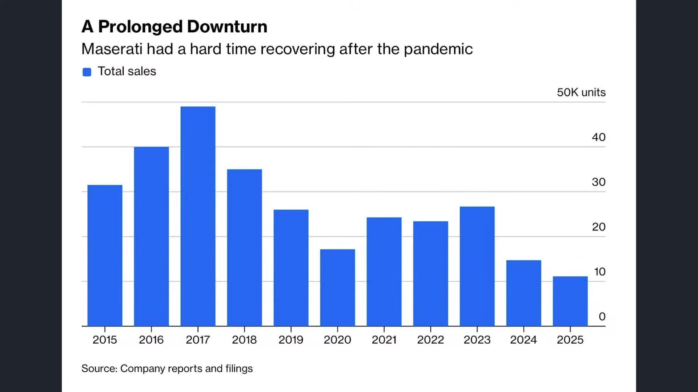

**逐字稿片段：** 007最近不開奧斯頓馬丁了 改開比亞迪的騰勢Z9GT 好那以前他都是開跑車這輛 也不難看了 好但是大家都開始代言中國車了 再看一下Porsche

**話題推測：** 007改開比亞迪電動車

---

## 00:26:33

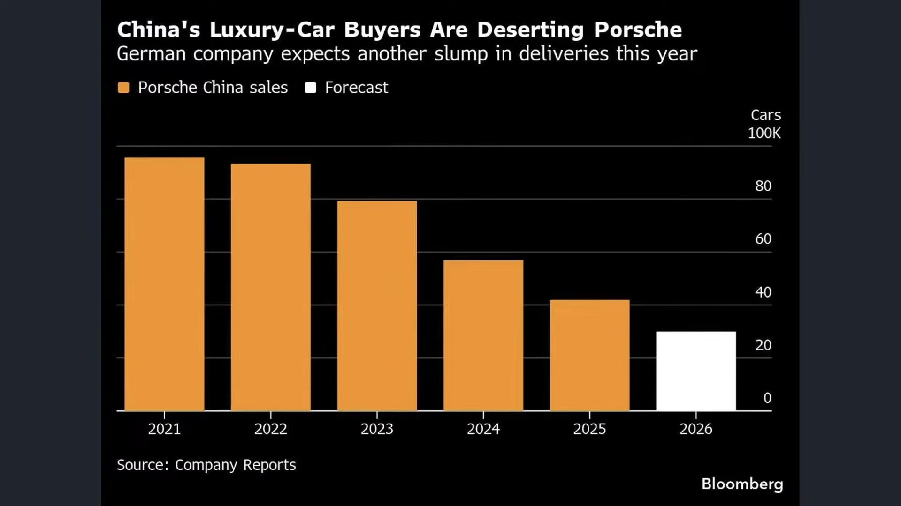

**逐字稿片段：** Porsche在去年的全球 銷量已經下滑10%了 今年看起來會破底了 好這個是疫情以來最慘了 公司營收可能要到2028年才會重新 站回到2024年400億歐元的水準 那更慘的是獲利能力 它的2025年營業利潤率只有一%了 他賣一個100萬的車只賺1萬 200萬的車只賺2萬 全年銷售回報率大概6.5% 這對一個高端品牌公司來說 很明顯偏低了 法拉利都比它好 法拉利至少有20% 以上的營業利潤率 Porsche居然只有一% 所以這個壓力是很大的 那再看一下 BMW BMW最近是推那個ix3嘛 全球開放預購

**話題推測：** Porsche全球銷量與獲利能力

---

## 00:27:13

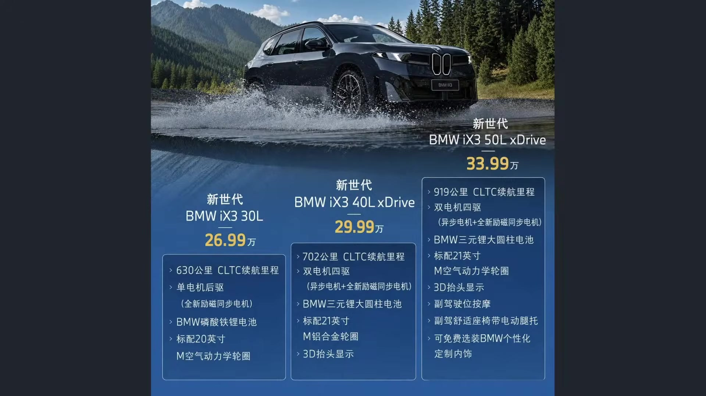

**逐字稿片段：** 看一下中國的價格 當然了 它有部分是國 算是類國產 不過至少也是掛BMW牌子哦 i X3最貴最貴新世代 50l x drive 33.9萬人民幣 這在臺灣要賣300萬的 他在中國賣33萬人民幣 好所以從這件事情就看得出來 BMW的獲利也拉警報了好 BMW最近把2026年的財測給下修了 預估汽車的事業營業利益率也會

**話題推測：** BMW中國區ix3電動車價格

---

## 00:27:40

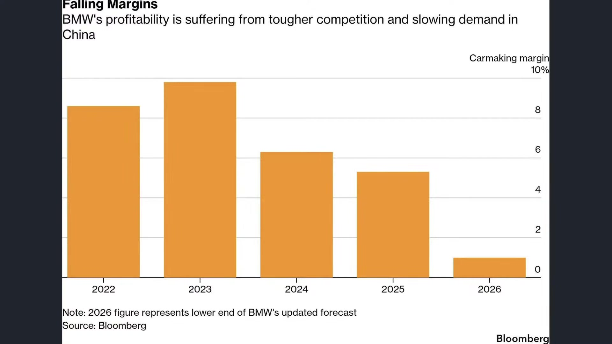

**逐字稿片段：** 從原本的4%到6%下滑到1%到3% 哇那100萬他的車他只賺3萬 哦這多慘 所以你就知道歐系車在 一個存量市場的競爭當中 也許其實本來我們都清楚知道 中國品牌也沒有直接衝擊到歐洲汽車 可是你畢竟在一個存量市場當中 好你看 其實臺灣我們知道這幾年宏華先進 大家知道開那個電動車或者說 搭計程車還蠻長搭

**話題推測：** BMW汽車事業營業利益率下修

---

## 00:28:09

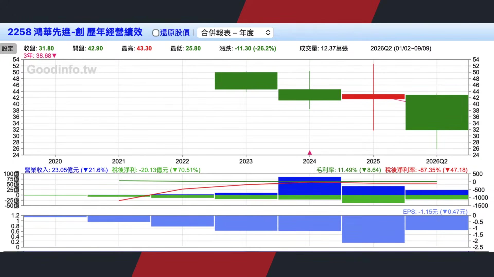

**逐字稿片段：** 到宏華先進的車嘛 哎你搭了之後你發現一樣嘛營收縮 虧損獲利放大 今今年營收算是快速放大了可是 獲利EPS從2021年掛牌以後 它每年還是衰退 EPS還是負值 好所以其實全球車市 面臨的問題都差不多了 第一個就是那個增量市場消失了 以前車市在疫情以前 的增量市場在哪裡 其實就來自於中國嘛 我們看在BMW的部分 在中國的官方指導價最近又出來了誒 IX3最高優惠 16.69萬人民幣 新臺幣73萬

**話題推測：** 宏華先進電動車市場表現

---

## 00:28:44

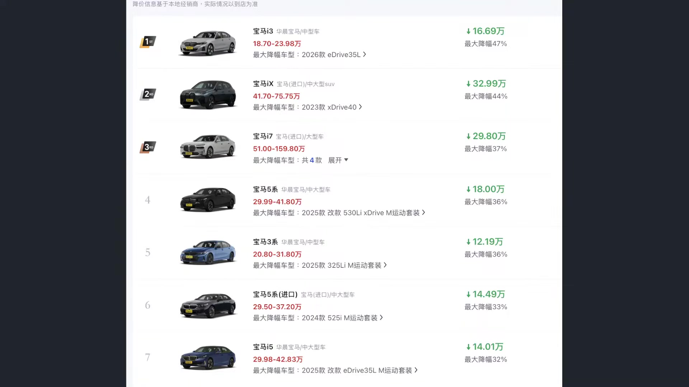

**逐字稿片段：** 降幅47% 這是指導價 代表可以再往下殺 SUV IX one 最高降到32萬人民幣 7系列最高降29.8萬人民幣 等於新臺幣降131萬 燃油車同樣守不住價格哦 如果是我們看華晨BMW5系列 最高會優惠18萬人民幣降79萬 3系列最高降12.19萬人民幣 進口5系列也降了14.49萬 好這是BMW的部分 那賓士更狠 好賓士是直接腰斬 你看賓士的EQE 最大降幅是5成 降了23.9萬人民幣 賓士的EQB降了17.6萬人民幣 eq一的SUV降了23.9萬人民幣 那平均車價都變成20萬 到30萬人民幣左右 好所以從這樣的一個角度來做思考 你會發現 好整個全球車市 它的存量市場已經完全打開哦 那你要在一個存量市場當中 想要獲得更高的超額報酬 你只能對賭這家企業可以把 其他人的市占率全部搶走 那你會因此而現在 常年期的看好比亞迪嗎 比亞迪自己的利潤率也在下滑 好所以 本身而言就是 只要去投資任何存量市場的股票 本身在中長期而言 你都必須要意識到 可能相對於AI該有的報酬 會有一個極大的落差 對了 它跟臺灣有點差別了 而且差別還蠻大的這沒錯 但沒辦法嘛 好這個就是進口關稅影響 關稅戰打了一整年了 好像汽車關稅也沒有真的調降 好所以這沒辦法 好這個臺灣就是 你只能從其他地方補回來 就是你去保養的時候 你多吃幾個哈根達斯嘛 這是唯一的方式 你看雷克薩斯雷克薩斯早餐有早餐嘛 然後中午有便當 你就多點一點果汁 保養的時候你汽車咖啡 他跟大人全部吃回來 對富豪有現切水果嘛 有那個研磨咖啡 以後就臨時多拿幾包 大概是這樣子 所以沒辦法 那或者說多去休息 沒事就停那邊 嘗試賺一點回來對不對 是唯一的辦法 所以我們講了很多 九點零二分 主要跟投資朋友分享事情是 我們今天主要是從市場 上在手機市場的觀察到 電動車到全球車市的觀察 其實我們都要彰顯著同一個目的 就是在存量市從市場當中來做打轉 其實最後能夠獲得的回饋哦 資本報酬落後於AI 它是正常的 我們舉一個直觀的數據

**話題推測：** BMW中國官方指導價優惠

---

## 00:31:09

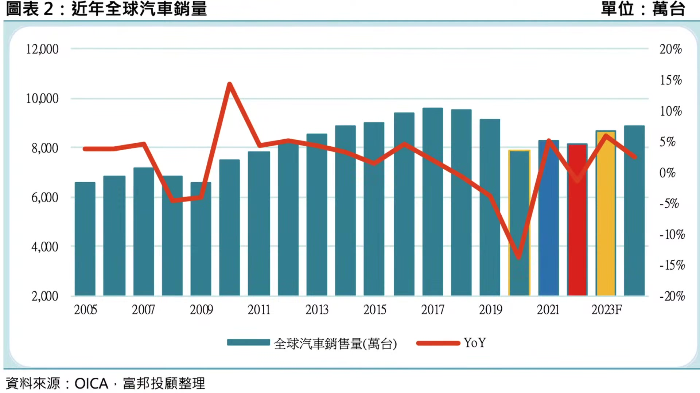

**逐字稿片段：** 張圖表示這幾年全球汽車銷量的表現 你有沒有發現 全球汽車銷量的高點在哪裡 就在2018年了 大概是全球銷量9,500萬輛左右 從疫情以後就再也沒有回到高點過 從2026年 即便今年銷量跟上半年一模一樣 也不會創下歷史新高了 全球車市已經完全飽和了 那頂多就是電動車去搶奪原本的市占 或者呢 只能看到 按照自駕車的技術 看能否迎來新一波的爆發 好所以從這樣的一個角度來做觀察 會發現全球手機和汽車市場都 面臨同樣的一個挑戰和困境的 那相關的股票 股價表現也並不是特別的優渥 至少相對於AI股而言呢 那臺灣為什麼能夠在本輪 市場當中能夠成功獲勝呢 最為關鍵的原因就來自於 因為我們也不靠手機 也不靠汽車零組件呢

**話題推測：** 全球汽車銷量趨勢圖

---

## 00:32:00

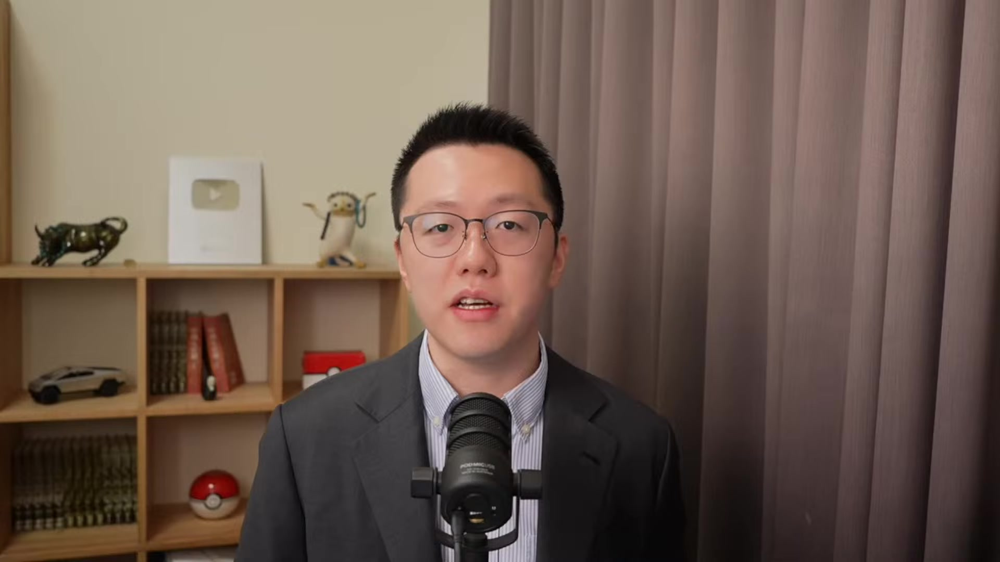

**逐字稿片段：** 我們靠的就是AI伺服器 所以稍晚我們再來追蹤 到底目前伺服器的帶貨量有多高 它能否幫助自駕車提前落地 能否幫助3C消費性 電子能夠順勢轉型呢 這個是我們後續觀察的方向 台股下跌347點 收在46,848點 如果喜歡我們節目 記得幫我們訂閱 按讚加分享 我們就明天早上8點半 早晨財經速解讀再相見 祝各位投資朋友看盤順利 操盤愉快

**話題推測：** 台灣在AI伺服器市場的優勢

---
