# yutinghaofinance_dFYqrIQIMvw — 關鍵畫面索引

- 來源逐字稿：[yutinghaofinance_dFYqrIQIMvw_GT.srt](yutinghaofinance_dFYqrIQIMvw_GT.srt)
- 影片：https://www.youtube.com/watch?v=dFYqrIQIMvw
- 截圖數：20

## 00:00:48

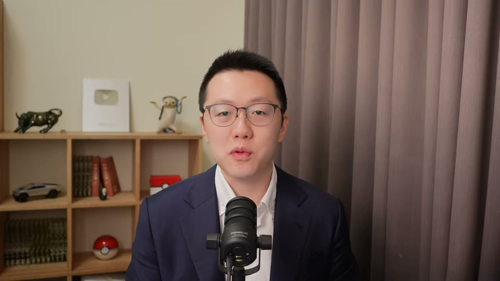

**逐字稿片段：** 所以今天我們要觀察的幾個方向 一方面美國股市上禮拜五是全面收紅 道瓊漲了500點 可是我們也觀察到 加密貨幣概念股在比特幣的強彈 好在最近黃金價格的強彈呢 都說明著市場的交易主軸 還是集中在美債的流動性問題 上禮拜即便美國股市 禮拜五開始做強彈 可是標普周跌幅還是有1.4% 納斯達克周跌幅還是有兩% 兩大指數都是終止了連續三周的上漲 那我們當然很清楚知道 這一波的引爆點呢哈 並不是針對AI的 基本面產生重大鬆動 我們過兩天再看一下輝達 在本次財報給予的定調 而重點其實就來自於財政部哦 這一次透過擴大美國公債的回購 來壓低了長天期的美債殖利率 可是按照市場反應的時間 很短就兩天 長債殖利率在短暫回落之後 又重新開始受到承壓 整周大概是維持持平了 反而是美元的走弱 導致了黃金和比特幣的同步上漲 與此同時 比特幣過去一周漲了大概有兩成五嘍 哦這蠻多的 我覺得比特幣已經 很難見到這種漲幅了 突破了7.8萬美元這 是2024年11月份以來的最佳單周表現 上一次表現這麼好 就是川普當選的時候 大家對於比特幣行情的期待了 那黃金價格也大幅走高 突破了每盎司4,600美元 攀升到了三個月來的高點 美元指數整周大概是下跌一%左右 事實上如果我們仔細觀察了 好在過去一段時間 的確 這個美元指數走弱幅度也沒有到很大 但是市場上 已經有那種慢慢的氛圍改變了 就是美國公債的避險港地位鬆動它 如果你不讓我殖利率 一路的上移 那我就用美元的貶值來進行反映呢 有一種美債的下壓以美元來承擔 由於貝森特在複盤 這幾天剛好風雨也很大嘛 就跟現在的美債一樣 就以前呢 美債就是像颱風天 那個地下停車場 大家有時候看到風雨嘛誒 把車開進去哦 現在發現誒 地下停車場可能會淹掉 所以它不一定是最危險的地方只是呢 它不再是那個不用看氣象就能夠 安心停進去的地方了 有這樣的感覺 有點風雨跟風雨很大 的時候是不同維度 那我們今天就要來追蹤 美國財政部這一次的擴大回債 公債的一個回購金額 會不會有可能持續性加大 那如果原本是想要壓低長期殖利率 現在沒有明顯得救嘛 那會不會採取更進一步的刺激 與此同時 美元反而走弱 黃金和比特幣同步大漲那 貨幣的貶值交易是否會 重新回到市場正中央 另外一方面 哦這一次在整個週末 川普把關稅戰線呢 從中國是一路擴大到加拿大 無人機 新能源供應鏈 再加上油價和食品價格的蠢蠢欲動 那美國等同於同時面對三重壓力 高債務高利率 還有高通膨 好那接下來就要看那 華府究竟他是準備要救美債 還是要準備把這個美債的代價 轉嫁給美元或者全世界的消費者呢 我們先回過頭說 這一次我們講說結構力量 很難靠財政部的回購債劵來做解決 因為市場很明顯認為4-5%的利率 可能只是回到正常水準 要讓償債殖利率下行呢 只有一個方式了 這是市場給的論調 那就是你要縮小財政赤字嘛 上禮拜我們知道美國公共共 債務已經正式突破了40兆美元 財政赤字占國內生產 毛額已經來到6%了 光是聯邦政府年度利息 支出就高達一兆美元 遠遠高於國防支出 現在逼近社福支出 等於是辛辛苦苦賺了一整年的錢 幾乎都是拿去繳利息了 那在這樣效果底下 如果一路的超過社會保險 醫療保險或者醫療補助 這些政府的主要支出來源呢如果 這樣下去的話 那遲早必須要做好財政的持續可控 或者說財政准結 可是我們也清楚知道 美國拜託去年一整年的財政預算案 這個預算案又創高了 第二是國防支出也是 持續創下歷史新高 好這就代表市場針對公債 避風港的地位正在鬆動 那也不是對賭說你一定還不出錢來 可是如果科技業也在跟你搶錢 那你肯定要給我更高的風險溢酬

**話題推測：** 開場總覽今日觀察重點，可能切到美股、加密貨幣、黃金與美債流動性摘要畫面。

---

## 00:05:13

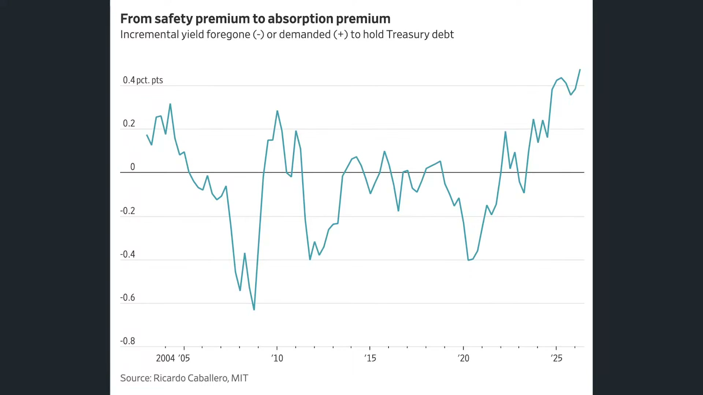

**逐字稿片段：** 所以我們看得清楚 現在呢投資人過去 願意少拿一點利息來 持有美債的安全溢價 現在變成 你必須要多給很多利息 才能夠讓市場吸收的溢價 因為投資等級債開出的 資利率實在比你漂亮太多了 那對於很多人來說 可能投資Google微軟 這些大巨頭的長天期國債 跟美國國債本質也沒什麼區別了 可是一個殖利率也不過4%到5% 一個是7%到8%了 那現在貝森特 很明顯已經進場 至少是盯盤了 那麼市場上也不太 可能主動去狙擊美債 可是呢他就會從其他層面 來反映市場針對美國公債的擔憂

**話題推測：** 轉向投資人要求更高美債風險溢酬，可能出現美債與投資級公司債殖利率比較圖。

---

## 00:05:52

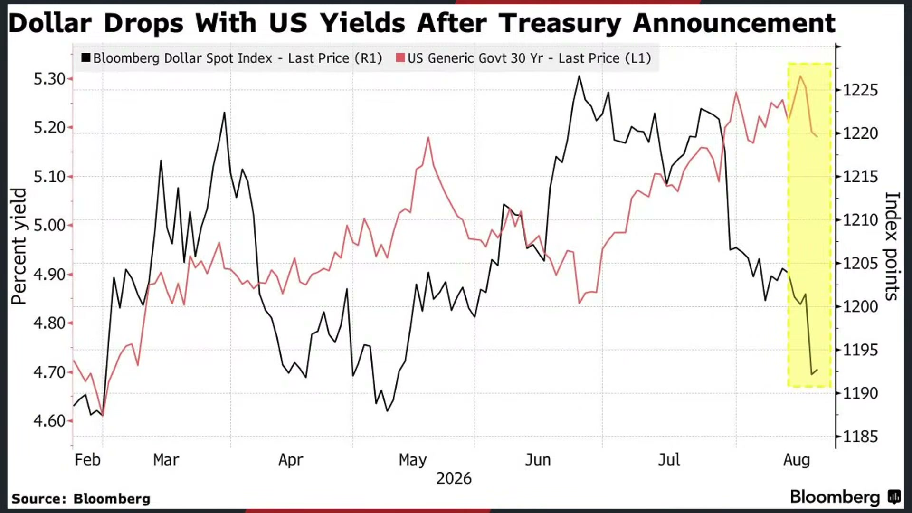

**逐字稿片段：** 那是什麼呢就 是美元先付出代價嘛 事實上我們知道 美國可以買回自己的債 但它不能夠買回市場對於美元的信任 如果長端殖利率被政策給壓住 美元資產的利差當然 吸引力就會因此而下跌 這也是美元現在受到市場承壓的原因 那資金就會轉向 第一就是非美貨幣 瑞郎或者歐元日元亞洲貨幣 那第二就轉向黃金 那現在甚至轉入到比特幣當中 所以從這樣的一個角度來看 美元的貶值跟這一次的比特幣黃金 價格的上漲就呈現了高度聯繫 所以要怎麼讓美國壓低殖利率 方式那就是用美元來做承擔 這是現在看起來短期 的唯一的最終解 實際上美國一直以來 從貝森特過去的喊話 就是希望能夠把長期利率給壓下來 這次是主動出擊哦 就好像那個房東怕房子租不出去 你決定要降低租金 那房客確實有可能回來了 但整棟房子的行情也會被迫重新估價 你看那個東區 那一堆房子都空著 店面也是 為什麼 他想要維持住那個市場的價格嘛 所以租金也不太願意降多少 美國可以控制政府接下來 發行的債劵付多少利息哦 但他能不能命令大家一定要相信美元 從美元的貶值交易就看得出來 市場是有一點鬆動的

**話題推測：** 提出美元先付出代價的觀點，可能切到美元資產利差、美元指數或資金流向非美資產圖。

---

## 00:07:09

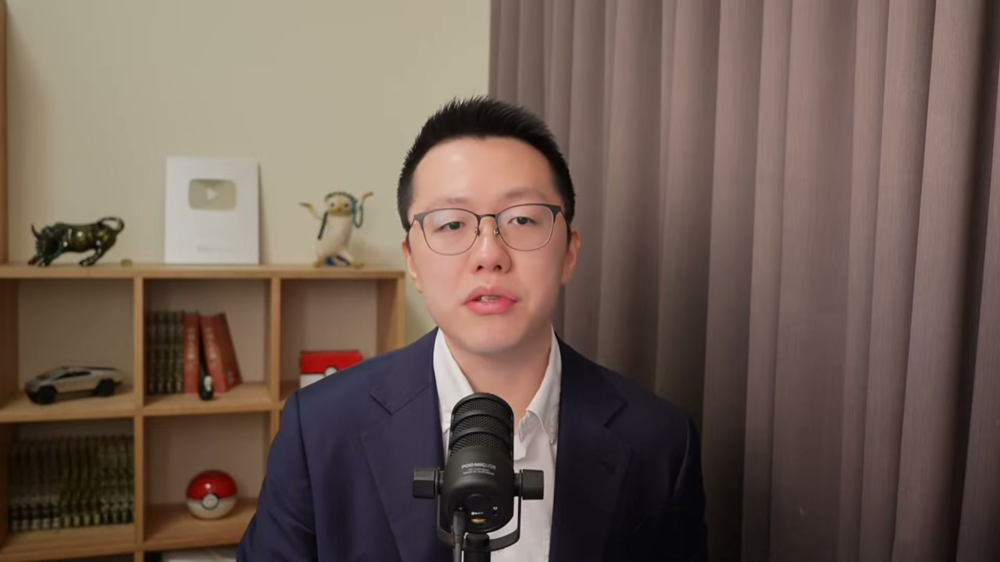

**逐字稿片段：** 好我們回過頭看 誒這反而形成了一件好事哦 就股市 從高位回檔之後 就在高位盤旋 債券市場壓力稍微大一點 可是也沒有到史詩級崩跌 因為財政部正在盯盤 那最終呢 本來今年上半年表現相對 比較差勁的黃金和比比特幣 誒反而開始漲回來了哦 我們看整個26年以來 各類型的資產呢 21項類資產當中有17類是繳出了正報酬 商品價格最高 大宗商品漲了39.8% 美國價值股小型股 分別漲兩成3和兩成2 可轉債中型股大概16%上下 納斯達克漲了6.4% 成長股漲了3.6% 債券偏弱不過呢 跌幅也沒有想像中來的重 整體平均債券是跌0.2 頭等債1.3 長天期美債3.3 那你不要看比特幣 還是墊底哦 它以前是跌三成呢 現在只有重挫10.5% 這說明在過去一周的漲幅非常亮麗 比特幣 爺爺您回來了 您終於回來了

**話題推測：** 轉入股債回檔後黃金與比特幣反彈的資產表現比較，預期顯示2026年各類資產報酬排行。

---

## 00:08:12

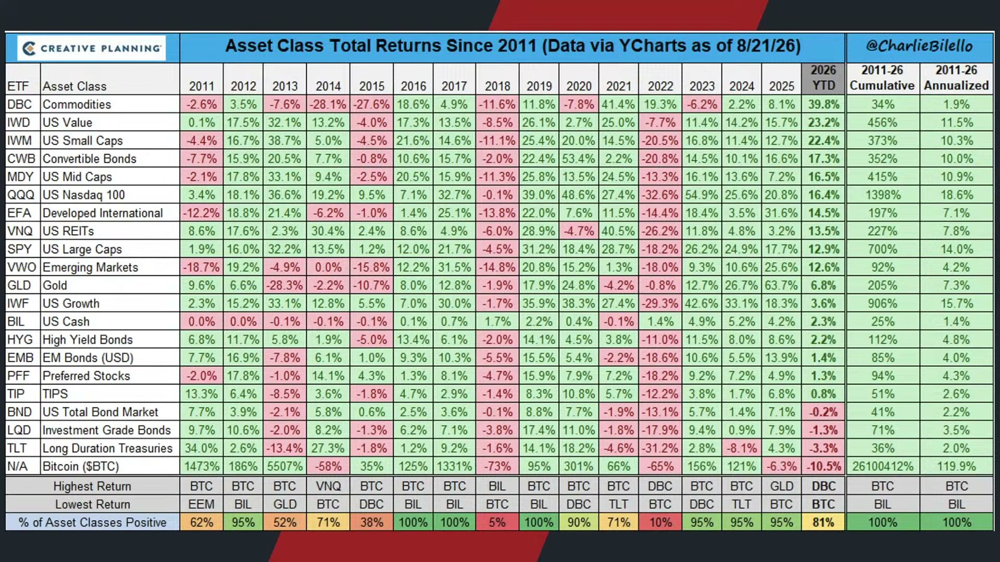

**逐字稿片段：** 好我們看美國財政部這一次 的確採取了適度動作以後 反映在美元的貶值 所以我們也不能夠期待比特幣行情 無條件的上漲 如果比特幣只是反映 貨幣貶值交易的話 那難道你相信財政部這一次 會放手美元一路貶下去嗎 也不太可能 在期中選舉之前 最好是不要出太多大亂子 但是呢這也說明著比特幣 至少從市場價格角度而言 吸引了新一輪的買盤 而不只是比特幣了好 這次像乙太幣 一系列的加密貨幣 上漲幅度在過去大概是兩成到三成 我們知道比特幣過去一年 其實下跌幅度是31% 代表的這也不算是長期 牛市牛市的一路延續 它是在美元轉弱 長天期公債動盪的情況底下 產生的快速反彈 所以還是要看後續的市場交易情況 而且在上方賣壓還有一長段路要走呢 但是呢 比特幣現在的資金流 買盤的確已經開始挺進了 這一波急漲 其實我覺得有很大程度是軋空成分了 我覺得很多人對比 特幣已經相當失望了 所以上方空單的確比較多

**話題推測：** 開始聚焦比特幣反彈是否只是貨幣貶值交易，可能切到比特幣價格走勢或美元貶值關聯圖。

---

## 00:09:18

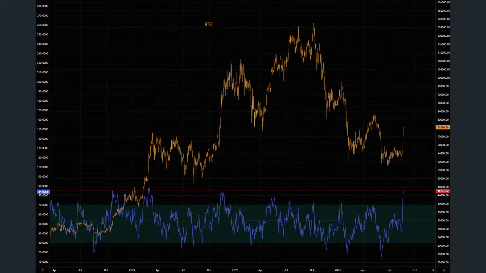

**逐字稿片段：** 比特幣原先是在6.5-6.7萬美元附近 它累積了比較大量的空單 那經過6周的低波動整理之後 我們看這個宏觀環境一轉向嘛 一周內哦 短時間內就引爆了大規模的強制平倉 哦所以我覺得這一波比較 像是那種高強度軋空了 空單的清算金額過去一周是33億美元 進一步放大漲勢 那近期資金的流入 剛好也是5月以來的最大 好的說明有很多人 長期投資者 在本周已經進場了 是從5月份以後

**話題推測：** 提出比特幣6.5到6.7萬美元空單與軋空行情，預期切到比特幣清算或空單分布圖。

---

## 00:09:49

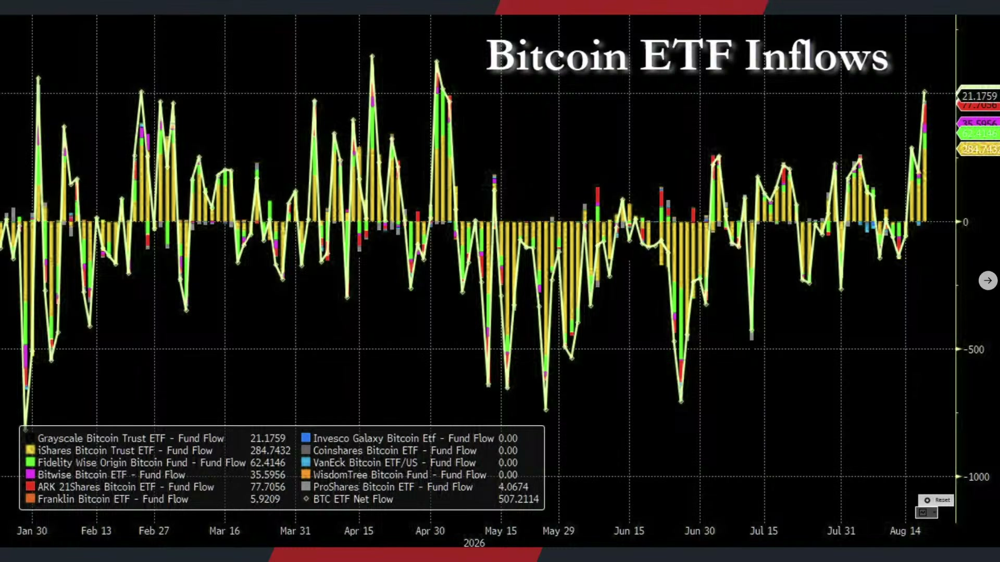

**逐字稿片段：** 你也知道 那比特幣的ETF資金 我們從線形圖來看 幾乎沒有人再買比特幣的ETF 就散戶連比特幣都不想碰了 好可是這一周的確資金 流入量真的非常多 像禮拜五一天就流了5.07億 好這個資金流動的情況 如果在本周能夠持續加劇的話 就要看一下比特幣 有沒有可能開始產生底底高 這種市場買盤的長期移動 還是說就單周行情 另外一個就黃金 黃金是連續兩天的快速上漲 價格重新站上了200日移動平均線 那從7月中低點反彈 它大概也漲了15% 每盎司大概在4,600塊上下 那這一波漲勢除了中國 各國央行黃金ETF的買進之外 最重要的當然就是 當公債的避險效果下滑 加上美元貶值底下 最後讓市場重新去尋找 全球政治風險的避險工具 好那當然 這樣的一個避險效果難道 能夠一路的逼上去嗎 它也不是那麼的直接 因為呢我們也知道現在的通脹問題 讓利率空間沒有太多的降息預期 那黃金過往的角度 通常跟實質利率高度聯動了 你只有實質利率越低 價格才能夠有效的推升哦 那按照現在的貨幣環境 你也不太可能想像通膨瞬間就消失了 好所以黃金會抗通膨 可它反映的更多是 利率預期水準的變化 那唯一的好處是實體需求至少在變強

**話題推測：** 開始談比特幣ETF資金流入，可能切到比特幣ETF資金流線形圖與單日流入數字。

---

## 00:11:12

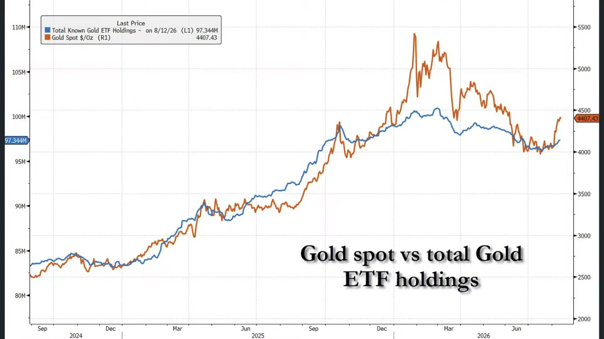

**逐字稿片段：** 我們看中國今年累計黃金進口 量比去年同期增加了444公噸 年增幅升8成 雖然7月份的進口量稍微下滑 但是上半年平均每月還是 有144公噸的進口水準那 主要的出口 主要來自於英國 或者在南美洲各地 所以從這樣的一個角度來看 央行似乎也在趁著黃金價格 過去半年比較疲憊的過程當中 慢慢的進行回補 全球雖然去美元化 還有一長段路要走 可是至少很多央行 是在降低美元資產 波動度所產生的衝擊 黃金和比特幣的 同步上漲 它就是那種社區治安變差 一部分人買保險箱了 那一部分人買 可能買防盜攝影機之類的 那兩者東西其實還是不太一樣 但是背後的概念都是同樣的嘛 就大家不太相信員警能夠及時趕到 差不多是這樣的意思 所以造成了兩類資產的上漲 可是警察永遠都不會到嗎 誒這就不一定了 我所以我們對於這兩項資產的上漲 還是要保持著一定宏觀的角色 我認為要瞬間改變過去的跌勢 要有一點難度 最好還是要有長時間的政策影響 我們才能夠看出論調 或者說呢 把通膨問題解決 也許這些資產呢 上漲就有其道理了 但只要通膨問題沒解決 那也許永遠都是曇花一現的 事實上我們知道

**話題推測：** 轉向中國黃金進口與央行回補需求，可能切到中國黃金進口量年增與月度進口圖表。

---

## 00:12:34

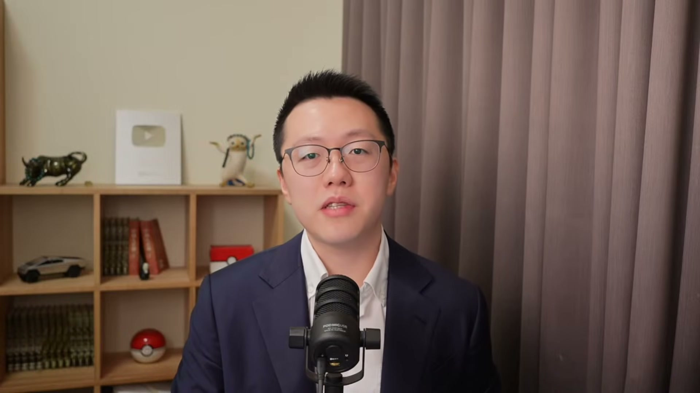

**逐字稿片段：** 貝森特這一次才發表談話 因為在美國國債正式 突破40兆美元的時候 都會引發大量投資人特別關注嘛 那貝森特已經很明顯表態了 說美國政府這一次 推動了財政整頓之後 聯邦赤字 很高的機率已經來到了高峰 他告訴大家 這次就是最高了 現實數字相當沉重 因為7月份的單月 預算赤字是4,320億美元 五年來新高 本財年的累計赤字 赤字已經來到1.8兆了 哦這個數字差不多是那個20年 到21年上升的所有的增速了 就上一次這麼高就是撒錢 海量貨幣寬鬆了 這一次沒有撒錢哦 沒有貨幣寬鬆哦 沒有財政刺激哦 唉結果呢 金額還是非常高 那川普政府當然一直說 現在重要財源就是來自於關稅嘛 希望透過提高進口 稅收來增加政府的收入 然後改善財政 只是相關政策還是 面臨著相關的司法挑戰 我們清楚知道 現在IEEPA 基本上等同於失效嘛 所以貝森特說的現在 財政赤字有極高幾率達到高峰 可能目前到頂峰了 那下一步就外太空了 這是我的理解因為 很明顯嘛 他唯一能夠處理的方式就是借新還舊 要不然就讓通膨預期消失 降息問題就解決很多了嘛 OK所以這也給投資朋友做一些思考 當然了 美國財政部這一次押上了准量化寬鬆 開始進行市場回購哦 要麼就說明市場覺得 買的力度不夠大 那財政部原本過去所 提出的是333計畫嘛 那現在幾乎三項目標是全部的落後 過去6個季度的經濟成長率低於兩% 沒有來到3% 財政赤字占國內生產毛額6% 是3%目標的兩倍 原油日產量2024年只增加30萬桶 也低於增加300萬桶的承諾 好所以這三項政策幾乎是全面失效 也就代表著 市場也不是沒有看到你的方向 你的方向很明顯就是放鬆監管 刺激經濟 然後呢進一步的增加供給 但是很抱歉 方向雖然是對的 可是力度都不夠 現在市場就以 股價或者資產價格的博弈 公債市場的拋售來逼迫你 釋出更多的寬鬆力度哦 這個就是市場現在正在做的事情 那當然了 回過頭說等同於 現在如果要處理這個問題 我覺得最終方式 只有讓市場的通脹預期降溫 讓連總會主動釋出非緊縮態度 把現在公債的問題解決因為 花的錢是肯定不會減少的了 但是把利息發行的 利息降低是很重要的 那發行的利息降低 一方面要降低市場的利率預期 那怎麼降低呢 告訴大家以後不會有通膨 以後利率預期會越來越低 那這個時候公債值利率 預期才會跟著往下嘛 現在呢 川普在過去兩天也發表了相關談話 說明這一次美債市場 人家問他說現在美債市場 你是否有按叫貝森特去幹預 好那川普的回答也很有趣 川普說最終的幹預就是軍隊 那不確定他是 軍隊去護中東市場 要穩住通脹問題 還是軍隊要去買美債 我不確定 可能把債主扁一頓 那就不用還了好 但是現在市場上最大的壓力就是通脹 的僵固性導致殖利率預期維持在高位

**話題推測：** 開始引用貝森特對美國赤字達峰的談話，可能切到財政部官員新聞與赤字數據。

---

## 00:15:51

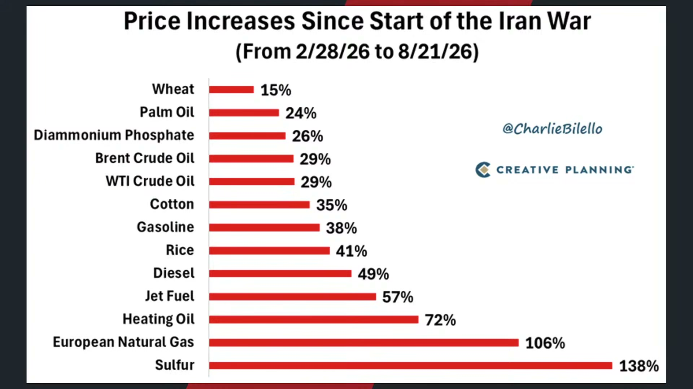

**逐字稿片段：** 我們看現在從228戰事爆發以來 一路到8月21號 上禮拜五為止 布蘭特 和西德州原油平均上漲還是有29% 汽油3成8 柴油4成9 航空燃油57% 歐洲天然氣暴漲106 農產品也沒辦法倖免 小麥漲15 棕櫚油24 棉花35% 稻米漲了4成一哦 那一系列的轉嫁 我們都清楚知道 如果只是單月份的一路上漲 它都漲半年了 怎麼可能下游端沒有反應呢 沒有反應就政府補貼了 很明顯那 即便禮拜五的確有40艘油輪 已經陸續離開霍爾木茲海峽 似乎航運是稍微有點通的 不過呢整體流量還是低於6月15-7月 中旬當時短暫停火的期間水準 而且也沒有船敢進去 大部分都是出來的 這就代表著全球的煉油 產能仍然處於大缺口 原油價格不至於失控 因為市場已經提前反映 霍爾木茲海峽的長期的供應鏈調整 可是呢

**話題推測：** 轉向228戰事後能源與農產品價格上漲，可能出現原油、汽油、柴油、天然氣與農產品漲幅表。

---

## 00:16:50

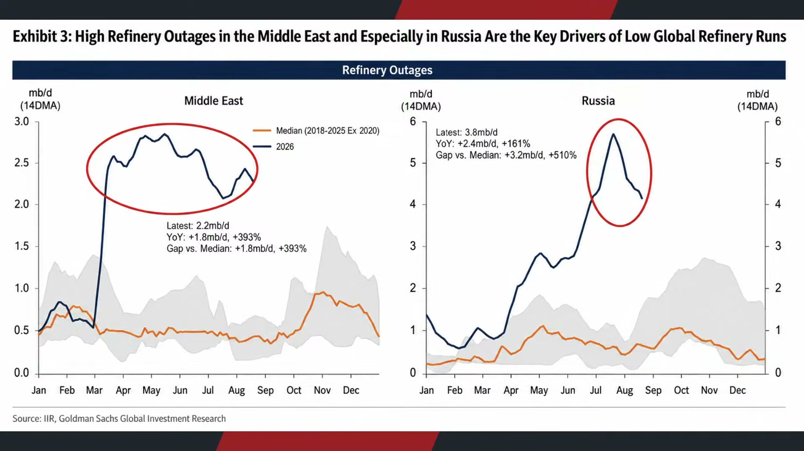

**逐字稿片段：** 目前柴油價格真的就是居高不下 俄羅斯現在每日產量是300萬桶 中東大概是200-400萬桶 那兩地的煉油廠目前大概 維持在6成產能左右而已 煉油廠通常在 汽油柴油的裂解價格 價差大幅上升的時候 都會增加供應 不過現在中東和俄羅斯 還是有很多的設施處於停擺的 俄羅斯是部分受到烏克蘭 飛彈的攻擊而選擇稍微停產 那中東的問題則是 運油管線的部分 它運不了這麼多 所以本身產能其實也 沒有想像中來的多 最直接影響就卡達啦 你知道卡達跟臺灣 貿易量一直都非常龐大 因為臺灣以前的 天然氣都是從卡達來的 好像幾乎沒有 現在都是從澳洲或者美國來的

**話題推測：** 聚焦柴油價格、俄羅斯與中東煉油產能缺口，可能切到煉油產能或裂解價差圖表。

---

## 00:17:34

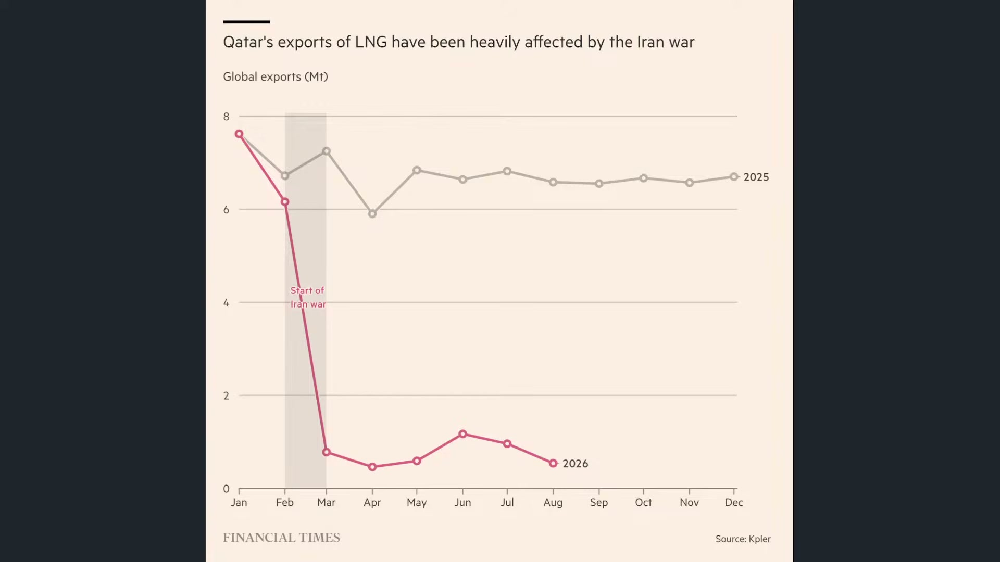

**逐字稿片段：** 我們看卡達 卡達預估在今年呢 經濟成長率會重度衰退8%那當然 很明顯就是因為它在 霍爾木茲海峽裡頭 這次的卡達是被迫 暫停了液化天然氣的生產 政府部門今年直接削減預算30% 海外援助 大砍85% 好所以是波斯灣六國當中 現在衰退最嚴重的國家而且 這一場衰退 你要知道 由於各個中東各國 在接近波斯灣的國家 都改成借由沙烏地阿拉伯管線 運到西部延布港之後 再進行原油的輸出 那卡達就在這個海峽海灣裡頭 壓力就非常大了 哦所以不確定會衰退到 什麼樣的一個地步 也許明年還會持續性的衰退 好這就是我們觀察到的真實現象 而且哦我們也清楚知道 現在川普對於中東的態度 並沒有完全的軟化 他只是把軍事戰轉化成經濟戰 貝森特 這一次直接表明 如果呢 接下來有國家不配合美國的政策 繼續對伊朗實施經濟封鎖的話 那麼很有可能呢 會引發美國史上最嚴厲的制裁 就是他已經對伊朗制裁了 那要求其他國家也選邊站 目標就是進行能源封鎖 金融制裁不過呢 中國馬上就發表態度 已經明確拒絕配合 強調沒有任何 聯合國安理會授權的單邊制裁 他都不會理會 主張透過政治和外交來解決 這說明著 概念就是中方會持續 向伊朗來購買原油 那至於怎麼運出去是後話 但至少態度是確認的 事實上我們也清楚知道 中國進口原油在過去 一段時間的確有比較顯著的收縮 可是這兩個月又開始拉升了 會不會對原油價格有影響 做適度的 通膨易主 值得大家觀察

**話題推測：** 話題切到卡達因霍爾木茲海峽衝擊而經濟衰退，預期出現卡達LNG、GDP或政府預算削減資料。

---

## 00:19:16

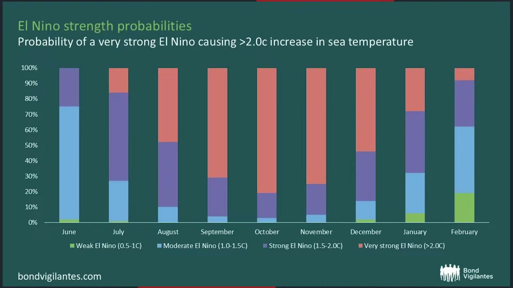

**逐字稿片段：** 另外一個就食品通膨 食品通膨主要是聖嬰現象了 我們知道26年到27年哦 聖嬰現象的風險比市場預估來的大 美國國家海洋暨大氣總署估計哦 出現非常強聖嬰現象的幾率 在今年年底到明年年初 大概是81% 所以各地突然 乾旱或者暴雨的情況 可能會持續 直接性的加劇哦 澳洲也預估太平洋海溫哦 大概會上升3.5度左右 那會直接影響颱風的形成等等呢 哦所以也許莫名其妙 連續兩個颱風 3個颱風 陸續形成 我們看到市場就是這樣子 那秘魯是特別敏感的呢 你像聖嬰呢 大概會讓經濟成長 每發生 2027年預估會大概對於一% 左右的經濟成長產生衝擊 那我們也知道 因為現在臺灣人很多人 我看那個Costco大家在搶藍莓嘛 秘魯又是全球最大的藍莓出口國 所以呢 有沒有可能造成 進一步的食品通膨衝擊 具體 這種科學問題我也不瞭解了 不過大家都這樣講 那就是一種預期嘛 我們經濟學聊的都 不是真實發生的事情 都是價格的預期反應了 那如果超級盛銀現象的確有 可能形成2027年的進一步衝擊 那市場價格有沒有提前反應呢 值得留意了

**話題推測：** 新話題為食品通膨與聖嬰現象風險，預期出現NOAA聖嬰機率或氣候異常圖。

---

## 00:20:31

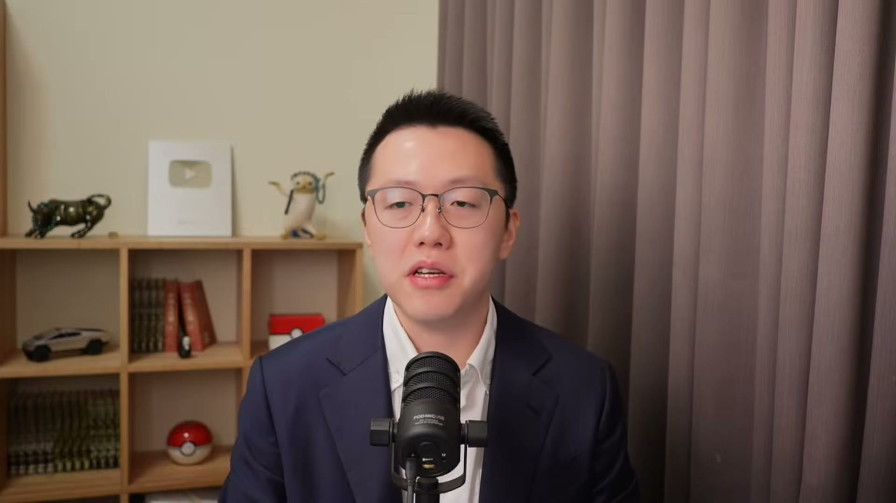

**逐字稿片段：** 另外一個就是針對 伊朗的經濟戰在持續哦 針對加拿大的經濟戰也正式開啟了 這次美加談判貿易 誒本來哦 談判期間還說的還不錯 本來預估可以降到10-20% 結果呢加拿大已經主動宣告 對美國貿易開戰了 主要就是美國要的太多 給的太少 卡尼這一次特別提到了 川普錯估了加拿大 承受經濟代價的決心 美國對200億美元的 加拿大商品來徵新關稅 這一次呢 卡尼決定停止談判 美方最後一刻因為又 要求對汽車和第三國 簽署貿易協定 的相關限制 我猜大概就是中國了 加拿大無法接受這筆美國隨時變約 隨時變臉 而且又要的太多 給的太少的交易 宣佈以相同金額直接 反擊美國的新關稅 雖然後續有談判的空間保留了 只要華府願意針對加拿大 的鋼鋁業大幅調降關稅 渥太華是願意撤出部分報復措施的 不過川普看起來也沒有想要理他 兩方的關稅戰已經正式開始了好

**話題推測：** 話題轉向加拿大對美貿易戰正式開啟，預期出現美加關稅談判或加拿大報復關稅新聞。

---

## 00:21:33

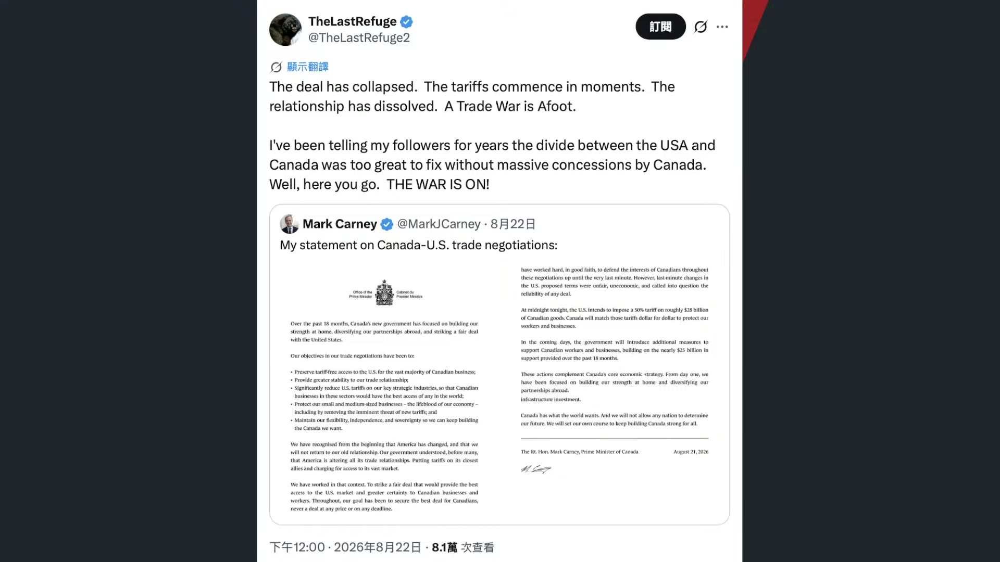

**逐字稿片段：** 這等同於雙方現在是互征50%的關稅 好那當然現在談判團隊 看起來已經回國了 下一次談判是9月8號了 噢所以即刻生效 那川普也馬上發文說 加拿大想要作為美國一州的好處 卻又不願意真正成為一州 如果你真的不想被我課關稅 你就成為我的我的一州 不就沒事了嗎 這是川普的態度 我說我也可以不課你關稅 你只要成為我的州就沒問題了 OK這我們看到的真實現象 那當然了 9月8號之前呢 等同於市場的關稅通 膨預期又會開始有效的增溫了 因為這是跟美國本土 直接相關的消費品 美國有非常多的民生物資都是從 墨西哥和加拿大直接運進來的 直接性的衝擊會有多大 市場壓力越來越大了 當然了川普當然很清楚知道說 即便如此 我們至少收到關稅嘛 到時候再進行一些財政上的補助 購買力一樣可以維持 好這像那管委會缺錢呢 決定向所有的外送員收那個進門費 那管委會的收入確實會增加 他在外送平臺終究 有一天會把費用加到餐點嘛 最後付錢還是樓上的住戶 但至少短期內川普的政策非常明顯 那當然了 川普也知道關稅會 影響到購買力的侵蝕 所以一方面他在對於 增加加拿大的關稅 可是另外一方面 對內反而持續性的 進行適度的關稅減免呢 舉例來說 川普在禮拜五正式宣佈 大幅降低美國工薪 家庭購買牛肉的價格 他說在拜登時期任內 牛肉價格以極快的速度增長 那在我們的努力幫助下 幫助美國牧場的同時 未來90天內 美國允許進口30萬公噸用於 生產牛角肉相關的肉品而且呢 免征配額 對外關稅 也就代表著 哎牛肉關稅全免哦 哎這在短期內 當然還有一定的時間 可至少看得出來 川普還是很在乎目前 市場的真實購買意願的 你說那對外的關稅會因此而停止嗎 當然不會嘛 只有真正影響到內部物價 民生壓力很大的 他才會予以赦免 像對於中國的部分也 沒有因此而停止 你像川普這一次 也不想再跟中國玩打地鼠了 過去十幾年我們知道美國 對於中國的太陽能產品呢 課征關稅嘛 就常常變打地鼠 12年對中國 太陽能板和電池祭出高關稅 那中國企業就把產能移往東南亞嘛 後來又移到泰國 移到馬來西亞 移到柬埔寨 最高關稅稅率哦 2024年最高是多少 3,521% 這個供應鏈又往印尼 往遼國往印度 甚至往東歐國家走 所以川普現在改變打法了 從今年開始正式宣佈 往上游追 包括進口的多晶系或者衍生的細晶圓 太陽能電池或者模組 基本上平均課徵15%關稅 管你什麼國家進來的 都要課徵 那因為美方已經意識到了 不管是從印尼來的 寮國來的 越南來的 反正都是中國來的 那不如呢 先針對中國課高關稅 那在針對這些國家課 15-20%關稅不等呢 那錢至少都收的進來嘛 擋不住你至少先從 其他國家全部收進來 所以它是全面的普遍課徵

**話題推測：** 提出美加互徵50%關稅與下一次談判日期，可能切到關稅稅率與9月8日談判時間表。

---

## 00:24:46

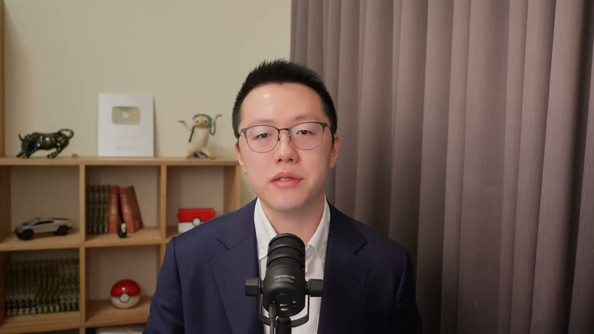

**逐字稿片段：** 因為中國占全球的 太陽能板市場已經高達86% 太陽能電池是92 矽晶圓是97呀 多晶矽是93 好所以美方大概也知道 短期內產能升不起來了 那多收一點關稅吧 那至於其他的 像是無人機在過去一個月 也宣佈課徵了100%關稅 主要是針對25公斤以上 那如果是小型無人機 也是課征25%關稅 應該講說大型無人機是100%關稅 小型無人機是25%關稅 那不管怎麼說 我們會看到一個實質的跡象那就是 真相就是這樣子一層一層的浮出來了 一開始哦 這美國對中國商品呢 它是加征關稅 以為只要堵住中國的出口 就能夠迫使供應鏈離開中國嘛 那現在看起來 離開是離開了 不過都到馬來西亞了 到墨西哥 到越南了 商品不會再掛中國製造 但背後都離不開中國 資金設備和零部件嘛 後來美國也不演了 他也不查什麼產地標籤了 反正就全課 只要不是我市占率偏高的都全課 那中國呢 就繼續以海外設廠稀土管制 和龐大的製造能力來反制畢竟呢 你課的關稅還是由你 的消費者來買單嘛 那最後浮現的真相 就是這場競賽哦 它並不是那種美國出招 那中國認輸 它是一場永遠持續動態博弈 你關一個門 我就尋找另外一個出口 你重新修改規則 那我就重新調整路線 國與國之間呢 很明顯沒有一勞永逸的勝利 你只要不斷的出招 然後不斷的變通 不斷的重新適應 這個就是現在我們看到 的國際博弈呈現的結果 可能未來5年10年都是如此 那最後真相就一層一層的浮現 兩方就是這樣子不斷的博弈下去嘛 昨天在看一個故事 講妻子 那廚房裡面忙早餐 她丈夫就手賤嘛 在她屁股拍了一下 你要是能夠把這裡搞硬 就不用穿彈力褲了 那妻子過了一會兒 就拍著正在做仰臥起坐丈夫的肚子 你要是能夠把這裡搞硬 肚子縮下去 上廁所終於可以看得到小雞雞了 那過了一會兒 那丈夫又偷偷抓了妻子的胸部一把 你要是能夠把這裡搞硬 就不用戴胸罩了 那妻子很不耐煩 往他褲襠裡拍了一下 你要是能夠把這裡搞硬 你就不用戴綠帽了 所以真相總是一層一層浮現的 很多事情都這樣子 他政策不會在剛宣佈的第一天 真相不會在政策宣佈的第一天 它就完整的出現 你時間呢 一年一年的過去 就好像我們以前聊到 的川普的關稅政策 他的確高關稅是保護美國製造 逼迫中國讓步 好那現在供應鏈 找到第三國 臺灣也因此受益 南韓也因此受益 好就算技術沒有比中國好 效能沒有比中國好 我們一樣都可以受益 通膨也是如此 政府可以宣佈問題已經解決 可是油價運費原料食品成本 它還是會透過供應鏈逐步反應 債務問題哦 它不會立刻爆炸 但它會先透過償債值利率上升 利息支出的擴大 和元的走弱 慢慢鋪露市場的信心變化 很多事情都是真相 它要一個月兩個月1年2年3年 你就慢慢出現 你就大概可以瞭解整體的輪廓了 所以時間不一定會 立刻給出答案答案哦但是 他至少會逐漸地去撕掉每一層的包裝 所以投資最重要的 我們也不是要去急著去 證明當下自己就是對的 我們就持續地觀察 修正判斷發現誒 好像這幾年都是發生同樣的事情 兩方爭霸 臺灣受惠 大概都是這樣的一個邏輯 事實上 川普這一次哦 也釋出了相關談話 要求蘋果停止採用中國的記憶體 我們知道在過去幾周 這個蘋果對於長期存儲的相關接觸 其實比較頻繁一點的 那之所以接觸比較頻繁 我們當然知道一方面呢 是為了要為接下來的 蘋果供應鏈做適度調整 為中國版的 iphone來提供中國版的記憶體嘛 那第二個角度當然是為了要壓價格 因為SK海力士和鎂光 還有三星 現在開價開得有點離譜嘛所以 我跟中國廠商接觸 目的是為了要壓回我的價格 好談判才是目的 那當然這一次川普是很明顯介入了

**話題推測：** 提出中國在太陽能板、電池、矽晶圓與多晶矽全球市占率，預期出現中國太陽能供應鏈市占表。

---

## 00:29:01

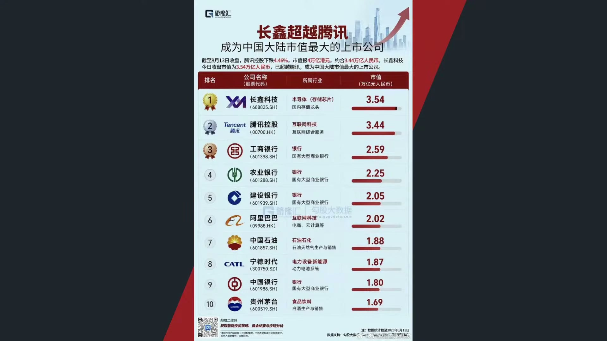

**逐字稿片段：** 按照盧特尼克的說法 目前由於蘋果已經正在測試 長鑫科技和長江存儲的產品 現在呢政府是阻止 其他廠商以美國品牌為首 停止跟中國進行接洽 那我們就要看一下 這表面上看起來是進一步的脫鉤了 可是現在基體價格真的很貴 那庫克或者美國這個蘋果的 新任執行長他有不得不的壓力 所以也有可能呢我猜 也有可能是為9月份的川習會來鋪路 就是 雙方博弈一下 通常就要緩一下 博弈一下就要緩一下 尤其現在又接近集中選舉 有沒有可能可能未來過了 一個月之後就開綠燈呢 這是有機會的 因為9月份現在要談判了嘛 我還不確定雙方有什麼籌碼 有的是稀土啦 有的是無人機關稅啦那我在 關稅談判之前 先主動創造一些籌碼 比如說我準備要針對中國記憶體 產生產能脫鉤 到時候我就可以釋放 當做一個籌碼的談判因數 這也是值得大家觀察的幾大方向

**話題推測：** 開始談蘋果測試長鑫科技與長江存儲產品、政府阻止接洽，可能出現記憶體供應鏈圖。

---

## 00:30:00

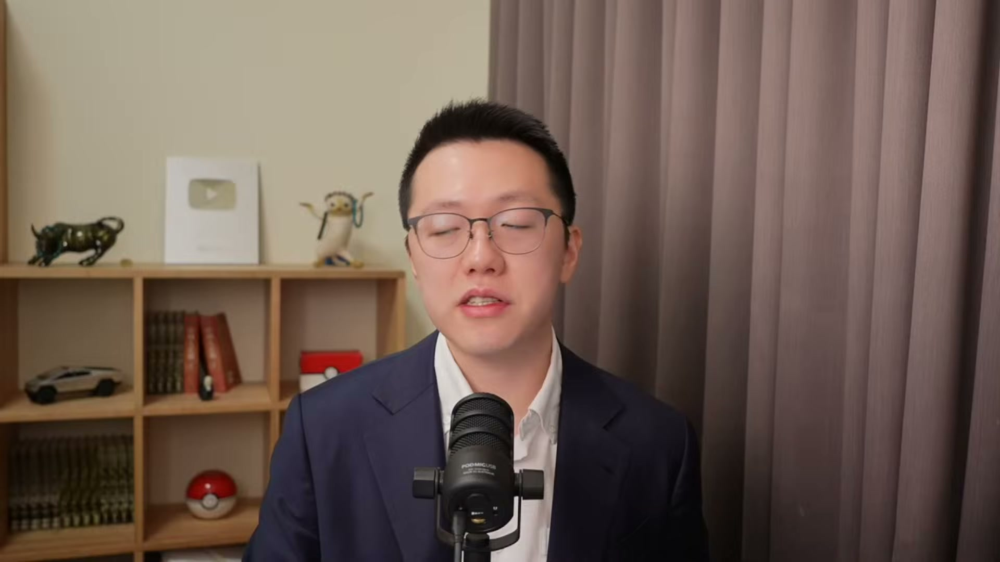

**逐字稿片段：** 那當然了 中國也不遑多讓 目前針對稀土的許可制 管制又開始收嚴了 每一次談判之前大家都搞這一套了 我們過去提過

**話題推測：** 話題轉向中國稀土許可制收嚴與談判籌碼，預期切到稀土出口管制或中美談判圖。

---

## 00:30:09

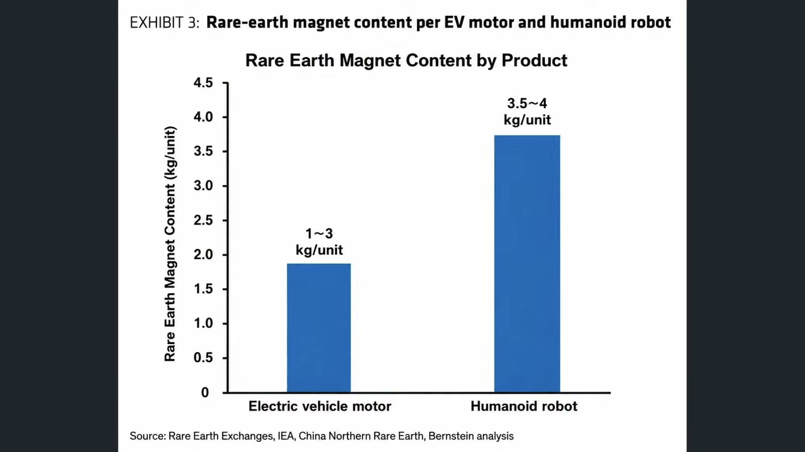

**逐字稿片段：** 因為現在人形機器人 出貨量開始做顯著拉升嘛 那人形機器人吃掉的稀土磁鐵哦 可能比一輛電動車還要來的多 大概一台電動車的馬達不過1-3公斤吧 但是一台人形機器人要3.5-4公斤呢 原因就在於現在人形 機器人是全身都有大量的關節 還有制動器 每個馬達都需要高性能的永磁材料 如果未來機器人進入到千萬台 甚至更大規模的量產 稀土需求就能夠因此而放大 好今年稀土價格已經漲非常多了 我們舉例來說 像種的價格每公斤已經2,800塊了 這是兩年前的價格現在呢是接近 3,000塊應該想說 這總價格 2022年是500塊吧 現在2,800到2,900 我記得這個月已經突破3,000了 你像主的價格 誒三年前才1,000塊 現在1.1萬 鎢的價格本來是500塊左右 現在3,000塊 所以這些材料廣泛性的 用於AI晶片半導體和軍工 價格持續性的上漲 形成進一步市場的總體壓力 好所以不管怎麼說 雙方似乎都在為9月份的川習會 來創造新一輪的籌碼和鋪墊

**話題推測：** 開始談人形機器人帶動稀土磁鐵需求，可能出現機器人與電動車稀土用量比較。

---

## 00:31:21

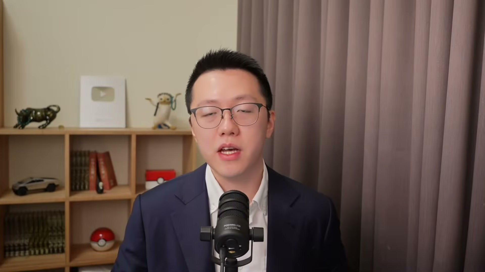

**逐字稿片段：** OK臺北股市小跌26點 收在45,197點呢 我們今天呢 主要是從美國財政部的 擴大回購公債來談起 一方面先分析 貝森特他想要壓低長債值利率 但短期內的效果反而是先壓低了美元 然後點燃了黃金和 比特幣貨幣貶值交易 但這個趨勢我認為不 一定能夠長期向上 那你覺得市場上美元會 一路的走扁走下去嗎 在短期內 第二個是看到油價食品和關稅 他如何讓通膨風險重新升溫 以及川普把貿易戰線呢 從中國延伸到加拿大 現在到無人機太陽能機器人供應鏈 表面上是美債商品和 關稅的不同新聞 其背後都同一件事情吧就是 美國現在正試圖用政策的幹預 來守住原本金融和產業的霸權 但是每多救一個市場 就可能在美元信用 在消費者物價 或者在全球貿易製造上 產生另外一個問題 那最後的結論就是 美國現在當然不是沒有工具 它每個工具都有 只是它每一個工具都要有人付帳 買回美債代價就是美元嘛 加征關稅 物價就更高了 壓低利率 那麼代價就是通脹和 資產泡沫的重新升溫 而且華許也不一定理你 所以華府現在想要同時保住美債 又要保住美元 又要保住股票 又要保住選票 但市場上 從黃金和比特幣價格的上漲 說明的事情是投資人 當然不相信問題解決了但是呢

**話題推測：** 進入結尾總結並提到台北股市小跌26點，可能切到台股收盤指數與今日重點整理頁。

---
