# yutinghaofinance_eHz1_TGAo4I — 關鍵畫面索引

- 來源逐字稿：[yutinghaofinance_eHz1_TGAo4I_FIN.srt](yutinghaofinance_eHz1_TGAo4I_FIN.srt)
- 影片：https://www.youtube.com/watch?v=eHz1_TGAo4I
- 截圖數：29

## 00:01:04

**逐字稿片段：** 30年期美債之類率 我們都很清楚知道 自從10年期最近創高以後 30年期本來是在高位盤旋 昨天又創高了 來到5.62% 這是2002年6月份以來的新高 也壓抑住了目前的股票市場表現

**話題推測：** 介紹30年期美債殖利率數據

---

## 00:01:20

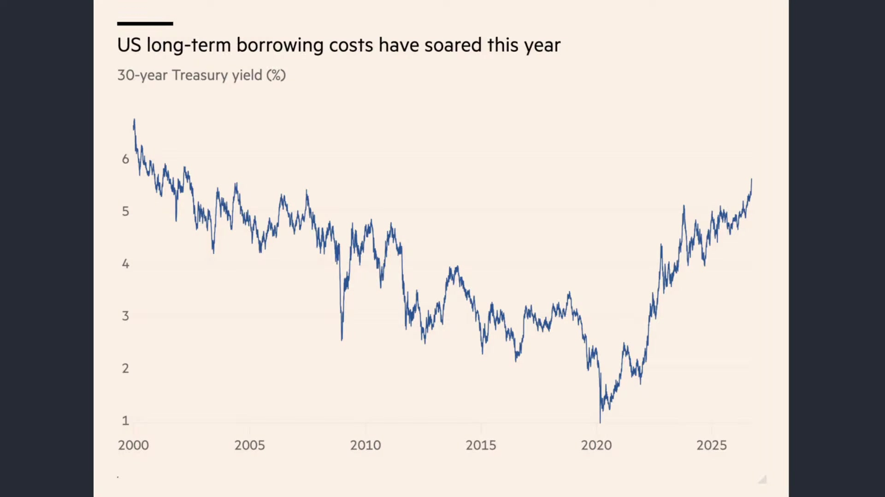

**逐字稿片段：** 10年期美債殖利率在昨天也碰到了5.29% 快要到5.3了 這是07年6月份以來的新高 30年級殖利率現在維持在高檔以後 代表的是 不管是短天期長天期 所有發債成本都在快速的往上衝 那這個時候就要回過頭說 除了美國國債上個月突破了40兆美元 財政赤字以及發債壓力以外 之前我們提到的通膨要求 市場更高的風險貼水 都影響到了長天期美債的承接意願 那現在唯一的好事就是 過去我們提到 債券市場很明顯已經有點恐慌了 可是美國股市還撐得住 十年期美債值略略的快速飆升 它直接導致了衡量美債波動率 我們把它理解成

**話題推測：** 介紹10年期美債殖利率數據

---

## 00:02:08

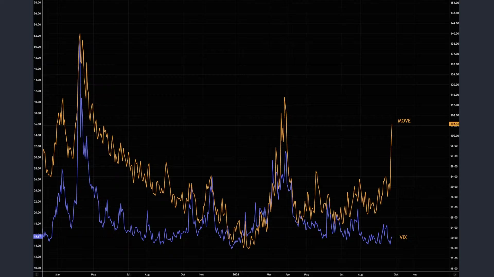

**逐字稿片段：** 美債的恐慌指數 Move指數 在短短兩個交易日內快速的爆衝 所以債券市場恐不恐慌 從避險情緒來看 其實是非常非常恐慌的 可是如果我們以VIX來做觀察 就會發現其實表現還好 現在VIX出現了比較巨大的落差 那就是標普白指數 幾乎沒有非常明顯的避險情緒正在發酵 其實也就說明著 現在市場上把高殖利率 還不能夠完全解讀成通膨全面失控 我們可以把它解讀成 經濟好像比想象中強很多 今年十年期美債殖利率 上升幾乎全部都來自於實質殖利率的提高 那麼通膨預期變化反而是有限的 也就說明著 其實只要經濟和企業的獲利持續成長 大型企業還是有能力去消化比較高的利率 不過這主要是標普白指數層面的現象

**話題推測：** 引入美債恐慌指數Move指數

---

## 00:03:03

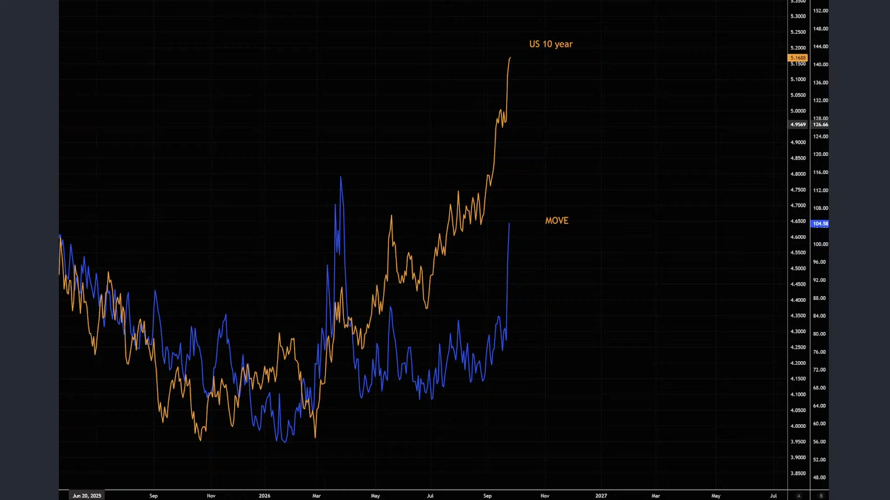

**逐字稿片段：** 如果你說中小型股 市場上利率最為敏感的小型股 它就有很明顯的沉壓形象 羅素2000最近的疲弱就是一個例子 那真正的風險其實就在於 如果實質殖利率長時間維持在高檔 債市的恐慌 遲早有一天會傳導到股票市場 那我們現在就看 能不能按在現在的利率水準 不要讓恐慌持續的往下來做蔓延 現在美國股市從相關性跟美債 來做一些追蹤 會發現其實也算是到了歷史低點 剛才提到 各股之間的聯動性 其實也降得非常低 標普500成分股

**話題推測：** 討論中小型股表現，以羅素2000為例

---

## 00:03:40

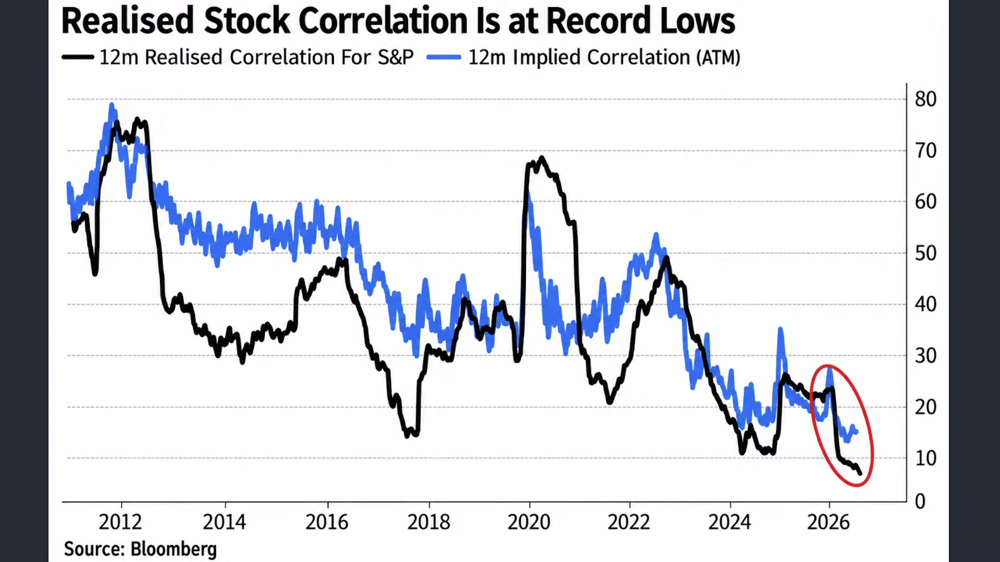

**逐字稿片段：** 在過去6個月的實際相關係數 大概降到了5.2% 這應該是2011年 有資料以來的最低記錄 很有可能也是歷史低點 換句話說 就算現在有股票在跌 它也不是一起漲跌 它是不同產業 不同公司各走各的 雖然個股的波動不小 不過整體指數波動 大家也觀察出來了 從下半年以後 其實沒有什麼太大波動 你就躺著在那邊 你就穩穩的領襲 好像也沒有什麼太大影響 下半年的量縮 其實也是在反映這樣的事情 就是虧也虧不了多少 漲也漲不了多少 可是從個股來看 可能體感就會非常顯著的惡化 所以我們基本上可以作為第一層斷定 就是雖然市場上有通膨害怕的因子 可是這一輪的殖利率爆衝 其實沒有那麼直接性的相關 因為通膨從3月4月 我們大概整條路線就已經預估好了

**話題推測：** 顯示標普500成分股的相關係數數據

---

## 00:04:35

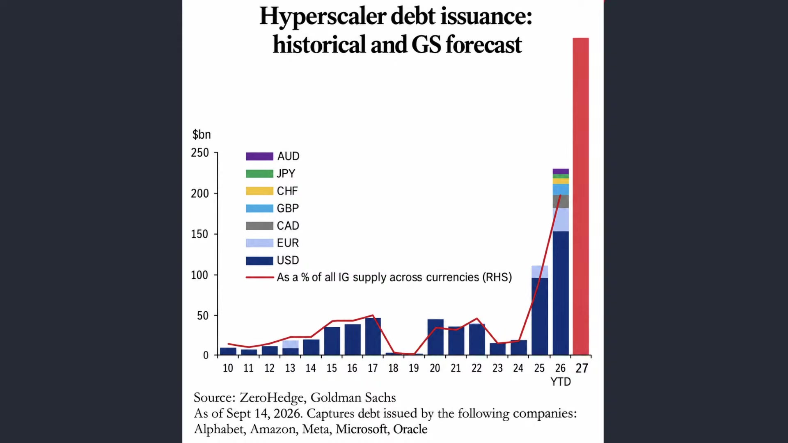

**逐字稿片段：** 今年的明目殖利率累計上漲 大概是97個基點 那通膨預期 大概也不過十個基點 大部分都來自於實質值利率的上升 就是錢本身變貴了 是目前利率預期上升的主要原因 那當然它背後的原因 就是AI的搶錢潮 AI的投資潮所帶動的效果 那當然再回過頭說

**話題推測：** 討論今年名目殖利率上漲基點

---

## 00:04:59

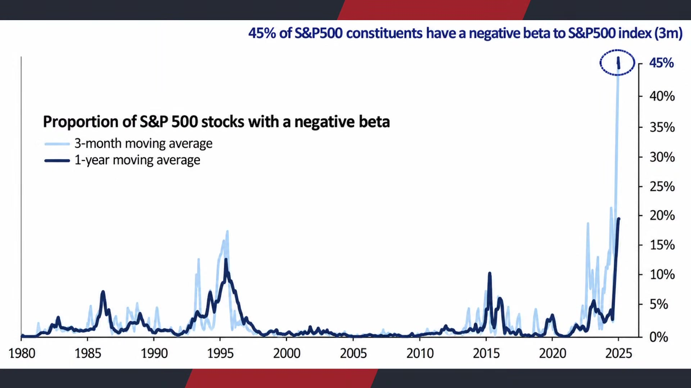

**逐字稿片段：** 標普500內部所出現的罕見分裂 昨天我們提到 大概有接近一半的成分股跟大盤 是處於反向波動的 以前是標普500指數上漲 也不能說成分股都一定要跟著漲 但是現在是很多標普白指數的 大型科技股在上漲 結果部分科技股反而在反向下跌 其實就來自於少數的巨型企業 目前推動非常明顯的分化跡象 那就說明著跟臺灣市場一樣 很多股票可能年底臺灣股市 還是能夠上5萬點 可是它只要稍微拉一下臺積點 拉一下聯發科就過了 但對於5、6月份 那一輪套牢的個股 你不要講今年了 搞不好明年都無法解套 這個就是目前 在個股指數分化所出現的現象 有些人會很擔心 這種現象拿來跟過往歷史來做對照 會呈現什麼樣的效果

**話題推測：** 探討標普500成分股與大盤反向波動現象

---

## 00:05:53

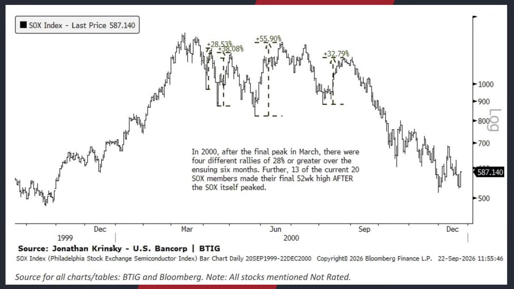

**逐字稿片段：** 我們以費辦來看 費辦大概距離6月份的高點 大概還有接近14%左右的距離 30檔成分股當中有10檔 距離52周高點超過30% 所以它是跟臺股的部分 五六月份當時的高基期概念股有點類似 因為很多股票要回漲 其實有很大很長一條路要走 納斯達克100指數 距離歷史高一點不到1% 但成分股占上年限的比例 其實也不到60% 說明指數現在大家都越來越高 可是上漲動能都是集中在少數全資股當中 有些人說這就跟2000年當時有點像了 我們如果做圖片來做細節對照 當時在2000年前後 其實費辦常常一談就給你談個兩成五 談個兩成八 然後每次都沒創高 結果發現整個頭部 在短短的2000年的半年內已經逐步形成 所以很多人說 2000年的網絡泡沫高點過了之後 費辦只要沒有創高 他就一路的接下來要瘋狂的下跌了 到時候熊市可能就是跌50% 60%甚至70%起跳 當然如果細節觀察 好像有點道理

**話題推測：** 討論費城半導體指數距離高點的表現

---

## 00:07:05

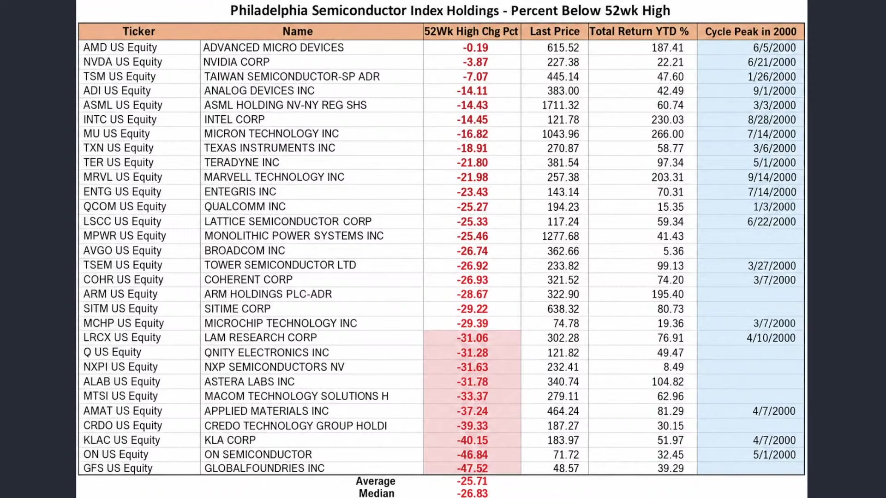

**逐字稿片段：** 30檔股票當中距離52周高點 平均下跌是25% 現在即便談了這麼多 距離高點比較近的就是少數那幾只 比如說臺積電AD 剩下7.1% 輝達剩下3.9% 超維現在只剩下0.2% 可是很多個股其實跌得非常慘 像格羅方德跌了48% 安生美跌了47% KLA跌了40% 所以很多人會擔心2000年事件 是否會重新的重演 把標普52周創新高的加速 減去52周創新低的加速 是-23 這代表最近創一年新低的股票 遠遠比創一年新高的股票來得高 這個就是美國股市的真實概況 那我個人的看法是 其他背後的原因還是一樣 因為真的能夠在AI領域站穩腳跟的 其實就是這少數幾隻大型科技股 我們不能夠想象 所有人在AI產業都能夠語入均沾 所以從股價層面來看 現行的確有點類似2000年 可是從股價其他指數來看 其實有些已經率先帶頭做突破了 那AI又集中在少數科技權值股 也不能夠完全把它拿來 跟2000年來做對照 生產力的不同 還有泡沫加速的不同 其實都是如此

**話題推測：** 列舉台積電ADR、輝達、超微等個別半導體公司距離高點的表現

---

## 00:08:22

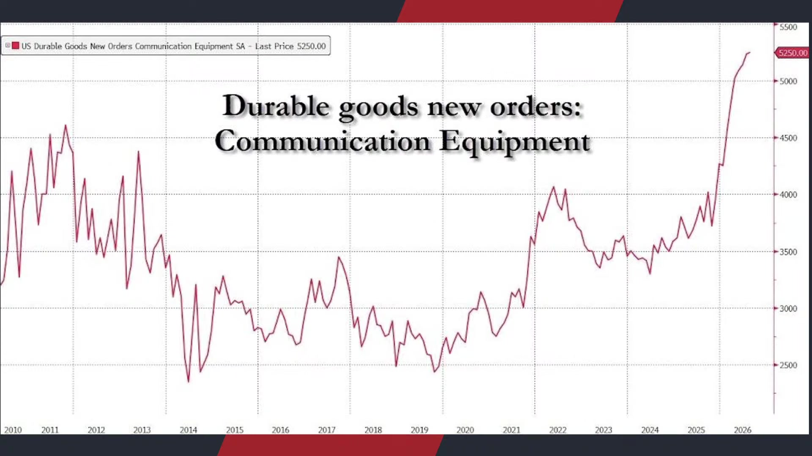

**逐字稿片段：** 那現在我們在AI投資持續帶動底下 另外一個拖動因子的 其實就是美國的核心耐久裁定單 就是我們當然知道 現在AI把大部分的訂單都給吸走了 可是在這次8月份所公佈的耐久財訂單 它至少連續17個月保持在高強度成長 年增幅大概是11.1% 這個是2022年第二季以來的最高水準 這說明著 其實就算是AI可能對於市場有部分衝擊 不過它至少讓明目上的數據表現得更好 沒有AI難道現在的經濟就會變得更好嗎 所以這是兩種層面的一個問題 當然它也就隱含著部分個股 的確有顯著弱化的跡象

**話題推測：** 討論美國核心耐久財訂單數據

---

## 00:09:05

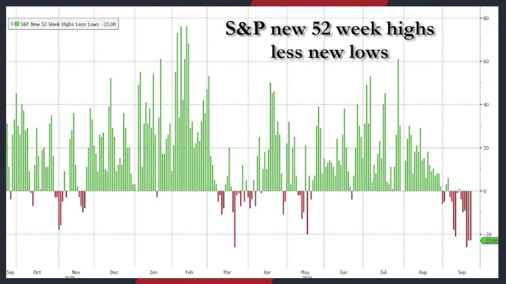

**逐字稿片段：** 我們舉一個比較標準的 麥當勞 麥當勞這部分 最近已經跌到接近要疫情等級了 我們看在整個第二季 美國銅電銷售僅僅成長0.8% 七八月甚至稍微下滑 現在股價層面大概已經跌回到 這算是2022年的慘狀了 這種跌幅其實算蠻重的 上方套羅馬亞也非常沉重 主要來自於低收入戶的族群 縮減了外食的支出 迫使麥當勞重新依靠5美元套餐 折扣和數位優惠來刺激客流 另外一方面 現在牛肉價格又很貴 人力價格成本又很高 公司又要降價搶客 又要面對成本壓力 獲利空間就遭受到兩面夾擊 這就是那種AI概念股跟非AI概念股 雙方所形成的衝擊

**話題推測：** 以麥當勞為例，說明其股價表現

---

## 00:09:54

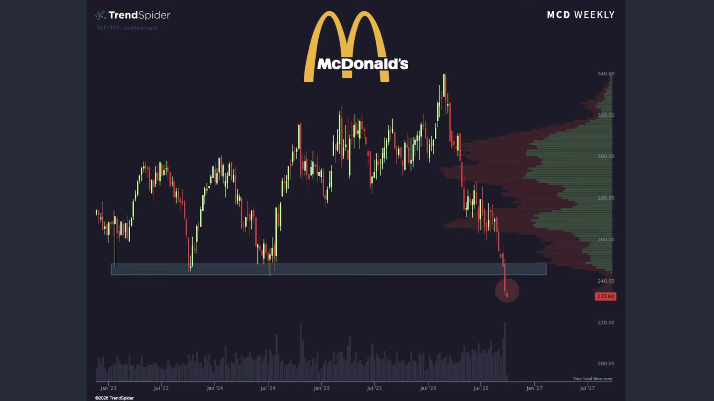

**逐字稿片段：** 就連過去認為具有高強度護城河的穿山股 這一輪的價格表現也不是特別好 道瓊最近表現就稍微差了一點 大家可以觀察到 唯一的好處就是 AI至少把整個經濟數據 稱得相當漂亮

**話題推測：** 討論道瓊指數近期表現疲弱

---

## 00:10:08

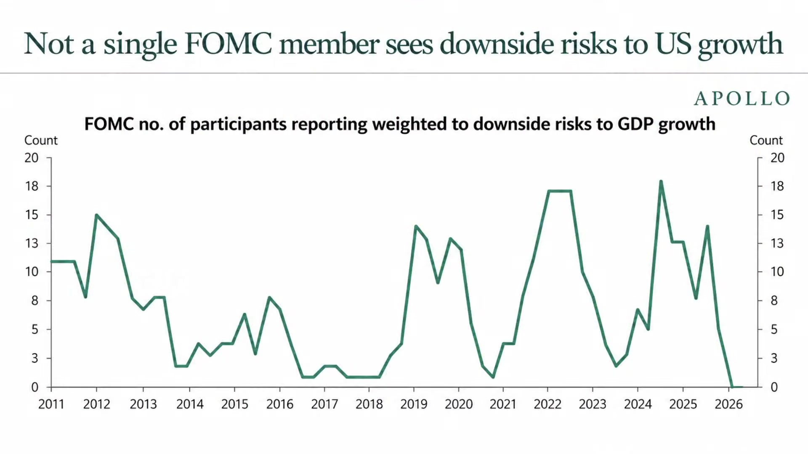

**逐字稿片段：** 漂亮到FOMC聯準會目前的歷史 沒有任何一位成員 認為經濟存在下行空間 我們看這次聯準會官員所公佈 超過400位經濟學博士 提供的研究資源 回顧2012年以來 四次最悲觀和最樂觀的極端時間點 八次案例 每一次股市泡沫破滅 通常都是發生在經濟成長 高強度拉昇的時候 現在問題就來自於 這一次的FOMC 其實也沒有任何一名票委 認為經濟有下行的壓力 要不然早就投給降息票了 所以這就形成了 現在聯總會官員 按照目前的數據 我們不看個體 基本上他也沒有什麼 太多看快的一個壓力 美國股市現在就是如此 幾年之後我們回看2026年 大家可能只記得標普500 站在歷史高檔 覺得這是一段非常漂亮的多頭 但是真正身處其中看到的 可能是美債資利率 它已經突破5%了 再次的波動快速的升高 市場廣度快速惡化

**話題推測：** 探討FOMC聯準會對經濟前景的看法

---

## 00:11:10

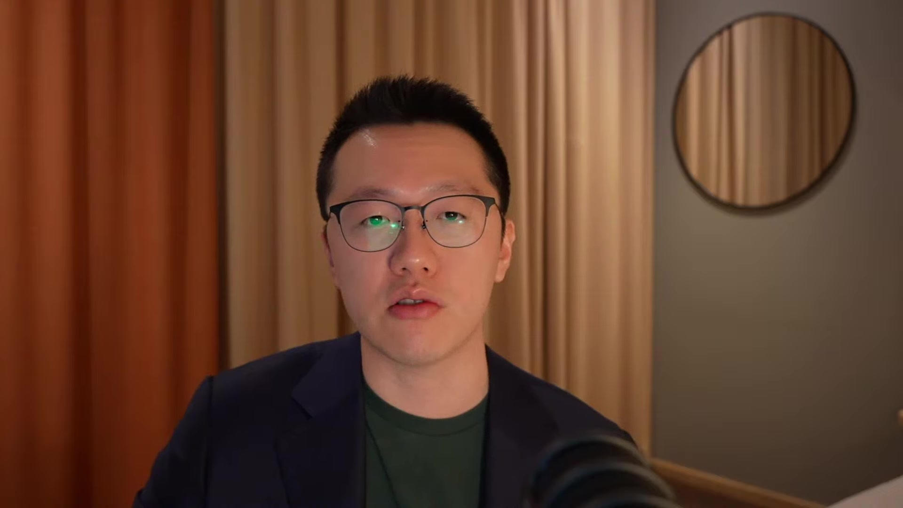

**逐字稿片段：** 就好像2020年 後來股市又創高了 你說2020年不是新冠疫情嗎 對啊 那怎麼會股市創高了呢 海量貨幣寬鬆 甚至現在很多半導體個股 從高點修正了兩三成 也就是說指數看起來很強 但不代表市場裡面每一個角落都很強 歷史上最有可能的 只是留下一個標普白指數當中的一個點 或者一個線或者一個K棒 但投資人面對的 我們要知道當年度的波動 也許比想象中還要來得大 非凡現在很多個股利高點還有兩三成 市場廣度現在轉負 很有可能完全就是另外一個世界 這讓我想到 因為這兩天我剛好去莫扎特之家 莫扎特是神童 大家應該都知道 那最令人驚奇的是什麼 就是除了他有他的專業以外 他最擅長的其實就是幹話 簡直就是我的偶像 因為莫扎特私底下 其實非常喜歡講那些低俗笑話 我還特別去找了一下 就莫扎特 他我們稱之為莫扎特糞便學 就是後代的研究學者們 得知莫扎特家族那個時代 莫扎特寫的信書 書信都非常的 算是屎尿屁齊發 比如說他在寫給表妹的書信裡頭 就有提到說 祝你安眠 但先在床上拉屎 我要在你鼻子里拉屎 我又想起你的便便了 真是太美妙了 我的屁股像火一樣燃燒 他在寫給父親大人的信當中 他也是這麼對老爸講 他說 喂 混賬大人 舔我的屁股吧 除此之外 還有一連串什麼大便真好吃 舔我屁屁 一系列的衝擊詞彙 那這些書 這些信書後來都被保留下來了 我要講什麼 我自從瞭解他的屎尿屁歷史之後 我才發現 雖然他給人家的形象都是比較優雅天才 古典音樂大師 但私底下其實有非常強烈的屎尿屁的幽默 他寫給家人妻子表面 一定要有那種很粗俗的雙關語 簡直是我的偶像 不是更重要的事情是 他還寫了一首詩曲 一個叫倫唱曲 德文我不會念 執意就是舔我的屁股 那是一首歌 那這類作品 都是在熟人或者朋友聚會當中 拿來做娛樂的 那我要講什麼 我要講的概念就是 我們幾百年後想到莫扎特 留下來的印象 往往都是比較優雅 精緻甚至接近完美的古典音樂 可是如果我們翻開他的私人書信 你會發現完全不同的一面 像美國股市就是如此 幾年之後大家回過頭看2026年 你早就已經忘記每一戰事了 你可能覺得 標普白指數當年就是創下歷史新高 美國股市就是一個漂亮多頭 可是真正在其中看到的人 他是美債殖利率的壓力 市場債券市場的惡化 市場廣度的惡化 很多半導機股的高強度修正 所以我們才講說 每看一個點你都是很痛苦的 長期來看你只會覺得 美國股市就很順的就是三代牛 怕什麼呢 所以長期尺度和短期尺度 大家還是要稍微看清楚

**話題推測：** 將當前市場與2020年新冠疫情後股市創高對比

---

## 00:14:19

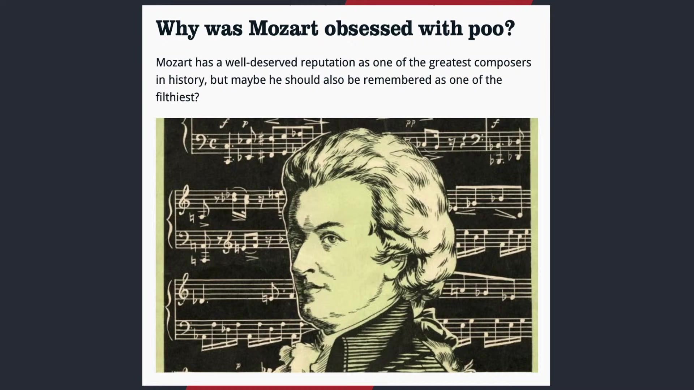

**逐字稿片段：** 好那麼回過頭說 來看一下路透目前所釋出的 Enthropy的招股數 來看一下市場上當然很清楚知道 要給予AI進一步的起量增長 就要端出更為亮麗的財報 這一次文件顯示 Enthropy正在準備要進軍公開市場 潛在估值大概是2兆美元 這是今年5月公司自己估計 9650億美元的兩倍以上

**話題推測：** 討論路透社揭露的Enthropy招股書

---

## 00:14:46

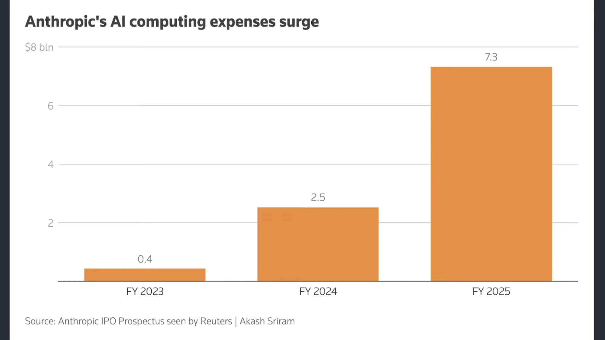

**逐字稿片段：** 這說明著市場給他的估值還是很高 2023年它的營收大概是0 2024年是4億美元 到2025年 直接飆升到46億 一年是增加10倍 這也顯示目前Cloud 在AI服務的商業化 正在快速的擴張 不過路透社所取得的數據 大概也接了另外一層面 就是它所需要的資金也很誇張 如果我們細看 Enthropy目前的運算和基礎設施 它的支出2023年是4億美元 2024年來到25億 25年來到73億 短短兩年增加17倍 所以它的營收增加了10倍 可是它的支出增加了17倍 速度遠遠比想象中還要來得快 這也導致Enthropy在2025年的 上面虧損大概是420億美元 看起來就遠遠超過 46億美元的營收了 當然我們這邊需要拆開來看 其中大約是340億美元 其實是會計上的評價損失 因為公司估值大幅上升 通常你可能就要轉換成 它的Entropy的股票融資工具 價值會因此而增加 那也不代表它真的把421全部燒完了 但至少可以看得出來 它的運營核心 本身還是處於一個非常嚴重的虧損階段 這裡說明著 現在AI商業模式 它很快又要上市了 大家都很擔心 它會不會是下一個SpaceX的慘狀 但至少可以看得出來 在大幅拉伸的過程當中 它的營收和它的負債 大概都是接近要以10倍左右的速度增長 這個就是AI目前所處於的態勢 你說如果只看資本支出 你會覺得有點擔心 可是它的營收是10倍 如果每年都能夠以5倍到10倍的速度成長 那這個產業難道沒有投資的吸引力嗎

**話題推測：** 呈現Enthropy的營收預估數據

---

## 00:16:31

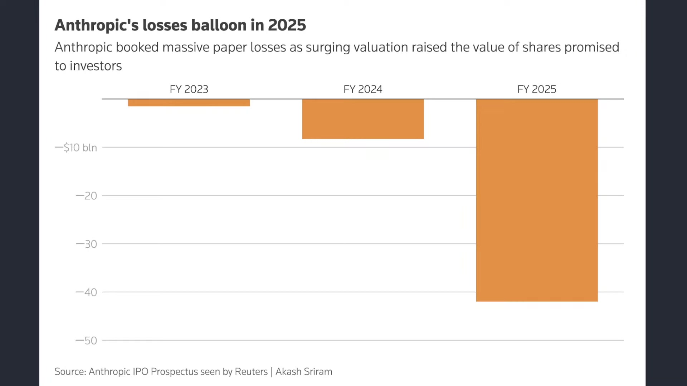

**逐字稿片段：** 其實我們從AI的投資熱潮 來看全球債券市場 就可以完全瞭解 這一輪的利率預期上升 基本上不能夠把大部分的因子 都怪給美益戰士 也不能夠完全怪給川普 也許現在沒有每一戰事 也不能說完全一定百分之百 利率預期會快速的鬆綁 可能會稍微比現在低一點 但也許利率預期還是有機會升高的 因為還是要搶錢 AI在今年的搶錢上太明顯了 尤其現在美國美元已經搶的差不多了

**話題推測：** 將AI投資熱潮擴展至全球債券市場

---

## 00:17:04

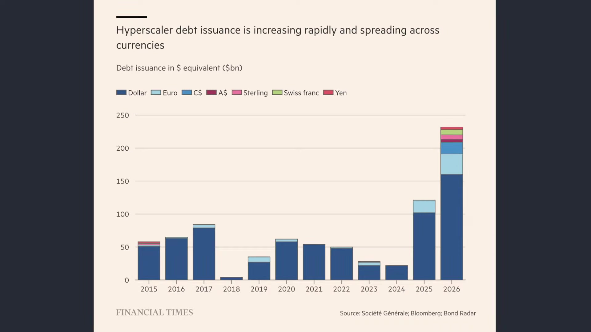

**逐字稿片段：** Meta預計今年秋季 要進入到歐洲債券市場來籌資 加上有亞馬遜 Alphabet 微軟 甲骨文 這些巨頭陸續進入到發債行列 那背後就是資本支出的需求越來越龐大 我們預估在整個第三季 也有可能進一步拉伸

**話題推測：** 討論Meta進入歐洲債券市場籌資

---

## 00:17:20

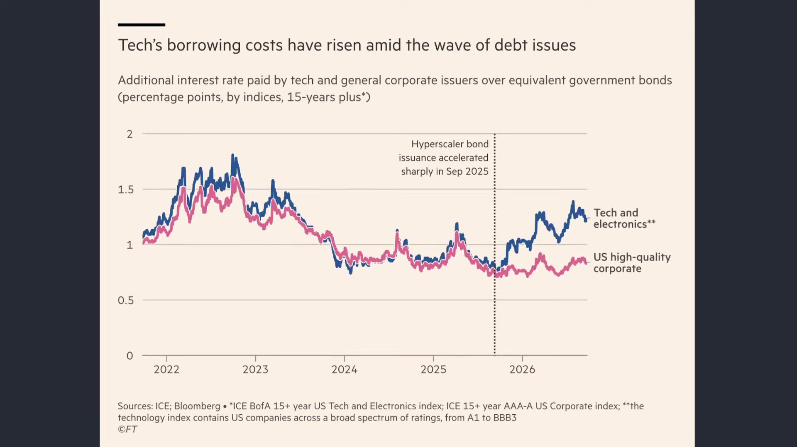

**逐字稿片段：** 像亞馬遜在6月份 加拿大他又發行了140億加元的債券 一舉打破之前Google 才創下85億加元的記錄 結果Google又在澳洲 又發了55億澳元的債券 在瑞士他又募得31億的瑞郎 亞馬遜在瑞士也募了28億的瑞郎

**話題推測：** 提及亞馬遜在加拿大發行140億加元債券

---

## 00:17:40

**逐字稿片段：** 英國最近出現了超長天期國債的發行 Google今年發行了55億美元的 應該講說50億5億英鎊的債券 其中有10億英鎊 期限是幾年 100年 現在大家就瘋狂開 反正7%的短天期的利率 已經幾乎是保底了 有的開到8% 有的開到9% 反正現在就市場大搶錢 那就說明著AI的爆發力 對於這些巨頭來說 很明顯一年的產出 一定是高過於10% 他才會這麼勇敢的去借錢 這也導致了一個現象 除了美國市場以外 非美市場目前的債券成購量 或者發行量也非常龐大

**話題推測：** 討論英國超長天期國債發行，及Google在英國發行100年期債券

---

## 00:18:19

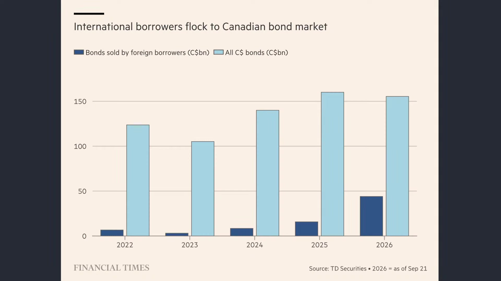

**逐字稿片段：** 加拿大就是我們剛才所提到的 外國借款人現在在加拿大 發行的家園債券 大概是450億加元 去年才160億 那你要知道 2022年到2024年 每年也不到100億加元 這說明著市場上在各地 非美市場瘋狂的發行 已經成為了市場主流需求 不過這也就說明著 市場上現在在AI資料中心的擴張當中 你的本業收入能否證明 你可以吸納這麼多錢就非常重要了

**話題推測：** 提及外國借款人在加拿大發行450億加元債券

---

## 00:18:51

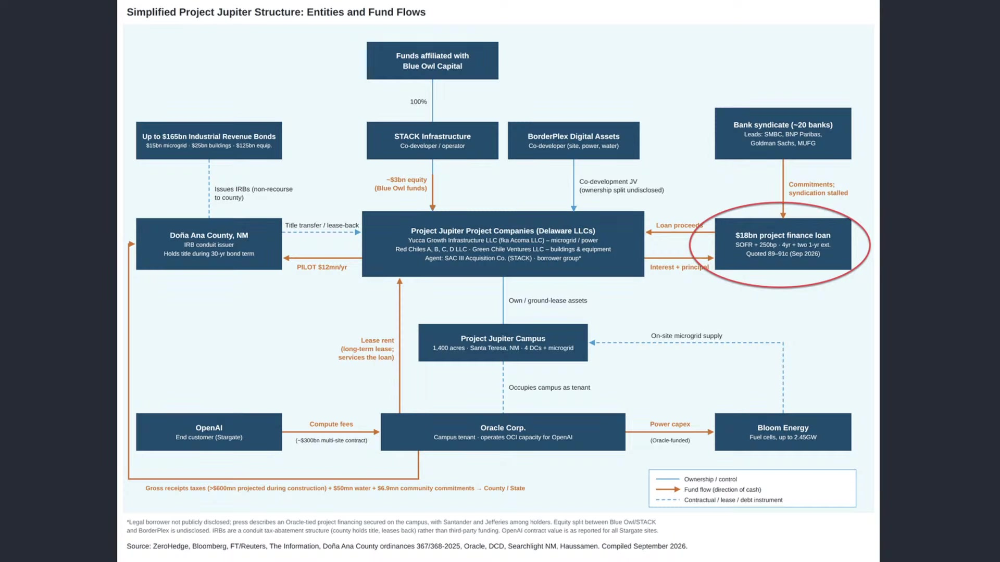

**逐字稿片段：** 我們繼續來說 像軟銀現在旗下的SB Energy 原本預估在9月要上市 估值超過500億美元 但是因為投資人對於估值和執行的風險 產生疑慮 最後延後了 公司的規劃原本要做資料中心 也相當驚人 但目前沒有任何的資料中心正式運營 為什麼 就是你對於新技之門還抱有疑慮 那軟銀旗下的SB Energy 當然要上市的過程當中 大家會給你大打折扣 軟銀現在發行的債券 幾乎等同於垃圾債了 那個殖利率給你拉高到9% 10% 都沒有人要 所以從這樣的一個角度來看 華爾街開始不願意照單全收 而且這軟銀的公司叫做SB Energy 你說叫對不對 名字不是特別好聽 但重點是來自於 債券和專案的融資市場當中 市場上開始做一一的評價 我們舉幾個例子來說 比如說如果細節來看 像甲骨文 甲骨文目前的AI資料中心 上個禮拜我們有提到 在新墨西哥州 木星 人家是星際資本 它是木星計劃 卡關了 當然它表面上說 是因為供電的問題 是因為許可的問題 所以公司是不可抗力的條款 本來2028年第三季 就要完成了第一階段的工程 現在至少要延後一年 甲骨文在2056年到期的公司在地率 現在已經來到8.16% 創下歷史新高了 CDS價格本來已經創高 覺得很誇張 又創高了 一直降頻 現在甲骨文距離垃圾債 接近只有一級而已 你要知道人類的AEI的算力 最大的需求 結果距離垃圾債 它建的錢所需要的資本 基本上只差一級 所以延後也不代表甲骨文 可以不用付錢 因為木星計劃 它的租約還是有采取比較高度的約束性條款 即便資料中心無法取得足夠的電力 公司還是有承擔租金的義務

**話題推測：** 討論軟銀旗下SB Energy預計上市計畫

---

## 00:20:45

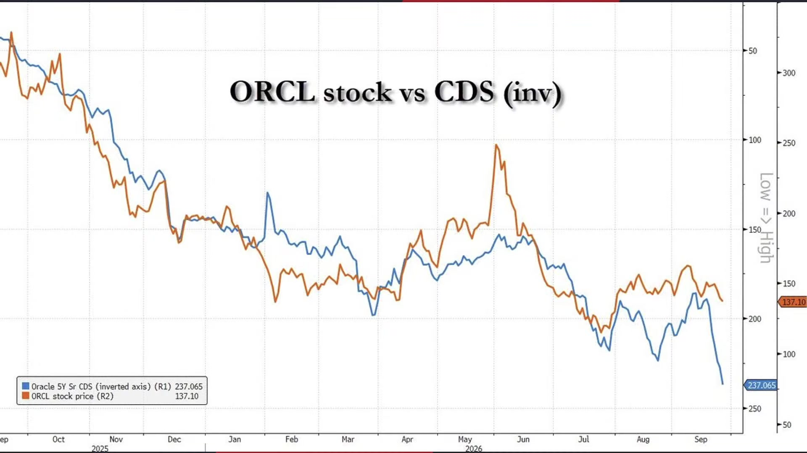

**逐字稿片段：** 大概有20家銀行提供接近180億美元的建設融資 目前賬面損失已經超過20億了 所以從這樣的一個角度來看 整體不管是甲骨文還是Meta 最近發了接近6.5%的擔保債券 某種程度都加深了目前AI債的跌勢 這個就是目前市場上所給予的變化 那你現在如果發展的越快 你的基本面又沒辦法 保持足夠良好的證明 出出的代價來的也越快 所以我們才講說 AI投資的速度有時候越快 需要的晶片 電力資料中心融資就越多 那除非你的本業收入 你的身份證明 可以確保你能夠度過本場為期 或者能夠在AI競賽當中 完美的活下來 要不然現在對於這些企業來說 我覺得也不見得是 發越多債越快越好了 因為已經過了那個時間了

**話題推測：** 討論甲骨文木星計畫的銀行融資與損失

---

## 00:21:38

**逐字稿片段：** 我除了去莫扎特之家以外 最近也有去貝多芬之家 都在維也納市東心 然後去看貝多芬 斷斷續續住了八年的地方 有獻給愛麗絲和費德里奧 然後第五號第六號交響區 也在這一帶創作發展 貝多芬就說過一句話 貝多芬說手指有多快 分貝就有多高 就是你看到AI市場 現在比的就是速度 就是模型要更快 晶片要更快 資料中心要更快 沒有 那個是今年上半年以前 到下半年以後 你越快的從市場資本的評價來看 反而有可能遭受到資本市場的狙擊 所以我們才講說 現在美國股市 你不能夠說完全就是處於極端泡沫 市場上充滿著極度的不理性 因為當前來看 每一輪的產品 市場看起來都會以非常刁鑽的角度

**話題推測：** 引入貝多芬名言，比喻AI市場對速度的追求

---

## 00:22:33

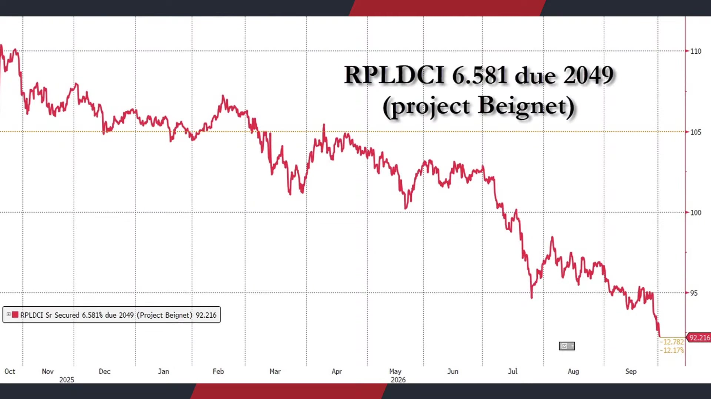

**逐字稿片段：** 來做思維 你像Meta 最近所推出的新產品 它也不見得能夠使得 股價上能夠有效推升 因為之前已經漲很多了 我們看在各大七巨頭層面 所推出的好消息 不管是股票的回購 很多時候都是單日行情 Meta的部分 我們剛才知道 在可擔保 或者說相關科轉債的發行量當中 利率不斷的做提升以外 Meta現在也把過去 看似分開的三條產品線 嘗試的去整合起來 就是AI的大模型代理還有智慧眼鏡 當然還有之前的元宇宙 祖克博也顯示說 最新的AI代理MUSE推出之後反應強勁 上線兩週用戶就已經達到數百萬 接下來還要直接整合到Meta 和Lapoon合作的智慧眼鏡 所以這個時候就要回過頭來看 因為MUSE當時推出以後 的確反應非常不錯 隨時可以呼叫個人的AI代理 但如果股價上 沒辦法一路的往上做推升 就說明著市場還是相信 其他巨頭很快就可以推出相對性的產品 所以AI的競爭看起來是越來越激烈了

**話題推測：** 討論Meta推出新產品對股價的影響

---

## 00:23:38

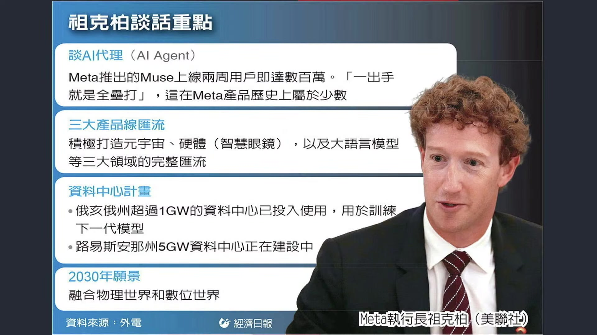

**逐字稿片段：** 最近我們也知道 超微才宣佈以全股票交易 收購了82億美元的李飛飛的World Labs 就預估今年年底就會完成 世界模型最重要的就是打造真正的AGI世界 現在World Labs已經可以利用少數的圖片 來建立一些三維環境 未來能夠進一步應用在機器人 工廠的模組或者科學研究等等 大家都是磨刀霍霍

**話題推測：** 討論超微以82億美元收購World Labs

---

## 00:24:04

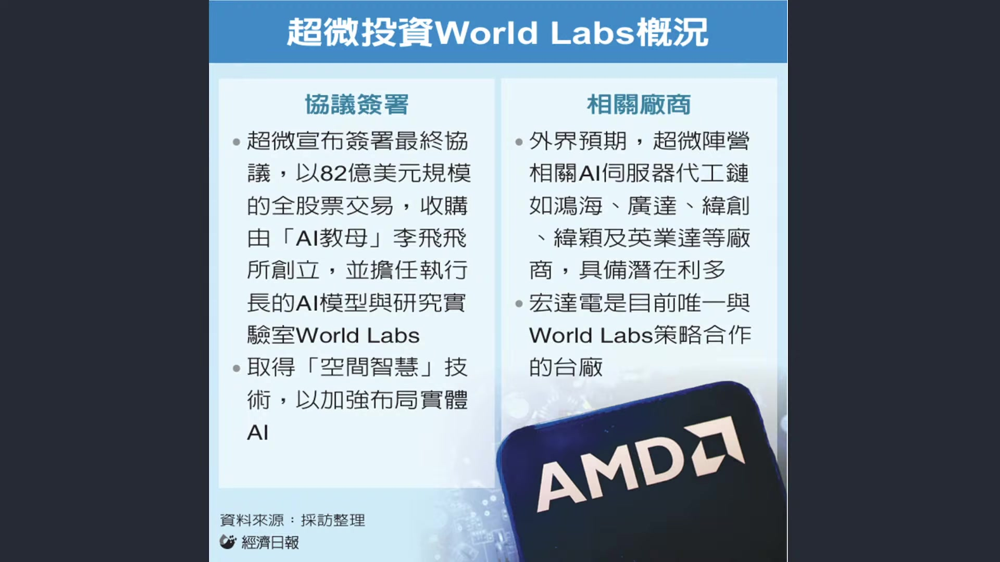

**逐字稿片段：** 輝達的部分也把AI晶片變成金融資產 除了之前的5000億美元的擴張計劃以外 現在開始找保險業進來了 我們到這一輪 日穆基金也搶了一筆錢 債券市場搶了一筆錢 IPO搶了一筆錢 輝達現在正在跟美國的大型保險公司 正在討論新的融資模式 就希望把人工智慧晶片 從單純的科技產品 變成可以抵押可以放款 甚至投保的可投資資產 最理想的構想就是 銀行把錢借給規模比較小的 新興雲端業者 然後以輝達的晶片作為抵押品 如果業者倒閉 晶片二手出售的價格 不足以償還貸款 那就由保險機制承擔部分的損失 這麼多的目的 輝達就是希望 如果沒有亞馬遜 沒有Google 沒有這些科技巨頭 我也希望小的雲端公司 也能夠取得大量的資金 來購買輝達的晶片 輝達希望可以幫助這些中小型企業 能夠向外走出去 這個就是目前輝達所表現的態度 那我講一下我個人看法 我個人的看法是 其實按照Enthropy目前的營收成長 你已經大概可以看得出來 科技巨頭的訂單 其實差不多已經能夠足以去支撐 持續性的投資了 其實從AI的投資估值來看

**話題推測：** 討論輝達將AI晶片變成金融資產的策略

---

## 00:25:21

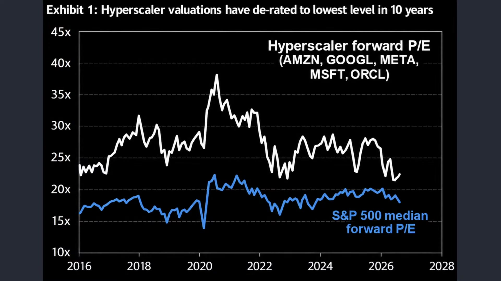

**逐字稿片段：** 我們過去提到 AI預估本益比的中位數 今年4月還有32倍 現在只剩下22倍了 它的股價也沒有跌多少 可是本益比已經下滑了 說明獲利上升幅度非常快 第二件事情 就是像是亞馬遜 微軟或者Google 三大雲端巨頭 目前手上的合約積壓訂單 就已經來到1.69兆美元了 這代表的事情是 其實有非常多的訂單 之所以還無法快速的有效反映 在營收或者獲利 是因為資料中心沒蓋完 根本就不是沒有訂單的問題 因為沒蓋完 沒敗完沒辦法算力做出租 所以這是我們看到的真實效果 那某種程度而言 我們看到這種環境 第一對於消費者是有利的 因為大家還在降低自己的token價格 第二模型還在持續的進步 第三現在市場上最擔心的就是這件事情 有好有壞 好處就是揮達 想要嘗試走出那種非正規方式 來確保小型的AI公司也能夠獲得資金 那往壞處來看 那就是整個系統性的金融壓力 它會持續的膨脹 如果AI最後發現 它只是一個假殼子 它無法成真 那麼當然就是一場泡沫 可是當AI如果不再只是科技業的故事 它開始一路滲透到每個人的工作 企業的創業 現在銀行的融資 到股市的估值 債券市場也被AI給搶光了 主權基金 退休基金 大家都開始把錢陸續的搶光之後 AI的成功 它如果能夠帶來生產力革命 就是全體人類福祉的提升 可是現在重要的是什麼 現在重要的事情就是 不管它成功或者失敗 因為你的退休基金 主權基金 企業的創業 IPO 銀行融資 股市的估值 債券市場 全部都跟AI綁在一塊了 最後就連你可能最不看好它的人 你都不得不希望這場實驗 最後能夠成功 它失敗了 它影響的不是隻有投AI股票的人 在世退休基金全部都會出問題 因為大家最後已經上癮了 這個就是我們看到最終AI的終局

**話題推測：** 討論AI預估本益比的變化

---

## 00:27:30

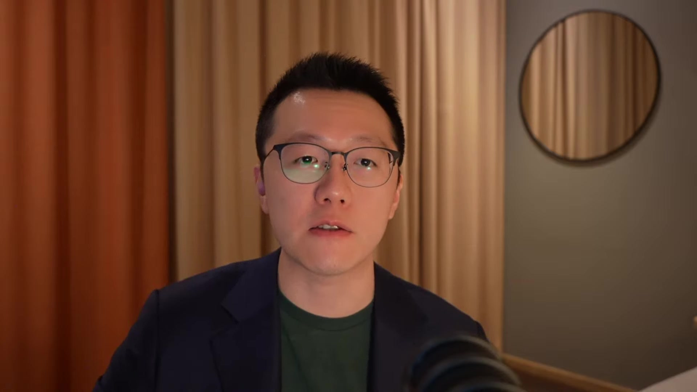

**逐字稿片段：** 大家以前聽過阿拉丁神燈的故事 不知道有沒有聽過尼古丁神燈的故事 之前講說一個客幫的傢伙在海邊散步 突然撿到一盞神燈 他擦了兩下 燈神就冒出來 你有三個願望 男生很開心 太爽了吧 第一個願望陪我抽一根 燈神認了一下 兩個人就一起吹著海風抽完 過了一會 男的又把燈神給叫過來 第二個願望 你再陪我抽一根吧 燈神想說又來 那還是坐下來陪他 兩個人就越抽越忙 開始聊宇宙 聊人生 還有海浪 那不知道 到底人生意義在哪裡 聊了很多這樣子 那傍晚 男人第三次叫燈神出來 那燈神說第三個願望 再陪我抽一根吧 燈神嘆了口氣 行吧 兩個人一路抽 抽到晚上 開始夕陽 看星星 半夜12點多 燈神就一路迷濛的 從神燈裡面爬了出來 問那個男的 第四個願望是什麼 這就是尼古丁神燈的故事 會上癮的 所以我們講說 AI如果成功 它可能帶來生產力革命 但如果最後證明 投入遠遠超過回報 衝擊的 它就不會是單純幾隻AI的股價 它會傳導到 整個市場的企業獲利 信用市場 還有銀行的資產 政府基金和一般人的退休賬戶 某種程度上來說 AI本來是一場科技公司的豪賭 現在沒有 現在變成了全球共同壓住的

**話題推測：** 以尼古丁神燈的故事比喻AI產業的成癮性與不可逆

---
