# yutinghaofinance_fpX071E5yI4 — 關鍵畫面索引

- 來源逐字稿：[yutinghaofinance_fpX071E5yI4_GT.srt](yutinghaofinance_fpX071E5yI4_GT.srt)
- 影片：https://www.youtube.com/watch?v=fpX071E5yI4
- 截圖數：28

## 00:00:35

**逐字稿片段：** 我們一早先來宣傳 禮拜六晚上8點鐘 就是我們財經皓角第四季的聽友會了 每個季度我們都會針對 當前行情來做一些推演 也會針對過去一個季度的 資產操作和行情判斷做檢討 直播分享一些市場動態 那多數的實際觀點會在我們的訂閱 系統和聽友會當中來做一些分享 我們在聽友會當中去 尋找這樣的一個規律哦 至少了解說 有沒有一些行情在波動的過程當中 每年可能會有2到3次 大波段佈局的機會 去尋找這樣的一個過程 當然如果大家對我們內容有更多興趣 也可以來我們的網站來下取訂單 禮拜六就可以直接在 網站上來做收聽了 那對於我們的操作更有興趣 或者一些宏觀的思維 也可以加入我們的訂閱系統 裡頭除了有一整年的聽友會的收聽權 也會有個人資產部位 周志的一些分享 我們一直跟投資朋友分享 收入能夠 帶給你安全感 但是資產才能夠帶來真正的自由嘛 這個世界上 其實大多數人是不太願意思考的 對於財經知識哦 真的有興趣的其實也是一小部分人 這個就貧富差距最核心的問題 就是人做成一件事 往往通常是那個環境的結果 每天聽每天聽 你就知道 對於整個總體經濟 環境有了一定的思維 有時候會這樣子 就是人 因為都是意志薄弱的 所以總覺得好像每天 聽也獲得不了什麼 每天多瞭解新知好像也獲得不了什麼 所以有時候很多的 努力是很難堅持下去的 那這個時候該怎麼辦呢 你就要給自己營造一個好的環境嘛 讓努力能不斷的階段性有成果 你才會得到鼓勵 比如說我的好朋友 那跑馬拉松的 賤芭樂 不對 超馬芭樂 他以前就跟我分享 他說比賽前呢 你可以先把那個路線走一遍 就是你把長長的路在心裡面呢 化成很多的小段 好這樣子你跑起來的時候 就能夠給心裡自己算帳 唉我跑完了一段 又跑完了一段 你就不斷的有成就感 不斷的有希望 這樣子才輕鬆嘛 所以你要了解說 唉自己最終的目的是什麼 收入能夠帶給你安全感 資產才能夠帶來真正的自由 那沒有安全感 至少有安全套嘛 你的左側交易 每被套一次 你都很痛苦 套久了你發現哦 原來部位就是這樣子 一路一路套上來的 建立起來的安全感就來了 那你就自由了 好所以如果大家有興趣的話 歡迎跟著我們一同向前 同時間也要瞭解 每天能夠吸收這些新知 其實很不簡單 稱讚一下投資朋友 好那回過頭說 美股股市這一波大家更為 擔心的是高利率炸彈是否還 能夠讓AI保持在高估值 因為我們不單純是講資利率上升 債券價格下跌的問題 而是這場壓力 它並不是由真正的經濟疲憊所引起的 它反而是背後美國經濟還有韌性呢 臺灣出口很強勁 日本景氣也都在回溫 韓國景氣非常好 讓市場也重新押注 通膨難以下降 那各國央行現在 都在考慮延後降息或者重新升息 日央也升了 韓國央行也升息了 就剩下臺灣了 更棘手的事情是 這些國家都已經把AI視為 下一個階段的經濟主軸 從資料中心半導體到電力設備 某種程度可以說是頭都已經洗下去了 那就算債券市場開始施壓 你覺得這時候能夠踩刹車嗎 這是我們今天要探討的問題 我們先回過頭說 市場上的高利率炸彈呢 之所以持續緊張 一方面是美伊在短暫平靜一個月之後 繼一次重新擴大了交火 美軍在禮拜二對伊朗革命衛隊 發動了3天內的第二波攻襲目標 包括防空雷達佈雷能力 還有相關的通訊設施 進行全面性的轟炸

**話題推測：** 宣傳財經皓角第四季聽友會活動資訊。

---

## 00:04:24

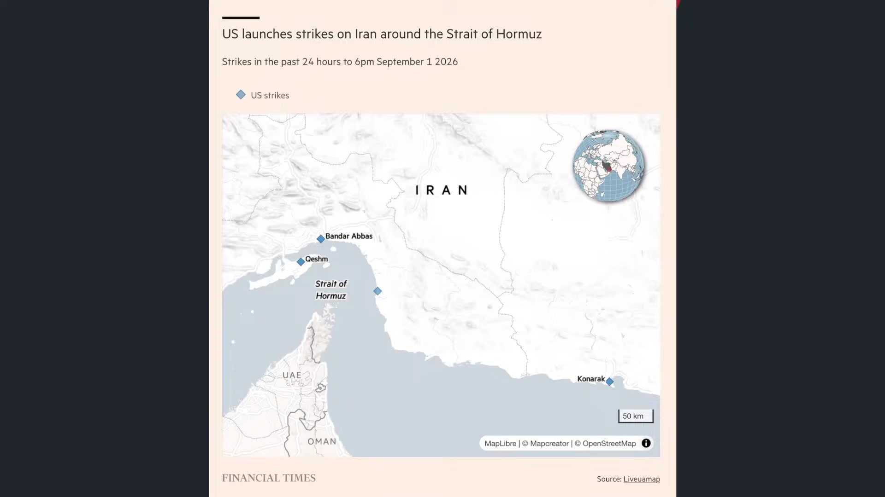

**逐字稿片段：** 那昨天布蘭特原油 已經漲到94.65美元每桶 4.6%西德克薩斯上漲5.4% 來到90.36美元 那比較敏感的還是霍爾木茲海峽了 目前雖然還是有部分油輪來做進出哦 不過仍然處於半中斷狀態 尤其這場戰爭最大的壓力就是從 能源市場一路傳導到全球的利率市場 油價因為現在又逼近到95塊了嘛 所以昨天美國10年 期公債殖利率已經來到4.79%了 哇這是2025年初以來的最高 日本10年期公債收益率也 來到1996年以來的新高 英國國債創下08年以來的新高 好這就換句話說 現在就是戰爭升級 然後油價上漲 通膨粘著性 央行更難降息 甚至被迫要放鷹 殖利率在上升 然後就一路的一路的往下傳導 所以這的確是目前最大的頭疼問題 就是你也知道說高利率 一陣子也不會怎麼樣 但高利率預期不斷的往上拉 10年期公債殖利率 你認為4% 4.5% 5%你也不買 6%呢 7%呢 這是比較大的一個市場壓力

**話題推測：** 報告布蘭特和西德克薩斯原油價格。

---

## 00:05:31

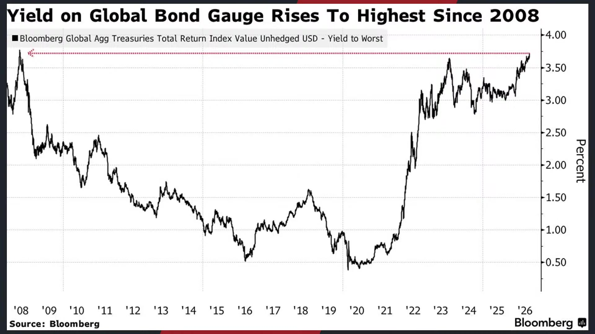

**逐字稿片段：** 尤其30年期公債殖利率 最近重新站穩了5% 高率的高利率的時間也正在快速拉長 你看整個2026年 大概已經有55個交易 殖利率高於5%了 好這個是比2023年的7天 2025年的6天還要來得高非常多唉 甚至比07年的50天都來得高 它就僅次於2006年的91天 那你也知道 06年07年好 當時金融海嘯的前戲 有很大一部分是來自於 利率的收縮所造成的 就利率沒有這麼緊 當時的房地產泡沫還 不知道可以維持幾年了 就由於0706年07年的緊縮政策 所以導致了最終的泡沫破滅 那市場上也會擔心這件事情 當然了現在AI有沒有資產泡沫 從本益比來看是沒有了 不過從借貸量來看 的確是非非常龐大 從各國的殖利率預期來做觀察 就更離譜了 你看剛才提到英國10年期公債殖利率 這一次是上升到5.23% 這是08年金融海嘯以來的最高 30年期衝高到5.87% 好這個是哇 1990年代的新高了 日本10年期公債殖利率在 昨天正式突破3%了 創下96年以來的新高那 各大政府主權債其實 都在顯著惡化當中

**話題推測：** 討論30年期公債殖利率及高利率持續時間。

---

## 00:06:47

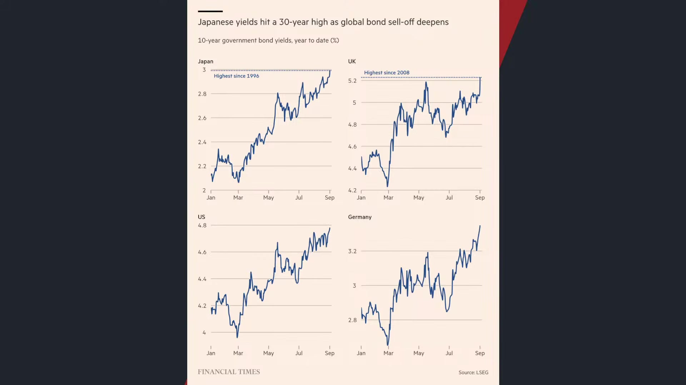

**逐字稿片段：** 好政府財政斥資擴大 然後要繼續發債 超大型的資料中心又為了 要支應巨額的資料中心 繼續的借錢 然後發行大量投資等級債 現在又剛好遇到通膨 又有戰爭 又把資金成本給往上推 所以現在預估了 日本大概9月18號 在貝森特的敦促底下 應該會至少升息一碼 來到1.25% 那你要知道 他一邊在升息 高盛早苗準備在下半年 準備進行大規模財政刺激 以及消費減稅 那這個通膨的僵固性 看起來只會越來越高 好昨天歐元區也公佈了8月 份的通膨數據 從7月份的2.9%上行到3.3%了 已經連續第6個月高於 歐洲央行兩%的目標 好所以幾乎確定了 下周ECB歐洲央行一定是升息 大概是升一碼 把政策利率提高到2.5%了 你你想想看 這個日本也升了 韓國也升了 歐洲也升了 好那美國 那至少不降嘛 那臺灣央行會怎麼做呢 待會我們來探討這個問題 還是意思一下 升個半碼 好但不管怎麼說 現在比較大的壓力其實就來自於 我們不確定AI的需求到底有多大 其實美伊戰事你不要看 這樣子好像很嚴重 它油價就盤在那邊了 它至少不會惡化了 看起來是如此 大家已經完全price in了 更多是來自於AI這些 資料中心的大量舉債 到底這些企業債 投資等級債會搶奪多少資金 很難說因為資本支出上行的 速度實在是太快了 如果我們細節觀察

**話題推測：** 討論政府與資料中心巨額發債現況。

---

## 00:08:16

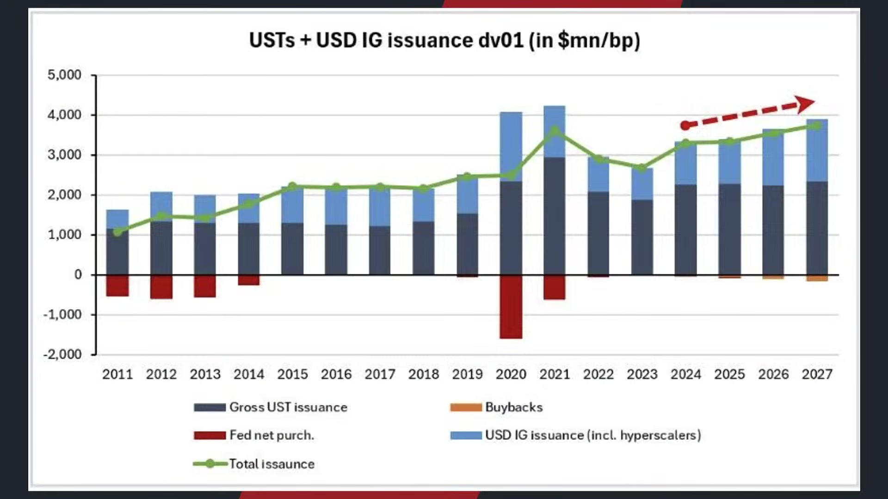

**逐字稿片段：** 好現在從實值數據來看 2024年到2025年 兩者合計的發行的債券規模 大概是接近3兆美元左右 就投資等級債再加上美國公債 那預估27年大概會逼近到4.5兆 尤其AI資料中心 唉今年年增幅從原本預估30到 成長變成80%了 誰知道明年現在普遍預估是60 搞不好提升到90 那發行投資等級債的 速度就越來越快了 好那就會持續排擠美國公債的空間 所以在這樣的一個效果底下 等同於市場上 有那種放到現在投資等級債 很明顯的跡象 那就是你未來要搶GPU 搶電力哦 大家已經完全投洗下去 到了資本市場上 你會被解讀成可能AI需求真的很強 訂單太多 所以必須要擴大資本支出哦 但是到底它是一個 客觀的需求 還是一個主觀的欲望呢 這件事情就是很多人會去質疑的原因 就是很多人會覺得 你們其實根本 是自行創造需求 但是事實上到底有沒有 這麼大的需求你不知道 你只是不想要在這場 chicken game當中落後 所以就瘋狂地發行投資等級債 直到有人撐不住 那你只要是最後一個倒下 或者倒數第二倒數第三個倒下 也許你就不會因此而受傷了所以 有時候真正高明的藉口就是你把 你的主觀欲望包裝成客觀需求 那現在就是問題 就投資人不能夠因為故事聽起來合理 就把想要跟需要混為一談 這個時候就要回過頭來問你看 每一次財報季變變成這樣嗎 你公司每借來的每一美元 未來究竟能夠創造多少的現金流 發行投資等級債對於美國公債的傷害 那是確認的 是客觀的 可是發行投資等級債 對於你公司的業績拉升 我們看得出來 大多數的投資人其實 現在是非常謹慎的 因為為什麼 大家都已經看得出來 有點藉口 你好像嘗試著把你的 主觀欲望包裝成客觀需求 哎這個時候大家就停看停了 那之前網路上講一個故事 講一個男生 發現另外一個男的 長得很好看 那一路跟著他 後來發現他是那個肛門科的醫生 馬上掛號 那開始檢查嘛 醫生 對對對 就是那邊 對對對 那醫生受不了了 先生 這裡是醫院 請你尊重專業 幾個禮拜之後他又來了 那男醫生說你又來 那男的很痛苦 說這是真的有東西卡住 那醫生只好認真檢查一檢查哎 你的屁股裡怎麼有一朵玫瑰花 哦男生很羞澀嘛 醫生 你卡片也要看一下嘛 所以真正高明的藉口就是你 把主觀欲望包裝成客觀需求 對告白 但我們要瞭解的事情就是 其實很多時候 市場上的價格反應呢 已經透露出 大家已經在了解說 你到底花這麼多錢 你只是想把對手給熬死 還是市場的客觀需求比 想像中還要來的強勁呢 為什麼這樣講 因為的確了 從當前的租賃價格來看 大家還在緩步的掉落 但是到底是因為這些 巨頭想要先壓價格 要不然其實現在記憶體價格也在上漲 從以前之前被動元件報價也在上漲 照來講他們的運算成本是越來越貴 你的ChatGPT的訂閱費用 應該要越來越貴的 結果他們還越來越便宜 旗艦模型還在調降價格 這說明著他到底是想要搶奪市占 還是我們的需求真的很強勁呢 這個是市場上 進一步懷疑的原因呢 但是至少投資等級債對於 公債的傷害已經正式出現了 昨天我們有稍微提到

**話題推測：** 報告未來幾年債券發行規模預估。

---

## 00:11:49

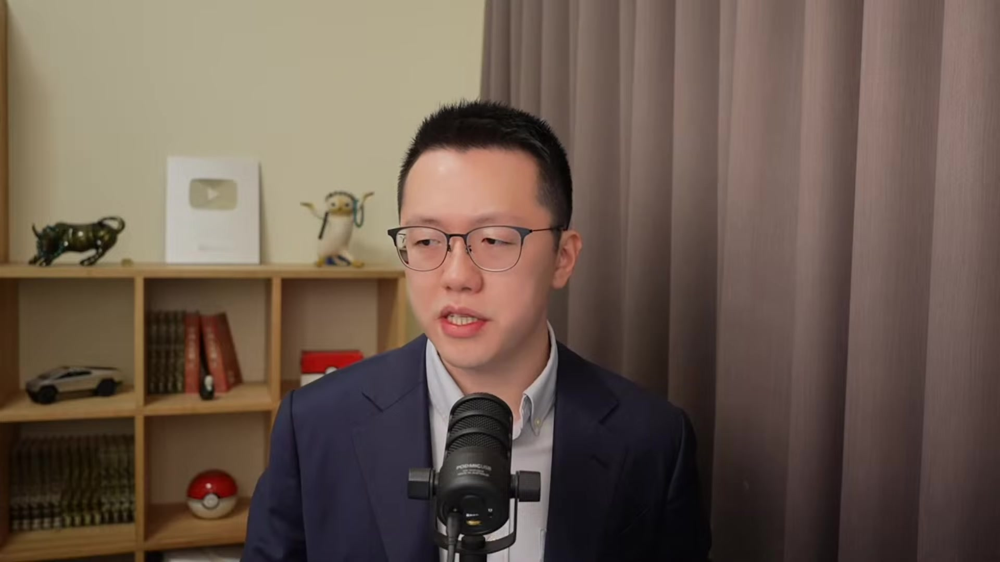

**逐字稿片段：** 就從1986年到2020年跟2021年到2025年 兩個時期的股債配置的角色 它其實 就由於美國公債在這幾年的失衡 徹底讓股債配置 處於一個極端尷尬的位階 我們舉例來說 你在20年到25年這段時間 你持有100%股票 可能平均報酬是17哦 如果你持有100%債券 那大概就負報酬OK那 你的資產配置就會在這中間 的報酬比例當中來做波動哦 所以其實你買股或買債 整體我們看到的市場的波動度哦 其實比想像中還要大非常多 不管做任何的股債82:73:64比哦 可是你看1980年到2020年 過去40年的過程當中 你持有100%的股票 大概是13% 持有債券 大概是接近8% 也就是它其實整體資產的 波動度表現是比較平滑的 所以以前會達到股債配置的作用 它的目的是什麼 目的就是不管我怎麼配我只要 符合我自己的預期 我的績效都不會比 股市或者比債市差太多 哦但是這年頭不一樣 這年頭不成功便成仁 股債之間的波動度 不管如何做配置 似乎都有進一步壓力的放 大好 這個就是現在美國公債的下壓 對於整體資產配置造成的影響 所以臺灣的壽險業為什麼那麼痛苦 這根本原因

**話題推測：** 比較不同時期股債配置的角色變化。

---

## 00:13:12

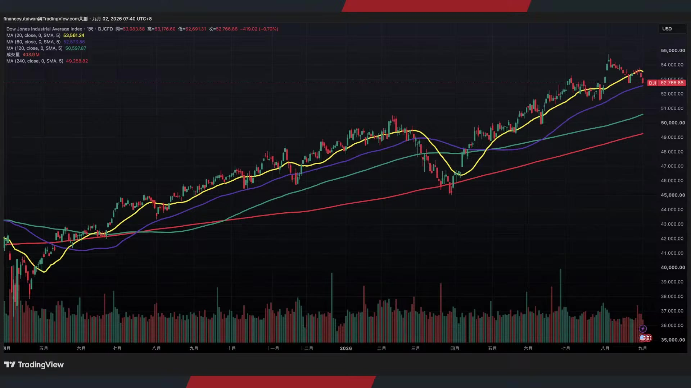

**逐字稿片段：** 好看下四大指數變化 道瓊指數下跌419點 0.79% 收在52,766點哎呦 回到季線了 其實從今年美伊戰事之後 道瓊就沒有回到季線過哎 所以值得觀察一下 標普下跌54點 0.7% 收在7,631點 納指下跌271點 1.03% 收在26,099點 費半下跌246點 2.14% 收在11,288點 哦費半也回到半年線了 看起來是慢慢的跌回去

**話題推測：** 報告美股四大指數當日表現。

---

## 00:13:42

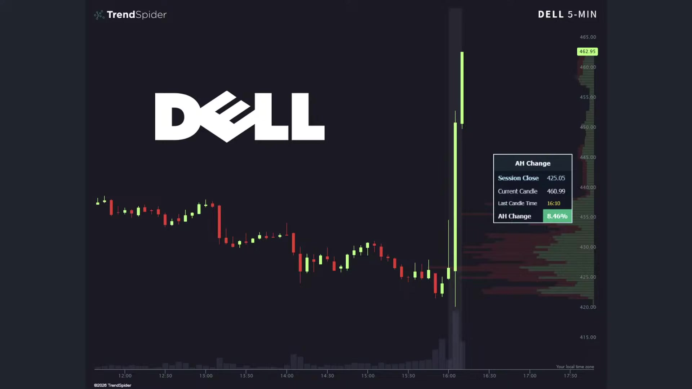

**逐字稿片段：** 不過昨天大友財報公佈表現非常不錯 財報和財測全面優於市場預期 盤後股價漲了接近9%了 不過我們還是要瞭解 因為現在美國股市最 有趣的地方就是市場上 尤其是這些大型巨頭 歷史高點附近持續地徘徊 不過投資人其實也沒有 想像中的這麼樂觀哦 感覺啦大家都在等回檔啦

**話題推測：** 提及大友公司財報與盤後股價變動。

---

## 00:14:03

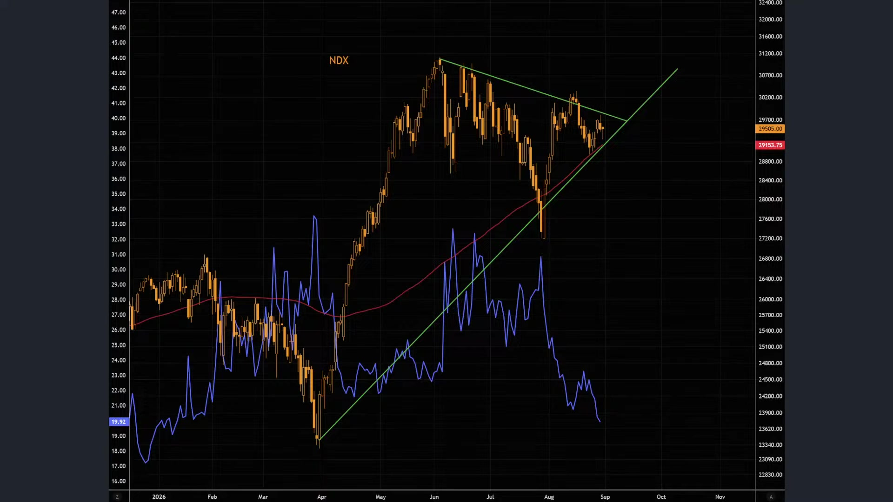

**逐字稿片段：** 我們根據過去3中AAII的空頭比例哦 平均超過40% 但是VIX是低於16的哦 好那過去歷史經驗都是 如果空頭情緒比較高 VIX又低於20的時候 標普通常反而更容易上漲 然後就代表著有人會被軋空嘛 那現在市場就很有趣 就是你很明顯知道大家 也不是很害怕當前行情 可是大家也沒什麼耐心 那只有一種解釋嘛 感覺大家都在等回檔 好其實從最近VXN或者VIX 全部都在下滑 說明市場的避險情緒其實 並沒有想像中來得高了 可是股價就這樣子慢慢慢慢的滑落了 小型股是第一個出現裂縫的 地方為什麼 因為高利率 對於美國股市小型股的利率壓力 它是最為直接的 大企業還可以談到不錯利率嘛 小企業就不行了

**話題推測：** 報告AAII空頭比例和VIX指數。

---

## 00:14:51

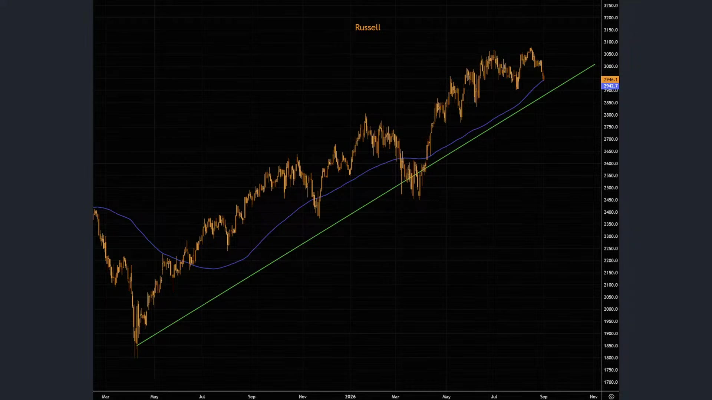

**逐字稿片段：** 我們看羅素2,000 哇近期是一路的回落 數月來首次跌到100日均線附近 所以從這樣的一個角度來看 不能說小型股的多頭結束了 但這一輪的拉回其實還蠻大的哦 而且空頭部位也相當擁擠了 看一下有沒有新一波的軋空情緒哦 但羅素2,000和道瓊哦 最近都開始回撤到季線左右 台股的部分 昨天單日攻了820點 主要是輝達入股聯發科點燃 權值股的上攻 不過呢台股其實從位階來看 其實算偏高了 就從跟韓國股市跟日本股市跟 美國股市跟歐洲股市比較起來 那距離歷史新高就咫尺之遙 反而我們要更進一步觀察 的是日股韓股的概況 台股股市是不是內部 有過度樂觀的情緒 看起來是如此

**話題推測：** 討論羅素2000小型股的近期回落。

---

## 00:15:39

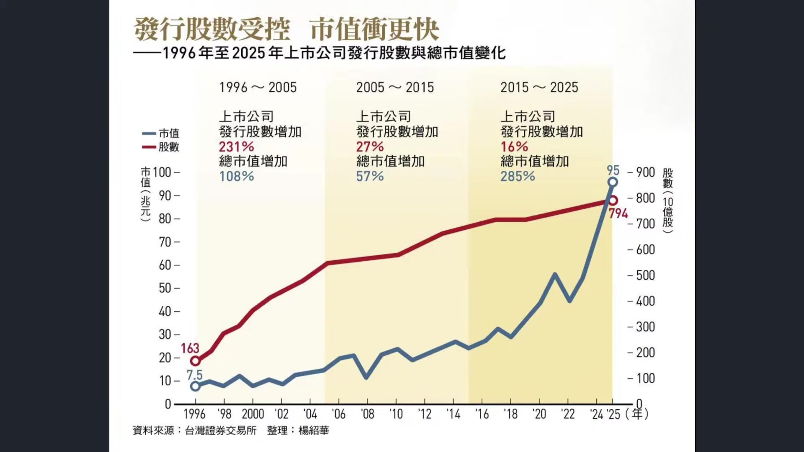

**逐字稿片段：** 日本股市內部出現 比較明顯的資金輪動 這個AI高估值股正在退潮 反而是低傳產正在接上哦 好這跟臺北股市比較不太一樣 主要還是來自於現在 很明顯確認日本央行要升息了 那背後這種輪動最重要的就是利率嘛 像最近像電力瓦斯礦業石油煤炭 日本傳產股最近都在顯著走強 反而是高本益比的AI股最近都在跌落 好像 買盤最多的都是那個三菱 丸紅住友伊藤忠 反正就這些股票 那反而是之前的材料股 股價正在回檔當中

**話題推測：** 分析日本股市資金輪動與AI股退潮。

---

## 00:16:16

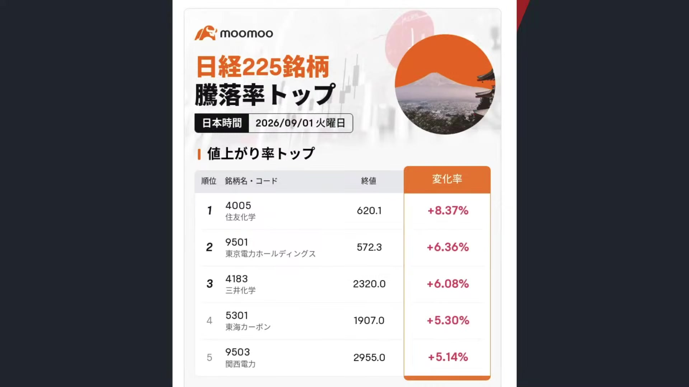

**逐字稿片段：** 韓國股市從7月份的 投機狂潮退潮之後 這個半導體的基本面是越來越強 所以它的本益比其實是越來越低的 好但是股價正在冷卻嘛 哈畢竟7月份實在是受傷太重 韓國股市股民呢

**話題推測：** 討論韓國股市半導體基本面及股民狀況。

---

## 00:16:29

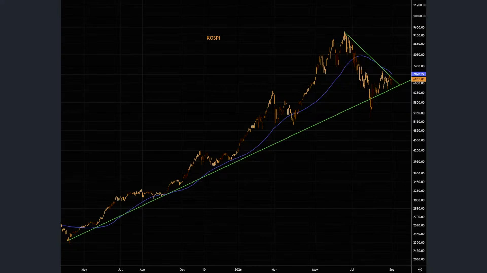

**逐字稿片段：** 最新統計80%在今年虧錢 而且很神奇 今年韓國股市還是 全球表現最亮麗的股市 整體漲幅還是高達40%哦 這是大盤 那結果80%的散戶賠錢 說明所有人都買在五六月份吧 看起來是如此 其實韓國股市現在 避險情緒也並不高了 基本上正在快速的滑落當中 GDP景氣其實並沒有降溫 主要是情緒降溫了

**話題推測：** 報告韓國股民虧損比例與大盤漲幅。

---

## 00:16:53

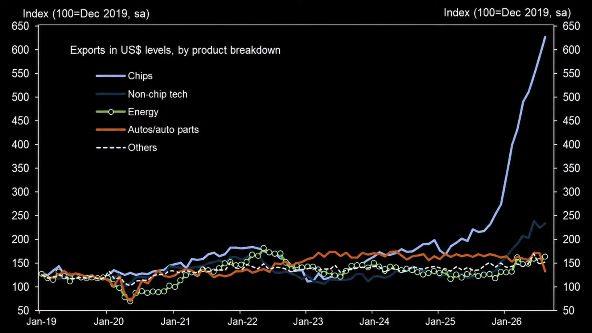

**逐字稿片段：** 我們看8月份的DDRFY價格在上漲了6% 現貨價格已經比8月份的合約價 又高了16%哇 集邦甚至把26年第三季的PC低潤價格 預估季增幅 調漲到18-23% 今年不太可能第三季第四季 電子旺季筆電價格不漲了 這一定要漲了 哇低潤就漲了快兩成 那伺服器和手機低潤呢 也維持差不多的漲勢 雖然隨著產能呢 一路從記憶體往 伺服器DRAM和HBM來做傳導 不過我們就看最後會不會由於手機 和PC消費市場的疲憊而互相沖銷 現在就是價格已經漲上去了嘛 那頂多不買嘛不買那 最後就雙方互相沖銷 價格也漲不動了 最好的方式是這樣解決 如果市場需求還很好 那就完了 那基體價格就一路的往上漲 當然呢我們要回過頭說 從整個PMI的表現來看呢 也許就是我們可以維持在高利率 但是仍然處於高股價的根本原因 我們從昨天最新所

**話題推測：** 報告DRAM價格上漲及未來預估。

---

## 00:17:55

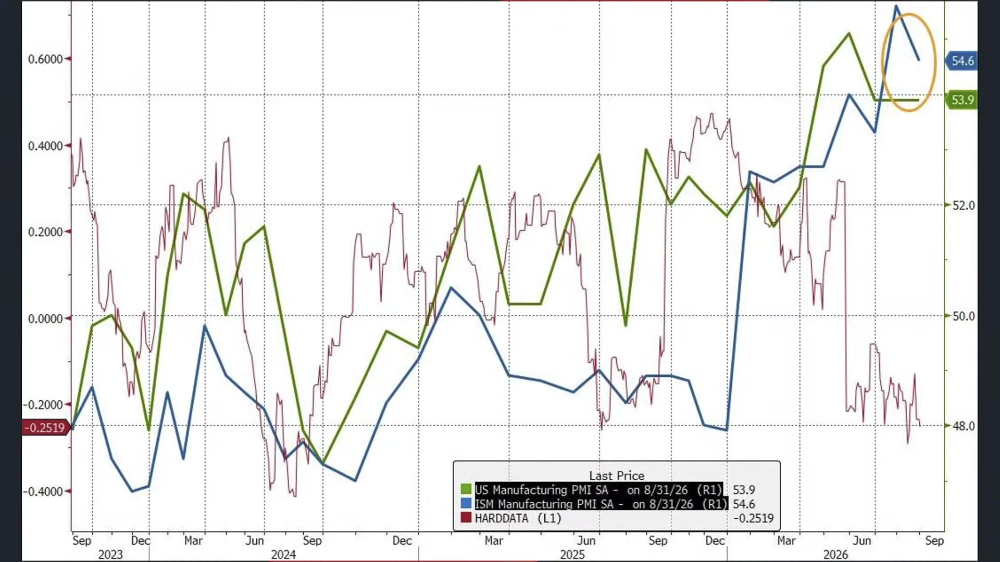

**逐字稿片段：** 公佈的各國PMI來做觀察 美國的部分8月份的製造業 PMI維持不錯的擴張速度哦 標普製造業PMI是53.9 這比預期的53.4還要來的高 i線的製造業PMI是從55.6下滑到54.6 不過呢 整體而言還是接近四年來的高點 說明美國現在的製造業是全面擴張哦 主要是由晶片股來帶動的 所以美國製造業現在就是景氣很好了 那領先指標沒有這麼好了那 如果後來由日韓台來跟上 那其實你也不用太擔心 全球製造業的疲憊 因為看起來只是在高位的波動

**話題推測：** 引入各國PMI數據觀察製造業景氣。

---

## 00:18:32

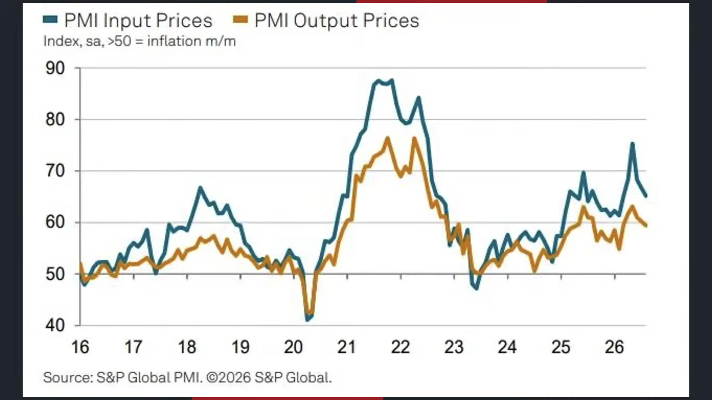

**逐字稿片段：** 你像臺灣 哇臺灣8月份PMI62.5啦 哦它搞不好是全球第一個 先站上6字頭的經濟體 中經院所公佈的數據 已經連續11個月在50以上 創下2021年以來的新高 新訂單和生產都寫下了 5年來的最快速度 那現在問題就 不是訂單的問題 訂單已經爆了 那供應鏈能不能跟得上呢 目前全臺灣缺料配貨交期 拉長的情況越來越明顯 尤其關鍵原物料價格也在持續上漲 好所以PMI現在最大的問題來自於哦 備貨的情緒可能會導致 短線上指數快速拉抬 我講不是台股指數 是PMI指數為什麼 因為怕備不到貨那備 怕備不到貨 你就必須要下單量再猛一點 提前先預估拉貨 或者你怕過兩個季度 那個原物料價格又上漲了 算了算了 半成品 下個季度先多買一點好了好 這是目前所處於的實質情況

**話題推測：** 報告台灣8月份製造業PMI數據。

---

## 00:19:26

**逐字稿片段：** 因為臺灣工業生產呢 哇你看下現行 哦真的出現非常罕見的加速成長 工業生產指數在23年呢 當時低點大概來到81 後來一路反彈 24年來到9025年120 26年146 哦 明年搞不好更高 哦這種高強度的成長 直接讓上市櫃的企業營收暴增

**話題推測：** 報告台灣工業生產指數加速成長趨勢。

---

## 00:19:47

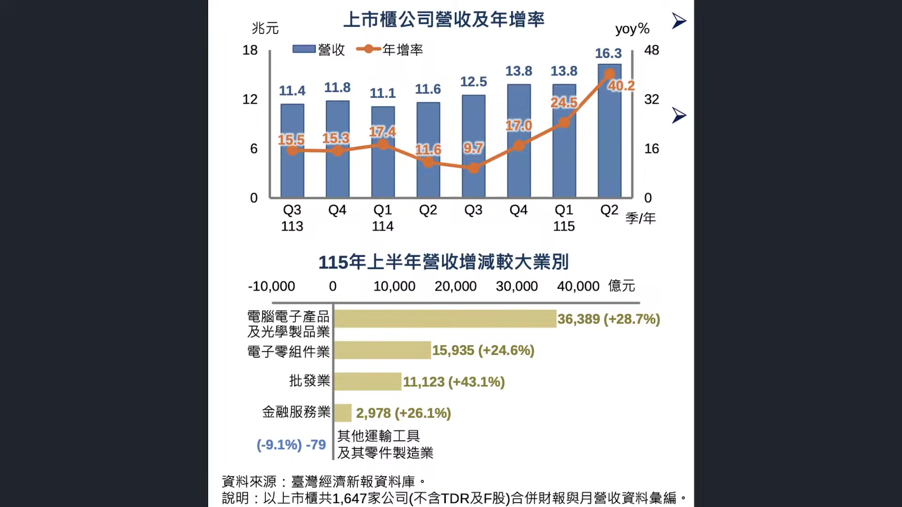

**逐字稿片段：** 上半年已經突破30兆元了 如果是從年增幅來看 也有40.2% 好所以這麼龐大的資金不斷地進來 台股今年的獲利成長 五成 這美國股市頂多也就三成四成 剔除七巨頭 高報只剩下一層到2層 台股今年平均企業獲利是50% 反正說明一定有一堆企業是100%嘛 而且 市場也預估 光是在今年年底就有 可能做更進一步調整 來到55-60%左右 好所以好 這個就是台股今年的盛況 日本的部分製造業連續8個月擴張了 就業增速也來到8年半來的最快 從54.5來到54.9 其實表現還不錯哦 所以我們知道日本 企業訂單現在也不少 主要還是來自於 日本還是有龐大人口在服務業 對於內需經濟可能 形成的高通膨壓力哦 但日本的製造業其實比 想像中還要好的非常多哦

**話題推測：** 報告台灣上市櫃企業營收與獲利增長。

---

## 00:20:43

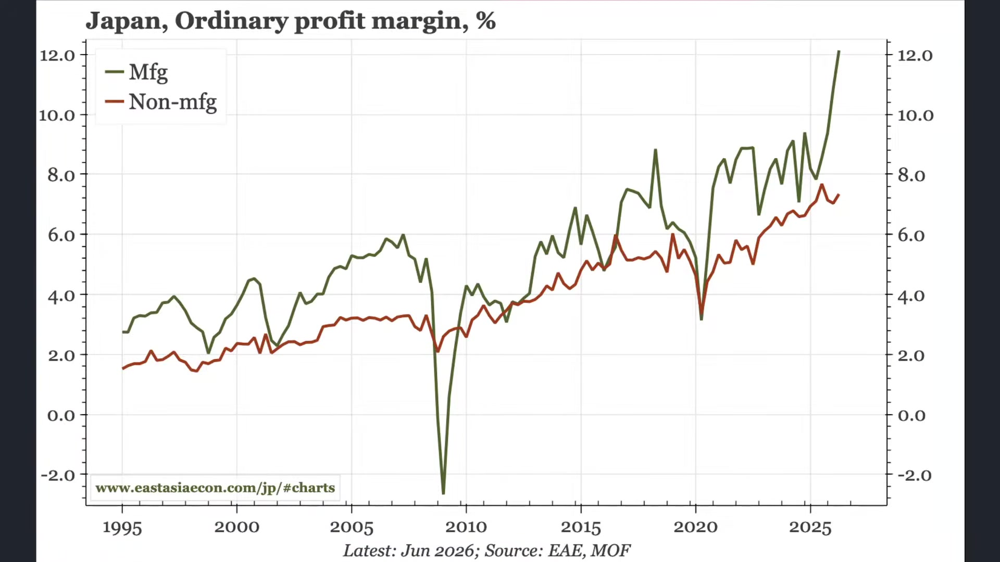

**逐字稿片段：** 我們從製造業的利益率來看的話哇 經營效率已經來到12%了 這是他賺的錢 就是以前大概就是6-9 %左右上下附近嘛誒 現在已經創下1980年以來的新高了 就日本製造業 從來沒有 賺這麼高利潤率過 我們講的不是總量 因為總量大家都創高嘛 而是他賺錢的效率 以前都只能賺8%9% 現在已經賺到12%了 這是真實的一個實際概況 那韓國製造業的部分是 連續9個月的製造業PMI擴張 大概在52.3 成長速度是比較緩慢一點 不過我們也清楚知道 光是記憶體行情 就已經讓整體股票市場 在今年有非常顯著拉升 即便7月份的下挫 今年股市仍然名列前茅 從整個出口和企業所 撐起的經濟概況 企業資本支出增長是目前韓國 企業在未來幾個季度最大的潛力 因為它應該是 台日韓三國當中 少數由政府直接進行 大規模刺激的建廠計畫 不管如何 大家都在向前衝 這給投資朋友做的一些思維 這也直接引發了我們看到 各國針對主權AI的相關投資哦 你看韓國的部分 現在就是想要搶奪美中以外的第三強 哦上周最近有做一個專題哦 來聊各國的一個 AI主權計畫 韓國是從去年就已經啟動了 獨立AI基礎建設開發計畫 它是要求參賽者從0訓練模型 類似那個魷魚遊戲的淘汰制 你不斷地晉升 你就可以獲得更多國家補貼的GPU 好那最後呢 扶持除了美國和中國以外 第三大國的AI模型 哦韓國是主動要做這個主權AI 不希望只停留在硬體層面 所以韓國在25年的APEC 其實已經取得輝達 承諾26萬顆的先進GPU 應該是除了美國除了中國以外 第三大的GPU的供應國 另外一方面 我們也知道前陣子 當時李在明的三大巨型計畫 把半導體實體AI和AI資料降 中心列為國家開發主 核心而且規劃5年把DRAM產能提升一倍 當時就要模仿臺灣嘛 從新竹台中高雄組成 多據點的半導體走廊 讓韓國市場能夠類似於 臺灣這種擴產模式哦 不過韓國的強項並不在記憶體 這件這件事情就 國家級的抄作業還是再看看 而且他們沒有放乖乖 也不太可能成功 不過我講出來他們就知道了 不過至少是看得出來 韓國是想要軟硬通吃 韓國也是最早立立AI基本法 全球少數AI專法的國家 那AI人才計畫 除了韓國政府今年提供所有 韓國民眾可以使用AI的直接額度 進行直接性補貼 你使用AI 由政府來進行付錢 那從大學開始 也全面的AI化

**話題推測：** 報告日本製造業經營利潤率達新高。

---

## 00:23:29

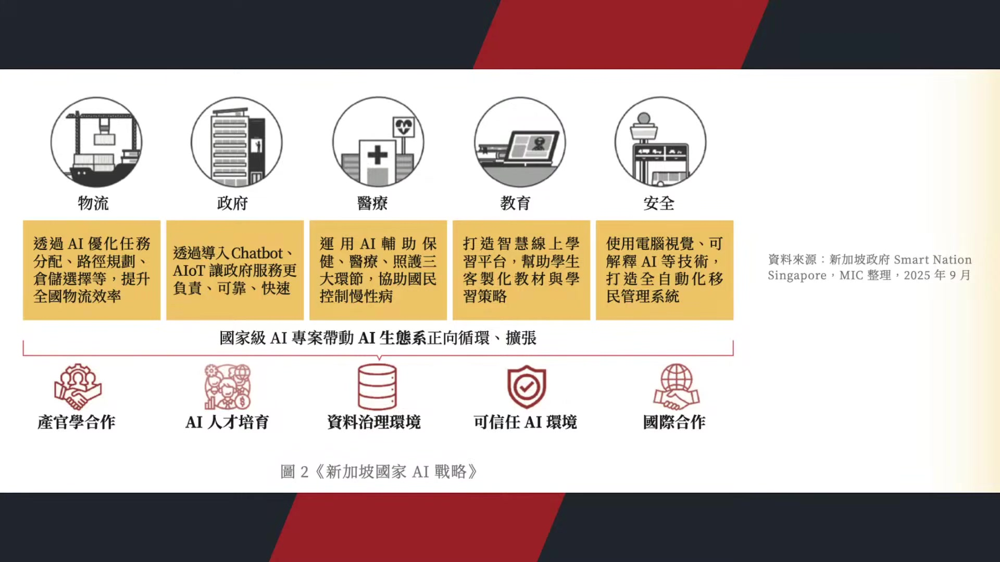

**逐字稿片段：** 日本的部分呢 很明顯它不 並不打算跟美中直接硬拼大模型 也沒有想要像韓國一樣 推出自己的大語言模型 重點在於把主權AI壓在實體AI目前 之前我們講到的Neutra 或者我們看到一系列 機器人和真實世界的物理AI 是日本政府目前所投注的方向 主要是希望在機器人 領域能夠扳回一城 而且因為高市撒的錢呢 比較散一點 他是17個戰略領域全部都收到錢了 從AI半導體量子科技航太生技 能源防衛網路安全先進材料 進行全面性的補貼 好所以 效果會稍微比較散一點了 那高市也是想要奪回 過去曾經失去的勢在 比如說造船 比如說國防等等的 那至少日韓雙方也是越走越近了 然後這一次前陣子我們 看到高市跟李在明的會面呢 就是希望能夠深化 能源和供應鏈的合作

**話題推測：** 闡述日本專注實體AI和機器人的策略。

---

## 00:24:22

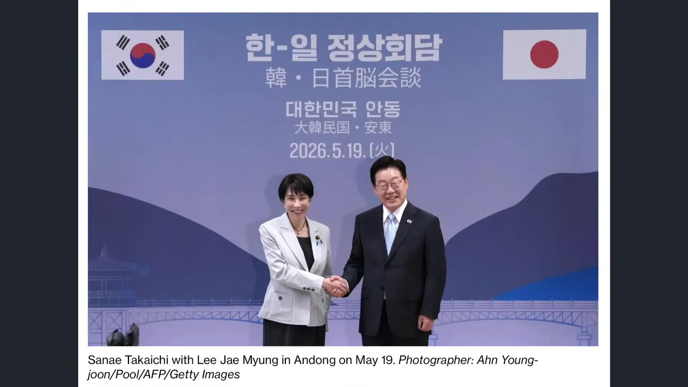

**逐字稿片段：** 那當然回過頭說臺灣 臺灣其實也是如此 臺灣比較沒有那種 很明顯 由國家對主權AI跟他國抗衡的計畫 更多其實是保護目前既有 的產業優勢和AI的護城河 防守端其實主要是繁中通用模型 要不然有時候我們用chatGPT 你使用一些模型 你很明顯感受到它在 參考百度裡面搜尋的資料 它只是把簡體翻成繁體嘛那 你如果說保護自己的繁中通用模型 包括用語的習慣 你像Anthropic有時候常常會回你簡中 哦所以這是比較大的問題 那如何保住主權AI的解決方案呢 目前我們不管是看到偉創 趨勢科技 陸續跟臺灣政府的合作 都是在建立自己的AI能力 不過必須承認的

**話題推測：** 說明台灣主權AI旨在保護繁中模型及擴大伺服器。

---

## 00:25:06

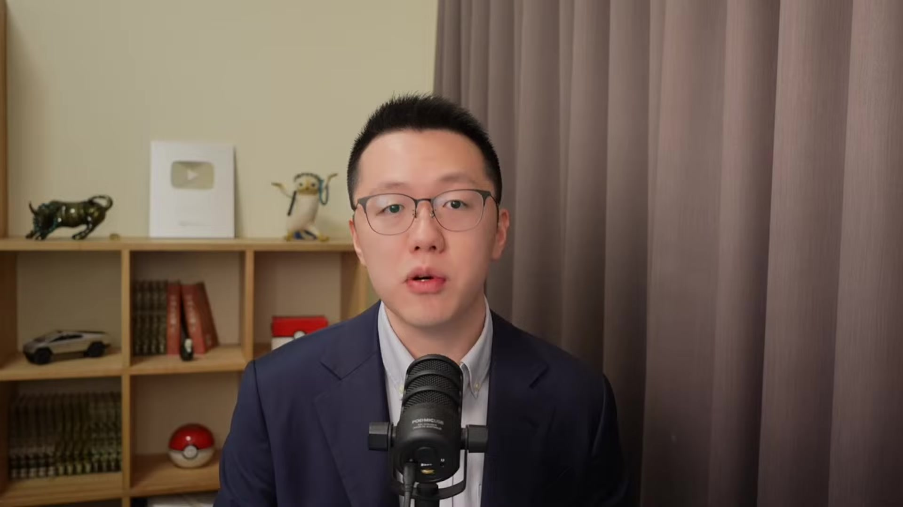

**逐字稿片段：** 如果是全球的AI商業排名來看的話 使用採用AI率指數 前兩名大概就美國中國了 第三名新加坡 第五名韓國 然後再來日本是11名 臺灣是比較落後的 臺灣主要還是在硬體端的強項 這給投資朋友要做一些思考了 不過我們從各大民調來做觀察 其實會發現臺灣整體的強項哦 所處於的出口的增長和民調的支持度 其實並表現並不差 我們舉幾個直觀的數據

**話題推測：** 報告全球AI採用率國家排名。

---

## 00:25:36

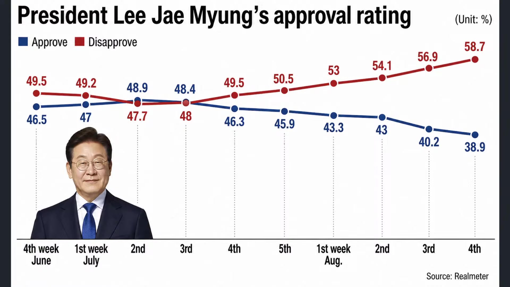

**逐字稿片段：** 你像南韓的部分呢 李在明已經上了1年多了 誒上禮拜宣佈大規模改組 一口氣把財政部更換了 國土安全部更換 司法部國防部 六個部會首長全部更換 核心目標很明顯 支持率創低了 哦這一次李在明的 支持率已經來到接近 這過去半年來的低點呢 大概是接近42普線左右 甚至有民調預估可能來的更低 這一次換掉財政部長跟國土部長 是總統府認為經濟和 房市是最為迫切的問題 但政策方向我猜大概 也不會大幅改變了 因為兩個職位都是 由現任市長升任的 核心政策顧問呢 這個金榮範 金融犯還認識嗎 不是那個犯罪的金融犯 他名字就叫金榮範 金榮範就是那個主張本來 年底才要開放正二杠杆 個股上架的 那個政策金融顧問 提前在今年5月份地方 選舉之前上架的那一位 他要留任了 那新政府還要處理另外一個壓力

**話題推測：** 轉向韓國總統李在明的民調與內閣改組。

---

## 00:26:40

**逐字稿片段：** 就是南韓呢 依照美韓貿易承諾要 投資美國3,500億哦 但川普現在要求你加快落實 軍演還縮短 這個美韓關係很明顯正在惡化當中 好那李在民也要救民掉了 好當然了 很我覺得根本原因還是股市跌了 這股市沒跌可能就完全改觀了 你看南韓現在 市場的波動度 正在快速的回籠 可是你仔細觀察

**話題推測：** 提及韓國對美國的3500億美元投資承諾。

---

## 00:27:06

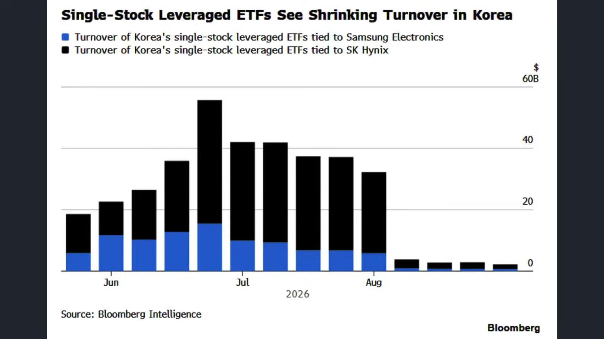

**逐字稿片段：** 從單一股票正二的杠杆型ETF 8月份已經流出了10億美元 這個是史上最大規模的單一 個股杠杆型ETF的流出速度 誒想不到從8月份以後 真的沒有人玩杠杆型ETF了誒 這蠻特別有趣的一個跡象 給投資朋友做些參考 這個股價跌了就怪總統 差不多是這樣的意思 好那高市的部分呢 高市內閣其實目前民調還非常不錯 就維持在62% 之前曾經一度下滑 那食品消費降稅以後 雖然有社會的疑慮 不過大家還是 也有更給他更高的評價 反正你讓我少繳一點稅 擴大一點購買力 那我也像 算是支持你了

**話題推測：** 報告韓國槓桿型ETF資金流出10億美元。

---

## 00:27:45

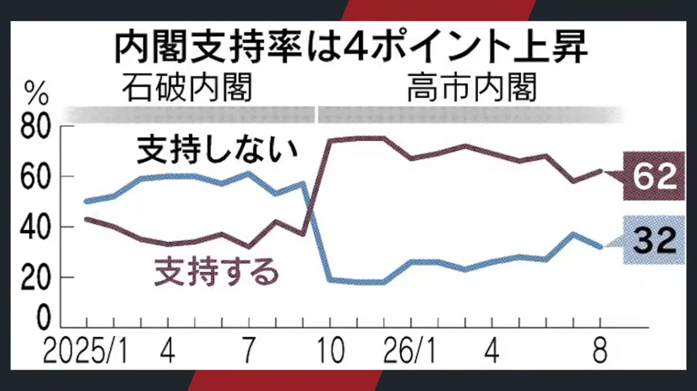

**逐字稿片段：** 因為高盛從27年4月份開始 就會限時 兩年把食品消費稅降為一% 而且向中低收入戶 直接進行現金的發放 有50%的受訪者都是表示肯定的 不過因為消費稅是日本 社會保障的重要財源 高達64%的民眾都擔心減稅會 影響到年金醫療或者照護服務 不過呢 至少在短期內 擴大自己的購買力才是最為重要的 那最後來看下臺灣 臺灣的部分就不用特地講了 你看得很清楚 之前我們提到的 哦從民調專家戴立安先生所 統計的8月份臺灣民心調查 在經濟領域 第一次出現本世紀認為經濟 好的人大於經濟不好的人 好這是第一個觀察重點 那看一下賴總統的總統信任度 我們就不看絕對指標了

**話題推測：** 說明日本食品消費稅將調降至1%。

---

## 00:28:32

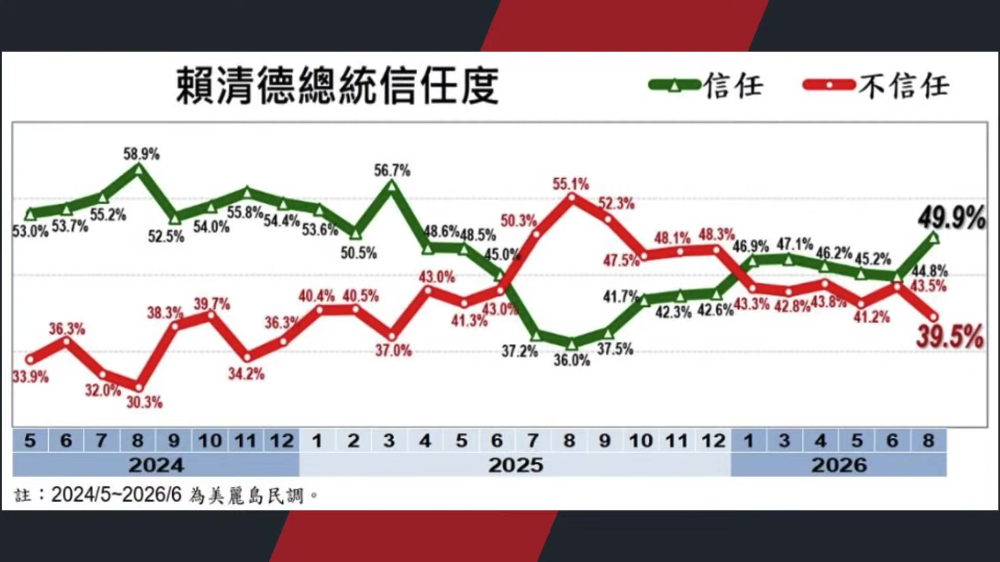

**逐字稿片段：** 絕對指標人家會覺得49.9 他好像不太認同 支持度這麼高 我們看的是趨勢 就是相對於在去年中旬以來的表現 的確從各家媒體交叉比對之後 它是在緩步上升的 所以你可以發現呢 市場上其實最為關注的就是 一個國家到底有沒有普發現金 有沒有進行k型分化直接性的補貼 那對於資產價格的創高 是否一定會有足夠的民意支持 我們從李在民的民調就已經看得出來 要不然今年漲最多就李在明 韓國股市了嗎 臺北股市 還落後于韓國股市呢 但是你去觀察到整個民調 開始出現了比較顯著的變化 可是這件事情幾乎都說明著 三者對於AI投資的需求 都完全停不下來了 日本砸了數兆日元 是主要是壓實體AI嘛 韓國現在是全面佈局 從半導體GPU 更重要的是國產大模型準備要推出了 臺灣當然也推出自己的主權AI 主要是維護那個繁宗的地位 但是更重要的事情是 要把這個AI伺服器 能夠持續擴大 讓台商征服全世界 表面上來看呢 台日韓其實都對於AI充滿了信心 認為這是下一個改變 國家競爭力的關鍵產業 但你這換個角度想 跟剛才的科技巨頭一模一樣 大家的頭都洗下去嘍 你只能看好AI哦 美中是掌握了大部分的尖端算力哦 AI又同時牽動半導體製造業 能源國防和經濟安全 台日韓現在完全停不下來了 我們只能投更多的資源 所以他一定要成功 因為大家都上車了 避免在下一輪的科技 競賽當競賽當中被甩開所以 我們必須承認了 那有時候投第一筆錢 第二筆錢都覺得看好AI 誒覺得可以持續性的投入 可是到第三筆 到國家隊進場 大家都投這麼多資源的時候 你以為他真的很忠誠 他是真的看好AI 但是投到後面就變成 因為無法重來 頭已經洗下去了 只能繼續看好了 誒有這樣的一個感覺哦 所以大家才會對於 資產價格抱持的緊實 因為你現在的投 好像是因為全世界都在投 你跟著被迫一定要投 而並不是單純你相信AI能夠成功 頭已經洗下去了 那之前那老婆半夜 聽到老公說夢話 不要不要 拜託不要 我已經結過婚了 老婆聽到之後很感動 他連做夢都這麼忠誠呢 隔天早上 他老婆很開心地問呢 你昨天是不是有夢到女生誘惑你 老公說 嗯沒有 老婆說 那我一直聽到你說不要 我已經結過婚了 老公想了一下哦沒有啦 我夢到重生 你叫我再結一次 所以大家都投這麼多資源了 你以為他是很忠誠 真的很看好AI 可能是因為它無法重來了 頭已經洗下去了 這所有人一開始都是看好AI 可是前面已經投了大量的預算 建設資料中心 就很多那個蚊子館 頭已經洗下去了 你只能把它蓋完一樣 那後面的投法大家就會 相對的來的更為謹慎 過去的資源變成沉沒成本 各國不斷的追加自己的投資 讓原本的選擇看起來正確 那我們知道市場上已經 慢慢意識到這件事情 開始保守起來了 好我們做個總結好了

**話題推測：** 提及台灣賴總統信任度數據。

---

## 00:31:42

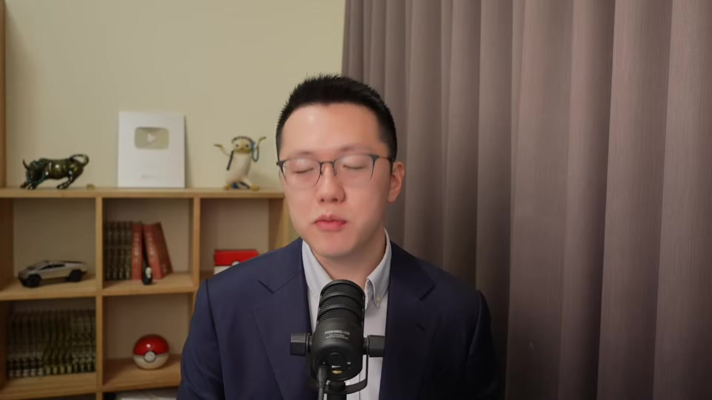

**逐字稿片段：** 臺北股市下跌193點 收在46,760 哎臺北股市現在好像真的跌不太動了 這昨天美國股市不管怎麼波動 對於台股幾乎都沒影響 那我們要回過頭說 我們今天聊很多了 這一輪的債券市場的壓力 你不能夠完全解讀成美國 臺灣日本韓國的經濟要衰退了 更準確來說 因為大家的經濟都還有點韌性 企業投資需求還是很強勁 那反而是通膨降溫速度不如預期 央行也沒有足夠的理由快速降息 甚至必須要保留升息的可能 所以才導致實利率的上升 發債成本跟著升高 利息支出跟著增加 那對於企業來說 代表這些資料中心半導體廠電力 設施都必須要付出更高的融資代價 融資的成本是什麼 就利率成本嘛 那對於投資人來說 那就代表著未來獲利你一定要加快 你才能夠去支撐現在 原本就偏高的估值 或者偏高的融資成本 那問題在於什麼 現在美國臺灣日本韓國都已經 把AI視為全面性的產業升級 只能夠往前投 那前面投了很多的資本 投入很多的政策和政治承諾 現在利率上升可不可以喊停 正常來講 利率上升就要喊停了 因為不划算了嘛 錢那麼貴 可是 為了不錯過下一輪的科技競爭 大家只能 往前衝但市場正在觀察的事情是 AI所帶來的訂單和GDP成長能不能快過 利率和債務資本支出累積上升的速度 那最後現金流跟不上融資需求 終有一天要把大家給拉回來

**話題推測：** 總結當日台股收盤點位及跌幅。

---
