# yutinghaofinance_lDeHFopOfIs — 關鍵畫面索引

- 來源逐字稿：[yutinghaofinance_lDeHFopOfIs_GT.srt](yutinghaofinance_lDeHFopOfIs_GT.srt)
- 影片：https://www.youtube.com/watch?v=lDeHFopOfIs
- 截圖數：25

## 00:00:35

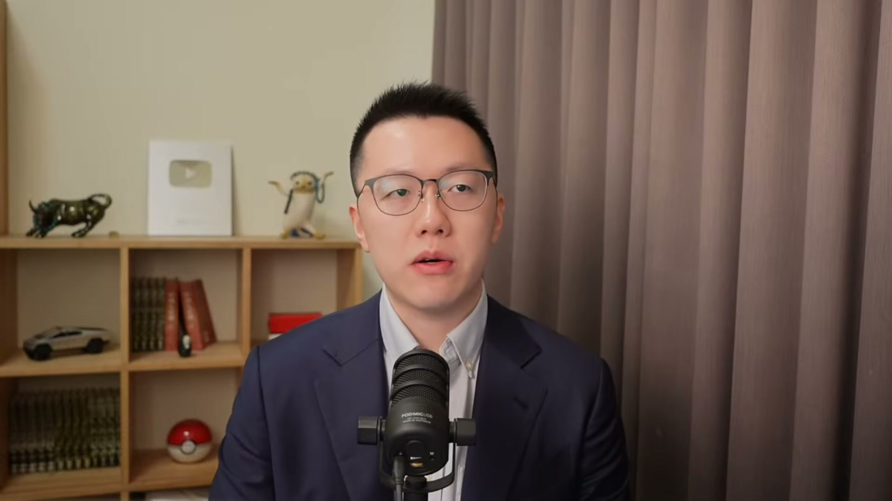

**逐字稿片段：** 禮拜三美國股市交易比較清淡一點呢 因為是盤後公佈財報 那這一次道瓊小跌113點 標普小跌0.02% 納斯達克小跌0.08% 所有人都在觀望 不過呢英偉達這一次在第二季 財報電話會議開始之後 盤後股價就由黑翻紅 漲幅來到2.6% 雖然相對於過去7天的跌幅 這種彈幅也不算什麼 但至少看得出來 這一次公告財報之後 也不算是多大的壞消息 市場上雖然總是以120分來 評價滿分只有100分的考卷 但至少這一次 而股價已經提前先跌了 也無法造成進一步的重挫 不過呢我們也要清楚知道

**話題推測：** 開場轉入美股盤後總覽，可能顯示道瓊、標普、納指與輝達盤後表現。

---

## 00:01:17

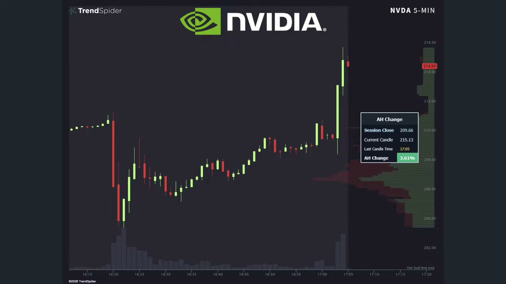

**逐字稿片段：** 因為上一次輝達是在這個禮拜 已經達成了接近連續 7天的交易日的下挫 這個上一次見到那麼長的 連跌記錄已經是2022年了 好的這其實也說明著 一個體量這麼大的股票 你要讓它有進一步估值的揚升 需要非常非常好的消息才能夠往上拉 也就是英偉達已經不再是英偉達 或者說指數能夠大幅創新高的重要 關鍵了它反而變成了一種穩盤的角色 那我們要看的是 作為一個穩盤的角色 它是否有機會把這塊 AI的餅能夠持續地做大 而並不是大家還在存量裡頭做競爭 這是 輝達財報當中最值得看的 並不是有沒有超過預期 因為每一次都超過預期 它股價也沒漲嘛

**話題推測：** 開始討論輝達連續下跌紀錄與歷史比較，可能切到輝達近幾日股價圖。

---

## 00:02:03

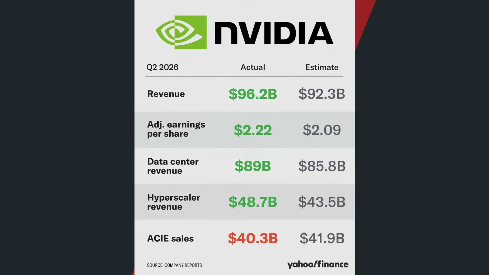

**逐字稿片段：** 你看你它的2027年 會計年度第二季營收是962.2億 它也比預期的921億高很多 誒年增幅106% 調整後的EPS2.22塊 它也比預期的2.1塊來得好 單季淨利去年同期247塊 現在是539.5億美元呢 所以這代表AI資本支出 完全沒有任何明顯的降溫 那輝達的財報也是明顯高於預期 真正誇張的是資料中心的業務了 是單季的營收 哦這個就跟AI大家的需求有關 營收來到890億美元 年增幅是117% 哦這個就遠遠高於市場預期的863億哦 目前資料中心的業務已經 占了輝達總營收92% 在5年前 是遊戲營收占了92% 現在是資料中心占了92% 所以整家公司基本就是全球AI基礎 建設投資當中最為直接的縮影 只要大型科技公司AI實驗室 還有各國持續擴建算力 那輝達就是站在最前面收錢的人 而且這波需求哦 已經不單純只靠以前那 幾家超大雲端公司了

**話題推測：** 提出輝達第二季營收、EPS、淨利等財報核心數字，可能顯示財報表格。

---

## 00:03:14

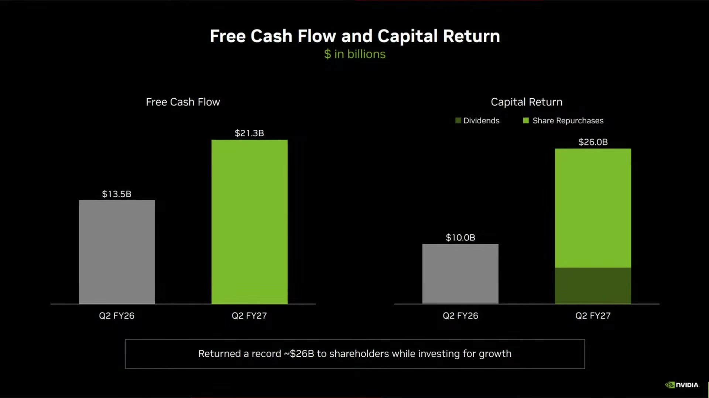

**逐字稿片段：** 第二季的超大雲端規模公司 供應大概有487億美元的營收 比去年增加一倍哦 那AI雲端和工業甚至 其他客戶也有403億哦 年增幅來到138% 那這個變化其實是很重要的 因為大家都很擔心 就是輝達以前的客戶就是那幾隻 四大CSP業者 誒現在新的AI實驗室 新創公司 加企業 加主權AI 就很多國家有政府的預算了 已經可以占一半左右 的資料中心營收了 客戶結構正在逐漸的擴散 就跟以前台積電好不好 那基本就完全看蘋果 的手機賣的好不好嘛 而現在不一樣了 它看輝達好不好 那輝達也一樣 以前好像只能看四大CSP業生 現在只有一半是四大CSP業生 其他好都是從工業客戶企業客戶 還有主權AI來做進一步的營收拉抬 好這個就是黃仁勳所說的轉捩點了 過去最尖端的大模型都是 少數幾家公司來做推動 但現在越來越多的AI實驗室 它是同步的去擴大AI算力 開放模型 企業AI或者實體AI 現在也進入了部署階段所以 AI基礎建設 我們不要再說它完全是Openai 完全是Google微軟的軍備競賽的天下 有一點明顯的外溢效果開始出現了

**話題推測：** 開始拆解超大雲端客戶與AI雲端、工業、主權AI客戶結構，可能顯示客戶來源分布。

---

## 00:04:33

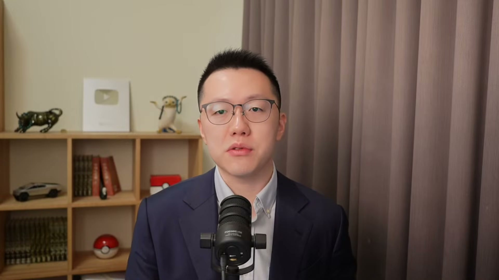

**逐字稿片段：** 更重要的事情是 對於未來的預期投射 英偉達預估在2028會計年度 就是2027年 它的營收可以成長 持續保持在70%哇 那等同於 即便我們過去曾經 擔憂有年增地環的效果 看起來輝達是有機會可以打破哦 那股價會不會如同以前一樣 5,000億變一兆 然後過了一年一兆變兩兆 再過了一年兩兆變4兆 然後再過一年4兆變8兆 然後8兆變16兆 16兆好像有點難度 因為市值體量太大 它是全球第一名市值體量大的企業 也沒那麼多錢 可是如果我告訴你我的營收 明年還可以漲個7成 股價漲個兩成三成不為過吧 尤其現在本益比又這麼低 甚至在第三季的財測也延續這個方向 輝達預估營收會來到1,080億美元 上下浮動兩% 好這比市場原本預估的1,042 億美元還要來得高 而且重點是 輝達直接把 中國資料中心的業務給剔除了 不納入財測 所以這C1是一個算是蠻 保守的一個預測值 都比市場原本的高標 還要來得更為靚麗 那的確了 中國這幾年 它也變成了一個相對次要的變數 雖然美國政府已經開始允許輝達 向中國銷售部分比較舊的晶片 好但實際出貨看起來還是非常少哦 中國相關產品可能連一趴都不到哦 所以至少從現階段來看 即便缺少了中國市場 輝達都還是可以做到 千億美元的單季營收 如果真的有一天美中和解了哦 那就不得了了 不過大家也 不期不待 不受傷害

**話題推測：** 轉向輝達對未來營收成長的預期，可能顯示2027或2028會計年度成長預估。

---

## 00:06:04

**逐字稿片段：** 那值得觀察的效果其實還是毛利率 就是輝達第二季的 毛利率還是維持在75% 這對硬體公司來說還是非常驚人的 第三季預估小幅下滑到74 明年的話可能會來到71-72 那完全不代表產品失去定價 能力了好 那因為記憶體價格的漲幅 很明顯比GPU漲幅還要來得快嘛 以前是缺GPU 現在GPU裡頭的記憶體晶圓 其他零組件也在快速 成本上升 所以AI熱潮 推高了整條供應鏈的價格 那英偉達自己也承認 目前記憶體 供應的確非常非常緊俏 就是AI的大幅擴建所造成的 那GPU需求的增加 需要搭配更多HBM和 其他的高階記憶體 最後變成一個很有趣的現象AI越強 偉達營收越高 然後把自己的零件的成本也往上推 好最後呢 未來幾個季度的營收可能高速成長 好但毛利率不一定會跟著創高 這是最終的一個結果 所以大家要有心理預期 毛利率在這種記憶體的漲價效果底下 不太可能一路的往上拉

**話題推測：** 轉入毛利率與記憶體成本壓力，可能顯示毛利率趨勢或HBM供應鏈圖。

---

## 00:07:05

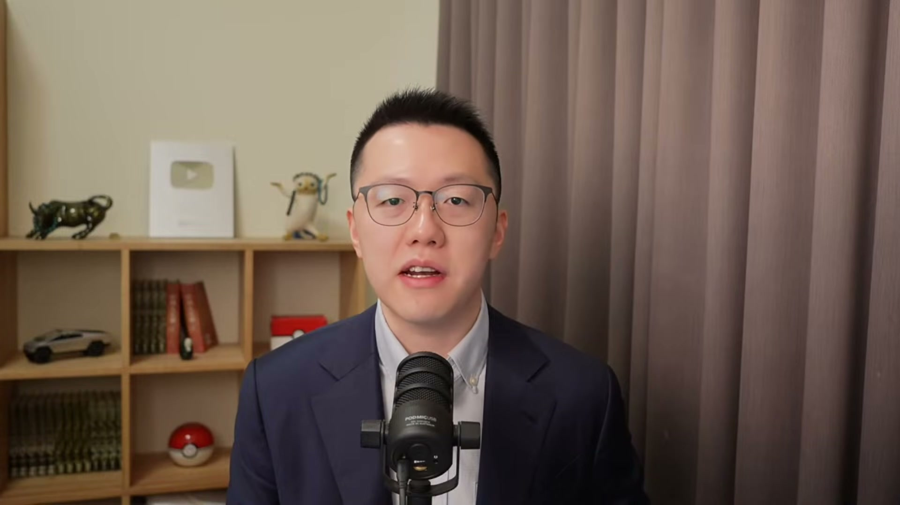

**逐字稿片段：** 當然了第二季輝達的採購承諾也 從上個季度的1,190億美元 一口氣 直接來了2,790億 這看得出來 匯達很緊張哦 哦他雖然要生產這麼多貨等著收錢呢 可是短期內發現成本上升這麼多 會大幅的影響到自己的毛利 唯一能夠做的是什麼呢 為了以防未來上漲更多 提前備貨 這個通常都是人家提前備輝達的貨 以防買不到貨 現在是輝達提前備季一體 以防他買不到貨 好所以這一次財報 我覺得最重要的訊號 並不是單純營收或者 採購承諾或者一些 毛利率的數據 重點是 輝達現在用自己的資產負債表提前去 卡住記憶體晶圓還有AI基礎建設 這件事情呢 意味著 他比任何人都還要更為看好AI 目前財務能力也非常驚人嘛 輝達第二季居然還做 大量的股票回購哦 股票回購加鼓勵就支出260億了哦 5月份當時我們又知道額外授權 800億美元的股票回購額度 他真的錢很多了 好所以可能是 全市場當中自由現金流體 量流進來速度最快的 所以就不斷地投入供應鏈客戶生態系 甚至買自家股票來 進一步鞏固市場的位階 所以從這個數字來看 AI資本支出 目前看起來 年增幅都不一定見到高峰哦 更不用講單月單季營收 下個季度要準備突破1,080億 採購承諾也在創高 所以很明顯 這份財報最後端出的效果 那就是現在不是景氣循環 現在就是整條AI基礎 建設競賽的初始段 好這個是輝達透露出的 一個AI的增量市場 那當然了 我們要看第二步 就是真正的競爭是否代表著 英偉達仍然掌握的全面生態系統 因為哦如果只看AI晶片市場 那輝達當然是霸主 可是它面對的競爭已經 不單純是AMD的追趕了 現在是四面八方一起包圍

**話題推測：** 提出輝達採購承諾從1190億跳升到2790億，可能顯示採購承諾大幅增加的圖表。

---

## 00:09:01

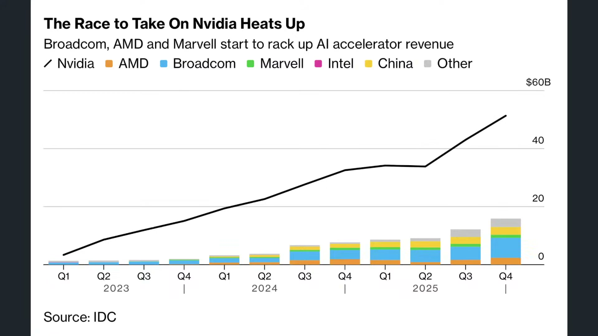

**逐字稿片段：** 你看亞馬遜Google 原本這些最大的客戶都 開始自己設計晶片了 像博通Marvell靠 客制化晶片快速的切入 Openai Anthropic甚至把晶片 研發掌握在自己手上 亞馬遜是最典型的一個例子 亞馬遜呢 把自己的半導體業務 拆成一家獨立公司 年營收已經有250億美元 而且還是以三位元數的百分比速度成長 問題是亞馬遜現在又是 英偉達最大的客戶之一 所以這個市場的關係很微妙 今天的客戶就是明天的競爭者 而且規模還大到足以去 建立完整的晶片平臺 那即便如此哦 雖然它的競爭者現在越來越多了 可是英偉達領先幅度還在持續加大 好所以也不用說擔心說現在 大家都跳下來自己研發晶片 所以輝達會受到影響 是沒錯 市占率是有可能稍微影響的 可是即便受到這麼大的一個衝擊 輝達市占率還是有90% 第二 它是一個增量市場就好像 長鑫存儲崛起之後 你覺得三星美光 海力士真的壓力很大嗎 那是一個增量市場 你就算切進來 拿走一點市占率又怎麼樣 這是一個市場極度缺貨的時代 我自己賺錢都來不及了 還跟你競爭呢 現在市場大缺貨嘛 所以英偉達現在 即便已經是全球最大的AI晶片公司 營收成長速度 還遠遠領先大型半導體的競爭對手

**話題推測：** 列舉亞馬遜、Google、博通、Marvell、OpenAI、Anthropic等自研晶片競爭者，可能顯示AI晶片供應鏈名單。

---

## 00:10:22

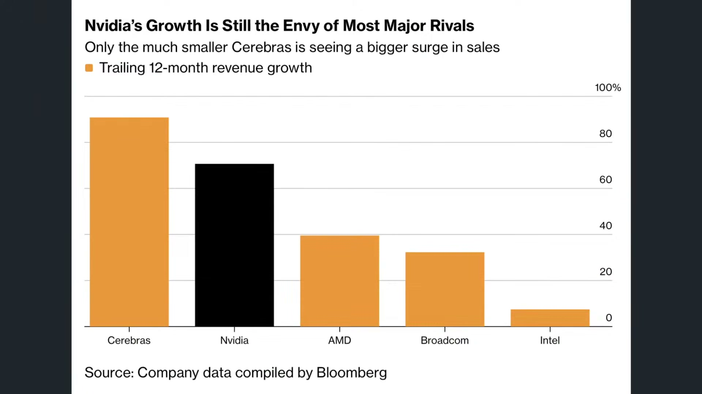

**逐字稿片段：** 我們舉例來說 輝達過去12個月的營收年增幅是70% 比AMD的40%來得高 博通是3十% Intel連10%都不高不到 所以輝達真正的地方哦 驚人地方哦 它除了體量大以外 它成長還快 哦所以你也不用因為現在 各大公司切入到ASIC或者 晶片市場 自研晶片 就對於英偉達產生一定的擔憂 目前看起來還有好長一段距離要走了 事實上 目前全球大概有150家公司正在開發 超過200種不同的AI半導體的設備 那目的就是針對不同的推論場景 把速度做的更快 把成本壓得更低你像 各類型的公司 有的是做那個提高運算速度的嘛 然後有的做HAI 希望能夠從不同市場 當中拿下一小塊市場 那晶片產業它也不是寫 一套軟體就能夠馬上追上 你從架構設計到流片到 製造到軟體的供應鏈 都需要好幾年的時間 所以英偉達的領先呢 我覺得跟台積電的 領先幅度其實差不多了 當然了很多人都覺得總會有意外嘛 英偉達5年前是市值第一名的企業嗎 不是嗎英偉達10年前有在市值排行榜 前十名裡頭嘛 我們現在看到的Google Amazon Meta 十年前它曾經在榜單當中嗎 都沒有所以產業輪替也許是很快的 如果呢是從短期年度來看 輝達就跟台積電一樣 領先年數 已經來到5年以上了 可是呢如果你是用10年 甚至用50年的資產配置 是否要一股腦的相信 一家公司的永恆呢

**話題推測：** 提出輝達、AMD、博通、Intel過去12個月營收年增率比較，可能顯示同業成長比較圖。

---

## 00:11:58

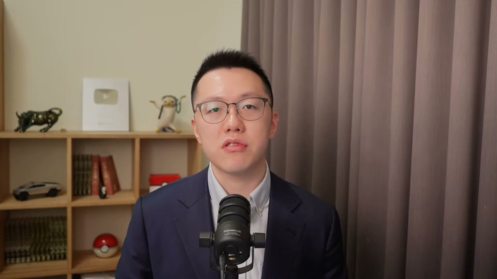

**逐字稿片段：** 我們過去提過那個基業長青的故事 就我大學讀的管理學的教科書 基業長青是1995年 斯坦福大學的教授們和 著的一本書 就是去研究1995年最厲害的企業 最能夠高瞻遠矚 最能夠永續長存的企業 好結果一打開 1995年了當時最有機會永續長存的企業 Nokia啦西門子啦 差不多 差不多這些企業 所以你要了解說這個 產業的變動也是很快的 所以你用資產配置的方式 持續看好AI 沒有太大問題哦 單一個股大家再考慮一下 不過短期的領先的確是真的了 事實上必須這樣講 本來做投資哦 如果你是做長期投資 風險本來就不要過度集中 你就算是單押輝達 我你今年也嚴重跑輸給大盤了 這是事實嘛 輝達因為這幾年已經漲蠻多的 所以現在Google亞馬遜Meta 雖然都是大量採購輝達的GPU 但是畢竟 都在研發自己的ASIC 找博通找Marvell 不同供應商來 合作那當然不是英偉達的晶片不好 就是因為它太重要 它太重要你才要分散一樣嘛 英偉達實在太厲害 市值體量太太大了 所以你才要適度地分散呢 分散風險的重點呢 它不是懷疑最強的人呢 是避免自己只能夠依賴最強的人 對於這些巨頭 對於我們這些小小散戶而言 都是如此 好再好的雞蛋也不值得把所有 廚房都只設計成一種蛋盒嘛 投資也是如此 你不要把雞蛋放在同一個籃子裡頭 企業供應鏈也是如此 所以風險不要過度集中 讓我想到這兩年不是食安問題頻傳嘛 前兩年是 那蘇丹紅 那搞得一堆鍋貼不敢吃 後來有一陣子是寶林茶室嘛 我那一陣子我都不太敢吃粿條 後來想說乾脆吃麥當勞算了不健康 那至少安全 後來發現蛋堡也出事了 後來想想那回家好了 水煮白菜自己煮最好誒 現在娃娃菜也有疑慮 所以你只要單押都有可能會出事 所以我們現在就是要分散風險 你不要固定吃同一種 食物或者同一間餐廳 你以後就禮拜一到禮拜五 禮拜一你就吃麥當勞 禮拜二吃肯德基 禮拜三吃摩斯 禮拜四吃胖老爹 禮拜五吃必勝客 禮拜六吃拿坡里 一直輪著吃 你就不容易中毒了 然後變成百毒俱全 然後最後就有心臟病 不是 就就算最多 就是達到平均值 所以分散風險是很重要的 那當然呢 台積電在這場競賽當中 它也扮演非常關鍵的地位 大部分的AI晶片公司哦 自己設計晶片的 但是哦但是哦 即便它對於輝達可能形成競爭壓力 所有的先進制程 都是高度仰賴台積電的晶圓代工 那英偉達跟台積電已經合作很多年了 再加上本身現金流和 採購規模非常龐大 在產能緊張的時候 自然有能力能夠提前所獲 所以我覺得對於這些小型競爭者來說 雖然對於英偉達有 一點市占率的壓力 可是就算它的晶片設計得很好 如果他拿不到足夠的 先進制程和封裝產能呢 他最後還是很難能夠放大量哦 所以我覺得這是輝達真正的護城河了 從單純的技術 現在已經領先變成了規模 供應鏈的領先 軟體的領先 資本實力的綜合優勢 甚至連積極想要發展 自研晶片的亞馬遜呢 目前還是有1/4的資本支出都流向輝達 這很能說明大家都想要 降低對於輝達的依賴 可是短期內沒有人可以真正的離開它 OK但是 我們要回過頭來說一樣 我們看講了那麼多 英偉達的領先是真的 財報也是真的 市占率也是真的 但今年它股價漲幅靚麗嗎 其實並不亮麗 我們如果細看 英偉達今年股價大概漲幅 最多就15% 高點來看的話 唉費半已經漲了六成六了 英特爾和AMD的股價都已經翻倍 美光都已經翻 快要3倍了 所以投資人呢很明顯 在常年的股價上漲 加上體量已經變大以後對 對於英偉達的提振 效果本身就沒那麼好了 它已經變成了一種穩盤作用 跟台積電有點像 你看2026年 現在來到第160個交易日 英偉達累計漲幅就是5-10% 高一點到12%可是呢 相對於過往的漲幅 2023年的200% 2024年的150% 甚至比2025年的30% 都還要表現來得差 這說明著 真的市值體量太大以後哦 那市場的拉抬意願就很有限了

**話題推測：** 用《基業長青》與1995年企業案例談產業輪替，可能顯示歷史企業榜單或書籍案例。

---

## 00:16:28

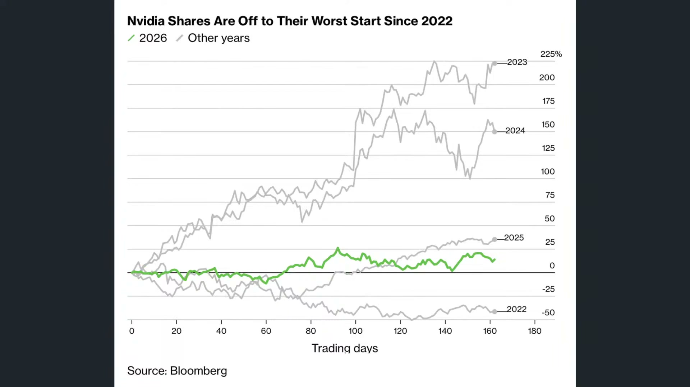

**逐字稿片段：** 那當然我們要看第三層 大家比較關注的重點了 前面兩層都是 它股價不止沒怎麼漲 而且財報還很好哦 所以本身來看 它是一個好的價值投資點 你只要在分散風險的 方向底下 誒多佈局一點點 沒有什麼太大問題 但是第二層呢 是英偉達的 資產負債表所撐起的AI需求 這個是市場上特別關注的 一個財報會議當中的內容 那就是風險藏在賬外的2,000億 我們知道 英偉達這一波市場上最為關注的訊息 就是它不僅僅是在賣晶片 它已經開始利用自己的 資產負債表變成一種金融工具哦 意思就是 英偉達利用強大的現金流和信用 替AI資料中心雲端業者和 客戶提供融資的支援 它不主動提供錢了現在可是呢 以後你出事我來做擔保 所以你勇敢的去跟 銀行跟華爾街借錢吧 那華爾街會把我的 擔保視為值錢的一部分 給你相對優渥的利率和額度 最明顯的就是過去一個月 阿波羅貝萊德黑石KKR為AI基礎建設 募資超過5,000億美元 那輝達強調自己不會出太多錢 那基本上做一些部分資金的支援 大部分的錢由華爾街 直接注入到這些雲端企業 那AI資料中心呢 就讓這些巨頭和 小創新企業背上了超過 一兆美元的長期的租賃的承諾 我們按照摩根士丹利的推估 像Google微軟Meta亞馬遜和甲骨文 尚未開始執行的租約付款承諾 從2021年到現在 哦 2026年已經來到1.09兆了 微軟是最高的 3,900億 Meta是2,700億 甲骨文2,600億 亞馬遜1,300億 那這些都是 未來幾年大家必須要付款 可是還沒有拿到的錢 那問題就在於 那沒有這個需求怎麼辦 沒有AI新創企業付錢 給這些巨頭怎麼辦 不過我倒是沒那麼擔心了 因為看起來他們的雲端 收入正在爆發式的成長 現在之所以還沒有 具體的大量的錢流進來 是因為沒蓋完的問題 根本就不是沒有需求的問題 事實上科技巨頭 現在從資產負債表來看的話 它的負債率表現還算健康 現在真正的問題都是因為AI承諾 它似乎不在表內 這是比較難從財報當中來做 推敲的這也是很多人對於本輪財報 季報持的比較遲疑的原因 就是財報明明都很好 可是沒有太多的正面態度 因為資產負債表你是 看不到目前AI承諾的風險的

**話題推測：** 開始第三層重點：輝達資產負債表撐起AI需求與表外風險，可能顯示財務結構圖。

---

## 00:18:53

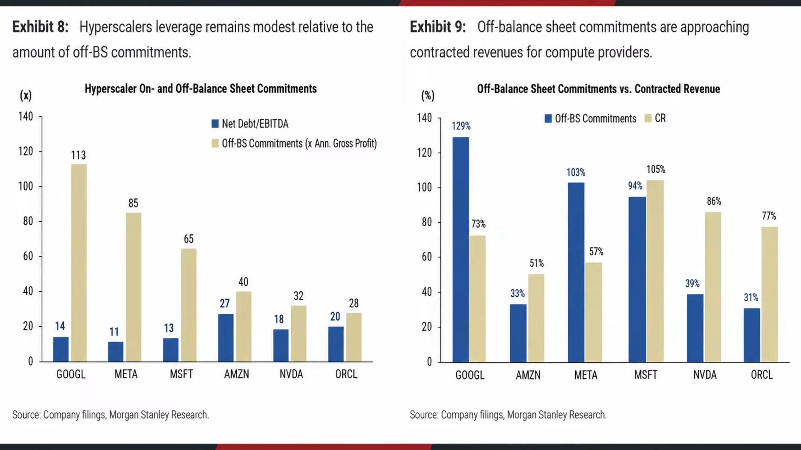

**逐字稿片段：** 我們以Google為例 你看它的帳面債務是1,200億 它表外呢 誒 8,900億 然後Meta 6,900億 微軟是5,600億哦 更值得注意的事情是哦 部分公司的表外承諾 它已經逼近到 已經簽過約 尚未認列營收的未來營收 我們講的RPO嘛 Google的表外承諾是8,900億 RPO是5,200億 相對之下 微軟的RPO是6,780億 高於5,590億的表外承諾 好所以呢 就是AI的財務風險呢 好像從財報本身也很難看得出來 因為都已經列到表外去了 這就是我們觀察到的實質跡象 就是輝達去年他玩的效果 是一方面給晶片商供應商 另外一方面又替晶片 的客戶提供收入和信用保障 然後這些客戶取得融資之後 又把大量的資金 拿回來買輝達的產品了 那現在呢 自己不願意提供資金了 叫這些巨巨頭 叫這些新創企業去跟華爾街借錢 然後5,000億美元的融資計畫 最後都變成我5,000 億美元的輝達的訂單嘛 輝達就是嘗試的把這塊餅給做大 但某種程度也增加了 表外資產的風險了 那現在的財務壓力 就會形成一種結果 那就是 它的真實財務壓力肯定比 企業帳面上的資本支出來得大 因為你都列到表外了嘛 剛才聊到

**話題推測：** 以Google為例比較帳面債務與表外承諾，可能切到Google、Meta、微軟表外承諾圖。

---

## 00:20:12

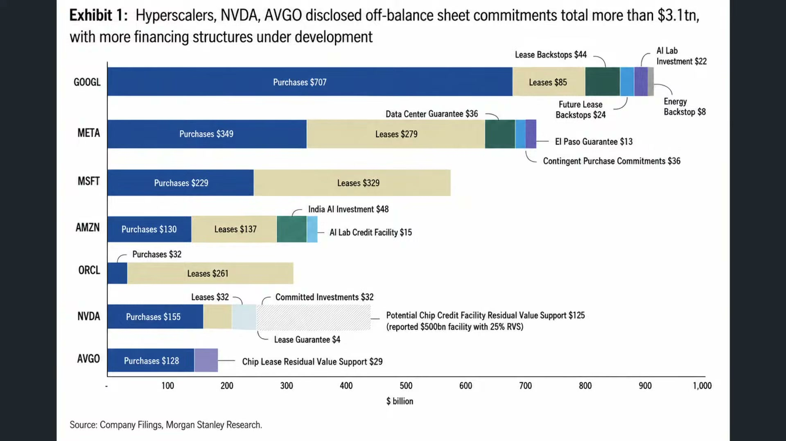

**逐字稿片段：** 這些企業加起來的 表外承諾大概是3.1兆美元 有的要買晶片 有的要買伺服器 有的要資料中心的租賃 有的做融資擔保 能源承諾或者AI投資 Google承諾的採購金額是7,070億 Meta採購3,490億 租賃2,790億 微軟的租賃承諾更高達3,290億 這些都比財報內部的 資本支出還要高非常多 所以就是 其實他們花的錢呢 看起來是比 本來的資本支出還要高不少 它直接導致了一個效果 就是整體債務已經在創高了 可是真實債務的成長速度又 比想像中還要來得快一些 好這個是目前市場上 真正比較擔憂的方向

**話題推測：** 彙總大型科技公司表外承諾約3.1兆美元，可能顯示採購、租賃、融資與能源承諾分類。

---

## 00:20:53

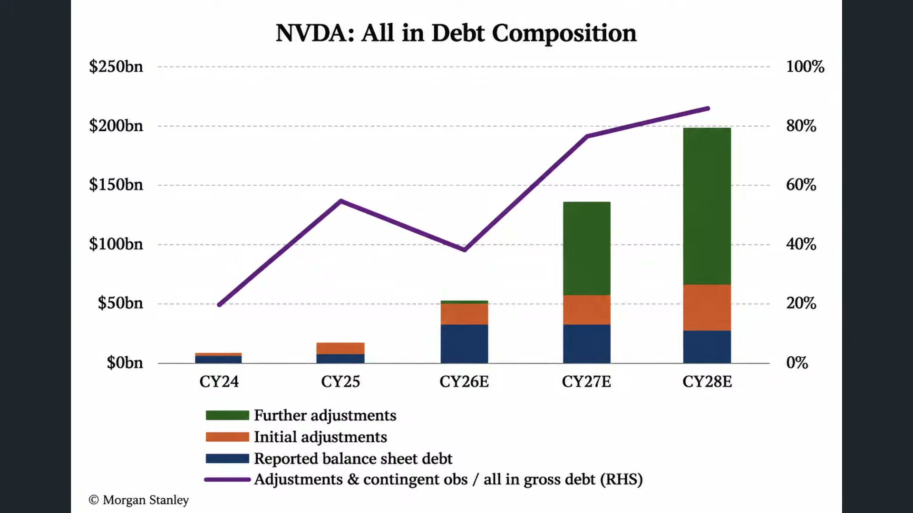

**逐字稿片段：** 不過呢我們過去大概也提過 說市場上現在到底 這些企業的燒錢能力 自身產生現金流的能力 有沒有機會能夠回收其實 市場上並沒有如同想像中這麼悲觀 我們當然知道現在的 自由現金流正在快速的轉為負值 27年應該是 六大CSP業者都要轉負了 今年是三隻企業嘛 那企業開始尋找外部資金了 可是現在之所以 現金流沒有轉正的原因呢 其實來自於資料中心沒有蓋成 代表沒有任何的AI需求 現在雲端業務營收還是60%到80%的成長 換句話說 我認為本廠自由現金流 能否轉為正值的重要關鍵呢 其實不太取決於市場的需求 因為現在沒有足夠的資料中心 你需求再多也沒有用嘛 錢收不回來 就跟台積電採用new 在 2025年 台積電的產能利用率100%了 你EPS當然可以隨便跳到130140150 可是100%了 它就製造不出來 製造不出來EPS怎麼上升呢 所以廠不夠 台積電廠不夠 EPS就無法做進一步調升 那你只能調本益比嘛 那一樣對於英偉達而言 他的錢不 他的GPU不斷的往外輸送 對於科技巨頭而言 他現在資料中心還沒有蓋完 他的營收的上限就在這邊 所以只有第一波蓋完的時候 現金流才會收進來 而這個時間點呢 預估在27年底到28年初左右就會發生 早一點在明年年底了 這個晚一點大概就是2028年 我覺得有機會我們就看到 自由現金流有機會翻正了

**話題推測：** 轉入自由現金流是否能回收的問題，可能顯示CSP業者自由現金流預估。

---

## 00:22:21

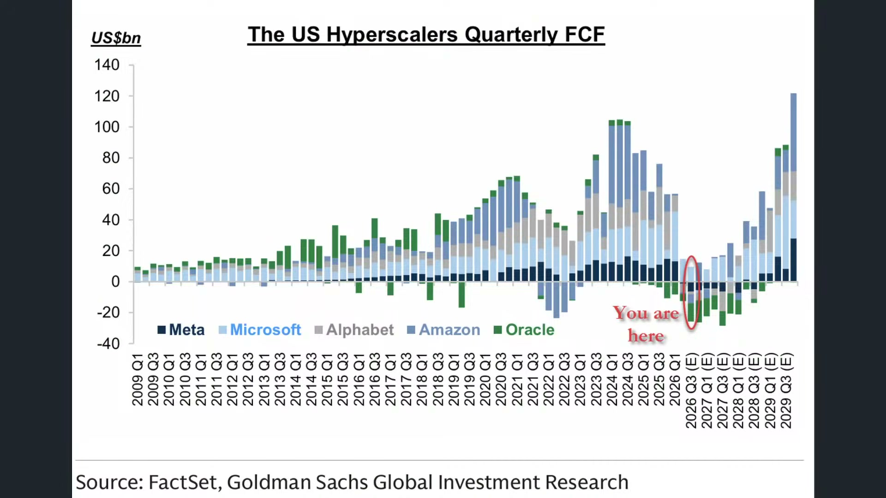

**逐字稿片段：** 好現在的普遍預估是這樣子 今年第三季開始進入到負值嘛 明年會負的最嚴重 然後到明年年底 到後年年初 28年初到28年二季度三季度 預估會轉正 29年應該現金流會創下歷史新高 這個是比較樂觀的預估 也是我本人的看法 我相信呢 現在現金收不回來的原因 跟AI需求減弱一點關係都沒有 純粹就是沒蓋完一蓋完唉 這件事情就能夠成了 當然了現在市場上最大壓力是什麼 那怕沒蓋完嘛 這個就最大壓力 沒蓋完一切自由現金流的 問題都得被迫的往後延 那現在沒蓋完的根本原因是什麼呢 就是怕 市場上對於AI民間選情的影響 導致了資料中心的建制計畫被迫延後 好這個是市場上的確 相對比較大的壓力 我認為這是唯一的變數了

**話題推測：** 提出自由現金流從負值到2028轉正、2029創高的時間路徑，可能顯示現金流預測曲線。

---

## 00:23:13

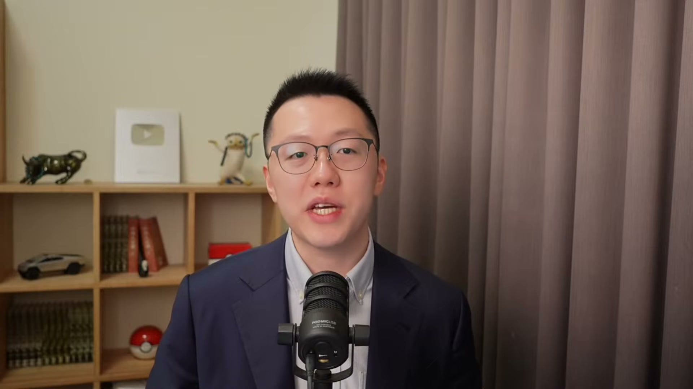

**逐字稿片段：** 我們看美國大型資料中心 目前迎來的爆發式成長 現在大型資料中心在 美國大概是九十座 預估27年你知道會 來了多少座嘛 現在90座 明年預估年底要220座 2030年預估要來到290座 所以這麼龐大的一個建品質 如果無法順勢的達成 那當然他就無法來回饋嘛 場子都沒蓋完 要怎麼營收做回饋呢 這家中心又不是預售屋 還可以提前收錢 你就是要蓋完才有算力嘛 要算力才能夠出租嘛 所以我認為這基本上是 市場上最大的變數 那當然就代表著 如果為了投資單州的治療中心 有個別州的風險呢 最好是全體在各州陸續的做建設

**話題推測：** 提出美國大型資料中心從90座到2027年220座、2030年290座的成長，可能顯示資料中心數量預測。

---

## 00:23:59

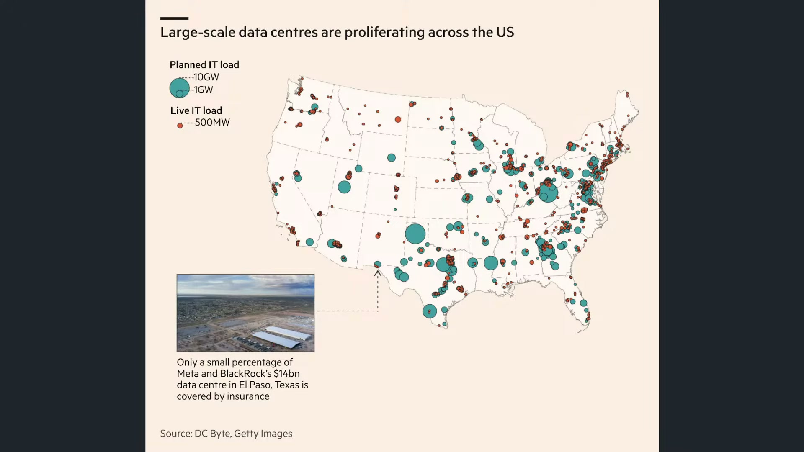

**逐字稿片段：** 現在建設規模比較明顯的 主要集中在德州 維吉尼亞州和喬治亞州 那紐約州已經表態了嘛 所有治療中心已經延後建制1年了 那我們比較觀察的是維吉尼亞州了 德州應該沒什麼太大問題 如果維吉尼亞州有相關 的監管法定陸續出爐 壓力也可能會因此放大 這是我認為市場上可能 目前看出來最大的變數所以 利多它是一堆的利空呢 只有一個 我認為就是蓋不完 那利空的第二個是什麼呢

**話題推測：** 轉入德州、維吉尼亞州、喬治亞州與紐約州的資料中心建設差異，可能顯示美國州別地圖。

---

## 00:24:28

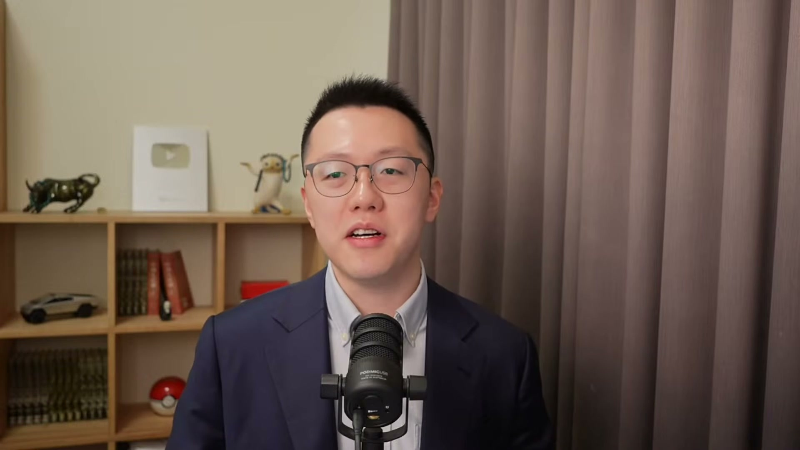

**逐字稿片段：** 那就是金融體系 它放的過大 那當然引發適度的信用風險的擔憂 那利率又保持在高位 有壓力不過呢 信用風險我就真的沒怎麼擔心了 因為CDS價格其實一直在保持在高位 甚至在創高 哦這一次信用違約交換 不管是博通還是輝達 價格都在衝高 所以你說市場難道沒有意識到 信用風險的事情嘛 這看起來就是已知的利空不算利空了 這個利空人人皆知 真正大家沒有意識到的利空 我反而覺得集中在蓋不完這件事情了 蓋的完呢 錢就收回來了蓋不完 錢收回來的速度就要放緩很多 估值就要被迫回檔 不過如果到時候回檔 對我來看那也是一個買盤了 當然了我們都很清楚知道

**話題推測：** 切到金融體系放大與信用風險，可能顯示CDS或信用違約交換價格圖。

---

## 00:25:11

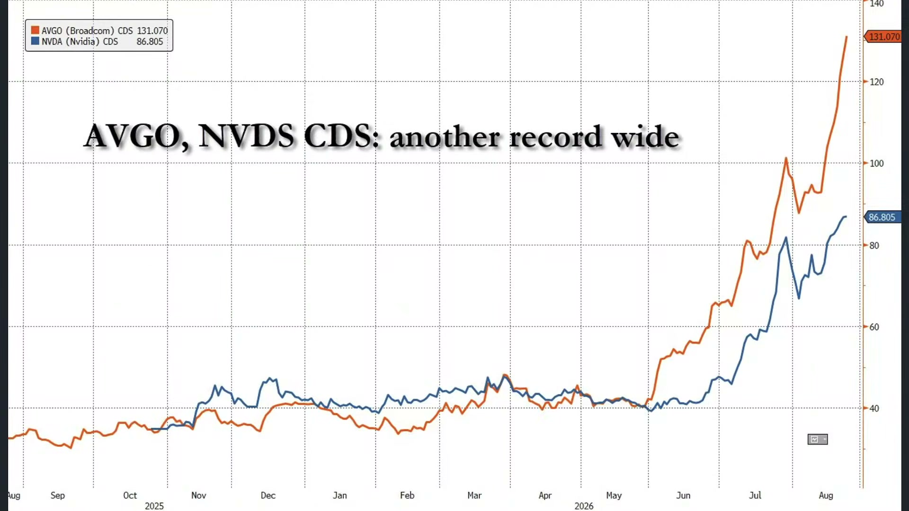

**逐字稿片段：** 似乎在期中選舉之前呢 共和黨對於AI的態度 有一些轉彎 你看川普政府這一次是把AI視為 領先中國的國家安全的必要條件呢 結果最新民調出來了 60%的Maga選民擔憂AI發展速度更快 過快 80%的人認為AI需要更多的監管 共和黨4/5的選民呢 覺得科技公司 會讓AI去傷害孩童 必須要負政治責任那

**話題推測：** 轉入共和黨與MAGA選民對AI監管態度轉變，可能顯示AI民調與政治新聞。

---

## 00:25:38

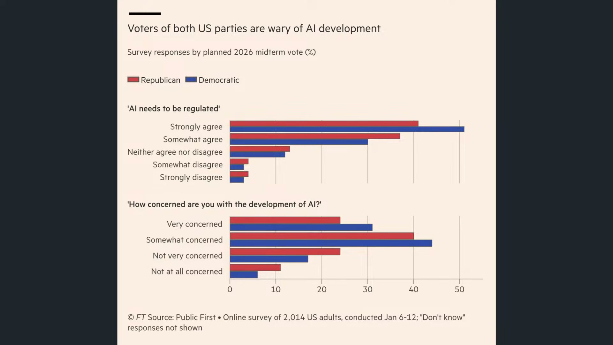

**逐字稿片段：** 政治壓力也進入到州議會 26年呢全美有370項的AI相關法官 法案呢 已經正式提出 超過120項是主要來自於 共和黨主導的議會哦 所以這些反對選民哦 他不是民主黨哦 他是很多川普自己的陣營 政治陣營內部冒出來 去反思AI 認為AI對於當地就業 可能產生的衝擊 AI對於孩童們可能 產生的心理衝擊 共和黨人是很在乎這件事情的嘛 尤其是傳統的建制派 所以AI經濟利益越大 對於地方居民承擔的 成本越來越明顯了 有沒有可能因為這件事情 被迫要在期中選舉之前 做一些收縮政策 這個是我認為真正比較大的變數

**話題推測：** 提出2026年全美370項AI相關法案、120項來自共和黨議會，可能顯示AI監管法案統計。

---

## 00:26:22

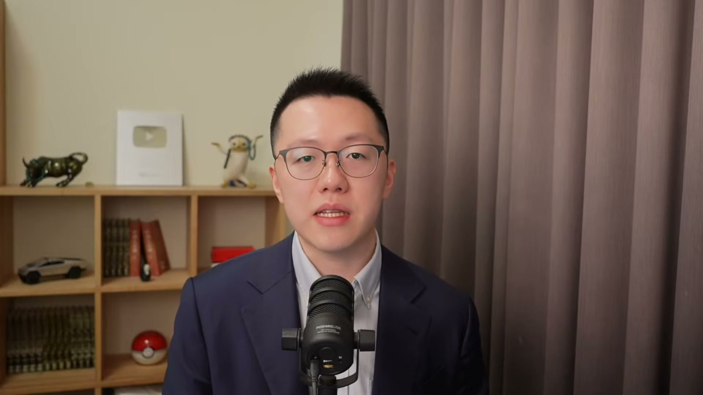

**逐字稿片段：** 可是我們回過頭說 每隔十年啦 科技世界總會掀起新 一波的顛覆性的革命 我們當然不一定像 我們老爸那樣買得起房 買得起車 但總能夠拿著最新一代的iphone 總能夠使用最新的AI 這就是科技帶來的通縮力量嘛 當產品不斷的反覆運算升級 其實用同樣的可支配收入 就能夠享受更快的晶片 更好的相機 更智慧的AI助理 甚至更便宜的雲端服務 所以其實總體來說 科技的進步 它本身呢 還是讓我們的生活品質 能夠持續性的做提升的 通常我們一開始都是對於 新科技會有所擔憂 然後覺得對於就業有衝擊 對於土地一系列的環境 那你希望不要有鐵路電氣化嗎 你希望手機最後不要被發明出來嗎 好你希望回到石器時代嗎 就人呢通常不是因為 聽懂道理而改變 是你生活給了他足夠具體的證據 他就接受了 所以現在很多人對於AI的疑慮 其實最大局限在於 這就問問他問題 然後那麼多算力 借那麼多錢 那我也沒什麼生產力的提升 我覺得生活也沒有變得多好 可是很多人其實離不開它了 就好像現在是8月份嘛 很多今年畢業的學生 已經準備要入職嘍 這個有些當兵的 沒當兵的準備要入職了然後 入職的過程當中 那幾乎每個主管都問同樣的問題 2022年是chatgpt發佈 誒那你在大學的四年這段時間 你是如何使用AI的 所以很多人呢 會發現自己已經跟AI離不開了好從 這個作也不是作弊 從一開始的寫作業 好到讀書寫論文跟女朋友聊天 搞不好都已經完全使用AI了 很多人一開始是懷疑 科技真的能夠改變生活 推動股市的上漲嗎直到以 以前的智慧型手機 然後到雲端服務到AI 一步一步的突破

**話題推測：** 由投資風險轉向科技通縮與生產力革命的長期觀點，可能顯示科技演進時間軸。

---

## 00:28:16

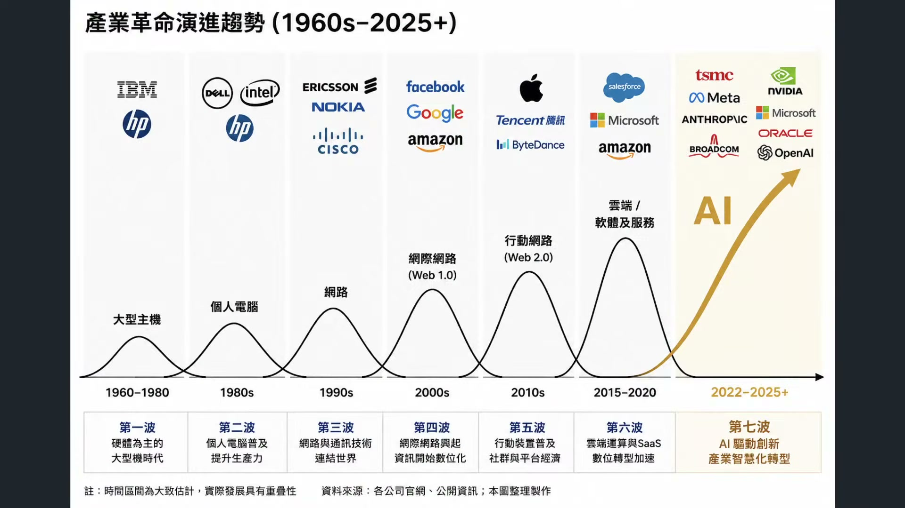

**逐字稿片段：** 你看從1960年 硬體為主的大型機時代 到第二波個人電腦普及的生產力提升 第三波是網路通訊技術在1990年 第四波是資訊開始數位化 第五波是行動裝置 第六波是現在的雲端 加速第七波AI的大爆發 人通常都不是因為聽懂道理才改變 才相信哦 這條行情是真的 都是生活提供的他足夠的具體證據 之前兩個男的 在酒吧裡面聊天嘛 其中一個男的吃東西前就開始禱告 另外一個兄弟問了 哎你結婚前不是沒信教嗎 怎麼現在還會禱告了 男的說 那我老婆實在很厲害 結婚之後她就改變了我的信仰 她是怎麼做到的 以前我什麼都不信呢 直到我結婚之後 我才相信有地獄的存在 所以人通常 不是因為聽懂道理才改變 是因為生活終於給了 他足夠具體的證據哦 我們現在面臨的AI行情也是如此 你一開始都不信任 但是你發現 剛畢業的孩子們 怎麼跟AI完全已經密不可分之後 你才會發現呢 科技是持續把不可能變成日常 把昂貴變成普及的重要原因了 那最終生產力股價的創高 它反映的是什麼 就是大家離不開這些AI的生產力了 好這給投資朋友做一些思考了 對警察先生 這就是事發經過ok

**話題推測：** 列舉1960大型機、個人電腦、網路、行動裝置、雲端到AI的七波科技浪潮，可能顯示科技週期圖。

---

## 00:29:43

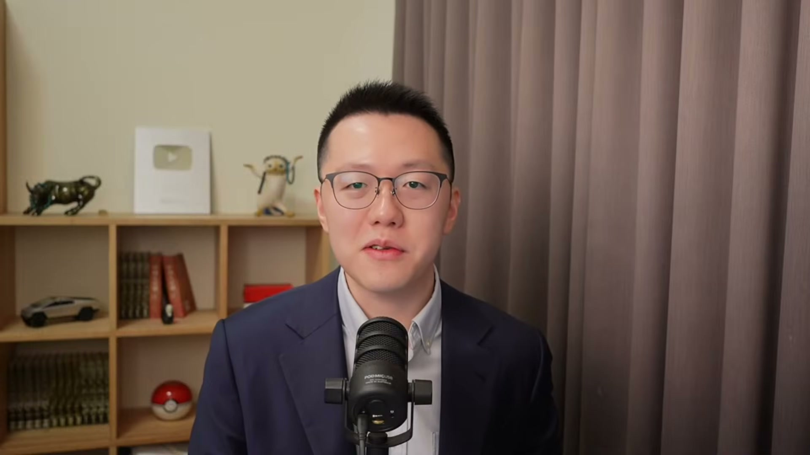

**逐字稿片段：** 那我們看就零一分了 台股上漲329點 收在46,162點了 當然了 我們今天聊的範圍比較廣了 也不廣了 主要是集中在回答 那剩下的內容我們就 有機會再來做敘述 主要是跟投資朋友稍微分享一下 現在在AI不同層面呢 大家的想法不太一樣 可是根本 初衷還是一樣的 那就是AI到底有沒有 達成足夠的生產力提升 以及AI是否能夠準時交付它的產品 是市場上最為關注的 我們過去跟投資朋友提過

**話題推測：** 短暫切到台股即時盤勢，上漲329點並收在46162點，可能顯示台股指數畫面。

---

## 00:30:14

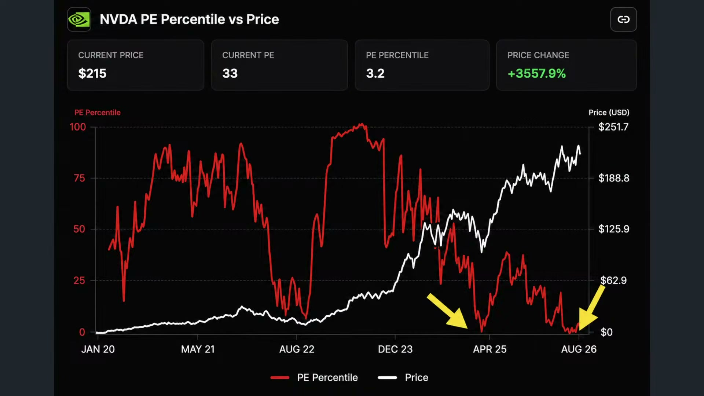

**逐字稿片段：** 現在唯一唯一哦 大家要關注的方向 就是在種種消息底下 本次的EPS開出來了 代表的是只要輝達股價再不上漲 它本益比就要創新低了 我們看輝達現在的當前本益比 我們不看前瞻了 就用今年的來看 本益比是33倍 這個本益比數目 已經比今年的美一站c還要來的低 差不多是去年關稅戰的水準 遠遠低於2022年的水準 也比2020年的新冠疫情來得低哦 所以現在的投資吸引力 你會大過於關稅戰 大過於22年的烏俄戰事 大過於新冠疫情 那現在差別原因來自於 由於它的市值體量太大了 所以右側去追買的意願並沒有特別高 可是 左側買盤我相信隨時會浮現的為什麼 因為硬要講 它現在的股價便宜程度 是5年來最便宜的時候 因為它的EPS開出來了 它的本益比又下滑了 它只要股價不創高 就是史詩級的便宜 當然我們必須清楚知道 它之所以無法爆發式的上漲 是因為它體量太大了 體量大跟極其低 你要怎麼做選擇呢 這給投資朋友作為一些參考了 那我自己個人是蠻樂觀的 給投資朋友做一些思考 好那我們今天主要的 範圍就聊輝達的財報 還有市場的擔憂 它的信用風險 還有它的未來前景 生產力的提升 讓大家有更進一步的思維 當然如果投資朋友有更多興趣和想法

**話題推測：** 回到輝達EPS與本益比，指出股價不漲本益比將創低，可能顯示輝達估值圖。

---

## 00:31:36

**逐字稿片段：** 也可以考慮參加我們下禮拜六 舉辦的財經皓角線上聽友會 歡迎大家可以點底下 的連結來做報名 主要是來思考 在這一輪財報季過後 市場好像對於財報的 反應沒有這麼的直接 那到底市場在等什麼呢 我們到底目前的總體經濟環境是否 迎來了進一步股價推升的動力 現在要分兩個市場吧 消費電子市場不好 那關經濟什麼事情 我跟你講 現在沒有人買手機 那個資產價格都不一定會崩盤 因為所有的需求都在AI 那AI能夠延續到什麼時候呢 這也是我們在本 粉絲聽友會觀察的方向 或者大家有興趣可以 參加我們的會員訂閱 裡頭有更詳盡的資訊 給投資朋友做些參考 如果喜歡我們節目 記得幫我們訂閱 按讚加分享 我們就明天早上8點半 早晨財經速解讀再相見 祝各位投資朋友 看盤順利 操盤愉快

**話題推測：** 進入線上聽友會與財報季後市場觀察宣傳，可能顯示活動報名資訊。

---
