# yutinghaofinance_mhVVuuWUhCw — 關鍵畫面索引

- 來源逐字稿：[yutinghaofinance_mhVVuuWUhCw_GT.srt](yutinghaofinance_mhVVuuWUhCw_GT.srt)
- 影片：https://www.youtube.com/watch?v=mhVVuuWUhCw
- 截圖數：23

## 00:00:47

**逐字稿片段：** 不過到底這一次的債券失火 對於股票市場而言 它只是回檔的剛開始 還是現在就可以撿便宜了呢 我們要從不同角度來做觀察 因為債券市場的嚴重程度 是遠遠大於股票市場的 那到底這種高利率是否能夠跟 高估值並存呢 還是說按照目前美國股市的基期 美股也不是處於高估值 今天來做一些觀察 因為美國股市周市受到比較大的承壓 主要還是來自於國際油價的大幅攀升 美債殖利率 10年期現在居然要接近5%了 加上這一次生產者物價指數的確 也顯示通膨的壓力還在持續升高 升息預期在下禮拜又 開始大幅度的推升 好雖然我認為還是有變數 不過呢至少市場的認知已經 認為當前的利率預期 有必要做進一步抬升 似乎也是在逼迫聯準會進入 顯著表態 你一直不做前瞻指引 我也不清楚你要怎麼做嘛 好這一次布蘭特原油期貨 價格昨天上漲了6.42美元 漲幅是6.34% 收在107塊 美國油價從5月以來 已經很久沒有突破100美元了 哦所以現在是隔了接近 一個季度左右創下 5個月以來的新高 西德克薩斯原油價格 直是上漲6.43塊 漲幅是6.69% 每桶收在102.48美元那當然 這一次主要是由胡塞武裝相關中東 局勢衝突的升溫所引起的通膨預期 但我們都很清楚知道 它其實是不同因子的相互交錯而成 畢竟 現在中東局勢肯定沒有比3月4月 份當時爆出來還要來的恐懼嘛 畢竟這個謊話講三次 或者說狼來了講了三次 再來講市場對於中東局勢 的訊息應該是有所鈍化的 這次很明顯還是由不同 的消息互相交錯而成

**話題推測：** 介紹主要話題：債券市場對股票市場的影響

---

## 00:02:39

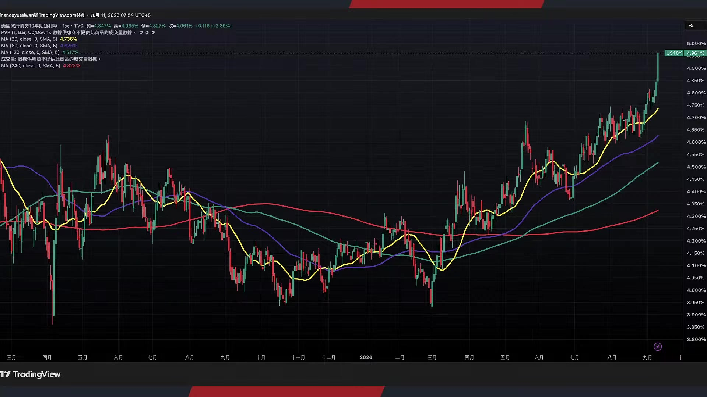

**逐字稿片段：** 一方面是美國財政部長原本希望 透過擴大公債的回購來穩住償債市場 最新宣佈首輪回購60億美元 結果市場在消息公佈之後 反而變成利多盡出 這一次10年期公債殖利率 就一路來到4.8 然後4.9 現在準備要挑戰5% 20年期和30年期的殖利率也同步走高 所以問題就在於 美國公債規模現在這麼龐大 區區60億美元的回購規模 第一隻占0.02% 那第二呢 財政部現在的主要做法 他也不是真的要QE 他只是把流動性比較差的 舊債換成最新發行的公債 那重點是什麼 重點是市場的解讀 按照貝森特的談話 他不是說不要去狙擊我嗎 不要跟我作對嗎 我才是莊家 這一類的言論 讓大家以為他是有什麼大的籌碼 準備要隨時釋出誒結果 哦就是這樣子而已 結果導致了10年期公債殖利率 持續的走高 所以不管是從40億到60億美元 還是又提高60億到80億 做扭轉操作 其實對於龐大的美債市場而言 還是杯水車薪 最重要的當然是原油價格哦 這一次突破100美元之後哦 那的確通脹預期的升溫就開始了 因為它算是突破了第一輪的關卡 我們會提過嗎 原油價格的最高點大概在120到130 那是三四月份的高點那今年 6月7月份的高點是大概 是接近100美元左右 那現在剛剛開始做突破 好所以現在的問題就來自於 那川普所釋放的談話是否 能夠有效的去抑制油價 另外一方面 那貝森特還要出招嗎 還是多說多錯呢 至少從美國股市來看呢 因為現在還在高點附近慢慢的回落 所以其實位階並不算特別低 所以大家會擔心會不會由債券的 失火來讓股票市場有進一步的回檔 其實如果是從嘴巴上來看的話 資金是很保守的 實際上 大多數的對沖基金就目前來看 仍然在持續追逐AI和半導體 量能雖然沒有回到五六月份的高點 但至少比7月份還要好得多 好所以這一波有沒有可能 如同我們過去所預估的 可以借由一次性的 大跌把量能重新拉起呢 我們要想想 如果股票市場債券市場 都沒有什麼樣的消息 那現在又是做夢行情 結果股市就是一直量縮一直量縮 然後盤了一整個季度 那不是白浪費了嗎 但是按照台股過往的慣性呢 每一次的爆大量 通常都要有一輪的下殺 存股族才會出動去買ETF 借由美股台股 一坡下殺 市場清理 籌碼之後 重新的爆量誒 行情又開始底底高 也許這是一個好的方式 畢竟納斯達克指數 這一波必須承認 底下的籌碼結構它是越來越偏多 從26年二季度標普百美股盈餘 增長30%以後 就代表著基本面是很強勁的 所以純股值的買盤預估在未來 半年應該都會繼續出現的

**話題推測：** 討論美國財政部公債回購計畫及其對殖利率的影響

---

## 00:05:33

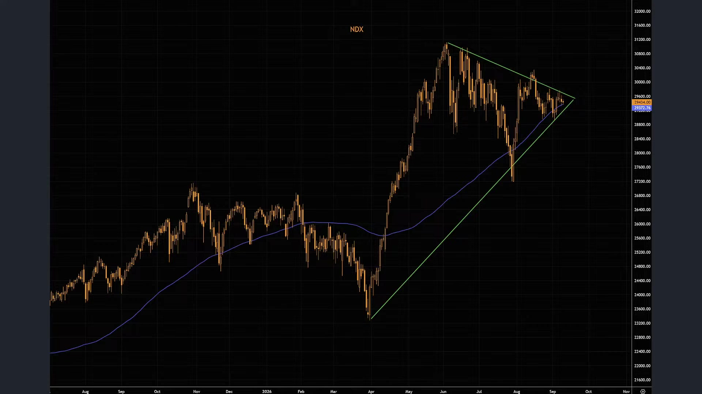

**逐字稿片段：** 那重點來自於目前 基金手上的現金還是高達1,630億美元 在美銀的統計調查當中 這代表市場也不是沒錢的 就是從7月以後 其實就不太敢進場 那今年其實大家績效都很不錯 可是從7月以後 突然就好像氣球泄了氣一樣 那就變成了企業獲利還是強 那現在部位沒有想像中這麼高了 現金也多 所以如果借由一次的下殺 重新的把量能給推起 也許是一種方式 那現在最重要的事情就是 那推是不是不能夠一路的推到新高 因為實利率預期不同了 所以我要進行一些估值的壓抑 你可以漲 你也可以買 但是我不能夠讓你那麼 容易的把估值無限的擴大 因為利率越來越高了

**話題推測：** 說明基金現金持有量高達1,630億美元的市場資金情況

---

## 00:06:16

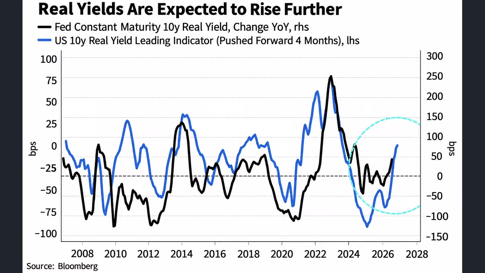

**逐字稿片段：** 我們看美國實質利率 今年是一路往上走 10年期的實質利率是從3月 底的1.72%上升到2.43 實質利率就是把現在 既有的利率水準呢 扣除掉通膨 然後就把通膨給納入其中 那你會發現 目前還是有來到2.43-2.5%左右 現在Tips哦 先前在伊朗戰爭爆發前一度過度買進 現在報酬也差不多回到長期平均了 所以這就代表著現在AI搶 資金也是成為現在市場上 資金極度稀缺的根本原因 而實質利率仍然在持續向上 所以從種種條件來看的話 貨幣其實還是有一種 流動性收縮的味道 那這一波的實質利率上升 我們細看跟2021年到22年 那一坡又不太一樣 當年那種 高強度的上升 是因為聯準會的快速升息 好但現在市場未來一年大概只反映 頂多就是一次到兩次的升息 我們從FED watch也看得出來 好即便今年預估最快9月份要升息 但是今年升息幅度也不是如同 想像中像22年那樣暴利升息 真正的新力量就來自於兩件事 第一就是市場對於實質 經濟成長的預期上升 所以實質利率要往上走 第二就是全球資本競爭變得更激烈 尤其現在AI資料中心晶片 正在瘋狂的吸走長期資金 好所以從這樣水準來做觀察 我的個人看法是哦 現在更類似於不是說通膨高 所以殖利率高哦 我覺得中東都是次要因素哦 現在根本因素還是 因為AI資本支出跟企業 正在互相搶錢 所以讓資本本身變貴 所以解釋了為什麼油價大漲唉 通脹照來講就升溫嘍 那通脹升溫 實實質利率就要往下彎了嘛 正常來講 結果實質利率還在往上衝呢 說明通脹現在其實是次要因數 主要因數是因為缺錢 那為什麼缺錢 因為AI爆發了 那AI爆發了 對於股票市場到底是壞事還是好事呢 所以債券失火 股市有沒有撿便宜的機會 如果真的有股價下跌的時候 或者說比較大的乖離回檔 那你瞭解我們的立場 這個就是難得一見的中期回檔 也許又出現了 事實上 還不用特別急了

**話題推測：** 分析美國實質利率的上升趨勢及其數據

---

## 00:08:27

**逐字稿片段：** 因為從股市波動率來看呢 VIX指數還在低位做震盪呢 這說明市場上一點 恐慌的情緒都沒有 在債券市場是蠻恐慌的沒錯了 可是對於股票市場而言呢 幾乎也沒什麼人在做避險 前幾次 包括美伊戰事關稅戰日元套利平倉 那個恐慌情緒都比現在高多了 現在甚至都還沒有開始發動 所以 也許再等等 多觀察一下是ok的

**話題推測：** 引入VIX指數說明市場恐慌情緒仍低

---

## 00:08:51

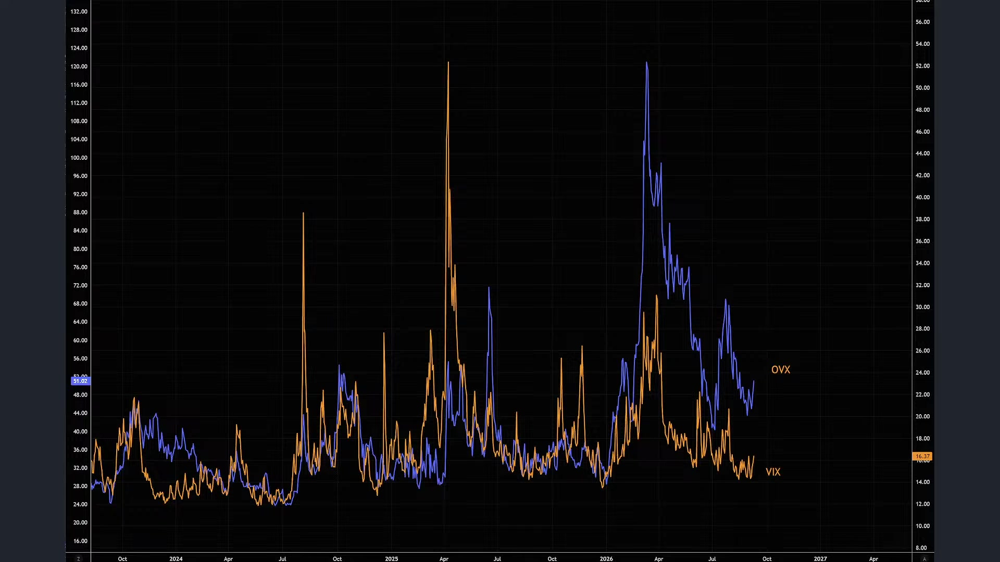

**逐字稿片段：** 當然了川普已經急得不得了了 川普現在在 伊朗採取了適度的報復行動之後 美軍也宣稱一路摧毀5艘 的伊朗的能源運輸船 然後呢伊朗在禮拜四禮拜五 又陸續向美軍使用 向約旦空軍基地 被發放了20枚的飛彈 然後攻擊更多的美國軍艦 不過沒有做任何一艘成功轟炸到 那今年累計現在布蘭特 原油大概漲幅是65%嘛 這個川普在昨天已經正式喊話 聲稱只要中期選舉 共和黨大勝 美伊戰事就會結束 這是他的論調 那貝森特呢 貝森特嗆市場 有本事就跟我對做 我們知道貝森特最近的談話比較多 他說明如果投資人 決定要持續做多油價 去做空日元 然後推高美債殖利率 很有可能會吃虧 因為政府掌握市場不知道的政府資訊 他甚至公開表示 想跟我對做就試試看 結果現在大家真的試了 你知道嗎 那真的殖利率創高了啦 那問題在於哦 真正推高油價和殖利率的力量 它也不是幾句話就能夠解決的 我們剛剛提到嘛 美國次債是兩兆美元 美伊戰事 它雖然是次要因數 但它至少讓利率預期 沒辦法下滑太多 那最重要的是 那AI就在跟你搶錢嘛 AI也要錢 你美國政府也要發公債 我當然是先給這些AI企業 他們給的殖利率這麼高 形成美債殖利率的持續上行 那最後在昨天的催化劑 催化劑底下

**話題推測：** 提及川普就美伊戰事及中期選舉的最新表態

---

## 00:10:19

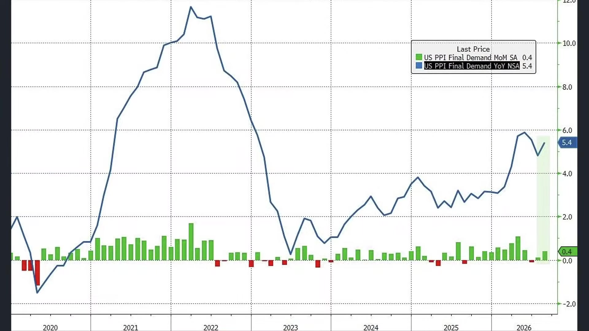

**逐字稿片段：** 美國8月份的生產者物價指數 又把利率預期給往上拉 整體生產者物價指數 的月增幅是0.4% 7月份也由原本的持平 上修到月增幅0.1 年增幅現在來到5.4% 好這一波 那就很明顯是能源價格的重新帶動了 最終需求商品價格大漲 單月1.1% 這是5月份以來的最大增幅 能源是4.2 光是柴油就暴增了24% 貢獻了1/3的商品價格漲幅 好所以一樣 只要把能源給剔除掉 也許我們又進入到降息格局了 但沒辦法 現在就是生產者物價 成本正在瘋狂的上行 那甚至我們從科技通膨在 生產者物價指數的權重來看 都沒有想像中來得高 所以如果是純粹由AI所 帶領的記憶體通膨 你的iphone手機漲價 你甚至在PPI層面都不會那麼大的感受 因為你不是每個月都要使用嘛 或者整體而言 科技通膨 你能夠找到一些替代性的產品呢 但是石油通膨 能源通膨 你就避不開 好這是另外一層的 推波助瀾的效果 那這就使得市場上壓力更大了 那就是大家知道 現在有很多當時在 20年21年所發行的短債 陸續到期嘛 那開始繳納利息完之後 就要重新發行債了 那現在問題就來自於哦 發行債的利息規模極高無比 因為現在的利率水準 全球市場都位元於高位

**話題推測：** 報告美國8月份生產者物價指數（PPI）數據及其組成

---

## 00:11:40

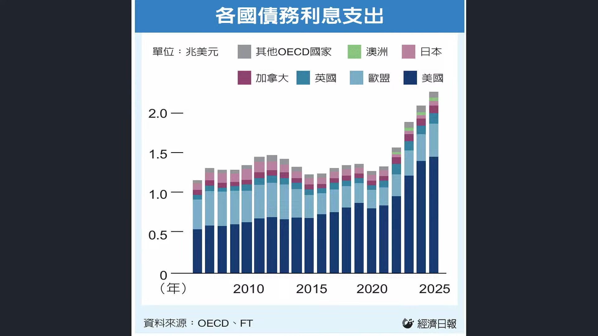

**逐字稿片段：** 我們根據OECD 根據38個成員國的預估去年 全球政府的債務利息 已經超過兩兆美元了 相當於整體國內生產毛額的3% 那今年大家的借款規模又創高 來到18兆 所以借錢成本又同樣的升高 那借錢成本越高 如果你也沒有進行QE 那信貸規模也沒有持續增長 大家對於總體預期 就會認為錢會來得更貴 實質利率預期就來得更高 這使得全球的公債實質利率 都在瘋狂的上行 好所以債券市場真正 擔心的不只是借太多了 而是那經濟成長到底能不能去 應付如此高強度的債務擴張

**話題推測：** 討論全球政府債務利息及借款規模，引用OECD數據

---

## 00:12:21

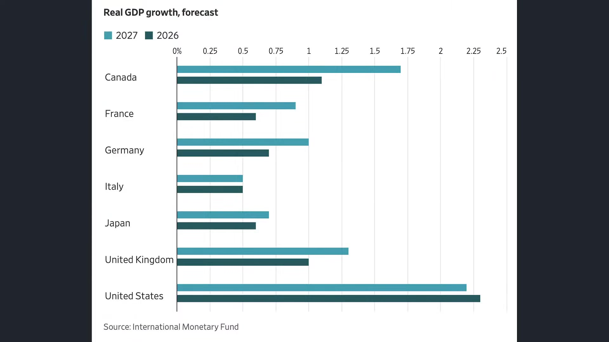

**逐字稿片段：** 我們看日本呢 今年預算赤字大概占GDP的兩% 美國是多少 美國是7.5%呢 而且是一路預估到2030年都維持高檔 日本利率才多少 美國利率有多少 美國現在10年期利率都要5%了 結果它居然 赤字占GDP是日本的4倍到5倍 那當然了 作為全球霸主 它多發一點債也是ok的 可是它不只是絕對金額上增加債 它在體量上比例上也 比其他國家來的高非常多 所以現在重點就是來自於 不只是債務能不能承受 我們還要看赤字的大小 以及未來經濟有沒有 能力持續成長擴大 美國算好的 今年成經濟成長有2.3% 德國只有0.7 日本只有0.6了 如果以經濟長期一%左右成長 目前市值也沒有說到很失控 可是有很多國家經濟 成長連一%都不到 所以全球最有本事發債的 國家就只剩下一個 就臺灣 臺灣現在的這個債務 占GDP比值只有30% 然後經濟增長10% 那不是要趁今年大發債嗎 好所以這個就是全球 市場面臨極端的問題那當然 現在好像AI的發債潮在今年把 8月份來到一個相對高峰以後 9月份開始滑落 那很多人說 那如果AI接下來企業 發債力量稍微減弱 能不能緩解一下美國公債的壓力 誒完全不會 因為2027年的發債預期仍然非常強勁

**話題推測：** 比較日本和美國的預算赤字占GDP比例

---

## 00:13:46

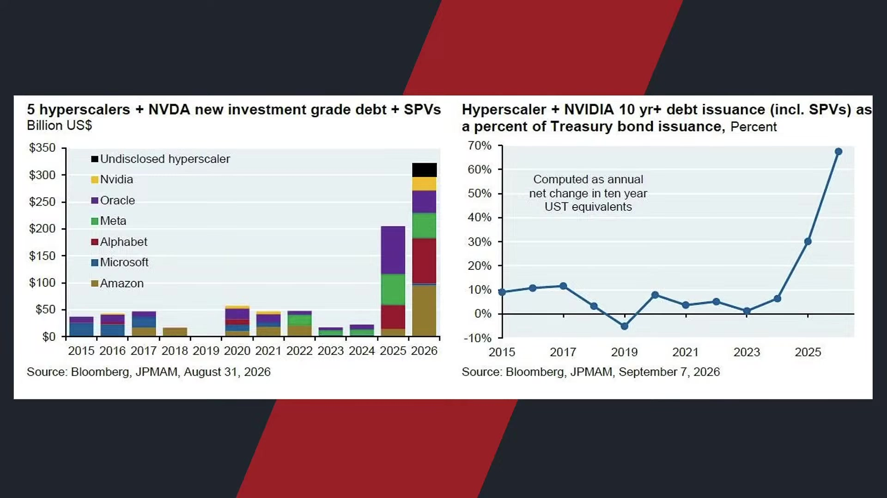

**逐字稿片段：** 我們看今年總體的發債規模 在四大CSP者大概是3,200億 去年大概是2,000億 你看一下前年 前年大概是不到100億 所以你可以觀察到 今年財政部這種長天期的借款 為什麼被AI投資等級在完全給吃光 錢都被AI企業給 收走了 那美國公債根本就沒有人要買了嘛好 所以這個是我們觀察到的實質跡象 那從2526年的趨勢來看 你很難想像2027年會突然腰斬 或者回到2021年到2024年的水準呢 好所以對於市場的干預力量 也許對於美國公債的 侵擾會來得越來越大 好這是第一層我們觀察到的重點 那當然了 我們也要清楚瞭解到 這邊就有另外一層觀察方向那就是 當前美國公債因為突破了40兆美元 真正的數位就是 你要讓它回頭 照理來講也不太可能 你要讓它稀釋債務 那就要適度通膨 可是你有適度的通膨 就會讓利率預期不斷的揚升 所以長期方向我們當然知道 緩解美國公債政府的壓力就是 嘗試的讓錢不值錢 你就可以變得債務壓力慢慢的消耗 以前欠大家500萬 20年前那是很大一筆錢 現在500萬 連一間房子也買不起 那以前可以買一套房嘛 所以通膨可以稀釋在握 好問題來了 可是問題現在是通膨越高 利率預期就越高 發債成本就越高 所以長期你要讓它通膨 短期內你不能讓它通膨 這就形成在政策僵局上的難度 所以我們要講的就是不管是 我們剛才提到的油價突破100塊啦 還是聯準會的利率預期 美債被 投資等級債的資金給搶購 或者財政部的回購不如預期 我們要講的就是市場並不是線性關係 它是一系列因素同整之後的結果 就好像你覺得全球手機市場衰退 你也認為可能蘋果也會受傷 但有時候不一定嘛 反而是品牌或者供應鏈定價權 龍頭可以拿走更多的市占 就跟我們昨天提到的一模一樣 所以我們講的就是現在呢 也不代表說所有的債券市場的失火 它最後會變成股票市場的意志 因為它看起來就是靠 股票市場的生產力提升 讓未來的經濟成長足以 還得起這麼多的利息 好所以我個人的看法是 從這樣的角度來看呢 這一些都是讓 股票市場它有修正的機會 但它的本質都不是讓 它泡沫破滅的理由嘛 泡沫破滅理由只有一個 這是供給過剩 算力太多 算力太廉價 好那現在呢 這些都是讓你算力 成本越來越貴的關鍵呢 都是讓你資料中心越來越難建成呢 而不是資料中心太多 所以我覺得從市場角度來看 這些邏輯 它不是線性關係 因為債券的失火 股票市場就一定要跌 而是說債券的失火所 造成股票市場的跌幅 你對於AI科技樂觀論者 變成一個佈局的理由 好所以市場並不是單純的線性關係哦 昨天才看到一個故事嘛 他講那個女孩子 搬到舅舅家去住 那有一天他就對舅舅說 舅舅把我的上衣脫掉 他舅舅照做嘛 那女孩又說 褲子也脫掉 那舅舅就照做嘛 胸罩也脫掉好 好最後女孩就紅著臉 內褲也脫掉 全部脫完之後 舅舅就站在那邊 女孩很認真的看著他 舅舅你下次不要再穿我的衣服了 就市場不是線性關係 有時候我們覺得自己 已經知道了故事的結局 投資也一樣 債券漲也不代表說經濟好到哪裡去 殖利率漲也不代表經濟很強 它背後會有不同因數的交錯而成 我們看到的事實哦 有時候是替事實編的故事 也有可能完全是錯的 好所以今天我們看到這些新聞呢 真正值得帶走的並 不是單純哪個數字漲 哪個數字跌 就是我們不要替市場 提早寫好腳本了 我們理解它現在債券市場的暴跌 它的背後幾個因素為何 把它同整之後 會形成對於股票市場的集體賣壓 畢竟利率越高 估值就會得以做到削減嘛 但是這些是否讓本輪AI提前 結束遊戲的重要關鍵呢 我認為都是次要原因 主要原因 必須要是AI自己算力過剩 AI本身是一場沒辦法 提升生產力的泡沫 才是如此 那當然了 剛才聊到這件事情呢 川普已經很緊張了

**話題推測：** 分析AI企業發債規模對美國公債市場的影響

---

## 00:18:03

**逐字稿片段：** 我們看川普 昨天為了挽救共和黨的期中選區 宣佈普發現金而且呢 宣佈如果是共和黨成功守住參眾議院 將會對每一名美國成年公民發放 5,000美元的川普紅利 而且要求這筆錢必須 在美國境內來消費 誒 5,000美元 那不是15萬台幣嗎 哇那金額其實不小誒 誒 這算算不算公開買票 而且因為他是要 如果共和黨兩院都守住 他才要發 那沒守住看起來就不發了 所以這個金額 它是遠遠高於 大家還記得疫情時期 他有進行多輪的支票紓困嘛 整體財政成本 可能會突破一兆美元 當然最後還是要獲得國會的批准 不過到時候如果真的共和黨全部拿下 國會大概也會批准的 川普把它形容成一家賺錢的企業 向股東來發放現金 直接回應選民對生活成本的不滿 好所以如果你對現在 有不滿 只要你讓我們共和黨在其中選舉大勝 你接下來在年底你就 可以拿到15萬台幣 這你要知道 川普現在支持率跌到執政以來低點了 比第一任任期都還要來得差勁 那共和黨的選情吃緊了 提出這項政策 政治意味就非常濃厚了 他甚至要求 大家就把這一次集中選舉呢 當成我又再一次的選總統就好啦 而且準備在11月投票前密集的造勢 當然眾議院現在預估 應該是完全守不住了 參議院是五五波 所以重點是把參議院給守住 要不然等到參眾議院在 11月3號陸續失守以後 很快的川普就會迎來潮小也大 那就要來臺灣來借鏡一下對不對 要學習一下了 重點來自於 美國隨時可能會有彈劾案的產生 那到時候對於川普的 影響壓力就來得更大了 當然 這是一種 政治權力上的受限 也不一定完全是壞事 但是對於AI企業而言 你當然就知道未來的 投資變數就很大了 這是我們看到美國的部分 那日本的部分呢 現在壓力其實也很大 因為日本為了要支撐日元 在上禮拜已經是 實行了史上最大規模的外匯幹預 財政省已經確認了 在過去一個月已經動用15.4兆日元 大概是986億美元 來進行護盤 好這說明著 哦日本現在也有點快要守不住了

**話題推測：** 介紹川普提出的5,000美元「川普紅利」普發現金政策

---

## 00:20:14

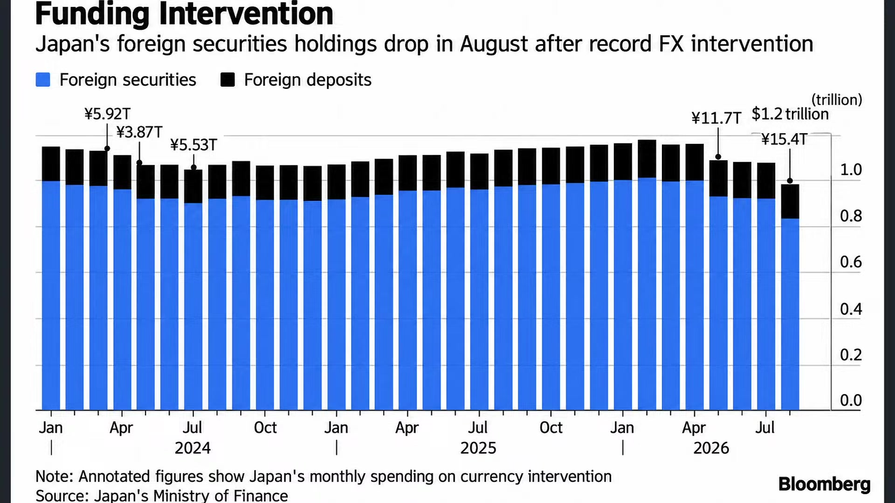

**逐字稿片段：** 因為它10年 期公債殖利率是突破到3% 這是本世紀以來的新高 也是1990年中期才見過的水準 日本公債規模大概是7.5兆美元 那過去一直是被 視為全球最穩定的債市 可是現在投資人 開始要求更高報酬為什麼 因為日本已經不是 那個長期利率接近零 央行永遠幫忙買進的市場了 現在有通膨的壓力 所以他們就有升息的壓力 那財政風險 也開始做陸續抬升 對市場要求更高的風險貼水 第一個力量就是日本央行 進入到正式的升息循環 因為6月日本央行把 政策利率升到1% 創下31年以來的新高 那貝森特和日本央行最近的喊話 幾乎已經確認了9月份會升息 而且日本通膨只要持續高於兩% 升息步調就完全不會停止 那第二個步驟

**話題推測：** 說明日本10年期公債殖利率創本世紀新高和央行政策利率

---

## 00:21:03

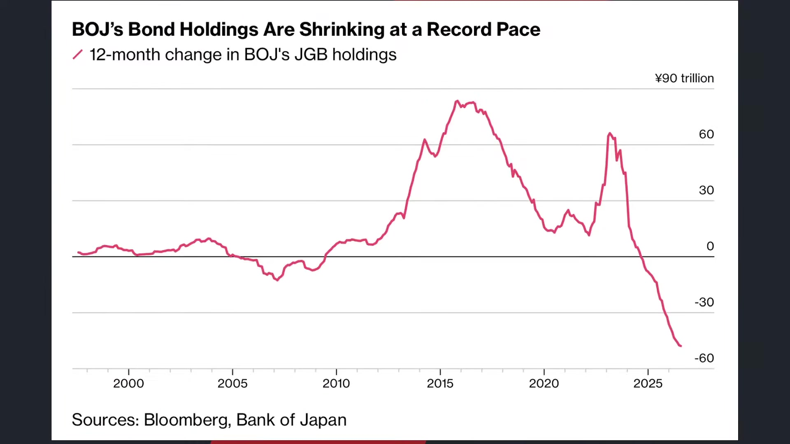

**逐字稿片段：** 其實我認為是根本原因 就是日本央行不QE了 它正在退出債券市場 日本很長一段時間是靠 大量的買債來壓低殖利率 到2023年一度持有 日本政府公債大概54%以上 幾乎就是整個市場最大買家嘛 但現在央行開始縮表嘍 誒你看從五 二零二五年開始 截至到今年8月份 持有日本公債相對於前 一年已經減少了47.8兆日元 這是1997年以來最大降幅 好你 當時哦 20年前日本經濟泡沫化的時候 日本已經執行了接近 有10年左右的寬鬆了 你都很難想像有一天 日本居然會縮表 這麼龐大債務 日本央行幾乎就是 日本債的唯一買家了 結果它居然現在在縮表 最後形成就是日本公債的顯著拋售 那第三個就是來自于高市的政策 日本現在處於 史上最大規模的財政擴張 日本政府今年的公債 餘額來到1,200兆日元 這是歷史新高 高市早苗投入了預估到2040年 接近370兆日元的長期經濟計畫 規模是遠遠大於安倍的三支箭 國防部呢 在下一個年度也尋求560億美元的預算 所以 當然大家不是擔心你花錢的問題 全球都在花錢嘛 那日本的錢從哪裡來呢 日本現在準備要減稅了嘛 那消費稅的減免 支出你沒有其他財源的填補 你的經濟增長率一%都不到 臺灣是10% 臺灣這樣子搞呢 還可以理解 日本經濟增長率不到一%呢 債券供給越多 債券價格就越容易下跌 殖利率就會往上走 那殖利率要高到一定程度 才能夠吸收適度的投資人買盤 那最後當然有宏觀面的影響 就是全球債券市場 其實都在下跌 實際利率水準呢 其實都在陸續創高 好所以這是我們觀察到的實質現象 這給投資朋友做些參考 當然股票市場的回檔幅度很大嗎 其實還好了 道瓊指數下跌316點 0.6% 收在52,064點 標普下跌44點 0.58% 收在7,591點 納指下跌171點 收在0點 7 0.65%在26,081點 其都在高位盤旋了 真正現在大家觀察是費半 哇他第三只腳真的要出來了 想不到費半也有第三只腳 下跌317點 二點六% 在11,614點呢 費半就沿著半年線 這樣子慢慢的做推升呢

**話題推測：** 闡述日本央行退出債券市場（縮表）的行動及規模

---

## 00:23:23

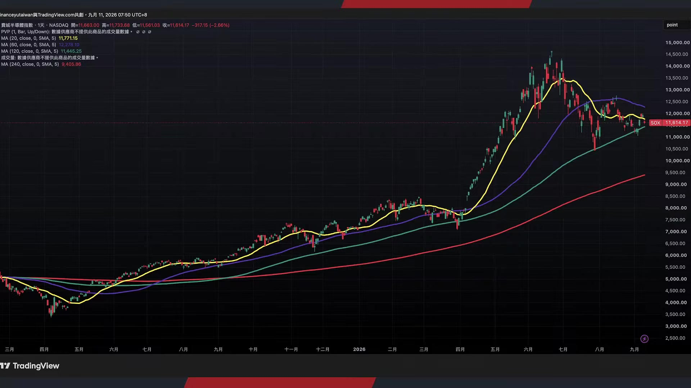

**逐字稿片段：** 不過剛才甲骨文公佈財報 這一次 它在傳統軟體公司把它快速 改造成資料中心巨頭之後 第一季營收還不錯哦 193億 年增幅30% 調整之後的EPS是1.92塊 這比預期還要來得高 好所以尤其它的股價又跌深這麼重 開始做了適度的反彈了 那這些都說明著 股票市場的反應也不過剛剛開始 不用特別的緊張那當然 我們後續要觀察的效果是來自於 那全球這種債券市場的 賣壓局勢會維持多久呢

**話題推測：** 報導甲骨文（Oracle）最新財報數據

---

## 00:23:53

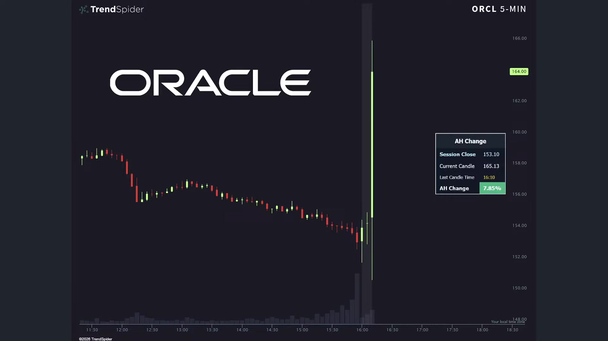

**逐字稿片段：** 昨天大家最為關注的 當然就是歐洲央行 歐洲央行確定升息了 昨天把存款利率上升到2.5% 主要就是通膨高於兩%的目標 那經濟和就業 歐洲央行認為還撐得住 8月份整體消費者物價指數 年增幅從2.9上升到3.3了 好所以這一次是抗擊通膨的根本原因 現在比較大的分歧是 日本央行哦 已經幾乎明顯表態了 升完之後還要再升 讓他升讓他升 可是歐洲央行是升完 之後不一定會再升 包括拉加德 我們看到歐洲央行陸續的談話 其實都說明著9月份 升完之後不代表下 一次馬上就要再升息 現在歐洲央行的態度完全 就取決於這一次升完之後 完全取決於通脹和 能來源數據是否有回檔 否則就形成市場上的集體共識 因為歐洲央行還是 充滿著極大的不確定性 可是我們看到全球央行 全球各大地區的 國債殖利率都在持續的往上推升呢

**話題推測：** 歐洲央行（ECB）升息及歐元區消費者物價指數（CPI）數據

---

## 00:24:49

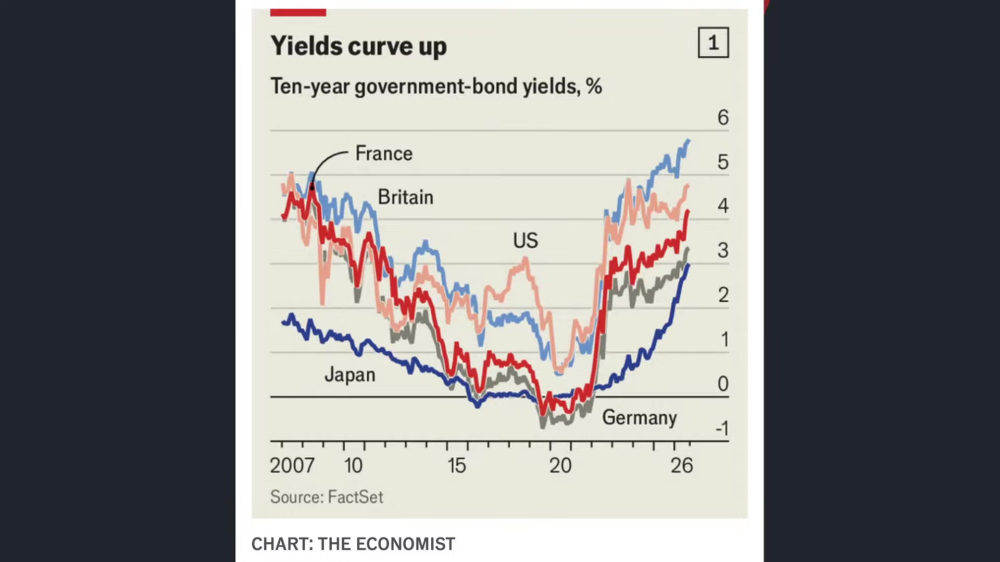

**逐字稿片段：** 法國現在是最危險的 我們看法國10年期公債殖利率 已經衝高到08年以來的新高 那如果是從資產交換利率 主權的信用違約交換CDS 到銀行的信用利差 法國看起來是整個歐洲 現在上行速度還是最快的 整個27年法國的財政赤字 占國內生產毛額是5.1% 政府債務占國內生產 毛額的比例是116% 這在整個歐盟都已經處於偏高水準了 法債資利率已經大多數比歐債 誒之前我們看到歐洲五國都來得高了 好這說明哦法國現在已經 成為歐洲市場當中 債務壓力來的最大 最有可能違約的國家之一 另一個脆弱的就是日本國債 50%是日本央行持有了 所以你要不要讓它違約哦 日本央行只要能夠控制得住 也很困難了 可是法國國債 有56%是海外投資人持有 海外投資人如果開始降低鋪險 哦實際利率就有可能進一步上升 遭受到市場狙擊 尤其我們知道 在最近整個歐洲市場

**話題推測：** 分析法國10年期公債殖利率衝高及其財政赤字和債務狀況

---

## 00:25:50

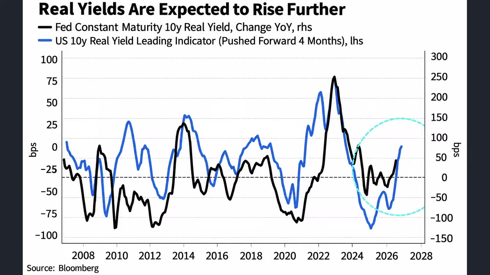

**逐字稿片段：** 都出現了明顯的右轉 德國政治版圖是比較標準的 向右移轉 這次我們知道 德國的另類選擇黨AFD 在東部的議會選舉當中 拿下了14%的選票 相對於2021年是直接翻倍 躍升為第一大黨 那我們過去知道 FD的他的政治初衷 基本上有幾個嘛 包括在移民問題上 是要求立即強化邊境管制 遣返 任何看到的非法移民 難民的部分增設遣返中心 外國勞工 希望更偏向於自動化和本國人口政策 國足認同 強化德國國旗推動 德國優先 那其他對於LGBTQ 對於家庭政策公共媒體 大家大家都可以知道 就是比較偏右 那接下來的政局就有兩條路線了 一個就是我們看到 因為梅爾茲所屬於的 基民黨現在是大幅掉票嘛 投票率現在相對於上一屆 大概減少了19個百分點呢 所以第一種就是默許AFD 開始組成少數政府 開始陸續加入 那第二個就是各黨現在僵持不下 最後提前改選了 不過按照目前德國 另類選擇黨的優勢大概會 搞不好一次就獲得絕對多數 所以現在在短期內當中 德國右轉的方向已經完全確認了 也就是說不管他最後 能不能進入到執政聯盟 基本上 德國內部政策都會開始會來 越來越多 相對偏右的政策開始出爐

**話題推測：** 討論德國政治版圖右轉，另類選擇黨（AfD）的崛起

---

## 00:27:17

**逐字稿片段：** 那瑞典政治也是如此 繼德國右轉之後 現在瑞典大概也跟著右轉了 市場推估了 因為本周日就是瑞典的國會大選了 現在反移民 以及民族主義的瑞典民族黨 應該會成為右派的最大政黨 甚至進入到政府體系當中 誒這個政黨在22年是拿下21%的選票 目前預估至少有30-35%的 這個民調支持率 那更重要的事情是 即便過去4年他沒有正式入閣 其實他已經成功主導 不少的政策方向了 包括打擊幫派犯罪 收緊移民政策 尋求避物者人數壓到40年的低點呢 那大家就會觀察出這 一些政治上的衝擊 會如何影響到債券市場的變化 目前呢我們看法國的勒龐 就是偏右派 2027年的勝率已經來到68% 那 第一輪民調預估會大幅領先 那第二輪情境也預估會占上風 所以應該法國就會做 比較明顯的政黨上輪替哦 那法債現在殖利率又衝高到4.8% 未來 好到底政治事件風險 溢價會如何做反應呢 這個都是在年底有 可能提前發生的方向 當然了它背後其實反映的就是整個 歐洲經濟的內部效果不彰

**話題推測：** 提及瑞典政治也跟隨右轉，民族主義政黨支持率上升

---

## 00:28:31

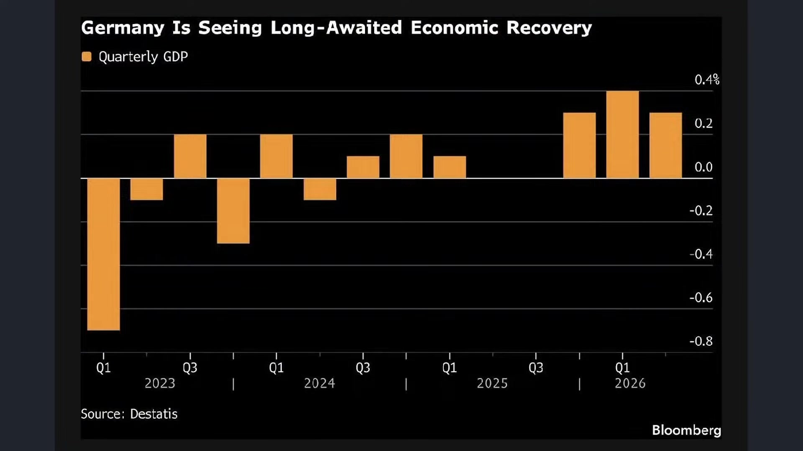

**逐字稿片段：** 我們看在德國經濟的部分好 現在德國的確有點在去工業化的味道 美國現在是新一輪的投資狂潮嘛 可是德國和歐盟這幾年 所推行的綠色轉型呢 高監管和高能源成本呢 導致歐洲尤其是最大 工業國德國的工業產出 居然比2010年還差 就它不是比疫情 錢還差它是比2010年 比20年前的產出還要來的差勁了 好這件事情就說明著 整個德國經濟雖然絕對體量在增長 但是體量增速 已經開始不保了 歐洲工業巨頭的西門子 一樣面臨到比較大的 工業自動化的挑戰 中國的自動化 工業龍頭匯川科技 目前準備要並購 加速進軍歐洲市場 我們預估在2026年到2027年 就會正式取代西門子 成為全球最大的 工業巨頭 那匯川科技在歐洲現在 大概只有1%的員工哦 但是按照中國的產出 已經把德國給壓下去了 這就代表著歐洲正在錯過一方面 之前我們講的AI經濟列車 因為現在臺灣和南韓 是靠整個AI列車 我們看出口年增幅大幅的向上 那歐洲市場呢 並沒有因此而受惠 那在原本既有的工業 汽車自動化技術當中 又被中國碾壓 好所以形成一系列對於 國債市場的顯著擔憂

**話題推測：** 分析德國經濟「去工業化」現象及工業產出數據

---

## 00:29:51

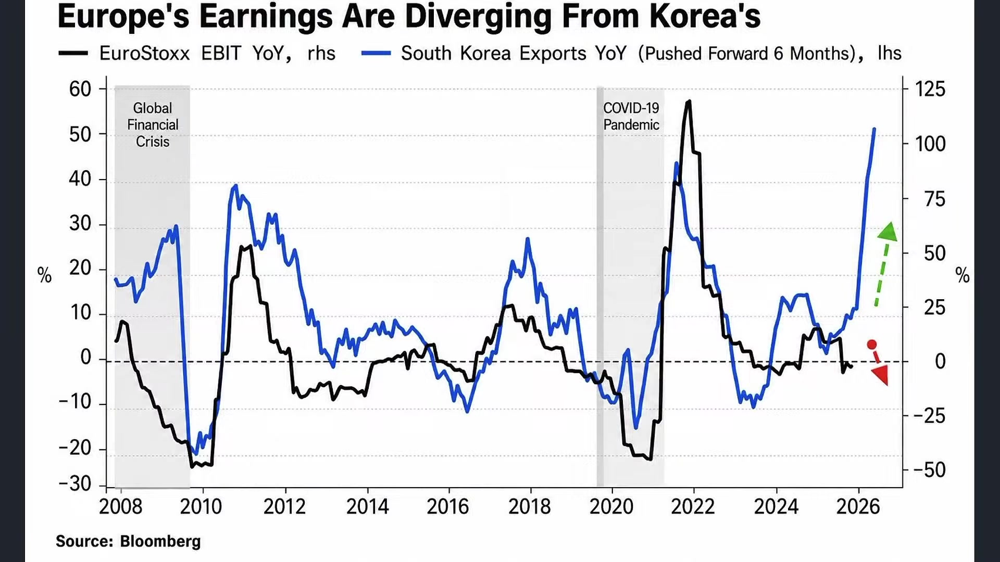

**逐字稿片段：** 它形成一系列的社會壓力嘛 一方面我們知道歐洲現在還是大缺工 所以西班牙預估會 一次特赦120萬名移民 那歐洲各國會擔心會否 重演2015年的移民危機

**話題推測：** 討論歐洲勞動力短缺及西班牙特赦移民計畫

---

## 00:30:04

**逐字稿片段：** 那另外一方面是毒品問題 這個古柯鹼現在席捲歐洲 歐洲現在是古柯鹼 全球的最大目的地 在川普加查嚴格打擊之後 我們看到好現在歐洲毒品問題 整體歐洲骨科級的價格大概在 過去四年當中下跌了18% 純度提高44%的 那包括比利時 一系列國家 針對海關的檢查率哦 在今年都開始顯著的提高 這一方面社會問題的發酵 另外一個我觀察到的

**話題推測：** 報告古柯鹼在歐洲的氾濫問題及其價格/純度變化

---

## 00:30:34

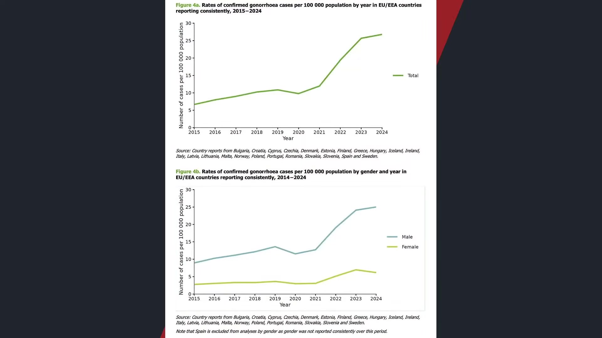

**逐字稿片段：** 數據是歐洲的性病大爆發 根據目前歐洲CDC的預估 2024-2025年 大概有10萬例的淋病 這是2015年的3倍以上 那歐洲人口這十年 人口增長也沒這麼多 但是居然得淋病的人數增長了3倍 梅毒是上升到4.6萬例 相對於10年前也是接近翻倍 那當然呢 疫情之後的檢測可以 解釋成一部分的反彈 但世界衛生組織認為 主要的原因可能是因為 年輕人使用保險套的使用率下滑 哎呦 所以部分高風險族群呢 也可能會因此而遭受到持續性的感染 那有些人呢 也不只是病例變多的問題 可能是延誤治療或者 抗藥性風險等等 所以造成數據 我們從數據圖表上來看 它的確是居高不下的 難怪我今年過年去歐洲 我也覺得癢癢的 沒事 聽說最近很多人去打HPV疫苗 還是要多多保護自己 OK我們剛講了很多了 主要跟投資朋友分享是 在全球國債利率市場持續暴升底下 對於股票市場的壓制有多少 那你說債券失火 股市失火了嗎 股市降溫而已啦

**話題推測：** 揭示歐洲性病大爆發數據，淋病和梅毒病例顯著增加

---

## 00:31:42

**逐字稿片段：** 現在臺北股市下跌623點 還在46,000呢 好這也說明著 好全球股票市場 普遍是認同是有機會能夠 同時搭配著高利率偏高估值的 那即便很多人說現在點位是高估值 可是從實質本益比來看 它都甚至不是高估值 它甚至是低基期 所以給投資朋友做一些思考 總結而言呢 我們看到一系列的國債衝擊基本上 國債是失火了 不過債卷僅僅達到降溫的效果 甚至連恐慌情緒都還沒有發酵 我們還要拭目以待 不過對於長債的市場賣壓 看起來真的會維持一陣子 短債可能頂多就是類現金的資金佈局 還可以稍微考慮 好可是全球的主權債 在AI投資沒有緩下來之前呢 你要知道AI還在不斷地吸收走國 債的資金呢 好那最後幾分鐘 我們跟投資朋友導讀一本書 今天導讀這本書叫做演算法 我們一直跟投資朋友分享 讀書是很重要的 讀書有一種管道哲學了 就是我們不是把知識 強行的裝到自己的腦袋裡頭 是讓不同人的人生經驗 思想能夠流通自己的管道 一個人活到30歲 最多只有30年的人生經驗 但你讀一本傳記 讀一本好書 它可以把一個人的80年流經你 讀歷史你可以 從幾百年的興衰當中 然後讓你瞭解到先人的想法為何 讀投資讀心理學 讀哲學都是如此 所以我覺得書不是你 說讀了就要記下來 而是有一個觀念流過你的時候

**話題推測：** 報告臺北股市的最新下跌點數

---
