# yutinghaofinance_rTnPsm_gAhA — 關鍵畫面索引

- 來源逐字稿：[yutinghaofinance_rTnPsm_gAhA_FIN.srt](yutinghaofinance_rTnPsm_gAhA_FIN.srt)
- 影片：https://www.youtube.com/watch?v=rTnPsm_gAhA
- 截圖數：29

## 00:00:34

**逐字稿片段：** 節目開頭來跟投資朋友宣傳, 下禮拜六晚上8點鐘就是我們財經浩角在第四季的聽友會了, 每個季度我們都會針對當前行情來做一些推演, 也會針對過去一個季度的資產操作和行情判斷來做檢討, 直播主要分享一些市場動態給大家, 具體個人的操作和實際觀點 都會在我們的訂閱系統當中來做分享 短期波動都是這樣子變來變去的 最近雨也停了 行情也回來了 但長期它一定會依循著某些規律 我們在聽友會當中 還有在訂閱系統當中 就是去尋找這樣的規律 如果大家對我們的內容有興趣的話 也可以來我們的網站來下取訂單 下週就可以直接在網站上來做收聽 或者對於我們的內容更有興趣 也可以來我們的會議系統 裡頭除了一整年的聽友會的收聽權 也會有一些個人資產部位周知 一些專題影片和宏觀報告 當然我們一直跟投資朋友分享 雖然短期的情緒變來變去 但是有沒有發現中長期 它就是會出現一定程度的乖離回調 而更長期反映的是生產力的突破 所以我們一直跟大家分享 每一次市場恐慌的時候 你記住你週期不要放得這麼短 你把眼光放遠一點 關稅戰真的很嚴重嗎 每一戰是真的很嚴重嗎 人人都上槓杆 真的很嚴重 好像有點嚴重 但是去化槓桿以後 也沒這麼嚴重 不要只盯著短線上來看 以前人家說 說那個母雞 為什麼能夠天天下蛋 你要這樣想 一隻好的蛋雞 一年是可以生300顆蛋 那母雞下蛋 它是為了要繁衍後代 照理來講 下完了蛋 自然情況下 它是要孵蛋的 那你天天下蛋 那你哪來時間孵蛋呢 所以原因很簡單 因為母雞天天下蛋 它是為了要湊上 一窩蛋 比如說十個 那以後就好孵蛋 這個叫做爆窩 就叫做孵窩 但是你想想看 他每下一個 你就給他偷拿走一個 他每下一個 你又拿走一個 他每一次都沒有湊滿十個 那你知道天天下了嗎 再加上那些高陰陽的飼料 人工打光的作用 那下蛋就永無止境 所以你要看 如果你天天盯著一個 小目標努力的人 每天都為了當充那幾塊 那你可能也會遇到這樣的問題 所以我們的眼光一定要放遠 我們在聽語會當中來尋找 如何把自己的眼光給放遠 好那回過頭說 回答事實在昨天 一系就暴增了4420億 股價單日大漲8.7% 哇這個是2025年4月份以來的最大漲幅 基本上把過去7天的顯著跌幅給收斂了 當然這一次有點特殊的原因是來自於 它並不是股價平盤之後的大漲 它是因為已經連跌好久了 所以好不容易把過去的跌幅給收斂 所以才漲這麼多 市值一天增加4420億 這是全球股市史上第二大的單日市值增幅 僅次於微軟不到一個月前所創下 4500億美元的記錄 當然推升股價的關鍵

**話題推測：** 宣傳聽友會及訂閱系統，可能顯示活動資訊或QR Code

---

## 00:03:34

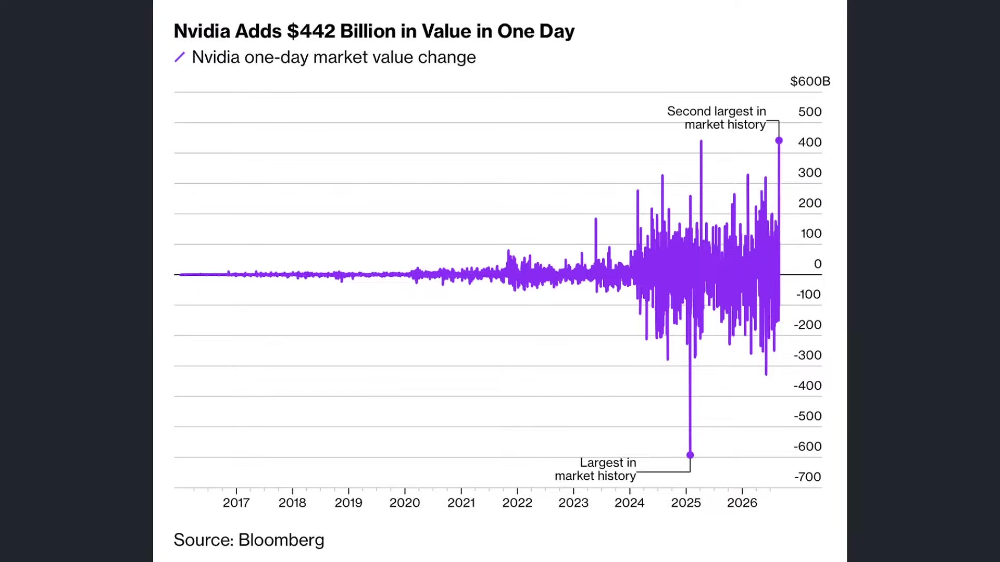

**逐字稿片段：** 就是輝達預估下一個會計年度的營收 還是可以成長70% 原本市場預估也不過45% 說明明年仍然保持高強度成長 那這一項展望就代表著市場預估 未來可能大家還把輝達的營收 做了顯著低估 輝達看起來整體出貨動能 比想象中還要來得強勁得多 那當然某種程度而言 也必須思考 輝達這一次財報考驗落後 很快的華許就要召開 Jackson後的演說了 這是華許第一次在聯準會當中 發表重要談話 那我們要知道

**話題推測：** 提及輝達預估營收成長率，可能顯示財報數據或分析圖表

---

## 00:04:10

**逐字稿片段：** 前兩天美國最新個人消費支出 物價指數PC 它其實是比市場預期還要來得高了 很多聯總會內部的官員也重申 如果物價無法達到有效的降溫 不排除進一步升息 所以一邊是輝達所帶動的基本面行情 可是整個利率市場 信用市場仍然不是特別樂觀 尤其華許這一次 釋放鷹派的可能性還是偏高 雖然公債殖利率沒有太大的一個波動 那也許只是反映他的前瞻指引不明確 可是他的態度 從上一次的談話就可以看得出來 我們先看這一次的PC數據 這一次7月份的PCE通膨數據 當然不是通膨失控 就是降溫的速度始終不快

**話題推測：** 討論美國最新個人消費支出（PCE）物價指數，可能顯示PCE數據圖表

---

## 00:04:50

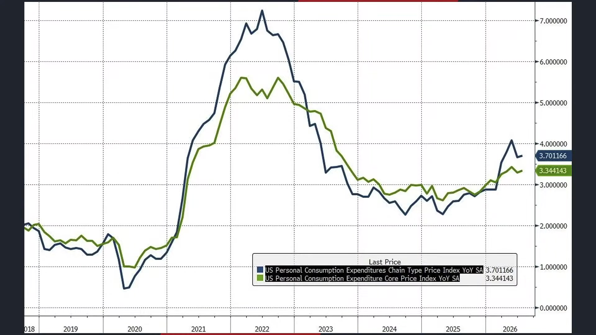

**逐字稿片段：** 聯準會長期關注的核心PCE月增幅是0.2% 年增幅3.3% 大致符合市場預期 但年增幅還是有比較明顯的走高 整體PCE月增幅有0.2% 也比市場預估的0.1來得高 年增幅3.7% 所以通膨當然7月份不太可能再大爆發了 可是你要往2%的目標走 看起來時間更久了 如果拆開來看 美國內部的通膨其實非常分化 從非耐久裁的7月份數據來看 它是持續下跌的 原油價格因為當時回落 壓低了相關的能源支出 可是真正撐住通膨的還是服務業 服務價格還是有粘性 即便油價下跌 部分商品降價 所以這代表的核心通膨 你菜價肉價下跌 便當價格肯定跌不回來的 所以這是服務通膨 目前產生僵固性的原因 那比較值得注意的是

**話題推測：** 提到核心PCE的月增幅和年增幅數字

---

## 00:05:41

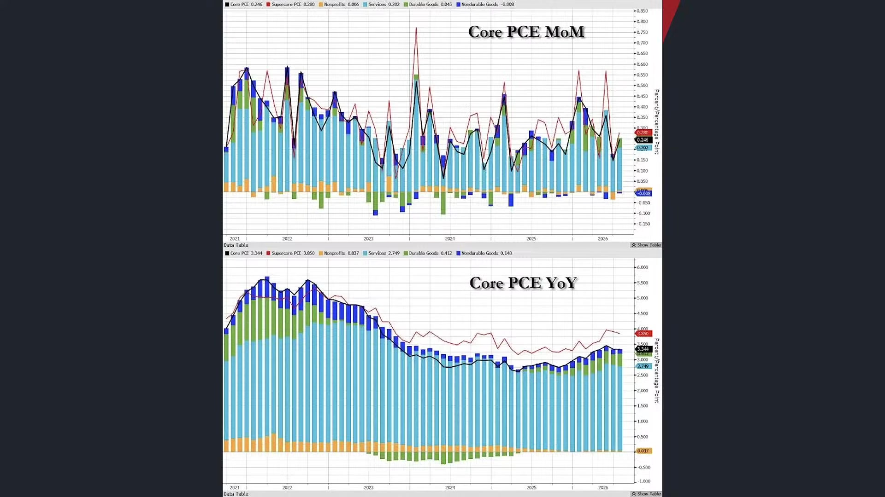

**逐字稿片段：** 是剔除住房之後的服務業通膨 也就是超級核心PCE 就不看房租了 連政府其實還是勉強有遞還的 所以其實現在的核心通膨 還有一大一部分是來自於 那個住房僵固性很高 這沒有人在降租金的 所以這就導致 服務通膨也沒有到非常惡化的地步 雖然通膨是有一點棘手 但是絕對沒有到停滯性通膨的地步 就是有一點僵固性 最特殊的地方是哪裡

**話題推測：** 討論剔除住房後的服務業通膨（超級核心PCE）

---

## 00:06:08

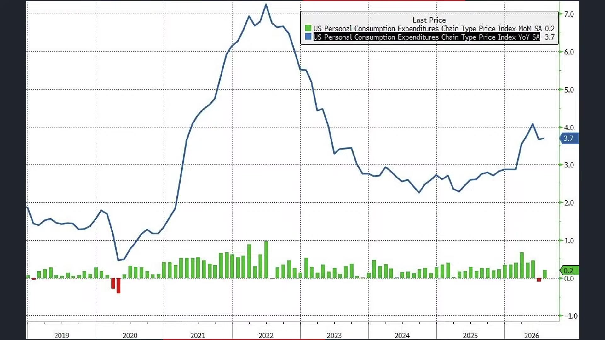

**逐字稿片段：** 是這一次我們看到 是投資組合管理和財務顧問的服務價格大幅上升 成為了核心服務PCE當中最重要的推手 投資組合財務顧問費用 投顧老師費漲價了 有可能不是 這應該是講的是麥肯齊 或者大型商管顧問 聯合性的漲價 相關項目的漲價商務 它居然超過了一半的核心PCE服務同盟 那說明什麼 金融市場本身也開始透過資產管理費用 影響通膨數據 今年這麼多人要IPO 當然花了多抽一點 多賺一點點 嘗試的做漲價 以前我們都把核心服務通膨 都是聚焦在房租 醫療工資這一類的 現在金融服務費用 都變成通膨的一部分了 所以未來投顧費用就越來越高了 大家請試 當然消費者這一端

**話題推測：** 特別指出投資組合管理和財務顧問服務價格大幅上升為通膨推手

---

## 00:07:03

**逐字稿片段：** 並不是特別好 但也沒有到垮掉的地步 整個7月份的 明目個人消費支出 月增幅是0.2 個人所得增加0.4 比預期來的強 這代表著勉強實質薪資 重新回到正值

**話題推測：** 討論7月份名目個人消費支出及個人所得數據

---

## 00:07:16

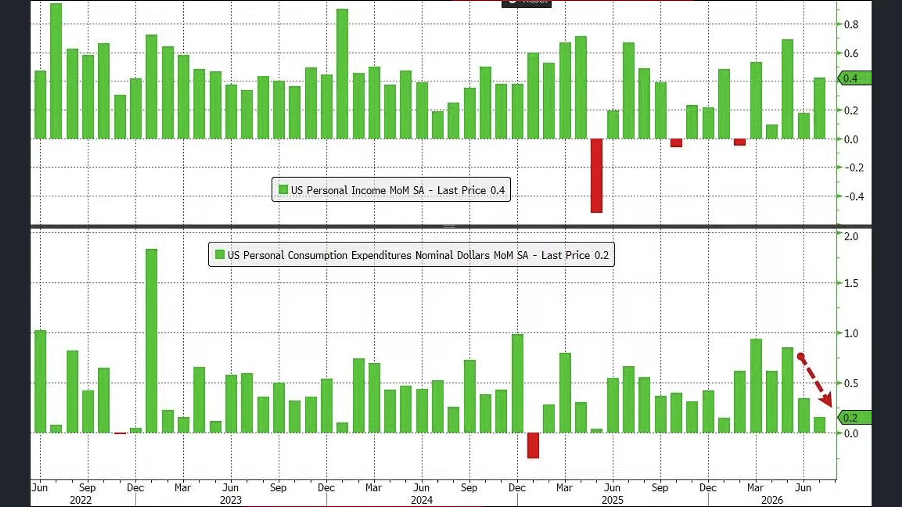

**逐字稿片段：** 不過所得和消費的年增數 其實在過去一段時間都在放緩 政府部門的員工薪資 已經降到1.4% 這是過去2021年 四年來的最低 民間薪資部門 也從原本的4.6%下滑到3.8% 這個是創下今年以來的新低 所以扣掉通膨之後的 實質個人消費指數 如果是以年度來看 今年其實還在收縮 明目消費現在是在增長 不代表大家買了更多東西 其實只是價格變貴而已 有時候我們看到營收創高 不代表大家買得更開心了 有可能是因為東西變貴了 所以貢獻你的營收創高 但你的利潤也不一定會因此而拉昇

**話題推測：** 討論政府及民間薪資年增數放緩的數據

---

## 00:07:56

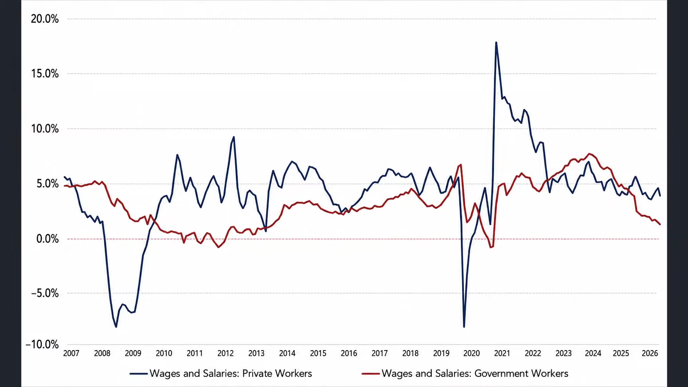

**逐字稿片段：** 事實上我們看美國消費者 現在所面臨的處境 現在先買後付的這種使用量 這幾年是持續性的大幅創高 整體成長幅度不低 這個叫做BNPL 叫做Buy Now Pay Later 就是你其實在蘋果的官網 部分國外的官網都可以看到 就是先買後付 它跟信用卡還是有點不太一樣 它是讓消費者把電視傢俱 旅遊的支出攤開付款 那你不用繳相關的循環利息 你是直接進行分期 那美國成年人使用銷售點融資 和先買後付的比例 這一段時間是非常快速的上升 比如說你分期買2000美元的電視 是消費選擇 那如果你慢慢的往下延伸 變成一頓餐 現在連很多午餐 他都可以選擇分期 那就代表著現金流的緊繃情況 來得更為顯著 這個是消費端的弱化 它仍然在持續存在 所以一方面當然有降息的理由 就是消費的確在弱化 就業在軟化 可是不降息的理由就是 它沒崩潰 消費也沒有破產 財富效果還存在 就業也沒有產生大裁員 裁的都是那些工程師 工程師總是找到其他工作的 最後所呈現的效果 就是以美國經濟作為總定謀

**話題推測：** 討論美國「先買後付」（BNPL）使用量大幅創高現象，可能顯示相關趨勢圖

---

## 00:09:09

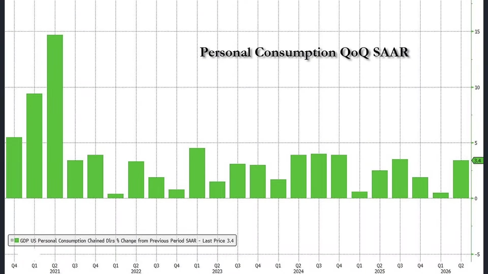

**逐字稿片段：** 美國第二季的GDP 最新修正時是年化1.5% 算是符合市場預期 不過如果拆開GDP結構 整個第二季幾乎是靠消費者勉強撐住 個人消費對於整體GDP貢獻是高達2.3% 那季增幅是3.4% 不只是高於市場預期的3.2% 但這件事情都說明著 美國民眾現在的消費是拖動經濟的主因 可是美國民眾的消費 有很大一部分是借錢來的 這說明美國現在買的東西變貴了 所以才被迫要增加消費 這是比較大的一個壓力 另外一個真正坐險處拉動的是固定投資 那這就不用講了 這就是AI 因為非住宅建設 現在正在大幅度的擴展 尤其是資料中心和智慧財產相關產品 很符合現在美國的經濟樣貌 那反而拖累的有哪些 比如說進出口它是拖累的 私人庫存是拖累的 政府支出在收縮也在拖累 所以美國現在就是消費靠投資財富來撐住經濟 那AI投資也嘗試的撐住經濟 那其他呢全部都在往下掉 所以這是市場上壓力比較大的一個部分 某種程度而言 它不代表所有經濟部門非常的疲弱 但是拆開來做思考 你會發現美國經濟現在所處於的實質現象 那就是不同數據相互交錯 形成之後形成的結果 美國GDP實質表現 我只能說算是不好不壞 但是你細猜就會發現 你以為消費還不錯 但就算那個消費 大部分也是靠借貸撐著的 所以真的就沒有美伊戰士 可能早就已經在降息格局了 這比較殘酷一點 但有時候我們看數據 就是要被迫把它拆開來 一個一個看 要不然你還覺得 活在美國經濟大好的幻覺

**話題推測：** 討論美國第二季GDP年化增長率，可能顯示GDP數據圖表

---

## 00:10:54

**逐字稿片段：** 美國經濟 待會我們聊臺灣經濟 跟臺灣經濟是完全不同的處境 所以有時候資訊不完整 你如果沒有把數據看得清楚 你也許在背後思考它的過程 你會發現得出相反的結論 市場也一樣 有時候一份財報 你只看營收 你也不看獲利 看下EPS 或者看下錶外資產 有些人認為需求很強勁 有些人擔憂獲利跟不上 聯準衛會說通膨正在降溫 那多頭聽見降息 那代表空頭聽見經濟衰退 所以不管怎麼說 你要先了解 投資最危險的不是沒有資訊 而是拿到資訊以後 你要嘗試把它做拆解 做一個比較宏觀的輪廓 比較重要 昨天網友傳一個笑話給我 他講說一個男的 三顆睪丸 怕人家嘲笑 保守秘密20年 結婚當晚 鼓起勇氣 對太太說 老婆 我告訴你一件事情 其實我們這個婚房裡 現在有三顆睪丸 那新娘子一聽完 瞬間變臉 你只有一顆 所以有時候 資訊不完整這件事情 你如果當下沒有做好 宏觀訊息的收集 再把它做細節的拆分 來好好了解 有時候判斷就會嚴重失誤 那可能所遭受的投資後果 就會相當大 好 那給投資朋友做一個思考 那當然 美國到底實質的消費領域 有沒有慘到美國經濟 被迫要立即降息的地步 當然是沒有 目前美國8月份的服務業 甚至還在走高 說明剛才我們看到的 先買後付的大幅拉昇 還有美國實質所得的一個衰退 都還沒有影響到 美國就業市場全面的惡化 服務業現在甚至還是缺工的情況 在標普8月份的服務業 PNI是56.8 這比7月份的54.6還要來得高

**話題推測：** 話題從美國經濟轉向台灣經濟

---

## 00:12:41

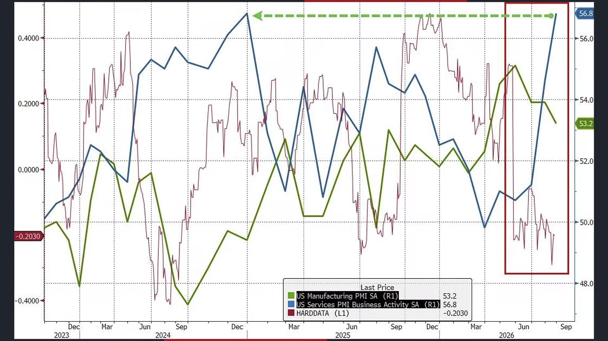

**逐字稿片段：** 那你說那現在房地產市場好嗎 債務壓力會不會太大 美國房價創下一年來最快漲幅 這明明利率這麼高 沒有人在買房 怎麼房市會這麼好呢 其實城市的差異還是相當明顯

**話題推測：** 討論美國房價創一年來最快漲幅，可能顯示房價指數圖表

---

## 00:12:54

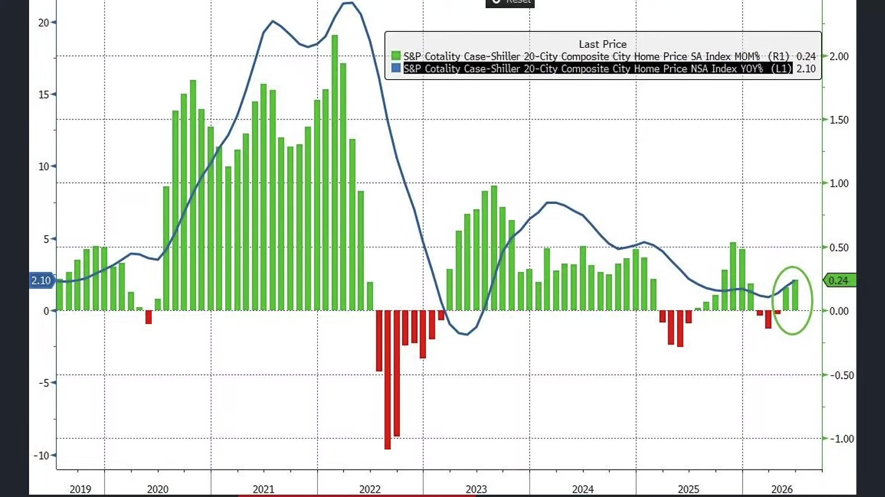

**逐字稿片段：** 芝加哥是連續4個月排行第一 6月份房價年增幅有6.9 紐約4.8 克里夫蘭4.1 那西亞族反而西岸 或者拉斯維加斯 反而是下跌2%和1.9% 那真實的原因還是來自於 因為跟臺灣一樣量縮了 在房價統計的過程當中 不管房價漲得跌的 它都高速量縮 所以樣本數過少的情況底下 容易由於單一個案形成嚴重失真 這個是我們觀察到的實質現象 美國房地產市場 其實產的時間已經比臺灣久多了 臺灣當時還有一個新金安嘗試做拉動 現在美國、歐洲、臺灣房地產 基本上都處於高度收縮的情況 這跟利率的環境密不可分

**話題推測：** 列舉美國主要城市房價年增幅數據

---

## 00:13:39

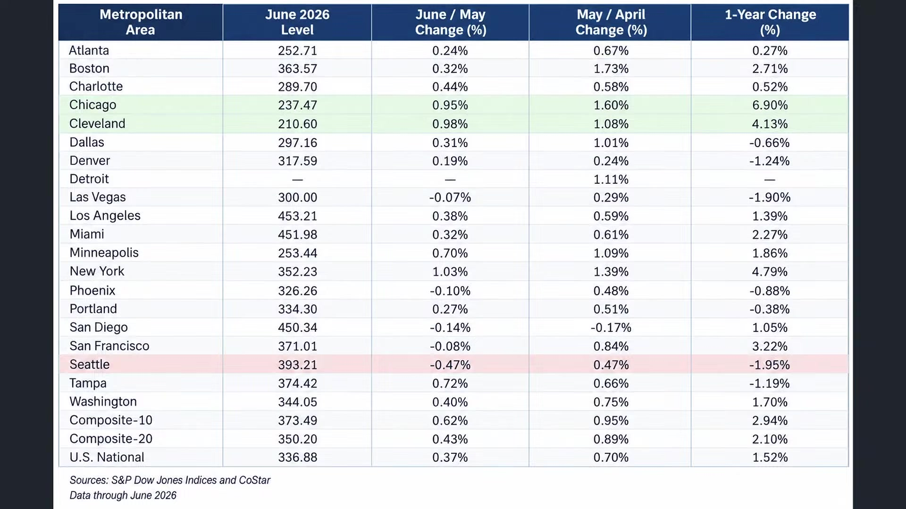

**逐字稿片段：** 我們看一下四大指數表現 道瓊指數上漲105點 0.2% 輸在53569點 標普上漲55點 0.72% 輸在7730點 納指上漲411點 1.57% 輸在26541點 費辦上漲270點 2.3% 輸在11882點 不知不覺行情又到十字路口 又重新回來月線際線 那輝達這一次當然剛才講到 是對於本輪股票市場 有顯著拉動的根本原因

**話題推測：** 報導美國四大指數的漲跌幅和點數

---

## 00:14:11

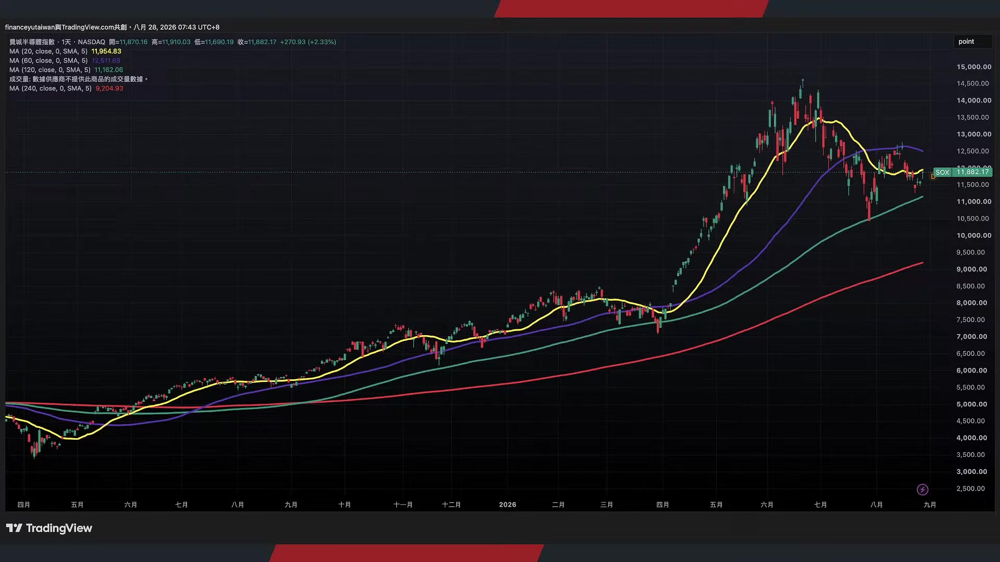

**逐字稿片段：** 我們其實這一次有跟投資朋友提到 最大的一個觀察重點 來自於輝達正式的 把這塊筆成功的做大了 你不要看它毛利率好像下滑一點 那是因為記憶體價格上漲的影響 可是在根本背後

**話題推測：** 重新討論輝達營收結構，特別是ACIE業務的擴大

---

## 00:14:24

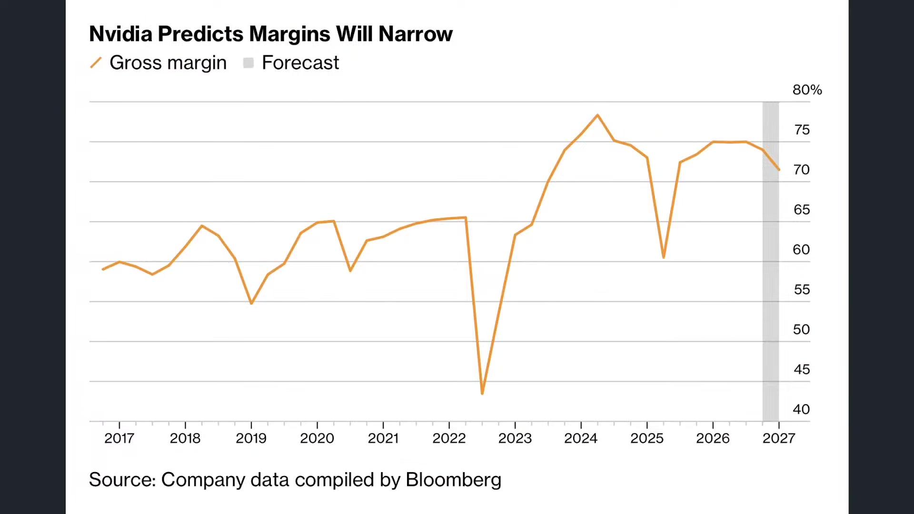

**逐字稿片段：** 我們看到它的ACIE 這個ACIE的營收 就是AI Cloud的Infrastructure 還有Enterprise 也就是AI的雲端基礎設施 和企業客戶 你看它的總利潤 總營收是962億 有接近400億 是來自於ACIE 這個ACIE跟超大型雲端業者的 營收規模 它是不同分項 以前我們都覺得 輝達就是靠這幾隻巨頭 能夠撐下去 那這幾隻巨頭 稍微出點事那就完了 比如說Meta不完了 微軟不完了 Google不完了 任何一家鬆動都是重大打擊

**話題推測：** 介紹輝達ACIE（AI Cloud Infrastructure Enterprise）營收細項及其數據

---

## 00:14:59

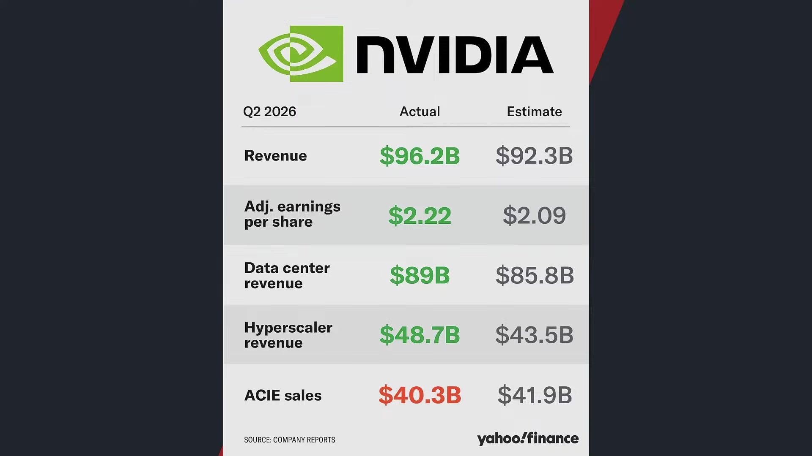

**逐字稿片段：** 可是這個ACIE 它代表的是AI雲端服務商 代表的是GPU的雲端業者 代表的是企業客戶 甚至有一些政府的訂單 主權AI專案等等 輝達已經正式把這塊餅成功的做大 這個變化很重要 因為我們以前都很擔心 一兩個大客戶一倒臺 這個去跟game玩不下去就完了 那黃仁勳現在講的轉折點就是 過去大模型主要由少數幾家公司來推動 可是現在越來越多的AI實驗室 同步的擴大算力 開放模型 那這個時候 企業AI 實體AI 正式進入了部署階段 我認為這是本輪財報季當中 我覺得最值得大家觀察的消息 就是不靠期巨頭了 現在大家都在做AI 而且往終端產品的投送 越來越明顯了

**話題推測：** 進一步解釋ACIE代表的客戶群，可能顯示客戶類別圖

---

## 00:15:45

**逐字稿片段：** 每個人都有AI的需求 我舉幾個比較明顯的例子 你像服飾商品 現在很多服飾電商 大家上網看 每年都因為退貨 承擔數十億美元的物流成本 現在像是ZARA Google 一系列的美國公司 都幫助美國的電商 開始投入AI虛擬試衣 就是希望降低消費者 一次買多個尺寸 而且這不太一樣 以前都是很直接的套版 衣服直接蓋住自己的身體 現在它會根據你的3D掃描 你告訴我的三維 或者把你的全景圖 就是你把你的身材 用影片環繞一圈 然後給我 我就用生成式AI 把使用者的照片轉化成虛擬人物 讓消費者直接查看不同服裝的搭配效果 你還可以上半身跟下半身穿的不一樣 鞋子也不一樣 那技術就越來越逼真 那這樣的一個需求導致電商產生一系列的轉折 你如果沒有做這樣的一個試衣服務 未來可能整個電商消費者的購買意願就不高 而且你還要承擔數十億美元的物流成本 因為有很多人會選擇退貨 現在就是AI已經可以估算尺寸和視覺效果 那差別就在於如何在觸感 在鬆緊度在重量上 符合每個人舒服的主觀標準 所以你喜歡你可以按一個喜歡 他到時候就會記住 你喜歡這類型的一個輪廓

**話題推測：** 舉例說明AI在服飾電商虛擬試衣的應用

---

## 00:17:03

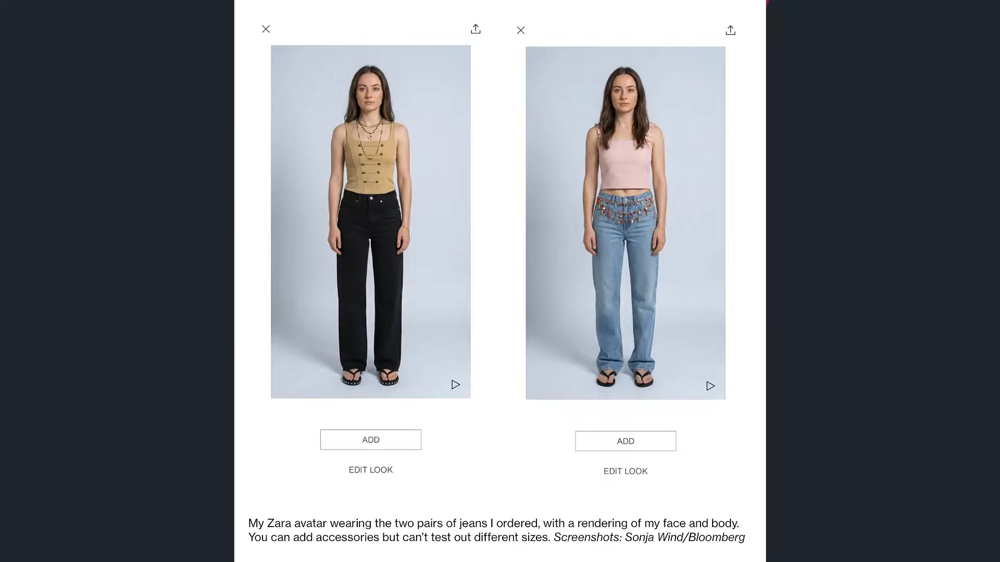

**逐字稿片段：** 像我這兩天我去理頭髮 我就很明顯感受到 那個AI已經不是什麼遙遠的科技了 他開始進入到日常生活 我看到那個髮型設計師 在跟客人討論造型的時候 很多很熟練的用那些AI軟體 直接模擬不同的髮型 劉海髮色在客人臉上的效果 甚至可以進一步討論臉型 五官比例 你適合什麼樣的造型 以前剪頭髮 當然靠設計師 你就拿一個照片 我要這樣 有時候不一定適合 他也不知道怎麼說服你 加上客人拿幾張照片 你就好像強迫他一定要剪這個頭 剪完不好看又要怪他 所以現在用AI 把想象中的效果給做出來 其實非常有意思 以後我們剪頭髮 買衣服 化妝 裝潢 這些很普通的生活場景裡頭 一點一點的就變成大家 習以為常的工具

**話題推測：** 舉例說明AI在髮型設計中的應用

---

## 00:17:54

**逐字稿片段：** 這兩天我才看到有網友 幫我生成了不同我的髮型的圖片 大家可以看一看 它分為四張 左上角是短板三七分 微側分 兩側稍微收短 頭頂蓬鬆露出額頭 這比較有點類似那個 是張孝全 還是韓國人的形象 右上角就比較那種韓系的碎蓋短髮 看起來會比較年輕 不過風格在臺灣好像蠻多小屁孩會理這個頭 好像不是很適合 左下角的話就有點像木村拓哉 就髮根很蓬鬆 輪廓感強 右下角的話就是知性美 比較溫柔一點點 網友幫我生成 不然大家投個票好了 從左上到右下 分別是1234 三式 從左上到右下 我自己是比較偏好三 因為前面兩種頭我都算留過 第三個我比較躍躍欲試 第四個有點挑戰 我怕我被自己迷倒 其實我這個髮型 從我當兵之後就沒有變過了 反正是我大學換過很多種 因為人都要尋找自己的定位 但也是這麼多年最後我才選擇把兩邊推高 這種簡約髮型 為什麼 因為有時候 人到激情處 有時候女朋友 太太 抓頭髮 抓住 這麼短就抓不到 抓不到就不會受傷 但是很久沒有被抓了 所以很想現在被抓一下 不是情到激情處 情到憤慨處 很生氣的時候 你要讓對方有地方可以抓 像我們這種靠臉吃飯的 不給他抓頭 就要揍臉了 對不對 所以1234 大家偏好哪一種 我自己是偏好3

**話題推測：** 展示網友用AI生成的四種髮型圖片

---

## 00:19:42

**逐字稿片段：** 以前我們跟大家分享過 如果你想要引起一個人的 注意和好感 以後可能大家會分享很多自己的AI圖片 我適合哪一種髮型 一些圖片 你該怎麼做 如果你很喜歡一個女生 你點贊沒有用 贊完就沒有下一步 你加幾個字評論 真好看也沒有用 女生覺得你是怪怪的人 沒有太大效果 那最好是什麼呢 最好是寫第三張最好看 這樣子她回覆你的可能性就非常高了 為什麼 因為你在這個世界當中就引起了一個分別 切出了一道鴻溝 產生了一個他自己的問題 他要麼能夠回答 對啊 第三張最好 要麼就需要向你求助 為什麼是第三張呢 所以跟別人交流最好的方式 從來都不是要討好他 你要創造一個 只有他能夠解決的問題答案 而且你剛好可以給出相對應的答案 所以如果他只有兩張照片 你也回他第三張最好看 他會受不了 哪有第三張啊 對不對 大家都選四啊 這是四四和五嗎 要不這樣吧 等我們訂閱數突破70萬 那好像太容易了 700萬我就養法好不好

**話題推測：** 分享關於社群互動和引起好感的技巧

---

## 00:20:56

**逐字稿片段：** 時間聊太久了 好我們剛才跟投資朋友 分享一下整個美國股市市場的概況 來看一下輝達的帶頭蟲 與此同時 美國內部經濟分化的表現 那回過頭說 華許的談話還是非常重要的 因為他會奠定 目前的信用市場利率環境 適不適合繼續借錢 我們要知道 韓國央行在昨天 已經正式宣佈升息一碼了 那不像臺灣都半碼半碼來 南韓央行這一次是把基準利率 從2.75調高到3% 這是7月16號之後 連續第二個月升息 你知道南韓第一個 物價已經快受不了了 現在大概在3.2到2.8%左右 壓力還是很高 那另外一方面 我們也知道南韓市場現在的概況 這個5月6月借多少錢 經濟加速有多快 出口又暢旺 經濟比預期強這麼多 通膨又降不下來 直接升息了 那你要回過頭說 南韓這種經濟成長 它也不過3%到4% 臺灣是10% 那按照這個角度 臺灣不是要高強度升息了嗎 我們剛才彭博所做的報道 彭博是認為 臺灣現在的經濟實在是太強勁了 尤其通膨最近在同時升溫 彭博的預估是 中央銀行很有可能在9月份 裡監事會議會直接升息 我們正常的態度是什麼 就是應該會等到11月28號 地方選舉之後再行動 楊總裁之前 3月以來也多次強調 如果通膨持續升高 貨幣政治會轉向緊縮 可是我們知道 央行和財政部跟行政部門 一直都有一定程度的協調 包括之前新金安的時候 也是如此 從正常邏輯來看 你不太可能覺得 他在地方選舉之前會升息 可是彭博認為 按照目前的經濟成長 和目前的通膨數據 是有必要立即採取行動 為什麼 你要抑制市場預期 你不能讓大家覺得 資產價格就一路的上漲 永遠都可以 以如此樂觀的速度上行 那最後可能會錯過 升息的最好時機 不過我個人是比較偏向 選後再採取行動 我對於臺灣央行 目前所採取的做法 我認為當然還是會有 執政層面的壓力 這是被迫的 這當然點到就好 但是我個人的看法是 我不太認為 9月份馬上就要升息 為什麼 因為現在建設商 所給予的集體賣壓 市場的壓力 陸續在浮現當中 我們看一下這個市場上 市場端跟財政端的一個角力 但至少可以承認 彭博講的是有道理的 因為臺灣景氣真的有點好得不得了

**話題推測：** 總結美國股市和經濟概況，並再次強調華許（Powell）談話的重要性

---

## 00:23:21

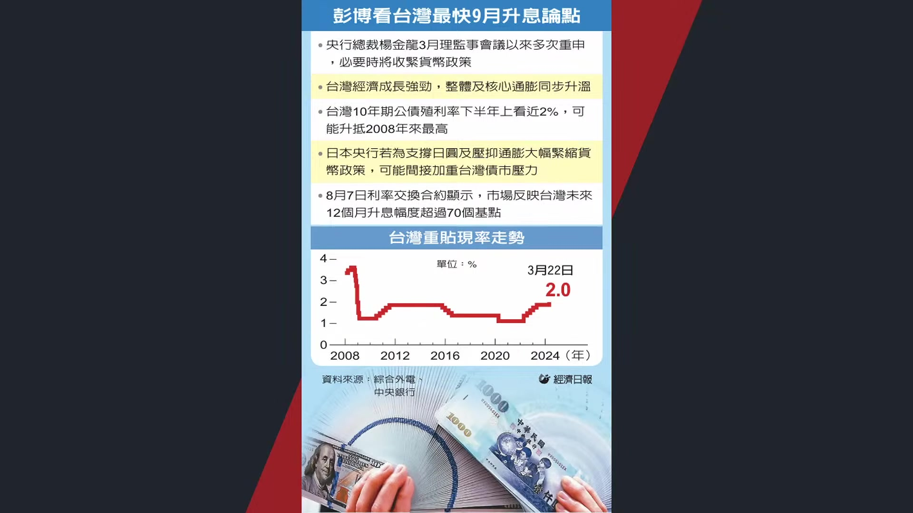

**逐字稿片段：** 我們看最新臺灣公佈的景氣信號燈 這一次7月份是41分 連續8個月亮紅燈 臺灣已經連續8個月闖紅燈了 雖然7月份有中東局勢 有油價有外資賣超的影響 M1B是減少了 但是這也是資金流稍微比較緊繃一點 可是幾乎所有指標都已經來到顯著上行 比如說我們看到過去連作為疲憊的傳展 所導致的製造業營業氣候測驗點 它都從綠燈轉為黃紅燈 股價指數紅燈 工業生產指數紅燈 製造業銷售指數紅燈 工業服務業加班公司黃紅燈 海關出口值紅燈 機械進口值紅燈 批發零售業紅燈 幾乎臺灣景氣進入到高強度爆發 高強度熔景期

**話題推測：** 討論台灣7月份景氣信號燈連續8個月亮紅燈的狀況

---

## 00:24:06

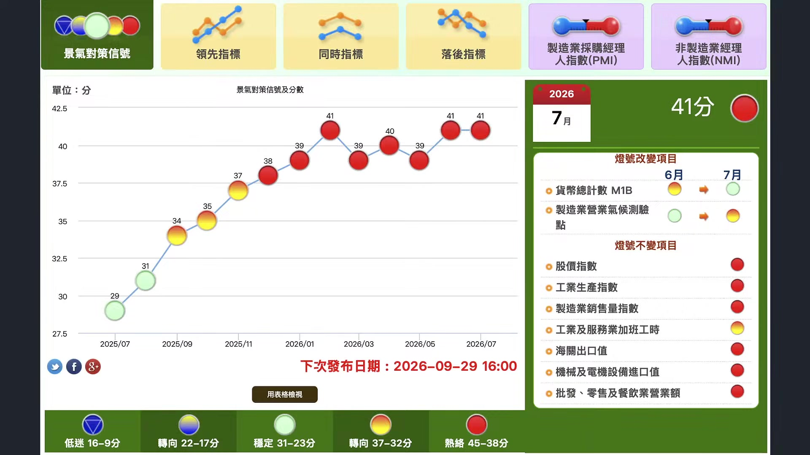

**逐字稿片段：** 我舉例來說 這兩天我們看到臺積電開始陸續進行分紅髮放 那按照目前所流出的薪資資訊 大家去DECA PTT上面看 只等31到33 包括資深工程師和主管 年薪大概平均是400到600萬左右 即便是剛加入的公司的碩士新人 平均年薪大概也是250萬起跳 臺積電的薪酬 稍微大家有同學在臺積電都知道 它一年零五次 2月 5月 8月 11月 然後年底再發一次 不是年底 是隔年7月再發一次 所以大家看的都是年薪 沒有人在看月薪的 以前不是還傳說臺積電 可能要削減員工的分紅 好像調整兩個百分點 不過公司在快速擴張的速度底下 實際分紅總而並沒有因此而下滑

**話題推測：** 舉例討論台積電分紅發放及員工年薪

---

## 00:24:54

**逐字稿片段：** 我記得你看上面寫 就寫一個31 33 34 我已經忘記了 31好像是碩士畢業新人 現在就挑戰400 33是我記得是 32是資深工程師 33是主任工程師 那你34 35 36 就已經到副理或者經理等級了 那你官是31到33 就已經分別挑戰400 500 600 這很難想象 那個碩士畢業生 工作進去也沒有幾年 然後年薪四五百萬 很離譜 那夫妻兩個人不就一千多萬了 那一千多萬 不是每年都買一套房 這種速度就是非常快的一個金人 資金流不斷的流進來 那你要想想看這些工程師 他預估明年就可以拿到更多錢了 可是明年搞不好臺股6萬點 那我買貴了怎麼辦 先借點錢來投吧 會有這樣的一個效果 這個就是臺灣內部 真實油脂的真實情況 我們看一下最新民調 這個民調是民調專家戴烈恩先生 在8月25號最新公佈的 臺灣明星調查 這是統計臺灣的經濟預期 48.3%的民眾認為 臺灣的經濟現況良好 其中10.5%認為很好 37.8%認為還算好 整體而言 正面評價6月份增加4.6個百分點 創下這項調查 06年6月份啟動以來的新高 形成黃金交叉了 就過去20年 大家都認為經濟不好 這個很正常 整個環境產業升級的困境 這是本世紀第一次 臺灣居然認為經濟好的人 比經濟不好的人來得多 那民調本來統計就有可能形成誤差 可是我們看的是總體趨勢來看 它已經創下本世紀以來的新高了 那剛才提到 這個景氣已經不只是上游的科技業在衝 它已經陸續傳導到下游

**話題推測：** 詳細說明台積電不同職等（31-33）的年薪預估

---

## 00:26:41

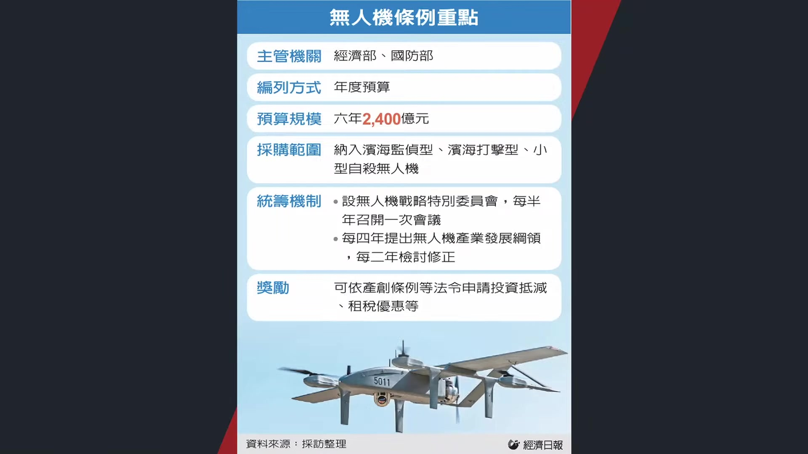

**逐字稿片段：** 我們看臺灣的無人機產業 也迎來了2400億政府的訂單 昨天立法院三讀通過了無人機條例 中央政府會以年度預算的方式 在未來編列2400億 每年大概是400億元 推動國防自主和無人載具的產業發展 大爆發 我們看中下游開始陸續搶錢了 之前我們提過 地方政府現在每個人都在搶錢 嘉義現在是亞洲無人機的人工智慧研發中心 那也是政府最先投入的基地 那其他像是地方政府 有一些比如桃園是新光右石園區 那正在搶奪AI伺服器跟無人機產業的協作性訂單 新北的部分是無人機廠商來的最多的 其他像臺中嘉義高雄 陸續都在出招 地方政府之前還在商量到底會通過多少錢 現在錢確切要撥下來了 大家都在瘋狂的搶錢當中 所以從上游端往下游端 一路的延伸到現在為止 這是我們看到的真實跡象 那另外一方面 即便如此我們知道景氣很好 我覺得還是有個淡數 就是中央銀行不一定 在本次會真的升息的原因

**話題推測：** 討論台灣無人機產業迎來2400億政府訂單及相關條例

---

## 00:27:45

**逐字稿片段：** 所以民間的壓力開始出招了 這個壓力一方面 當然是來自於房地產市場的壓力 房地產市場都還要求你放鬆 在來不及你還給我升息 我們知道房地產市場的交易降溫 真正壓力從買賣端開始延壽到交屋端 因為許多預售當時買方的簽約預期 能夠貸到七成到八成 兩年前買的現在貸不到八成了 壓力會很大 六成五成可能更低 短期內為了要補足龐大的資金缺口 就可能導致延後交屋

**話題推測：** 討論來自台灣房地產市場的壓力，可能顯示房貸政策圖

---

## 00:28:19

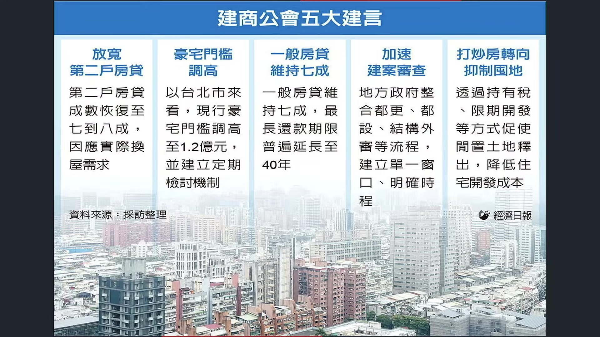

**逐字稿片段：** 所以你看建商工會最近出招了 包括第一放寬第二戶的房貸 太多人要交屋了 你現在不稍微放寬一點點 他們交屋就會很痛苦 那反而對於政府的評價就不會特別好 另外是豪宅門檻調高 現在房價漲那麼高 你如果再用過往的豪宅門檻來做標準 市場壓力也會很大 其他像是加速建商審查等等 或者打草房轉向抑制囤地 其實建商普遍是支持社會住宅建制的 為什麼 因為大家也意識到了 這些民團對於建商不斷的施壓 那隨時都可能會出招 那不如你趕快把社宅蓋好 反正他們也不會是我們的客群 不想買房的人永遠都不會買 那你不如趕快蓋社宅給他們 所以大多數建商 也不反對蓋社宅 真實我們看到的跡象就是 全臺六都預售的交易量 都在快速的收窄 新北市縮了5.5% 桃園21% 臺中24% 臺南23% 高雄50% 那臺北市之所以增加 那當然是因為 這個股市賺多了 那比較偏向自產買盤 那不太像是 純自住或者換屋主買盤 真實我們看到的具體現象 我個人看法是 這一次建商給予的壓力非常大 剛好又是選前兩個月 所以你說中央政府 會不會受到建商的影響 那百分之百肯定的 平心而論 那中央銀行會不會如同韓國央行 就直接斷然就直接要升息了 這個我覺得拭目以待 可是至少從目前市況來看 建商已經從過去幾年感受到痛了 感受到痛的結果是什麼呢

**話題推測：** 列舉建商工會提出的放寬房貸、調高豪宅門檻等訴求

---

## 00:29:50

**逐字稿片段：** 大幅的削減房屋供給 我們看一下 現在在六都的上半年住宅的建造數 當時最高2022年是8.5萬戶的建造量 今年5萬戶 我們預估明年會更低 這說明建商在面對房市降溫 現代土地和營收成本居高不下的情況底下 他已經不是單純賣得慢一點 他乾脆不蓋了 所以未來我們預估幾年的推案量 如果房地產市場政策不鬆綁 接待中心就會越來越少 房價不是光是從需求端來影響 很多人說房價少止化少止化 沒需求 這是一種角度 不蓋房子 不蓋房子本身也是讓房價 能夠拖底住的重要關鍵 按照這種速度 搞不好到2035年 沒有人蓋房子了 沒有人蓋房子 那到時候市場的新屋 就會相當之稀缺 新屋價格就可能會因此 而往上拉動 所以政府到底樂不樂見 房地產市場收縮到 沒有建商在未來幾年 願意去選地蓋房子 如果這件事情真的發生 對於房價真的會形成重挫嗎 就不一定 一個是少子化 所造成的市場買盤消失 一個是建商不蓋房 這幾乎快要砍半了 速度也非常快 其實我們過去提過 因為臺灣的少子化 我覺得不能夠單純 歸因於房價太高 生存壓力太大 更深層的原因 還是因為女性經濟地位抬頭 你的自主權 你的人生選擇權的提升 這也不是臺灣獨有的現象 幾乎所有高度發展 女性教育程度比較高 勞動參與率比較高的社會 都面臨生育下滑的問題 如果你把時間拉長來看

**話題推測：** 討論六都上半年住宅建造數量大幅削減的數據

---
