# yutinghaofinance_sHnrkgDMHqE — 關鍵畫面索引

- 來源逐字稿：[yutinghaofinance_sHnrkgDMHqE_GT.srt](yutinghaofinance_sHnrkgDMHqE_GT.srt)
- 影片：https://www.youtube.com/watch?v=sHnrkgDMHqE
- 截圖數：38

## 00:00:48

**逐字稿片段：** 今天同樣跟投資朋友來追蹤 上禮拜非農就業數據爆冷之後 難道現在的升息預期 就已經完全消失了嗎 過往種種 殖利率預期的升高 現在可以靠一次的非農降溫來瓦解嗎 今天來跟投資朋友多做些觀察 畢竟上禮拜9月份哦 非農數據其實非常差勁的 結果導致的結果

**話題推測：** 介紹本日節目主題：非農就業數據對升息預期的影響。

---

## 00:01:10

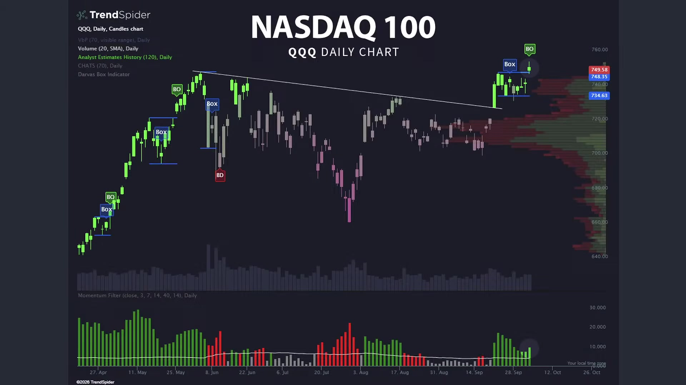

**逐字稿片段：** 居然是禮拜五 美國股市全面收高 這一次納指盤中是 一度創下了歷史新高價 終場是上漲1.19% 來到27,190點 那這一份落於預期的就業數據哦 我們待會會從不同層面來做拆解 因為它背後包括國債的問題 法債歐債的壓力 都可能是導致美國國債 壓力稍微降溫的原因 而並不是單純來自於非農就業數據 可是往好處想 不只是納指的走高 這一次就連費半的部分 AI最大巨頭輝達 誒在禮拜五盤中創下歷史新高價嘍 所以如果連輝達上方也是萬里無雲 好這一次我們知道超微還有 資安族群也同步的強勢走升 都把納斯達克指數和 費半持續的往上推 這就值得觀察了 因為從技術角度來看 的確上方已經接近沒有任何的賣壓了

**話題推測：** 轉述美股禮拜五收高，納指創新高。

---

## 00:02:05

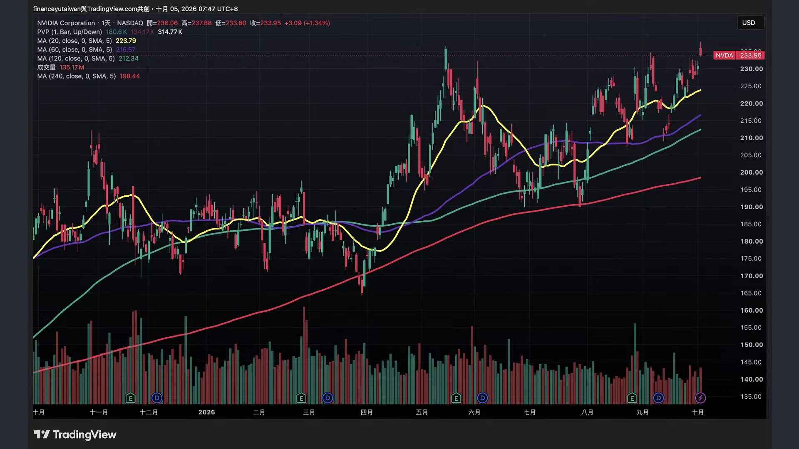

**逐字稿片段：** 如果從美債長天期殖利率來看 現在是20多年來的高點 30年期一度來到5.69% 可是費半還在飆 納指還在飆

**話題推測：** 討論美債長天期殖利率處於20年來高點。

---

## 00:02:15

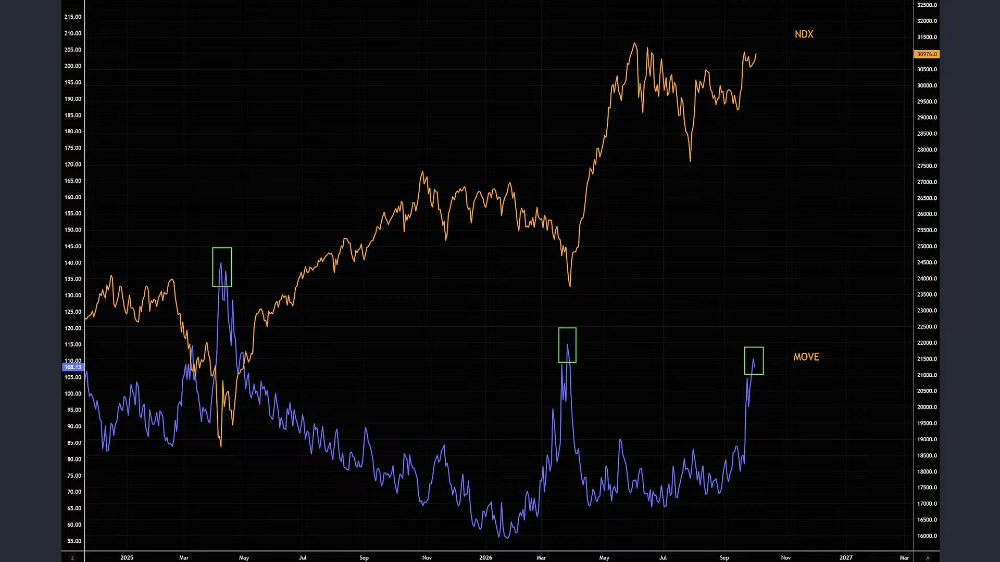

**逐字稿片段：** 如果細看納斯達克100指數 底下MOVE指數是債券的恐慌指數 債券這麼恐慌 但是似乎對於股票市場毫無影響 納指今年上漲幅度還是高達22% 那標普距離歷史新 高價現在也不到1%了 撐住市場核心的 很明顯就是AI和科技巨頭 現在微軟輝達蘋果在過去三個月 兩大指數是作為最重要的上漲貢獻者 你看蘋果 即便大家覺得對於iphone dou還是 沒有那麼樂觀的銷售預期 現在剛開始開賣嘛 可是還是給他相對高的評價 那市場上之所以暫時忽略高利率 其實是因為獲利的預期真的太強了 如果我們把科技業在第三季的 每股盈餘來做獲利的整體預估 大概是暴增65%

**話題推測：** 比較納斯達克100指數與債券恐慌指數MOVE。

---

## 00:03:04

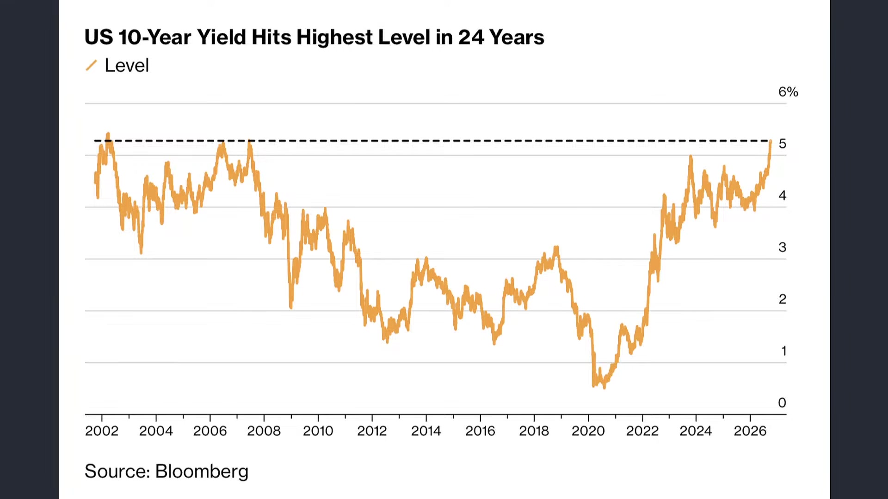

**逐字稿片段：** 整個標普五百指數 本來也沒有表現多亮麗 瞬間到今年第三季 已經成長到24%了 那它會導致一個很直觀的效果 就是本益比 仍然以非常驚人的速度快速的下行 所以現在科技巨頭面對高利率的條件 跟2023年我們當然知道不一樣 那個時候利率才多高 可是現在的利率 10年期殖利率 5%都還是能夠扛得住 原因就來自於 不是說估值沒有做回檔 它已經很低了 低到人家覺得好像該買一點了 即便高殖利率仍然存在 我們舉例來說 你像高利率已經讓 標普500指數的本益比 5月份大概是21倍 好現在標普納指基本上都在創高嘛 那費半也幾乎要做回升了 但是呢現在只剩下19倍左右 所以科技股獲利成長 暫時把壓力給蓋住了 這個是目前最根本的主因 也就是獲利成長的速度比 美債利率成長速度所造成的 資金承壓的速度還要來得更為快速 所以硬要講 如果我們把今年3月4月的伊朗戰事 當時的前瞻本益比 拿來跟現在來做比較 現在即便我們知道納指 費半標普台股 都比今年3月4月還要來得高 可是現在的 基奇比美伊戰時還要來得低 如果你看的是本益比 看的是股價跟獲利的關係 而不是單論股價的話 誒這個就是非常有趣的一個跡象了

**話題推測：** 指出標普五百指數第三季獲利成長24%。

---

## 00:04:31

**逐字稿片段：** 那再來一個好處就是誒往 7月份來看 其實科技股的籌碼算是 洗得比較乾淨一點了 因為我們知道這兩周 應該講說這兩個月 市場上其實就是一直在盤整區間 那很多沒有耐心的人已經慢慢的離開 納斯達克指數現在又 開始重返新高以後 現在隨著半導體也開始做突破

**話題推測：** 討論7月份科技股籌碼洗淨的情況。

---

## 00:04:51

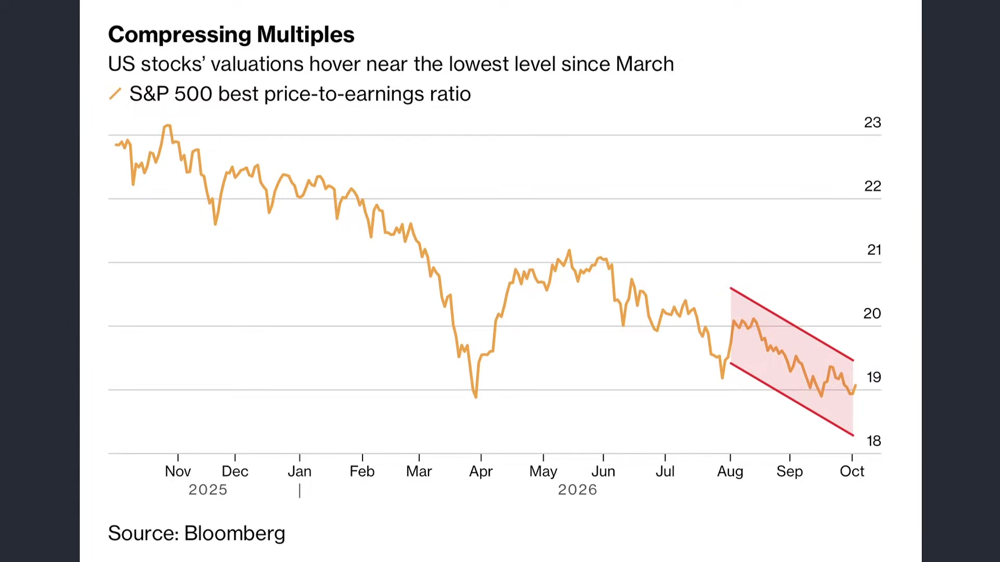

**逐字稿片段：** 現在有三大指數 有兩大指數上方是萬里無雲 那費半呢 費半我們當然很清楚知道 好像上一輪在7月份的去 杠杆之後壓力非常大 可是現在也差不多已經 接近到歷史新高的區域了 那有沒有可能隨時爆發 新一輪的軋空行情呢

**話題推測：** 指出三大指數中兩大指數（納指、費半）上方萬里無雲。

---

## 00:05:11

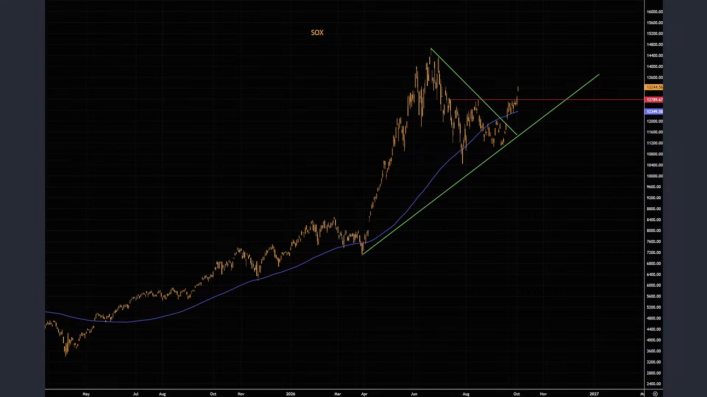

**逐字稿片段：** 尤其現在 在最新的記憶體研究當中 供需吃緊的 看起來也沒有任何提前的跡象 至少是延到2028年了 美光甚至預估2027-2028的供需狀況 甚至比26年來得更為緊張 那輝達現在帶頭向上攻 這說明著背後的需求 包括無塵室的產能 包括記憶體產能 傳統伺服器產能 基本上還在持續的稀缺 從臺灣伺服器代工廠 現在在整個第三季哦 年營收平均是成長130%

**話題推測：** 切入記憶體研究，說明供需吃緊狀況延到2028年。

---

## 00:05:43

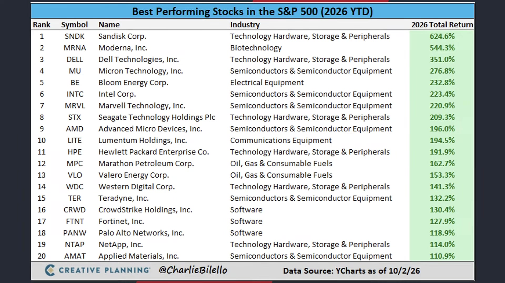

**逐字稿片段：** 記憶體更不用講了 韓國記憶體出口平均年成長是412% 現在第五代和第四代的雙倍數據 記憶體現貨價格仍然在持續上漲當中 而且明顯高於合約價 所以短期的供應其實還是非常緊俏的 我們把整個標普500最為強勢的個股 今年年初以來到現在的報酬 即便當時哦 跌得很慘的 在7月份的去杠杆 像Sandex 現在還是漲幅624% 莫德納是比較少數 在前幾名當中非AI股的 漲幅540% 獲得了蠻大的一個市場衝擊 不過現在的價格仍然 守在1,000塊美元之上 而且從上方來做觀察 其實也沒有什麼很具體 的大量的籌碼區的賣壓 反而下方是有所支撐的 所以你說基體行情就 正式的完全結束了嗎 從價格層面來看 套牢人似乎也不想像中來來得多了

**話題推測：** 指出韓國記憶體出口平均年成長412%。

---

## 00:07:02

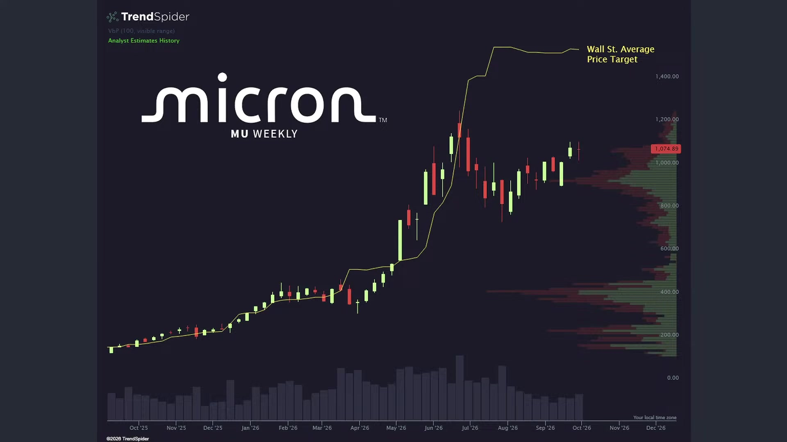

**逐字稿片段：** 2027年現在我們當然知道 整個發債量還在持續提升呢

**話題推測：** 討論2027年發債量持續提升的狀況。

---

## 00:07:06

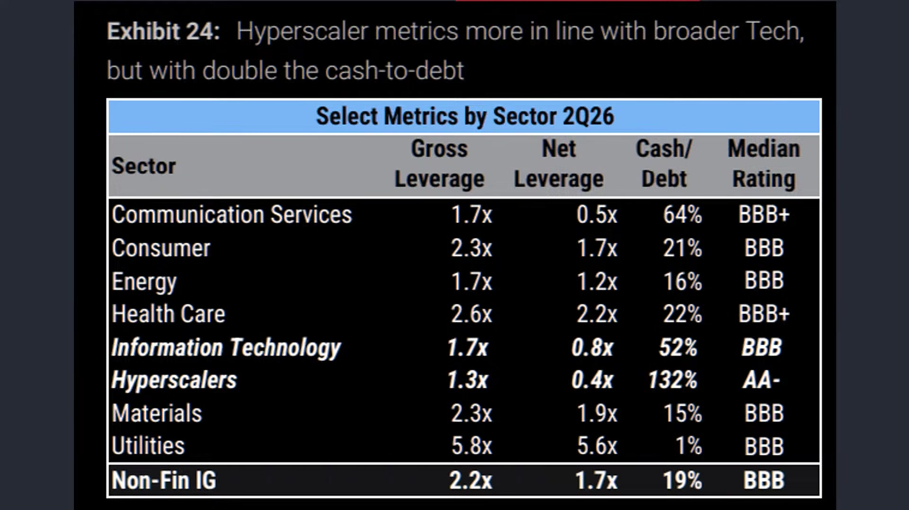

**逐字稿片段：** 哦這也讓整個費半的本益比 目前下行速度是來得最為快速的 所以真正推動看第四季行情的 一方面當然是籌碼的原因就 的確這一輪算洗得還蠻 時間算久算乾淨的 那第二就是接下來的企業買盤 還有本益比的誘因 是否會讓價值投資者開始陸續回歸哦 那第三點呢 當然就是高利率和低估 值是否能夠同時存在 進一步拉高市場的行情 畢竟現在從高估值角度來看 你也不能說它是絕對高估值 但股價的確是相對昂貴一點了 這是從體感上來說 所以高利率第一波影響的 我們如果撇開標普五百指數 撇開費城半導體指數 撇開我們看到道瓊 撇開所有四大指數 我們就看高利率最為直接影響的

**話題推測：** 說明費半本益比下行速度最快。

---

## 00:07:59

**逐字稿片段：** 應該要從羅素2,000 從中小型股來做第一波傳導 如果連羅素2,000都能夠有效的撐住 那其實這個利率的問題 看起來就沒有想像中來的大了 現在小型股 就有一點出現在那種 快要小嘎空的位置 因為羅素2,000這一波跌幅算蠻重 從高點跌下大概跌了10%左右 但關鍵是 它的長期趨勢線還是暫時守住的 而且重新占回到200日 移動平均線之上 那現在唯一的好處就是 其小型股情緒還算是蠻悲觀的啦

**話題推測：** 轉向羅素2000指數，討論中小型股受高利率影響的傳導。

---

## 00:08:31

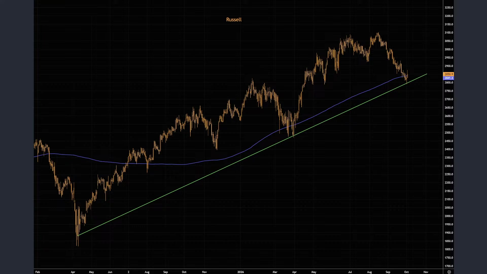

**逐字稿片段：** 羅素2,000在系統性的策略鋪顯呢 大概只位於歷史的第7個百分位 超過9成時間持倉都 比現在還要來得高 這說明其實小型股在過去 一段時間是很明顯反映這種 實際利率走高之後的市場賣壓 那如果羅素2,000現在能夠重新的站穩 開始往上攻 那說明最受到高利率 影響的指數看起來 都能夠承受得住目前的高利率 這就是生產力的有效提升 那回頭看臺股也是如此 臺灣的硬體供應鏈呈現的數字 因為台股最近是創下歷史新高了 融資餘額已經連續10個交易日增長 上市融資距離歷史高點 幾乎也算是創歷史新高了 上月融資已經創歷史新高了 所以總體市值衡量來看 杠杆程度沒有超過7月份高點 可是指數創高了說明 台股本輪的創高也不是 來自於市場的投機情緒 其實就是本益比 緩步下滑之後所造成的投資買盤 價值投資買盤的提升 就來自於基本面的拉升 臺灣這一次我們看到 你像台積電3納米5納米的 產能利用率都已經超過了100% AI的加速需求還是很強勁 所以有時候獲利提升不了 那也不是臺灣廠商的問題 訂單工廠都已經滿了 EPS能夠賺的有限的

**話題推測：** 描述羅素2000系統性策略的鋪顯程度。

---

## 00:09:49

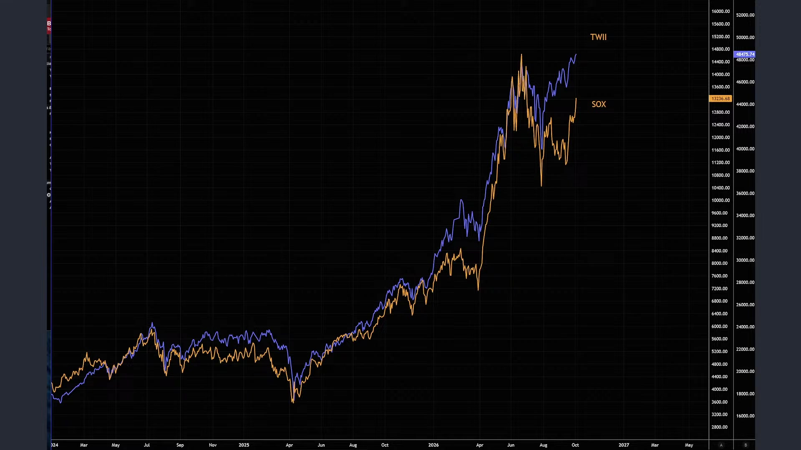

**逐字稿片段：** 今年美股盈餘預估 平均會成長超過50%以上 好這也使得現在台股反而 變成了費半的領頭羊 優先創下歷史新高 而且台股這一波的上漲也不是 由外資的全面追價所造成的 我們知道外資在今年美伊戰事 還有今年夏季的去杠杆 曾經大幅地去賣出臺股

**話題推測：** 說明臺灣企業今年美股盈餘預估平均成長超過50%。

---

## 00:10:09

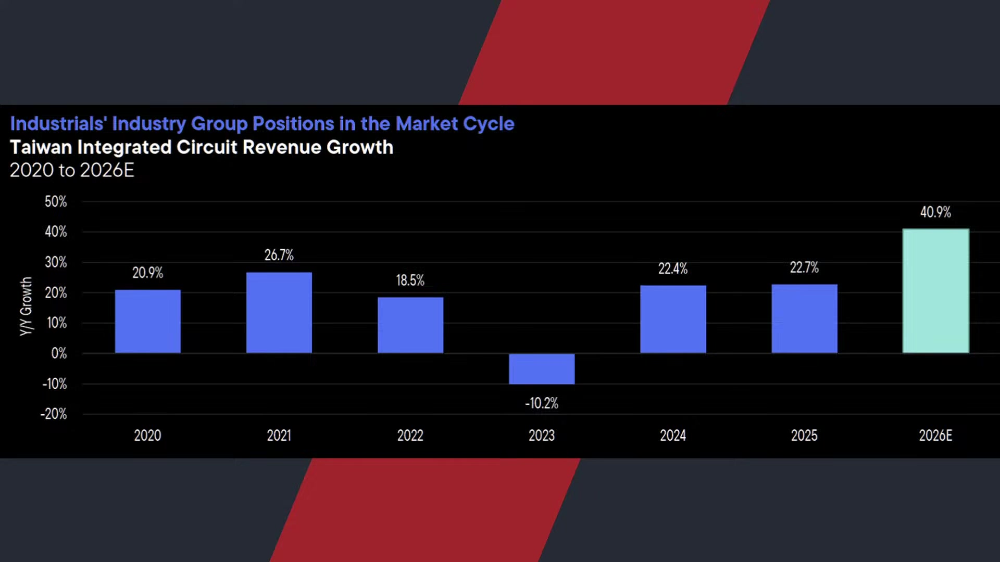

**逐字稿片段：** 目前累計的部位其實 今年以來還是偏低 今年還是賣了1.3兆可是 台股光靠自己就能夠 有效的做非常顯著拉升 然後這說明內部資金的動能呢 還是能夠做比較顯著的做吹捧的 好這就是我們觀察到的宏觀跡象 當然了 回過頭來看 那到底是什麼原因 所以導致了就連羅素2,000最容易受到 高利率衝擊的指數 就目前為止 它也能夠做有效提升呢 當然就要從這一次9月份的 非農就業數據來做觀察了

**話題推測：** 討論外資在臺股的累計部位仍偏低。

---

## 00:10:41

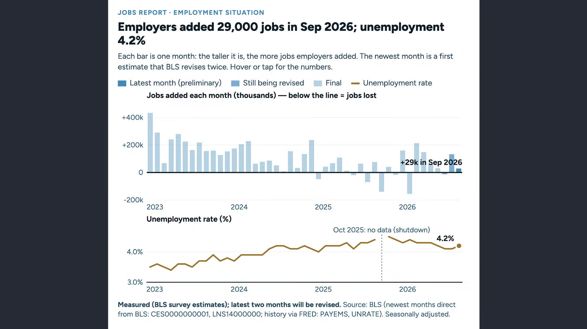

**逐字稿片段：** 這次非農就業數據 差的離譜 只有增長2.9萬人 好這個是遠遠低於市場預期 就連8月份的新增非農也從 原本的16.2萬下修到13.3萬 好這 這代表著搞不好10月 份到時候公佈非農 又把9月份的2.9萬給下修了 每一次都校正回歸 每一次都發現就業數據比 前一個月還要來得更慘了 從7月份也從2.1萬下修到1萬人 兩個月合計比原本公佈的 數字少了接近有6萬個工作 而代表著美國的企業招聘速度 比市場先前認知的更弱 那一個如此弱化的就業數據 怎麼會變成了股票市場的利多呢 因為升息預期至少在10月份消失了嘛 這麼差的就業數據 怎麼可能立即需要升息呢 所以現在市場上變成 壞消息就是好消息 好消息就是壞消息 但不管怎麼說 任何消息對於股市都是好消息 大概是這樣子 那不叫弔詭的局面是什麼 就是家庭調查 它基本上是呈現了完全不同的畫面 從整個9月份的失業率來看 是從4.1%上行到4.2% 但是同一時間 勞動力人口增長了48.5萬個 來到1億7,026萬人 就業人口反而開始做顯著增長 如果我們看兩套官方 數據的一個追蹤

**話題推測：** 詳述9月份非農就業數據僅增長2.9萬人。

---

## 00:12:02

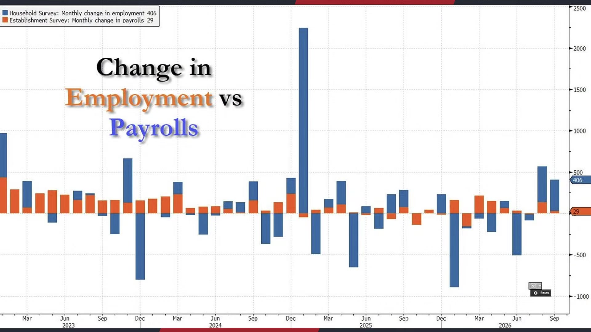

**逐字稿片段：** 家庭調查基本上就是顯示 最近一個月大增了40.6萬人 但是企業調查就 非農調查只增長2.9萬人 這是兩個極端 家庭調查是直接問家庭有沒有工作 誒看起來還不錯 基本上沒有什麼升息 預期消失的可能性 是企業調查 他問的是這些企業家誒 你們最近有沒有招募到新的員工 我們過去講過嘛 這市場上 常常會因為下季度的不管是 在行政工作文書工作 教育工作的一個輪替 或者加上在短期內 通膨數據高升以後 也許會形成一些市場的消費資訊變化 讓大家更為去願意做兼職嘛 像我待會直播完正常了 現在是在德國 以前在臺灣 我是直播完馬上就要去送ubereat 那下午還有 那個要去加油站打工 晚上還有超市 我一個人就貢獻4份非農了嘛 那你說這叫就業市場非常好嗎 所以就業市場本來就要進行多重比較 那從這兩項數據來看 一個是家庭調查 一個是企業調查 那很明顯是 有一個地方走錯了嘛 有一點脫鉤的跡象 所以從9月份 對 還有壽司店 那有網友提醒 壽司 那是5份非農 5份非農 所以從宏觀數據來做觀察 其實整個就業數據 它不能夠保證目前就業 市場有快速降溫的跡象 這是我個人的看法

**話題推測：** 指出家庭調查顯示就業人口大增40.6萬人。

---

## 00:13:24

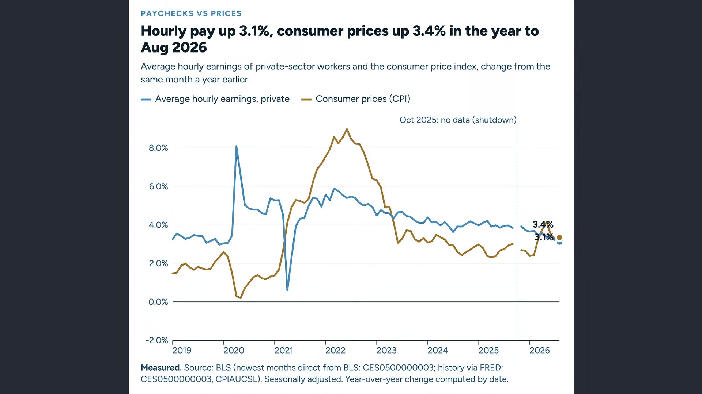

**逐字稿片段：** 那從整個9月份平均時薪來看 這特別重要 它增長了0.1% 好這個的確就是對於通膨降溫的訊號 但是就業是不是如想像中來的弱 這個值得商榷 因為0.1% 這就比市場預估的0.3低蠻多的 年增幅也從3.1%降到了接近3% 所以從整 整體薪資通膨角度來看 的確壓力是沒這麼大了 那另外一個是產業結構 也代表著工作越來越集中

**話題推測：** 說明9月份平均時薪僅增長0.1%。

---

## 00:13:53

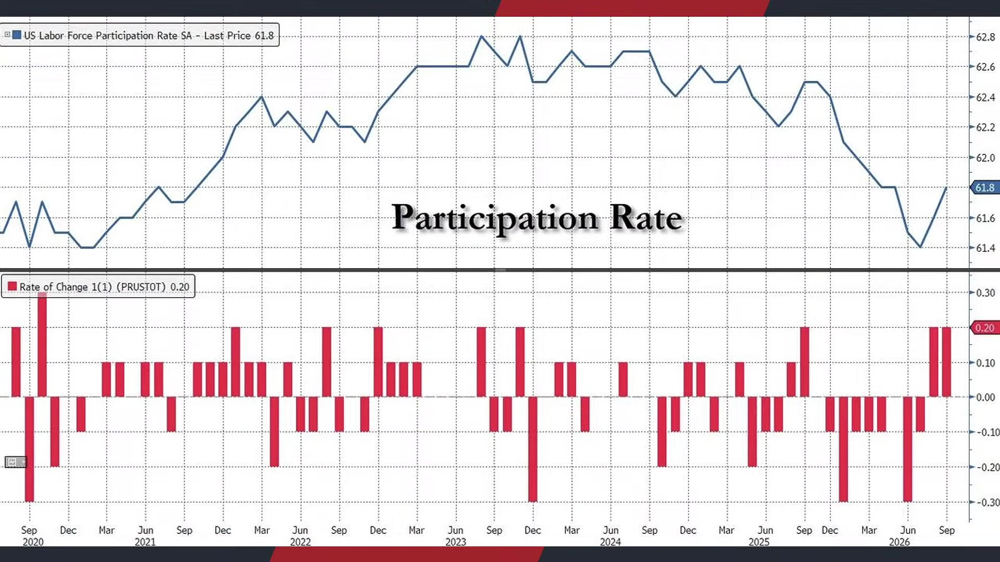

**逐字稿片段：** 醫療保健在9月份是增長了1.7萬人 好但只有過去12個月平均 每個月增加大概3.3萬人 大約只有一半左右 那門診醫療增長1.3萬人 醫院增長1.2萬人 所以你可以大概觀察的出來 那主要也是由一些 醫療保健業來做支撐 其他領域比如說

**話題推測：** 提及醫療保健業在9月份增長1.7萬人。

---

## 00:14:14

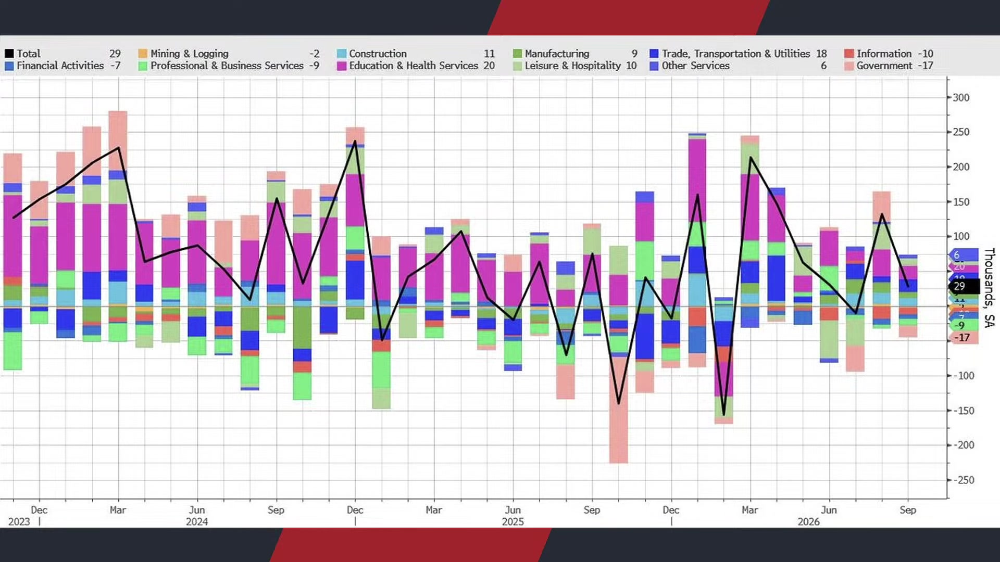

**逐字稿片段：** 保險業增減少了9萬人 零售業批發運輸基本上 增長幅度都是相對有限的 所以整個就業市場的概況 我們如果只用第一人稱 來看非農就業數據的話 確實很容易得到一個直覺 就是只增長2.9萬人 薪資又降到年增幅3%以下 薪資和就業都擺在這裡了 聯準會呀 不但沒有升息壓力 搞不好要降息了嘞 好這是一種角度 但是你把視角拉遠了

**話題推測：** 指出保險業減少9萬人，零售批發運輸增長有限。

---

## 00:14:44

**逐字稿片段：** 我們上禮拜我跟投資朋友分享 你用第三人稱來看 現在全球的資金概況 那非農就業數據 就算它真的轉弱了 它無法解決目前的美債問題為什麼 因為它背後 包括油價的問題 食品的通膨外溢效果 政府的赤字 全球軍費的暴增 AI企業的大量發債 日本資金的回流 日本在升息嘛 貿易戰供應鏈重組 聯準會的抗通膨態度 外國央行對於傳統美債的償債買盤 都在陸續退卻 這麼多宏觀原因 你可以靠非農就業數據的惡化 把實際利率硬是給拖下來嗎 其實難度是很高的好 所以我覺得這邊真正值得醒思的 不是說第一人稱或者 第三人稱哪一個比較正確你要 有第一人稱的視角來了解說哦 殖利率為什麼短期內可以下跌 為什麼市場非常歡呼 那第三人稱呢 用宏觀思維來看 它是提醒我們把鏡頭拉遠 看那些單一數據沒有 解決的結構性問題 哦就算非農是對的 也不代表著利率就會降值 因此快速下滑 好所以不要把它當成 一個史詩級的利多 你應該背後想想看 可能更多是反映AI的 估值已經消減很多 買盤又後續跟上 那這兩天剛好那個啤酒節要結束了嘛 那我就走在那慕尼克街頭 經常看到地鐵裡面 就一群男生穿皮褲嘛 那女生就穿那個緊身的胸衣還有長裙 早上 89點就已經一堆人拿著 那個巨大的啤酒杯 地鐵就拿著一瓶走來走去 到處都是嘔吐物 還有人睡在嘔吐物裡面呢 那我印象最深刻的不是啤酒了 是滿街都是這些穿著 傳統服裝的年輕人 二三十歲的男生呢 穿的這個叫做Lederhosen嘛就 皮褲很緊的那個皮褲那女穿 女生是穿那個dirndl 就是那個啤酒裝 那我就這樣搭地鐵逛街嘛 那我覺得很有趣 就是因為如果站在我的 如果是以第三人稱的視角來看呢 我會覺得唉 那一個現代的年輕人穿著 100年前的衣服會有一種錯覺 就覺得這個服裝感覺是上一輩的 必須承認的 因為我們常有一種錯覺 就覺得傳統文化 年輕人現代全球可能 參與度已經不是特別高了 臺灣其實也是這樣 臺灣國慶也快到了 那真的會一早去市政府 升旗的年輕人也沒有幾個了 要升旗都在廁所升旗了 所以如果你把鏡頭切換 到當地年輕人的第一視角 第一人稱 哎那 事情就完全不同了 一個是第三視角 一個是第一視角 他們可能就不覺得自己在復古 他也不覺得自己在模仿上一代 對他們來講 這不是上一代的文化 這是我們的文化 這就讓我想到 有時候我們常常覺得 年輕人跟上一代已經脫節了 哎手機變了嘛 工作變了 娛樂變了 生活方式也變了 可是很多底層的東西其實沒有消失 所以我們這邊講的就是第一人稱 第一視角和第三人稱第三視角的不同 有時候我們看每天的新聞呢 站在政府 站在企業勞工或者 消費者投資人的第一人稱 和我們站在外面看 整個數據的第三人稱 體感上就是不一樣嘛 人均GDP今年就準備要挑戰5萬美元了 哎那你覺得這是第一 視角還是第三視角呢 好所以從我們不同的新聞來看呢 我們不只要看發生了什麼 我們更要去看 如果我們不是旁觀者 我們是新聞裡面的那個人 我們看到的會是同一個世界嗎 哎這就是現在非農就業數據 看整個宏觀美債殖利率 利率預期升溫當中互相的角力 對我是沒有穿皮褲 但我有帶皮鞭 我們入境隨俗了 我倒沒有特別喜歡喝酒 喝口水喝口水 那之前那個老婆快生了嘛 醫生就問老公 你以前有親身看過生產嗎 那老公想了想 有 看過一次 那醫生說感覺怎麼樣呢 那老公說一開始哦 四周非常的暗 突然之間就變得非常亮 所以你要搞清楚 你到底是用第三人稱來看世界 還是第一人稱 對 不要人家問你第三人稱 你回第一人稱 人家問你 陪產經驗 你回答的是出廠記憶 你還吟詩 初極狹 才通人 複行數十步 豁然開朗 陶淵明 桃花源記 好所以 這第一人稱 第三人稱 最值得思考的地方 就是我們身處其中的人 正在處於什麼樣的一個位階 整個系統正在發生什麼樣的改變 兩者不一定誰對誰錯了 只是觀察的位置不同 這很重要 非農就業轉弱也不代表 再見問題就已經完全解決了 因為我覺得這一輪的殖利率上升呢 早就已經不是經濟太強 聯準會不降息造成的 它是一系列的原因 從軍費AI的企業債 到日本的資金回流貿易戰 聯準會外國央行的買債 一系列因素全部統合起來 才有這樣的第三視角 才是這樣的一個結果 對喝口水 感覺今天有點累 8:50了好 今天稍微聊一下美美債之後 這個是要回過頭看 美國現在包括政府財政的問題 壓力也是非常大的 從美國現在在5年期的標售情況來看 其實就大概看得出來了 好最近我們看到在5年期的標售 整體標售殖利率已經升高到5.033% 這不只是突破了5% 還創下了07年以來的最高 那投標倍數更是降到 18年以來的最低哦 隨後10年期殖利率當時 也跟著一起衝高嘛 可是都彰顯著現在 不管是長債還是短債 標售情況其實都沒有 想像中還要來得好哦 那如果往下看 等同於 當短債預期也開始做有效推升以後 它就往下游端來做真實的傳導了

**話題推測：** 列出影響美債問題的宏觀因素（油價、食品通膨、政府赤字等）。

---

## 00:20:42

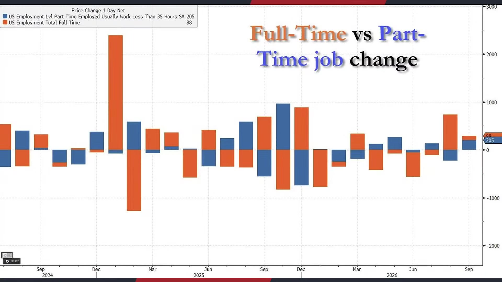

**逐字稿片段：** 下游端的直接傳導是什麼 其實就是房貸利率 我們看最近的美國30年其 房貸利率最近已經飆升到7.28% 好這個一周內從7.03飆到7.28 也算快了 這是2022年10月份以來 的最大單周升幅 當然美國是固定利率 它沒有直接性的房貸衝擊

**話題推測：** 分析房貸利率傳導，美國30年期房貸利率飆升至7.28%。

---

## 00:21:02

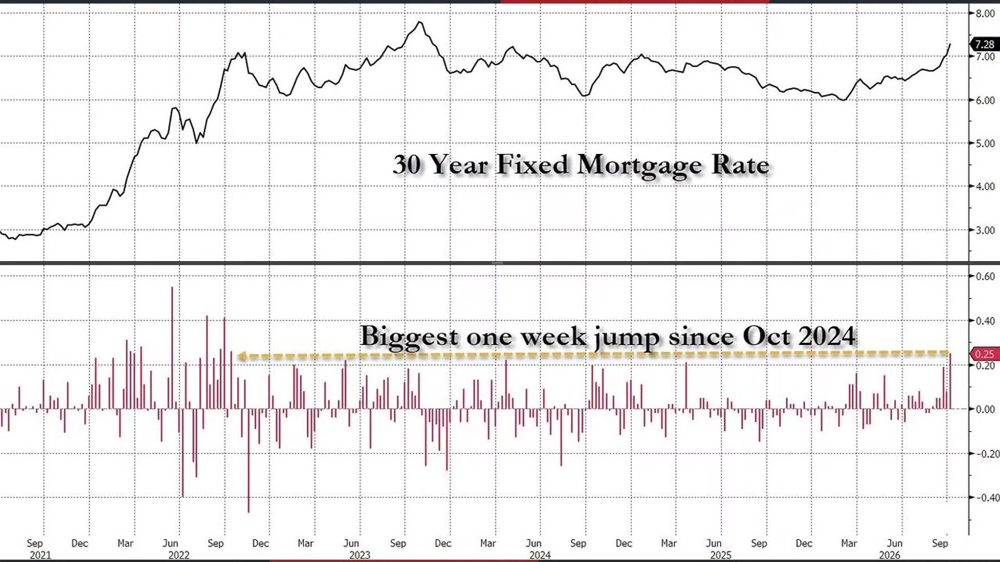

**逐字稿片段：** 可是直接所形成的效果是MBA的房貸 申請量正在以史詩驚人的速度下行 好最近房貸申請量在9月最後一周 直接跌了6% 連續4周下滑 部分房仲已經形容 現在全美的看房活動已經完全停止了 因為就算想買房 你也沒辦法負擔的起如此高的利率

**話題推測：** 指出MBA房貸申請量以驚人速度下滑。

---

## 00:21:24

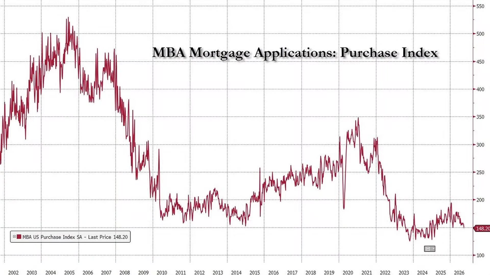

**逐字稿片段：** 所以美國的房市現在 同時第一就是面臨高房價 因為房價沒怎麼跌嘛 那第二是高利率 這種房貸利率無法做 複印或者說無法去順應 未來幾十年的水準了 第三就低供給 就也沒有什麼人想要賣房子為什麼 人家以前大量屋主 手上都是3% 4%的超低房貸 所以利率越高 那他們會願意換屋嗎 所以供給又減少 又讓房價難以下跌 好這個就很尷尬的情況 其實跟臺灣有點像 就房價也沒跌多少 好但利率已經慢慢在開始走升了 不過央行至少沒升息了 那供給的部分 現在市出的房源也不是特別多 好這個就是處於比較尷尬的情況 那往下做傳導 它所形成的效果是 可是美國國債的問題 至少在短期內沒有惡化 那有另外一個蹺蹺板 我們講說這國債市場 股市是這樣子 都會形成防禦性資產和 攻擊性資產的資金輪動 那在美國國債的部分呢 誒竟然在短期內賣壓沒這麼大 那是不是海外市場也是如此呢 並非如此 我們看到也許是由於歐債 尤其是法債市場的居急 所以導致了美國公債 相對賣壓沒這麼沉重 我們具體來說 你像法國的部分 現在已經變成了整個歐洲 主權債新的市場壓力

**話題推測：** 總結美國房市面臨高房價、高利率和低供給的困境。

---

## 00:22:42

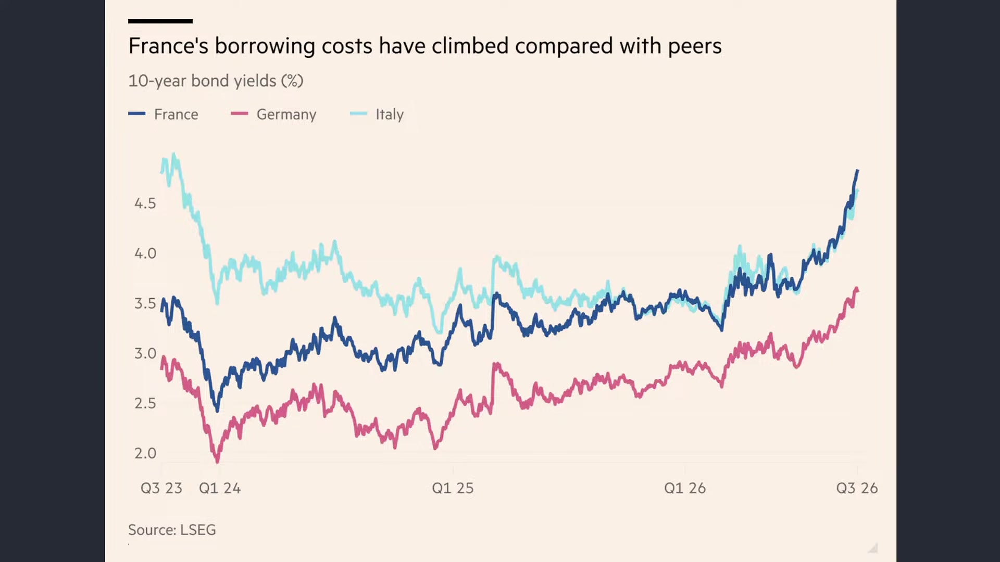

**逐字稿片段：** 現在從法國信用狀況來看 如果政府如果無法在快速 的兩年內控制財政赤字 未來融資成本 可能會一路的失控 法國現在10年期的公債殖利率 大概已經從3.2%一路上升到4.8% 在08年以來新高 那最重要的事情不是上升 因為大家都在上升 是七大工業國當中 它是上升幅度來得最大的 現在法國10年期公債相對於 德國的公債殖利率利差 已經突破了1.2個百分點了 所以它的問題就是 它不是特別嚴重 它是比其他國家嚴重的速度來得快 這已經是2012年 歐債危機以來的罕見水準

**話題推測：** 說明法國信用狀況，若無法控制財政赤字，融資成本恐失控。

---

## 00:23:23

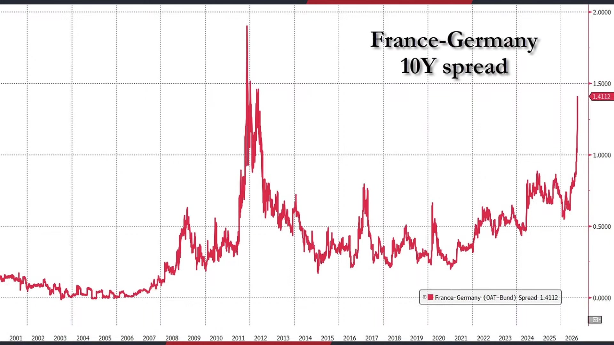

**逐字稿片段：** 法國現在的借款成本呢 甚至比過去被視為歐洲債務問題的 義大利還高出0.2個百分點呢 就法國的國債比義大利還便宜了 那你覺得從這樣的一個角度來看 市場上難道是認為 法國經濟差的離譜嗎 當然不是如此 是法國的財政赤字壓力實在太大了 目前已經占到GDP的5.5% 原本預估還可以壓在5%以內 目前政府 明年已經預估要提出削減 540億歐元的支出方案呢 立即削減福利支出 來穩住目前的國債市場概況 不過按照這種速度的上行 我們再看看 這個是法國國債的CDS價格 已經全面超越了當時15年 16年還有18年的水準了 直接衝往當時在12年13年的歐債危機 所以從這樣的一個角度來看 整個國債市場 即便非農稍微穩住了美債 歐洲市場壓力還是非常巨大的

**話題推測：** 指出法國借款成本甚至比義大利還高。

---

## 00:24:19

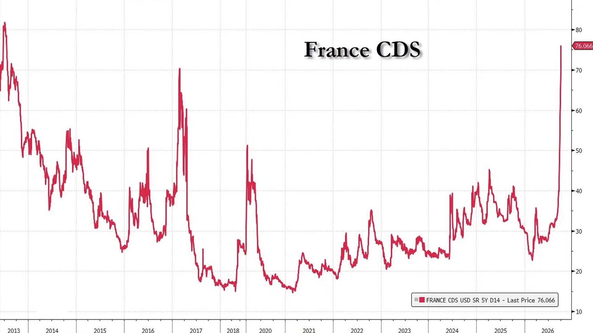

**逐字稿片段：** 我們也知道法國 這幾天新聞鬧得非常大 那爆發大革命嘛 學運幾乎已經全面失控了 一天就已經有1,900人遭到逮捕 全國大概有1,000所學校 222所遭到學生已經全面封鎖 那法國內政部也表示 上禮拜大概累積了抓 了有接近4,000人左右 那部分抗議已經演變成 縱火和街頭的衝突 那對內的部分 有這個學運的全面失控 那對外 有國債的全面壓力 好這我們就清楚知道 這個市場上對於法國的信用評級 當然會因此而做適度的鬆動

**話題推測：** 提及法國學運全面失控，爆發大革命。

---

## 00:24:57

**逐字稿片段：** 現在法國總統大選 誒其實跟 臺灣跟美國很像哦 大概只剩下7個月左右了 現在候選人多到15個 那沒辦法確定說這個右派的這蓬 一定能夠當選的 不過現在機率是最高的 所以從這樣的一個角度來看呢 法國會是否在未來一年到兩年呢 會有政策的極大轉彎 對於信用市場所造成的進一步壓力 這個是大家值得做 進一步觀察的

**話題推測：** 討論法國總統大選，候選人眾多且右派當選機率高。

---

## 00:25:23

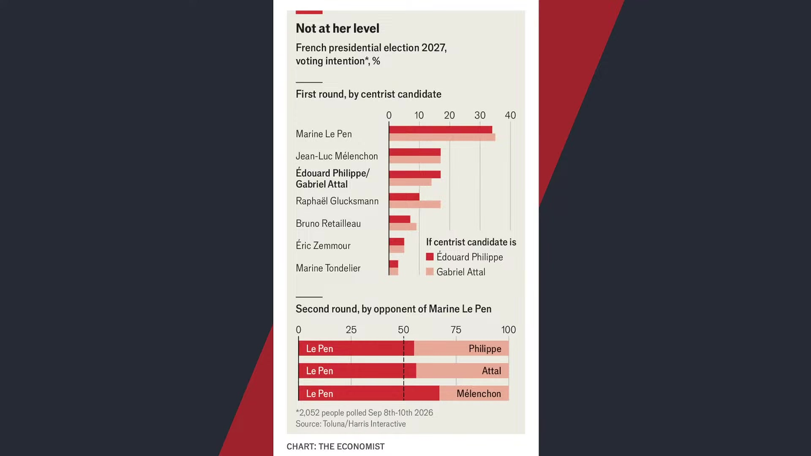

**逐字稿片段：** 你說那德國國債是不是稍微好一點 是沒錯可是德國內部的經濟情況 也沒有想像中來的好

**話題推測：** 轉向德國經濟情況，工業數據不佳。

---

## 00:25:30

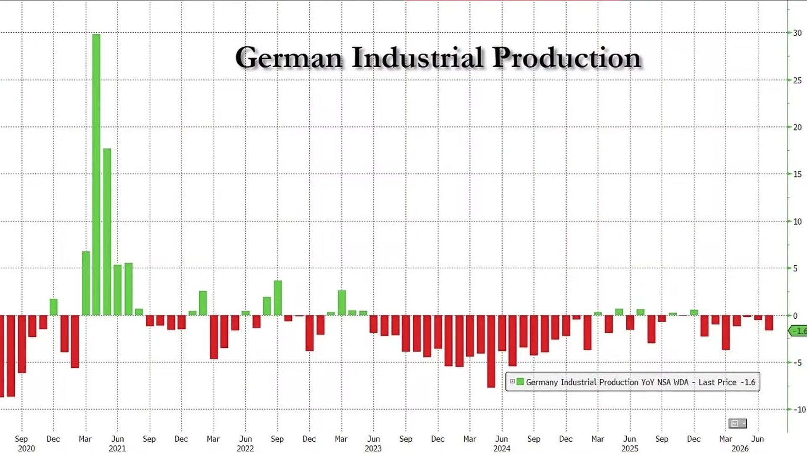

**逐字稿片段：** 我們從德國最新的工業數據來看 7月份雖然實質訂單月增幅有2.5% 可是大部分都是政府擴大的國防支出 反而是德國最重要的汽車 產業訂單月減幅是1.7% 德國機械設備製造協會現在 從前7個月的實質產量來看 同期也下滑了4.1% 誒臺灣成長都是5成 南韓都是400%了 然後德國最強的汽車業還年減4.1% 你就可以完全瞭解汽車 已經完全是存量市場了 那面對整個中國車廠的大規模崛起 德國預估在今年總裁員規模 已經來到接近5萬個行政值 那麼預估在整體明年的裁員情況底下 本輪釋出至少會來到10萬人

**話題推測：** 德國7月份工業實質訂單月增2.5%，主要來自國防支出。

---

## 00:26:16

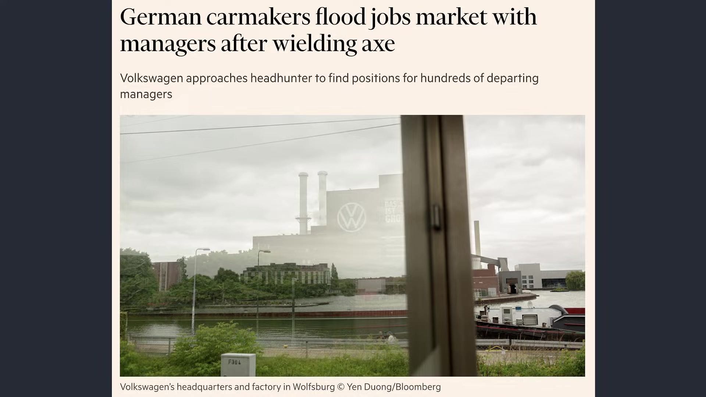

**逐字稿片段：** 現在像是福斯 BMW賓士 都有陸續的裁員計畫 進行適度的資本撙節措施 來嘗試的熬過本輪的汽車寒冬 那當然你說英國現在脫歐以後 是否情況稍微好一點 哦英債大家也可以觀察到 這個形象其實也相當壓力來得大 最近甚至

**話題推測：** 提及福斯、BMW、賓士等車廠陸續有裁員計畫。

---

## 00:26:35

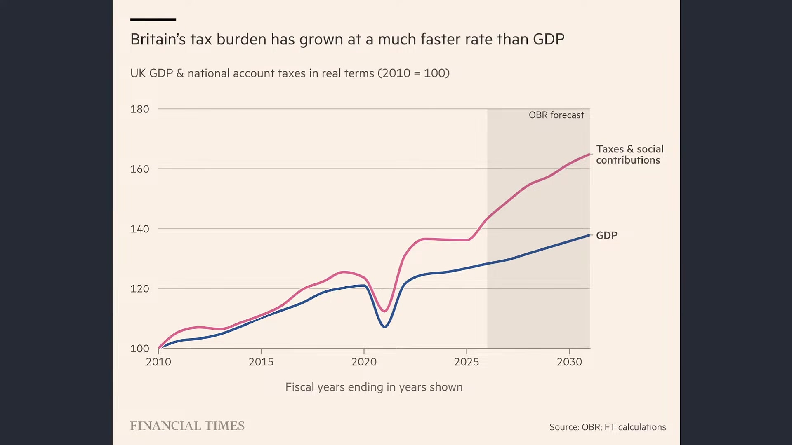

**逐字稿片段：** 新首相博南 已經忘記是第幾個首相了 在政府準備要重新檢討跟歐盟的關係 甚至他喊出不排除 重新全面加入歐盟 他認為現在英國脫歐已經弊大於利 目前考慮的方向除了維持現狀以外 也許可以重新考慮關稅同盟 加入歐洲的單一市場 恢復歐盟會員國的身份 誒這也是工黨現在誒 工黨現在立場 重要的一個轉變 因為24年當時鄭剛 原本是明確排除要重新加入歐盟 而現在是不排除可能 要重新加入到歐盟 這也說明了他需要更多的 市場來支撐內部的經濟壓力

**話題推測：** 英國新首相博南考慮重新全面加入歐盟。

---

## 00:27:14

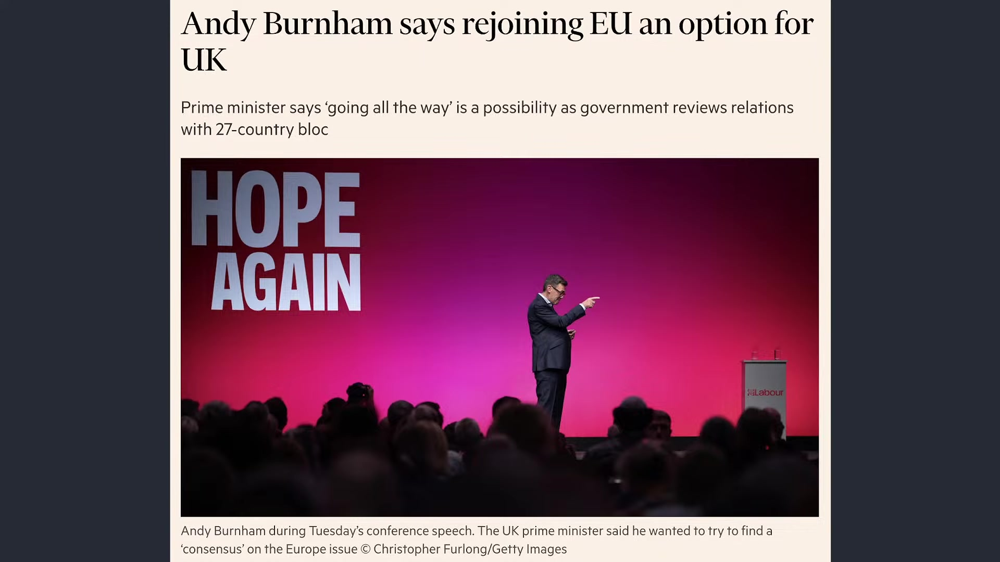

**逐字稿片段：** 其主要就是來自於英國已經長期 處於低成長高支出還有高負債模式

**話題推測：** 英國長期處於低成長、高支出、高負債模式。

---

## 00:27:20

**逐字稿片段：** 政府支出占國內生產 毛額大概已經來到 45%哦 這個福利 這個比例真的非常高 社會福利支出一年是3,300億英鎊 人均實質國內生產毛額 大概是從19年的4.01萬英鎊 到現在才4.05萬 哎我們過去5年都已經接近翻倍了 他7年來幾乎在人均 產出沒有任何的成長 好那當然了 現在不只是法國的學運正在爆發 英國內部 也開始越來越多的檢討聲浪 我們舉一個比較直觀的效果 英國現在在疫情之後 爆發最為顯著的衝擊 就是學生的消失潮 疫情前英格蘭大約每10名學生有 一名是處於長期缺席 就缺掉10%的課程了 現在比例 是每5人就有一人長期翹課 15年到26年呢 當時超過一半課程嚴重缺席的比例 差不多最多就10%左右 現在是50%

**話題推測：** 英國政府支出佔GDP約45%。

---

## 00:28:17

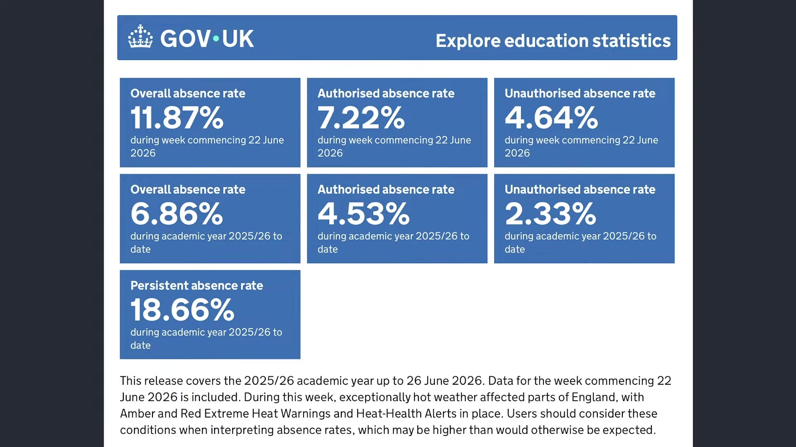

**逐字稿片段：** 那英國教育部的估算 長期缺席的學生到28歲以後 預估未來進入到監獄吸毒 自我傷害的風險也在快速提高 那總體預估 按照英國教育部的公佈 大概是100萬年輕人 目前處於沒有就學沒有工作 也沒有接受職業訓練的狀態 那預估未來的福利支出還有 產出損失會超過1,200億英鎊 好這個就是 在法國在英國各地 所爆發的市場衝擊好 所以這一系列的問題 所以導致歐洲債券是否 能夠有效的受到市場承接 我感覺好像比美債還更為嚴重 以前呢覺得最嚴重的是日債了 雖然日債也還好 現在第二嚴重是美債 那麼發後來發現美債也還好穩住了 現在市場上開始聚焦 到歐洲債券的問題 法國好是市場上最為擔憂的

**話題推測：** 英國教育部估算100萬年輕人處於無就學、無工作、無職訓狀態。

---

## 00:29:05

**逐字稿片段：** 好那不管怎麼說 整個2026年的大類資產的重新洗牌

**話題推測：** 總結2026年大類資產重新洗牌情況，商品價格漲幅第一。

---

## 00:29:10

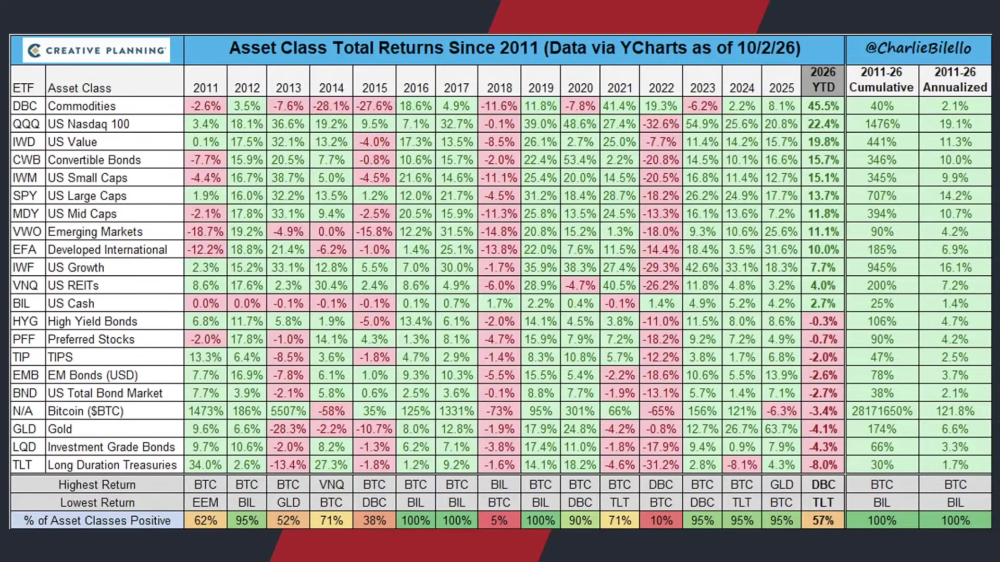

**逐字稿片段：** 商品價格還是漲幅第一名 有45% 那科技股續強強債 還是處於墊底的情況 不過呢 在中間我們看到幾大領域當中 基本上總體跌幅 跌最重的長債跌8% 然後其他像頭等債跌4.3% 黃金跌4.1% 其他跌幅大概0到2 % 還算正常了 主要是股票市場 如果是持有大型部位的指數 包括從納斯達克100指數 現在漲幅有兩成了 小型股一成3 中型股11 % 基本還是能夠讓今年績效 還保持著相對亮麗一點了 所以我們今天主要是講 這個債券的觀察重點呢 對於金融市場的重力 是利率往上 政府的融資成本增加 企業發債變貴 房貸變貴 股票未來獲利的折現 值當然也會跟著提高 所以最後連AI公司的估值和 資本支支出都會受到影響 可是我們要瞭解 投資真正要學到最後的 不是說單純每天多記幾個數字 我們要找到不同資產 背後的一個共同結構 今年就是商品大漲嘛 然後科技股續強 然後長天期美債重挫 那三件不同的事情呢 它背後就是幾個結構嘛 通膨成長 AI利率資金成本 大概就是這樣子 你瞭解這樣結構以後 你就不需要死背每一個音符 你就瞭解主軸就是這邊 那投資也是一樣 你不需要預測每一天的漲跌 你理解這首曲子現在 進行到哪一個段落 以及哪幾個底層變數 是正在決定它的節奏 這很重要了 這幾天我才從慕尼黑 慕尼黑回奧地利嘛 回一趟那個薩爾斯堡 就是去拜訪莫札特的故居 那走進莫札特的城市 你很難把他想像成的 因為他說天才型歌手 天才型作曲家嘛後來 我跟著一個那個導遊團 講英文的 默默跟著 沒付錢的 那聽到他講了一個概念呢 他講說莫札特的作品你拆開來看 你會發現非常強烈的數學秩序就對稱 莫札特的旋律哦 你稍微聽一下 你都大概瞭解 都是以兩小節4小節8小節的 相對規整的單位組成的 一段旋律先提出一個音樂上的問題 然後下一個再像回答一樣接回來 前面先建立張力 後面解決張力 有點像幾何圖形 再就比例 就本身它是大量建立在二分四分 八小節這些結構上 一個大段落裡面 它又可以切成更小的段落 他講的是什麼 就是其實後面在研究 莫札特的作品當中 會很常看到這種大結構包裝著小結構 很像數學裡面的階級和比例的關係 更有趣的排列組合嘛 莫札特以前不是最有名的一個 例子是他的那個音樂骰子遊戲 就是那個作曲遊戲 它的玩法就是先準備很多小節的音樂 然後再透過擲骰子的結果去 決定下一個小節要選哪一段 然後最後組合出一場完整的舞曲 然後大家聽了好開心 那這個概念很有意思 它是音樂 它是可以被拆成模組的 然後再用機率按排列 組合重新的做拼裝 好所以現在音樂到底好不好聽呢 其實背後跟數學有非常 大的相關 如果頻率比例比較簡單 比如8度是2:1嘛 那完全五度是3:2 人耳通常就會感受到 比較強烈的協和協調性的 那現在人類其實很早就發現 了這種音樂跟數學的關係 從古希臘的畢達哥拉斯學派 大家都注意到那個弦長 跟音高之間的數學比例 後來克普勒伽利略 都研究過音樂跟數學之間的關係哦 就我我講什麼 我講就是同構 就兩件看起來好像 不同資產的漲幅 但底層大家的結構其實都是一樣 數學可以説明我們理解音樂 反過來音樂也可以説明我們 理解很多原本抽象的概念 所以我們現在看到的很多通膨 AI利率資金成本 它其實背後反映的都是同一套規則 再給投資朋友做些思考了 好九點零三分了 喝口水喝口水

**話題推測：** 指出商品價格漲幅達45%。

---

## 00:33:13

**逐字稿片段：** 台股上漲1,071點 收在49,547點 看起來 這個5萬點呢 是能夠提前達陣的 但是我們本原本預估 是每個月漲1萬點的 所以到年底至少要漲到12萬點 不是了 好但是至少可以看得出來 台股到底本輪的創高 真的是由於情緒的樂觀所堆高的嗎 還是背後是由獲利的 基本面來做顯著拉升的呢 這給投資朋友多做 一些思考和留意了 好但不管怎麼看呢 現在 牛市哦它不會因為漲太久而退休的啦 它會直到支撐它的音樂停止 支撐它的音樂背後是什麼 就是AI的資本支出嘛 企業的獲利 資金的供給嘛 那當然現在殖利率高一點 資金稍微緊繃一點了 那就靠本益比的偏低 看基本面來做推升吧 那是莫札特說的嗎 音樂家不會退休 直到心中沒有音樂才停止 musicians don't retire they stop when there's no more music in them 這好像是那個勞勃迪尼洛講的 好像是高年級實習生講的臺詞 對不是 手指有多快 分貝就有多高 那是貝多芬說的 音樂家不會退休 直到心中沒有音樂才會停止 牛市不會因為漲太多而退休 直到支撐它的音樂停止 喝口水喝口水 耳邊的音樂響起了 原來是開盤的音樂 好台股現在站穩了49,500點左右 那我們今天主要跟 投資朋友稍微梳理一下

**話題推測：** 報告臺股最新上漲1,071點，收在49,547點。

---
