# yutinghaofinance_tLvKGHyxhd8 — 關鍵畫面索引

- 來源逐字稿：[yutinghaofinance_tLvKGHyxhd8_GT.srt](yutinghaofinance_tLvKGHyxhd8_GT.srt)
- 影片：https://www.youtube.com/watch?v=tLvKGHyxhd8
- 截圖數：25

## 00:00:45

**逐字稿片段：** 美股股市走到這一步以後 到底接下來能否順應著 英偉達的財報季行情 因為8月27號財報就要公佈了 然後順勢的往上攻呢會 英偉達已經在財報前連續7天 遭受到市場的顯著拋售了 費半現在賣壓還是相當沉重 看起來是準備要打第二隻腳了 可是我們也回過頭說 現在其實市場上的利空也不斷 造成的股票市場的恐慌 情緒好像也是非常有限的 你想想看

**話題推測：** 開場後切入美股與輝達財報前賣壓，畫面可能轉到美股或輝達走勢圖。

---

## 00:01:14

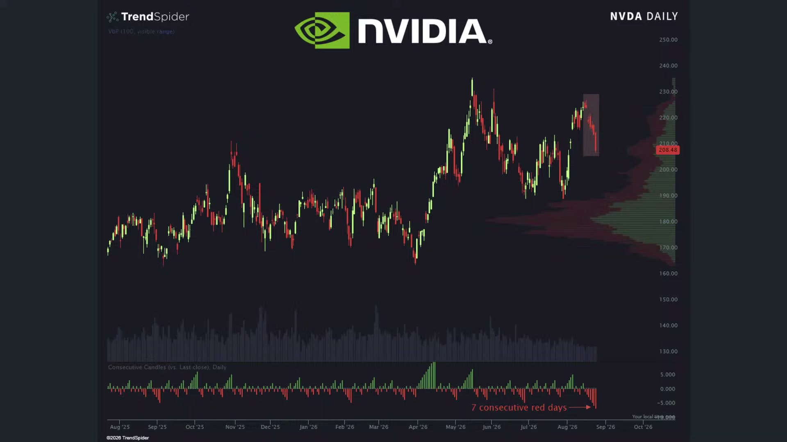

**逐字稿片段：** 現在一方面有針對 加拿大的關稅正式開啟了 同時間白宮也在起草 在川習會之前針對中國 多課徵7.5%的關稅 可能是施加籌碼 另外一方面 我們知道伊朗局勢的擔憂 還有貝森特昨天所 釋放的經濟諾曼第計畫 本身呢都是讓市場更加依舊緊張 不過美債殖利率反而 週一還稍微回落哦 市場現在傳出財政部準備要 動用一般賬務TGA的資金來回 購殖利率比較高的舊債 寬鬆正式開始了哦

**話題推測：** 開始整理加拿大關稅、中國關稅、伊朗與經濟諾曼第等宏觀利空，可能切到新聞重點頁。

---

## 00:01:46

**逐字稿片段：** 10年期美債殖利率這次回到4.7% 那30年期公債殖利率也 下降了4個基點來到5 5.234%而且油價昨天也走低哦 所以這樣的一個行動 對於輝達的股價是有承壓 可是會不會現在那麼多 利空只跌那麼一點點 以盤代跌也是一種方式呢 事實上如果我們仔細觀察 這一波輝達已經連續 下跌了接近有7天 當然距離過往的主要成交區哦 還有一段距離哦 所以基本上還沒有真正 受到市場上顯著的集體性賣壓 但是呢這一種比較強勁的一個跌幅 會讓大家擔心 美國股市到底在財報季 本輪會如何來做一個最終的奠定 以前都是七巨頭先公佈嘛 然後最後一個巨頭通常是輝達 那通常前面幾隻四大CSP業生 就已經確保了輝達的訂單 那輝達要試出什麼樣的氛圍呢 之前那個5,000億的計畫一公佈以後 我那股價就一路跌下來 那看起來他好像做 投資人好像不是很希望 他當別人的擔保人 有這樣的感覺哦 那今天就來做一系列的梳理 首先我們看的是在宏觀層面 好這一次貝森特在昨天晚上是 正式宣佈啟動了經濟諾曼第行動 川普呢 會直接要求各國在期限內 停止跟伊朗往來 否則美國會進行單方面的制裁 那首波措施會超過60個實體 集中打擊伊朗的五大經濟命脈 從數位資產到科技到黃金的運送 航空還有航運 那美方還預告 本周結束之前會制裁一家跟 伊朗有往來的大型金融機構 目標是切斷伊朗和 全球金融體系的連接 但我們知道 好這場考驗最大的挑戰就是 美國敢不敢在中國大型銀行 跟中國的能源企業當中直接 出手阻斷 因為現在中國就是 伊朗最大的石油買家嘛 那很明顯的 伊朗的金融系統也是靠 中國的銀行來維繫著 維繫住的嘛 那美國如果沒有持續 表態對中國直接開掏 採取制裁措施 那本身這項措施也沒什麼意義吧 大部分國家跟伊朗的合作 幅度跟它的金融流動體系 根本就比不上中國嘛 所以貝森特雖然 他強調沒有任何機構 能夠逃過美國的制裁 但是他也坦言 他不願意摧毀全球的金融體系 那昨天來看標普五百指數小跌0.3 美元上漲0.2 美債殖利率幾乎持平了 好那看起來 是那個宣傳戰了 現在登陸戰沒有真實開始 貝森特先講講而已 反而大家比較關注的是貝森特的 購債計畫對於流動性的穩定性 事實上美國財政部這一次 持續放大規模 如同我們過去所說的 從以前大概30億左右 因為現在財政部的一般 帳戶餘額是9,350億嘛 那摩根士丹利預估大概有800-2,000億 可以視為多餘資金 現在呢財政部 已經宣佈 從9月9號起 把10年到30年期債券的 流動性的回購規模加倍 到11月4號 最高會買回140億 那當然 現在還是兆元嘛所以 30億跟300億也沒有太大區別嘛 但慢慢慢慢的給你增加 你最後就可以發現到 市場正在逼迫貝森特和華許出手 那我們稍晚再來看一下 華許在Jackson後的具體談話 但貝森特他想要壓低美債殖利率 真正的問題 可能不在美債市場了

**話題推測：** 提出10年期與30年期美債殖利率數字，可能切到債券殖利率圖表。

---

## 00:05:13

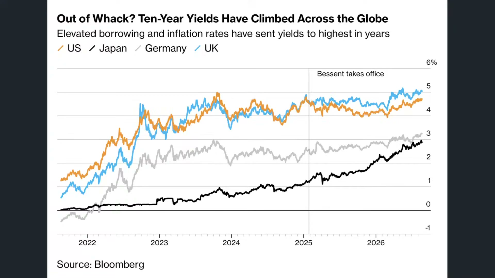

**逐字稿片段：** 我們都很清楚知道是 美國今年的財政赤字哦 已經達到國內生產毛額的接近6% 每年的利息支出昨天 提到超過一兆美元 加上社會安全醫療保險 醫療補助等支出難以削減 單靠調整發債期限或者買回長債 很難長期去壓住它的利率了 美國利息這種規模 基本上我昨天看了一下數據 它其實已經超過醫療保險 還超過國防支出 還有醫療補助了 基本就貼近於社會安全金了 那等同於美國人真的 辛辛苦苦繳的稅 都是去還債 都不是做更具體的基礎建設的回饋了 原因在於利息的壓力 支出實在是太為龐大了 那當然了 與此同時哦

**話題推測：** 開始談美國財政赤字與利息支出壓力，可能切到赤字或利息支出結構圖。

---

## 00:05:55

**逐字稿片段：** 川普也在川習會之前呢 持續製造籌碼 讓大家的通脹擔憂又升高了一些 這一次白宮 在昨天正式宣佈 以考慮製造業產能過剩為由 即將對中國商品加徵7.5%的關稅 那等同於 川普第二任任期 那個時候最高是到50嘛 然後一路下滑到12.5 最近呢加7.5 就等同於回到20嘛 那如果有些人會把18年 19年的美中貿易戰加進來 那大概是35%到40% 那方案還沒有具體確認呢 但美方呢 現在主要是宣佈較高的稅率 那等到川習會會採取談話哦 所以現在大家就在互相的製造籌碼 好像可能也不是真的要克 目的是為了在談判過程 當中有更多的籌碼交換

**話題推測：** 轉到川習會前白宮擬對中國商品加徵7.5%關稅，可能切到美中關稅新聞頁。

---

## 00:06:40

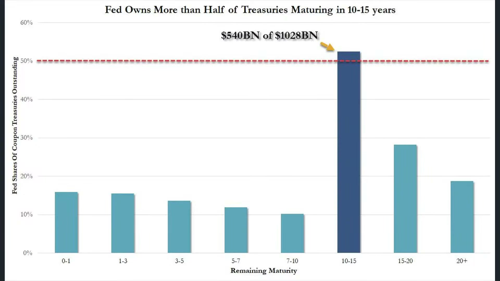

**逐字稿片段：** 與此同時 川普對加拿大的汽車 關稅在昨天是正式宣佈 在三個月的時間會正式 把汽車關稅拉高到五成 包括卡車零件關稅 從25%也提升到50% 那鋼鐵是持續保持在50% 導火線就是前兩天 美加談判在最後期限之前全面破滅 那卡尼目前也沒有 進一步釋放善意的意願 卡尼的態度很明顯 一美元對一美元 你課我多少 我就課你多少 你課我石油 我就課你鉀肥 你課我鈾 我就課你稀土價格 不管怎麼說 北美的汽車供應鏈是高度整合的 所以零組件往往需要 跨境多次才能夠組裝 那你不斷地進進出出 那交易成本是非常高的 所以在這樣效果底下 加拿大占2026年北美的 汽車產量還有接近8%呢 過去一年美國對加拿大的 汽車出口已經下滑23%了 就會導致門戶大開 中國電動車取得大量的配額 進軍到加拿大市場 所以從這樣的角度來看

**話題推測：** 轉到川普對加拿大汽車與零件關稅，可能切到美加關稅或汽車供應鏈圖。

---

## 00:07:41

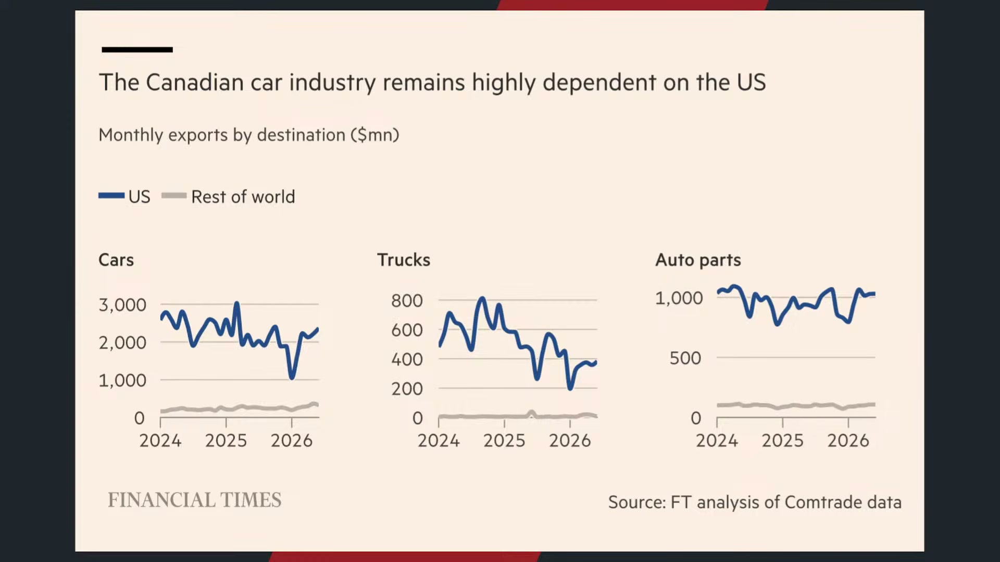

**逐字稿片段：** 雙方的爭議 有沒有可能讓通膨預期稍微升高 汽油價格是還好 大概每加侖4.1塊 這一段時間算是持平 可是哦 通常我們按照過往慣性 23年24年25年都比今年低 這很正常 可是居然 因為22年當時在8月九月 隨著戰事的僵持化以後 誒我們看到反而 現在的汽油價格真的 已經超過過去4年水準了 當時22年的最高點是在6月到7月嘛 後來8月9月就掉下來了 結果現在的汽油價格居然比 2022年的8月份還要來得高 好所以通膨的僵固性正在產生 看一下美股股市四大指數 道瓊上漲140點 0.26% 收在53,417點 標普下跌21點 0.28% 收在7,652點 納指下跌200點 0.7% 收在25,980點 基本上都還在月線季線做糾結了 我費一半就有打第二隻腳的感覺了 下跌317點 2.7%收在11,423點 那的確看起來是回檔幅度比較大的 嘗試著打第二隻腳 在半年線有所支撐 不過技術角度 這年頭其實並不是特別準確 有可能打第三只腳 第四只腳都有可能 像我的話 平時都有第三只腳的這種習慣 看看是否能夠三次的持續測試 不過呢美國股市哦

**話題推測：** 從關稅延伸到通膨與汽油價格，可能切到美國汽油價格走勢圖。

---

## 00:09:02

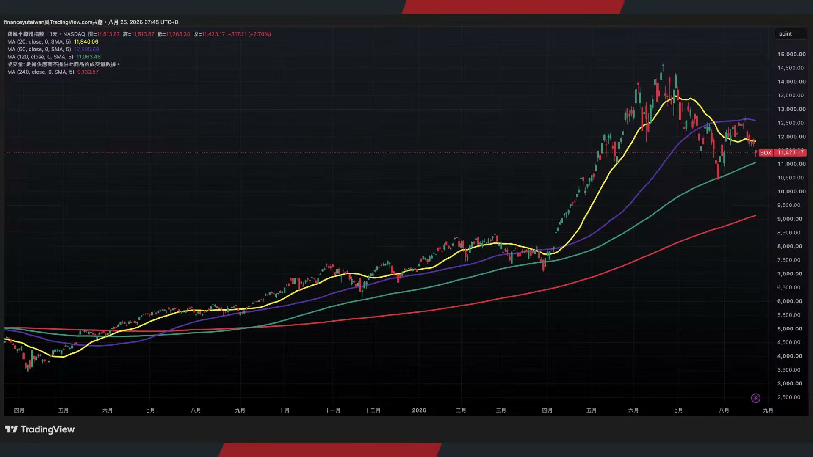

**逐字稿片段：** 到底是不是健康輪動呢 我感覺有點像資金輪流嘎嘛 你看之前又漲黃金又漲比特幣 然後現在又稍微休息哦 有點感覺啦 以前那個是集體板塊的上漲 有一陣子是怎麼樣 是美股七巨頭的上漲 然後全指股的推動 有一陣子是類似於各國股市 像南韓的三星SK海力士 臺灣是聯電臺積電聯發科 全指股的上漲 然後到後來呢 變特殊板塊 比如說機器板塊 變被動元件板塊 然後到後來航運 然後越漲越少 然後變單一個個股變這樣 有沒有這種感覺 就是資金動能有點推不太夠了 因為流動性的確有點線縮 債券市場接盤意願都不夠了 股票市場怎麼有足夠的資金呢 所以美國股市哦 現在更像是資金的輪流軋空 嘗試著讓大家保持在多頭氛圍 你看那比特幣 你想想看 比特幣一周可以漲兩成 你把錢全部拿去炒輝達 那漲兩%都漲不一定 所以還不如呢 拿來用特殊資產 或者說讓 部分資金在單點上有所突破 保持著多頭氛圍 有一種這樣的感覺 真的是這個板塊是越縮 或者說越長越窄越長越窄 有這樣的感覺 那真正健康的多頭輪動 通常是舊主角的休息 新族群的接棒 不過現在看起來 本來是百花齊放 現在變成同一筆資金輪流點火 火很旺 但燃料沒有增加 這是的確在短期大家對於 流動性的擔憂是非常明顯的

**話題推測：** 轉入美股是否健康輪動與資金輪流軋空，可能切到板塊輪動或資金流向圖。

---

## 00:10:30

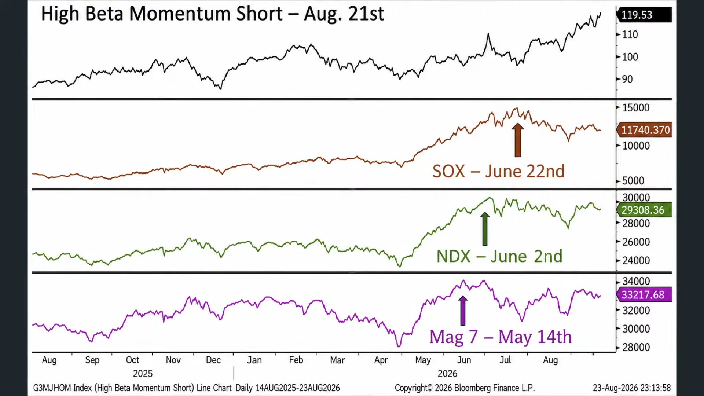

**逐字稿片段：** 那像最近法國興業 這種行情呢 一旦進入盤整呢 通常鬼故事就出來了 我們看看現在的鬼故事來自於哪裡 好這是法國興業最新所提出的報告 認為現在是接近1987年的股災前

**話題推測：** 引用法國興業報告比較1987年股災前情境，可能切到研究報告或歷史對照圖。

---

## 00:10:45

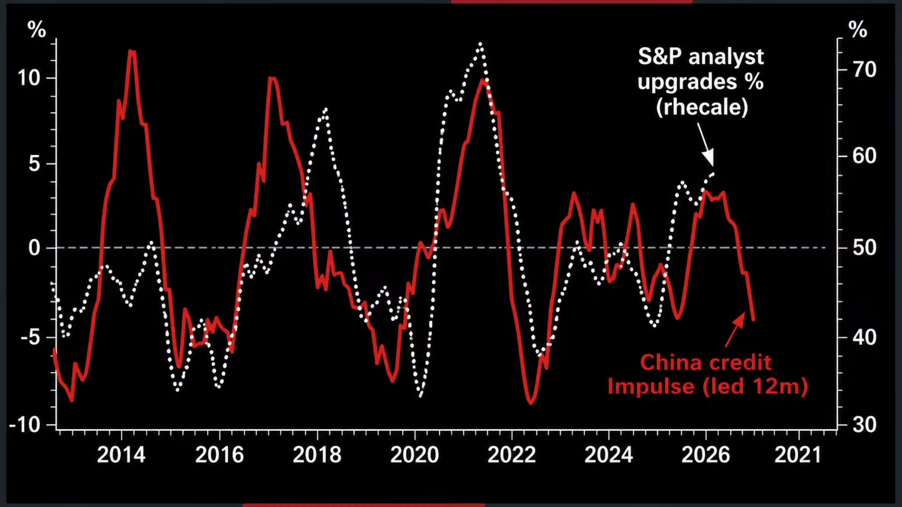

**逐字稿片段：** 第一個角度是中國的信貸脈衝 我們若看紅色線呢 信貸脈衝它指的是新增的信貸 占比占經濟規模的變化速度 你可以簡單理解成上 半部分子是新增的信貸 那下半部是GDP的增速 新增的信貸相對於GDP的比值 如果快速向上 就代表借錢速度比GDP成長還快嘛 那代表金融市場蓬勃發展 那相反的 如果收縮 就代表著經濟有成長 結果沒有人借錢 這樣的感覺 現在呢中國信貸脈衝正在快速的下行 那這項指標過去跟美國的 景氣指數具有高度聯動 哎結果呢 你看以前大概都會領先個 一年到半年左右通常 中國信貸脈衝指數拐頭下彎誒 過一年左右 通常美國的景氣 製造業也被迫要下彎了 好那現在美國景氣還在上行呢 可是中國已經連續一整年都在下彎了 那是不是一種前瞻指標呢 這是一種角度哦那 我個人的看法是哦 這項關係哦 其實也不能夠完全照搬進去了 為什麼呢 因為從18年以後 我們都知道美中脫鉤 關稅壁壘 這幾年中國經濟一直都不是很好 難道美國股市沒有暴漲嗎 所以 中國信貸對於美國經濟的傳導力 我個人認為正在減弱當中了 但是哦 由於每一次股市盤整呢 或者準備要打第二隻腳 開始下行做進一步回檔 鬼故事都一堆了 好第二個利空是什麼 就是市場上擔憂 市場還是充滿著多頭信心 我們根據美銀的市場預估 整體在最新的基金經理人報告 全球基金現在仍然是顯著的看多股票 而是代表著AI泡沫和信用風險 仍然是最大的尾端風險 雖然大家現在不太願意去追高可是呢 大多數都在等解套 什麼意思呢 就是現在的反彈 在過去會有兩種邏輯嘛 在經歷過7月份的下修以後 8月份的上彈 大家的預估第一波可能 都是準備要做停損了 在部分個股的操作部分呢 可是漲到一定程度以後 突然之間 那不如等解套吧 反正反正再再漲一根就解套了 那不如等一等吧 那現在 等解套意願的人已經超過準備 在當時下修之後反彈要停損的 不是很正常了 個股的部分很難講 台股 它是跌8,000點 漲7,000點呢 所以從這樣的一個角度來看的話 本身而言呢 反彈幅度的確也很高 你說本來要停損的變成能解套 好像也ok 但至少基金經紀人的看多意願呢 也來到了接近在去年10月 份以來的最高 事實上 我們必須承認 這個行情本來就是有 不斷的利空來做衝擊 你這樣看

**話題推測：** 提出中國信貸脈衝作為第一個風險指標，可能切到中國信貸脈衝與美國景氣聯動圖。

---

## 00:13:21

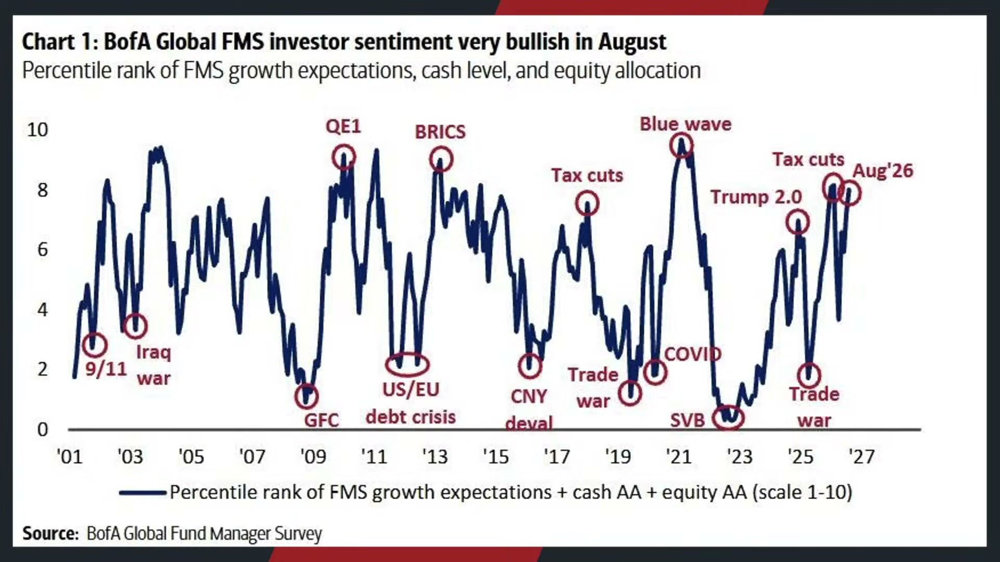

**逐字稿片段：** 現在的最大利空就怕流動性的問題嘛 債券市場 信用市場出事嘛 那今年7月份怕杠杆爆掉嘛 今年3月4月怕伊朗戰事嘛 去年10月份怕AI永動機破滅嘛 去年四五月份怕關稅戰嘛 在前一年怕日元套利平倉嘛 我跟他每一年都有東西可以擔心 幾乎每個月我也可以找得到利空了 好的本來市場就是一路擔心上來的 到創高那小學的時候作業忘記帶 以為死定了 國中的時候被記警告以為死定了 高中的時候段考考爛以為死定了 大學第一次睡過頭翹課以為死定了 其實都沒事的對不對 所以年紀越小 剛進股市覺得 完蛋出大事的 有一個利空就完蛋了 你發現了 這就算是金融海嘯都不一定有事 利空總會鈍化 行情就是在利空當中不斷的堆疊 行情總在半信半疑中成長 所以現在 回過頭來 出社會以後 剛出社會都把覺得 被老闆罵一罵一下就死定了 現在不要開除我就沒事 每天最擔心的都是自己的排便問題 或者分叉 其他問題都不是很重要 錢 財呀工作乃身外之物 最重要的是身體健康 所以基本上

**話題推測：** 整理近期市場主要利空清單，包括流動性、槓桿、伊朗、AI與關稅，可能切到風險事件時間軸。

---

## 00:14:37

**逐字稿片段：** 現在同一個市場當中 每個人都只會聽見 自己想要聽的答案 像有些人看到的是 伊朗制裁戰開始了嘛 航運的問題 油價的問題 認為通膨和長債殖利率 會不會受到進一步的拉升 那另外一方面 可能做債券的人期待貝森特的回購 還有聯準會的扭轉操作 做股票的人現在盯著匯達財報 做加密貨幣的人在想3天暴漲兩成 那到底是美元體系鬆動 還是資金不小心灌進來了 所以同一份基金調查 你可以說明大家很有信心呢 你也可以說明市場沒信心呢 因為沒有增量買盤了 好所以市場從來都不是替 所有人公佈同一個答案 它是端出一桌的消息 多頭你就拿走利多 空頭你就拿種警訊 大家表面都在分析事件 很多時候只是替自己原本的 部位挑選一套聽起來合理的解釋 每個人其實都是各取所需 大家都只聽到自己想要聽的 之前那個 最經典的故事不是講 那女朋友在找捲髮棒 她找好久都找不到 闖進房間問男朋友 我的卷髮棒在哪裡 男友很緊張 你的捲髮棒在有氣質 棒在很復古 每個人各取所需嘛 大家都聽自己想要聽到 也說自己想要說的 說自己對自己有利的話 好所以不管怎麼說 我們知道行情本來就是會有多有空哦 不過呢 你始終要看到自己的原則和初衷 你的瞭解是未來 5年10年的週期 你相不相信現在是泡沫破滅 如果不是 那幾乎每一次它都是中期回檔 讓股市估值壓回的理由 所以我是抱著的比較樂觀的 角度來看待本輪的回檔 當然了 我們往下看 細節來做思考 等同於 現在行情走到這一步 今年的漲幅 它其實還是處於適中的 標普五百指數今年漲幅 大概是接近8-10%上下 那等同於哦 誒今年其實還在正常均值以內 其實美股股市 常年期的報酬大概是10-20% 今年漲8-10%已經算低的了 常態哦大概都是漲10-20%年數最多 然後是20-30%左右 再來就是0-10%和30-40哦 所以美國股市有三代牛的長期慣性 這就是一個根本原因 就算下跌哦 大部分跌幅 也都是10-20%以內 或者說跌幅10%以內 是一個蠻正常的跡象 所以我們才講說 好在市場當中最困難的 並不是每一次你多頭狂歡 然後你就能夠享受行情的輪動 而是你要想想看 哎你可能每隔兩三年就會迎來 一個比較大的一個中級回檔 你能不能把握得住 而這才是重點 再給投資朋友做一些思考了

**話題推測：** 開始說明不同投資族群各自解讀同一市場消息，可能切到多資產市場觀點整理頁。

---

## 00:17:17

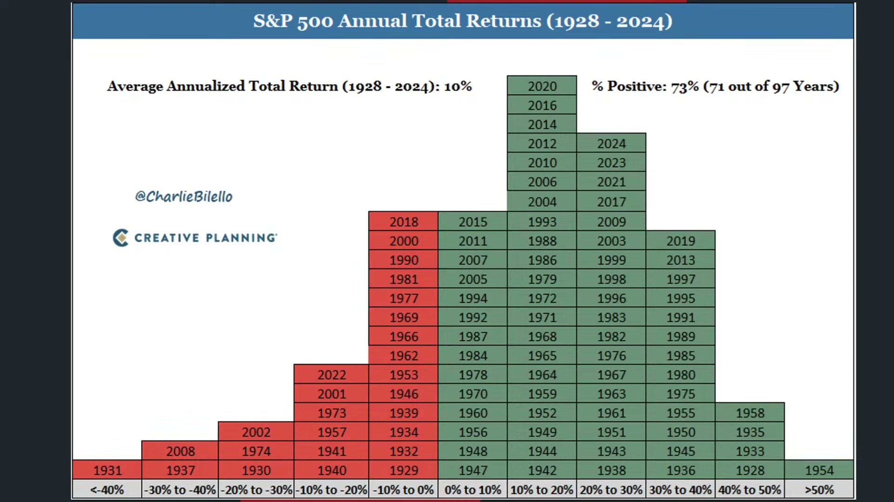

**逐字稿片段：** 好看一下回過頭看臺股的表現 台股在昨天 因為量縮太明顯了 昨天真的是 那很多機台可能都淹掉了 所以交易量也驟減了 然後我們觀看人數也不是特別高 原因很簡單 必須承認 第一是全球流動性的問題的確 好像美股也在量縮 那第二好 台股有那個 淹水的影響 災情的影響 那的確形成比較大的一個阻力哦

**話題推測：** 切回台股表現與成交量縮，可能切到台股大盤走勢或成交量圖。

---

## 00:17:42

**逐字稿片段：** 那重點還是外資了 外資的退潮哦 現在還是比較大的一個壓力 因為8月份你看當時台幣是 一度攀升到一年最強的升幅哦 而結果7月份創下11年 最差表現中的反彈之後 當時是因為企業的股利會出高峰結束 加上科技業帶動經濟的強勁基本面 不過哦看起來外資在短期內 的賣壓又重新出現了 所以升值大概就升到這一步 就稍微停下來了 好但至少我們可以確定確定的事情是 整個美股股市還在信用市場的 遊移當中 台股的錢每個月就是以 非常驚人的速度匯進來

**話題推測：** 焦點轉到外資退潮與台幣升值後停滯，可能切到外資買賣超或匯率圖。

---

## 00:18:19

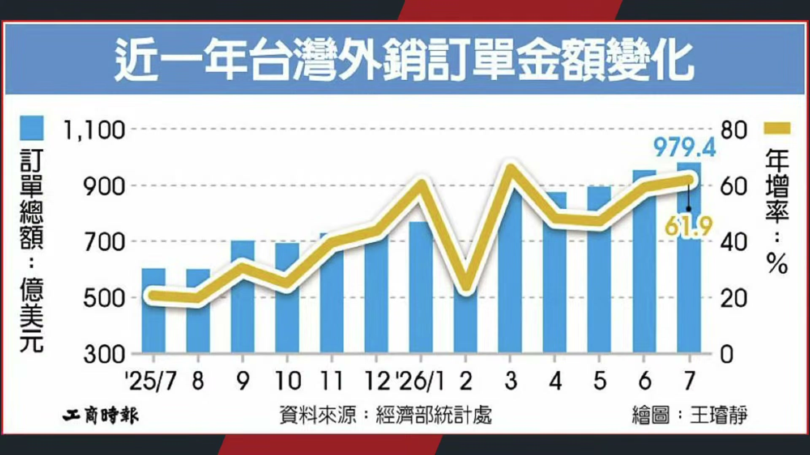

**逐字稿片段：** 7月份臺灣的外銷訂單是979億 創下歷年的單月新高了 所以很多人看到那個在 7月份的出口數據 沒有創高會擔心 那外銷訂單是出口數據的領先指標 因為出口要報關嘛 但是外銷訂單呢 它是你接單就可以直接進行認列 那很多出口值無法創高的 原因來自於產能利用率100%了 廠都已經滿了 我根本就沒辦法出更多的貨去報關 但是外銷訂單我可以先把明年把 後年未來幾個季度的貨先給接好 今年前7個月累計的 外銷訂單是6,020億美元 年增幅是52.5 7月份年增幅是61.9 當然了這就意味著美國的訂單 仍然源源不斷的進來 你看像是資訊通訊或者電子產品 基本金屬機械 基本都以美國作為主要接單客群 那中國市場從以前幾乎全部領先 現在只剩下3大部分了 那對於臺灣賣鏟子的企業來說 你管他這些科技巨頭買來要幹嘛 先不用管這麼多 反正現在就是賣掉了嘛 賣掉就是營收的認列 俗話說先苦不一定後甜 但是先甜是真的很甜嘛 反正錢先拿到了

**話題推測：** 提出7月台灣外銷訂單979億美元創高，可能切到外銷訂單統計表。

---

## 00:19:29

**逐字稿片段：** 那臺灣對於美國的出超在上半年呢 也來到了千億美元 AI正在重塑整個貿易結構 現在是1,040億 創下歷年同期的新高 甚至高於同期整體出超的9704億美元 代表的 美國現在就是臺灣最 重要的順差來源 它的下單量不停 臺灣就這樣一路借上去 而且也往下游端來逐步的做傳送

**話題推測：** 轉到台灣對美出超上半年達千億美元與AI重塑貿易結構，可能切到台美貿易順差圖。

---

## 00:19:53

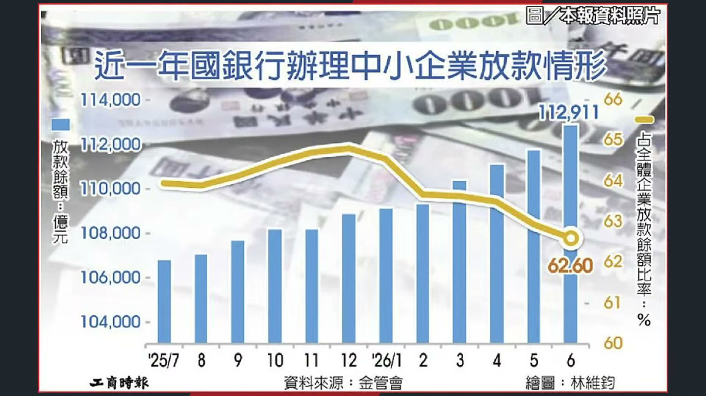

**逐字稿片段：** 這次國銀針對中小企業 放款的餘額也來到11兆2,911億 上半年是直接增加4,000億哦 已經完成今年 今年本來國銀目標是5,000億哦 好那現在已經放了4,000億了 才上半年 好所以這就說明你知道嗎 今年其實現在臺灣內部哦從 大型企業到中小型企業 都對於未來很明顯是有樂觀情緒的 大家都在瘋狂的借錢 與此同時 在整個26年上半年哇 韓國和臺灣的出口額 居然同時超越日本了 1-6月份日本的出口 是3,844億美元 韓國是4,900億 臺灣是4,166億 日本年增幅不到一成 是臺灣和韓國都是五成哦 哎這很難想像哦 我講的是絕對體量哦 就是日本的日本有 幾億人這麼龐大的人口 他居然就賺3,800億 結果臺灣2,300萬人口賺了4,166億 韓國V 千萬人口賺了4,963億 這實在是很難想像 好這這基本上 等同於 兩地半導體出口 正在以非常驚人的速度高速成長 日本甚至都還沒有突破2010年的高點呢 那當然日本也不是 完全沒有吃到紅利 但是位置比較偏上游嘛 主要是半導體設備端或者材料端 那 現在呢由於整體日元的貶值 確實壓低了美元計價的出口額 好但是呢 從實質出口數量來看 那的確相對於10年前 它也是下行蠻多的 所以整個東亞的經濟 完全是由台韓來主導 日本正在淡化它的色彩 臺灣呢在過去一段時間

**話題推測：** 提出國銀對中小企業放款餘額與新增金額，可能切到中小企業放款數據圖。

---

## 00:21:31

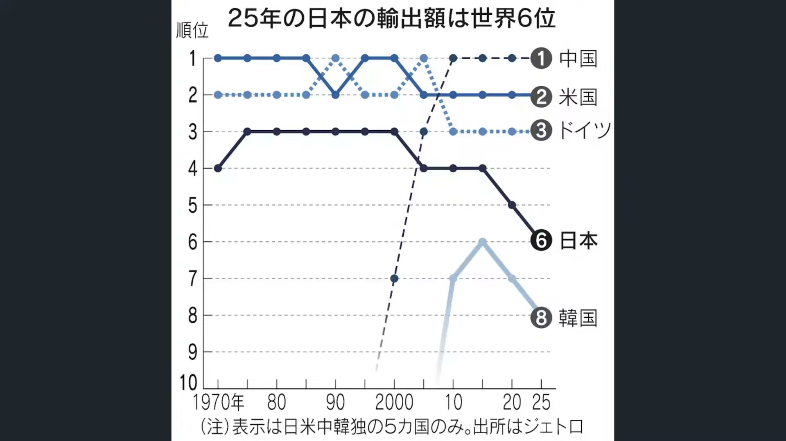

**逐字稿片段：** 我們也知道哇 第一向外進行佈局 非英偉達巨頭 目前都已經陸續找上臺灣的廠商 我們都很清楚 因為現在英偉達雖然 GPU仍然是市場主流可是 客制化的晶片 需求量越來越高 好從Intel亞馬遜Google戴爾陸續向鴻海 偉創英業達和 碩仁寶來陸續進行下單了 所以 不管是輝達體系 還是非輝達巨頭體系 基本上 都已經全面下單給台廠了 台廠在本輪的AI伺服器 的這種遷徙潮當中已經 穩居領頭羊 這是我們看到的實質現象那當然 最終的結果就是向外進行佈局 偉創這一次在德州達拉斯 擴大AI晶片和基板的一個部件 鴻海在德州的休斯頓 加州的聖約瑟 還有 你要知道川普現在對台廠的要求 已經不像去年這麼強硬了 可是今年台廠對美國的投資 完全沒有停下來的跡象 一方面我們但按照少子化的問題 他一年 一個月7,000人 一年不到9萬人 明年搞不好8萬不到 那鴻海台積電一定知道以後 在臺灣肯定找不到工程師 他想要維持住目前的營收 一定要往外走 那第二個角度哦 那就是營收進來的速度太快 如果讓遊資持續的灌 到台股體系裡頭 錢去哪裡也是一個問題 不如在當地直接設廠 尋找更多的人才在當地 橫跨一個台商供應鏈 好所以我們才講說 在臺灣廠商 又很善於打群架 好所以在海外市場 現在經營的算是很不錯

**話題推測：** 轉入非輝達巨頭下單台灣廠商與AI伺服器供應鏈，可能切到客戶與台廠供應鏈關係圖。

---

## 00:23:03

**逐字稿片段：** 我們一直講說臺灣 製造業的真正優勢 它也不是說某一家做的特別巨大 台電是了 但整座工業島可以 一起運作才是重點 從川湖做滑軌 對不對然後做散熱嘛 那有做機殼嘛 有的做印刷電路板 台達做電源嘛 茂聯做高速線材嘛 AI伺服器又不是一個現在 規格固定的成熟商品 那每半年就要大改款一次 所以你每半年就要打電話 然後200公里 大家人就人來人往 從散熱供電傳輸哦 誒大家公司都互相認識 這個時候競爭的就不是單一零元件了 它是整條供應鏈的 能否輝達黃仁勳一個電話 大家就快速的去打樣 然後反復的修改 共同承擔試錯成本 所以臺灣並不是派出 一家公司去跟韓國單挑 是客戶提出問題整個後 半座的工業島 它就一起衝起來 好那現在已經不只是集中在斯福奇了 以前從自行車 到現在純基一體散熱 系統組裝廠內部都有相對 一起出去打群架的優勢 所以我覺得 這個有時候臺灣的優勢就在於第一 多元包容嘛 明明有些是競爭的 還是可以合作 也生植於產業的合作模式 所以從這樣的一個角度來看呢大家 即便不用變得一樣 也能夠互相包容 分工合作 這這這是臺灣現在能夠 出走的一個重要關鍵的 我們應該引以為傲 這我事實上我們看那個 我最近才看那個皮尤的數據哦 皮尤數據有一份數據讓我 看到我覺得特別有趣哦 它裡頭講的是過去全球宗教的 組成估算 就是它主要是衡量你 臺灣的宗教的多元指數 臺灣是第二分的高分組哦 這很難想像 因為臺灣人 大家都覺都感覺 臺灣人因為那個民族哦 連長相都差不多 感覺好像那個宗教 多元指數好像往往不如歐美 結果發現呢 是名列前茅 在圖表當中是位居第三名的 就是僅次於新加坡和蘇利南 臺灣大概是19%的人口是信奉佛教 23%沒有特定的宗教歸屬 基督徒是6% 另外有50%的被歸入為其他宗教 哎這主要就反映臺灣的民間信仰 還有道教 多重信仰 存在的一個特殊習慣 哎這就很有趣 有人拜媽祖 有人信佛教 有些人沒有特定信仰 彼此未必要信同一套 可是就跟臺灣廠商一樣 都能夠在同一個社會來共存 我做電源的 做散熱的 做線材的 居然我們都互相認識 各有專長 平時還會互相競爭 遇到國際客戶提出難題的時候 一個電話 我們可能明年 我們可能明天 就在台南那個某個小飯館 就來好好聊一聊所以 臺灣真正的厲害哦 就不是我們講說 所有人的想法都一致 它是大家都不必變得一樣 但也能夠互相包容 分工工作 所以臺灣最特別之處 我覺得宗教也是如此 什麼都可以拜 很難被放進單一的宗教框架 你看南韓 南韓是接近一半人口 是完全沒有宗教的哦 澳洲和法國仍然是以 基督教和無宗教人口為主哦 臺灣是不是說大家沒宗教 是大家的宗教信仰的非常的多元 更生活化 臺灣人不一定 真的清楚自己哪一教了 你遇到考試你就 那文昌帝君嘛 你遇到選舉 你遇到投資套牢 遇到颱風來的時候 反正大家都知道該去哪裡拜了 但是不能潑油對對對好 但不管怎麼說 我們都很清楚知道 臺灣人有一點比較功利佛了 好但不管怎麼說 我們講是這種多元包容的環境 是臺灣能夠正式走出 本場AI大戰的重要關鍵 因為這幾周下雨嘛 我本來週末都是準備好 規劃行程要去爬山的 後來因為都下雨 我想著那就 去拜拜好了 就去北臺灣幾個財神廟 我這兩周幾乎都跑過了 從那個石定財神廟到金山的也是哦 還買了幾個小紀念品 像上次我跟大家推薦 這個吉卡哇的這個公仔 不是公仔了 算是發財發財小娃娃嘛 就是好像在金山買的 然後這個是財神蛙嘛 不管怎麼說了 我覺得我們看到臺灣市場哦 你說好像有點功利佛 有點圖了什麼而去拜佛 這也是如此 可是大家的共同信仰 也不會互相去介入別人對不對 有些人拜媽祖 有些人拜佛教 有些人一貫道 有些人拜尬電 你只要不危害社會 大家都沒有什麼很明顯的反對意見嘛 這給投票做一些思考誒 為什麼講這個 我要講這個的意思原因就是來自於 這個台商出走的力量 它是某種 根深蒂固的共同的價值觀 但是又可以包容的角度往外出走 好我們看一下韓國市場 韓國市場 在最近 南韓年輕人大量的搶進到半導體產業 現在市場上更為關注的是 整個記憶體行情會怎麼走 因為最近這一波行情呢 它不只是HBM缺貨嘛 我們知道在DRAM 到內的 目前持續缺貨指數持續創下歷史新高 好即便股價已經從高點返回了 不過目前缺貨情況是 完全沒有瓦解的跡象我們以

**話題推測：** 從個別設廠轉到台灣製造業整座供應鏈協作優勢，可能切到AI伺服器零組件供應鏈圖。

---

## 00:28:19

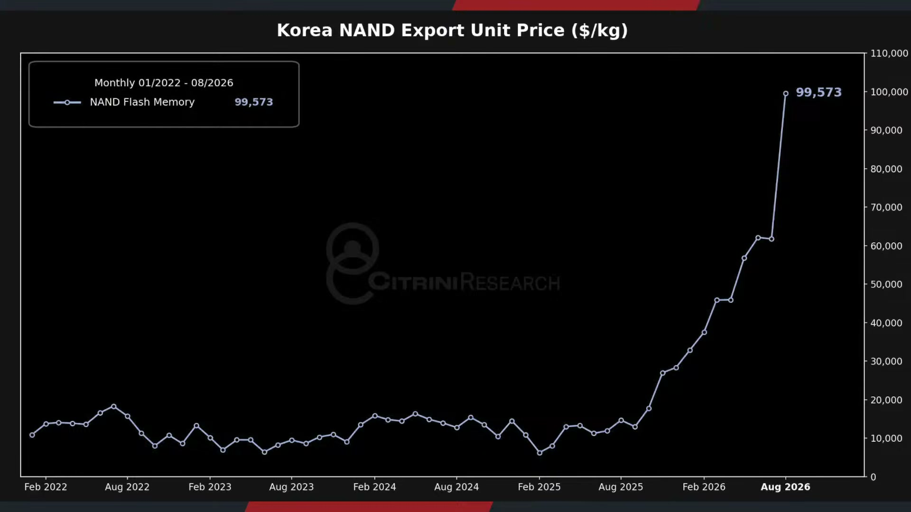

**逐字稿片段：** 韓國的NAND快閃記憶體出口單價 現在2025年初每公斤 大概是6,000-1萬美元了 然後下半年之後就快速走高了 哦到現在8月份了 是99,573美元了 一年漲了10倍 都已經8月份了 股價都已經跌這麼多了 居然它還在創高 所以現貨價格完全沒有停止的下滑 完全沒有停止上行的跡象 另外一個是韓國的Dram 我們看一下韓國Dram的出口單價 22年到25年哦 其實價格差不多 每公斤大概7,000-2萬左右 好看生產品質或者廠商 結果25年底開始加速嘛到8月 今年中旬 8月的中旬 9.2萬以前就賣最多 七八千到最多2萬 現在9.2萬 漲了超過11倍 好所以這 整從整個8月份的數據 你完全看不出來 出口的現貨價格有任何鬆動的跡象 你看的都都是股價炒太多 然後去杠杆了 事實上 如果我們把100當做供需平衡 高於100是代表著晶片短缺 低於100代表著供給寬鬆 從這項指標來看 從整個2023年年底其實就一路的上行 到現在是完全失控 從來沒有這麼缺過 好所以當然了 擴產太快哦 現在韓國廠商也會怕嘛 雖然大家是呼應李在明的擴產計畫 可是大家也看得出來哦 這個擴產速度 短期內哦 肯定開不出來這麼多 就算開的出來這麼多 現在也是儘量以長約 來進行先行綁定了

**話題推測：** 提出韓國NAND快閃記憶體出口單價一年漲10倍，可能切到NAND出口單價走勢圖。

---

## 00:29:54

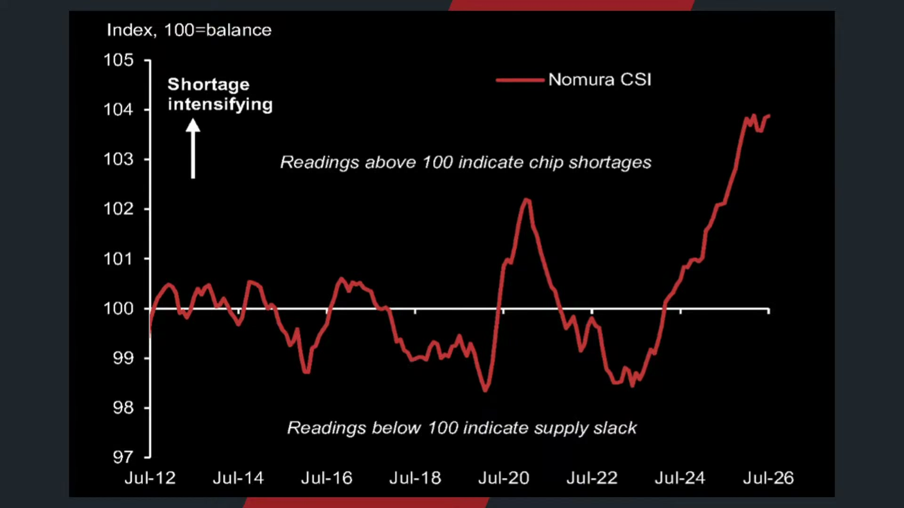

**逐字稿片段：** SK海力士和三星的記憶體部門 都嘗試著借由這一批的訂單 能夠穩定全球的供需平衡 但是更重要的事情是 維持長約價格偏高的供需平衡 如果供需平衡代表的是價格要回跌 就不願意了 這是韓國廠商很明顯正在介入了 這跟以前那個 我們常常講的吸管學 的商業悖論一樣 每一次我們都聊說 為什麼最成功的老鼠藥 最後都沒有老鼠可以毒 那是一個巨大壓力 這是商業的終極問題嘛 你真的100%解決客戶的 這個需求問題 他的缺貨問題 客戶理論上最後就不需要你了 那很多生意天然都喜歡做這管理問題 勝過消滅問題 你想想看這個治安公司 他是希望威脅消失 還是威脅永遠存在 顧問公司 你你最好解決一個問題 你最好還有下一個問題來問我 這不代表這些公司會 故意讓客戶失敗了 但是這個是商業模式很 具有有趣的一個張力就是 治療疾病是客戶想要看到的結果 但不一定是供應商 想要看到的市場終局嘛 哦這也是為什麼投資一家公司的時候 你不能只問他產品有沒有用 你要問他殘酷的議題就是 如果它真的非常有用 客戶會因此永遠需要它 還是從此再也不需要它呢 一個老鼠藥可以把所有老鼠全部毒死 那我下次還需要老鼠藥嗎 哦最好的產品解決問題 最好的商業模式 需要確保解決完下一個問題之後 還有下一筆訂單 那韓國廠商 這一波就調整的非常聰明 你看到即便 韓國廠商已經陸續答應要擴增產能了 但是現貨出口價格和約價 居然沒有任何的鬆動哦 股價是跌了一屁股是沒錯了但是 似乎他嘗試著要把價格 維持在這樣的一個區間呢 就算產能開出來 也只讓我賺得更多 不能夠在報價上有所讓步 事實上我們回過頭說

**話題推測：** 轉到SK海力士與三星透過長約穩定供需與高價格，可能切到韓國記憶體廠策略整理頁。

---

## 00:31:47

**逐字稿片段：** 今年記憶體股仍然是全標普百 指數當中表現板塊最為亮麗的 像是sandyx漲幅有552% 美光是226 希捷是202 Marvell是172 然後英特爾138 半導體股 本身在今年仍然是名列前茅

**話題推測：** 列出今年記憶體與半導體股漲幅排名，可能切到個股漲幅排行榜。

---

## 00:32:05

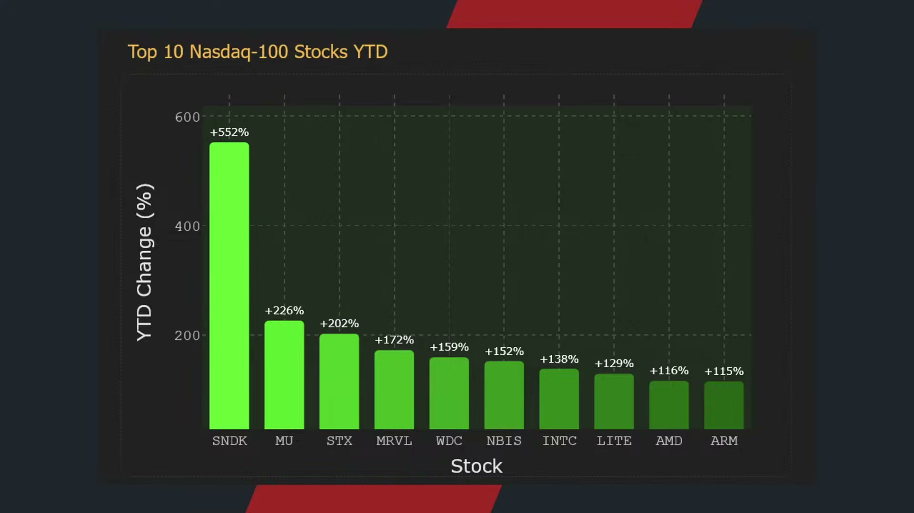

**逐字稿片段：** 三星的部分呢 從7月底急跌之後快速反彈 現在大概在28萬韓元附近了 不過呢 現在大概就彈1/2 不像台股 台股都跌8,000點 漲7,000點 那個彈的有點誇張 韓國股市大概都談到 一半的水準而已 所以股價都是盤整一陣子

**話題推測：** 開始逐一看三星股價急跌後反彈，可能切到三星股價走勢圖。

---

## 00:32:23

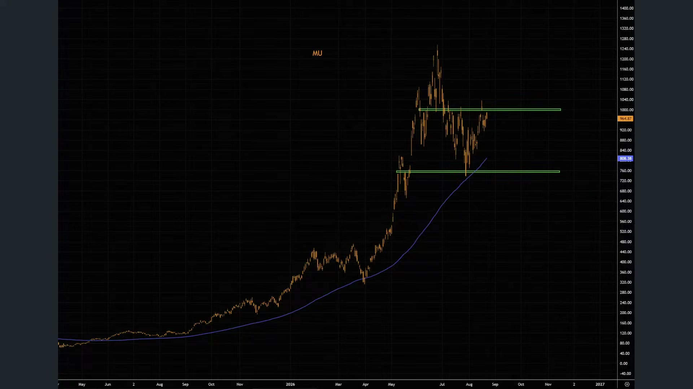

**逐字稿片段：** 美光的部分呢 先前回漲到760塊重要支撐之後 開始明顯的反彈 好那現在很明顯上方賣 壓還是比較沉重 看一下能不能 嘗試的經歷中長期的盤整 來嘗試的做主底 SK海力士也是比較明顯的 從7月底急跌之後明顯反彈 不過呢我們也知道 這一波即便進行股票的回購 SK海力士跌幅算是比較偏重的 上漲動能仍然不及前一波的大多頭 好現在唯一好處就是DRAM 價格漲價幅度並沒有停 AI需求還是非常強勁的 所以這些股票其實我們都知道 它最終還會創高 可是呢大多數人都熬不到最後 為什麼 第一個沒耐心離開了第二 就算你有耐心了 當股價大漲的時候 你也可能忍不住上杠杆 最後你看對了趨勢 死在波動 台積電會不會上3,000呢 一定會了 那現在大家已經沒什麼耐心了 你知道嗎 好但是呢 它一定會上 重點在於哦 很多人他會死在波動 或者還沒等到波動就選擇離開 股票市場的慣性本身就是如此

**話題推測：** 切到美光股價支撐與反彈分析，可能切到美光技術線圖。

---

## 00:33:24

**逐字稿片段：** 台股下跌337點 收在44,425點 好第二隻腳終於來臨了 那我們就看一下這一波會 回檔到什麼樣的一個幅度 到底是市場以盤代跌 還是只是在等待 哎輝達進一步財報的公佈呢 我們稍晚來跟投資朋友做進一步追蹤 如果喜歡我們節目 記得幫我們訂閱 按讚加分享 我們就明天早上8點半 早晨財經速解讀再相見 祝各位投資朋友看盤順利 操盤愉快

**話題推測：** 收尾回報台股下跌337點與第二隻腳來臨，可能切回台股大盤走勢圖。

---
