# yutinghaofinance_tlXP3xUPZLI — 關鍵畫面索引

- 來源逐字稿：[yutinghaofinance_tlXP3xUPZLI_GT.srt](yutinghaofinance_tlXP3xUPZLI_GT.srt)
- 影片：https://www.youtube.com/watch?v=tlXP3xUPZLI
- 截圖數：42

## 00:00:25

**逐字稿片段：** 現在是臺北時間2026年10月6號 禮拜二早上8:31 大家早安 我是游庭皓 每天早上開盤前半小時 我們在這邊陪伴著各位 一起解讀國際財經新聞 時事變化 那儘管美國國債殖利率還在走高 但是市場投資人現在還是把目光 主要集中在這一次比較強勁的 科技基本面和經濟上的數據 10年期美債殖利率昨天 已經來到5.31%了 30年期已經來到5.66% 好這兩者都還是處於極端高位 所以美國股市到目前為止 納指昨天又創下歷史新高價 台股也創下歷史新高價 那隨著內部的輪動越來越劇烈以後 我們到底要如何來看待這一次 台股沖上5萬點之後 它會不會只是另外一個起始點呢 至少就目前來看 美國股市最大矛盾其實還是 在歷史新高附近 可是底下大量股票 其實部分股票已經進入到熊市了 這是比較大的壓力 從6月份以來 我們從羅素2,000或者 到羅素3,000成分股 大概有51%的股票 至少已經下跌超過兩成了

**話題推測：** 節目開場，提供當日時間資訊

---

## 00:01:31

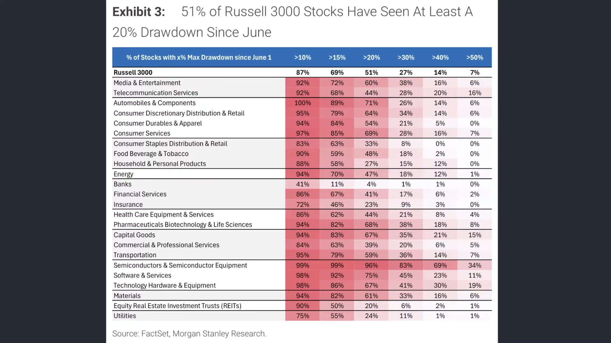

**逐字稿片段：** 半導體更誇張 高達96%的股票曾經回測20%以上 69%的跌幅超過40%那 我們應該講說總體來看呢 軟體股大概有75%左右的部位 進入了20%以上的回檔 汽車股有71% 好所以必須承認 這一波的上漲 體感上唉 其實就連台股也是蠻明顯的哦 也不代表說任何的投資人都有 那種明顯活在牛市上的氛圍畢竟呢 現在主要還是借由高價股 看大型科技股來向上進行拉抬 標普500中位數股票距離52周的高點呢 目前大概也是下跌了接近16%左右 但指數之所以還是撐得住 就是因為企業獲利在大型企業 當中還是有比較明顯的支撐 所以現在呢 重點就來自於要如何修復 現在的債券波動率問題 我們從move指數來看 好現在已經突破100了

**話題推測：** 提供半導體板塊股票回測數據

---

## 00:02:28

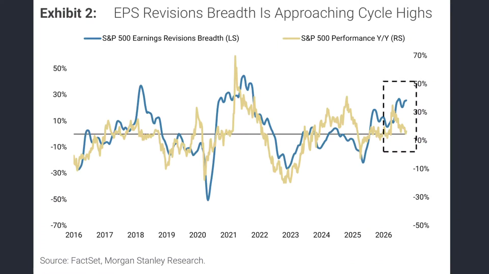

**逐字稿片段：** 但VIX指數還在15上下做附近震盪 所以如果接下來move再見 的恐慌指數很快的下滑 那可能市場的廣度就會追上指數 那股市就繼續上漲了 那你如果說60%70的 股票都還在繼續下跌但是呢 美國股市就目前情況來看 還借由這些大型科技股往上拉抬 那總有一方可能走錯了方向 這個時候市場壓力就很大了 實際利率其實也不太有利於股市 所以這一坡我們必須承認 能源價格的上漲對於 股市和經濟上的威脅 的確已經不如過去幾次 的油價衝擊這麼大了 圖中我們看到的黃色線 是布蘭特原油的年增幅 藍色線是標普500企業獲利的年增幅 可以看到從89年到91年 07年到09年 當時原油價格波動劇烈的時候 企業獲利 都會快速的惡化 甚至變成衰退 但目前情況不一樣 你看油價漲成這樣 這麼離譜 柴油價格也創下歷史新高了 結果標普500的獲利 增速反而持續的拉抬 現在是接近30% 所以換句話說 原油價格上漲 它確實會增加通膨和成本的壓力 而且把實際利率整個給拉高了 可是只要企業的獲利和景氣只要能夠 足夠的動能強勁 現在看起來 經濟吸收能源衝擊的能力 比衰退前期還來的表現更好 當然部分股票吸收的並不好了 所以現在的重點就來自於

**話題推測：** 引用VIX指數數據進行對比

---

## 00:03:59

**逐字稿片段：** 到底過去突破了4.5% 利率的分水嶺之後 市場上會如何來反映

**話題推測：** 轉向討論突破4.5%利率分水嶺後的市場反應

---

## 00:04:06

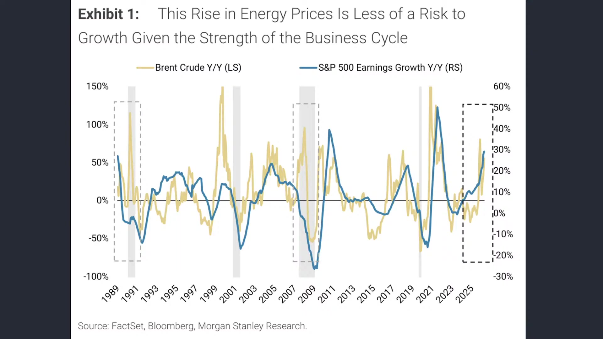

**逐字稿片段：** 標普500的預估的遠期 前瞻本益比 因為現在從當時4.3 今年5月份才4.3呢 然後到4.4 4.5 4.6 4.7 現在突破5%了 標普500的預估本益比也從 21倍一路壓回到19倍左右 好這就是一個新的格局 其實如果從標普等權指數來做觀察 大家就可以觀察出跡象了

**話題推測：** 提供標普500預估遠期本益比數據

---

## 00:04:29

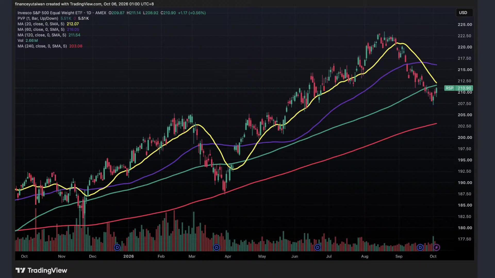

**逐字稿片段：** 這張圖表示標普等權指數 就是它不是用加權來做 進行統整 它是把每一支企業都設定為1/500 那標普有500家企業嘛 如果呢每家企業均等給他設定 一定程度的資金投入量 那到現在為止哦 才剛剛碰到半年線左右 其實位階是很低的 跟道瓊差不多 已經跌到差不多今年 5月6月左右的水準了 所以從標普等權指數來看 那整個標普漲幅 就不是特別的漂亮 漲幅就不是特別的誇張 而且甚至還在做比較大的中級回檔 那背後就是AI的集中度哦 我們如果把AI股票 剔除在標普五百指數之外 現在大概相對於8月底的 高點是下跌接近有7% 等於把整個下季度的 漲幅度已經剔除了 或者說回吐了 那AI權值股現在就是把 大盤撐在高位的主要原因

**話題推測：** 明確提及顯示標普等權指數的圖表

---

## 00:05:23

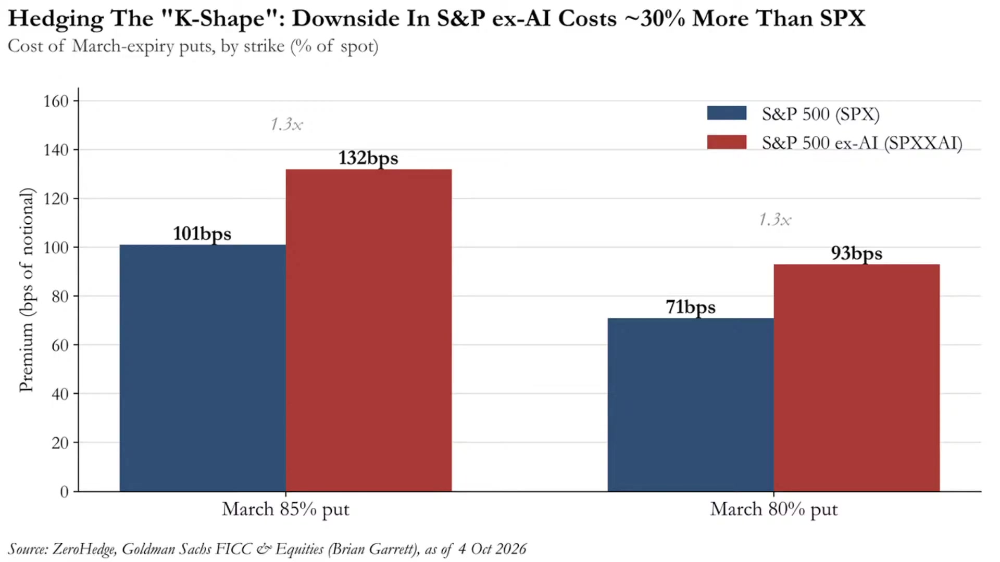

**逐字稿片段：** 本季度光是對於獲利 成長貢獻最大的10家公司 大概就包辦了標普500 超過2/3的整體獲利成長 所以資金就全部灌到 這些大型科技股當中 那這就是股票市場的k型分化 就不是講說 一般民眾的體感 而是股票市場當中內部的k線分化 它導致了很多人付出更高的避險成本 如果我們排除AI的相關大型股 標普500的下跌的保護明顯更貴 明年3月份到期 履約價大概為現價 85%左右的賣權 標普500的避險成本 大概是101個基點左右 但如果你把排除AI之後 就會升到132個基點 好所以整體而言都看得出來 AI巨頭它不只是撐住指數的報酬 它整體來看也壓低了 整體標普500指數看起來的下行風險 那你一旦把這些AI 大型科技巨頭給拿掉 其他美國股市的公司 它的風險定價就明顯更高了 這是真實情況 所以你說 難道市場沒有避險嗎 市場不恐慌嗎 不看大型科技股 大家就恐慌了 但是把大型科技股一加進來 看到它的獲利 大家就沒這麼緊張了 那這也形成另外一層效果 那就是能不能借由 大型科技股撐住指數 然後借由利率市場的寬鬆 或者利率預期的下滑 把小型股給救回來呢 這又有難度了

**話題推測：** 提供獲利成長貢獻最大的10家公司數據

---

## 00:06:46

**逐字稿片段：** 為什麼呢 因為最近美國服務業公佈的PMI數據 又遠遠高於預期 如果昨天我們所提到的非農低於預期 非農的爆冷對於股票市場是利多 因為利率預期下滑嘛 那麼現在服務業沖出5年最強的表現 經濟越強 那不是反而變成 實際利率上的利空了嗎 好所以必須承認了

**話題推測：** 轉向美國服務業PMI數據

---

## 00:07:07

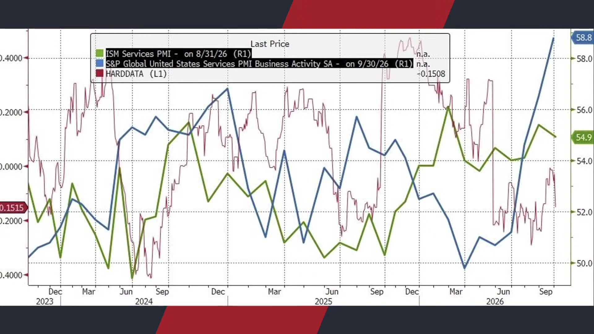

**逐字稿片段：** 現在從標普全球服務業PMI來看 已經來到58.8 這比8月份的56.5還要來得高 而且是五年來的新高 那這種高強度的經濟服務業的表現 美國第三季的經濟成長速度 可能會重新回到4%以上的增速 光是從9月份來看 可能就已經來到5%了 好這種高速的擴張 其實你也很難去預料 直利率有快速下滑的可能性 這就美國股市現在面臨的處境 簡單來講就是 其實內部正在分化 也不是股票市場沒有出現恐慌 但恐慌都是小股票 所以呢指數上看不出來 那真實體感上的大恐慌都是 集中在美債波動率的move指數

**話題推測：** 提供標普全球服務業PMI具體數值

---

## 00:07:50

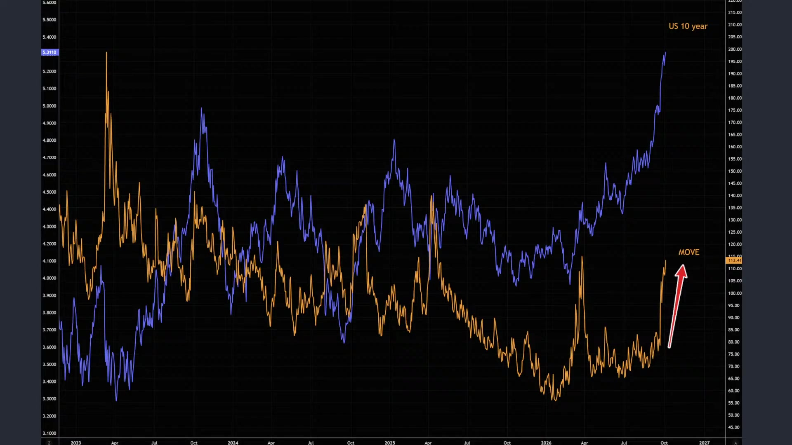

**逐字稿片段：** 你看從9月10號大概77左右 現在已經飆到113 哎這個 幾乎回到3月份市場恐慌的最高點了 但你看VIX指數 它完全完全不波動的 資金完全從股票市場 來看是看不出來的 除非你把它給細分化 好這就美國股市現在的概況 那你說那如果原油價格能夠回跌 是不是有利呢

**話題推測：** 提供MOVE指數的飆升數據

---

## 00:08:14

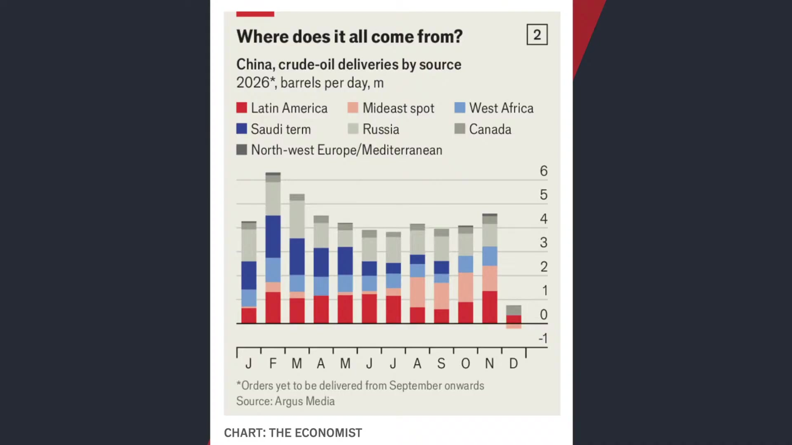

**逐字稿片段：** 原油價格大概卡在100美元左右哦 不過現在真正的問題 還是供給仍然不夠了 整體來說 霍爾木茲海峽和替代管線出口的原油 和成品油平均每天大概在1,700萬桶哦 其實已經慢慢在走高了 可是問題在於 相對之下 相對於戰前仍然不到1/10 那第二大問題 現在其實往下游端傳導 是川普最為注重的 就是柴油和戰爭風險的持續加劇 俄羅斯現在是限制了成品油的出口 加上波斯灣供應不足 所以使得現在市場柴油的 批發價每桶大概是200美元 美國現在柴油零售價格 大家稍微也看到了 每加侖大概就是6塊6.5塊起跳 川普最近又準備要開始 限制美國柴油的出口 那歐洲可能就要被迫 搶購更多地區的原油 所以導致布蘭特原油已經比 西德克薩斯原油高出了12美元了 所以從這樣的一個角度來看短期內 如果其中選舉之前 川普也不採取更進一步的軍事動作 那可能就會僵持在這樣的一個區間 從汽油價格來看 現在每加侖大概大概在 10月初是4.4美元每桶 這個數據哦 雖然沒有說完全突破當時 在2022年的6月份高點5美元 可是它也比 2022年當時的10月份來得貴了 也比2023年10月份來得貴 也比2024年比2025年的10月份都還來得貴 好所以現在的通膨壓力情況 幾乎媲美於拜登在2022年的烏俄戰事 差不多的水準呢

**話題推測：** 提供原油價格約100美元的資訊

---

## 00:09:47

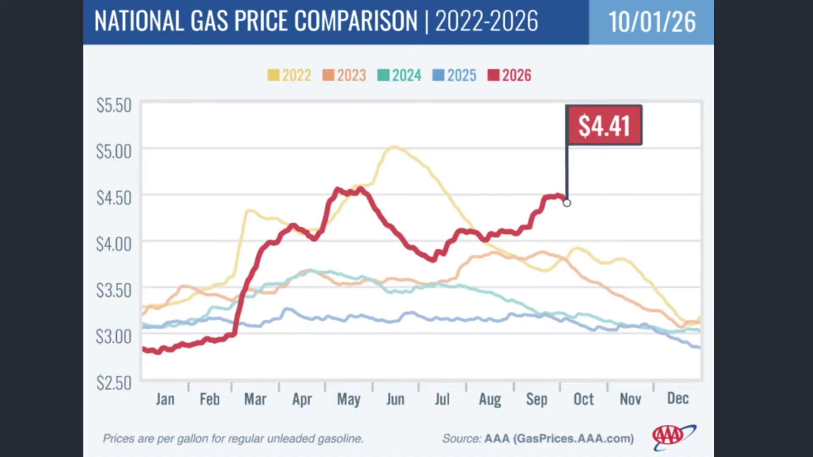

**逐字稿片段：** opec在11月份呢 目前所採取的新態度 也是不增產了 那真正的問題就是有配額 它也增不出來了 這即便給你多增產幾個配額 基本上能夠送到市場上 的原油也是非常有限的 好這就是目前原油供給受限的影響

**話題推測：** 提及OPEC在11月份不增產的新態度

---

## 00:10:04

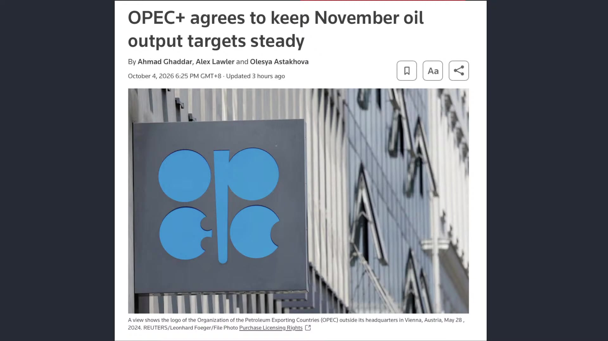

**逐字稿片段：** 川普在幾個小時之前 也發文表達態度了 他說現在造成汽油價格上漲的 原因已經不是荷姆茲海峽 他在推特上寫 目前幾乎每天其實都 有大量的原油運出 數量甚至屢創新高 他認為現在真正的問題 是煉油廠 川普表示 俄羅斯的煉油廠正在 遭到烏克蘭的轟炸 而美國自己的煉油廠也有在加州 這類民主黨主政的州陸續關閉 這都是那些蠢蛋民主黨人害的 這他的貼文 語畢哄堂大笑 好那不管怎麼說 這就川普目前的態度 看起來他短期內也無法解決 但是代表著利率有可能會 維持在這樣的一個區間 維持得更久

**話題推測：** 轉向川普對汽油價格上漲原因的發文和態度

---

## 00:10:48

**逐字稿片段：** 那目前10年期美債殖利率 因為已經比標普過去12個月的 盈餘殖利率還要來得高了 跟股息殖利率的差距 大概也擴大到4個百分點 兩者都是2,000年初以來的最大 那美銀現在就把利率有 分成五六七三個階段 4.5的時代已經過去了嘛 5%以上 投資人可能會開始覺得 那股票跟債券好像都可以買哦 那到6%以上 通常殖利率的上升呢 就會開始壓低股價的報酬 7%以上 估值本益比的壓縮就會全面的展現 那歷史上 10年期美債殖利率處於5%到6% 而且又在陸續上升的過程當中 其實標普是有機會能夠繼續上漲的 升到6-7%以後 按照過往經驗呢 平均報酬就幾乎為0了 短期內升到7%以上 通常就要進入到負報酬了 所以美銀的看法是 5%也不是股市的死亡線 只要企業獲利還在持續 大家就同時高利率跟高獲利成長並行 那到6%到7%以後就 雖然股價不一定會重跌 可是本益比大概也已經崩掉了

**話題推測：** 比較10年期美債殖利率與標普500盈餘殖利率

---

## 00:11:53

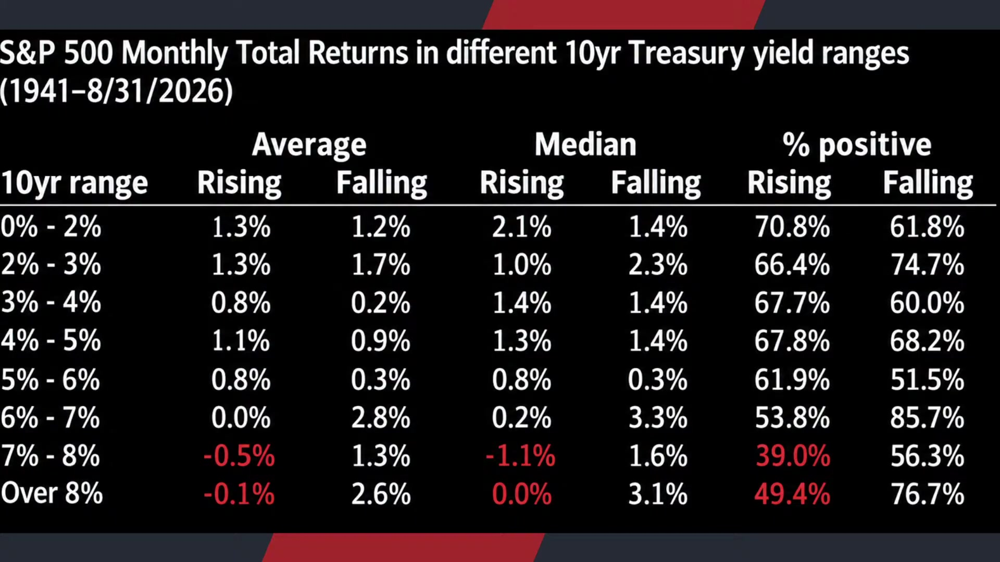

**逐字稿片段：** 那目前標普500的本益比大概是20.4倍哦 整體來說其實已經相對於 過去幾個月下滑算蠻多了 好這就是第一層 我們觀察到的實際跡象 就是大家想了想算了 5 %殖利率也沒有說到這麼痛 等到6%7%再說 會不會6%7%以後再往後延後 以後AI大爆發 一年報酬低於10%的 債劵大家都不買了 搞不好 所以這就是一個新時代 我們開始習慣高利率時代的展現

**話題推測：** 提供標普500本益比數據

---

## 00:12:23

**逐字稿片段：** 那看下美國股市的表現呢一樣 繼續反映大型科技股向上沖

**話題推測：** 轉向美國股市當日表現

---

## 00:12:27

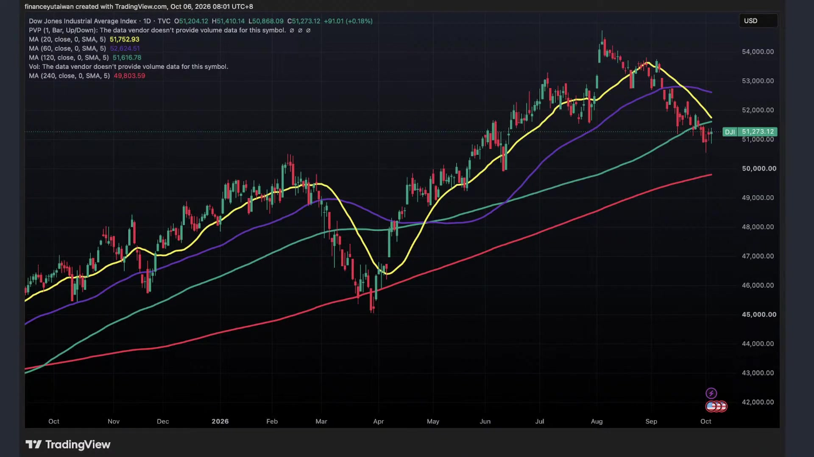

**逐字稿片段：** 道瓊上漲90點 0.18% 收在51,267點 標普上漲51點 0.66% 收在7,773點

**話題推測：** 提供道瓊指數上漲點數和收盤價

---

## 00:12:37

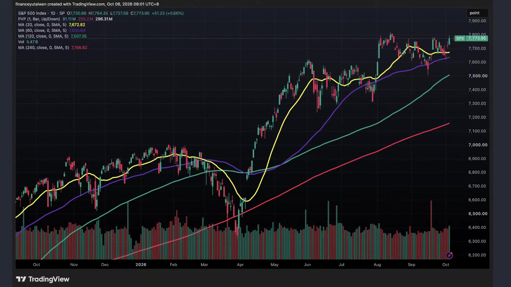

**逐字稿片段：** 納指上漲2百八十六點 1.05% 收在27,477點 創下歷史新高價了

**話題推測：** 提供納斯達克指數上漲點數和收盤價

---

## 00:12:43

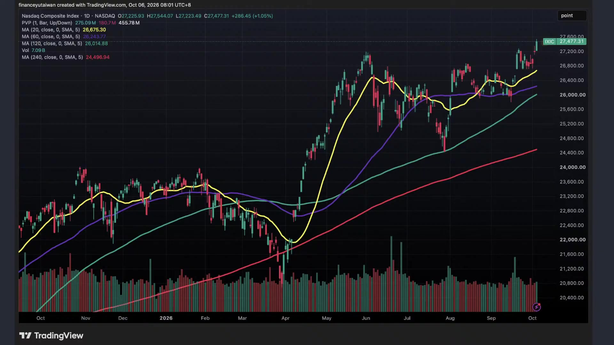

**逐字稿片段：** 標普上漲36點 0.28% 收在13,172點

**話題推測：** 提供另一組標普指數（或其變體）數據

---

## 00:12:48

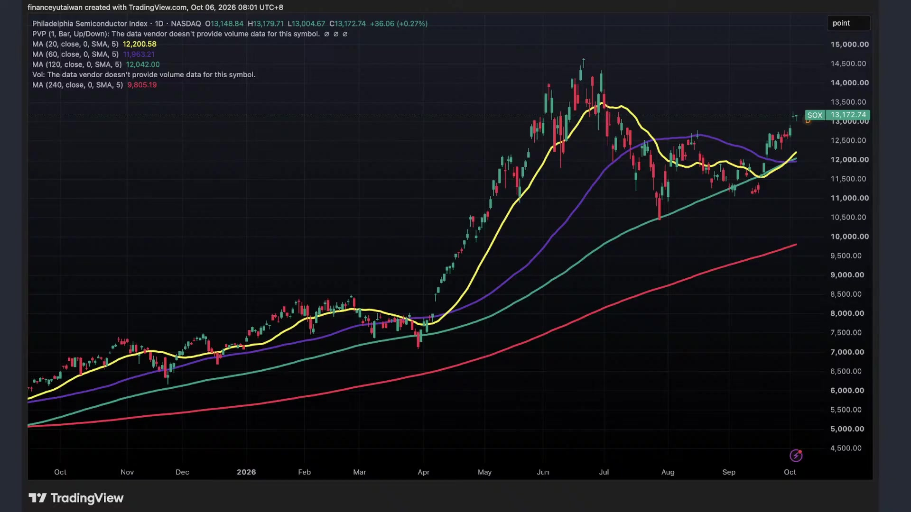

**逐字稿片段：** 觀察幾隻個股 Spacex在昨天股價漲了8% 馬斯克現在他的 身價市值 重返到造園富豪的寶座 那當然呢 主要還是來自於市場上 在短期內針對新建的試飛 還有對於AI業務的成長 動能有進一步的拉抬 他也這樣子默默賺回來了哦 那個時候IPO價格 也是一路的重挫 然後花了一兩個月的時間慢慢拉回來

**話題推測：** 轉向觀察幾隻個股

---

## 00:13:16

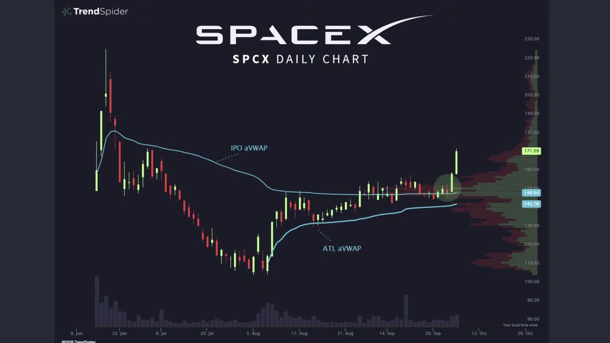

**逐字稿片段：** 那美國科技圈呢 現在也針對AI的名稱之爭開始 做比較進一步的一個變化 我們都很清楚知道

**話題推測：** 轉向美國科技圈AI名稱之爭

---

## 00:13:23

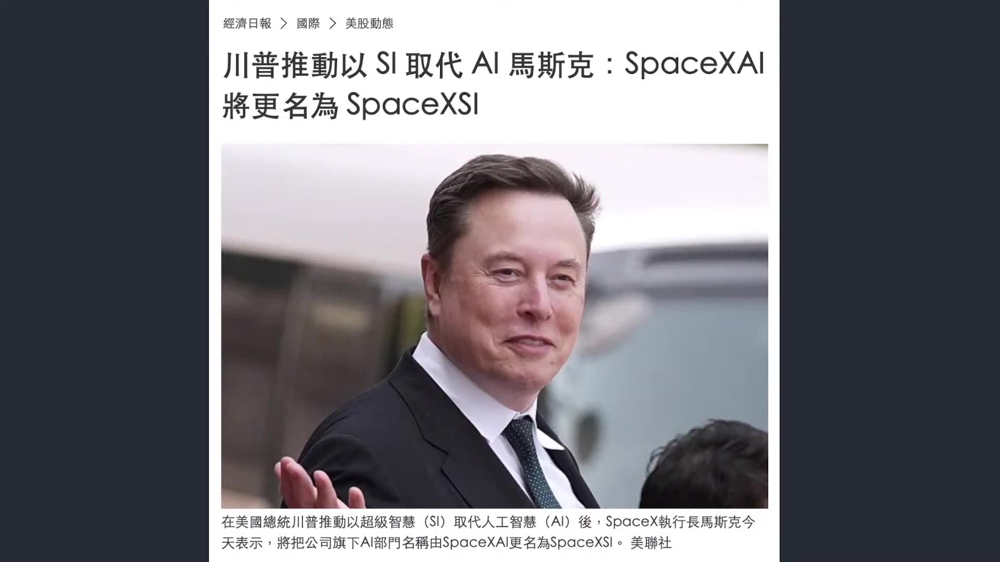

**逐字稿片段：** 因為川普最近呢 開始推的是SI嘛 要取代AI 所以馬斯克也預估未來會 把Spacex AI的名稱改成Spacex Si 所以簡稱space XAI 差不多是這樣子 好但這個改名還在一個宣佈階段呢 馬斯克也沒有確切公佈的時辰 會不會到時候連代號也要改 那不重要 重點來自於 因為最近是馬斯克的談話所

**話題推測：** 提及川普推動的SI概念

---

## 00:13:48

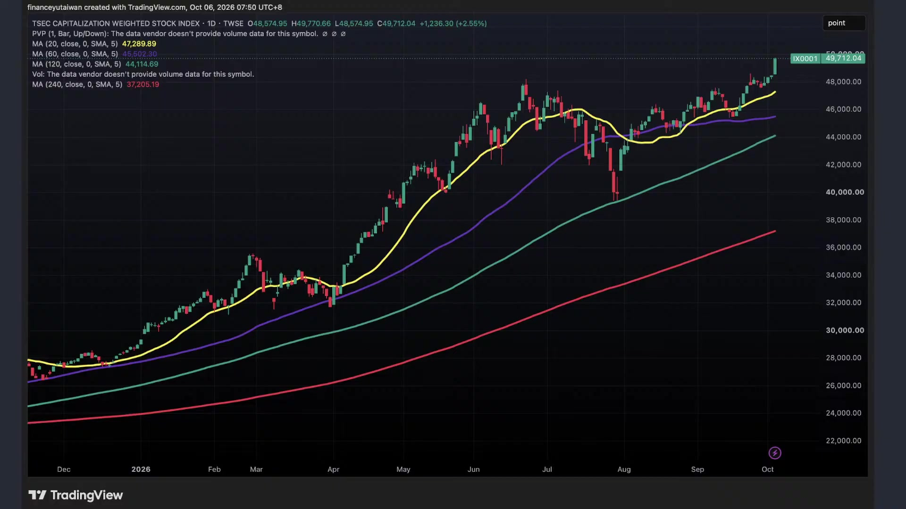

**逐字稿片段：** 導致台積電ADR的直接破高 這一次昨天台積電ADR 又上漲了2.75% 股價創下歷史新高 主要就是馬斯克 Terrafab 最近找上了台積電 可能變成台積電蓋廠 Spacex出錢 然後包產能 那雖然現在目前表示還在討論階段呢 不過讓大家意識到 台積電的訂單業務越來越廣 目前可能傳出的架構 是由台積電出面新建 持有並且運營一座晶圓廠 專門服務特斯拉 Spacex還有Xai 那Spacex呢會投入建廠的資金 承諾長期的採購產能 甚至兩者同步進行 那像台積電因為擁有 全球最大規模先進 制程的能力 所以作為Terafab的合作 夥伴其實相當合理了 那之前我們也知道馬斯克 本來就有龐大的晶片需求 要自己做 你說跟Intel 因為Intel4月份就已經加入了 那會不會 雙方分工來承接不同的 制程和不同晶片模式 那我相信時間久了以後 馬斯克最後一定會希望 把更多的訂單給台積電 因為良率比較高嘛 這是值得觀察的效果 這也直接帶動了台積電的走高以後 搭配著低軌衛星PCB的狂歡 昨天台積電台股市收漲1,236點呢 現在準備要叩關5萬點了 成交量也放大到1.15兆了 好這種金金漲的行情呢就是 反正台積電都這樣了 都盤整很長一段時間 然後突然就拉動了 盤整很長一段時間就拉動了 臺灣的高價股 權值股都差不多了 這很少一漲從年初漲到年尾的 通常都以前臺積電 以前五六百塊也是 一給你盤就給你盤一年了 然後呢 兩個月就給你可能漲了30% 40% 台股也是這樣子一路走過來的 我們以前開玩笑嘛 看空的後悔 這個這個後後悔沒買的 就是看空的後悔 做空的也後悔沒有買 買的也後悔沒有買夠 然後後悔 all in的又後悔沒有去信貸all in 就你總會覺得說 這個台股的報酬好像 提早應該做一些參與 應該說做一些準備 但是總是後悔 應該當初多買一點的 每個人都在後悔 但台股其實我們都很清楚 這幾年就是這樣子一 路金金漲漲上來的 那對於現在台股的顯著拉動

**話題推測：** 轉向台積電ADR因馬斯克談話而創高

---

## 00:16:11

**逐字稿片段：** 我們要如何把它 來看待當前市場籌碼的變化呢 我認為最為直觀的其實 就是外資開始回歸了對 喝多了 沒有喝多 啤酒節已經結束了 那創高之後哦 到底這一波是由誰來做拉動的 我覺得昨天就很有趣了

**話題推測：** 轉向探討當前市場籌碼變化

---

## 00:16:29

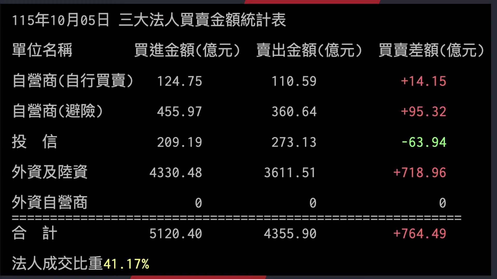

**逐字稿片段：** 投信昨天賣了63億 但是外資買了718億 那到底有沒有可能在外資的回補底下 終於迎來新一波的顯著拉升呢 因為其實過去幾個 季度我們都看得出來 都是靠投信 都是靠內資 有比較顯著的買盤做支撐的 那硬是把台股撐在這樣的位階 那外資其實賣壓有時候 3月份或者7月份很大 如果外資能夠借由這一輪開始做回歸 哦那台股就可能進入到急噴了 基本上是這樣子了 如果呢 台股被股市 是外資還是偏賣方 那台股就慢慢的創新高 那外資偏買方 那就算投信不滿了 那就是快速的創新高 好這是目前的看法

**話題推測：** 提供投信賣出和外資買入的具體金額

---

## 00:17:12

**逐字稿片段：** 所以風水輪流轉了 上半年我們清楚知道 還是由韓國股市獨領風騷 時間線來到下半年

**話題推測：** 轉向全球股市表現的對比

---

## 00:17:19

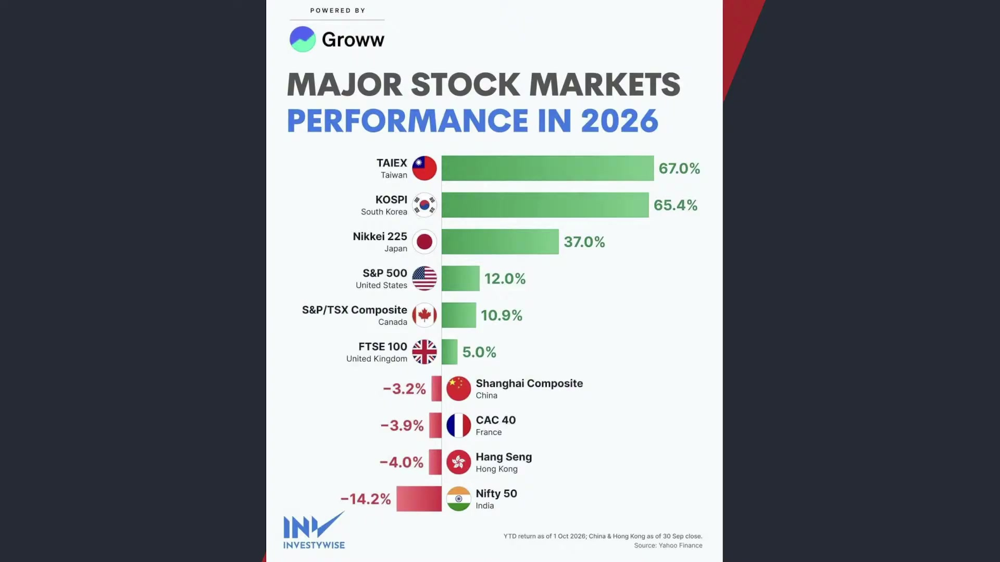

**逐字稿片段：** 好台股股市現在以67%的漲幅 現在已經排行第一名了 南韓綜合指數KOSPI指數上漲65% 位居第二 日經225是上漲37% 那相對之下 美國標普500指數上漲12% 加拿大股票市場上漲10.9% 富時指數只上漲5% 亞洲內部也不是全面上漲哦 我們看上證指數反而下跌3.2 恒生指數下跌4% 法國CAC指數 最近也是下跌3.9% 越跌越重 印度50指數更是重挫了14% 所以今年並不是亞洲勝過歐美 是臺灣南韓日本 只要是科技半導體權重比較高的市場 就是大幅度的領先 如果我們細看 你看法國股市 最近真是慘不忍睹 一個慘字 歐洲股市最近就很明顯分化 法國股市如果我們從 高點這樣子跌下來哎 其實它已經跌到差不多3-4月份 當時美英戰士的低點了 那很明顯嘛 就來自於歐洲市場 一方面在AI的追趕是有限的 另外一方面 法國內部 不管是最近學運的問題 還是在財政赤字的情況 其實都有陸續展現的

**話題推測：** 提供台股以67%漲幅排行第一的數據

---

## 00:18:30

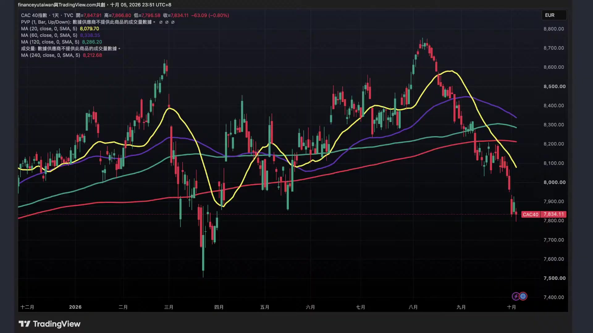

**逐字稿片段：** 歐元市場也是如此 歐元現在大概已經跌 到17個月來的低點了 這個很明顯 一定有反映一些政治風險 或者法國財政危機升溫的問題

**話題推測：** 討論歐元市場和歐元跌至17個月低點

---

## 00:18:41

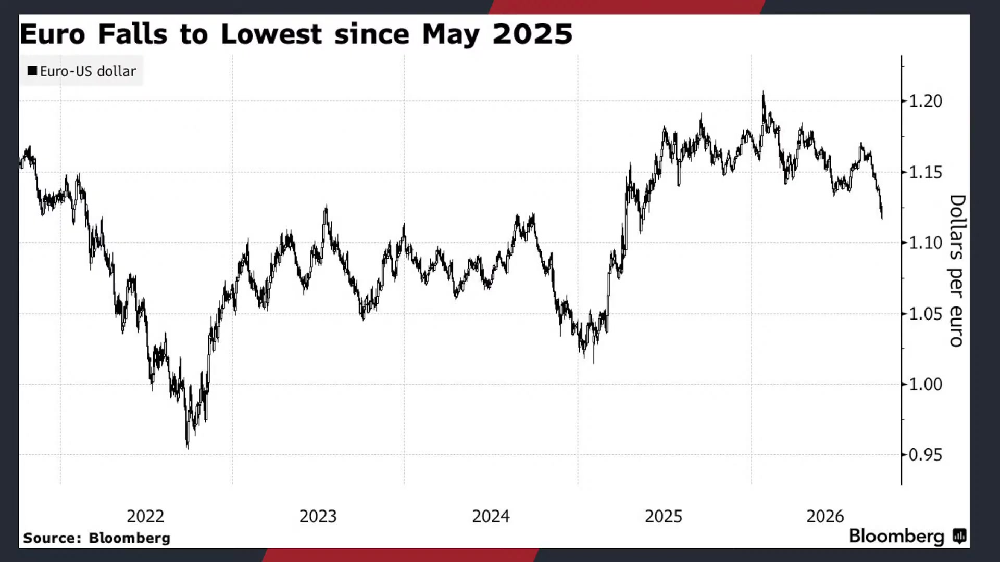

**逐字稿片段：** 現在10年期法國公債和德國公債 的利差已經擴大到152個基點了 這是2011年歐債危機以來第一次見到 現在法國義大利比利時不較高債務的 這些國家也開始重新受到市場檢視 好這就是觀察到 全球市場 你說今年是一個大牛嗎 就看你是哪一國人 法國人你覺得今年很慘 對於臺灣股市 臺灣股民 韓國股民而言 然後今年真的是躺著賺 因為現在就是靠 基本面的獲利做支撐的

**話題推測：** 提供10年期法國和德國公債利差數據

---

## 00:19:11

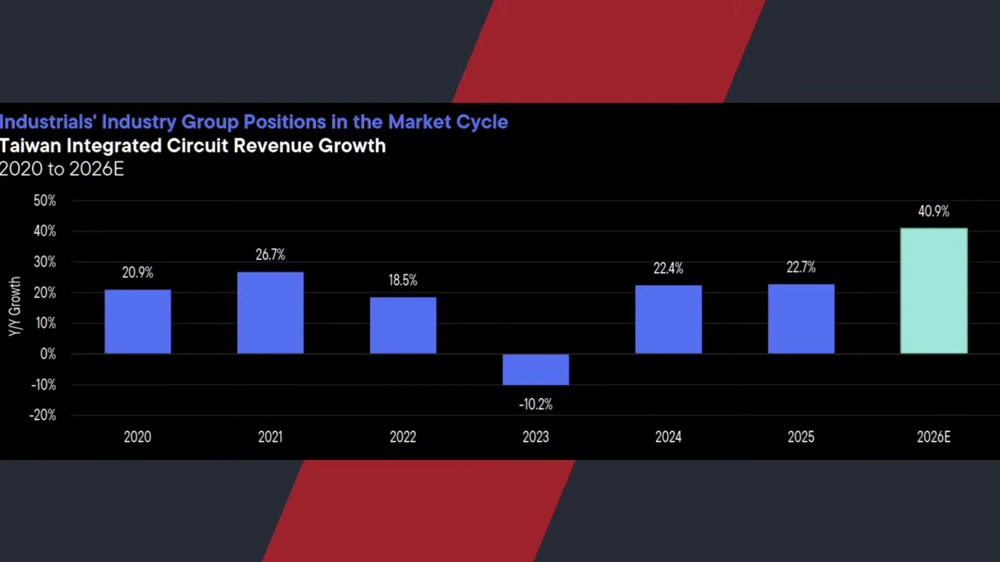

**逐字稿片段：** 現在臺灣半導體今年的獲利年 增幅大概是成長40%到50%左右 韓國市場在DRAM記憶體價格

**話題推測：** 提供臺灣半導體今年獲利年增幅數據

---

## 00:19:18

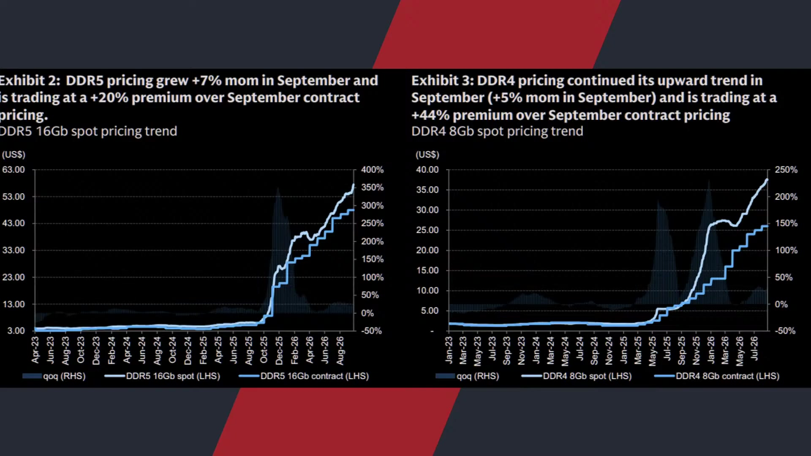

**逐字稿片段：** 那目前來看 現貨價格還是明顯高於合約價 我們看DDR five 16GB的現貨價格 9月份一個月又漲了7% 目前相對於9月份合約價 仍然有20%%左右的溢價 DDR four8GB供需更加吃緊了 9月份現貨價格又漲了5% 相對於9月份合約價的 溢價已經高達40%了 所以不管是DDR four DDR five 在25年我們都知道 它價格都還算是平穩階段的 從整個下半年開始往上拱 到26年到現在10月份呢 價格居然還沒有任何停下來的跡象 這也導致了美國 半導體的銷售額年增幅 本來以前都是20-30% 現在在2026年年初達到60%現在呢

**話題推測：** 轉向韓國市場DRAM記憶體價格分析

---

## 00:20:06

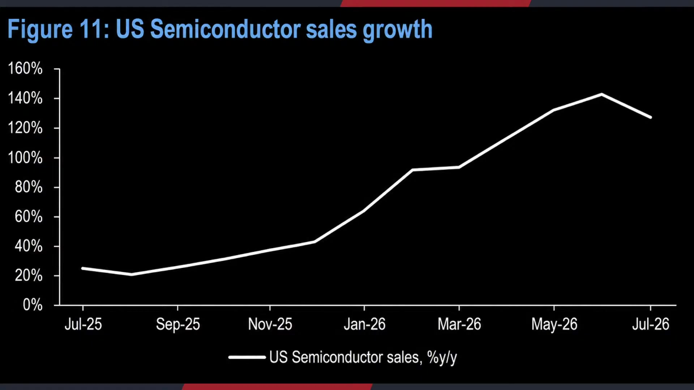

**逐字稿片段：** 10月份已經來到120%了 然後就是以這種速度 持續地往上來做暴升 整個東亞製造投入 價格也全面地升高 任何PPI價格都在做快速的顯著拉升

**話題推測：** 提供美國半導體銷售額10月增長120%的數據

---

## 00:20:19

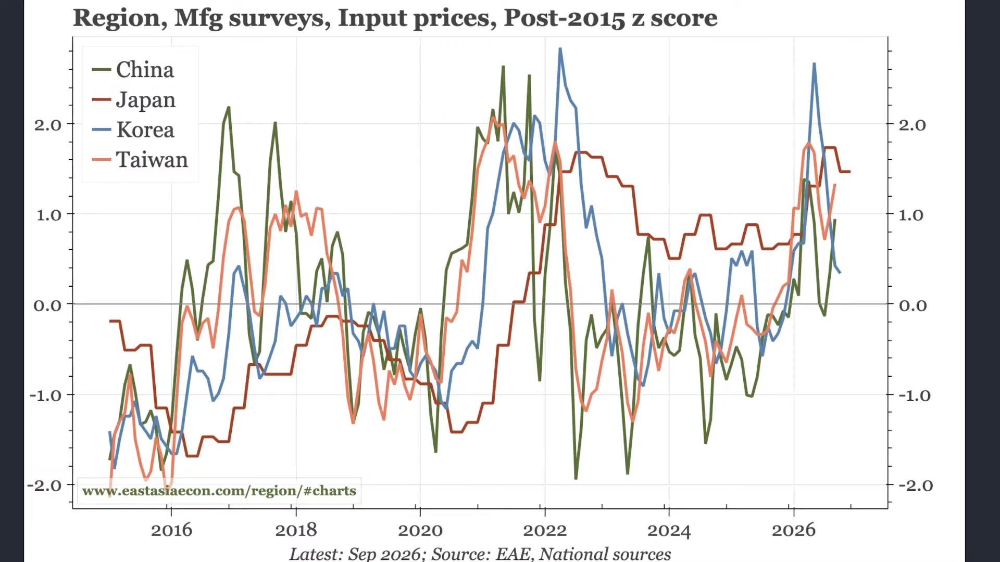

**逐字稿片段：** 那加上台積電最近也在評估德州是否 要再蓋一個大型的晶圓廠 那單座至少會200億美元 AI需求的全球產能呢 看起來會持續的擴張 這就是一個新時代的一個借鏡

**話題推測：** 提及台積電評估在德州蓋新晶圓廠的消息

---

## 00:20:33

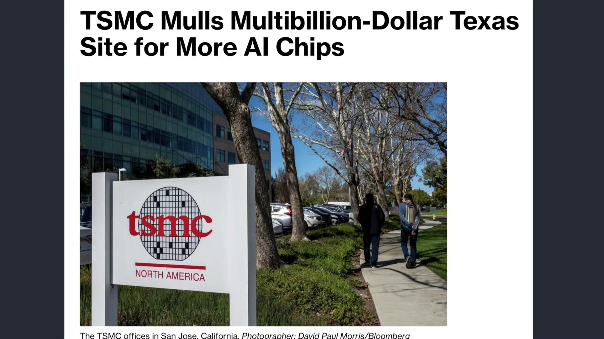

**逐字稿片段：** 這當然會形成一種 內部的資金排擠效果 我們如果細看

**話題推測：** 轉向討論內部資金排擠效果

---

## 00:20:38

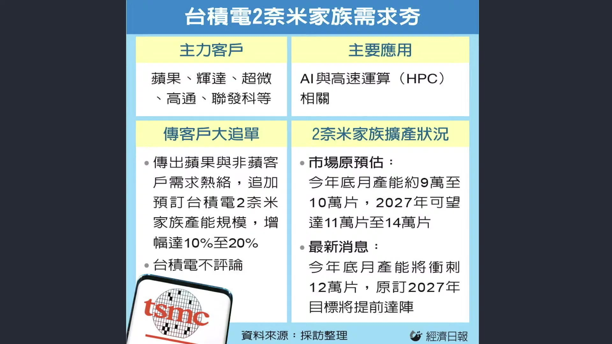

**逐字稿片段：** 最近在今年前7月 最近所公佈的臺灣銀行 新增的放款已經高達4兆 台幣了大概是1,260億美元 光是整個7月份單月份就增加了1.04兆 這是歷史的新紀錄 主要是企金消金新增的 貸款都同步創下新高 哦所以從這樣的一個角度來看呢 代表的是臺灣雖然游資是很充沛的 可是現在市場有信心的 借錢的速度 快要去追上錢流進來的速度了 過去企業貸款的審核 大概是要3個月左右 那越來越多科技公司要求 銀行在兩個月內完成它的核貸 也反映現在市場在搶產能 要搶資金的速度正在快速的拉抬 最明顯出現的數據 是在周轉金

**話題推測：** 提供臺灣銀行前7月新增放款總額數據

---

## 00:21:24

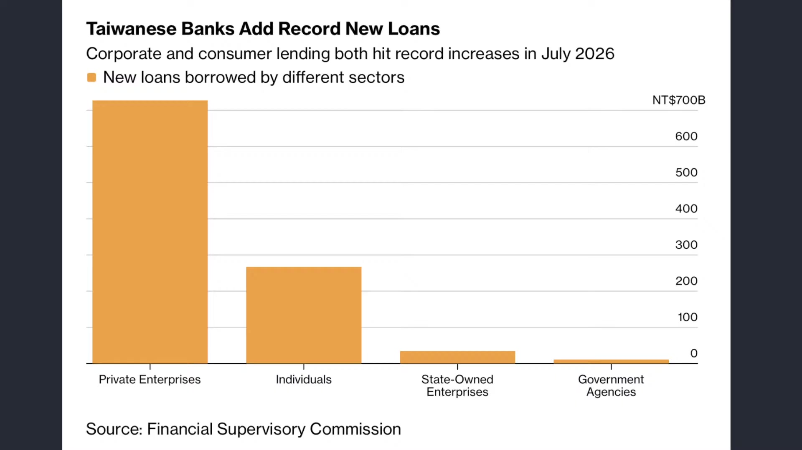

**逐字稿片段：** 如果我們看7月份 當時企業和個人用於 周轉金需求的銀行貸款呢 單月是增長8,200億 增量大概是購物貸 貸款的接近有8倍左右 那相對之下 那房屋市場就很很緩了 整個8月份房貸餘額大概11.9兆 年增幅只有4.6%了那 反而現在都是集中在企業 貸款或者在信用貸款層面呢 資金爆發之後 第一個結果就是錢變很貴 從整個金融市場的流動性指標來看 企業貸款利率現在大概 已經上升0.9個百分點了 房貸利率從25年最低是2.2 現在平均已經來到3%了 所以這也說明著 雖然臺灣央行是沒有升息 不過銀行看起來自己已經先升息了 這是不能說臺灣銀行 有資金荒的問題 只能說現在 借錢的需求 快要追上錢流進來的速度了 好所以遊資是不是充沛 遊資是很充沛的 買股市的錢是不是很多是很多 可是現在更多人想借錢買股票了 這就是提前的一個透支效果 最終導致的 結局就是 不只是電子業現在的獲利爆發 臺灣金融業的獲利 也正式爆發了

**話題推測：** 提供7月份周轉金銀行貸款增長數據

---

## 00:22:36

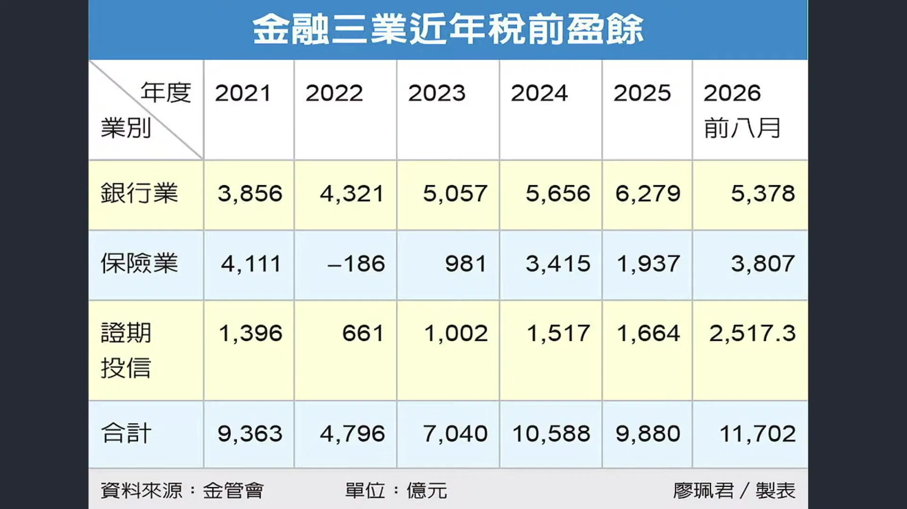

**逐字稿片段：** 最近看到銀行保險證券投 信三大金融業的前8個月 稅前盈餘已經來到1兆1,702億 比去年同期 暴增了94% 你要知道哦 臺灣今年的整體大盤 大概EPS年增幅大概40% 那部分個股可能是以70-80% 銀行業是賺一倍哦 光是8個月就已經超過 2024年1兆588億的歷史記錄了 好這就是我們觀察到 現在金融業也處於極端的爆發期 好這就是歷史新高當然了 多頭回過頭看 好像理所當然 可是投資真正困難的地方 從來都不是事後知道 台股長期最後會創高 是你能不能撐到創新高的那一天嘛 好這跟那個戰爭的道理很像 我們最常看錯的未必是方向 是時間 我們當然知道AI會提高生產力呀 我們知道企業的預估 獲利總有一天會成長 股市總有一天會創新高嘛 可是你原本以為可能是下個月就發生 想不到等了半年 想不到等了三年 想不到等了5年 結果中間又碰上30% 40%的回檔 結果可能就完全不同 而杠杆的人 他可能被迫先斷頭 7月份你的被斷頭的那些人 他不看好AI嗎 他一樣看好AI了 但他看對了趨勢 他最後死在了波動 好所以 有時候我們要這樣想 市場最後能夠創新高 跟你有沒有留在市場等到那一天呢 其實是兩回事 你要有心理時間線的預估 你能夠留在市場多久 你要想看到

**話題推測：** 提供三大金融業前8個月稅前盈餘數據

---

## 00:24:10

**逐字稿片段：** 我最近才看到一篇報導 那個普丁 是2022年2月份入侵烏克蘭嘛 這場戰爭已經打5年了 已經超過一次世界大戰的時間了 那你要想看到 如果他在入侵烏克蘭的那一天 他知道打5年還沒辦法結束這場戰爭 他還會發動戰爭嗎 1937年當時日本的決策者知道對中國 開戰不是幾個月就能夠結束 他要一路打8年 那你覺得還要打太平洋戰爭 他們還會做出同樣的抉擇嗎 又不是那個像電視劇裡面演的一樣 同志們我們八年抗戰已經打到第七年 他沒辦法提前知道會打到八年嘛 所以同樣的 03年美國的決策者知道推翻 臺山政權可能只需要幾個星期 結果需要8年的駐軍 他還會打下去嗎 每個人都相信戰爭不會打這麼久 但真正被低估的有時候是時間 所以其實在股市投資也是一樣 你能夠熬到最後 時間就是你的 投資上的醒示就是我們 最常看錯的 有時候都不是AI看錯了 方向看錯了 都是時間看錯了 好不要被市場給洗掉 好這是很重要的 你要多問一句 如果我要再多等3年 那我撐不撐得起自己對的那一天 哦這兩天我才去看那個皇家啤酒屋嘛 1920年希特勒就在那邊 發表了納粹黨的25點綱領 然後德國工人党這個時候也改名 成國家社會主義德國工人党嘛 那你今天走進去都是樂隊 都是觀光客 100年前 這件事情最值得反思的地方就是 大家都在談這個聚會口號 然後一個民主社會的危機開始爆發 那我就在想 我在想說 如果1920年 如果希特勒他就站在那邊 他知道25年以後的結局 他原本想要追求千年的帝國 只會存在短短幾十年 德國城市最後化為灰燼 那納粹犯下的大規模屠殺 種族滅絕 那最後自己只能躲在碉堡裡面 然後最後 選擇上路唉 所以歷史上最令人 感慨的地方就在這邊呢 比如說我們不知道 真正這條路能夠通往哪裡 但如果你先知道結局了 那你撐得到最後嗎 一樣你知道結局是很悲慘的 你還會下那個判斷嗎 好這個是很重要的 值得觀察的重點了 好那不管怎麼說 現在我們看到股票市場 處於比較極端的分化 大型股跟小型股的分化 那股票市場跟債券市場的分化 那各國股市有AI和沒AI的分化 最後所形成的一個效果 當然是這場遊戲

**話題推測：** 引用普丁入侵烏克蘭的例子作為時間預估的啟示

---

## 00:26:50

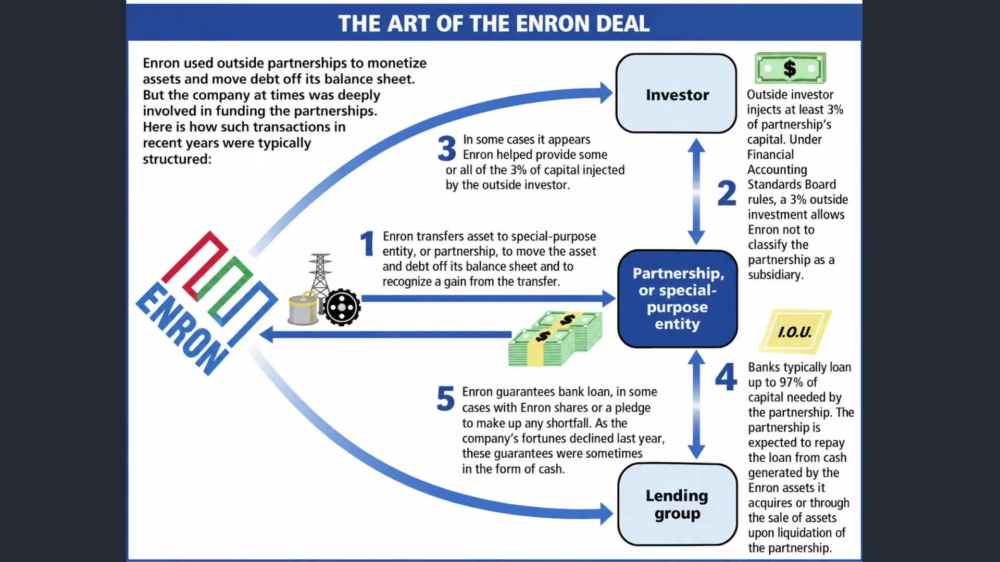

**逐字稿片段：** 能不能持續玩下去 那現在能夠玩下去的幾個原因呢 除了我們剛才看到的基本面推升以外 它背後其實還是來自于創造流動性 就是有更多的錢 我們看AI基礎建設 現在已經開始進入到一個新的階段 科技巨頭不再只是 自己拿現金蓋資料中心買晶片 越來越多公司運用SPV 特殊目的公司哦 來把AI投資移到資產負債表之外 來獲取更多的資金 而且同時讓資產負債表 表達相對亮麗的表現 我們根據相關統計哦 現在大型雲端業者加上 輝達博通的表外承諾 大概已經從1.8兆 在短短一個季度哦 現在10月份已經來到3.1兆了 暴增了1.3兆 我們來探討兩個案例哦 一個是亞馬遜 另外一個是博通 亞馬遜是最近把 80億美元輝達的Breakwell晶片 移入到特殊目的公司哦 那這些晶片呢 已經部署在美國V 個州 超過12座的資料中心裡頭 SPV透過舉債向亞馬遜買下晶片 再把同一批的晶片長期租回給亞馬遜 那外部投資人最多可以持有 SPV公司大概10%左右的股權 亞馬遜可能是完全不持股的 這樣做的效果是什麼 就亞馬遜可以繼續使用這些晶片 那是原本直接放在資產負債表上 數十億美元的資產和相關融資需求 它就移到了外部的投資工具哦 背後原因很簡單 就是AI投資的支出實在太龐大了 亞馬遜2026年的資本 支出預估是2,200億美元 大部分投入到亞馬遜雲端 業務的晶片和資料中心 現在整體來看 3月份它已經發行了370億 到現在要發到500億 然後到7月又發了250億 越來越發 越來越弱 它當然資產負債表 表現就越來越不好看 那就要用其他方式來獲得資金 那就借由 不斷的向外擴張 把保險業給拉進來 把主權基金 把一般民眾給拉進來 很快的我們在李專推薦的產品當中 你可能買到一個產品 他跟你說 哦這個可能是田納西州某 兩顆Breakwell GPU的晶片 你也算是參與了AI行情了 就是一代一代的往下傳 他這一代一代 亞沒得就一代 一層貸款一層貸款的往外擴 一直影響到民間市場 好這就我們觀察到的實質跡象

**話題推測：** 轉向討論AI基礎建設和資金流動性創造

---

## 00:29:10

**逐字稿片段：** 那博通的模式是更加值得注意的

**話題推測：** 介紹博通的融資模式

---

## 00:29:13

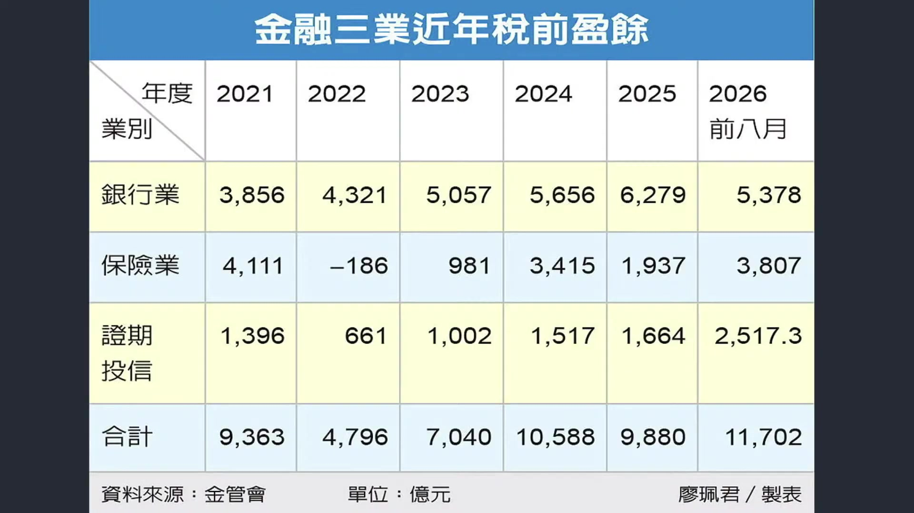

**逐字稿片段：** 銀行團目前準備為Anthropic 和AI相關公司要籌措大概600億美元的 金片融資 其中有420億美元就屬於優先擔保融資 另外有180億美元屬於順位融資 那黑石現在針對整個博通的模式 大概又為它增長了350億美元 它主要就是協助安卓匹 去購買博通製造的晶片 那博通呢 透過部分高順位元的債券 再提供更進一步的信用支援 反正就是現在去賣晶片的人 都要先幫自己的客戶籌錢就對了 輝達要賣晶片 就先幫自己的雲端客戶籌錢 或者掛保證 那博通要賣晶片 它也先用高順位的 債券來提供信用支援 我先確保我的客戶不會倒 我再叫他多買一點我的金片 差不多都是這樣的一個感覺了 所以不斷地向下來進行投放以後 這就是一個新的融資環境了 那當然這也說明著 有人認為這是利多 有人認為這是利空嘛 你一年看到亞馬遜瘋狂地做投入 第一個看 可能反應是需求強到連科技 巨頭自己的現金流都不夠了 那就肯定是AI剛開始嘛 他們多看好AI呀 他們願意即便要花 這麼龐大的高的值利率 瘋狂地借錢 即便利率成本已經那麼昂貴 他們還是要接下去 他們多看好AI 這利多角度嘛 好那另外一個角度就是流動性 那看起來還可以玩一陣子 好但是 往反方向想 大家當然會覺得 那表外承諾越來越高 一個季度就成長1.8兆 市場哪來這麼多錢 在多頭眼中 這不是泡沫 這是動員整個資本市場往前推 但對於相對比較保守的人都認為 那整個系統性風險只是越擴越大 如果AI最後無法造成生產力提升 那最後只是一場空 而且是所有這些頂尖的企業 不管好的壞的 頂尖的市占率大的 你都已經參與這場遊戲 甚至連主權基金退休基金 未來都參與這場遊戲 大家就一起死 好這個是多空不同角度的看法但是 最後還是取決於你 到底你是用什麼樣的 一個角度來做思維 同樣一組數據 你到了空頭眼裡哦它就是 另外一個事件嘛 售後租回 私人信貸 表外融資哦 每一個看起來都像是08年的 但對多頭來看 它就是需求的證明嘛 它就是市場上需要更多的 資金來推動本輪的生產力 所以最後還是完全取決於 那你到底 看到了什麼 每個人看到的畫面或者原本既 有的立場會影響到未來一系列 你是否參與本輪的AI行情呢 剛才講到希特勒嘛 之前講說那二戰結束之後 各國軍人呢 然後都開始互相歡慶和平的到來 那有三名大兵嘛 日本美國和德國的 就到美國人的老家去 看那個脫衣舞表演 脫衣舞女就脫完之後 日本兵就敬禮了 那脫衣舞女 不解那你向我敬禮幹嘛呢 我看到了我日本的太陽旗 見到國旗我當然要敬禮了 那脫衣女就不理他嘛 繼續跳舞 後來呢那美國兵友又對他開始敬禮了 那女郎說 你對我敬禮幹嘛呢 她一看哦 因為我看到了我的美國國旗 那個短褲是美國的星條國旗 我看到之後我就忍不住想要敬禮了 那女郎有一點惱火了繼續跳 她跳著跳著 德國兵也向她敬禮了 哦那女郎不解 你為什麼也要向我敬禮 那德國兵說 我看到了我們元首的鬍子 所以同樣一組數字 你在不同人的眼裡 你看到的是完全另外一個世界 現在有些人看到的是需求的證明 看到的是融資的需求 看到的是AI的爆發 那很多人看到的是杠杆的警訊嘛 所以有時候我們要這樣想 一個投資人 你看什麼像什麼 真正困難的 不是說你找到一個 支援自己觀點的數據 因為市場上永遠都找得到 相關的數據來支撐你 而是你究竟看到的是事實本身 還是你已經先看多先看空了 所以你才找一個數據來推演你 或者推行你的 思想的那我們當然有自己的立場 必須承認了 可是它有內生性的影響 就是就是人類幾百年來 歷史的週期就是這樣子 科技本身是不會有泡沫的 泡沫都是資產化的一個吹捧 但是從目前來看 這個資產化的吹捧 它是否導致了本益比的全面失真呢 融資遊戲是有點危險的 可是你有沒有發現呢 每隔幾個月 市場就會自己嚇自己唉 利率這麼高了 估值要削減一下 AI永動機 去年10月份不可能永遠玩下去的啦 必須要適度回檔一下 如果市場隨時都存在這種校正回歸 隨時都存在這種情緒上的反復 那我認為 其實你說距離到全面樂觀 市場的全面失控 似乎就並不是如此 想像中來的如此之樂觀了 這是我的看法了 其實從大型股跟小型股的分化 獲利好跟獲利不好的 有AI的指數跟沒AI的指數當中的分化 你大概已經看得出來了 市場上並不是一方面 全面性的看多所有資產了 而是在高利率時代更為 精挑細選的選擇自己 相信AI的生產力未來 也給投資朋友做一些參考

**話題推測：** 提供銀行團為Anthropic和AI公司籌措晶片融資的數據

---

## 00:34:29

**逐字稿片段：** 台股上漲140點 收在49,853點呢 好台股看起來沖高到5萬點呢 基本上是勢不可擋了 那重點是5萬點的下一步是什麼呢 是更多天然費的的訂單 還是借由融資遊戲繼續玩下去呢 至少可以承認的事情是 過去 光是靠內資 就足以讓台股 從當時2萬多點到現在4萬多點 那外資的回補只要稍微加大一點 這個創高的速度 你說會比過去兩年還要來得慢嗎 這就不一定了 因為外資的回補 資金量級其實是非常龐大的 也給投資朋友做一些參考 市場的籌碼動態是否 產生了新一輪的變化 留意如果喜歡我們節目 記得幫我們訂閱 按讚加分享 我們在明天早上半盤 早晨財經速解讀再相見 祝各位投資朋友 看盤順利 操盤愉快

**話題推測：** 節目收尾，提供台股當日收盤點數

---
