# yutinghaofinance_wBb7G4Ifd34 — 關鍵畫面索引

- 來源逐字稿：[yutinghaofinance_wBb7G4Ifd34_GT.srt](yutinghaofinance_wBb7G4Ifd34_GT.srt)
- 影片：https://www.youtube.com/watch?v=wBb7G4Ifd34
- 截圖數：26

## 00:00:43

**逐字稿片段：** 畢竟10年期美債殖利率 這一次已經突破5.2%了 那這一次債券市場 美國股市到底會否因此 而受到顯著的影響呢 我們如果細看 這一波其實10年 期公債殖利率上升的速度非常之快 在過去一周又在短短快速的做跳升

**話題推測：** 介紹10年期美債殖利率並提出具體數字。

---

## 00:01:01

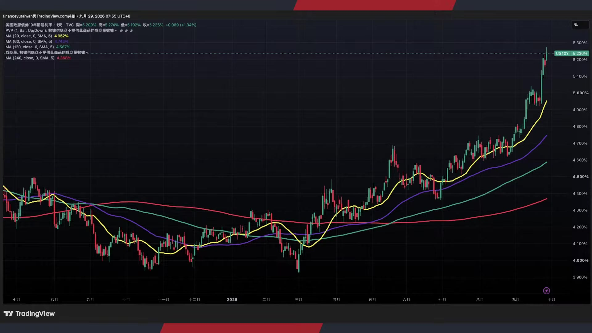

**逐字稿片段：** 道瓊指數收跌了347點 標普五百指數收跌0.7% 納斯達克指數收跌0.92% 費半指數重挫了1.6% 那麼在禮拜一美國股市的下挫以後 我們要如何來看待對於台股的影響呢 畢竟呢現在禮拜三就要公佈 個人消費支出PCE的數據 以及禮拜五9月份的 非農就業數據報告 那在這一次的數據當中就很重要了 因為任何的風吹草動都有 可能把債券市場持續的往下拉 那麼到底債券市場的承壓 5.1%不影響 5.2 那有一天美債變成5.5 變成6% 難道對於股票市場都 不會有任何的影響嗎 今天來跟投資朋友多做一些觀察 其實如果我們細看 在整個2026年 今年的全球資產 已經快要接近一半進入到負報酬了 雖然美國股市還是非常漂亮 尤其商品價格是以45.9 %報酬率排行第一名 那主要還是受到能源和原物料 價格上漲的帶動所造成的影響 美國科技股的部分依舊強勢 納斯達克100指數是上漲21.6% 美國價值股是21% 可轉債是15.9% 小型股15.3% 大型股14% 那麼新市場的部分和已開發 市場分別上漲12%和11%

**話題推測：** 列出美國主要股指（道瓊、標普、納斯達克、費半）的具體跌幅。

---

## 00:02:22

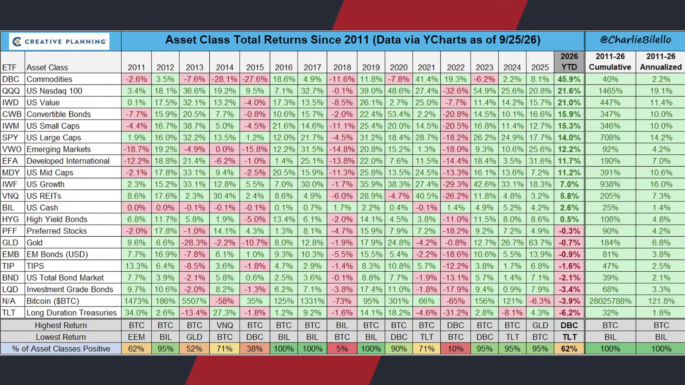

**逐字稿片段：** 可是真正下跌的資產我們就看到了 債券市場現在是幾乎是一個慘字 尤其這一次10年期公債殖利率 上升幅度這麼快的情況底下 市場幾乎沒有太多的接盤意願 美國整體債券今年平均下跌2.1% 投資等級債的部分下跌3.4% 長天期美債TL t下跌了6.2% 好這是變成今年表現最差的資產 誒今年表現最差的資產居然換人當了 往年幾乎都是比特幣 現在變成了長天期美債 那麼黃金本來在2025年大漲了63% 今年看起來又是小跌0.7% 好在過去一周又開始重挫 其實最慘的還是長天期國債了

**話題推測：** 轉向討論債券市場的具體表現。

---

## 00:03:06

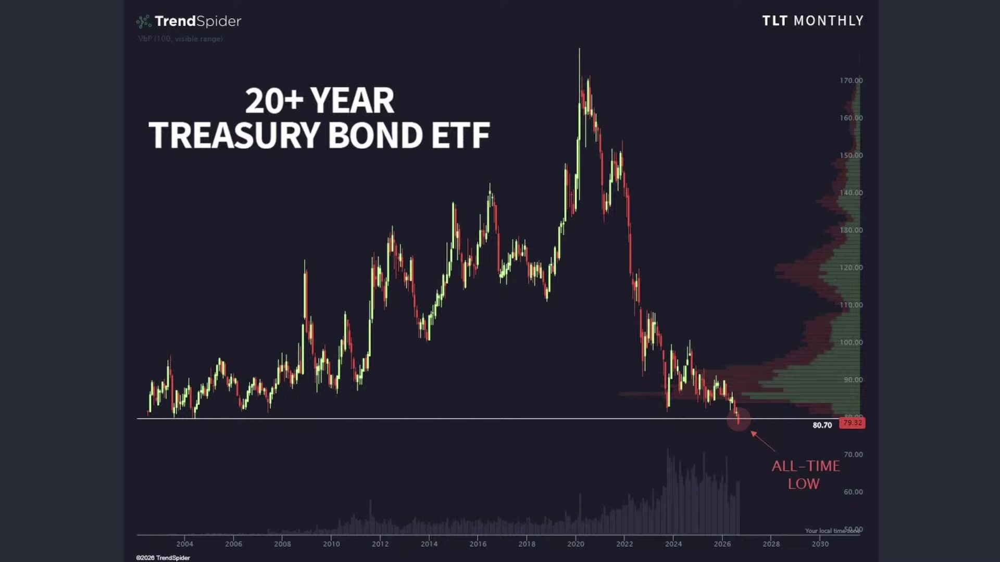

**逐字稿片段：** 這一次我們看到月線價格跌 到大概80.7塊左右的長期低點 目前已經來到79塊 創下掛牌以來的最低 如果從從成交量的分佈來做觀察 85塊到90塊 因為這一波其實盤整了一段時間嘛 上方是有非常龐大的套牢賣壓 意味著未來即便價格反彈 都要知道 從心理慰藉來看 雖然很多人可能是持有直債 所以基本上也沒有太大的價格壓力 它就是持有到期 可是從價格層面來看 也會遇到不少的賣壓 黃金價格更是如此 黃金價格這一次在 單日是重挫了接近4% 它其實也是受到原油價格上漲 和實質利率拉升所造成的影響 市場現在定價12月份升息一碼 的幾率大概已經來到94% 美元和美債殖利率同步走高 造成黃金價格相對大的承壓 現在每盎司大概來到4,136塊左右 上方看起來也有非常 明顯的套牢賣壓區 那在種種訊息底下 我們就可以得出一些框架 就是美債殖利率 對於各項資產都已經形成影響了 對於債市 對於黃金 對於利率型資產而言 其都有適度的衝擊

**話題推測：** 探討長天期美債（TLT）的月線價格和成交量分佈。

---

## 00:04:21

**逐字稿片段：** 可是現在最大的問題來自於 可是美國股市上禮拜都還在走高呢 費半創下波段新高 納指標普今年下半年都還在創高 道瓊只是從防禦性資產 稍微做一些資金流出而已 對於股票市場其實沒有 造成真正足夠大的影響 那麼現在到底我們看到的 利率預期的拉升是否已經 對於股票市場形成影響了呢 其實我個人的看法是哦 其實它有影響 只是從股價上看不出來 你說從股價上看不出來 那還叫影響嗎

**話題推測：** 提出美債殖利率上升與美股仍走高的矛盾現象。

---

## 00:04:51

**逐字稿片段：** 但是從本益比來看 其實是看得出來影響的 我們舉例來說 現在如果我們細看 在整個費半的 本益比預期當中 其實本益比 如果我們從費半 現在股價是當時七八 月份股價重挫之後 開始做盤整區間嘛 然後陸續的創下波段新高 可是如果我們仔細從相對本益比來看 當時已經從高位 前瞻益比28 29倍 一路的往下壓 好到現在 大概224倍 23倍 22倍 到現在大概也不過 接近18倍左右的位階 這說明的事情是 費半雖然現在位階 總體從今年來看還是偏高 在高位進行盤旋 可是從本益比來看 幾乎已經創下了5年來的新低 所以你說到底利率對於 股票市場有沒有任何的影響 我的看法是有的 只是從股價上看不出來 但是從本益比來看 其實已經看得出 目前的積極不是特別高了 那現在比較大的一個問題就是來自於 從上禮拜美國股市的走高 還是觀察得出內部的快速分化 我們從多項內部指標來做觀察 比如說創下52周新低的股票數量 已經連續17個交易日 超過52周新高的股票了 那代表著股票市場上漲 越來越集中在少數大型的權值股 那標普五百指數其實也 出現了差不多的現象 過去一個月站上200日均線 我們把它當成年線 成分股的比例 是在快速的下滑誒 指數還在創高哦但是 站上年線的成分股反而越來越少了 那另外標普百的累計漲跌幅之間的 50日滾動相關性在2026年也有明顯的 下滑甚至一路進入到負值 好這就說明著 這好像股票的創高 也就少數隻幾檔股票在往上衝 那如果是從 不要平均等權指數來看 你反而很容易追不上市場的報酬

**話題推測：** 從本益比角度分析費半指數的估值變化。

---

## 00:06:49

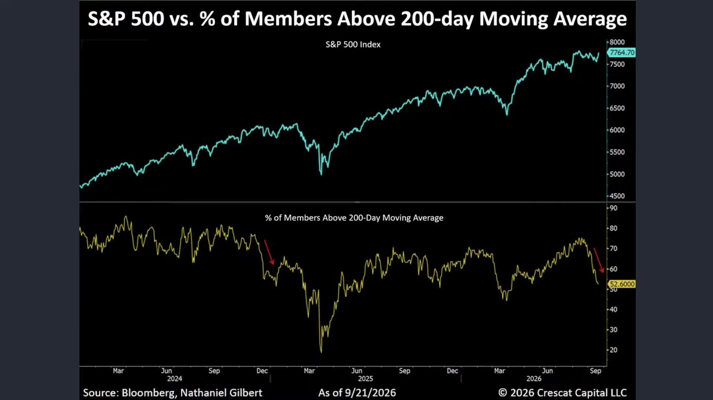

**逐字稿片段：** 信用市場也是差不多的訊號了 如果我們從過去半年標普五百指數來看 它的確還在創高 可是信用評級最低的Triple c的公司債 相對於Triple b的公司債 信用利差還在明顯的擴大 說明高風險企業的 融資壓力目前還在增加 那當然類似的股票和信用市場的概況

**話題推測：** 分析信用市場利差擴大的情況。

---

## 00:07:07

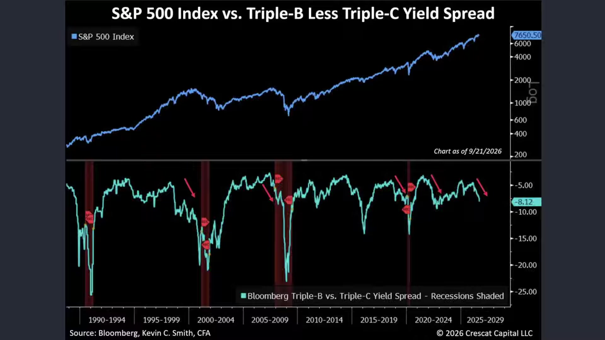

**逐字稿片段：** 2,000年曾經發生過 08年曾經發生過 20年還有2022年呢 不過這些指標它都不 還算是一個標準的風險警訊呢 就是說它是有風險沒錯 但是它沒辦法證明說 股市就漲到這裡了 只能說現在股市一邊上漲 但風險也在一邊的陸續提高當中 所以這個時候就變成 那麼市場就出現極化現象 如同我們剛才所提到 現在標普大概在7,700點附近嘛 但是占上200日移動平均線的比例哦誒 本來是70%哦 現在只剩下52%了 只有比一半稍微多了一點點 現在是站上年線的 怎麼會標普還在創高結果 站上年線的個股比例居然只有一半呢 好這說明大多數的股票市場的強勢 並非所有股票同時間的一起參與 那美債值利率現在又突破了5%

**話題推測：** 比較歷史上股市與信用市場分化現象的案例（2000, 2008, 2020, 2022）。

---

## 00:08:01

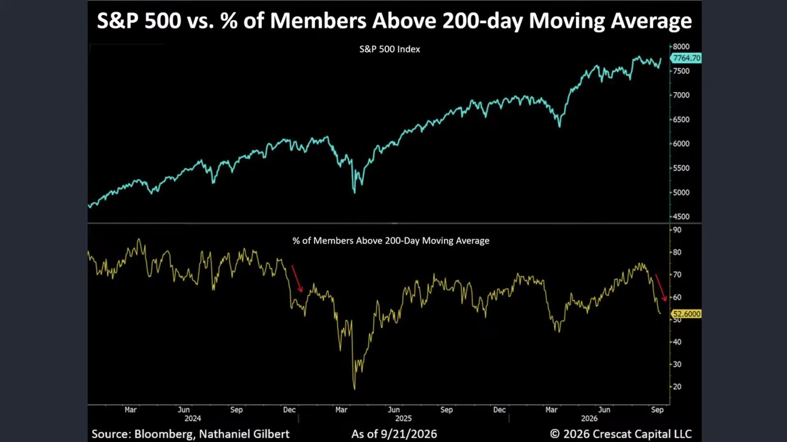

**逐字稿片段：** 所以我們看到一邊是CDS 價格持續創下新高 一邊呢是美債值利率創下本世紀的 新高一邊呢 是股票市場還依舊維持在高位 打死也不願意下來 那不願意下來的根本原因是什麼呢 就是少數企業目前的 獲利實在是太強大了強大到 我本益比都給你18倍了 你還想要我多低呢 我股價雖然沒有創高了 可是我獲利上升幅度很快 所以雖然呢 看起來我 應該要反映一些利率上的預期 股市要回跌一點點的 可是我告訴你 我本益比已經不高了 用這樣的一個方式 勉強撐在高位 這大家在投資人之間 勉強形成的共識 所以我們不能說到底債市 是不是永遠不會把股市給拖下水 也許已經拖下來了 不過拖的是本益比 說的並非股價 那麼你到底是看股價來投資 還是你是看美國股市的基期 看是否具有價值投資點呢 我相信我們已經闡述目前的態度了

**話題推測：** 提出CDS價格創新高、美債殖利率高漲與股市維持高位並存的現況。

---

## 00:08:59

**逐字稿片段：** 那當然了 回過頭來說 現在市場上更進一步聚焦的 就是利率議息 也不太可能說 它一路走高 本益比就維持在18倍嘛 它再更高一點 我就給你更低的本益比 也許是有道理的 畢竟現在從利率預期來看呢 我們主要從兩大層面來做觀察

**話題推測：** 切入影響利率預期的兩大層面（通膨與地緣政治）。

---

## 00:09:17

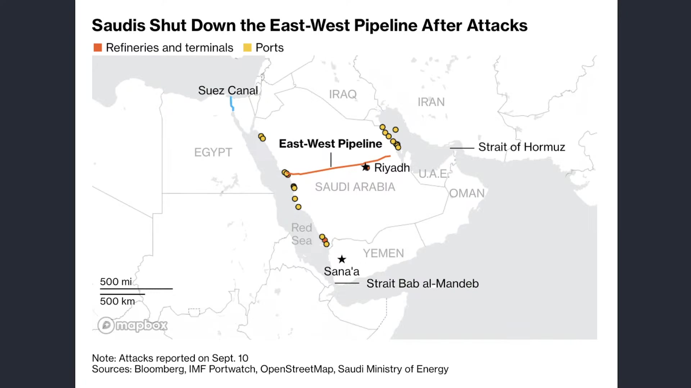

**逐字稿片段：** 第一大層面當然是屬於通膨的問題 哦這一次沙烏地阿拉伯 在橫跨東西部的關鍵油管當中 好在本月份又開始遭受 到顯著的無人機攻擊 那完成維修之後已經開始 重新出口石油不過呢 目前運量還不敢太大 以防隨時可能遭受到攻擊 這就代表著石油風險到目前 為止還是沒有完全的解除 其實現在運量是有 稍微回來一點點的 整體原油的出口量已經升到戰爭 期間大概是接近三四月份左右的 水準呢那每日超過500萬桶 但大部分是流向亞洲 對亞洲地區到目前為止還是 有很大程度靠補貼來撐著 那現在呢 整體雲遊輸入量輸出量 正在緩步的提升當中哦 好但是 地緣政治所要求的風險溢酬 還是會導致美債利率預期持續比較高 加上從下游端來看 其壓力還是比較大的 我們從美國汽油價格每加侖來看 現在大概是4.48美元左右 創下了歷年9月份的新高 這一次就很明顯 比2025年高 比2024年高 比2023年高 甚至比2022年還要來得高了 好所以當時你要知道 拜登最大的衝擊 其實就是22年到23年當時的通膨危機 那麼最後導致了他的 連任之路 或者賀錦麗的連任之路徹底失敗 那麼川普現在所面臨的美國汽油價格 每加侖4.48塊 大概就可以瞭解內部的壓力有多大了

**話題推測：** 討論沙烏地阿拉伯油管遭受攻擊對油價的影響。

---

## 00:10:52

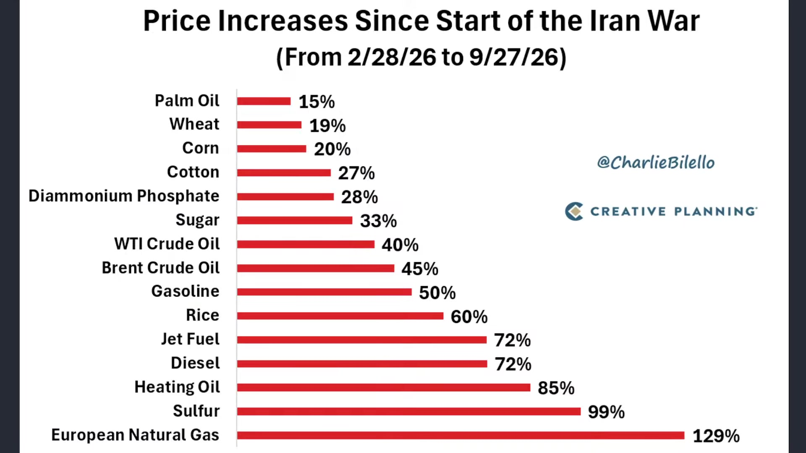

**逐字稿片段：** 我們在統計從228到整個9月27號 全球能源資產原物料價格的漲幅 其中歐洲洲天然氣價格漲幅現在是最 變最大了 已經正式超越硫磺價格 漲幅來到129% 硫磺價格漲幅是99% 取暖油85% 柴油價格72% 汽油價格50% 布蘭特原油45% 西德克薩斯40% 那糧食端現在壓力也是很大的 主要就是因為硫磺旱 農業價格 還有一些肥料價格的上漲 稻米價格上漲60% 糖價已經漲33% 那少吃一點糖 棉花價格27% 那少吃一點棉花糖 這個不是那個棉花 玉米是20% 小麥19% 棕呂油15% 好這說明著其實生產成本已經 大幅度的擴散到大宗資產價格當中 即便原油價格跌回來 這些有這麼好跌嗎 我們過去講過這種成本轉嫁效果 即便價格一系列上漲以後 便當價格上漲 菜價價格下跌 肉價價格下跌 便當也不太可能回跌了 好這就是目前所面臨的關卡 好這也導致利率預期不斷走高之後 尤其是短天期的快速拉升

**話題推測：** 展示全球能源資產和原物料價格的漲幅排行榜。

---

## 00:12:06

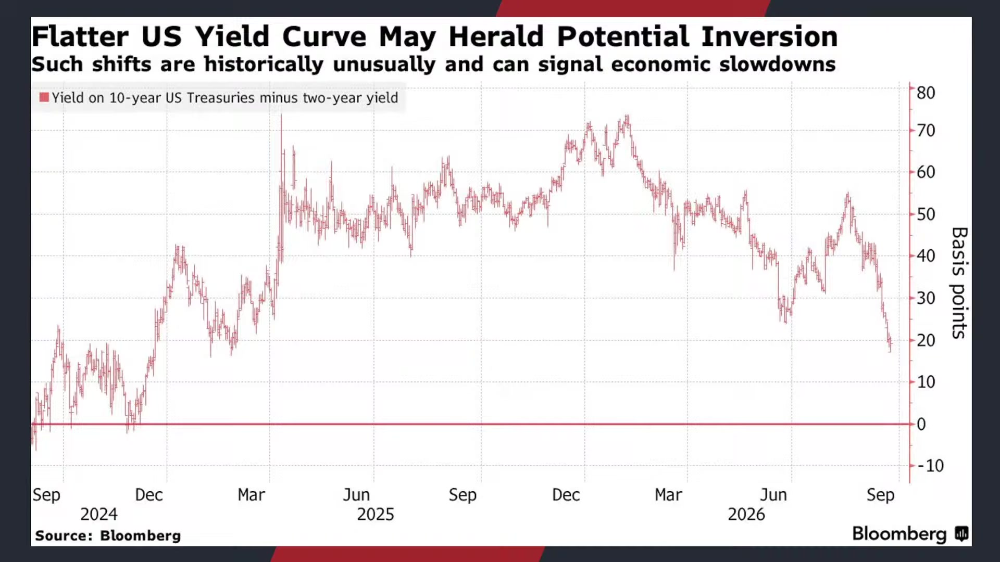

**逐字稿片段：** 美債殖利率曲線又逼近倒掛了 我們看一下2年期和10年期的利差 一度只剩下17個基點左右 這個大概是05年初以來最小的差距哦 目前2年期大概在4.9 10年期已經衝高到5.2了嘛 那更重要的事情是 目前市場反映 可能未來一年還有持續升息的空間 那短天期殖利率在往上升 2年期殖利率就有可能再度超越10年期 最後就殖利率曲線倒掛了 好那雖然過去殖利率曲線倒掛結束 好像已經不反映 資產價格一定要崩盤了 不過過去每一次倒掛 通常壓力都很大嘛 市場會有警訊 從1960年代以來 倒掛曾經出現在最近8次 的美國經濟衰退之前 從1978年來看 2年期和10年期的曲線平均會 在衰退前15個月進入到倒掛 好那這一次很明顯 不是因為真的準備要衰退了 好其實更多是利率預期居高不下 一邊反映整個AI的搶錢潮 另外一邊反映通膨預期 仍然屬於高位 好所以這次情況就是 本來是從年初 聯準會準備要降息 現在已經完全反轉成 為了要壓制通膨 持續升息 如果殖利率曲線真的倒掛 代表的是債市要開始反映聯 總會可能開始把利率升得太高 最終壓抑到需求和經濟成長 那銀行也可能會先受到影響 那我們先看到時候的銀行股變化 金銀行股最近已經開始有所承壓了 好但也說明著 好川普的期待 是完全落空 第一他在殖利率的控制上 對於通膨是束手無策 完全不知道該怎麼辦 而這很明顯了 這種原油價格 尤其是汽油價格 搞得比2022年還要來的高好 這一定會對於中期選舉形成重大災難 那第二件事情就是原本在 去年大家還記得當時的DOGE 就是經濟團隊原本是 希望通過削減赤字 放鬆監管來讓市場 相信美國財政會改善 來壓低長期利率結果呢 實際發展跟原先設想是完全不同

**話題推測：** 討論美債殖利率曲線逼近倒掛的現象。

---

## 00:14:10

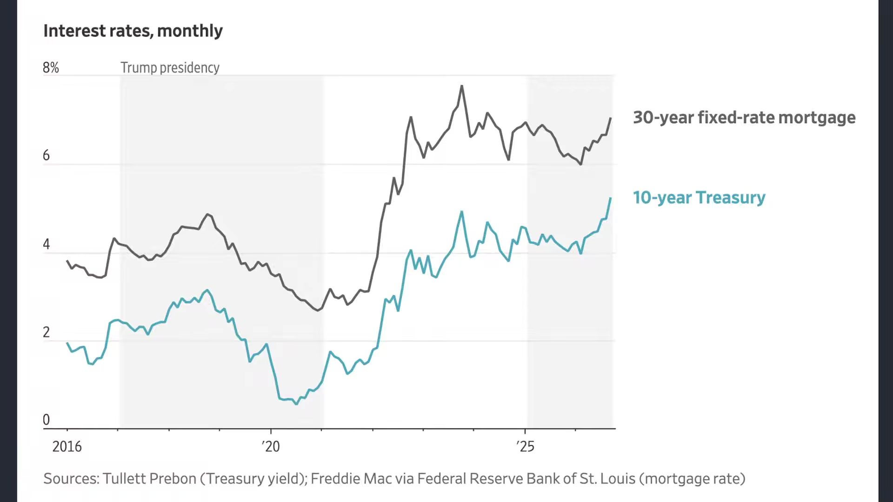

**逐字稿片段：** 美國目前的財政赤字 大概是占GDP的6% 財政部長貝森特之前是333嘛 結果呢現在目標3% 誒次次變6%了 那不是兩倍嗎 所以10年期美債殖利率 也突破了007年以來的新高 房貸利率 好現在又重新再高到接近7% 如果以40萬美元的房貸來看 每個月還款大概又多 增加了3,000美元呢 好當然了 要看一下你是浮動還是固定的 不過至少還是可以看得出來 過往的預期 遭受到重大影響

**話題推測：** 指出美國財政赤字佔GDP比例的具體數字。

---

## 00:14:43

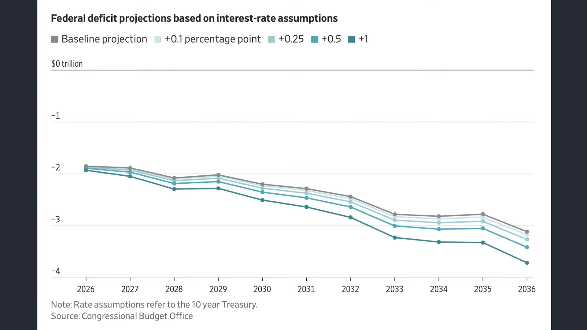

**逐字稿片段：** 美國財政部在上禮拜四哦 也進行了回購的美債 大概也只用了68%左右的額度 拒絕高價報價之後 殖利率又再度衝高 這次是導火線是來自於目前 擴大長天期版的美債回購 那當然了 這一次已經比兩周前了 更進一步的相對比較保守 使用率86% 更早之前曾經一度把 回購額度給用滿了 說明財政部現在做扭轉操作也沒有 太多那種寬鬆或者比較力度的意願

**話題推測：** 探討美國財政部美債回購行動的額度使用情況。

---

## 00:15:17

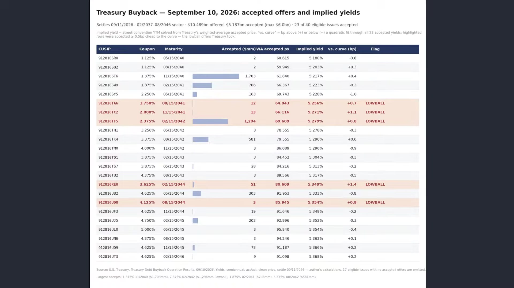

**逐字稿片段：** 加上最近美債又開始做標售了 大概是700億美元的5年期公債 現在都賣短債了 因為要讓市場上有接盤意願吧 誒想不到 明顯低於市場預期 這一次的得標殖利率大概是5.03% 比上一次的4.3%是大幅的跳升 那代表沒有人要這些短債 形成史上第二次大的尾差 標售前的市場預期 殖利率大概是5.001% 最終還比市場預期高了3.1個% 好這說明投資人現在要求非常非常 高的報酬才願意承接這些美債

**話題推測：** 公布美債標售結果，顯示市場對高報酬的要求。

---

## 00:15:52

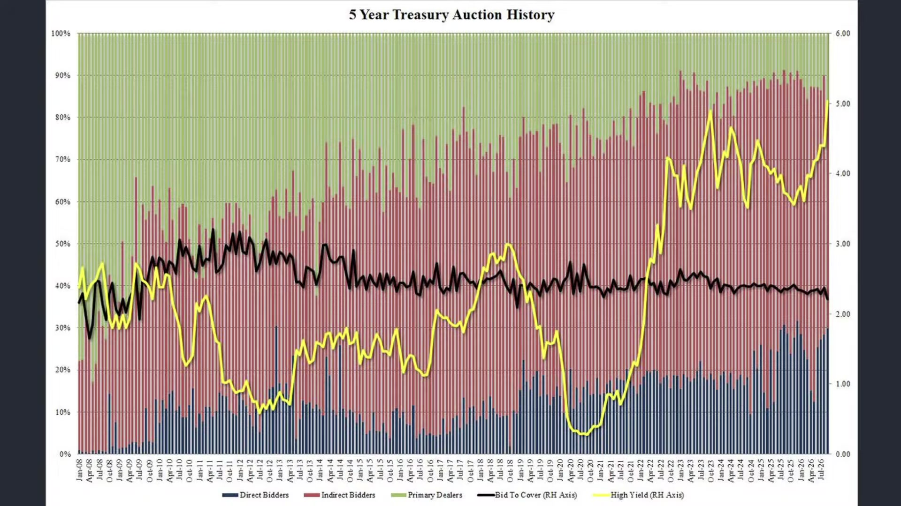

**逐字稿片段：** 從買家結構來看 在十年前 大概海外機構 比如說臺灣央行日本央行 或者一些主權基金 投標占比大概是61% 現在呢只剩下54% 海外投資人 幾乎沒有人想要接美債了好 這個就是現在看到的實質現象 也不能說沒有要接了就是說 現在美債沒那麼值錢了 除非你給我更高的殖利率 5.3也不吸引我 好那要預估 那市場可能要求的是5.5 可能是6% 那美債給你10%報酬 你覺得股票市場一點影響都沒有嗎 也不可能吧 好所以我們必須要看到 美國財政部這一次進行的美債回購 原本的目的之一就是要 改善市場的流動性 但是最終呢 只使用68%的回購額度 原因就在於財政部還是嚴格的遵守 價格的標準呢 不願意為了把額度用完 而接受較低的市場報價 那從程序來看 這樣做其實也沒有什麼太大問題 但是在實際率承壓底下 這個遵守機制和達成政策 目的之間有可能就存在落差 所以我們必須承認呢 規則如果只被機械化的來做實行呢 有可能就會失去規則 原本想要達成的目的 制度當然需要紀律 但是現在 否則反而會讓人 可能遭受到一些濫用 或者說有沒有按照規則做 現在市場上可能需要更多的利多消息 至少財政部的十足表態才 能夠緩解目前的市場壓力 要不然看起來市場上 有對於美債比較悲觀的情緒 那最後還是看你 能不能變通一些規則 既然你想要試出一些力度 那不如勇敢多試出一點吧 不然財政部目前的態度看起來 對於美債價格也毫無幫助 那之前網路上不也有故事嘛 那老闆交代秘書 今天不管誰來 都跟他說我很忙 如果對方說事情很重要 你就回答每個人都這樣說的 哎結果下午老闆的老婆來了 那秘書說不好意思 老闆今天不見任何人 那老闆老婆說我是他老婆耶 秘書點點頭 每個人都是這麼說的 就是政府的原本的回購美債 一開始我們知道 它是為了要改變市場的流動性 但是因為嚴格遵守價格規則 現在財政部不接受比較差的報價嘛 那最後大量的回購額度沒有用完 市場的流動性改善也是非常有限的 殖利率反而會繼續受到承壓 秘書完全照老闆的交代 程序沒做錯 可是跟老闆想要達成的目的產生落差 這就是我面前 目前面臨的挑戰

**話題推測：** 分析美債買家結構變化，特別是海外投資人占比下降。

---

## 00:18:25

**逐字稿片段：** 當然了如果我們從川普目前在 支持率所面臨的壓力 好其實真正大的壓力 美在職利率是一個 但是只是大家要求更高的風險貼水嘛 也不是完全沒有人要 真正最大的壓力哦 還是來自於川普本身 剛才我們聊到的美債 市場價格的拋售壓力 搭配著汽油價格的創高 那在知道這一次民調層面呢 不管是華爾街日報 左媒右媒 陸續所公佈的民調 幾乎都在快速的向下 如果我們細節觀察 在整個9月份所進行的民調 川普目前的工作支持率 大概是37% 這個是1990年以來 總統在期中選舉前 同期相對 中低的水準了 從歷史數據來顯示 拜登在2022年 當時通膨很嚴重哦 4十三% 還比現在川普高 川普第一任任期2018年 有44% 也比現在來的高 奧巴馬在10年和14年分別有46和40% 小布希有64% 06年39% 克林頓1994年是48% 98年是66% 老布希1990年更是達到75% 這說明任何總統在其中選舉 的民調都遠遠比川普目前在 工作支援率還要高非常多哦 那如果細看 6成選民呢 主要還是認為在經濟 政策上讓美國變得更差了 只有33%的受訪者認為 美國的經濟狀況良好 65%是給予相對負面的評價 這一切 我個人的看法是 都是圍繞著通膨 那從選舉角度來看呢 也不能說完全沒有救了 就現在選前倒數 兩個月了嘛哦 應該想倒數一個月了 美國家庭對於財富和購買力 的感受能不能快速的改善 好現在民調38-39%吧 低一點大概33%

**話題推測：** 探討川普（總統）支持率下降的民調壓力。

---

## 00:20:16

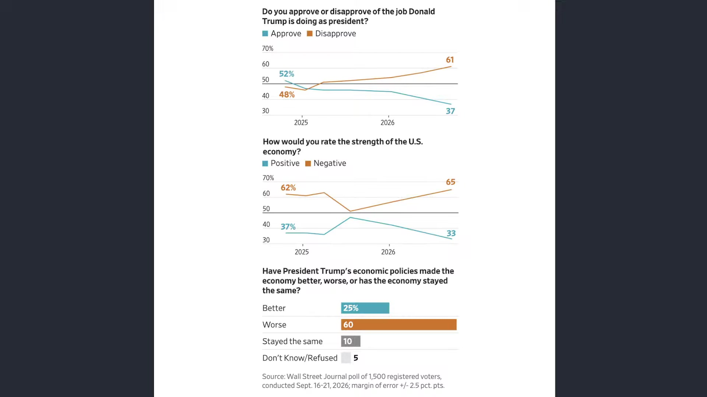

**逐字稿片段：** 民主黨在國會的一般選票大概是以 53%對上41%領胸領先共和黨 那更為關鍵的是34%的 選民認為自己的家庭比 在財務比前一年還來得更加惡化 所以這個時候我們理論上哦 一部分的選民會因為經濟體感 快速地倒向民主黨 但目前還沒有足夠的證據可以下結論 因為 美國現在經濟就很尷尬嘛 體感上是很差沒錯 可是AI正在大爆發 就跟臺灣 臺灣當然有些人覺得這個 所得的差距k型分化壓力很大 但臺灣GDP成長11% 你能夠說經濟差嗎 所以我認為美國的問題 目前並不是典型的經濟蕭條它是 affordable 就是我們講說這個市場的可負擔能力 這樣子的一個變化 就業和消費還是有韌性的 但是房貸接近7% 然後食物和食品價格還是處於高檔 大家就是過的購買力慢慢被侵蝕 所以這個值得很注意 值得注意的地方就是 富裕社會的窮哦 跟真正我們缺乏基本生存物資的窮 它是不同的事情哦 美國人現在的不滿也不是沒有飯吃嘛 就是以前一份薪水可以 負擔的房子汽車醫療 食物和休閒 今天需要付出更高的收入才能夠維持 那也不是沒有錢 但是就是要壓縮一些我的 平時的休閒娛樂消費 好所以這才是我們觀察到的實質現象 以前人常常講說 那美國人呢 也有幾千萬人吃不飽 還要領糧食券嘛 可是你要想想看哦 我們講的吃不飽跟會餓死 他還是有區別的 就你爺爺說 他沒有衣服穿 跟你老婆說他沒有衣服穿 那不同回事 一個是那個年代物資匱乏沒有衣服穿 然後一個是 就過得比較辛苦一點點 所以不管怎麼說 我們現在觀察到的實質跡象就是 還有兩個月的時間呢 可以快速的讓通膨下壓嗎 哎有點壓力 可是至少讓能源資產價格先下跌嗎 第二股票市場繼續的上漲 財富效應還能夠維持目前的消費繁榮 就是雖然 購買力被侵蝕了一點點 可是至少我在財富效應上 的擴張幻覺可以讓我勇敢 地去定下一次連假的機票 唉這個就很重要了唉對對 所以從這樣的一個角度來看 也許民調 預期感沒有想像中來得差 如果每一次都根據民調來看 那川普也不會贏得總統大選了 但至少可以看得出來 它是受到承壓的

**話題推測：** 列出民主黨與共和黨在國會選票中的支持率數據。

---

## 00:22:50

**逐字稿片段：** 好那這時候回過頭看哦 美債殖利率的狂飆 到底美國股市會怎麼走呢 我個人的看法是 也許沒有想像中這麼悲觀 我們從過去幾次的 經驗來做一些推論的

**話題推測：** 重新聚焦美債殖利率狂飆對美股的影響，並引出歷史回顧。

---

## 00:23:01

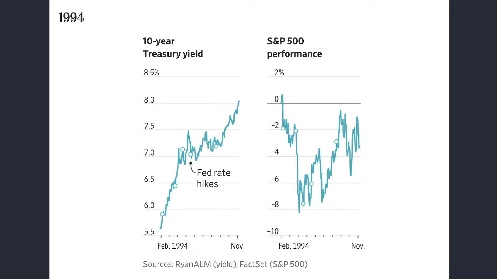

**逐字稿片段：** 94年是美債市場價格最精 點的一次債券大屠殺 當時是2月份的聯準會意外升息 由於市場原先認為通膨還是溫和沒 幾乎沒有做到準備 所以短短40個交易日 10年期美債殖利率直接 上升超過一個百分點 那標普五百指數下跌了大概8% 後來市場發現 市場沒有因為升息而進入到衰退 企業獲利還受到經濟 和景氣的強行支撐 所以美國股市最後收復了跌幅 這是94年的經驗 再看一下99年 99年情況不太一樣 這是債券市場比聯準會更早反應 因為新一輪的預防性 升息開始前的幾個月 10年期美債值利率就 已經上升了一個百分點 美股股市就震盪了幾個月份 然後到2,000年網路泡沫破滅之後 再開始重挫 不過在當時 泡沫破滅之前 市場資金對於科技股 相對而言 買盤就已經開始有所減弱了 所以它其實並不是因為利率升高 泡沫破滅 它其實更多的就是 網路本身就是一場泡沫 太多虛假的公司 再看一下06年 06年當時是國際油價大漲 推升了通膨 美債實際利率跟著升 聯準會也跟著升息 不過美國股市還是 保持有相當大的韌性 它是一直等到07年次貸海嘯爆發之後 才開始往下崩 至少從短期半年內走勢來看 看不出美國股市 有遭受到利率預期升息 所導致的美國股市的重挫 好再來就是16年 16年的部分 這個大家稍微有點感受到了 美債殖利率和美國股市 它是同步走升的 就是來自於 因為市場認為經濟終於正常化 脫離了08年以來的貨幣寬鬆 再來一次最慘烈的就是2022年的 這個就記憶猶深了 2022年比較標準的就是 當時是暴利升息 因為烏俄戰事的影響 全球供給鏈大斷 通膨大幅拉升了 最後估值的削減 不過呢好在兩年之後 美國股市又創下歷史新高了 好那現在回到2026年 美債殖利率升到了接近20年來的高點 聯準會也已經升息一次 但是美國經濟還是維持相當大的韌性 其中一個重要的支撐就是來自於什麼 因為AI正在爆發 所以我們要講的事情就是 並不是美債殖利率的 上升對於股市沒影響 而是它的影響是反映在本益比 那只要獲利上升的速度過快 即便本益比很低 它搞不好股價也在創高 這是第一個角度 那第二件事情就是 所以美債殖利率完全 對於股市沒有影響嗎不會 有一天沒在 你躺著它也給你實發報酬 肯定有影響的嘛 可是問題在於 如果我們對於AI的幻想更高呢 就是以前 5年前美債殖利率給你5% 那是遙不可及的夢了 因為那是無風險利率 可我現在告訴你 AI一年是給你賺20% 30%呢 一樣大家把錢質押 還是買去買股票嘛 這個就是形成市場的預期落差 所以從頭到尾 為什麼美債殖利率現在這麼高 但是美國股市還沒有崩呢 因為從頭到尾 都是市場對於AI的信心 一方面是對於未來的信心 第二方面就算有估值削減 它也反映在基期和本益比身上了

**話題推測：** 回顧1994年債券大屠殺時期美股的表現。

---

## 00:26:10

**逐字稿片段：** 好我們看一下美股市四大指數表現 道瓊指數下跌347點 0.67% 收在51,481點 標普下跌59點 0.77%收在7,683點 納指下跌248點 0.92% 收在26,820點 其實三大指數上禮拜都還在創高之後 稍微做一些拉回而已 也沒有跌這麼重 費半下跌203點 1.6% 收在12,465點 看起來是有一點底部逐步形成了

**話題推測：** 提供美國股市四大指數的最新表現數據。

---

## 00:26:40

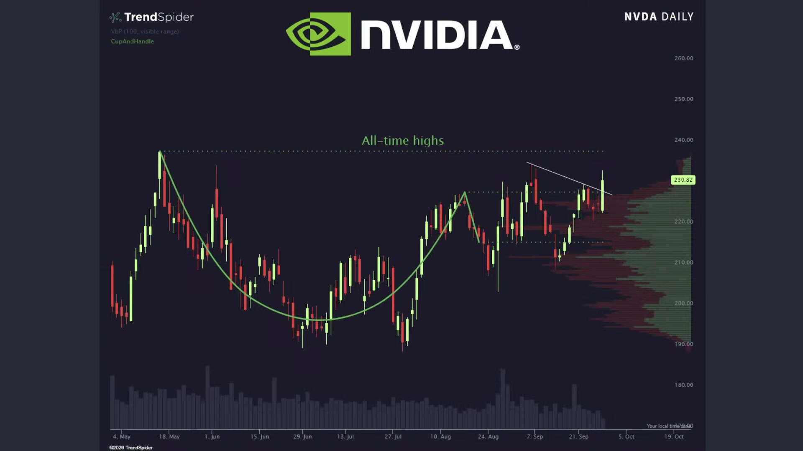

**逐字稿片段：** 事實上輝達雖然還沒有 來到歷史新高 不過從形態上來看 下方的量價買盤還是比較踴躍一點的 也沒那麼容易跌破 甚至如果我們從上方價格來看 好一片晴朗 要突破也不是這麼難的事情 不過這也如同我們過去所講的 由於現在美國股市是 集中到少部分個股當中 所以即便指數再創高 可能體感上還是沒有這麼的明顯 加上這一次川習會之後 我們不看美國股市的反應 我們先看中國股市嘛 好這次在川習會 原本預估美中關係 誒可以稍微緊張局勢稍微降溫 不過呢中國股市在中秋節 首個交易日明顯重挫 說明市場上也沒有 看到太多的利多消息了 滬深300指數是收跌了2.2% 這是創下五周以來的最大單日跌幅 已經碰到 2025年8月份以來的最低水準了 上證指數也下跌了1.7% 好所以你說川習會有多大的 美中全面和解的期待嗎 其實也沒有好 大家就稍微談幾點共識

**話題推測：** 分析輝達（NVIDIA）股價的技術形態與買盤狀況。

---

## 00:27:47

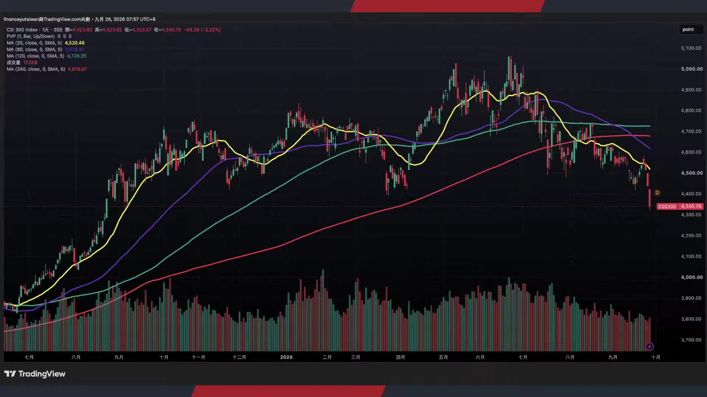

**逐字稿片段：** 如果細節觀察 好在共識層面 好消息是臺灣議題至少沒有納入到 共視覺當中 可能私底下談了 好但是在雙邊關係上 雙方同意互相支持對方辦好居團體 按亞 太經合會 經合會峰會哦 那針對伊朗局勢達成了 目前相對大的共識 伊朗不得發展核武器 不過呢雙方是否代表著在 伊朗局勢會推進速度呢 看起來也無法 經貿層面呢 中國又承諾了會採購 300億美元的美國農產品 那現在美方會啟動 中美貿易委員會和美中投資委員會 雙方可能也會針對另外 300億美元的關稅採取優惠 關於反毒層面呢 中美會聯合偵破更多 的新型毒品的案件 中方也會根據美方的資訊來追查 涉嫌制毒銷往北美的中國公民 那另外一個就是AI AI雙方已經建立好對等對話 美方會以超級智慧 就是超級AI來取代AI的說法 下一次的交流預估在 11月左右來做舉行了 整體共識就是 有一些好消息 也沒什麼太大的壞消息不過呢 基本都符合預期之中了

**話題推測：** 細述川習會達成的共識內容（臺灣議題、伊朗、經貿、反毒、AI）。

---

## 00:29:01

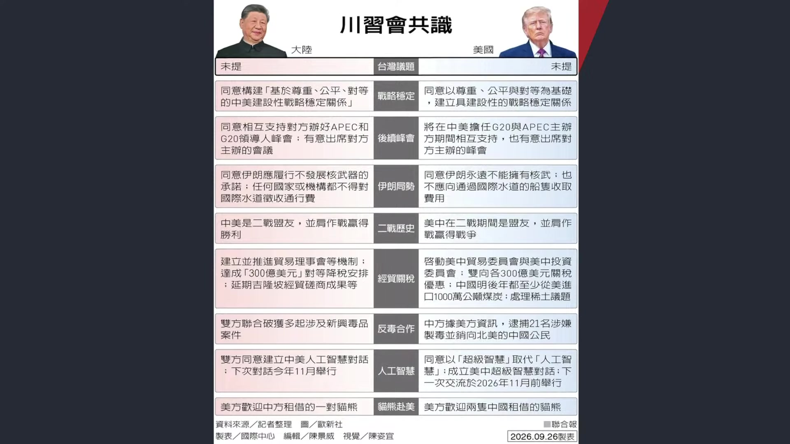

**逐字稿片段：** 那現在要瞭解 即便雙方互相降了 600億美元的商品關稅可是 其實占雙邊的貿易還是很小一部分的 大部分都是來自於一些小部分的 一些玩具啦 或者我們看到廚房用品 節慶的裝飾 那中國涵蓋美國的肉類海鮮鹵製品 也能夠降到一些關稅 所以雙方的關稅戰 目前還在緩步的熄火當中 可是我們也清楚知道 美方大概也理解到 關稅戰打老半天了 基本上只針對高科技產品有效 大多數產品呢 其實並沒有產生多大的效力 中國現在大概一個產品呢普遍呢 現在讓大概認為有40種管道 用不同的國家出口到美國 那美方當然認為 中國商品目前直接進入到美國 平均關稅大概是50%了 只要經歷過低關稅國家 就能夠成功的壓低一些實際稅負 大概可以少至少一半左右 那美方在這個層面呢 看起來也無意監管 做更進一步的一個課征了 主要就還是來自於美中雙方 現在都有一個合理的理由來降溫 中國內需還是比較疲憊一點的那 美方呢需要在期中選舉之前呢 盡可能的讓通膨預期能夠快速的下滑 加上我們也知道 9月份本來要出來的301條款呢誒現在 9月底了還沒有出來 可是IEPA 幾乎已經全面取消 目前IEPA的關稅 預估在今年下半年會 進行大規模的退稅 而這是最高法院的指令 本來這個是美國關稅已經是 美國政府非常重要的收入來源了 那現在看起來 這一批稅收 要大量的償還 可能對於美國的財政壓力 又會形成進一步的拉升 然後這是我們觀察到的實質現象了 但我們還是也可以很清楚知道 川普現在能夠做的 基本上就是壓低能源價格 還有拉台財富效果 股票市場 關稅戰本身到底 對於川普在過去兩年任期 是不是一個加分的作用 很難說 因為美國提高關稅原本是 希望可以保護本國產業 促進製造業回流嘛 但實際效果的看法是 唉它的確增加了投資的增長 但是並沒有因為關稅而讓美國 的財政體制還要來得更好 所以主要還是集中在 投資成果的另外一部分呢 好所以我們必須承認呢 對於其他國家而言呢 那個傷害就真的比較大一點了

**話題推測：** 說明川習會後中美商品關稅鬆綁的具體細節。

---

## 00:31:27

**逐字稿片段：** 我們看幾個國家目前 的平均關稅稅率 臺灣市場的部分 到目前為止 整體而言大概還是6.9% 其實並沒有想像中來的高哦 其他國家 比如說我們看到在歐元區9.8 那日本大概13.5% 南韓大概13.1% 從這件事情就看得出來 大家的關稅 還是比以前高了一個臺階 那大家的出口還是在創高 可是對於真實傳產而言呢 大部分呢 其實還是可以看得出來 遭受到極大的市場壓力 這也說明著美國提高關稅 原本是希望能夠保護本國產業 那製造業能夠回流 製造業是沒有回流了不過呢 AI本地的投資設廠 造成了明目上數據還是非常漂亮 但是你的選擇 對於其他國家的傳產呢 還是造成了一定程度的影響 產生了一些外部成本嘛 而且成本呢 很大程度也不是由做決定的人來承擔 對於國家來說是如此 而對於一個政府來說 它為了保護產業 增加財政收入 或者追求國家的安全而提高關稅 的確 最後繞了一大圈 還是回到國內要承擔相對性的物價 這也給投資朋友做些觀察 就簡單來講就是 你的選擇 一定會產生適度的外部效應 那成本不一定是由做決定的人承擔 那反而大家都承擔更多了 那整個經濟體制 只是靠AI的繁榮 去撐住這一場關稅戰的混亂而已 我前兩天才看到一條新聞 講的是台大

**話題推測：** 比較臺灣、歐元區、日本、南韓等國家目前的平均關稅稅率。

---
