# yutinghaofinance_wM7uDRpaC-g — 關鍵畫面索引

- 來源逐字稿：[yutinghaofinance_wM7uDRpaC-g_GT.srt](yutinghaofinance_wM7uDRpaC-g_GT.srt)
- 影片：https://www.youtube.com/watch?v=wM7uDRpaC-g
- 截圖數：26

## 00:00:36

**逐字稿片段：** 那這次美國股市週二是全面收高 原油價格趨穩的情況底下 公債殖利率也開始回落 讓美國股市 標普五百指數突破了7,800點了 如果我們細看 這一輪已經是今年 標普五百指數第28次創下歷史新高了 美國股市 從過去08年以後 長期就保持在高強度牛市 28次在今年的創下歷史新高 也不是說特別多次了 去年就已經39次了 前年是57次 2022年 當時受到烏俄戰事的影響 也有一次創下新高 21年70次 20年33次

**話題推測：** 美國股市週二全面收高，公債殖利率回落，市場焦點轉向股市整體表現。

---

## 00:01:15

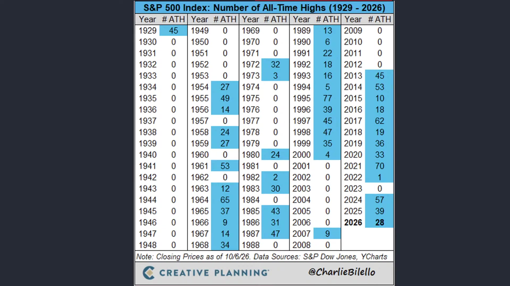

**逐字稿片段：** 雖沒有股市的三代牛格局 從1929年到現在的確 常常在一輪的股災之後 它可能要花3-4年 甚至5-6年來收復失土哦 但是當它收復失土以後 連續多年的創高就變成 了美國股市的三大牛 現在細節來做觀察 如同我們過去所提到的 標普五百指數的確是創下歷史新高了 不過呢真正上漲的股票其實 並沒有想像中還要來的多

**話題推測：** 介紹美國股市的「三代牛」格局。

---

## 00:01:43

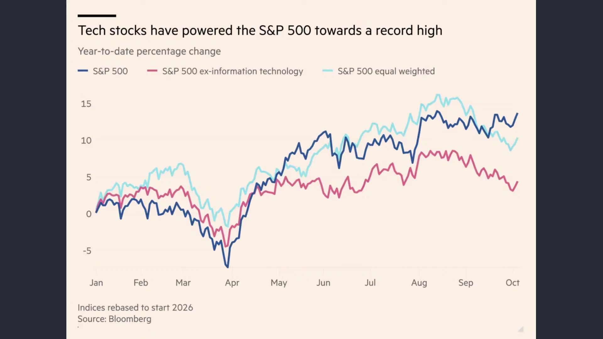

**逐字稿片段：** 如同我們看到內部的分化 從9月中旬低 點以來像是超微 或者我們看到美超微Intel 上漲幅度都來到20%以上 可是呢在部分中小型個股層面 其實賣壓還是相對 來得比較沉重一點了 舉幾個指數來做觀察 一個是昨天我們提到 的標普等權指數 現在距離歷史高點還是低了接近5% 在500家公司當中 成分股大概只有1/3的確從 9月中旬以來是上漲的 有2/3從9月中旬以來 就過去半個月反而是下跌的哦 8月份我們看 公用事業類股跌幅是有接近10% 到現在 非必需類品現在也跌了大概有5% 所以這就是現在市場上最大的矛盾了 從5月底以來 標普五百指數本身只上漲幾個百分點 但是企業獲利卻被上修了21% 所以高殖利率沒有把大型科技股 擠垮的真正原因是什麼呢 就是利率繼續向上 但是財務體值比較高 負債比較高的公司 整體來說在小型股層面 或者說非大型科技股層面 它先撐不住了 可是它不影響到指數的重大傷害 那大型科技股呢 現在反而是獲利持續的做拉升 所以反而讓整體估值 變得越來越便宜 你也沒什麼理由繼續去賣它了 所以如果從高利率來看 不能說是沒有壓力 只是沒有反映在大型科技股當中

**話題推測：** 討論市場內部份化，大型科技股與中小型個股表現差異。

---

## 00:03:09

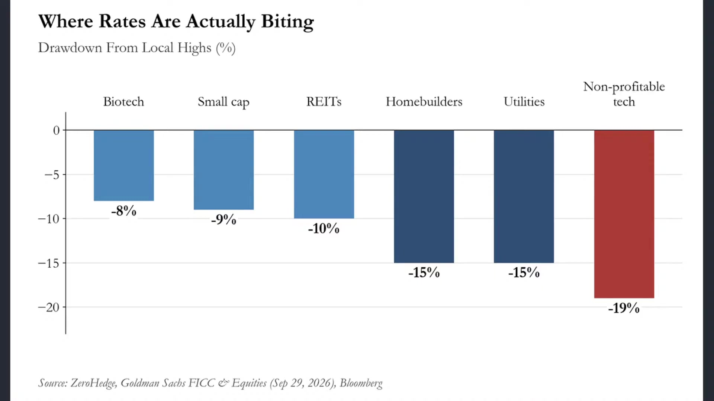

**逐字稿片段：** 現在從高點來做計算 在美股還沒有獲利的科技股 大概是回測平均是19% 房地產和 公用事業類股平均下跌15% REITS下跌10% 小型股跌9% 生技股大概跌8% 好那相對於 我們看到大型科技股目前正在創新高 所以高利率不是說沒有傷害哦 但是就沒有傷到最大的那幾隻 所以一樣 而是大者恒大 我們舉幾檔來說 像是超微的部分 好在昨天股價是上漲2.8% 創下歷史新高價 這一次蘇姿豐禮拜二也是拜會了臺灣 像是台積電的代工的大廠 也表示 會宣佈在臺灣擴大投資 再投資100億美元的供應鏈 把這AMD要變成 TMD了 那這一次主要是來自於AI 以及CPU需求的持續增長 他預估明年可能成長速度會來得更快 所以必須要跟台積電和臺灣 的封裝測試載板等供應鏈來 準備要進行擴產的合作 預估在27年會大幅增加CPU GPU和AI產品的供應呢 那蘇姿豐自己也承認 AMD目前的規劃產能時間 尺度已經完全改變了 以前呢大概就談1到2年了 而而且很長那種談半年突然抽單 不好意思 景氣沒好像沒有如想像中來的好 現在蘇姿豐承認已經拉長到3到5年 希望能夠提前去鎖定晶圓 封裝和其他關鍵的產能 雖然她也強調說 我們也是希望把供應鏈 往不同國家來分散 可是很抱歉 現在最終還是要從臺灣來出貨 所以不如跟臺灣的幾支 供應鏈大佬陸續來做拜會 包括鴻海的劉洋偉董事長 還有台積電等相關的 合作夥伴都是如此

**話題推測：** 討論未獲利科技股、房地產、公用事業、REITS、小型股、生技股的平均回測幅度。

---

## 00:04:55

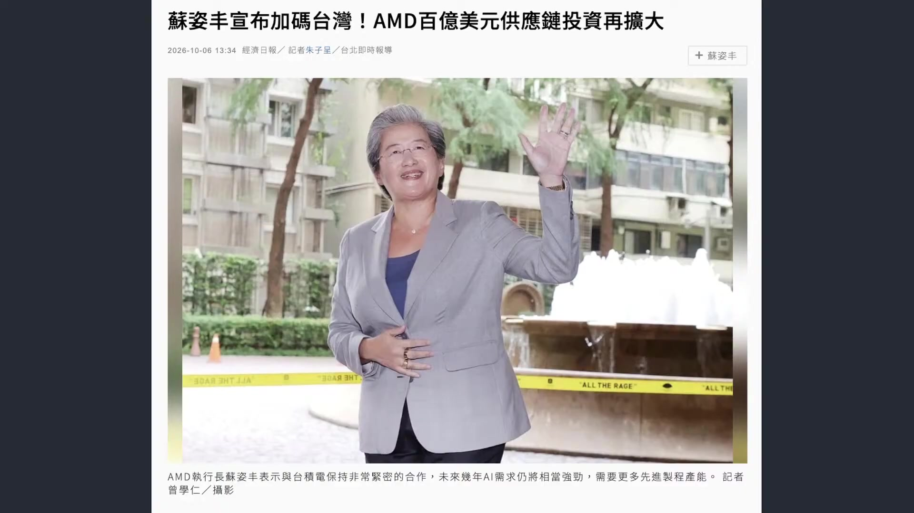

**逐字稿片段：** 那另外他的重要的競爭對手英偉達 好這一次股價一樣創下歷史新高價了

**話題推測：** 轉換到超微的競爭對手英偉達（Nvidia）的股價表現。

---

## 00:05:01

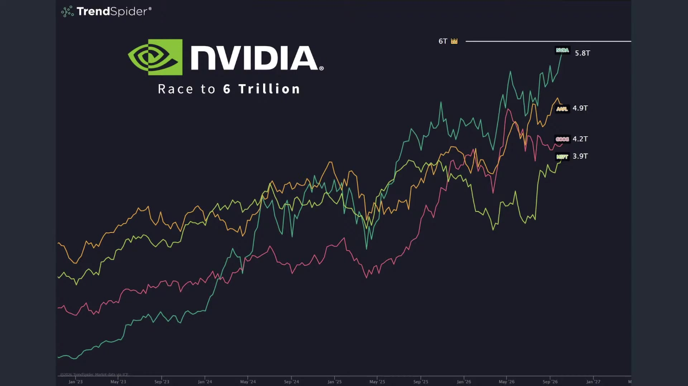

**逐字稿片段：** 市值大概在5.8兆美元左右 那它應該是全球即將第一家 突破到6兆美元企業的市值 這很難想像 前幾年它也不過幾千億美元的市值 然後突破一兆 然後突破兩兆 突破3兆 今年股價上漲 30%嘛 所以今年又增加了1.3兆 現在5.8兆 也是標普五百指數上漲14% 今年以來最大的貢獻者 你要知道今年3月份的時候 輝達是一度下跌11%哦 結果現在漲回來了 市場當時也很擔心說AI 基礎建設到底數千億美元 能否產生足夠的回報 現在到底有沒有回報不知道了 但是輝達的回報肯定是來了 輝達預估在整個27年的 財年營收會大幅增長90% 淨利會接近翻倍 那公司甚至預估在2028年財年 的營收也可以持續增長70% 好這真的很難想像 因為5.8兆

**話題推測：** 英偉達市值達5.8兆美元，接近全球第一家6兆美元企業。

---

## 00:06:00

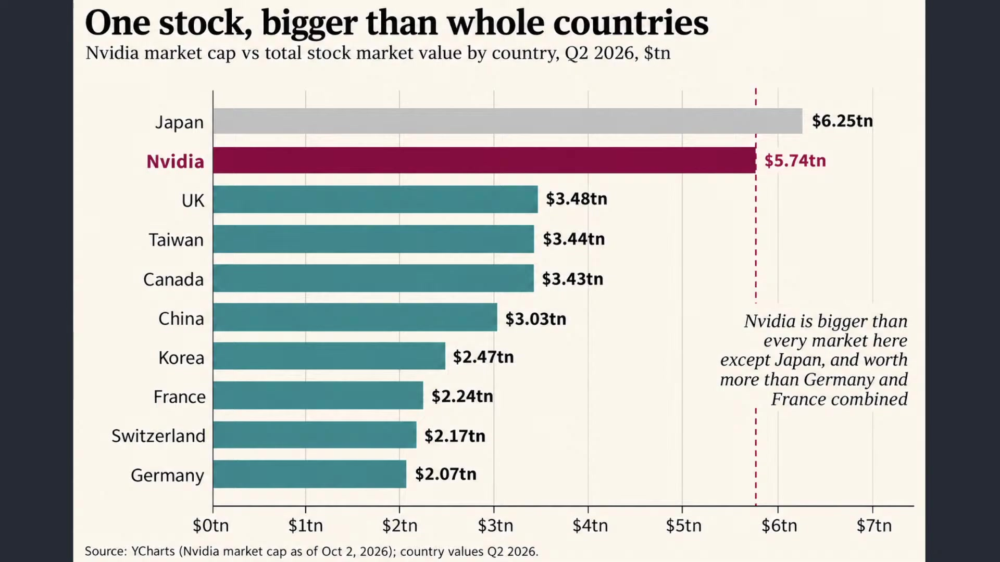

**逐字稿片段：** 你要知道把它拿來跟 幾個國家來做對比哦 現在大概就僅次於日本股市的6.2兆 它已經輝達一家公司的市值 已經比英國股市市值來得高3.48兆 臺灣是3.44兆 加拿大是3.43兆 中國是3.03兆 我們看應該看港股的部分 所以我們看不同市場哦 拿來做不同層面的進行比較 你會發現 投資人現在買賣的已經不 只是單純一家晶片公司 而是一家市值足以超越 中國應該不是了 中國那資料應該有誤 它主要應該反映的是單一指數的變化 可是不管怎麼說了 就我們講的是單一公司的 估值膨脹到國家級的級別 它可能對於全球ETF和資金的影響 越如想像中還要來的大的

**話題推測：** 將英偉達市值與各國股市市值進行對比。

---

## 00:06:48

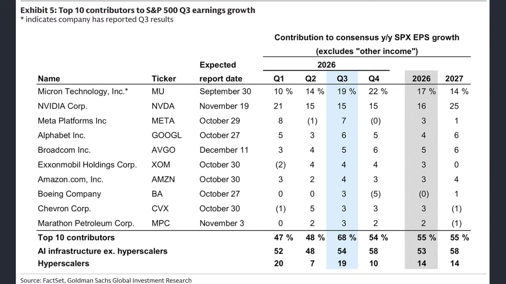

**逐字稿片段：** 其實如果我們從今年 標普五百指數第三季的獲利成長幅度 前十名的貢獻大概已經 包辦68%的獲利成長了 美光大概占了19% 輝達大概占了15% 兩家公司加起來就34%了 Meta加阿發貝和博通再貢獻7%6% 還有5% 所以從這幾隻公司來看 光是半導體 大概就把全球能夠賺到的 錢都已經全部給賺走了 好那重點就來自於 可是英偉達的估值本益比真 的有如同想像中來的高嗎 我們如果是從當前本益比來看 就先不看前瞻 其實我們前瞻 你未來幾個季度輝達賺多少錢 我們大概也知道了嘛 但重點是我們先不用前瞻 就用當前本益比

**話題推測：** 分析S&P 500第三季獲利成長，前十大企業的貢獻比例。

---

## 00:07:34

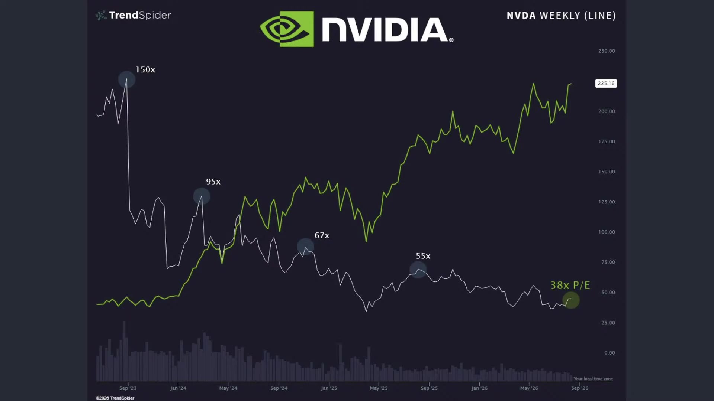

**逐字稿片段：** 當時在2023年的時候 整體本益比大概是150倍 然後到2024年大概是95倍 24年底67倍 25年55倍 到現在38倍 可是呢如果我們以今年年底到明年 年初的前瞻本益比來做估算 現在本益比更低了 大概是多少呢 17.2倍那這個本益比的倍數 它就遠遠低於第一 是今年美伊戰事站市的低點還要來得更低 第二比去年關稅戰還來得更低 第三比23年24年來得更低第四 比烏俄戰事開打時 當時整個2022年的低點都還來得低 差不多 甚至比2020年的新冠疫情都還來得低 好這個就是市值我們看到 的輝達的本益比概況 怎麼會市值都要挑戰5.8兆 都要挑戰6兆了 結果輝達的本益比 居然低到10年的最低呢 當然不是因為股價便宜 是因為市場已經上修了 它的獲利速度 比股價上漲速度實在快太多了 你要知道

**話題推測：** 英偉達歷史本益比數據（2023年150倍、2024年95倍等）。

---

## 00:08:38

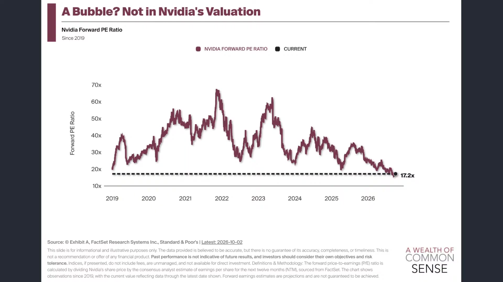

**逐字稿片段：** 今年其實輝達還算是 跑輸整個費半指數 倍半今年漲幅大概是87%左右 美光Marvell Intel上漲都超過200%了所以 英偉達已經是全球市值最大的公司 它現在有90%的營收成長但是 預估本益比還不到18倍 這個就很有趣的局面了 所以全世界最大的公司 它的本益比不像是以前的蘋果這麼高 反而越來越低 就是由於它的獲利增長實在太快了 好那問題就來了 你到底是在買它的股價 還是在買它的基期 其實在今年 Fang的表現呢 輝達如果在裡頭的話 表現已經算差勁的 最大贏家當然是美光了 年初到現在是上漲273% 輝達的部分是29% 蘋果上漲22% Meta是12% 阿發貝Amazon分別上漲11% 10% 微軟大概是10%左右 博通9.4 % 8.3 最弱就是Netflix 今年反而大跌了兩成7 所以其實輝達它頂多 就是作為一個穩盤的角色 有很多其他的費半的 成分股都在向前帶動沖 那AI現在大家泡沫最大的矛盾是什麼 也就陸續出來了 就是所有人都知道風險 但是企業獲利看起來還追得上股價 我們當然知道現在市場上最大的 風險就是史上最大規模的資本支出 投資金額快速膨脹 產業呢也正在快速的重壓這些巨頭 企業之間彼此的投資和採購 那管理層呢也沒有那種 認為投資過度的擔憂 都認為投資太少比投資太多更 危險的這樣的一個相關擔憂 所以這個時候我們就要來做一些比較 好從宏觀數據來做一些追蹤 到底有沒有可能 資本支出還沒有停止 股價我們就先提前見到頂點了呢 如果從數據來看呢 企業資本支出其實反而是落後指標 股價它會優先權反映未來 我們以2,000年來看 2,000年3月份納斯達克見頂的時候 美國的it資本支出年 增幅還是高達15% 企業還在投資 大概是13個月之後 it的支出增長率大概才跌破0 所以換句話說 當年的企業 當年股市也不是等到 企業停止花錢才崩 其實CAPEX 就是股價不漲了 它都還在沖 那現在也有類似警惕的地方 就是今年大概第二季 美國it的資本支出年增幅是19% 比網路泡沫還要更快哦 納斯達克現在也處於高檔嘛 所以我們要提醒的就是 不能說AI泡沫一定要破 是我們不能說因為科技 巨頭還在瘋狂投資AI 所以股市未來就不會見底了 我們要看的是一個市場衡量的關係 股價能不能更進一步地反映一方面 極其的下滑 另外一方面呢 我們預估資本支出 不會說明年就停下來 好這是第一層角度 就本來就會有時間線的關係 那第二層角度 是通常 資本支出什麼時候掉下來呢 通常是股價見頂之後 等個半年到兩年才跟著下完 從幾次的經驗 你像1929年美國的 公用事業泡沫大概落後一年 89年的日本泡沫大概落後是8個月 2,000年是7個月 14年美國葉岩油熱潮大概落後5個月 所以其實 不管怎麼說 都是股價先優先在前面 你也不能夠等到資本 支出真的已經完全地緩了 你才認為本輪行情已經結束了 到時候股票市場搞不好就已經先跌了 所以資本支出本來就是一個落後指標 我們重點還是觀察 股市的情緒 而股市我認為現在最安全 的地方就是剛才提到的 而它本益比就這麼低 低到這麼離譜的地步 你也很難去賣它 而這就是我認為最根本 對於這些科技巨頭 你覺得好像有風險 但是你又覺得好像 不該賣它的主要原因呢 另外一個值得警惕的 地方當然是市場集中度 因為美國現在最大型企業 占整體股市的比重已經 來到40多年來極端高的位階

**話題推測：** 英偉達今年跑輸費半指數的表現，以及其他半導體公司的大幅上漲。

---

## 00:12:43

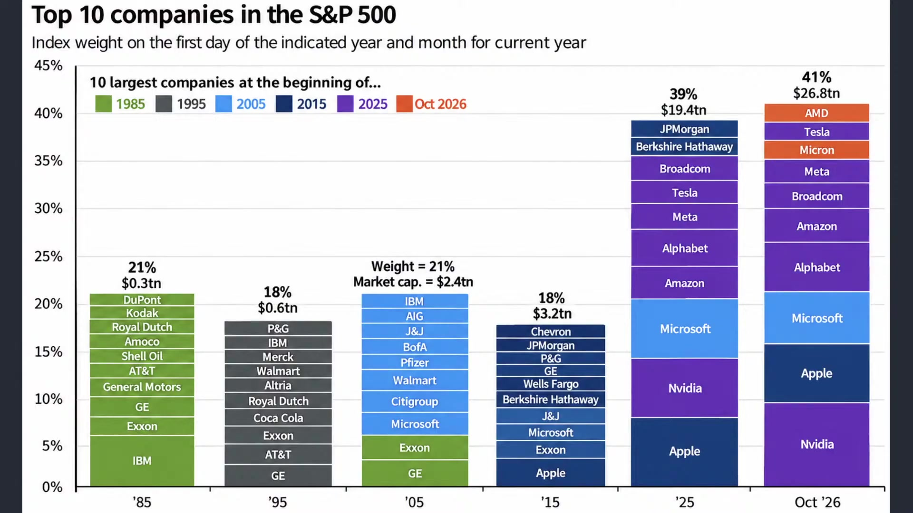

**逐字稿片段：** 標普500前十大的企業好像整體而言 如果我們細看總體權重 大概已經占了整個指數40%左右 這個就比2,000年網路 泡沫27%的高點來得高了 那這好事也壞事哦 好事就是 那你知道 其實握有AI技術的企業 也不過就是這幾家 它不是人人說自己是AI 市場就給你高估值 現在往往是市值最大的 體量最大的 估值稍微也給你比較高一點的 因為你擁有AI的權利 跟那種網路泡沫時代 人人皆稱自己是網路公司 其實有比較大的區別 尤其前十大企業占標普 500未來12個月的獲利預估大概有37 % 也是創下歷史新高 所以它不只是大 它是真的很會賺 好所以從這樣的一個角度來做觀察 這就是典型泡沫一個最大的不同 一般泡沫後期都是股價 上漲速度會超過獲利速度 那現在我們看到的效果是什麼 獲利速度比股價上漲 速度還要來得快哦 哦最後呢 你以前都只能未來會更好來 合理化越來越誇張的估值嘛

**話題推測：** S&P 500前十大企業權重佔指數40%。

---

## 00:13:50

**逐字稿片段：** 那現在估值就沒貴變貴呀 輝達股價創高的時候獲利比 股價創高速度來得快 所以才會導致什麼本益 比居然創下10年新低 這就是最離譜的 股價都已經要挑戰6兆美元了 然後你告訴我本益比 是10年來的新低呀 所以這個就是多空雙方 非常強而有力的證據 空頭可以說 好現在 幾兆美元的科技巨頭綁在一塊 投入到這些基礎建設 不斷的創紀錄 然後又是集中在少數的AI公司 這就是歷史泡沫 那多頭就可以反問了 如果它真的是典型的泡沫 那為什麼最核心市值最大的輝達 它的獲利成長速度 居然比股價還來得快 本益比降到這10年來的低點呢那 我們的態度一直以來都是後者了 這是給投資朋友做的 一些觀察和思考 當然呢我們常常不是不知道答案 我們猜常發生的是搞錯了問題 就是你看輝達市值現在突破 即將挑戰6兆嘛 你第一個直覺都覺得 6兆就很貴了嘛 但這個問題有時候 可能一開始就問錯了 公司市值很大 也不代表股票貴嘛 一家市值100億美元 卻完全不賺錢的公司 也有可能比一家市值只有一兆美元 每年賺幾百億美元的公司來的更貴 那真正我們要觀察的效果是估值 從來都不是市值的絕對數字 你要看的是這家公司是不是大家 相信能夠創造更多的獲利和現金流 所以這個是給大家做的一些啟示 我們常常不是不知道答案 我們是搞錯了問題 現在小學 還有那個健康課嘛 那之前看到兒子回家 問了爸爸一個問題 爸爸 食道跟陰道有什麼區別 完了爸爸面對這個突如其來的問題 有點難為情 不過呢這也是一個性教育的好機會 我就竭盡所能解釋清楚 食道跟都是人體的管道 它們屬於不同的系統 食道是消化系統 連接嘴巴和胃吃飯呢 喝水會進入到胃 是女性的生殖系統 連接身體外部和子宮 那月經流出身體的通道 也是自然生產時寶寶會出生 會經過的一些地方 我講完滿頭大汗 那小朋友很驚恐 怎麼這樣 老師說今天上課應到22人 實到18人呢 就我們常常不是不知道答案 我們是搞錯了問題 你不要問6兆美元是不是太大 你要看的是英偉達的獲利能不能長到 足以支撐6兆7兆甚至更高的市值 這是最有趣的地方 英偉達市值已經比大多數國家 的整體股市市值還要來得高 但它的本益比哦 未來12個月從原本的100倍80倍70倍60倍 到現在不到18倍 創下10年低點 那你回過頭看就會發現 市場上修獲利的速度是遠遠比 股價上漲的速度還要來得更快了 好那當然了 它其實也帶動了整個標普五百指數 某種程度而言 整體估值也不算貴 不只是輝達不貴 其實整個標普 就是由這幾隻大型科技股所組成

**話題推測：** 總結輝達獲利增長速度快於股價，導致本益比創10年新低。

---

## 00:16:51

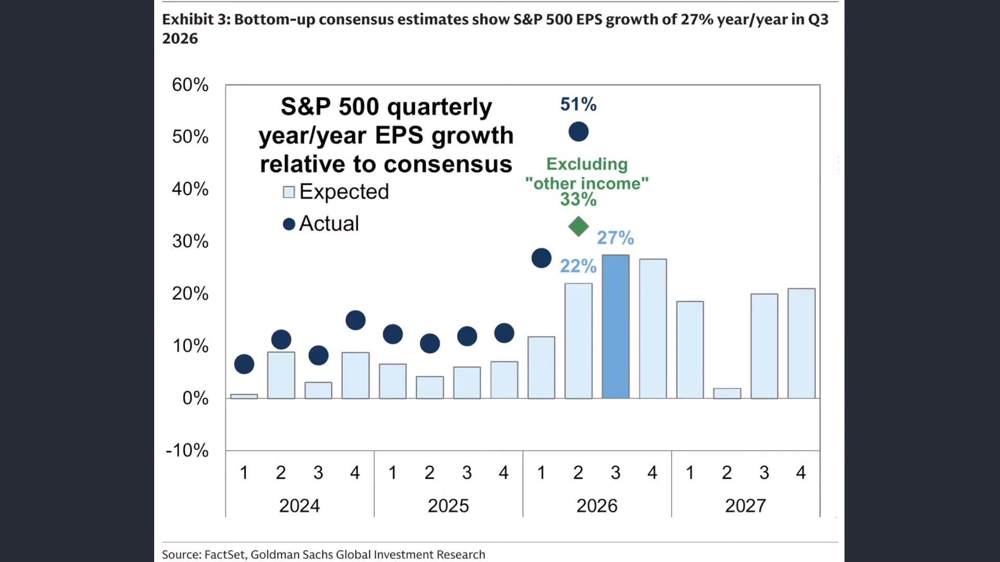

**逐字稿片段：** 整體來看大家就不貴了嘛 從整個26年第三季標普500 因為很快財報季就要開始了 預估年增幅大概是27% 那如果我們從中位數來看 你發現好像就不高了 剩下9% 所以第一件事情呢 其實有非常高強度集中在 少數個股來支撐指數的味道 如果你是投資單一個股 績效跑輸大盤呢 我必須承認呢 今年都很正常 前幾年都也很正常 因為前幾年就是漲大型科技股嘛 就算是 今年呢它可能也是漲少數費半金片股 所以導致你的績效會 有比較大的一個落差 我們假設了 你就算是投資費半裡頭的成分股 你今年平均報酬也要漲幅來到80%以上 才算是跑贏費半喏 好所以這就是投資指數跟投資 個股當中比較大的一個挑戰 尤其有個股在資金分配的一個問題

**話題推測：** 2026年Q3 S&P 500獲利增幅預估。

---

## 00:17:44

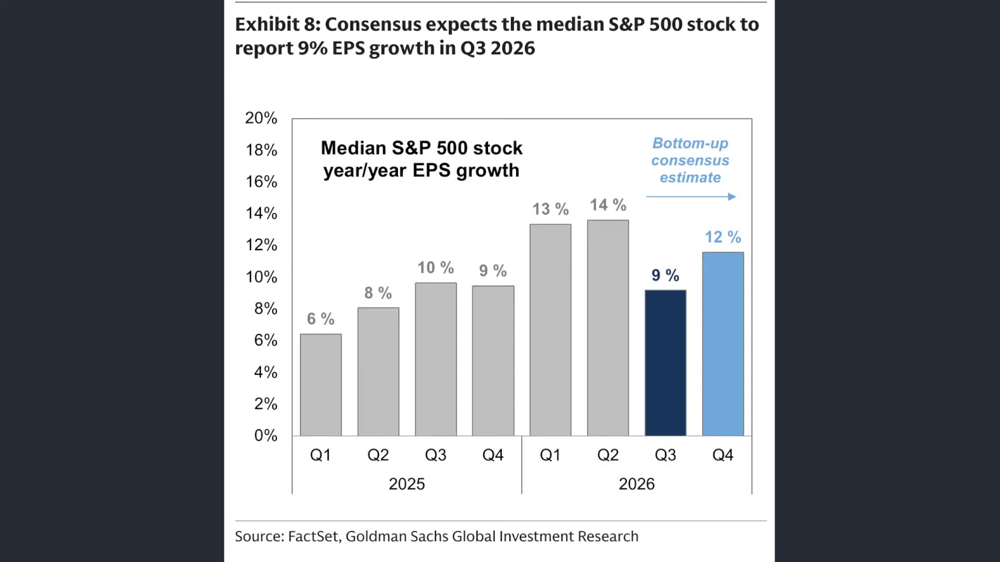

**逐字稿片段：** 所以一個是中位數 一個是平均數 平均數是27 % 中位數只有9 % 所以其實獲利是高強度 集中在少數個股當中 指數很強 但多數股票並沒有想像中來得大 從整體獲利的貢獻值 我們剛才提到嘛 整體獲利增量最大的 基本上就美光 美光大概是占了19 % 前十大企業 輝達是15 然後 Meta是7% 阿發貝是6% 所以就靠這幾隻了

**話題推測：** S&P 500獲利平均數與中位數的差異，顯示獲利高度集中。

---

## 00:18:13

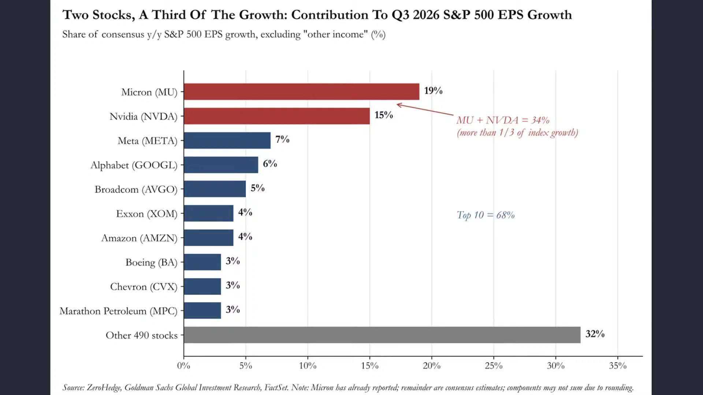

**逐字稿片段：** 那如果我們把產業差距來看 哦那就更離譜了 能源業的每股盈餘 是今年由於受惠於 每一戰士 來到109%是局管 資訊科技是64% 通訊服務和原物料是3*8和3*6 好相對之下哎

**話題推測：** 各產業每股盈餘增長差距，能源業、資訊科技業領先。

---

## 00:18:29

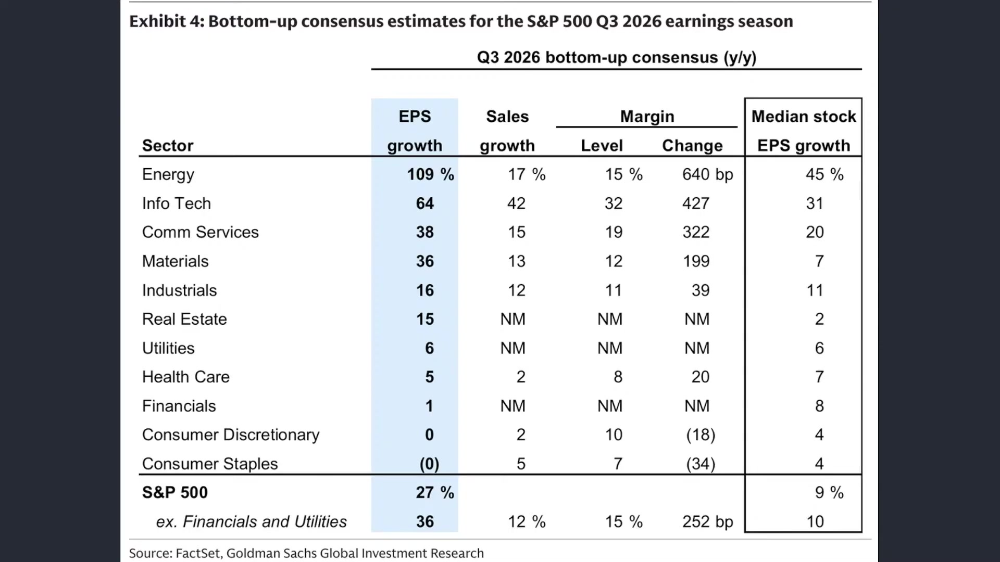

**逐字稿片段：** 你看臺灣跟美國金融業是兩種極端 臺灣金融業今年創高了 結果美國金融業今年只成長1% 最慘的是什麼 是美國的非必須消費是0 民生必須消費 甚至唯服衰退 所以從這樣的一個角度來看 你就可以稍微理解為什麼 道瓊最近好像有點弱了 這美國的實業 美國的實體經濟概況 的確比想像中還要來得差一點呢 對高殖利率有沒有影響 有第一個對於輝達的影響是低本益比 但不代表低股價 第二那高殖利率的影響反映在哪裡呢 其實還是看中小型股 或者美國的實業股 那現在就看到 利率如果維持在這個區間 小型股能不能穩住 就你不要再升高 也許對我來講就是一個利多了嘛

**話題推測：** 美國金融業和非必需消費品產業表現低迷。

---

## 00:19:15

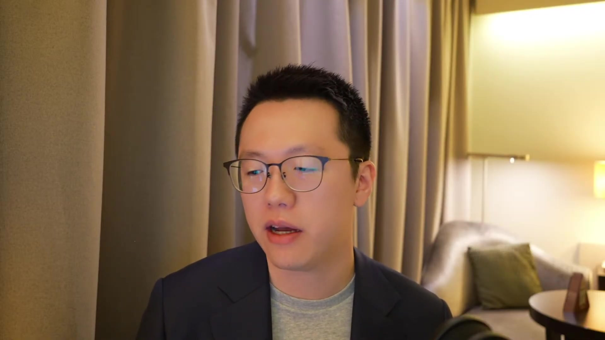

**逐字稿片段：** 羅素2,000的部分呢 這幾天其實嘗試的在陸續站穩了 近期大概已經重新站上了200日均線 我們把它當年線了 至少已經嘗試的突破8月 中旬以來的下降趨勢 而且最近幾個交易日 很明顯反彈幅度也很快 開始跑贏標普五百指數了 現在值得注意的事情就是羅素2,000了 因為它是一個比較明顯的下行通道了

**話題推測：** 羅素2000指數近期走勢及站回均線。

---

## 00:19:39

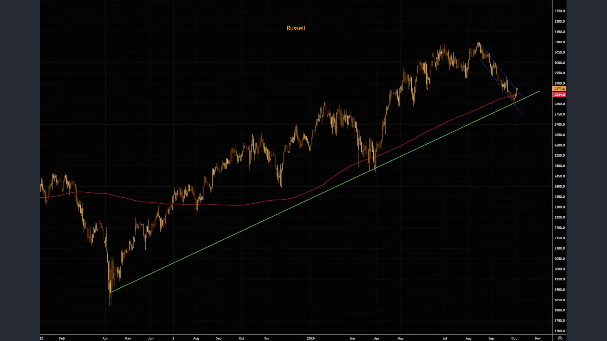

**逐字稿片段：** 那尤其杠杆基金對於小型股的空單呢 現在又來到歷史高點 所以小型股現在不一定需要聯 准會大幅降息才能夠反彈 你只要稍微不小心 急彈你就有可能引發大量的空頭回補 那也許本場的高殖利率 高利率衝擊也許就能夠稍微緩解了 不過呢 這個利率到底預期能夠有多好 這也很難說了

**話題推測：** 槓桿基金對小型股空單來到歷史高點。

---

## 00:20:03

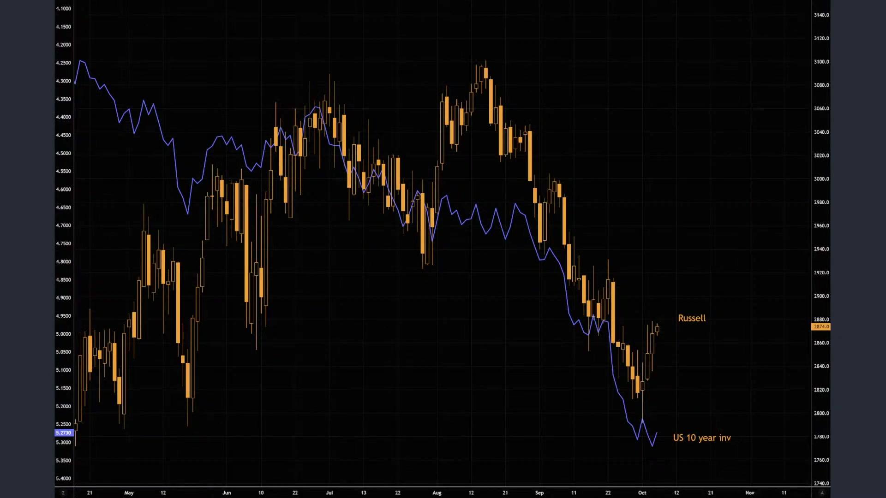

**逐字稿片段：** 因為原油價格雖然最近回跌 布蘭特原油昨天跌3.3% 每桶大概回到98塊左右 西德州跌到87塊 可是它也不代表能源危機解除 還是很貴嘛 尤其現在又有一點外溢的效果 舉例來說

**話題推測：** 原油價格（布蘭特、西德州）回跌，但能源危機未解除。

---

## 00:20:18

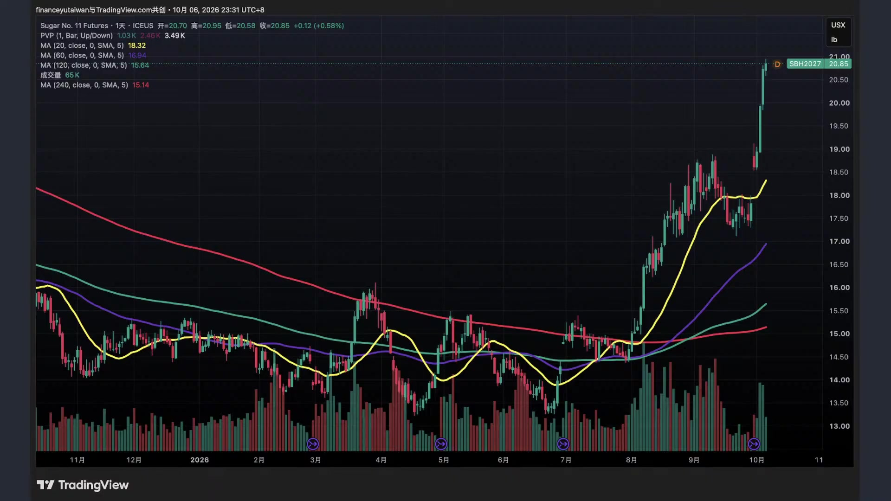

**逐字稿片段：** 你像在今年呢 大宗商品的最為強勢資產呢 開始變成了白糖 白糖在9月底的現貨價格 已經漲幅超過22%了 明顯超越標普五百指數12%的漲幅 那背後是什麼原因呢 就來自於全球供給的快速收緊了 歐盟是受到高溫的影響 預估糖產量會大幅下滑19% 巴西中南部的產量大概也下滑了 接近10％左右 有一部分是來自於聖嬰現象了 巴西印度和泰國大概就占 了全球糖出口的70%左右 那也沒關係 大家少吃糖 這不是重點重點是 原物料價格仍然有顯著的外溢效果 我們從過去單周來看 漲最多的是糖 可是從今年以來 全球原物料價格有很大 一部分還是圍繞著農糧價格 漲最多的還是能源了

**話題推測：** 大宗商品中白糖價格強勢上漲，全球供給收緊。

---

## 00:21:09

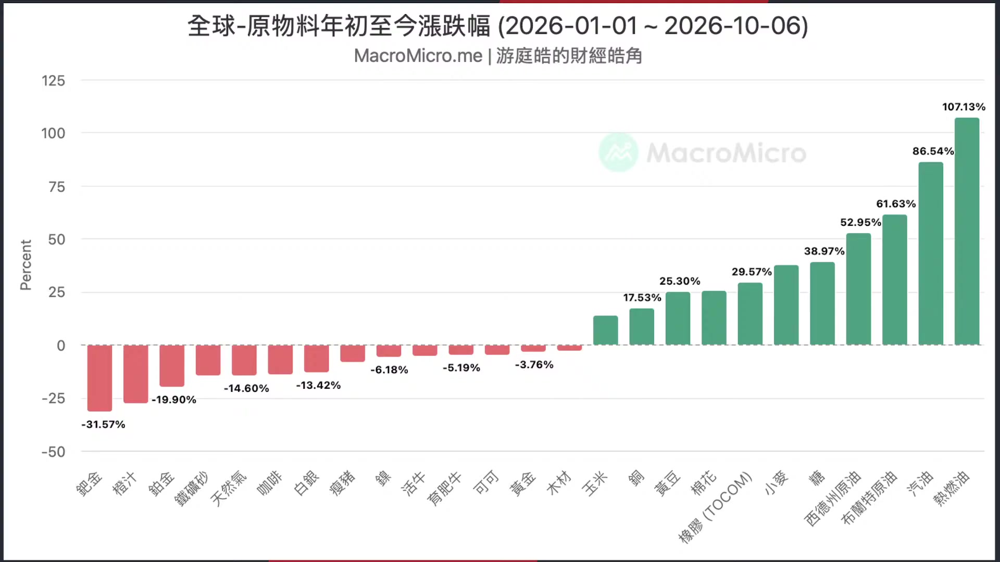

**逐字稿片段：** 像熱燃油漲了107% 汽油今年漲了86% 布蘭特原油漲了61 西德克薩斯52 糖價今年已經漲了三成八了 那 另外我們往下來做延伸 像是銅價黃豆棉花橡膠 其實雖然從大眾資產來看 是一半上漲一半下跌了 可是那個上漲的 幅度相對於下跌幅度 那是兩種極端 這說明今年其實還是有 比較明顯的通脹外溢效果 能不能讓利率預期能夠有效的回落 其實有點難度 說明雖然羅素2,000最近開始反彈了 但是我們看起來更多 是反映持穩的態勢 而並不是 現在預估很有可能接下來 利率預期就能夠全面的消失 這個是值得大家觀察重點的 這也說明著 其實本輪我們看到估值不高的原因 其實就來自於高利率 那高利率的不高 所以導致本益比無法往上做推升 其實對於美國股市也是一件好事 它就是永遠告訴你說 你們不要毫無止境的借錢玩下去 你可以借由各種方式 對於你而言 找到更好的方式來借錢 那應該產生的效果是 排擠其他企業的借錢效果 如果是AI也在借錢 非AI也在借錢 好那麼 就有可能資金不夠或者流動性問題 或者呢它就有泡沫的問題 可是AI一直借錢 而且還把非AI的錢都給借走了 把房貸也給借走了 實業股的錢也給借走了 那我勉強還可以把它 當成一種存量上的轉移 那這場遊戲還玩得下去 好所以 你說現在是全面性的繁榮嗎 好至少從非AI族群來看 也並不是如此

**話題推測：** 列舉熱燃油、汽油、原油、糖價等其他原物料漲幅。

---

## 00:22:52

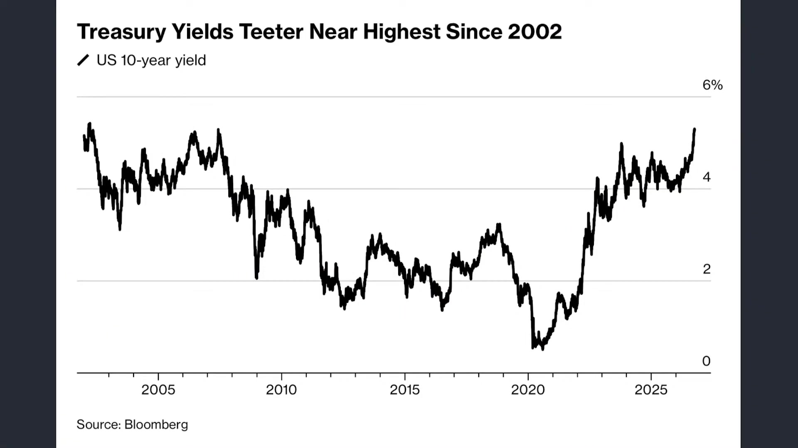

**逐字稿片段：** 我們舉例來說 像Spacex 在昨天正式宣佈 準備再度籌措400億美元 直接來購買英偉達的AI晶片 其中100億美元會來自銀行貸款 300億美元會透過投資 等級債的債券來做籌資 由阿波羅來做主導 交易預估會在27年左右才會完成 那輝達其實 過去我們也看到了 馬斯克早就已經表態說Spacex的 AI運算幾乎是全面押注輝達 尤其看好新一代的Vrubing架構 更值得注意的事情是 哎Spacex6月份才完成公開募股 860億 不到兩周又發行250億 現在又告訴你 我又要發400億 所以它也是瘋狂的搶錢啦 Spacex雖然現在是Triple b 也算是投資等級債 可是到2056年的到期債券 目前價格只剩下面額的85%

**話題推測：** SpaceX宣布籌措400億美元購買英偉達AI晶片。

---

## 00:23:47

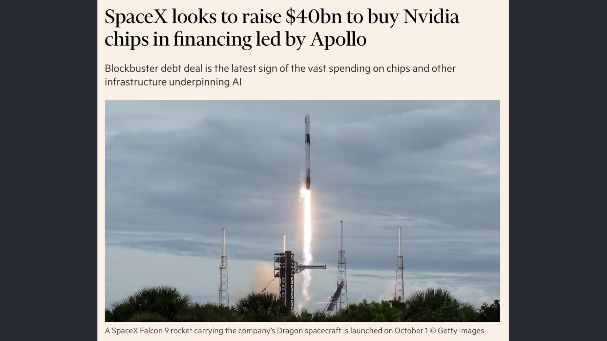

**逐字稿片段：** 殖利率比美國公債高了2.27% 所以等同於他發行的債券 大概都是7-8%的殖利率左右 那信用利差其實差不多 要接近次級債水準了 大家為了搶到這筆錢呢 都給你非常高的回報 好所以其實我們看到這裡 我們也不用太糾結自己到底有沒有 家對AI了 因為世界就很小嘛 你以為別人的問題 其實大家都在同一張網裡頭 你覺得AI估值太高 所以你就不買科技股 你跑去買債券避險 那那現在科技巨頭為了要蓋資料中心 也是為了買GPU大量發債嘛 你買的企業債 你可能就是在替AI融資 你把錢交給退休基金保險公司 你以為做最保守的資產配置 這些機構大概又去 承接科技公司的債券嘛 所以到最後 你以為自己離AI很遠 其實你只是從AI股東換了一個位置 可能變成了AI債權人之類的 最後你發現AI公司的資本支出 輝達的營收 銀行的貸款 基金的部位 你幾乎就全部連在一起了 世界就是這麼小 原來我的錢永遠都已經對賭AI了 好所以這些問題 它是一個大問題 那對於微觀而言 它就不是問題了

**話題推測：** SpaceX債券殖利率比美國公債高2.27%，接近次級債水準。

---

## 00:24:59

**逐字稿片段：** 之前講兩個男的一起打高爾夫嘛 他打到一半 其中一個突然想起外套放在 忘在上一洞 他走回去拿 他走到一半 突然停下來 然後轉身走回到朋友旁邊 那朋友問怎麼了嗎 那男的很尷尬 前面那兩個女人 一個是我老婆 一個是我情婦 現在走過去有點麻煩 他朋友笑了 這有什麼 那我幫你拿吧 哎那朋友往前走哎 結果走到一半他也回來了 那男的問 這又怎麼了 我那朋友沉默了一下 這世界真小 所以大家本來都以為自己 只是站在旁邊看AI的熱潮 有些人選擇不參與嘛 好在你雖然選擇不參與 你大概也參與了 因為世界這麼小 原本你的錢可能也參與其中 不是郭董 不是郭董 甚至你說我連債都不要 我就去買最傳統最防禦性的公司 問題是今天從銀行到工業到電力 你覺得你買的 電力公司跟AI沒有相關嗎 你買的工業公司跟電力沒有相關嗎 你買的零售跟AI沒有相關嗎 大家都在談AI轉型 都在蓋資料中心 增加電力投資 導入AI代理人 更不用講標普五百指數前 十大公司已經占了百 指數的40% 全部都做AI 你根本就無法逃離AI 最後你只是換了一條路 重新繞回AI 好所以這個年代最有趣的地方就是 我們表面上一直在想說 要不要參與本場可能 充滿泡沫的AI行情呢 答案就是 不管你願不願意 只要你還在股市債券退休基金 在這個金融體系裡頭 你多少都已經在這張網裡頭了 你發現這個世界就是這麼小OK 所以這給投資朋友作為思考 好我們看美國股市四大指數表現 道瓊指數上漲253點 0.49% 在51,521點 嘗試的站回半年線 標普上漲44點 零點五八% 在7,818點 創下歷史新高價 納斯達克指數上漲122點 0.45 %在27,599點 歷史新高 費半上漲45點 零點三四%在13,000 217點 其實從目前美國股市估值來看 標普和娜指的創高 其實已經意味著整個大盤算是趨穩了 那現在就看 費半能不能順勢追上 道瓊反而偏弱一點是可以接受的 因為這是屬於成分股的 性質不同所造成的 那當然了 現在市場上就是 又怕AI估值可能會很高 那我們剛已經講了 而本益比其實沒這麼高 你又害怕錯過行情

**話題推測：** 講者開始分享高爾夫球場的幽默故事，作為說明觀點的引子。

---

## 00:27:27

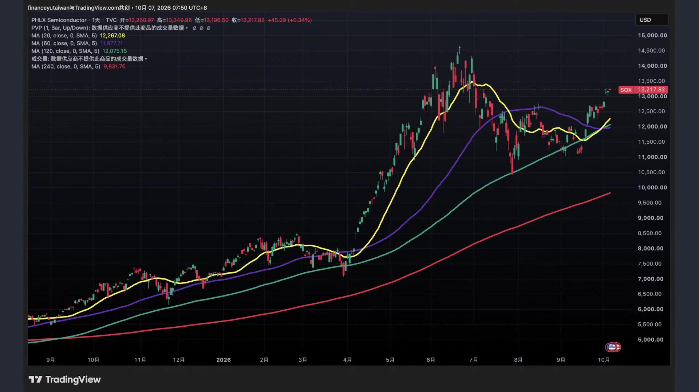

**逐字稿片段：** 那有些人的做法可能 是以科技核心持股 加限期選擇權的方式來做進行 就假設這樣子 你本來想要100% all in大盤 可是你又遇到了一個問題 就如果真的遇到AI泡沫破滅 大盤又跌了3成 已經沒錢加碼了 那你其實可以換另外一種思維嘛 就股票它不一定是 要買整體SPY買大盤 你可以更為集中到可能台股 可能QQQ 可能SOXX這類科技或者半導體型的ETF 因為如果未來美股繼續創高 那AI和科技股有很高的機率 還是會重要的推升力量嘛 那這個時候你就可以有保留現金了嘛 以前會害怕保留現金 那就要落後給大盤績效了 現在就是 那你買科技指數嘛 那你就可以保留10-20%的現金 那波動幅度稍微加大 但是AI股本來就是如此 雖然你沒有100%滿倉 但是你有更高的科技鋪險 去維持上漲的參與度 這就有點類似那個現金選擇權了 好就是 你由於大量集中在這些科技股 讓你沒有完全錯過行情 但如果AI真的充滿了 比較大的一個估值回檔 跌了3成跌了4成了 你手上的現金這個時候就值錢了嘛 因為別人只滿倉 你只能看著它跌那你有 低檔加碼的權利嘛 那而且呢 你的最後總體績效還是有 機會能夠超越整個大盤 因為如果股市創高 那很高的機率還是靠AI嘛 所以現金的價值哦 不能只用今年少賺多少來做衡量 有時候他買的是未來 市場出現極端價格的時候 你還有出手的能力 好這給投資朋友做的一些參考 有些人就想參與想all in 但是又不敢all in 那不敢all in 又怕自己跑輸給大盤 那你就進攻一點的資產 搭配的適度的現金保留 我認為也是一種方式啦

**話題推測：** 探討投資策略：科技核心持股加上選擇權，以平衡風險與收益。

---

## 00:29:14

**逐字稿片段：** 因為我最近 在慕尼黑 因為本來網友都跟我 開玩笑說德鐵真的很常誤點 哎我後來發現真的很常誤點 而且是有一點離譜的 都是晚到30到可能一個小時左右 只要是到郊區的 那後來有一個網友就跟我 分享一個很有趣的做法 叫做德鐵的暗黑兵法 他就是你故意去訂每週五最晚最便宜 然後最容易誤點的ice 這邊就解釋德鐵的票制 德鐵有一種便宜的特別的票 叫Sparpreis 就是你可以把它理解成 早鳥票價格很便宜 代代價都是可能它會有繫結欄位車 你買的是哪一班的ice 你原則上就必須要搭那一班 你不能看到前面有一班車你就提前 唉那我先上去 不能這樣子 那有趣地方就在這邊了 如果你原本預估抵達目的地 可能會延遲20分鐘 以上那在符合得體的規則情況底下 這個繫結欄位車的限制就會解除 就你不用再死守原本那班車了 所以你可能 只花了15歐元 你買了一張限制很多的Sparpreis 就早鳥票 結果碰到大誤點 哎你就取得了未來更多 的改搭的彈性空間 你就可以選擇其他符合 規定的列車來前往目的地 那整套策略最好笑的地方是什麼 就是你最大的風險就是怕它准點 那好在就是它很少准點過 而且通常 那個一誤點都是30分鐘 50分鐘一兩個一兩個小時起跳了 所以正常人買德鐵就最怕誤點

**話題推測：** 講者分享德國鐵路（德鐵）誤點的「暗黑兵法」故事，說明選擇權概念。

---
